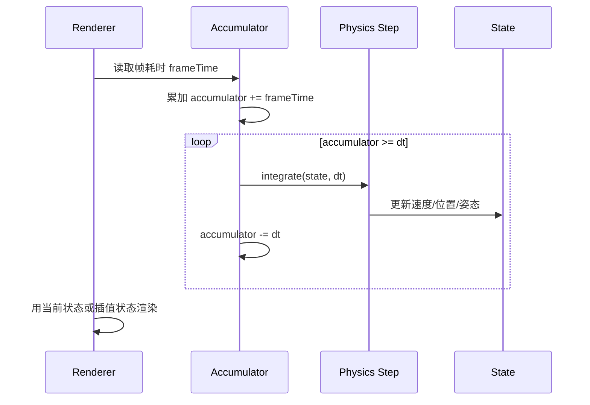
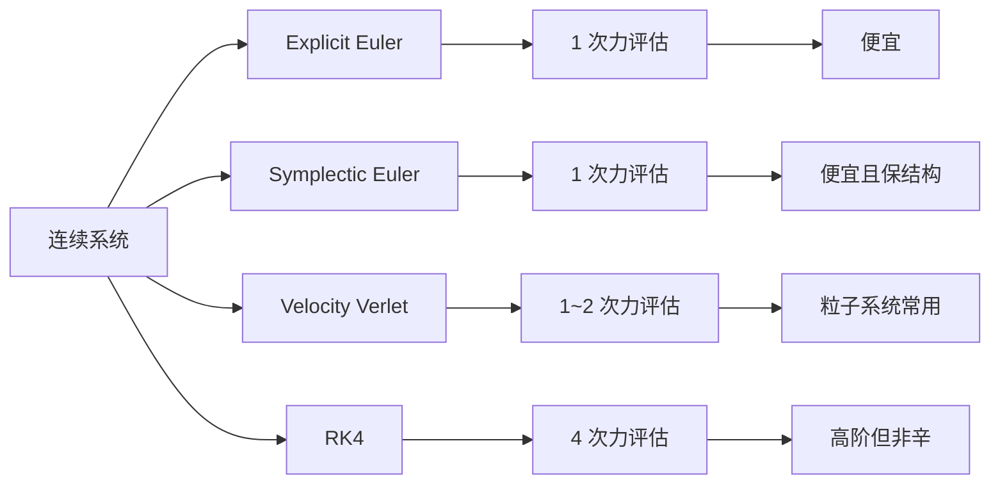
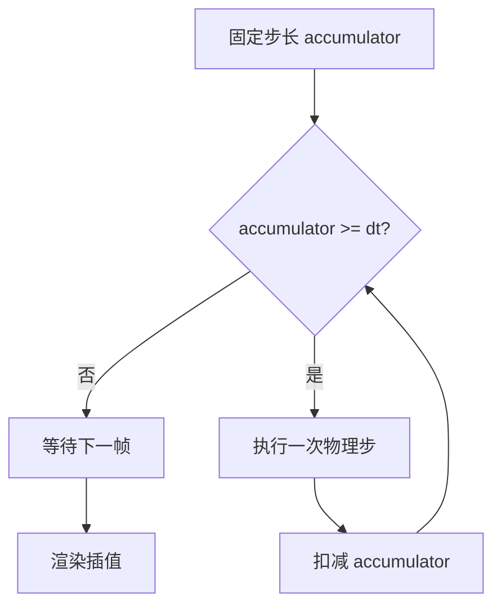

---
title: "游戏与引擎算法 01｜数值积分：Euler、Verlet、RK4"
slug: "algo-01-numerical-integration"
date: "2026-04-17"
description: "把显式 Euler、半隐式 Euler、Verlet 和 RK4 放回游戏物理现场，讲清楚能量漂移、稳定域、固定步长和工程取舍。"
tags:
  - "数值积分"
  - "Euler"
  - "Verlet"
  - "RK4"
  - "固定步长"
  - "辛积分"
  - "游戏物理"
  - "数值稳定性"
series: "游戏与引擎算法"
weight: 1801
---

一句话本质：数值积分不是“把微分方程算出来”，而是用有限步长在精度、稳定性、性能和确定性之间做一笔长期交易。

> 读这篇之前：建议先看 [浮点精度与数值稳定性]()，再看 [刚体动力学]()。前者解释误差如何累积，后者解释这些积分到底在推进什么状态。

## 问题动机

游戏里的物体几乎都在“被积分”。
位置要跟速度走，速度要跟力走，角速度要跟力矩走，骨骼姿态要跟角速度走，摄像机阻尼也在跟时间走。

一旦积分方法选错，症状会很典型。
弹簧会炸，堆叠会抖，角色会慢慢飘，回放会分叉，30fps 和 144fps 的手感会像两个游戏。

这不是“物理太难”，而是离散化本身就会引入偏差。
积分器决定了这笔偏差是局部可控、全局漂移，还是结构上就不守恒。

```mermaid
flowchart TD
    A[连续时间 ODE<br/>x' = f(x,t)] --> B[选步长 dt]
    B --> C[选积分器]
    C --> D1[显式 Euler<br/>便宜但易炸]
    C --> D2[半隐式 Euler / Symplectic Euler<br/>游戏物理常用]
    C --> D3[Verlet / Leapfrog<br/>粒子与布料常见]
    C --> D4[RK4<br/>高精度但非结构保持]
    D1 --> E[状态推进]
    D2 --> E
    D3 --> E
    D4 --> E
    E --> F[能量漂移 / 相位误差 / 稳定性 / 确定性]
```

引擎里真正的问题不是“要不要积分”，而是“该用哪种离散化去保住我最在乎的性质”。
对平台跳跃游戏，也许最重要的是稳定和可重放；对粒子系统，也许最重要的是便宜；对离线工具，也许是精度。

## 历史背景

游戏物理早期最常见的做法，就是直接拿显式 Euler 往前推。
这套方法来自经典数值分析，但在长时间模拟里很快暴露出问题：能量漂移、相位误差、刚性系统发散。

1990 年代到 2000 年初，图形学开始把“离散时间步长”当成系统问题而不是公式细节。
Gaffer 在 2004 年直接指出，变量步长会让行为依赖帧率，而固定步长和 accumulator 才是能把物理与渲染解耦的工程做法。[Gaffer, Integration Basics](https://www.gafferongames.com/post/integration_basics/) 与 [Fix Your Timestep!](https://gafferongames.com/post/fix_your_timestep/) 把这件事讲得非常清楚。

Verlet 的历史则更早。
Verlet 在 1967 年的论文里把“计算机实验”用于 Lennard-Jones 分子系统，离今天的游戏物理很远，但它揭示了一件关键事实：如果你关心的是长时间轨迹而不是单步绝对误差，结构保持往往比高阶泰勒展开更有价值。[APS 原文](https://journals.aps.org/pr/abstract/10.1103/PhysRev.159.98)

Hairer 的几何数值积分视角进一步把这件事说透了。
对哈密顿系统，可变步长通常会破坏辛结构；如果你要长期保能量，结构保持经常比“更高阶”更重要。[ETH 相关页面](https://people.math.ethz.ch/~kurs/pj.02.html)

## 数学基础

把一个一阶常微分方程写成

$$
\dot{x} = f(x,t), \quad x(t_0)=x_0
$$

最简单的离散化就是泰勒展开截断：

$$
x(t+h) = x(t) + h\dot{x}(t) + O(h^2)
$$

于是得到显式 Euler：

$$
x_{n+1} = x_n + h f(x_n,t_n)
$$

对于二阶系统，例如单自由度弹簧振子

$$
\ddot{x} + \omega^2 x = 0
$$

通常改写成一阶系统：

$$
\dot{x} = v,\qquad \dot{v} = -\omega^2 x
$$

这时显式 Euler 先更新位置再更新速度，或者先更新速度再更新位置，结果并不一样。
所谓“半隐式 Euler”或“Symplectic Euler”，就是先更新速度，再用新速度更新位置：

$$
v_{n+1} = v_n + h a(x_n),\qquad
x_{n+1} = x_n + h v_{n+1}
$$

它看起来只是换了两行代码，但对哈密顿系统的长期行为差别很大。
前者会把能量往外推，后者更像在相空间里绕圈。

Verlet 可以从泰勒正反展开相加得到：

$$
x(t+h)=2x(t)-x(t-h)+h^2 a(t)+O(h^4)
$$

Velocity Verlet 常写成：

$$
v_{n+\frac12}=v_n+\frac{h}{2}a_n,\qquad
x_{n+1}=x_n+h v_{n+\frac12},\qquad
v_{n+1}=v_{n+\frac12}+\frac{h}{2}a_{n+1}
$$

RK4 则是四次采样的四阶方法：

$$
\begin{aligned}
 k_1 &= f(x_n,t_n) \\
 k_2 &= f(x_n+\tfrac{h}{2}k_1,t_n+\tfrac{h}{2}) \\
 k_3 &= f(x_n+\tfrac{h}{2}k_2,t_n+\tfrac{h}{2}) \\
 k_4 &= f(x_n+h k_3,t_n+h) \\
 x_{n+1} &= x_n + \frac{h}{6}(k_1+2k_2+2k_3+k_4)
\end{aligned}
$$

阶数高，不代表长期更适合游戏。
RK4 的局部精度高，但它不是辛方法，长时间能量通常会慢慢漂。

### 线性稳定性看法

对测试方程

$$
y'=\lambda y
$$

显式 Euler 的放大因子是

$$
g(z)=1+z,\qquad z=h\lambda
$$

当 $\lambda=i\omega$ 时，

$$
|g(i h\omega)|=\sqrt{1+h^2\omega^2}>1
$$

所以纯振荡系统下，显式 Euler 对任何非零步长都会向外螺旋。

半隐式 Euler 对同一个系统会形成有界轨道，稳定区间大致落在

$$
0 < h\omega < 2
$$

这就是它在游戏物理里远比显式 Euler 更常见的根本原因。

## 算法推导

游戏引擎里，积分不是孤立发生的。
先有外力和碰撞响应，再有速度积分，最后是位置更新和约束修正。

最稳妥的做法，是把“真实时间”翻译成“固定仿真步”。
这样做不是为了教科书上的整齐，而是为了把误差上界变成可预算的常数。



这个循环的关键，是把“每帧多少次物理步”从渲染节奏里剥离出来。
只要你愿意付出一个插值层，物理就能在固定 `dt` 下稳定运行。

从工程角度看，积分器的选择顺序通常是这样的：

1. 先问系统是不是哈密顿型，能不能接受结构保持。
2. 再问是否需要严格固定步长，尤其是联机和回放。
3. 再问误差预算，决定是 Euler、Verlet 还是 RK4。
4. 最后才问 CPU 预算。

这就是为什么游戏里常见的不是“最高阶方法”，而是“足够稳的低阶方法 + 正确的步长管理”。

## 算法实现

下面这份实现把四种常见积分器放在同一个接口里。
它不是演示代码，而是能直接嵌到引擎层的最小骨架。

```csharp
using System;
using System.Numerics;

namespace GamePhysics;

public readonly record struct ParticleState(Vector3 Position, Vector3 Velocity);

public interface IAccelerationField
{
    Vector3 EvaluateAcceleration(in ParticleState state, float time);
}

public static class Integrators
{
    public static ParticleState ExplicitEuler(in ParticleState s, float time, float dt, IAccelerationField field)
    {
        Vector3 a = field.EvaluateAcceleration(in s, time);
        Vector3 nextPos = s.Position + s.Velocity * dt;
        Vector3 nextVel = s.Velocity + a * dt;
        return new ParticleState(nextPos, nextVel);
    }

    public static ParticleState SemiImplicitEuler(in ParticleState s, float time, float dt, IAccelerationField field)
    {
        Vector3 a = field.EvaluateAcceleration(in s, time);
        Vector3 nextVel = s.Velocity + a * dt;
        Vector3 nextPos = s.Position + nextVel * dt;
        return new ParticleState(nextPos, nextVel);
    }

    public static ParticleState VelocityVerlet(in ParticleState s, float time, float dt, IAccelerationField field)
    {
        Vector3 a0 = field.EvaluateAcceleration(in s, time);
        Vector3 halfVel = s.Velocity + 0.5f * dt * a0;
        Vector3 nextPos = s.Position + dt * halfVel;

        var predicted = new ParticleState(nextPos, halfVel);
        Vector3 a1 = field.EvaluateAcceleration(in predicted, time + dt);
        Vector3 nextVel = halfVel + 0.5f * dt * a1;
        return new ParticleState(nextPos, nextVel);
    }

    public static ParticleState RungeKutta4(in ParticleState s, float time, float dt, IAccelerationField field)
    {
        Vector3 f1Pos = s.Velocity;
        Vector3 f1Vel = field.EvaluateAcceleration(in s, time);

        ParticleState s2 = new(s.Position + 0.5f * dt * f1Pos, s.Velocity + 0.5f * dt * f1Vel);
        Vector3 f2Pos = s2.Velocity;
        Vector3 f2Vel = field.EvaluateAcceleration(in s2, time + 0.5f * dt);

        ParticleState s3 = new(s.Position + 0.5f * dt * f2Pos, s.Velocity + 0.5f * dt * f2Vel);
        Vector3 f3Pos = s3.Velocity;
        Vector3 f3Vel = field.EvaluateAcceleration(in s3, time + 0.5f * dt);

        ParticleState s4 = new(s.Position + dt * f3Pos, s.Velocity + dt * f3Vel);
        Vector3 f4Pos = s4.Velocity;
        Vector3 f4Vel = field.EvaluateAcceleration(in s4, time + dt);

        Vector3 nextPos = s.Position + (dt / 6f) * (f1Pos + 2f * f2Pos + 2f * f3Pos + f4Pos);
        Vector3 nextVel = s.Velocity + (dt / 6f) * (f1Vel + 2f * f2Vel + 2f * f3Vel + f4Vel);
        return new ParticleState(nextPos, nextVel);
    }
}

public sealed class GravityAndDrag : IAccelerationField
{
    private readonly Vector3 _gravity;
    private readonly float _drag;

    public GravityAndDrag(Vector3 gravity, float drag)
    {
        _gravity = gravity;
        _drag = MathF.Max(0f, drag);
    }

    public Vector3 EvaluateAcceleration(in ParticleState state, float time)
    {
        _ = time;
        return _gravity - _drag * state.Velocity;
    }
}

public sealed class FixedStepSimulation
{
    private readonly IAccelerationField _field;
    private ParticleState _state;
    private float _time;
    private float _accumulator;

    public FixedStepSimulation(IAccelerationField field, ParticleState initialState)
    {
        _field = field;
        _state = initialState;
    }

    public ParticleState CurrentState => _state;

    public void Tick(float frameTime, float fixedDt)
    {
        if (fixedDt <= 0f)
            throw new ArgumentOutOfRangeException(nameof(fixedDt));

        frameTime = MathF.Max(0f, frameTime);
        _accumulator += frameTime;

        int guard = 0;
        while (_accumulator >= fixedDt)
        {
            _state = Integrators.SemiImplicitEuler(_state, _time, fixedDt, _field);
            _time += fixedDt;
            _accumulator -= fixedDt;
            if (++guard > 8_192)
                throw new InvalidOperationException("Physics step spiral detected.");
        }
    }
}
```

## 结构图 / 流程图





## 复杂度分析

| 方法 | 每步力评估次数 | 时间复杂度 | 空间复杂度 | 备注 |
|---|---:|---:|---:|---|
| 显式 Euler | 1 | $O(1)$ | $O(1)$ | 最便宜，但振荡系统会外螺旋 |
| 半隐式 Euler | 1 | $O(1)$ | $O(1)$ | 游戏物理最常用 |
| Verlet | 1~2 | $O(1)$ | $O(1)$ 或 $O(1)$ + 历史位 | 需要缓存上一位置或中间速度 |
| RK4 | 4 | $O(1)$ | $O(1)$ | 代价最高，长期能量未必最好 |

如果把它们放进整套物理引擎，真正的主项不在积分，而在接触检测和约束求解。
但积分器决定了后续求解器要为多少数值噪声买单。

## 变体与优化

1. `Symplectic Euler` 适合大部分实时游戏物理。
2. `Velocity Verlet` 适合粒子、布料和分子系统。
3. `Leapfrog` 常用于天体和可逆系统，和 Verlet 本质接近。
4. `RK2 / RK4` 适合离线计算、轨迹预估、编辑器工具，不适合高强度接触堆叠。
5. `Adaptive RK45` 适合误差可控的科学计算，不适合强调确定性的联机游戏主循环。

工程优化通常不是换更高阶，而是：

1. 固定步长。
2. 限制最大追赶步数。
3. 只在必要时做子步进。
4. 对高频系统单独做局部积分。

`Time.maximumDeltaTime`、积分类 accumulator 和物理子步进，本质上都是在限制最坏情况。
最坏情况才会决定玩家是否看到“抖一下”。

## 对比其他算法

| 算法 | 优点 | 缺点 | 适合场景 |
|---|---|---|---|
| 显式 Euler | 实现最简单、每步便宜 | 能量漂移严重、纯振荡系统不稳定 | 教学、极简原型 |
| 半隐式 Euler | 便宜、稳定、接近辛结构 | 二阶精度有限 | 游戏物理、实时刚体 |
| Verlet / Leapfrog | 长期轨迹稳定、时间可逆 | 难直接处理速度依赖力 | 粒子、布料、天体 |
| RK4 | 单步精度高 | 4 次采样，长期能量不一定更好 | 离线工具、轨迹预测 |

## 批判性讨论

RK4 不是“显式 Euler 的升级版”。
它更像一把精度更高的尺子，但这把尺子不保证你量出来的哈密顿系统还保形。

对游戏物理来说，很多场景真正需要的是：
固定步长、可控误差、稳定接触、可重放。
这些目标和“单步高阶”不是同一个优化方向。

Verlet 也不是万能药。
它对速度依赖力、阻尼、约束耦合和复杂接触并不总是最顺手，工程上通常还得靠速度更新、约束投影或专门的求解器补位。

变量步长最危险。
一旦步长跟帧率绑定，你不仅会看到物理行为随平台变化，还可能把确定性回放、联机同步和数值稳定一起打坏。

## 跨学科视角

从力学角度看，半隐式 Euler 更接近保留相空间结构的离散映射。
从几何数值积分角度看，真正重要的是辛形式、守恒量和长期误差，而不是“是否是四阶”。

从信号处理角度看，固定步长像固定采样率。
一旦采样率乱跳，别说相位，连重建出的轨迹都会变形。

从分布式系统角度看，固定步长也是一种“节拍一致性”。
联机、回放、录制和裁判逻辑都依赖同一节拍，否则系统状态会像无共识节点一样分叉。

## 真实案例

Box2D 官方文档直接写明了两件事：它用 `Semi-implicit Euler` 近似积分微分方程，也用 Gauss-Seidel 近似求解约束。[Box2D FAQ](https://box2d.org/documentation/md_faq.html) 和 [Box2D Simulation](https://box2d.org/documentation/md_simulation.html) 都有明确说明。
这不是实现细节，而是它的数值策略。

Box2D 3.x 的源码树里，和这件事直接相关的文件包括 `src/body.c`、`src/physics_world.c`、`src/contact_solver.c`。[repo tree](https://github.com/erincatto/box2d/tree/main/src)
前者负责状态推进，后者负责世界步进与接触求解。

Bullet 官方仓库同样把动力学、约束求解和世界步进拆在不同模块里，`BulletDynamics/Dynamics/btDiscreteDynamicsWorld.cpp`、`BulletDynamics/Dynamics/btRigidBody.cpp`、`BulletDynamics/ConstraintSolver/btSequentialImpulseConstraintSolver.cpp` 都是核心路径。[bullet3 repo](https://github.com/bulletphysics/bullet3)

PhysX 官方仓库则继续把 rigid body、constraint、solver 与 task-based step 分离，便于在 CPU / GPU / 多线程环境里切换实现。[PhysX repo](https://github.com/NVIDIAGameWorks/PhysX)

## 量化数据

显式 Euler 对纯振荡系统的放大因子是

$$
|g| = \sqrt{1 + h^2\omega^2}
$$

如果取 $h\omega=0.1$，那么每步能量大约乘上

$$
1 + h^2\omega^2 = 1.01
$$

60Hz 下跑 10 秒，相当于 600 步，能量放大约

$$
1.01^{600} \approx 396
$$

这就是为什么显式 Euler 在弹簧和摆系统里会“慢慢炸开”。

RK4 每步要做 4 次力评估，半隐式 Euler 只要 1 次。
如果你的力场一次评估很贵，RK4 的成本就是直接的 4 倍；如果你的力场还要扫碰撞、算关节和查环境，那 4 倍会更明显。

## 常见坑

1. 把 `position += velocity * dt; velocity += acceleration * dt;` 当成“没差别的写法”。
这其实是显式 Euler，它对振荡系统的能量行为和半隐式 Euler 完全不同。改法是先更新速度，再用新速度更新位置。

2. 用渲染帧时间直接推进物理。
这会让行为跟帧率绑定，回放和联机也会漂。改法是把物理放进固定 `dt` accumulator。

3. 期待 RK4 在长期接触系统里一定更稳。
它单步误差更低，但不保辛结构。改法是把它放到离线工具，或者只用在非接触、短时高精度路径。

4. 让一个大步长同时承担积分和碰撞修正。
这会把接触穿透、约束修正和数值误差混在一起。改法是固定步长 + 子步进 + 分离的约束求解。

## 何时用 / 何时不用

适合用半隐式 Euler 的情况：
实时游戏物理、堆叠、关节、车辆、角色控制、网络同步主循环。

适合用 Verlet 的情况：
粒子、布料、绳索、轨迹平滑、某些可逆系统。

适合用 RK4 的情况：
编辑器工具、离线模拟、轨迹分析、短时高精度预测。

不适合用变量步长直接推进主物理：
联机回放、确定性战斗、堆叠稳定性要求高、跨平台一致性要求高。

## 相关算法

- [刚体动力学]()
- [浮点精度与数值稳定性]()
- [约束求解：Sequential Impulse 与 PBD]()
- [SAT / GJK：窄相碰撞检测]()
- [AABB Broad Phase]()

## 小结

显式 Euler 便宜，但会把能量往外推。
半隐式 Euler 是游戏物理的默认答案，因为它把稳定性、性能和工程复杂度放在了一个更合理的平衡点上。

Verlet 适合强调轨迹和几何结构的系统。
RK4 适合强调单步精度的系统，但不该被误当成实时物理里的“万能升级版”。

真正决定一个引擎物理手感的，通常不是“选了哪本教材里的最高阶公式”，而是你有没有把步长、误差、约束和确定性一起设计好。

## 参考资料

- [Gaffer On Games: Integration Basics](https://www.gafferongames.com/post/integration_basics/)
- [Gaffer On Games: Fix Your Timestep!](https://gafferongames.com/post/fix_your_timestep/)
- [APS: Computer "Experiments" on Classical Fluids. I. Thermodynamical Properties of Lennard-Jones Molecules](https://journals.aps.org/pr/abstract/10.1103/PhysRev.159.98)
- [Box2D Documentation](https://box2d.org/documentation/)
- [Box2D FAQ](https://box2d.org/documentation/md_faq.html)
- [ETH: Variable Step Size Integration for Reversible Systems](https://people.math.ethz.ch/~kurs/pj.02.html)
- [Pixar Physically Based Modeling](https://graphics.pixar.com/pbm2001/)
