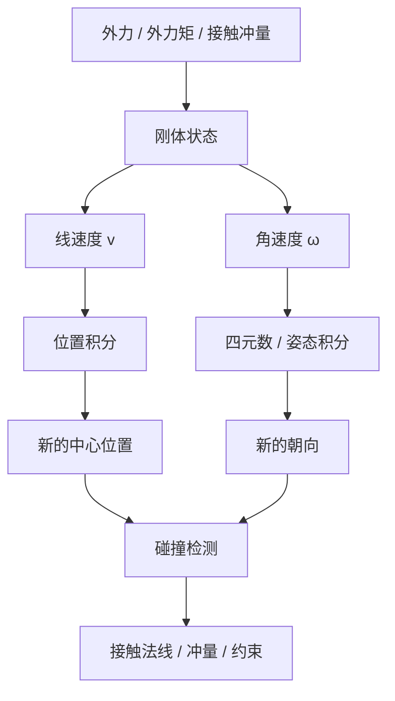
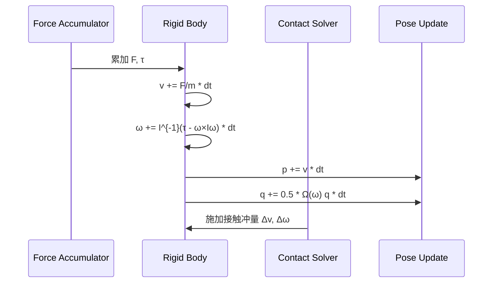
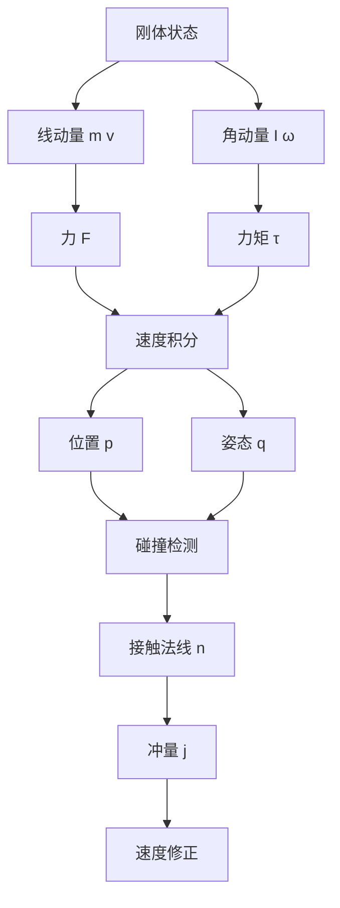

---
title: "游戏与引擎算法 02｜刚体动力学"
slug: "algo-02-rigid-body-dynamics"
date: "2026-04-17"
description: "把刚体动力学拆成质量、惯性张量、角动量、冲量和接触有效质量，讲清楚为什么它是约束求解的前置底盘。"
tags:
  - "刚体动力学"
  - "牛顿欧拉"
  - "惯性张量"
  - "冲量"
  - "接触响应"
  - "约束求解"
  - "游戏物理"
  - "碰撞"
series: "游戏与引擎算法"
weight: 1802
---

一句话本质：刚体动力学是在“质量分布不变”的前提下，持续把力和冲量变成线速度、角速度、姿态和接触反作用的状态更新问题。

> 读这篇之前：建议先看 [数值积分：Euler、Verlet、RK4]() 和 [四元数完全指南]()。前者决定怎么推进状态，后者决定怎么稳定推进姿态。

## 问题动机

单纯的粒子动力学只能处理“点”。
游戏里真正会动的却是箱子、车、角色、门、炮弹、武器、骨骼挂点和整个碰撞体。

这些对象不是只会平移。
它们会转，会绕质心摆动，会在接触点上被冲量瞬间改速，还会因为惯性张量不同而表现出完全不同的响应。

如果你把它们当成点质量，就会得到一堆怪现象：
箱子碰墙只会滑，不会翻；长杆受力时像球；高速撞击时角速度不对；堆叠时接触点越修越乱。

刚体动力学的价值，在于把“线运动”和“转动”统一进同一套质量模型。
而它和下一篇 [约束求解]() 的接口，就是有效质量矩阵与冲量。



## 历史背景

刚体动力学的数学骨架来自 Newton 的受力定律和 Euler 的转动方程。
真正进入图形学与游戏工程的关键点，则是“怎么把连续力学变成能在实时系统里跑的离散步进”。

1989 年 Baraff 在《Analytical Methods for Dynamic Simulation of Non-penetrating Rigid Bodies》里，把非穿透接触和约束力做成了可计算的形式，这是游戏物理从“罚函数”走向“约束/冲量”的重要分水岭。[CMU Robotics Institute publication page](https://publications.ri.cmu.edu/analytical-methods-for-dynamic-simulation-of-non-penetrating-rigid-bodies/)

到 2001 年，Baraff 和 Witkin 的 SIGGRAPH 课程把刚体模拟、约束动力学、碰撞与接触系统化整理出来，成为后来工业引擎的共同底稿。[Pixar Physically Based Modeling](https://graphics.pixar.com/pbm2001/)

后来 Box2D 把这些想法压缩成高可维护的 2D 工程实现，Bullet 和 PhysX 则把它扩展到 3D、多约束、多线程和更复杂的接触场景。[Box2D 文档](https://box2d.org/documentation/)、[Bullet repo](https://github.com/bulletphysics/bullet3)、[PhysX repo](https://github.com/NVIDIAGameWorks/PhysX)

## 数学基础

刚体的核心假设是：物体内部任意两点的距离保持不变。
因此它的状态可以用质心位置、线速度、姿态和角速度来描述。

### 1. 平动

$$
m\dot{v} = \sum F
$$

$$
\dot{p} = v
$$

其中 $p$ 是质心位置，$v$ 是线速度，$m$ 是质量。

### 2. 转动

刚体的角动量和角速度通过惯性张量联系：

$$
L = I \omega
$$

对刚体在体坐标系中的欧拉方程，有

$$
\tau = I\dot{\omega} + \omega \times (I\omega)
$$

这里的第二项不是修饰项，而是刚体转动里最容易被忽略的非线性耦合。

如果把姿态写成单位四元数 $q$，则有

$$
\dot{q} = \frac{1}{2}\Omega(\omega) q
$$

其中 $\Omega(\omega)$ 可以写成四维反对称矩阵。
这也是为什么姿态积分不能只看平动。

### 3. 冲量

力是时间上的连续累积，冲量是瞬时累积：

$$
J = \int_{t_0}^{t_1} F(t)\,dt
$$

冲量会同时改变线速度和角速度：

$$
\Delta v = \frac{J}{m}
$$

$$
\Delta \omega = I^{-1}(r \times J)
$$

这里 $r$ 是从质心到受力点的向量。
同一个冲量，施加在不同位置，会得到不同的角响应。

### 4. 接触点的有效质量

接触点上，最常用的是法线方向的相对速度：

$$
v_n = n \cdot \left[(v_B + \omega_B \times r_B) - (v_A + \omega_A \times r_A)\right]
$$

求一个法线冲量 $j$ 时，更新目标是让法线速度满足恢复系数和分离条件。
在最简形式下：

$$
j = -\frac{(1+e)v_n}{k_n}
$$

其中 $e$ 是恢复系数，$k_n$ 是法线方向有效质量：

$$
k_n = m_A^{-1} + m_B^{-1}
+ n \cdot \left(\left[I_A^{-1}(r_A \times n)\right] \times r_A\right)
+ n \cdot \left(\left[I_B^{-1}(r_B \times n)\right] \times r_B\right)
$$

这个量本质上就是

$$
k_n = J M^{-1} J^T
$$

在单条接触约束上的标量化结果。
这就是它和 [A-03 约束求解]() 的直接桥梁。

## 算法推导

刚体步进通常拆成六件事：

1. 累积外力和外力矩。
2. 用积分器推进线速度和角速度。
3. 把速度推进到位置和姿态。
4. 做宽相与窄相碰撞检测。
5. 把接触转成冲量或约束。
6. 迭代求解并回写速度。

前面三步是动力学，后面三步是接触动力学。
很多初学者会把它们混成一锅，因为它们都在“改状态”。
真正的工程分界线在于：前者是连续方程离散化，后者是约束系统求解。



### 为什么“有效质量”是核心

接触响应不是“反弹多少”这么简单。
你需要知道同一个法线冲量打在两个刚体上，会分别如何改变线速度和角速度。

如果忽略转动，长杆和球体会得到相同的法线响应。
这和现实完全不符。

把接触约束写成 Jacobian 形式后，单个法线约束的线性化就是：

$$
Jv' = b
$$

加上冲量更新：

$$
v' = v + M^{-1}J^T \lambda
$$

代回去可得

$$
J M^{-1} J^T \lambda = b - Jv
$$

这就是有效质量。
它既解释了为什么某些接触“软”，也解释了为什么质量比和惯性比会让堆叠系统极难稳定。

### 为什么刚体比粒子更麻烦

粒子只需要处理平动。
刚体还要处理旋转、惯性张量、力矩、角动量守恒和姿态正交化。

你不但要保持速度，还要保持姿态是单位四元数。
你不但要把冲量加对，还要把冲量加在对的位置。

这也是为什么刚体动力学通常不会单独存在。
它总是和 [数值积分]()、[碰撞检测]()、[宽相]() 和 [约束求解]() 连成一条链。

## 算法实现

下面的实现把刚体状态、力累积、惯性张量变换和接触冲量放在同一个骨架里。
它是 3D 版的最小可用结构，不是玩具版公式抄写。

```csharp
using System;
using System.Numerics;

namespace GamePhysics;

public readonly struct Matrix3x3
{
    public readonly float M11, M12, M13;
    public readonly float M21, M22, M23;
    public readonly float M31, M32, M33;

    public Matrix3x3(float m11, float m12, float m13,
                     float m21, float m22, float m23,
                     float m31, float m32, float m33)
    {
        M11 = m11; M12 = m12; M13 = m13;
        M21 = m21; M22 = m22; M23 = m23;
        M31 = m31; M32 = m32; M33 = m33;
    }

    public static Matrix3x3 Identity => new(1, 0, 0, 0, 1, 0, 0, 0, 1);

    public static Matrix3x3 Diagonal(float x, float y, float z)
        => new(x, 0, 0, 0, y, 0, 0, 0, z);

    public static Vector3 operator *(Matrix3x3 m, Vector3 v) => new(
        m.M11 * v.X + m.M12 * v.Y + m.M13 * v.Z,
        m.M21 * v.X + m.M22 * v.Y + m.M23 * v.Z,
        m.M31 * v.X + m.M32 * v.Y + m.M33 * v.Z);

    public static Matrix3x3 operator *(Matrix3x3 a, Matrix3x3 b) => new(
        a.M11 * b.M11 + a.M12 * b.M21 + a.M13 * b.M31,
        a.M11 * b.M12 + a.M12 * b.M22 + a.M13 * b.M32,
        a.M11 * b.M13 + a.M12 * b.M23 + a.M13 * b.M33,
        a.M21 * b.M11 + a.M22 * b.M21 + a.M23 * b.M31,
        a.M21 * b.M12 + a.M22 * b.M22 + a.M23 * b.M32,
        a.M21 * b.M13 + a.M22 * b.M23 + a.M23 * b.M33,
        a.M31 * b.M11 + a.M32 * b.M21 + a.M33 * b.M31,
        a.M31 * b.M12 + a.M32 * b.M22 + a.M33 * b.M32,
        a.M31 * b.M13 + a.M32 * b.M23 + a.M33 * b.M33);

    public Matrix3x3 Transpose() => new(
        M11, M21, M31,
        M12, M22, M32,
        M13, M23, M33);

    public Matrix3x3 Inverse()
    {
        float c11 = M22 * M33 - M23 * M32;
        float c12 = M13 * M32 - M12 * M33;
        float c13 = M12 * M23 - M13 * M22;
        float c21 = M23 * M31 - M21 * M33;
        float c22 = M11 * M33 - M13 * M31;
        float c23 = M13 * M21 - M11 * M23;
        float c31 = M21 * M32 - M22 * M31;
        float c32 = M12 * M31 - M11 * M32;
        float c33 = M11 * M22 - M12 * M21;

        float det = M11 * c11 + M12 * c21 + M13 * c31;
        if (MathF.Abs(det) < 1e-8f)
            throw new InvalidOperationException("Inertia tensor is singular or ill-conditioned.");

        float invDet = 1f / det;
        return new Matrix3x3(
            c11 * invDet, c12 * invDet, c13 * invDet,
            c21 * invDet, c22 * invDet, c23 * invDet,
            c31 * invDet, c32 * invDet, c33 * invDet);
    }
}

public sealed class RigidBody
{
    public float Mass { get; }
    public float InvMass { get; }
    public Matrix3x3 InertiaBody { get; }
    public Matrix3x3 InvInertiaBody { get; }

    public Vector3 Position;
    public Quaternion Orientation = Quaternion.Identity;
    public Vector3 LinearVelocity;
    public Vector3 AngularVelocity;

    public Vector3 ForceAccum;
    public Vector3 TorqueAccum;

    public RigidBody(float mass, Matrix3x3 inertiaBody, Vector3 position)
    {
        if (mass <= 0f) throw new ArgumentOutOfRangeException(nameof(mass));
        Mass = mass;
        InvMass = 1f / mass;
        InertiaBody = inertiaBody;
        InvInertiaBody = inertiaBody.Inverse();
        Position = position;
    }

    public void ApplyForce(Vector3 force) => ForceAccum += force;
    public void ApplyTorque(Vector3 torque) => TorqueAccum += torque;

    public void ApplyImpulse(Vector3 impulse, Vector3 worldPoint)
    {
        LinearVelocity += impulse * InvMass;

        Vector3 r = worldPoint - Position;
        Vector3 angularImpulse = Vector3.Cross(r, impulse);
        AngularVelocity += WorldInvInertia() * angularImpulse;
    }

    public void Integrate(float dt)
    {
        if (dt <= 0f) throw new ArgumentOutOfRangeException(nameof(dt));

        Vector3 acceleration = ForceAccum * InvMass;
        LinearVelocity += acceleration * dt;
        Position += LinearVelocity * dt;

        Matrix3x3 invI = WorldInvInertia();
        Vector3 gyroscopic = Vector3.Cross(AngularVelocity, WorldInertia() * AngularVelocity);
        Vector3 angularAcceleration = invI * (TorqueAccum - gyroscopic);
        AngularVelocity += angularAcceleration * dt;

        Quaternion q = Orientation;
        Quaternion dq = new(
            0.5f * AngularVelocity.X,
            0.5f * AngularVelocity.Y,
            0.5f * AngularVelocity.Z,
            0f);
        q = new Quaternion(
            q.W * dq.X + q.X * dq.W + q.Y * dq.Z - q.Z * dq.Y,
            q.W * dq.Y - q.X * dq.Z + q.Y * dq.W + q.Z * dq.X,
            q.W * dq.Z + q.X * dq.Y - q.Y * dq.X + q.Z * dq.W,
            q.W * dq.W - q.X * dq.X - q.Y * dq.Y - q.Z * dq.Z);
        Orientation = Quaternion.Normalize(Orientation + q * dt);

        ForceAccum = Vector3.Zero;
        TorqueAccum = Vector3.Zero;
    }

    public Matrix3x3 RotationMatrix()
    {
        Quaternion q = Quaternion.Normalize(Orientation);
        float xx = q.X * q.X, yy = q.Y * q.Y, zz = q.Z * q.Z;
        float xy = q.X * q.Y, xz = q.X * q.Z, yz = q.Y * q.Z;
        float wx = q.W * q.X, wy = q.W * q.Y, wz = q.W * q.Z;

        return new Matrix3x3(
            1 - 2 * (yy + zz), 2 * (xy - wz),     2 * (xz + wy),
            2 * (xy + wz),     1 - 2 * (xx + zz), 2 * (yz - wx),
            2 * (xz - wy),     2 * (yz + wx),     1 - 2 * (xx + yy));
    }

    public Matrix3x3 WorldInertia()
    {
        Matrix3x3 R = RotationMatrix();
        return R * InertiaBody * R.Transpose();
    }

    public Matrix3x3 WorldInvInertia()
    {
        Matrix3x3 R = RotationMatrix();
        return R * InvInertiaBody * R.Transpose();
    }

    public void ResolveContactNormal(Vector3 contactPoint, Vector3 normal, float restitution)
    {
        Vector3 r = contactPoint - Position;
        Vector3 vContact = LinearVelocity + Vector3.Cross(AngularVelocity, r);
        float vn = Vector3.Dot(vContact, normal);
        if (vn > 0f)
            return;

        Vector3 rn = Vector3.Cross(r, normal);
        Vector3 angularTerm = WorldInvInertia() * rn;
        float effectiveMass = InvMass + Vector3.Dot(Vector3.Cross(angularTerm, r), normal);
        if (effectiveMass <= 1e-8f)
            return;

        float j = -(1f + restitution) * vn / effectiveMass;
        ApplyImpulse(j * normal, contactPoint);
    }
}
```

这份代码的关键不是“能跑”，而是把三件事分开了：
质量矩阵、惯性张量和接触冲量。
只要这三件事拆开，后面的约束求解、关节和摩擦才有落脚点。

## 结构图 / 流程图




## 复杂度分析

| 子过程 | 时间复杂度 | 空间复杂度 | 备注 |
|---|---:|---:|---|
| 单刚体力/力矩累积 | $O(1)$ | $O(1)$ | 每帧常数开销 |
| 单刚体平动/转动积分 | $O(1)$ | $O(1)$ | 受积分器影响但仍是常数 |
| 单接触点冲量更新 | $O(1)$ | $O(1)$ | 计算 Jacobian 行的标量有效质量 |
| 整体系统一步 | $O(B + C \cdot I)$ | $O(B + C)$ | $B$ 为刚体数，$C$ 为接触数，$I$ 为迭代次数 |

刚体本身不是复杂度瓶颈。
真正昂贵的是接触图、宽相、窄相和迭代求解。
但没有正确的刚体模型，求解器连“应该修正什么”都不知道。

## 变体与优化

1. 体坐标系存惯性张量，世界坐标系只在需要时变换。
2. 旋转用单位四元数，避免欧拉角的奇异性。
3. 质量比和惯性比很大时，做子步进或更强的迭代上限控制。
4. 对休眠物体直接跳过积分和碰撞，省下大部分 CPU。
5. 对接触求解采用顺序冲量或块求解，而不是直接组装全局大矩阵。

刚体里最常见的性能优化，不是“把公式写得更短”，而是减少不必要的求解。
例如层过滤、岛分解、睡眠和提前剔除。

## 对比其他算法

| 方法 | 优点 | 缺点 | 适合场景 |
|---|---|---|---|
| 质点动力学 | 简单、便宜 | 没有转动、没有惯性张量 | 粒子、特效 |
| 罚函数法 | 实现直观 | 刚度高时需要极小步长，易抖 | 轻量接触、教学 |
| 刚体 + 冲量 | 高效、适合实时接触 | 迭代误差、依赖求解质量 | 游戏物理、工程模拟 |
| 拉格朗日乘子法 | 约束表达清晰 | 大规模线性系统成本高 | 离线、机器人、精确求解 |

## 批判性讨论

刚体模型的前提是“物体内部形变可以忽略”。
一旦你在做布料、软体、碎裂或高频局部形变，硬套刚体只会让数值看起来像错了，其实是模型错了。

冲量法的优点是快，缺点是它本质上是近似。
多接触堆叠、强摩擦、超大质量比和复杂关节时，顺序迭代会出现能量漏失、抖动和卡顿。

更糟的是，很多工程 bug 并不是“公式错了”，而是坐标系错了。
把局部惯性张量、世界惯性张量、局部点和世界点混用，结果往往像“物体不守物理”，其实只是变换链断了。

## 跨学科视角

从经典力学看，刚体动力学就是 Newton-Euler 方程的离散化。
从线性代数看，核心是质量矩阵、旋转矩阵和二次型。

从优化角度看，接触冲量求解等价于在约束空间里找一个最小修正。
从机器人学看，`J M^{-1} J^T` 是熟悉到不能再熟悉的关节空间有效质量。

这也是为什么刚体动力学和 [A-03 约束求解]() 天然连在一起。
前者定义状态如何变化，后者决定接触和关节该怎样把这个变化拉回可行域。

## 真实案例

Box2D 官方文档明确列出了质量、转动惯量、冲量、接触法线和接触冲量等概念。
它的 `b2Body_GetMass()`、`b2Body_GetRotationalInertia()`、`b2Body_ApplyLinearImpulse()` 和 `b2World_GetContactEvents()` 都直接围绕刚体动力学展开。[Box2D Body](https://box2d.org/documentation/group__body.html)、[Box2D Simulation](https://box2d.org/documentation/md_simulation.html)

Box2D 3.x 的源码中，`src/body.c`、`src/contact_solver.c`、`src/physics_world.c` 是这套模型的核心落点。[Box2D src tree](https://github.com/erincatto/box2d/tree/main/src)

Bullet 官方仓库把刚体和动力学世界拆在 `BulletDynamics/Dynamics/btRigidBody.cpp`、`BulletDynamics/Dynamics/btDiscreteDynamicsWorld.cpp`、`BulletDynamics/ConstraintSolver/btSequentialImpulseConstraintSolver.cpp`。[Bullet repo](https://github.com/bulletphysics/bullet3)

PhysX 官方仓库继续把刚体、约束和世界步进做成独立模块，便于在多线程和 GPU 路径下复用同一套动力学接口。[PhysX repo](https://github.com/NVIDIAGameWorks/PhysX)

Stanford 的 CS348C / CS448Z 课程页把 Baraff 的刚体动力学和约束动力学作为核心参考，也说明了这套理论在工业图形学中的地位。[CS348C](https://graphics.stanford.edu/courses/cs348c/) / [CS448Z](https://graphics.stanford.edu/courses/cs448z/)

## 量化数据

2D 刚体有 3 个自由度：`x`、`y` 和旋转。
3D 刚体有 6 个自由度：3 个平移 + 3 个旋转。
这意味着 3D 接触和约束比 2D 至少多出一整套转动响应。

对一个边长 1m、质量 2kg 的均匀立方体，绕中心轴的惯性矩大约是

$$
I = \frac{1}{6} m a^2 = \frac{1}{3}\,\text{kg·m}^2
$$

如果在距离质心 0.5m 的位置施加 1 N·s 冲量，那么线速度变化是

$$
\Delta v = 0.5 \,\text{m/s}
$$

角速度变化近似为

$$
\Delta \omega = \frac{0.5}{0.333} \approx 1.5 \,\text{rad/s}
$$

这个数量级已经足够说明：同样的冲量，位置不同，转动响应完全不同。

## 常见坑

1. 把惯性张量当成标量。
这会让长杆、扁盒、球体都表现成同一种转动惯性。改法是至少保存 body-space 3x3 惯性张量，再按姿态变换到 world-space。

2. 直接在世界空间累积角速度，却忘记 `ω × (Iω)` 的陀螺项。
这会让高速旋转的物体看起来“少了一个力矩”。改法是用完整的 Newton-Euler 形式，或者只在简化场景里忽略它并明确标注。

3. 冲量施加点错了。
把接触冲量都加到质心，只会得到平动，不会有真实扭矩。改法是对接触点使用 `r × J`。

4. 姿态积分后不归一化四元数。
浮点误差会把单位长度慢慢吃掉。改法是每步或每若干步做一次归一化。

5. 质量和单位不统一。
米、厘米、像素混用会把重力、冲量和惯性全搞乱。改法是先统一单位，再调参数。

## 何时用 / 何时不用

适合用刚体动力学的情况：
箱子、车、门、投射物、机关、角色碰撞体、可交互道具。

不适合用刚体动力学的情况：
布料、柔体、破碎细节、液体、橡胶形变、需要连续局部弯曲的对象。

如果你想要的是“看起来像刚体”，刚体是对的。
如果你想要的是“材料真的会变形”，那应该转向软体、壳体、FEM 或更专门的模型。

## 相关算法

- [数值积分：Euler、Verlet、RK4]()
- [约束求解：Sequential Impulse 与 PBD]()
- [SAT / GJK：窄相碰撞检测]()
- [AABB Broad Phase]()
- [四元数完全指南]()
- [浮点精度与数值稳定性]()

## 小结

刚体动力学不是“物体会动”这么简单。
它把平动、转动、惯性和冲量统一进一套可迭代的状态更新模型里。

真正决定它能不能在游戏里站稳的，不是方程写得多漂亮，而是你能不能把有效质量、接触法线、四元数姿态和固定步长一起管住。

一旦这套底盘稳了，后面的碰撞响应、关节、角色控制和堆叠稳定性才有资格谈。

## 参考资料

- [Baraff, 1989, Analytical Methods for Dynamic Simulation of Non-penetrating Rigid Bodies](https://publications.ri.cmu.edu/analytical-methods-for-dynamic-simulation-of-non-penetrating-rigid-bodies/)
- [Pixar: Physically Based Modeling, SIGGRAPH 2001 Course Notes](https://graphics.pixar.com/pbm2001/)
- [Stanford CS348C: Computer Graphics Animation and Simulation](https://graphics.stanford.edu/courses/cs348c/)
- [Box2D Documentation](https://box2d.org/documentation/)
- [Box2D Simulation](https://box2d.org/documentation/md_simulation.html)
- [Bullet Physics SDK](https://github.com/bulletphysics/bullet3)
- [NVIDIA PhysX SDK](https://github.com/NVIDIAGameWorks/PhysX)
