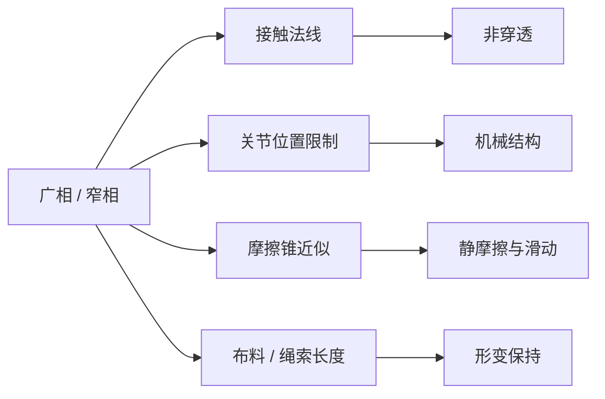
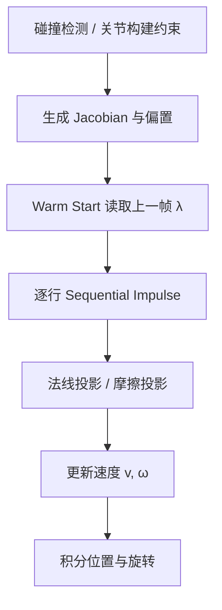
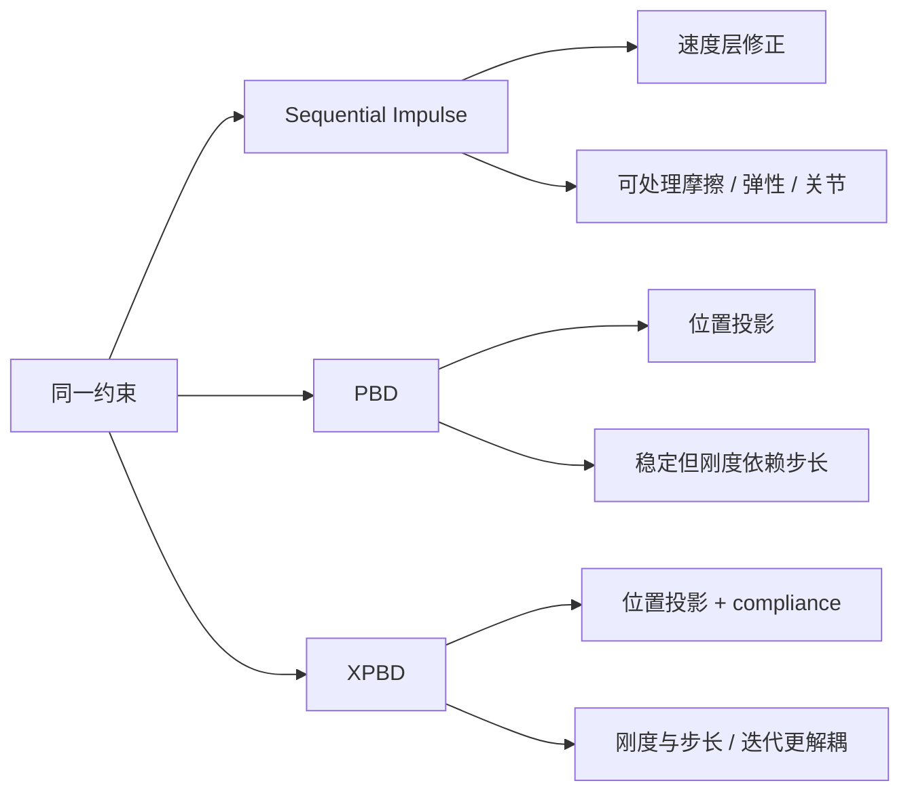

---
title: "游戏与引擎算法 03｜约束求解：Sequential Impulse 与 PBD"
slug: "algo-03-constraint-solver"
date: "2026-04-17"
description: "从拉格朗日乘子、约束 Jacobian 和有效质量出发，把 Sequential Impulse、Baumgarte、warm starting、PBD 与 XPBD 放回游戏物理的真实工程链路。"
tags:
  - "约束求解"
  - "Sequential Impulse"
  - "PBD"
  - "XPBD"
  - "拉格朗日乘子"
  - "物理模拟"
  - "游戏引擎"
  - "碰撞响应"
series: "游戏与引擎算法"
weight: 1803
---

**一句话本质：约束求解不是“把物体推开”，而是把碰撞、关节和摩擦写成一组带不等式的广义力方程，再用迭代法在实时预算里逼近它。**

> 读这篇之前：建议先看 [数据结构与算法 15｜SAT / GJK：窄相碰撞检测]()、[数据结构与算法 10｜AABB 与碰撞宽相]() 和 [游戏与引擎算法 41｜浮点精度与数值稳定性]()。前者负责把候选对找出来，后者决定迭代是否会把误差放大。

## 问题动机

做物理最容易误解的一点，是把“碰撞检测”当成“碰撞处理”。检测只回答“谁碰到了谁”；真正让箱子能叠、车轮能滚、门轴能转的，是求解器。

如果没有约束求解，碰撞后物体只是穿透、弹飞或者互相抖成一团。关节、滑轨、角色脚底摩擦、布料长度约束，也都不会自己成立。

游戏引擎不能等一个大型非线性优化器慢慢收敛。它必须在几毫秒内给出“够好”的答案，并且要能吃掉大量接触点、关节和摩擦约束。

### 约束求解要处理的不是一种问题



这些约束本质上不同，但工程处理方式却高度相似：都能写成 `C(q) = 0`、`C(q) >= 0` 或 `|C(q)| <= ε` 这样的形式，再通过迭代投影或冲量修正把状态拉回可行域。

## 历史背景

实时物理的早期路线，先是 penalty method：像弹簧一样把物体往回拉。它简单，但刚度一大就数值炸，刚度一小就穿透明显。

1990 年代到 2000 年代初，游戏开始转向基于冲量的离散求解。Erin Catto 在 Box2D 的公开资料里把这条线总结成 `Iterative Dynamics with Temporal Coherence`、`Sequential Impulses` 和后来的 `Modeling and Solving Constraints`。它们共同确立了今天最常见的工程套路：用迭代 Gauss-Seidel 近似求解接触与关节。

另一条线来自图形学。Müller 等人在 2006 年提出 Position Based Dynamics（PBD），核心不是先算力再算位移，而是直接把位置投影回约束面。它的优势是稳定、直观、容易控制；代价是物理意义更弱，约束刚度会依赖时间步和迭代次数。

2016 年的 XPBD 把 PBD 和隐式弹性连起来，补上了“刚度和时间步、迭代次数强耦合”这个老问题。它让 PBD 从“很好用的近似”往“可控的工程方法”又迈了一步。

## 数学基础

### 1. 广义坐标、Jacobian 与速度约束

设系统广义坐标为 `q`，速度为 `v = \dot q`，约束写成：

$$
C(q) = 0
$$

对时间求导得：

$$
\dot C(q, v) = J(q)\,v = 0,\qquad J = \frac{\partial C}{\partial q}
$$

`J` 就是约束 Jacobian。它把“关节轴、接触法线、摩擦切向”映射到速度空间，是后面一切推导的入口。

### 2. 从力到冲量

刚体动力学里，速度增量满足：

$$
M \Delta v = J^T \lambda
$$

其中 `M` 是广义质量矩阵，`λ` 是拉格朗日乘子，也就是约束冲量的标量或向量形式。

把速度约束代入：

$$
J(v + \Delta v) + b = 0
$$

得到线性系统：

$$
J M^{-1} J^T \lambda = -(Jv + b)
$$

右侧的 `b` 是偏置项，常用于 Baumgarte 稳定化、恢复项和碰撞弹性。

### 3. 有效质量

单个约束行的有效质量是：

$$
m_{\mathrm{eff}} = \left(J M^{-1} J^T\right)^{-1}
$$

在 2D 接触里，如果接触法线是 `n`，接触点相对质心向量分别为 `r_A`、`r_B`，则法线方向的标量有效质量常写成：

$$
k_n = m_A^{-1} + m_B^{-1} + I_A^{-1}(r_A \times n)^2 + I_B^{-1}(r_B \times n)^2
$$

冲量更新为：

$$
\Delta \lambda_n = -\frac{Jv + b}{k_n}
$$

这就是 Sequential Impulse 里“每一行都能单独算”的根本原因。

### 4. 互补条件与摩擦锥

接触法线不是等式，而是不等式：

$$
C(q) \ge 0,\qquad \lambda_n \ge 0,\qquad C(q)\,\lambda_n = 0
$$

这表示“可以分离，不能穿透；只有接触时才施加法线冲量”。

摩擦则受库仑锥约束：

$$
|\lambda_t| \le \mu \lambda_n
$$

实时引擎里通常把摩擦锥近似成一个或两个切向约束，再做投影截断。

## 算法推导

### 从精确求解到迭代求解

如果把所有约束一次性写成矩阵方程，理论上可以直接解线性系统。但接触数目多、碰撞拓扑每帧都变、摩擦又带不等式，直接求解既贵又不稳。

于是游戏物理走向 Projected Gauss-Seidel。它不是先求出全部未知量再一起更新，而是逐行处理约束，处理完一行就立即把结果写回速度，再影响下一行。

这就是 Sequential Impulse 的本质：**把 PGS 改写成冲量语言。**

### Baumgarte 为什么出现

纯速度约束只能保证“这一刻不再继续错”，却不能修正已经积累的穿透。Baumgarte 稳定化把位置误差转成速度偏置：

$$
b = \beta \frac{C}{\Delta t}
$$

这样求解器会在速度层面主动把系统往可行域拉回去。

工程上它的意义很大，但副作用也明确：偏置过大时会注入能量，让堆叠抖动、弹簧发硬、接触面发热。

### warm starting 为什么有效

相邻两帧的接触点通常变化不大。上一帧求得的乘子就是下一帧的好初值。

warm starting 的做法很简单：把缓存的 `λ` 先乘一遍，再从这个状态继续迭代。它利用的是时间相干性，不是魔法。

如果接触点 ID 能稳定追踪，这个技巧会显著改善堆叠稳定性，并减少前几次迭代的抖动。

### PBD 与 XPBD 为什么看起来更“像投影”

PBD 的逻辑不是先修速度，而是直接修位置。对约束 `C(x)=0`，线性化后有：

$$
J \Delta x = -C
$$

再取最小代价解：

$$
\Delta x = -M^{-1}J^T \left(JM^{-1}J^T\right)^{-1} C
$$

PBD 的优点是极稳，尤其适合布料、绳索、软体和角色附着物。缺点是约束刚度依赖迭代次数和时间步，数值意义不够“物理”。

XPBD 加入 compliance `α` 后，更新式变为：

$$
\Delta \lambda =
\frac{-C - \tilde\alpha \lambda}{J M^{-1} J^T + \tilde\alpha},
\qquad \tilde\alpha = \frac{\alpha}{\Delta t^2}
$$

它把“硬约束”变成“有可控柔度的约束”，并且让刚度对时间步和迭代次数不那么敏感。

## 结构图 / 流程图





## 算法实现

下面的实现把两条线放在一起：速度层的 Sequential Impulse，和位置层的 XPBD。它们不是竞争关系，而是适配不同对象的两种工程工具。

```csharp
using System;
using System.Numerics;

public struct Body2D
{
    public Vector2 Position;
    public float Rotation;
    public Vector2 LinearVelocity;
    public float AngularVelocity;
    public float InvMass;
    public float InvInertia;
}

public static class PhysicsMath2D
{
    public static float Cross(in Vector2 a, in Vector2 b) => a.X * b.Y - a.Y * b.X;
    public static Vector2 Cross(float s, in Vector2 v) => new(-s * v.Y, s * v.X);
}

public sealed class ContactConstraint2D
{
    public int A;
    public int B;
    public Vector2 Normal;
    public Vector2 ContactPoint;
    public float Friction;
    public float Restitution;
    public float Penetration;
    public float Bias;

    private float _normalMass;
    private float _tangentMass;
    private float _normalImpulse;
    private float _tangentImpulse;
    private Vector2 _tangent;
    private Vector2 _ra;
    private Vector2 _rb;

    public void PreSolve(Span<Body2D> bodies, float dt, float baumgarte, float slop, float restitutionThreshold)
    {
        ref var a = ref bodies[A];
        ref var b = ref bodies[B];

        _ra = ContactPoint - a.Position;
        _rb = ContactPoint - b.Position;
        _tangent = new Vector2(-Normal.Y, Normal.X);

        float rnA = PhysicsMath2D.Cross(_ra, Normal);
        float rnB = PhysicsMath2D.Cross(_rb, Normal);
        float rtA = PhysicsMath2D.Cross(_ra, _tangent);
        float rtB = PhysicsMath2D.Cross(_rb, _tangent);

        float kn = a.InvMass + b.InvMass + a.InvInertia * rnA * rnA + b.InvInertia * rnB * rnB;
        float kt = a.InvMass + b.InvMass + a.InvInertia * rtA * rtA + b.InvInertia * rtB * rtB;

        _normalMass = kn > 0f ? 1f / kn : 0f;
        _tangentMass = kt > 0f ? 1f / kt : 0f;

        float penetrationError = MathF.Max(Penetration - slop, 0f);
        Bias = baumgarte * penetrationError / dt;

        float vn = Vector2.Dot(b.LinearVelocity + PhysicsMath2D.Cross(b.AngularVelocity, _rb)
                            - a.LinearVelocity - PhysicsMath2D.Cross(a.AngularVelocity, _ra), Normal);

        if (vn < -restitutionThreshold)
        {
            Bias += -Restitution * vn;
        }
    }

    public void WarmStart(Span<Body2D> bodies)
    {
        ApplyImpulse(bodies, _normalImpulse, _tangentImpulse);
    }

    public void SolveVelocity(Span<Body2D> bodies)
    {
        ref var a = ref bodies[A];
        ref var b = ref bodies[B];

        Vector2 dv = (b.LinearVelocity + PhysicsMath2D.Cross(b.AngularVelocity, _rb))
                   - (a.LinearVelocity + PhysicsMath2D.Cross(a.AngularVelocity, _ra));

        float vn = Vector2.Dot(dv, Normal);
        float lambdaN = _normalMass * (-(vn + Bias));
        float oldN = _normalImpulse;
        _normalImpulse = MathF.Max(oldN + lambdaN, 0f);
        lambdaN = _normalImpulse - oldN;
        ApplyImpulse(bodies, lambdaN, 0f);

        dv = (b.LinearVelocity + PhysicsMath2D.Cross(b.AngularVelocity, _rb))
           - (a.LinearVelocity + PhysicsMath2D.Cross(a.AngularVelocity, _ra));

        float vt = Vector2.Dot(dv, _tangent);
        float lambdaT = _tangentMass * (-vt);
        float maxFriction = Friction * _normalImpulse;
        float oldT = _tangentImpulse;
        _tangentImpulse = Math.Clamp(oldT + lambdaT, -maxFriction, maxFriction);
        lambdaT = _tangentImpulse - oldT;
        ApplyImpulse(bodies, 0f, lambdaT);
    }

    private void ApplyImpulse(Span<Body2D> bodies, float normalImpulse, float tangentImpulse)
    {
        ref var a = ref bodies[A];
        ref var b = ref bodies[B];

        Vector2 impulse = normalImpulse * Normal + tangentImpulse * _tangent;

        a.LinearVelocity -= a.InvMass * impulse;
        a.AngularVelocity -= a.InvInertia * PhysicsMath2D.Cross(_ra, impulse);

        b.LinearVelocity += b.InvMass * impulse;
        b.AngularVelocity += b.InvInertia * PhysicsMath2D.Cross(_rb, impulse);
    }
}

public sealed class XpbdDistanceConstraint2D
{
    public int A;
    public int B;
    public float RestLength;
    public float Compliance;

    private float _lambda;
    private float _alphaTilde;

    public void PreSolve(float dt)
    {
        _alphaTilde = Compliance / (dt * dt);
    }

    public void Solve(Span<Body2D> bodies)
    {
        ref var a = ref bodies[A];
        ref var b = ref bodies[B];

        Vector2 delta = b.Position - a.Position;
        float dist = delta.Length();
        if (dist < 1e-6f) return;

        Vector2 n = delta / dist;
        float C = dist - RestLength;
        float w = a.InvMass + b.InvMass;
        float denom = w + _alphaTilde;
        if (denom <= 0f) return;

        float dLambda = (-C - _alphaTilde * _lambda) / denom;
        _lambda += dLambda;

        Vector2 corr = dLambda * n;
        a.Position -= a.InvMass * corr;
        b.Position += b.InvMass * corr;
    }
}
```

这段代码刻意把“法线冲量”“摩擦冲量”“位置投影”“compliance”拆开。原因很简单：现实引擎里，关节、接触和软体常常不会共用同一套参数。

## 复杂度分析

Sequential Impulse 的单帧复杂度近似是 `O(m * k)`，其中 `m` 是约束行数，`k` 是迭代次数。空间复杂度是 `O(m)`，主要花在约束缓存、接触对和乘子上。

PBD / XPBD 也是 `O(m * k)`，但每次更新更便宜，且更容易并行化到块级或图着色级别。代价是它对“真实力学”的还原度较低。

真正的瓶颈不是公式本身，而是约束图的拓扑、接触缓存是否稳定、以及你是否把重计算放在了错误的阶段。

## 变体与优化

- **Warm starting**：用上一帧的 `λ` 作为初值，能显著减少前几轮抖动。
- **Block solver**：把法线与摩擦、或多个接触点打包求解，提升堆叠稳定性。
- **Split impulse / NGS**：把位置修正和速度响应分离，减少 Baumgarte 注入的能量。
- **TGS / sub-stepping**：用更小步长减轻非线性，再用较少迭代保持吞吐。
- **XPBD compliance**：用 `α` 把刚度变成显式参数，便于调参和网络复制。

## 对比其他算法

| 方法 | 核心思想 | 优点 | 缺点 | 典型用途 |
|---|---|---|---|---|
| Penalty / Spring | 把约束当弹簧 | 直观、易实现 | 刚度大时很难稳定 | 粗糙碰撞、特效 |
| Sequential Impulse | 速度层逐行解 PGS | 快、稳、适合接触与摩擦 | 依赖迭代、调参敏感 | 刚体接触、关节 |
| PBD | 位置层直接投影 | 非常稳、易控制 | 刚度依赖步长与迭代 | 布料、绳索、软体 |
| XPBD | PBD + compliance | 刚度更可控 | 仍然是近似法 | 软体、可交互形变 |

## 批判性讨论

Sequential Impulse 的优点，是把复杂物理问题降成一行一行的局部修正。缺点也是这个：它是局部方法，不是全局最优。

所以你会看到它在箱子堆叠、角色脚底、车辆接触里表现很好，但在极端高质量需求下，解出来的状态未必和连续力学最一致。

PBD 的批评更直接：它常常“看起来对”，但不一定“物理上对”。它更像约束驱动的动画器，而不是严格的动力学求解器。

XPBD 缓和了这个问题，却没有消灭它。它只是把“刚度对时间步的耦合”拆开了，不是把所有数值问题都抹掉了。

## 跨学科视角

Sequential Impulse 其实很像数值优化里的坐标下降法。每次只处理一个变量方向，并在约束边界上投影回可行域。

PBD / XPBD 则更接近几何优化和流形投影。它不是先求拉格朗日函数的精确最优，而是直接把点拉回约束流形附近。

这和信号处理里的逐步滤波有一个共同点：你不追求一次性精确重建，而是追求每一步都不把系统推离稳定区。

## 真实案例

- [Box2D 官方文档](https://box2d.org/documentation/)把 solver 明确定义为顺序求解器，强调它以约束数 `N` 为线性时间工作，并在碰撞与关节上统一使用约束思路。
- [Box2D Solver2D](https://box2d.org/posts/2024/02/solver2d/) 展示了 PGS、TGS、NGS、XPBD 的并列表现，也明确把 PGS 解释为 `Sequential Impulses`。
- [NVIDIA PhysX 5.2 文档](https://nvidia-omniverse.github.io/PhysX/physx/5.2.1/docs/RigidBodyDynamics.html)说明默认求解器是迭代式的，并给出默认 4 次位置迭代、1 次速度迭代的公开配置。
- [Bullet Physics SDK](https://github.com/bulletphysics/bullet3) 的 `btSequentialImpulseConstraintSolver` 和 `btMultiBodyConstraintSolver` 是工业级顺序冲量求解器的代表实现。

## 量化数据

Box2D 官方文档明确写出：solver 对约束数是线性时间，连续碰撞默认只对动态体和静态体做防穿透，动态体之间的 CCD 需要更谨慎地开启。

PhysX 文档给出的默认求解配置是 4 个位置迭代和 1 个速度迭代；它还明确写了，如果你需要把这个数推到 30 以上，应该先重新审视模拟配置。

Box2D 的 `Solver2D` 公开实验也给出了一组基准：60 Hz 仿真、主迭代 4、次迭代 2，用来对比 PGS、TGS、NGS 和 XPBD 的稳定性差异。

这些数据说明一件事：在实时物理里，迭代次数不是细节，而是算法定义的一部分。

## 常见坑

1. **把 Baumgarte 当成越大越好。**  
   错因：偏置太大时会给系统注入额外能量。  
   怎么改：只给少量位置误差用偏置，剩下的靠位置层或更多迭代收敛。

2. **warm starting 没有稳定的接触 ID。**  
   错因：缓存错对象，上一帧的冲量会打到别的接触上。  
   怎么改：先保证接触点 ID、法线和点序一致，再谈缓存收益。

3. **把 PBD 当成严格刚体求解器。**  
   错因：PBD 的物理意义和刚体冲量法并不等价。  
   怎么改：布料、绳索、软体用 PBD / XPBD，刚体接触和摩擦优先用 Sequential Impulse。

4. **把 friction cone 简化成完全独立的两个轴。**  
   错因：切向投影过强会导致黏滑不自然。  
   怎么改：先限幅法向冲量，再按摩擦系数截断切向累计冲量。

## 何时用 / 何时不用

**适合用 Sequential Impulse 的场景：**

- 刚体堆叠、角色接地、车辆轮胎、门窗铰链。
- 需要碰撞、摩擦、关节在同一套框架里统一处理。
- 需要可接受的实时性和较好的可调参性。

**不适合只靠 Sequential Impulse 的场景：**

- 高精度离线仿真。
- 极端高刚度软体。
- 需要严格能量守恒的研究型模拟。

**适合用 PBD / XPBD 的场景：**

- 布料、绳索、头发、软体、道具二级运动。
- 设计师要强控制、强稳定、弱数学负担。

**不适合只靠 PBD / XPBD 的场景：**

- 需要严格刚体动力学和真实摩擦模型。
- 需要很好地解释冲量、动量和接触反力。

## 相关算法

- [数据结构与算法 15｜SAT / GJK：窄相碰撞检测]()
- [数据结构与算法 10｜AABB 与碰撞宽相]()
- [游戏与引擎算法 41｜浮点精度与数值稳定性]()
- [Box2D Solver2D](https://box2d.org/posts/2024/02/solver2d/)

## 小结

约束求解的核心，不是“把物体推出去”，而是把动力学问题改写成约束空间里的局部修正。

Sequential Impulse 解决的是刚体接触、摩擦和关节；PBD / XPBD 解决的是稳定、可控、易调的几何约束。它们看起来不同，实战里却常常是同一条物理管线的不同层。

如果你只记住一件事，那就记住这句：**检测告诉你谁碰了，约束求解决定了世界怎么活下去。**

## 参考资料

- [Box2D Publications](https://box2d.org/publications/)
- [Box2D Overview](https://box2d.org/documentation/)
- [Solver2D](https://box2d.org/posts/2024/02/solver2d/)
- [Position Based Dynamics](https://www.sciencedirect.com/science/article/pii/S1047320307000065)
- [XPBD: Position-Based Simulation of Compliant Constrained Dynamics](https://dl.acm.org/doi/10.1145/2994258.2994272)
- [PhysX 5.2 Rigid Body Dynamics](https://nvidia-omniverse.github.io/PhysX/physx/5.2.1/docs/RigidBodyDynamics.html)
- [Bullet Physics SDK](https://github.com/bulletphysics/bullet3)


