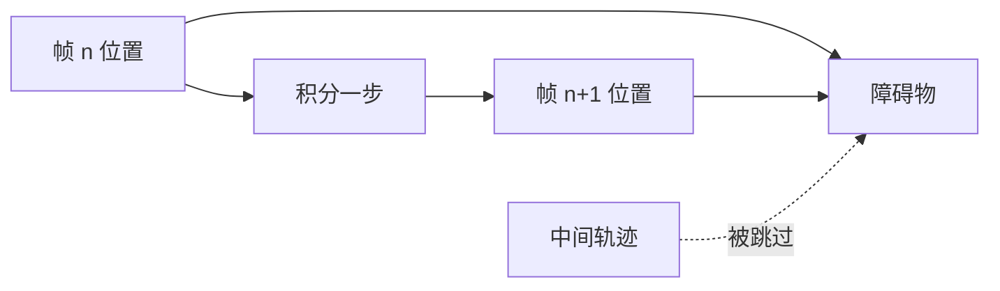
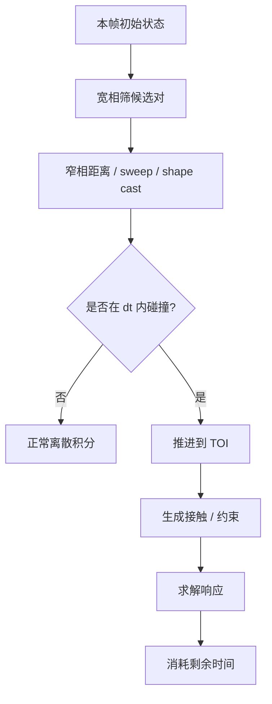
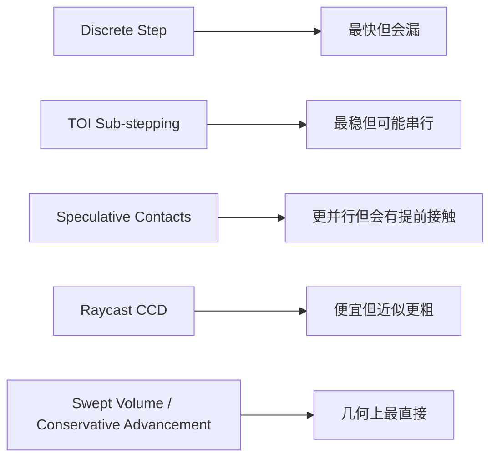

---
title: "游戏与引擎算法 04｜连续碰撞检测（CCD）"
slug: "algo-04-continuous-collision"
date: "2026-04-17"
description: "解释连续碰撞检测如何用 TOI、保守推进、swept volume、speculative contacts 和 sub-stepping 把高速物体从‘穿模’边缘拉回来。"
tags:
  - "连续碰撞检测"
  - "CCD"
  - "TOI"
  - "保守推进"
  - "Speculative Contacts"
  - "物理引擎"
  - "Tunneling"
  - "碰撞响应"
series: "游戏与引擎算法"
weight: 1804
---

**一句话本质：CCD 解决的是“这一帧之间有没有发生接触”这个时间维度问题，而不是把所有物理问题都变成连续精确解。**

> 读这篇之前：建议先看 [数据结构与算法 10｜AABB 与碰撞宽相]()、[数据结构与算法 15｜SAT / GJK：窄相碰撞检测]() 和 [游戏与引擎算法 41｜浮点精度与数值稳定性]()。宽相负责找候选，窄相负责算几何，数值稳定性决定 TOI 会不会抖。

## 问题动机

离散步进的物理世界，每一帧都像拍照。只要物体在两帧之间跨过了足够大的距离，就可能“上一帧在墙左边，下一帧在墙右边”，中间那堵墙完全没被看见。

这就是 tunneling。子弹穿墙、细杆穿缝、轮子卡边、薄片漏碰，都是同一类问题。

### 离散步为什么会漏



如果你只做离散碰撞检测，那么检测的是“端点”，不是“路径”。高速物体最容易从这个缝里溜走。

CCD 的目标，就是把“路径”重新纳入求解范围。

## 历史背景

连续碰撞检测不是游戏时代才有。2002 年 Redon、Kheddar、Coquillart 发表的 *Fast Continuous Collision Detection between Rigid Bodies* 把“第一接触时间”直接纳入算法主体，说明 CCD 可以在实时系统里做得很快。

随后 2000 年代中后期，连续碰撞开始和保守推进、层次包围体、时间裁剪、形变模型联系起来。`C2A`（Controlled Conservative Advancement）把 conservative advancement 推广到更复杂模型，证明它不是只适合玩具例子。

游戏引擎真正大规模采用 CCD，则是在刚体求解器成熟以后。Box2D 的公开文档明确把 TOI、sweep 和 speculative collision 写进了连续碰撞章节；PhysX 也提供了按 scene / pair / body 开启 CCD 的完整路径。Box2D 3.0 甚至明确说，speculative collision 的目标之一就是减少 TOI sub-stepping 的串行瓶颈。

## 数学基础

### 1. 路径不是点，路径是时间函数

设刚体状态随时间线性变化：

$$
\mathbf{x}(t) = \mathbf{x}_0 + t\,\mathbf{v},\qquad t\in[0,\Delta t]
$$

对两个物体 A、B，连续碰撞关心的是距离函数：

$$
d(t) = \mathrm{dist}(A(t), B(t))
$$

TOI（time of impact）就是最小的接触时刻：

$$
\tau = \min \{ t \mid d(t) = 0,\; t \in [0,\Delta t] \}
$$

### 2. 保守推进为什么安全

如果我们知道当前分离距离 `d`，以及沿接触法线方向的闭合速度上界 `v_{rel}`，就可以取一个安全步长：

$$
\Delta t_{safe} \le \frac{d}{v_{rel}}
$$

更常见的写法是根据 witness normal 估计 `\dot d`，只前进一个“不会越过接触”的时间片。

它叫 conservative，是因为每一步都保守地停在“还没碰到”的一侧。

### 3. Swept volume 与 Minkowski 视角

把物体从起点扫到终点，得到的是一个时间展宽后的体积，叫 swept volume。理论上，两个物体发生碰撞等价于它们的相对 swept volume 与原点相交。

在凸体问题里，这个视角很自然地和 Minkowski difference、support mapping 和 GJK 距离查询接上了。CCD 不是单独一门学科，它是几何、优化和时间参数化的交汇点。

### 4. Speculative contacts 的核心

speculative contact 不是“已经撞上了再处理”，而是“预测快撞上了，先制造接触约束”。

如果当前分离距离是 `C`，相对闭合速度是 `v_n < 0`，那么一个很直观的预测式是：

$$
C_{pred} = C + v_n \Delta t
$$

若 `C_{pred}` 落入接触阈值，就提前生成 contact / constraint。这样可以把一部分 CCD 负担移回普通约束求解器。

## 算法推导

### 为什么离散检测不够

离散检测只看 `t=0` 和 `t=\Delta t` 两个端点。只要中间穿过的速度足够大，厚度足够薄，就会漏。

所以 CCD 的第一步，不是“让检测更灵敏”，而是“把时间当成未知量”。

### TOI 解决什么

TOI 解决的是“第一次碰到”的时刻。它对子弹、尖角、薄墙、快速车轮特别有效。

但 TOI 也有边界：它不自动解决碰撞后的反弹、堆叠、摩擦与关节稳定性。那部分仍然要交给常规求解器。

### 保守推进解决什么

保守推进适合凸体和距离查询可用的场景。每次只根据当前距离往前推进一点，再重新测距。

它的优点是稳定、概念清晰、实现直观。缺点是对旋转、凹体和高频接触图非常敏感，可能需要很多次迭代。

### sub-stepping 为什么会成为瓶颈

TOI 检测到第一次接触后，常见做法是把剩余时间切开，先做一个小步子，再继续处理后面的事件。

这很稳，但它会引入串行依赖：前一个子步结束前，后一个子步不能真正开始。Box2D 的公开文章直接把这点称为 serial bottleneck。

### CCD 不解决什么

CCD 不能把已经穿进去的初始重叠自动变成“没碰过”。

CCD 也不能让所有动态物体之间的碰撞都免费。高速动态-动态、大量 bullets、复杂复合体，都会把成本推高。

还有一个常见误区：CCD 不是“绝对不会漏”。如果你的路径近似、旋转线性化或距离函数本身有误差，它依然可能错。

## 结构图 / 流程图





## 算法实现

下面的代码把三件事放在一起：解析圆-圆 TOI、保守推进骨架、以及 speculatively 创建接触的门槛判断。它不是完整引擎，但足够说明 CCD 的工程骨架。

```csharp
using System;
using System.Numerics;

public readonly struct Sweep2D
{
    public readonly Vector2 Start;
    public readonly Vector2 End;
    public readonly float Radius;

    public Sweep2D(Vector2 start, Vector2 end, float radius)
    {
        Start = start;
        End = end;
        Radius = radius;
    }
}

public static class CcdMath2D
{
    public static bool TrySolveCircleCircleToi(in Sweep2D a, in Sweep2D b, out float toi)
    {
        Vector2 dp = a.Start - b.Start;
        Vector2 dv = (a.End - a.Start) - (b.End - b.Start);
        float r = a.Radius + b.Radius;

        float A = Vector2.Dot(dv, dv);
        float B = 2f * Vector2.Dot(dp, dv);
        float C = Vector2.Dot(dp, dp) - r * r;

        toi = 0f;
        if (C <= 0f)
        {
            return true;
        }

        if (A < 1e-8f)
        {
            return false;
        }

        float discriminant = B * B - 4f * A * C;
        if (discriminant < 0f)
        {
            return false;
        }

        float sqrt = MathF.Sqrt(discriminant);
        float t0 = (-B - sqrt) / (2f * A);
        float t1 = (-B + sqrt) / (2f * A);

        if (t0 >= 0f && t0 <= 1f)
        {
            toi = t0;
            return true;
        }

        if (t1 >= 0f && t1 <= 1f)
        {
            toi = t1;
            return true;
        }

        return false;
    }

    public static bool ShouldCreateSpeculativeContact(float separation, float closingSpeed, float dt, float margin)
    {
        if (closingSpeed <= 0f)
        {
            return separation <= margin;
        }

        float predicted = separation - closingSpeed * dt;
        return predicted <= margin;
    }

    public static bool TryConservativeAdvance(
        Func<float, (float distance, Vector2 normal)> distanceFn,
        Func<float, Vector2> relativeVelocityFn,
        float dt,
        int maxIterations,
        out float toi)
    {
        toi = 0f;
        float t = 0f;

        for (int i = 0; i < maxIterations; i++)
        {
            var sample = distanceFn(t);
            if (sample.distance <= 0f)
            {
                toi = t;
                return true;
            }

            Vector2 relativeVelocity = relativeVelocityFn(t);
            float closingSpeed = -Vector2.Dot(sample.normal, relativeVelocity);
            if (closingSpeed <= 1e-6f)
            {
                return false;
            }

            float remaining = dt - t;
            if (remaining <= 0f)
            {
                break;
            }

            float step = sample.distance / closingSpeed;
            step = Math.Clamp(step, 1e-6f, remaining);
            t += step;
        }

        float clampedTime = MathF.Min(t, dt);
        var finalSample = distanceFn(clampedTime);
        if (finalSample.distance <= 0f)
        {
            toi = clampedTime;
            return true;
        }

        return false;
    }
}
```

`TrySolveCircleCircleToi` 用的是最干净的解析形式。它适合子弹、圆形敌人、简化碰撞体和很多 2D 原型。

`TryConservativeAdvance` 则代表更常见的工程模式：只要你有距离查询和相对速度，就能沿法线方向保守推进，直到碰到或者耗尽时间。

## 复杂度分析

TOI 的代价取决于你用了什么几何原语和什么距离查询。

对圆、球、胶囊这类解析原语，TOI 可以接近 `O(1)`。对凸体，通常要叠加距离查询或 shape cast，复杂度会变成 `O(k)`，其中 `k` 是保守推进或根求解的迭代次数。

如果你再把 sub-stepping 算进去，最坏情况会接近 `O(s * k)`，其中 `s` 是每帧子步数。也正因如此，CCD 常常不是“算不算得起”的问题，而是“有没有必要对所有物体都开”的问题。

## 变体与优化

- **Exact TOI**：对圆、球、胶囊、简单线段等解析原语可以直接求根。
- **Shape cast**：把移动体抽象成 support mapping / point cloud，配合 GJK 距离做凸体 CCD。
- **Conservative advancement**：每次只走安全步长，适合高鲁棒性场景。
- **Speculative contacts**：提前生成接触约束，把一部分 CCD 负担交给普通 solver。
- **Sub-stepping**：把时间切成多个小块，适合少量关键对象，但会引入串行依赖。

## 对比其他算法

| 方法 | 处理对象 | 优点 | 缺点 | 适用边界 |
|---|---|---|---|---|
| 离散步进 | 只看帧首帧尾 | 便宜 | 会穿模 | 低速、厚物体 |
| TOI 子步进 | 第一次接触后切时间 | 稳 | 串行、成本高 | 子弹、薄墙 |
| Speculative Contacts | 预测即将接触 | 并行友好 | 会有提前接触 | 堆叠、角色脚底 |
| Raycast CCD | 射线式回查 | 简单便宜 | 近似粗 | 轻量防穿墙 |
| Conservative Advancement | 距离驱动 | 几何上直接 | 迭代多 | 凸体、需要鲁棒性 |

## 批判性讨论

CCD 常被误解为“更精确的碰撞检测”。其实它的本质是“把时间维度加进来”。

所以 CCD 不是替代窄相，而是窄相的时间扩展。你仍然需要宽相、距离查询、法线、接触缓存和响应求解。

另一个常见误区，是把 CCD 当成通用救命绳。大规模动态-动态、高速旋转薄片、复杂关节链，都可能把成本和误差一起拉高。

最好的工程做法，通常不是对所有对象开启 CCD，而是只给少量高价值对象开，比如子弹、穿透后果严重的角色、关键道具和镜头内最显眼的薄片。

## 跨学科视角

CCD 很像控制理论里的 reachability 问题。你不是只问“现在在哪”，而是问“在这段时间里能到达哪些状态”。

保守推进也像区间分析：每一步都只承诺“不会越界”，而不是一次性追求最优路径。

从几何角度看，CCD 把碰撞检测从静态集合相交，提升到时空卷积。这个视角和机器人运动规划、路径规划、碰撞规避是同一语言。

## 真实案例

- [Box2D Documentation](https://box2d.org/documentation/) 明确列出 `time of impact`、`shape casts` 和 `continuous collision`，并说明默认用 TOI 防止动态体穿过静态体。
- [Box2D 3.0 发布说明](https://box2d.org/posts/2024/08/releasing-box2d-3.0/) 和 [Starting Box2D 3.0](https://box2d.org/posts/2023/01/starting-box2d-3.0/) 都提到 speculative collision，并明确指出它试图消除 TOI sub-stepping 的串行瓶颈。
- [PhysX Advanced Collision Detection](https://docs.nvidia.com/gameworks/content/gameworkslibrary/physx/guide/Manual/AdvancedCollisionDetection.html) 给出了 scene / pair / body 三层开启 CCD 的方式，并说明还存在 speculative CCD 这一更便宜的替代方案。
- [Bullet Physics SDK](https://github.com/bulletphysics/bullet3) 提供了实时碰撞检测与多物理仿真的完整源码，是工业级 CCD 与连续动力学常被对照的开源实现。

## 量化数据

Box2D 文档明确写道：TOI 的主要目的就是 tunnel prevention，但它可能错过“最终位置看起来会碰撞”的情况，因此它是快而实用的防穿模工具，不是全局最优解。

PhysX 文档明确写出：CCD 只有在场景级、pair 级和 body 级都开启后才会工作，而且还要通过速度阈值判断是否真正启用。这说明 CCD 本身就带有显式的工程门槛。

Redon 等人的 2002 年论文页面写到，他们的连续碰撞方法可以把十万级三角模型的查询做到毫秒级量级的交互体验；C2A 页面也给出了“几十万级三角模型在几毫秒内完成查询”的同类结论。

这些数据说明：CCD 不是纯理论玩具，它在工程上能跑，但只在你明确控制对象规模和接触类型时才划算。

## 常见坑

1. **把 CCD 当成初始重叠修复器。**  
   错因：CCD 只管路径穿越，不管一开始就已经叠在一起。  
   怎么改：初始穿透要靠分离、去穿透或位置求解，不要把责任推给 TOI。

2. **对所有物体都开 bullets。**  
   错因：动态-动态 CCD 会迅速放大成本。  
   怎么改：只给少量关键对象开 CCD，其余对象用离散步进或 speculative contacts。

3. **忽略旋转的 CCD 边界。**  
   错因：很多 sweep 只对线性位移保守，旋转太大时会漏。  
   怎么改：对薄长体、旋转快的物体，要提高保守余量或改用更稳的形状查询。

4. **以为 TOI 找到一次就结束了。**  
   错因：第一次接触后仍然可能有后续接触链。  
   怎么改：把 TOI 结果交给常规求解器，再处理剩余时间。

## 何时用 / 何时不用

**适合用 CCD 的场景：**

- 子弹、激光束击中判定、细杆、薄片、赛车轮胎、穿透后果严重的机关。
- 关节限位在高速下会“跳过去”的场景。
- 你能明确列出少数关键对象，而不是把整个世界都打开。

**不适合只靠 CCD 的场景：**

- 初始就已经重叠的对象。
- 大规模动态-动态碰撞密集场景。
- 对吞吐更敏感、对穿模不那么敏感的游戏玩法。

## 相关算法

- [数据结构与算法 10｜AABB 与碰撞宽相]()
- [数据结构与算法 15｜SAT / GJK：窄相碰撞检测]()
- [游戏与引擎算法 03｜约束求解：Sequential Impulse 与 PBD]()
- [游戏与引擎算法 41｜浮点精度与数值稳定性]()

## 小结

CCD 的价值，不是把所有碰撞都算得更“真”，而是把高速物体从离散采样的盲区里拉回来。

TOI、保守推进、swept volume、speculative contacts 和 sub-stepping 不是互相替代，而是同一问题的不同工程解法。

如果你只记住一句话，那就记住：**CCD 解决的是时间上的漏检，求解器解决的是接触后的世界秩序。**

## 参考资料

- [Box2D Collision Documentation](https://box2d.org/documentation/md_collision.html)
- [Box2D Overview](https://box2d.org/documentation/)
- [Starting Box2D 3.0](https://box2d.org/posts/2023/01/starting-box2d-3.0/)
- [Releasing Box2D 3.0](https://box2d.org/posts/2024/08/releasing-box2d-3.0/)
- [Advanced Collision Detection - PhysX 3.4](https://docs.nvidia.com/gameworks/content/gameworkslibrary/physx/guide/Manual/AdvancedCollisionDetection.html)
- [NVIDIA PhysX SDK GitHub](https://github.com/NVIDIAGameWorks/PhysX)
- [Fast Continuous Collision Detection between Rigid Bodies](https://diglib.eg.org/items/cc2e533c-452c-4e39-9536-0d18d8291333/full)
- [C2A: Controlled conservative advancement for continuous collision detection of polygonal models](https://graphics.ewha.ac.kr/c2a/)


