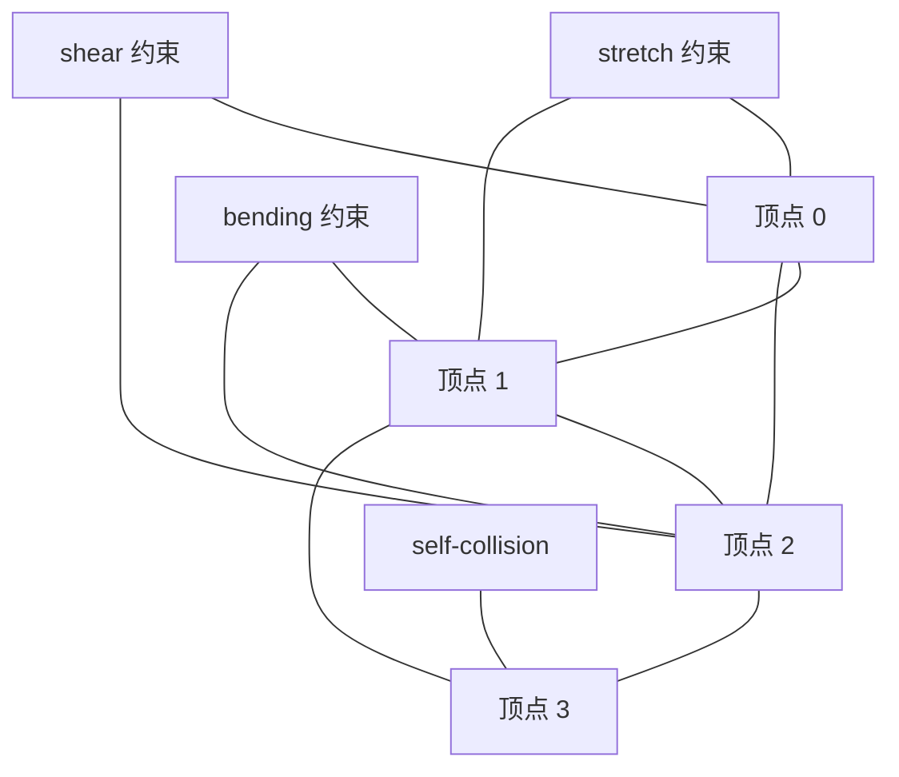
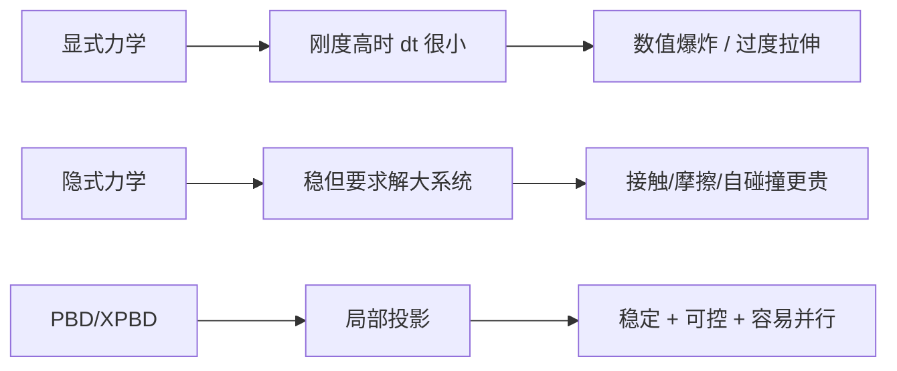

---
title: "游戏与引擎算法 05｜柔体模拟：质点弹簧与 PBD 布料"
slug: "algo-05-soft-body"
date: "2026-04-17"
description: "把布料和柔体从质点弹簧模型一路讲到 PBD / XPBD：为什么它稳定、为什么它快、什么时候会塌、怎么做自碰撞和并行化。"
tags:
  - "柔体模拟"
  - "质点弹簧"
  - "PBD"
  - "XPBD"
  - "布料模拟"
  - "自碰撞"
  - "数值稳定性"
  - "游戏物理"
series: "游戏与引擎算法"
weight: 1805
---

**一句话本质：柔体模拟就是把“形变”拆成一组局部可解的约束，再用数值方法把这些约束稳定地织回一张会抖、会垂、会撞的布。**

> 读这篇之前：建议先看 [游戏与引擎算法 41｜浮点精度与数值稳定性]()，以及 [数据结构与算法 13｜空间哈希：密集动态场景的 O(1) 近邻查询]() 和 [数据结构与算法 12｜BVH：层次包围体树]()。碰撞、邻域和误差控制，会直接决定布料看起来是“活着”还是“抽搐”。  
> 若你想把这篇和 Unity 的工程接口对齐，可以顺手看 [CPU 性能优化 06｜Unity 物理系统移动端优化]()。

## 问题动机

布料难，不在“能不能动”，而在“能不能稳定地动”。

一块斗篷或裙摆要同时满足四件事：重力下垂、被角色带着走、和身体或环境碰撞、自己不要穿自己。

如果你用最朴素的显式力学，刚度一高，时间步一大，系统就炸；如果你把刚度降下来，布又软得像橡皮筋。

真正的工程问题不是求出一条正确曲线，而是在 60/90/120 FPS 下，让它持续几十秒、几分钟都不出大错。

### 布料为什么总在“稳定”和“真实”之间打架


软体在游戏里通常有三种面孔。

第一种是角色布料，最常见。
第二种是橡胶、果冻、软壳，常常退化成“布料加体积约束”。
第三种是工程近似，比如软管、线缆、头发束，核心仍然是局部约束。

这篇先讲布料，因为它是柔体里最成熟、最容易落地、也最能看出方法差异的一类。

## 历史背景

90 年代的游戏硬件没有余量做大规模有限元。工程师最先找到的是质点弹簧：把布看成一张粒子网，每条边是一根弹簧，先能跑，再谈像不像。

Provot 在 1995 年讨论了质量-弹簧模型里的变形约束，核心意思很朴素：弹簧会把布拉长，必须再加一层“不能拉过头”的限制，否则视觉上马上穿帮。  
后来 Baraff、Witkin、Bridson 等人把碰撞、接触、摩擦和隐式积分逐步做扎实，布料才从“看起来像布”走向“能在镜头里用”。[^provot-bridson]

2007 年的 PBD 把视角彻底改了：与其先算力，再积分到位置，不如直接在位置层面投影约束。这样做的代价是它不再严格保留传统动力学里的每一份力学细节，换来的却是控制力、鲁棒性和非常适合实时应用的数值行为。[^pbd]

之后的 XPBD 进一步解决了一个老问题：PBD 的“刚度”会跟时间步和迭代次数绑在一起。XPBD 把 compliant constraint 明确写进公式里，让刚度参数更像一个真正的材料参数，而不是“调到能看”的魔法数。[^xpbd]

PhysX、Unity、Bullet 这些工业系统最终都走向了同一个事实：布料在游戏里首先是一个数值系统，其次才是物理系统。

[^provot-bridson]: [Provot 1995](https://graphicsinterface.org/proceedings/gi1995/gi1995-17/)；[Bridson et al. 2002](https://doi.org/10.1145/566654.566623)
[^pbd]: [Position Based Dynamics, 2007](https://diglib.eg.org/items/deb0a7a1-2ddf-496f-889a-fe0df1feeb73)
[^xpbd]: [XPBD: Position-Based Simulation of Compliant Constrained Dynamics](https://doi.org/10.1145/2994258.2994272)

## 数学基础

### 1. 质点弹簧系统

把布离散成顶点集合 \(x_i \in \mathbb{R}^3\)，每个顶点质量为 \(m_i\)。
边、对角线和折痕约束都可以视为弹簧。

单根弹簧的力可以写成：

$$
F_{ij} =
-k_{ij}\left(\|x_i-x_j\| - L_{ij}\right)\hat d_{ij}
-c_{ij}\left((v_i-v_j)\cdot \hat d_{ij}\right)\hat d_{ij}
$$

其中

$$
\hat d_{ij} = \frac{x_i-x_j}{\|x_i-x_j\|+\varepsilon}
$$

第一项是胡克定律，第二项是沿弹簧方向的阻尼。

系统总方程是：

$$
m_i \ddot x_i = \sum_{j \in \mathcal{N}(i)} F_{ij} + m_i g + f_i^{ext}
$$

这套模型的优点是直观。
缺点也直观：刚度高的时候，显式积分对时间步极其敏感。

对单自由度线性振子，角频率近似是：

$$
\omega_n = \sqrt{\frac{k}{m}}
$$

显式欧拉要想不炸，时间步必须压得很小。
经验上，\(dt\) 一旦接近 \(2/\omega_n\) 这个量级，振荡就会明显放大。

### 2. 位置约束的写法

PBD 不直接在力层面工作，而是把“不能超过多长”写成约束：

$$
C(x) = \|x_i-x_j\| - L_{ij} = 0
$$

对一个约束，位置修正可以写成：

$$
\Delta x_i = -w_i \nabla_i C \, \lambda,\qquad
\Delta x_j = -w_j \nabla_j C \, \lambda
$$

其中 \(w_i = 1/m_i\)。
若采用局部投影，常见的一步近似是：

$$
\lambda = \frac{C(x)}{\sum_k w_k \|\nabla_k C\|^2 + \varepsilon}
$$

这一步本质上是把违反约束的误差，按质量和梯度方向分摊回相关粒子。

### 3. Stretch / Shear / Bending 的区别

对三角网格布料：

- stretch 约束通常是边长约束。
- shear 约束通常是四边形两条对角线的约束。
- bending 约束通常是相邻三角形的二面角约束，或者用跨边顶点距离做近似。

用角度写，折痕约束可以记成：

$$
C_b(x) = \theta(x) - \theta_0
$$

角度法更接近几何意义。
距离法更便宜，也更适合大规模实时系统。

### 4. XPBD 为什么更像“材料参数”

XPBD 给约束引入 compliance \(\alpha\)：

$$
\Delta \lambda =
\frac{-C(x) - \alpha \lambda / \Delta t^2}
{\sum_k w_k \|\nabla_k C\|^2 + \alpha / \Delta t^2}
$$

这里的关键不是公式长，而是它把“刚度”和“步长/迭代数”拆开了。
这就是 XPBD 比传统 PBD 更像工程参数系统的原因。

### 5. 自碰撞也能写成约束

自碰撞不是“特殊效果”，它还是约束。
如果某个粒子和另一片三角形的最近距离小于阈值，就引入：

$$
C_{col}(x) = d(x,\triangle) - r \ge 0
$$

问题在于，这个约束数量巨大，且极不规则。
所以自碰撞往往要靠空间哈希或 BVH 先筛，再做窄相位修正。

## 算法推导

### 从弹簧到约束

质点弹簧把物理写成“力”。
PBD 把物理写成“违反了多少几何关系”。

这两个视角并不冲突。
对一根弹簧，如果只关心长度是否回到 rest length，本质上就是在最小化：

$$
E = \frac12 k(\|x_i-x_j\| - L_{ij})^2
$$

对这个能量做局部线性化，再投影回可行集，就得到 PBD 风格的更新。

这就是为什么很多工程师会说：PBD 不是“没有物理”，而是“把物理改写成更容易稳定求解的局部优化问题”。

### 为什么显式积分会输

显式积分先把力变成速度，再把速度变成位置。
问题是，刚度越大，系统的高频分量越强；时间步稍大一点，数值误差就会被当成真实动能放大。

在布料上，这会表现成两件事：

1. 过度拉伸。
2. 高速抖动或“爆布”。

隐式积分更稳，但它通常需要解大规模线性系统，碰撞和非线性约束还会把系统推得更重。
PBD 的工程折中在于：把全局大系统拆成很多局部投影。

### 为什么 PBD 适合实时

PBD 的每个约束都只依赖一小撮粒子。
这让它天然适合“按约束批次并行”，也适合把碰撞、关节、布料、体积都塞进统一框架。

它不是严格的动力学求解器。
但在游戏里，画面稳定、交互可控、调参可理解，这些往往比“严格”更贵。

### 一张图看懂 PBD 布料管线

```mermaid
flowchart TD
    A[三角网格/四边形网格] --> B[预处理: stretch/shear/bending/fix]
    B --> C[预测位置 x* = x + v dt + a dt^2]
    C --> D[迭代投影约束]
    D --> E[碰撞约束]
    E --> F[自碰撞: 空间哈希 / BVH]
    F --> G[速度回写 v = (x_new - x_old)/dt]
    G --> H[渲染与骨骼跟随]
```

## 算法实现

下面给的是一个可直接落地的 C# 骨架。
它分成两层：第一层是经典质点弹簧，第二层是 PBD / XPBD 风格的投影求解。

### 1. 质点弹簧布料

```csharp
using System;
using System.Collections.Generic;
using System.Numerics;

public sealed class MassSpringCloth
{
    private readonly Vector3[] _x;
    private readonly Vector3[] _v;
    private readonly float[] _mass;
    private readonly Spring[] _springs;
    private readonly int[] _pinned;
    private readonly Vector3[] _pinnedRestPositions;
    private readonly bool[] _isPinned;
    private readonly Vector3[] _forces;

    public MassSpringCloth(Vector3[] positions, float[] mass, Spring[] springs, int[] pinned)
    {
        _x = (Vector3[])positions.Clone();
        _v = new Vector3[positions.Length];
        _mass = (float[])mass.Clone();
        _springs = springs;
        _pinned = (int[])pinned.Clone();
        _pinnedRestPositions = (Vector3[])positions.Clone();
        _isPinned = new bool[positions.Length];
        _forces = new Vector3[positions.Length];

        for (int i = 0; i < _pinned.Length; i++)
        {
            _isPinned[_pinned[i]] = true;
        }
    }

    public void Step(float dt, Vector3 gravity, float globalDamping)
    {
        Array.Clear(_forces, 0, _forces.Length);

        for (int i = 0; i < _x.Length; i++)
        {
            if (_mass[i] <= 0 || _isPinned[i]) continue;
            _forces[i] += gravity * _mass[i];
            _forces[i] += -globalDamping * _v[i];
        }

        for (int s = 0; s < _springs.Length; s++)
        {
            ref readonly var sp = ref _springs[s];
            int a = sp.A;
            int b = sp.B;

            Vector3 d = _x[b] - _x[a];
            float len = d.Length();
            if (len < 1e-6f) continue;

            Vector3 dir = d / len;
            float relVel = Vector3.Dot(_v[b] - _v[a], dir);
            float fs = -sp.Stiffness * (len - sp.RestLength) - sp.Damping * relVel;
            Vector3 f = fs * dir;

            _forces[a] += f;
            _forces[b] -= f;
        }

        for (int i = 0; i < _x.Length; i++)
        {
            if (_mass[i] <= 0 || _isPinned[i]) continue;
            float invMass = 1.0f / _mass[i];
            _v[i] += dt * _forces[i] * invMass;
            _x[i] += dt * _v[i];
        }

        for (int i = 0; i < _pinned.Length; i++)
        {
            int idx = _pinned[i];
            _x[idx] = _pinnedRestPositions[idx];
            _v[idx] = Vector3.Zero;
        }
    }

    public readonly record struct Spring(int A, int B, float RestLength, float Stiffness, float Damping);
}
```

这个版本适合讲原理，也适合做对照组。
但它不适合直接当最终布料方案，因为稳定性和可调性都不够。

### 2. PBD / XPBD 布料

```csharp
public sealed class PbdCloth
{
    private readonly Vector3[] _x;
    private readonly Vector3[] _xPrev;
    private readonly Vector3[] _v;
    private readonly float[] _invMass;
    private readonly DistanceConstraint[] _stretch;
    private readonly DistanceConstraint[] _shear;
    private readonly BendConstraint[] _bend;

    public PbdCloth(Vector3[] positions, float[] invMass,
                    DistanceConstraint[] stretch,
                    DistanceConstraint[] shear,
                    BendConstraint[] bend)
    {
        _x = (Vector3[])positions.Clone();
        _xPrev = (Vector3[])positions.Clone();
        _v = new Vector3[positions.Length];
        _invMass = (float[])invMass.Clone();
        _stretch = stretch;
        _shear = shear;
        _bend = bend;
    }

    public void Step(float dt, int iterations, Vector3 gravity, float compliance = 0f)
    {
        for (int i = 0; i < _x.Length; i++)
        {
            _xPrev[i] = _x[i];
            if (_invMass[i] <= 0) continue;
            _v[i] += gravity * dt;
            _x[i] += _v[i] * dt;
        }

        for (int iter = 0; iter < iterations; iter++)
        {
            SolveDistanceBatch(_stretch, dt, compliance);
            SolveDistanceBatch(_shear, dt, compliance);
            SolveBendBatch(_bend, dt, compliance);
            SolveSelfCollision(dt);
        }

        for (int i = 0; i < _x.Length; i++)
        {
            _v[i] = (_x[i] - _xPrev[i]) / dt;
        }
    }

    private void SolveDistanceBatch(DistanceConstraint[] constraints, float dt, float compliance)
    {
        for (int c = 0; c < constraints.Length; c++)
        {
            ref var con = ref constraints[c];
            int i = con.I;
            int j = con.J;
            Vector3 d = _x[i] - _x[j];
            float len = d.Length();
            if (len < 1e-6f) continue;

            Vector3 grad = d / len;
            float C = len - con.RestLength;
            float w = _invMass[i] + _invMass[j];
            if (w <= 0) continue;

            float alpha = compliance / (dt * dt);
            float lambda = -C / (w + alpha);
            Vector3 corr = lambda * grad;

            if (_invMass[i] > 0) _x[i] += _invMass[i] * corr;
            if (_invMass[j] > 0) _x[j] -= _invMass[j] * corr;
        }
    }

    private void SolveBendBatch(BendConstraint[] constraints, float dt, float compliance)
    {
        for (int c = 0; c < constraints.Length; c++)
        {
            ref var con = ref constraints[c];
            int i = con.I0;
            int j = con.I1;
            int k = con.I2;
            int l = con.I3;

            float theta = ComputeDihedralAngle(_x[i], _x[j], _x[k], _x[l]);
            float C = theta - con.RestAngle;
            float w = _invMass[i] + _invMass[j] + _invMass[k] + _invMass[l];
            if (w <= 0) continue;

            float alpha = compliance / (dt * dt);
            float lambda = -C / (w + alpha);
            Vector3 n = con.BendDirection;

            if (_invMass[i] > 0) _x[i] += _invMass[i] * lambda * n;
            if (_invMass[j] > 0) _x[j] -= _invMass[j] * lambda * n;
            if (_invMass[k] > 0) _x[k] += _invMass[k] * lambda * n;
            if (_invMass[l] > 0) _x[l] -= _invMass[l] * lambda * n;
        }
    }

    private void SolveSelfCollision(float dt)
    {
        _ = dt;
        // 实际工程里这里应该接空间哈希或 BVH。
        // 下面只表达核心思想：找出近邻后做分离投影。
    }

    private static float ComputeDihedralAngle(Vector3 a, Vector3 b, Vector3 c, Vector3 d)
    {
        Vector3 n0 = Vector3.Cross(c - a, c - b);
        Vector3 n1 = Vector3.Cross(d - b, d - a);

        float n0Len = n0.Length();
        float n1Len = n1.Length();
        if (n0Len < 1e-6f || n1Len < 1e-6f)
        {
            return 0f;
        }

        n0 /= n0Len;
        n1 /= n1Len;

        Vector3 edge = b - a;
        float edgeLen = edge.Length();
        if (edgeLen < 1e-6f)
        {
            return 0f;
        }

        Vector3 edgeDir = edge / edgeLen;
        float sinTheta = Vector3.Dot(Vector3.Cross(n0, n1), edgeDir);
        float cosTheta = Math.Clamp(Vector3.Dot(n0, n1), -1f, 1f);
        return MathF.Atan2(sinTheta, cosTheta);
    }

    public readonly record struct DistanceConstraint(int I, int J, float RestLength);
    public readonly record struct BendConstraint(int I0, int I1, int I2, int I3, float RestAngle, Vector3 BendDirection);
}
```

这个版本的关键是顺序。
stretch、shear、bending、碰撞各自是不同的几何误差源。
如果你把它们混在一锅里，调参会非常痛苦。

### 3. 自碰撞的空间哈希骨架

```csharp
public sealed class ClothSpatialHash
{
    private readonly float _cellSize;
    private readonly Dictionary<long, List<int>> _buckets = new();

    public ClothSpatialHash(float cellSize) => _cellSize = cellSize;

    public void Build(ReadOnlySpan<Vector3> positions)
    {
        _buckets.Clear();
        for (int i = 0; i < positions.Length; i++)
        {
            long key = Hash(positions[i]);
            if (!_buckets.TryGetValue(key, out var list))
            {
                list = new List<int>(8);
                _buckets[key] = list;
            }
            list.Add(i);
        }
    }

    private long Hash(Vector3 p)
    {
        int ix = (int)MathF.Floor(p.X / _cellSize);
        int iy = (int)MathF.Floor(p.Y / _cellSize);
        int iz = (int)MathF.Floor(p.Z / _cellSize);
        return ((long)ix * 73856093) ^ ((long)iy * 19349663) ^ ((long)iz * 83492791);
    }
}
```

空间哈希的作用不是“让碰撞更聪明”。
它只是把本来 \(O(n^2)\) 的近邻候选，压成接近 \(O(n)\) 的平均成本。

## 结构图 / 流程图

### 约束图就是并行边界



同一轮并行求解时，凡是共享粒子的约束都不能同时写回位置。
所以工程上常见的做法是：

- Jacobi：全部读旧值，最后统一写回。
- Gauss-Seidel：逐个约束更新，收敛快，但串行味更重。
- 图着色：把互不冲突的约束分组，组内并行、组间串行。

### PBD 比质量-弹簧稳在哪里



## 复杂度分析

| 模块 | 平均时间 | 最坏时间 | 空间 |
|---|---:|---:|---:|
| 质点弹簧主循环 | \(O(V+S)\) | \(O(V+S)\) | \(O(V+S)\) |
| PBD 约束迭代 | \(O(I \cdot C)\) | \(O(I \cdot C)\) | \(O(V+C)\) |
| 空间哈希自碰撞 | 近似 \(O(V)\) | \(O(V^2)\) | \(O(V)\) |
| BVH 自碰撞 | \(O(V \log V)\) | \(O(V^2)\) | \(O(V)\) |

这里 \(V\) 是顶点数，\(S\) 是弹簧数，\(C\) 是约束数，\(I\) 是迭代次数。

布料真正贵的不是积分，而是“碰撞 + 约束迭代 + cache miss”。

## 变体与优化

1. **XPBD**
   让 stretch、shear、bending 的刚度不再跟迭代次数强绑定。
   适合需要统一调参的生产项目。

2. **Long Range Attachments**
   用远距离锚点抑制整体过伸。
   这类约束常被用在 Unity / PhysX 一类实时系统里。

3. **图着色并行**
   把约束图按冲突关系分层，组内 SIMD 或 GPU 并行。
   这对固定拓扑的布料非常有效。

4. **分岛求解**
   把彼此断开的布片拆成多个 island。
   角色斗篷、裙摆、围巾通常都可以这么做。

5. **GPU 化**
   顶点预测、空间哈希、约束分组都可以搬到 GPU。
   真正要注意的是同步点，不是把所有代码机械搬走就叫加速。

6. **混合精度**
   位置和速度常用 `float`，累积量、平面法线和角度计算有时需要更稳的中间量。
   如果你在移动端做回放确定性，这一点尤其重要。

## 对比其他算法

| 方法 | 优点 | 缺点 | 适用场景 |
|---|---|---|---|
| 质点弹簧 | 直观、实现快 | 刚度依赖 dt，容易炸 | 原型、简单布片 |
| 隐式弹簧 | 稳定性更好 | 线性系统重，接触难 | 中小规模高质量布料 |
| PBD | 稳、好调、碰撞友好 | 不是严格动力学 | 游戏实时布料 |
| XPBD | 刚度更可控 | 实现比 PBD 复杂 | 生产级实时软体 |
| FEM / IGA | 物理更严谨 | 成本高、工程复杂 | 高保真、离线或准实时 |

## 批判性讨论

PBD 在游戏里很强，但它不是银弹。

第一，它的“真实感”是几何真实感，不是材料学真实感。
第二，它的结果对约束设计高度敏感，设计不好就会“像布但不是布”。
第三，它在极端拉伸、极端压缩和强摩擦接触下，还是会暴露局部误差。

如果你的目标是应力分布、撕裂扩展、纤维方向性，或者要拿去做工程验证，PBD 不是最终答案。
这时更合适的是连续介质模型、FEM、IGA，或者更现代的 MPM / 壳模型。

对游戏来说，最优先的指标通常不是“物理最真”，而是“误差可控、预算可控、结果可控”。
这也是 PBD 仍然活得很好的原因。

## 跨学科视角

PBD 本质上很像一个投影型优化器。
它在每个小约束上做局部最小化，再把结果拼起来。

这和数值优化里的 projected Gauss-Seidel 很接近。
和图着色并行求解很接近。
和几何约束满足问题也很接近。

你甚至可以把它看成“对一个时变可行域做增量投影”。
从这个角度看，布料求解不是单纯物理，而是几何、优化和并行计算的交叉点。

## 真实案例

- [bulletphysics/bullet3](https://github.com/bulletphysics/bullet3) 的 soft body 模块是工业里最知名的开源软体实现之一，文档和源码入口分别可从 [`btSoftBody.h`](https://pybullet.org/Bullet/BulletFull/btSoftBody_8h.html) 和 [`btSoftBody.cpp`](https://pybullet.org/Bullet/BulletFull/btSoftBody_8cpp.html) 追到核心求解逻辑。
- [NVIDIA PhysX Cloth](https://docs.nvidia.com/gameworks/content/gameworkslibrary/physx/guide/3.3.4/Manual/Cloth.html) 明确把 stretch、shear、bending、自碰撞、GPU cloth 写进官方手册；对应头文件入口是 [`PxCloth.h`](https://docs.nvidia.com/gameworks/content/gameworkslibrary/physx/apireference/files/PxCloth_8h.html)。
- [Unity Cloth](https://docs.unity.cn/2021.1/Documentation/Manual/class-Cloth.html) 的官方文档直接暴露了 `Stretching Stiffness`、`Bending Stiffness`、`Use Tethers`、`Use Continuous Collision` 和 `Use Virtual Particles`，这很典型地体现了 PBD 系统的工程取舍。

## 量化数据

PhysX 官方手册给过两个很有用的工程量级：

- GPU cloth 需要考虑共享内存大小，文档提到大约 **2500–2900 粒子** 能放进 shared memory 的量级。
- GPU 模式下，碰撞三角形数量会被限制到 **500** 左右，原因就是片上资源预算。

更外层的性能数据也很说明问题。
2025 年的一篇 GPU-PBD cloth 对比里，**32×32** 网格单面布能维持约 **72 FPS**，**64×64** 单面布约 **65 FPS**，双面布约 **40 FPS**。[^gpu-pbd-2025]

另一篇多 GPU cloth 工作在 **0.5–1.65M triangles** 的尺度上，报告了 **2–5 fps** 的交互帧率，并观察到近线性的 GPU 扩展。[^pcloth]

[^gpu-pbd-2025]: [Real-Time Cloth Simulation in Extended Reality: Comparative Study Between Unity Cloth Model and Position-Based Dynamics Model with GPU](https://doi.org/10.3390/app15126611)
[^pcloth]: [P-Cloth: Interactive Complex Cloth Simulation on Multi-GPU Systems using Dynamic Matrix Assembly and Pipelined Implicit Integrators](https://arxiv.org/abs/2008.00409)

## 常见坑

1. **把 spring stiffness 直接当材料参数**
   错在 mesh 变密后，等效刚度会变。
   改法是按边长、面积和时间步重新标定，或者直接换 XPBD。

2. **把自碰撞只做成粒子-粒子**
   错在布片薄的时候，粒子间距并不等于面间距。
   改法是加粒子-三角形、边-边和虚粒子接触。

3. **碰撞和约束放在同一条串行队列里**
   错在把本可并行的工作全部串起来。
   改法是先做 broad phase，再按约束类型和冲突图分批。

4. **直接在世界空间里硬拉角色骨骼**
   错在角色运动会把局部惯性放大成布面抖动。
   改法是像 PhysX 那样把布料放在 local simulation frame 里处理。

5. **忽略浮点误差累积**
   错在布料迭代一多，微小误差会慢慢变成皱褶漂移。
   改法是参照 [algo-41]() 做阈值、归一化和稳定分支。

## 何时用 / 何时不用

### 适合用

- 实时布料。
- 角色身上的斗篷、围巾、裙摆。
- 需要大量碰撞和可控调参的软体。
- CPU 预算有限但需要稳定帧率的项目。

### 不适合用

- 你要真实应力和应变场。
- 你要撕裂、缝合、材料分层。
- 你要严格守恒的工程仿真。
- 你要拿结果做结构分析或科学计算。

## 相关算法

- [游戏与引擎算法 41｜浮点精度与数值稳定性]()
- [数据结构与算法 12｜BVH：层次包围体树]()
- [数据结构与算法 13｜空间哈希：密集动态场景的 O(1) 近邻查询]()
- [CPU 性能优化 06｜Unity 物理系统移动端优化]()

## 小结

质点弹簧解决了“布能动”的问题。
PBD 解决了“布能稳地动”的问题。
XPBD 进一步把“能稳地动”和“材料参数可控”接了起来。

如果你只想让布片跑起来，质量-弹簧足够。
如果你要把它放进真实项目并长期维护，PBD / XPBD 才是更可靠的工程底座。


## 参考资料

- [Provot 1995, Deformation Constraints in a Mass-Spring Model to Describe Rigid Cloth Behaviour](https://graphicsinterface.org/proceedings/gi1995/gi1995-17/)
- [Bridson et al. 2002, Robust Treatment of Collisions, Contact and Friction for Cloth Animation](https://doi.org/10.1145/566654.566623)
- [Position Based Dynamics, 2007](https://diglib.eg.org/items/deb0a7a1-2ddf-496f-889a-fe0df1feeb73)
- [XPBD: Position-Based Simulation of Compliant Constrained Dynamics](https://doi.org/10.1145/2994258.2994272)
- [Bullet Soft Body API](https://pybullet.org/Bullet/BulletFull/btSoftBody_8h.html)
- [NVIDIA PhysX Cloth Manual](https://docs.nvidia.com/gameworks/content/gameworkslibrary/physx/guide/3.3.4/Manual/Cloth.html)
- [Unity Cloth Manual](https://docs.unity.cn/2021.1/Documentation/Manual/class-Cloth.html)
