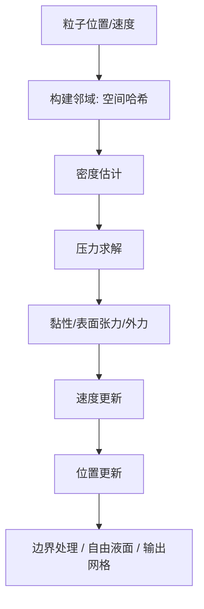
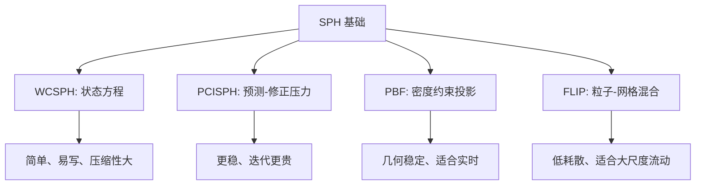
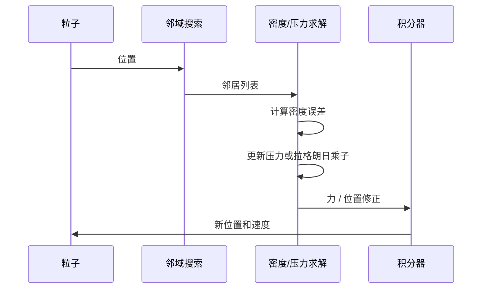

---
title: "游戏与引擎算法 06｜SPH 平滑粒子流体力学"
slug: "algo-06-sph-fluid"
date: "2026-04-17"
description: "把 SPH 从核函数、密度估计和压力求解讲到 WCSPH、PCISPH、PBF、FLIP 的取舍，再落到邻域搜索、稳定性和工程实现。"
tags:
  - "SPH"
  - "流体模拟"
  - "核函数"
  - "邻域搜索"
  - "WCSPH"
  - "PCISPH"
  - "PBF"
  - "FLIP"
series: "游戏与引擎算法"
weight: 1806
---

**一句话本质：SPH 是把连续流体离散成粒子，再用核函数把“局部邻域里的平均行为”拼回流体方程。**

> 读这篇之前：建议先看 [游戏与引擎算法 41｜浮点精度与数值稳定性]() 和 [数据结构与算法 13｜空间哈希：密集动态场景的 O(1) 近邻查询]()。SPH 的成本和稳定性，几乎都卡在这两件事上。  
> 如果你想看 SPH 在工程系统里的落地，可以再参考 [CPU 性能优化 06｜Unity 物理系统移动端优化]() 的缓存和批处理思路。

## 问题动机

流体模拟最难的地方，不是“让水动起来”，而是“让水在复杂边界里依然像水”。

网格法擅长封闭域和规则边界。
但一旦有喷溅、破碎、自由液面、飞沫、局部破洞，网格就会开始处理拓扑和重网格，而不是处理物理本身。

SPH 选了另一条路：不用显式网格，直接拿粒子近似连续介质。
这让它天然适合自由液面、强变形和复杂耦合。

### 为什么游戏和工程都爱 SPH


SPH 在游戏里的价值很明确。

- 不需要维护显式液面网格。
- 和刚体、布料、可破碎物的耦合更直接。
- 并行粒度天然很细，适合 GPU。

代价也很明确。

- 你必须做邻域搜索。
- 你必须处理核函数和边界误差。
- 你必须控制压缩性、粒子噪声和时间步稳定性。

## 历史背景

SPH 最早来自天体物理和流体力学研究。
Lucy 与 Monaghan 在 1977 年前后分别提出了粒子化的平滑近似思路，后来 Monaghan 在 1992 年的综述里把 SPH 的核函数、守恒形式和数值特性系统整理出来。[^monaghan]

那一代方法的原始动机很朴素：当连续介质的边界很复杂、网格很难铺、或者局部极端变形太强时，粒子法比网格法更自然。

到了游戏和图形学里，真正把 SPH 变成实时工具的，是一串工程化改造：

- 2003 年的粒子流体用于交互式图形。
- 2009 年的 PCISPH 让“不可压缩”这件事更像实时系统能承受的事。[^pcisph]
- 2013 年的 PBF 把 SPH 的不可压缩约束改写成 PBD 风格的密度投影。[^pbf]
- 之后的 SPlisHSPlasH、DualSPHysics 等项目把 GPU、AVX 和更丰富的压力求解器接进来，SPH 才真正成为可复用的工程库。[^splash][^dual]

[^monaghan]: [Monaghan 1992, Smoothed Particle Hydrodynamics](https://www.annualreviews.org/doi/pdf/10.1146/annurev.aa.30.090192.002551)
[^pcisph]: [Predictive-Corrective Incompressible SPH](https://doi.org/10.1145/1531326.1531346)
[^pbf]: [Position Based Fluids](https://doi.org/10.1145/2461912.2461984)
[^splash]: [SPlisHSPlasH official site](https://splishsplash.physics-simulation.org/)
[^dual]: [DualSPHysics GitHub](https://github.com/DualSPHysics/DualSPHysics)

## 数学基础

### 1. 核函数插值

SPH 的核心公式不是压力，而是插值。

对任意场量 \(A(x)\)，SPH 近似可以写成：

$$
A(x) \approx \sum_j \frac{m_j}{\rho_j} A_j W(\|x-x_j\|, h)
$$

这里 \(W\) 是核函数，\(h\) 是平滑长度。
核函数要满足非负、归一化、紧支撑，最好还要足够光滑。

### 2. 密度估计

密度最常见的离散写法是：

$$
\rho_i = \sum_j m_j W_{ij}
$$

其中 \(W_{ij} = W(\|x_i-x_j\|, h)\)。

这意味着粒子的“密度”不是单点属性，而是邻域统计量。
这也是 SPH 和粒子系统看起来像、但本质上不同的地方。

### 3. 动量方程

对压强项，常见的对称离散形式是：

$$
f_i^{pressure} =
-\sum_j m_j\left(\frac{p_i}{\rho_i^2}+\frac{p_j}{\rho_j^2}\right)\nabla W_{ij}
$$

对黏性项，常用离散形式之一是：

$$
f_i^{visc} = \mu \sum_j m_j \frac{v_j-v_i}{\rho_j} \nabla^2 W_{ij}
$$

这两个式子都依赖邻居。
这就是 SPH 为什么永远绕不开邻域搜索。

### 4. WCSPH 的压力方程

最早也最朴素的实时做法，是弱可压缩 SPH。
它不直接解不可压缩约束，而是用状态方程把密度误差转成压力：

$$
p_i = c_0^2(\rho_i-\rho_0)
$$

或者更强一点的多项式形式：

$$
p_i = k\left(\left(\frac{\rho_i}{\rho_0}\right)^\gamma - 1\right)
$$

代价是：你得把声速 \(c_0\) 设得足够大，压缩才小；但声速越大，时间步越难放大。

### 5. 稳定性条件

SPH 的时间步通常同时受三个量限制：

$$
\Delta t \lesssim C_{cfl}\frac{h}{c_0 + u_{max}}
$$

$$
\Delta t \lesssim C_{\nu}\frac{h^2}{\nu}
$$

$$
\Delta t \lesssim C_g\sqrt{\frac{h}{\|g\|}}
$$

不同实现会有不同常数，但方向一致：声速、黏性、重力越大，时间步越保守。

### 6. 为什么边界这么重要

密度估计本质上依赖邻域采样完整性。
在自由液面和固体边界附近，邻居缺失会把密度和压力都拉偏。

所以现实里的 SPH 总要和以下技术配套：

- 虚粒子或边界粒子。
- 反射/镜像边界。
- 固体接触约束。
- 近似壁面法向和距离修正。

## 算法推导

### 从连续方程到粒子方程

SPH 的思路是：

1. 用核函数把场量局部平均化。
2. 把连续偏导换成核函数梯度。
3. 用有限粒子近似积分。

这一步把 PDE 变成了对邻域粒子的局部求和。
优点是局部性和可并行性。
缺点是核函数选不好、邻域不够密、边界不对称时，误差会直接体现在水面噪声上。

### WCSPH / PCISPH / PBF / FLIP 的关系

它们并不是四个“互相无关”的算法。
它们更像一条演化链。

- WCSPH：用状态方程把密度误差转成压力。
- PCISPH：把压力看成迭代修正量，主动压密度。
- PBF：把密度约束写成位置投影。
- FLIP：保留粒子，借助网格传输减少耗散，适合大尺度低耗散流动。

### 一张图看懂 SPH 求解管线



### WCSPH 的核心代价

WCSPH 很容易写。
但它最麻烦的地方也很明显：如果你想把可压缩性压低，就得提高声速；声速一高，CFL 限制就会把时间步压死。

这也是为什么实时系统经常会从 WCSPH 走向 PCISPH 或 PBF。
后两者更像“先猜，再修正”。

### PCISPH 和 PBF 的差别

PCISPH 仍然在力层面迭代压力。
PBF 则干脆把密度约束投影到位置上。

二者都在追求同一件事：不要让粒子团被压得太散，也不要让求解器为了不可压缩性付出过高代价。

### FLIP 为什么经常和 SPH 放一起比较

FLIP 不是纯 SPH。
它是粒子-网格混合方法。

它的强项是低数值耗散，适合长距离输运、飞溅、旋涡和大尺度流动。
它的弱项是网格传输误差、压力噪声和更复杂的数据通路。

所以在工程上，SPH 更像“局部、自由液面、耦合友好”。
FLIP 更像“低耗散、大场景、混合管线”。

## 算法实现

下面的代码给一个可落地的 C# 骨架。
它以 WCSPH 为主，但把 PCISPH / PBF / FLIP 的分支接口留出来。

### 1. 粒子、核函数和空间哈希

```csharp
using System;
using System.Collections.Generic;
using System.Numerics;

public sealed class SphFluidSolver
{
    public enum Mode
    {
        WCSPH,
        PCISPH,
        PBF
    }

    public sealed class Particle
    {
        public Vector3 Position;
        public Vector3 Velocity;
        public Vector3 Force;
        public float Density;
        public float Pressure;
    }

    private readonly Particle[] _p;
    private readonly float _mass;
    private readonly float _restDensity;
    private readonly float _h;
    private readonly float _viscosity;
    private readonly Mode _mode;
    private readonly SpatialHashGrid _grid;
    private readonly Vector3[] _predicted;
    private readonly Vector3[] _deltaPositions;
    private readonly float[] _lambdas;

    public SphFluidSolver(Particle[] particles, float mass, float restDensity, float h, float viscosity, Mode mode)
    {
        _p = particles;
        _mass = mass;
        _restDensity = restDensity;
        _h = h;
        _viscosity = viscosity;
        _mode = mode;
        _grid = new SpatialHashGrid(h);
        _predicted = new Vector3[particles.Length];
        _deltaPositions = new Vector3[particles.Length];
        _lambdas = new float[particles.Length];
    }

    public void Step(float dt, Vector3 gravity)
    {
        if (dt <= 0f)
            throw new ArgumentOutOfRangeException(nameof(dt));

        ComputeDensity();

        switch (_mode)
        {
            case Mode.WCSPH:
                ComputePressureAndForces(gravity);
                Integrate(dt);
                break;
            case Mode.PCISPH:
                SolvePressureIteratively(dt, gravity);
                break;
            case Mode.PBF:
                SolveDensityConstraints(dt, gravity);
                break;
        }
    }

    private void ComputeDensity()
    {
        _grid.Rebuild(_p);
        for (int i = 0; i < _p.Length; i++)
        {
            float rho = 0f;
            foreach (int j in _grid.QueryNeighbors(_p[i].Position))
            {
                float r = Vector3.Distance(_p[i].Position, _p[j].Position);
                rho += _mass * Poly6(r, _h);
            }
            _p[i].Density = rho;
        }
    }

    private void ComputeDensity(ReadOnlySpan<Vector3> positions)
    {
        _grid.Rebuild(positions);
        for (int i = 0; i < positions.Length; i++)
        {
            float rho = 0f;
            foreach (int j in _grid.QueryNeighbors(positions[i]))
            {
                float r = Vector3.Distance(positions[i], positions[j]);
                rho += _mass * Poly6(r, _h);
            }
            _p[i].Density = rho;
        }
    }

    private void ComputePressureAndForces(Vector3 gravity)
    {
        for (int i = 0; i < _p.Length; i++)
        {
            _p[i].Force = gravity * _mass;
            _p[i].Pressure = GasEquation(_p[i].Density);
        }

        for (int i = 0; i < _p.Length; i++)
        {
            foreach (int j in _grid.QueryNeighbors(_p[i].Position))
            {
                if (j <= i) continue;

                Vector3 rij = _p[i].Position - _p[j].Position;
                float r = rij.Length();
                if (r < 1e-6f || r >= _h) continue;

                Vector3 grad = SpikyGrad(rij, _h);
                float pressure = -_mass * (_p[i].Pressure / (_p[i].Density * _p[i].Density + 1e-6f)
                                         + _p[j].Pressure / (_p[j].Density * _p[j].Density + 1e-6f));
                Vector3 fPressure = pressure * grad;

                Vector3 fVisc = _viscosity * _mass * (_p[j].Velocity - _p[i].Velocity)
                              / (_p[j].Density + 1e-6f) * ViscosityLaplacian(r, _h);

                _p[i].Force += fPressure + fVisc;
                _p[j].Force -= fPressure + fVisc;
            }
        }
    }

    private void Integrate(float dt)
    {
        for (int i = 0; i < _p.Length; i++)
        {
            float invRho = 1.0f / MathF.Max(_p[i].Density, 1e-6f);
            Vector3 accel = _p[i].Force * invRho;
            _p[i].Velocity += dt * accel;
            _p[i].Position += dt * _p[i].Velocity;
        }
    }

    private void PredictPositions(float dt, Vector3 gravity)
    {
        for (int i = 0; i < _p.Length; i++)
        {
            _p[i].Pressure = 0f;
            _lambdas[i] = 0f;
            _deltaPositions[i] = Vector3.Zero;

            Vector3 predictedVelocity = _p[i].Velocity + gravity * dt;
            _predicted[i] = _p[i].Position + predictedVelocity * dt;
        }
    }

    private void CommitPredicted(float dt)
    {
        for (int i = 0; i < _p.Length; i++)
        {
            Vector3 oldPosition = _p[i].Position;
            _p[i].Position = _predicted[i];
            _p[i].Velocity = (_predicted[i] - oldPosition) / dt;
        }
    }

    private void SolvePressureIteratively(float dt, Vector3 gravity)
    {
        PredictPositions(dt, gravity);

        const int maxIterations = 4;
        const float pressureGain = 0.25f;

        for (int iter = 0; iter < maxIterations; iter++)
        {
            ComputeDensity(_predicted);
            Array.Clear(_deltaPositions, 0, _deltaPositions.Length);

            for (int i = 0; i < _p.Length; i++)
            {
                float densityError = MathF.Max(_p[i].Density - _restDensity, 0f);
                _p[i].Pressure += pressureGain * densityError;
            }

            for (int i = 0; i < _p.Length; i++)
            {
                Vector3 correction = Vector3.Zero;
                foreach (int j in _grid.QueryNeighbors(_predicted[i]))
                {
                    if (j == i) continue;

                    Vector3 rij = _predicted[i] - _predicted[j];
                    float r = rij.Length();
                    if (r < 1e-6f || r >= _h) continue;

                    Vector3 grad = SpikyGrad(rij, _h);
                    float sharedPressure = 0.5f * (_p[i].Pressure + _p[j].Pressure);
                    correction += -(dt * dt) * sharedPressure * grad / MathF.Max(_restDensity * _restDensity, 1e-6f);
                }
                _deltaPositions[i] = correction;
            }

            for (int i = 0; i < _p.Length; i++)
            {
                _predicted[i] += _deltaPositions[i];
            }
        }

        CommitPredicted(dt);
    }

    private void SolveDensityConstraints(float dt, Vector3 gravity)
    {
        PredictPositions(dt, gravity);

        const int maxIterations = 4;
        const float epsilon = 1e-5f;

        for (int iter = 0; iter < maxIterations; iter++)
        {
            ComputeDensity(_predicted);

            for (int i = 0; i < _p.Length; i++)
            {
                float constraint = _p[i].Density / MathF.Max(_restDensity, 1e-6f) - 1f;
                Vector3 gradI = Vector3.Zero;
                float sumGrad2 = 0f;

                foreach (int j in _grid.QueryNeighbors(_predicted[i]))
                {
                    if (j == i) continue;

                    Vector3 gradJ = (_mass / MathF.Max(_restDensity, 1e-6f)) * SpikyGrad(_predicted[i] - _predicted[j], _h);
                    sumGrad2 += gradJ.LengthSquared();
                    gradI += gradJ;
                }

                sumGrad2 += gradI.LengthSquared();
                _lambdas[i] = -constraint / (sumGrad2 + epsilon);
            }

            Array.Clear(_deltaPositions, 0, _deltaPositions.Length);
            for (int i = 0; i < _p.Length; i++)
            {
                Vector3 correction = Vector3.Zero;
                foreach (int j in _grid.QueryNeighbors(_predicted[i]))
                {
                    if (j == i) continue;

                    Vector3 grad = SpikyGrad(_predicted[i] - _predicted[j], _h);
                    correction += (_lambdas[i] + _lambdas[j]) * grad;
                }

                _deltaPositions[i] = correction / MathF.Max(_restDensity, 1e-6f);
            }

            for (int i = 0; i < _p.Length; i++)
            {
                _predicted[i] += _deltaPositions[i];
            }
        }

        CommitPredicted(dt);
    }

    private float GasEquation(float density)
    {
        const float c0 = 20f;
        return c0 * c0 * (density - _restDensity);
    }

    private static float Poly6(float r, float h)
    {
        if (r >= h) return 0f;
        float x = h * h - r * r;
        return 315f / (64f * MathF.PI * MathF.Pow(h, 9)) * x * x * x;
    }

    private static Vector3 SpikyGrad(Vector3 rij, float h)
    {
        float r = rij.Length();
        if (r < 1e-6f || r >= h) return Vector3.Zero;
        float factor = -45f / (MathF.PI * MathF.Pow(h, 6)) * MathF.Pow(h - r, 2) / r;
        return factor * rij;
    }

    private static float ViscosityLaplacian(float r, float h)
    {
        if (r >= h) return 0f;
        return 45f / (MathF.PI * MathF.Pow(h, 6)) * (h - r);
    }
}
```

### 2. 邻域搜索

```csharp
public sealed class SpatialHashGrid
{
    private readonly float _cellSize;
    private readonly Dictionary<long, List<int>> _buckets = new();

    public SpatialHashGrid(float cellSize) => _cellSize = cellSize;

    public void Rebuild(ReadOnlySpan<SphFluidSolver.Particle> particles)
    {
        _buckets.Clear();
        for (int i = 0; i < particles.Length; i++)
        {
            AddParticle(i, particles[i].Position);
        }
    }

    public void Rebuild(ReadOnlySpan<Vector3> positions)
    {
        _buckets.Clear();
        for (int i = 0; i < positions.Length; i++)
        {
            AddParticle(i, positions[i]);
        }
    }

    public IEnumerable<int> QueryNeighbors(Vector3 position)
    {
        int cx = (int)MathF.Floor(position.X / _cellSize);
        int cy = (int)MathF.Floor(position.Y / _cellSize);
        int cz = (int)MathF.Floor(position.Z / _cellSize);

        for (int dz = -1; dz <= 1; dz++)
        for (int dy = -1; dy <= 1; dy++)
        for (int dx = -1; dx <= 1; dx++)
        {
            long key = Hash(cx + dx, cy + dy, cz + dz);
            if (_buckets.TryGetValue(key, out var list))
            {
                for (int k = 0; k < list.Count; k++)
                    yield return list[k];
            }
        }
    }

    private void AddParticle(int index, Vector3 position)
    {
        long key = Hash(position);
        if (!_buckets.TryGetValue(key, out var list))
        {
            list = new List<int>(16);
            _buckets[key] = list;
        }
        list.Add(index);
    }

    private long Hash(Vector3 p)
    {
        int x = (int)MathF.Floor(p.X / _cellSize);
        int y = (int)MathF.Floor(p.Y / _cellSize);
        int z = (int)MathF.Floor(p.Z / _cellSize);
        return Hash(x, y, z);
    }

    private static long Hash(int x, int y, int z)
        => ((long)x * 73856093) ^ ((long)y * 19349663) ^ ((long)z * 83492791);
}
```

这段代码和 [ds-13]() 的思路是同一件事：
把连续空间离散到固定 cell，先筛候选，再做精算。

### 3. FLIP 的接口位置

FLIP 不建议硬塞进上面的纯粒子类。
它更像是下面这个流程：

```text
particle -> grid deposit -> grid pressure solve -> grid delta -> particle update
```

也就是说，SPH 是“粒子为主、局部求和”。
FLIP 是“粒子保存历史、网格负责守恒求解”。

## 结构图 / 流程图

### WCSPH / PCISPH / PBF / FLIP 的位置关系



### 压力求解的迭代闭环



## 复杂度分析

| 模块 | 平均时间 | 最坏时间 | 空间 |
|---|---:|---:|---:|
| 邻域搜索（空间哈希） | \(O(n)\) | \(O(n^2)\) | \(O(n)\) |
| 密度估计 | \(O(nk)\) | \(O(n^2)\) | \(O(n)\) |
| WCSPH 力计算 | \(O(nk)\) | \(O(n^2)\) | \(O(n)\) |
| PCISPH / PBF 迭代 | \(O(in k)\) | \(O(in^2)\) | \(O(n)\) |
| FLIP 网格传输 | \(O(n+g)\) | 取决于网格规模 | \(O(n+g)\) |

这里 \(n\) 是粒子数，\(k\) 是平均邻居数，\(i\) 是压力迭代次数，\(g\) 是网格单元数。

SPH 的核心成本几乎永远是邻域搜索和压力迭代。
不是粒子移动本身。

## 变体与优化

1. **WCSPH**
   实现最简单。
   适合教学、原型和低要求场景。

2. **PCISPH**
   通过预测-修正迭代控制密度误差。
   比 WCSPH 更像实时系统能接受的不可压缩求解器。

3. **PBF**
   直接在位置层面投影密度约束。
   和 PBD 布料一样，数值稳定性通常更好。

4. **IISPH / DFSPH**
   更现代的不可压缩求解器。
   代价更高，但在精度和稳定性上更强。

5. **FLIP / APIC**
   适合低耗散、大尺度液体。
   但要处理粒子-网格传输误差。

6. **核函数选择**
   cubic spline 常见，Wendland 更平滑、更抗粒子成团。
   核函数不是装饰，它直接决定噪声和稳定性。

7. **边界粒子和镜像粒子**
   不做边界修正，靠墙附近的密度一定偏。
   这是 SPH 初学者最容易忽略的问题之一。

8. **GPU 与邻域复用**
   空间哈希、桶排序和邻域列表缓存，是 GPU SPH 的性能核心。

## 对比其他算法

| 方法 | 优点 | 缺点 | 适合场景 |
|---|---|---|---|
| WCSPH | 简单、直观 | 压缩性大，dt 小 | 教学、原型 |
| PCISPH | 更接近不可压缩 | 迭代成本高 | 实时交互、自由液面 |
| PBF | 稳定、和 PBD 统一 | 物理细节更几何化 | 游戏、视觉特效 |
| FLIP | 低耗散、细节保留好 | 实现和耦合更复杂 | 大场景、喷溅、洪水 |
| 纯网格不可压缩流 | 守恒清晰 | 自由液面和拓扑变化麻烦 | 封闭流场 |

## 批判性讨论

SPH 常被夸成“能模拟任何流体”。
这句话不对。

它强在自由液面和复杂耦合。
它弱在边界处理、粒子噪声、张力不稳定和不可压缩代价。

如果你要高精度湍流、严格守恒、很高雷诺数下的复杂流动，SPH 未必是最优工具。
这时 MPM、PIC/FLIP、Eulerian Navier-Stokes、甚至专门的 CFD 方案都可能更合适。

SPH 的工程优势不是“最像方程”，而是“最像可以塞进实时游戏管线”。

## 跨学科视角

SPH 很像统计学里的核密度估计。
粒子不是点数据本身，而是局部采样点。
核函数就是平滑器。

它也像信号处理里的卷积。
你在做的不是“看一个点”，而是“看一个局部窗口里的平均响应”。

FLIP 则更像粒子-网格混合的数值分析课程。
它把粒子用来保留历史，把网格用来做守恒更新。

## 真实案例

- [DualSPHysics](https://github.com/DualSPHysics/DualSPHysics) 是最知名的开源 SPH 工程库之一，它的官方 Wiki 直接给出了 SPH formulation、neighbor definition 和工程实现说明。  
  入口页：[3. SPH formulation](https://github.com/DualSPHysics/DualSPHysics/wiki/3.-SPH-formulation)
- [SPlisHSPlasH](https://github.com/InteractiveComputerGraphics/SPlisHSPlasH) 是图形学里非常成熟的开源 SPH 库，官方站点明确列出了 WCSPH、PCISPH、PBF、IISPH、DFSPH、GPU neighborhood search、AVX vectorization。  
  入口页：[官方站点](https://splishsplash.physics-simulation.org/) / [GitHub](https://github.com/InteractiveComputerGraphics/SPlisHSPlasH)
- [OpenWorm](https://bmcneurosci.biomedcentral.com/articles/10.1186/1471-2202-14-S1-P209) 的 PCISPH 集成案例说明，SPH 不只用于水面特效，也能进入生物力学仿真管线。

## 量化数据

SPH 系列里最有代表性的公开数字有三个。

1. **PCISPH** 的原始论文与后续摘要都明确说，它相对 WCSPH 可以达到 **一个数量级以上** 的性能优势，同时保持相近的不可压缩效果。  
2. **PBF** 的公开结果里有 **128k 粒子**、平均 **10 ms/帧** 的演示，也有 **2M 粒子**、以及与障碍物碰撞的 **700k 粒子** 示例。[^pbf]
3. **SPlisHSPlasH** 官方特性页把 CPU/GPU 邻域搜索、AVX、多个压力求解器、黏性和表面张力都列成可复用能力，说明它已经不是“一个 demo”，而是一个真正的研究/工程库。[^splash-features]

[^splash-features]: [SPlisHSPlasH Features](https://splishsplash.physics-simulation.org/features/)

## 常见坑

1. **把核函数半径和粒子间距混着调**
   错在邻居数会剧烈波动。
   改法是先定分辨率，再定 \(h\) 和采样间距的关系。

2. **压力太硬，声速太高**
   错在 CFL 时间步直接被压碎。
   改法是优先选择更稳的压力迭代器，而不是只加大 \(c_0\)。

3. **边界没有粒子或镜像修正**
   错在墙边会出现“抽空”或吸附。
   改法是补边界粒子、虚粒子或壁面修正项。

4. **没有处理粒子排序和缓存局部性**
   错在 GPU / CPU 都会被随机访问拖死。
   改法是按 cell 排序、按桶批处理、按空间局部性重排。

5. **把所有流体问题都交给 SPH**
   错在它不是万能解。
   改法是区分自由液面、大尺度输运、封闭流域和高精度守恒场景。

6. **浮点累加不稳**
   错在密度求和对低位误差很敏感。
   改法是看 [algo-41]() 的误差控制和求和策略。

## 何时用 / 何时不用

### 适合用

- 自由液面。
- 喷溅、破碎、飞沫。
- 和布料、刚体、可破坏物做耦合。
- 需要 GPU 并行和粒子式表现的场景。

### 不适合用

- 你要很高的不可压缩精度。
- 你要长时间、低误差的封闭流动。
- 你要严格控制湍流谱。
- 你要比渲染更贵的工程级 CFD。

## 相关算法

- [游戏与引擎算法 41｜浮点精度与数值稳定性]()
- [数据结构与算法 13｜空间哈希：密集动态场景的 O(1) 近邻查询]()
- [数据结构与算法 12｜BVH：层次包围体树]()
- [CPU 性能优化 06｜Unity 物理系统移动端优化]()

## 小结

SPH 把流体从网格里解放出来。
核函数把局部平均变成计算单位。
邻域搜索、压力求解和边界处理，决定了它最后是“工程可用”还是“只有论文可看”。

WCSPH 简单，但压缩性大。
PCISPH 和 PBF 更适合实时。
FLIP 则把低耗散和大场景流动带到了另一条路上。

如果你只记住一句话，那就是：
SPH 的本质不是“粒子在流动”，而是“粒子在近似连续场的局部统计”。

## 参考资料

- [Monaghan 1992, Smoothed Particle Hydrodynamics](https://www.annualreviews.org/doi/pdf/10.1146/annurev.aa.30.090192.002551)
- [Predictive-Corrective Incompressible SPH](https://doi.org/10.1145/1531326.1531346)
- [Position Based Fluids](https://doi.org/10.1145/2461912.2461984)
- [SPlisHSPlasH Official Site](https://splishsplash.physics-simulation.org/)
- [SPlisHSPlasH Features](https://splishsplash.physics-simulation.org/features/)
- [DualSPHysics GitHub](https://github.com/DualSPHysics/DualSPHysics)
- [OpenWorm PCISPH integration note](https://bmcneurosci.biomedcentral.com/articles/10.1186/1471-2202-14-S1-P209)
