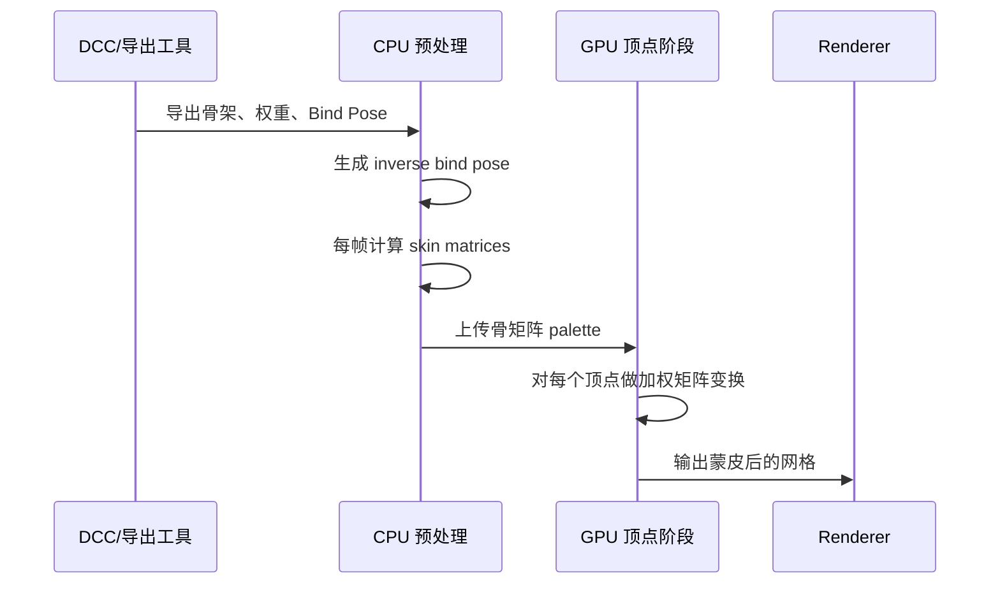
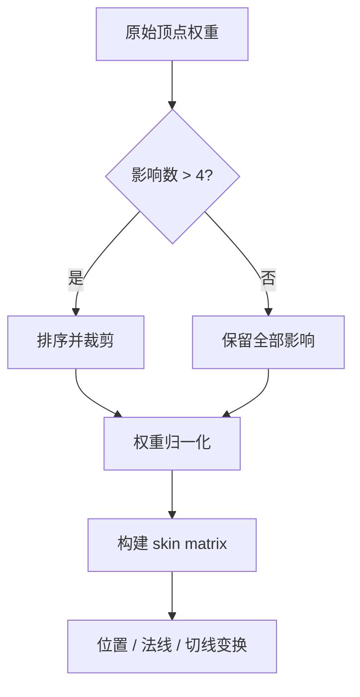
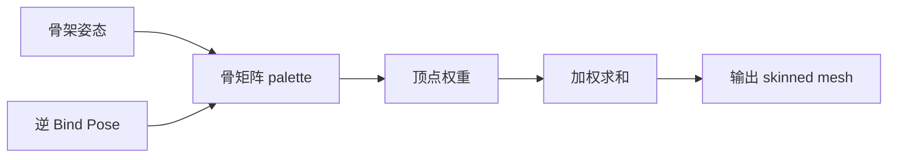

---
title: "游戏与引擎算法 07｜LBS 线性混合蒙皮"
slug: "algo-07-linear-blend-skinning"
date: "2026-04-17"
description: "讲清楚线性混合蒙皮为什么能跑、为什么会在扭转关节上塌陷，以及如何在工程上把它和骨矩阵管线、权重布局和 GPU 蒙皮对齐。"
tags:
  - "蒙皮"
  - "LBS"
  - "线性混合蒙皮"
  - "骨骼动画"
  - "体积保持"
  - "candy-wrapper"
  - "游戏动画"
  - "GPU蒙皮"
series: "游戏与引擎算法"
weight: 1807
---

一句话本质：LBS 把每个顶点放到多个骨骼刚体变换的加权和里，速度和实现都极优，但它把“在欧氏空间里做线性平均”和“在旋转流形上做插值”混成了同一件事。

> 读这篇之前：建议先看 [四元数完全指南]()。DQS 会把这里的旋转问题换成四元数/对偶四元数语言，但 LBS 的问题本质仍然是“线性平均不保刚体”。

## 问题动机

角色动画的核心问题不是“骨头会不会动”，而是“网格怎么跟着动，还要看起来像肉、布、皮肤而不是橡皮泥”。

最直接的做法，是给每个顶点分配若干骨骼权重。骨骼转到新姿态后，把顶点在每个骨骼局部空间里的位置重新投回世界，再按权重求和。

这个思路够简单，足以在 2000 年代初成为默认方案，也够快，足以在 CPU 和 GPU 上一起活下来。
问题在于，顶点不是点质量，骨骼也不是独立平移体。只要关节有明显扭转，LBS 就会出现经典症状：candy-wrapper、collapsing elbow、volume loss。

```mermaid
flowchart TD
    A[Bind Pose 顶点] --> B[骨骼权重 w_i]
    B --> C[骨矩阵 M_i]
    C --> D[每骨变换 v_i = M_i B_i^{-1} v]
    D --> E[加权求和 Σ w_i v_i]
    E --> F[Skinning 后顶点]
    F --> G[渲染网格]
```

LBS 之所以顽强，是因为它把问题压缩成了 GPU 友好的线性代数。
对游戏工业来说，这个优势非常现实：它可缓存、可批处理、可做上百角色并发，也和大多数 DCC 工具的骨架导出格式天然兼容。

## 历史背景

骨骼驱动变形在工业里很早就成了主流，但 LBS 真正成为默认答案，是因为它把“每个顶点跟着骨骼走”的经验法则变成了稳定的矩阵管线。
到后来，它还被叫作 skeleton subspace deformation、vertex blending、enveloping，名字不同，核心都是同一件事：把骨骼变换做线性组合。

2003 年的 *Direct Manipulation of Interactive Character Skins* 明确把 LBS 描述为“对每个顶点做多个骨骼刚体变换的加权平均”，也指出了权重 authoring 的痛点。[论文页](https://graphics.cs.wisc.edu/Papers/2003/MTG03/) 这说明问题从来不是“公式看不懂”，而是“作者要花多少工去调一组不会炸的权重”。

2005 年的 *Spherical Blend Skinning* 先把旋转插值问题摆上台面，明确指出 LBS 的 collapsing-joints artifacts，并给出更接近流形的替代。[SBS 主页](https://users.cs.utah.edu/~ladislav/kavan05spherical/kavan05spherical.html)

今天，LBS 仍然是 Unity、Unreal、ozz-animation 这类系统的基础路径，因为它简单、可控、足够快。只是工业管线里，LBS 往往不再是唯一答案，而是“默认底座 + 局部修正”的那一层。

## 数学基础

### 1. LBS 的基本公式

对一个顶点 $p$，设第 $i$ 个骨骼在当前帧的变换为 $M_i$，绑定姿态的逆矩阵为 $B_i^{-1}$，权重为 $w_i$，则蒙皮位置是：

$$
p' = \sum_{i=1}^{n} w_i \; M_i B_i^{-1} p
$$

这里的 $p$ 用齐次坐标表示，$w_i \ge 0$，且通常满足

$$
\sum_i w_i = 1
$$

如果权重没有归一化，顶点会被整体缩放，角色会像被拉长或压扁。

对法线，通常不能直接复用位置公式。更安全的做法是取每个骨矩阵的线性部分，或者在存在非均匀缩放时使用逆转置：

$$
 n' \propto \left(\sum_i w_i A_i\right)^{-T} n
$$

其中 $A_i$ 是 $M_i B_i^{-1}$ 的 3×3 线性子矩阵。

### 2. 为什么线性平均会坏

LBS 的数学本质，是在欧氏空间里平均仿射变换。
但旋转属于 $SO(3)$，不是线性子空间。
把两个旋转矩阵直接平均，得到的通常不是旋转，而是一个带缩放、剪切、失正交的线性映射。

这也是 candy-wrapper 的根因：你不是在“插值姿态”，而是在“混合矩阵条目”。
对头部、肩膀、肘部这类扭转半径明显的部位，顶点会朝关节轴挤压，截面半径缩小，局部体积看起来像被拧干。

### 3. 一个最小反例

设一个圆柱截面上两点分别受骨骼 A、B 控制，两个骨骼绕同一轴分别旋转 $+\theta/2$ 和 $-\theta/2$，权重各 $0.5$。
如果顶点原始半径为 $r$，LBS 在截面中点的平均结果，会把半径缩到

$$
r_{LBS} = r \cos(\theta/2)
$$

当 $\theta = 180^\circ$ 时，

$$
r_{LBS} = 0
$$

这就是经典的 candy-wrapper 极端情形。
骨骼转了半圈，皮肤却在中间瘪成一条线。

```mermaid
flowchart LR
    A[旋转流形 SO(3)] --> B[矩阵逐元素平均]
    B --> C[失正交]
    C --> D[缩放 / 剪切]
    D --> E[体积损失]
    E --> F[candy-wrapper]
```

## 算法推导

LBS 可以拆成三层。
第一层是绑定姿态：把顶点从模型空间送到某个骨骼的局部空间。
第二层是当前帧骨骼姿态：把骨骼局部空间送回世界或模型空间。
第三层是权重混合：把多个骨骼对同一个顶点的影响叠在一起。

如果某顶点受到 4 根骨影响，GPU 里通常先算出 4 个骨矩阵：

$$
S_i = M_i B_i^{-1}
$$

然后做

$$
p' = \sum_{i=0}^{3} w_i S_i p
$$

这就是 matrix palette skinning 的核心。
它的优点不是“数学优雅”，而是“一个顶点最多做 4 次矩阵向量乘，再加 3 次加法，流水线非常稳定”。

更细一点看，LBS 的问题其实来自一个事实：它把“姿态空间”映射到“顶点空间”后再做线性组合。
线性组合在顶点空间里没问题，但它无法保证中间结果仍在旋转群里。
这就像把两个单位圆上的点做笛卡尔平均，结果常常落到圆心内部。

### 动画管线里最重要的中间量

真正工程化的 LBS，不是直接拿原始骨骼变换喂顶点，而是先算好每个骨骼的 *skinning matrix*：

$$
S_i = M_i B_i^{-1}
$$

这样做有两个好处：

1. 每帧只算一次骨矩阵，顶点阶段只做查表和加权。
2. 绑定姿态和当前姿态的差异被吸收到同一个矩阵里，便于 GPU 批处理。

这也是为什么 ozz-animation 的 skinning sample 会先用 model-space matrices 构建 skinning matrices，再把它们交给 `ozz::geometry::SkinningJob`。[samples/skinning](https://guillaumeblanc.github.io/ozz-animation/samples/skinning/)

## 算法实现

下面的实现保留了 LBS 的工程核心：
权重归一化、最多 4 个影响、骨矩阵预计算、位置与法线分离。
它假设骨骼本身是刚体变换；如果你的资产带非均匀缩放，需要先把缩放和蒙皮分离，或者单独走修正路径。

```csharp
using System;
using System.Collections.Generic;
using System.Numerics;

namespace GameAnimation;

public readonly record struct BoneInfluence(int BoneIndex, float Weight);

public readonly record struct SkinnedVertex(Vector3 Position, Vector3 Normal, Vector3 Tangent)
{
    public static SkinnedVertex Empty => new(Vector3.Zero, Vector3.UnitY, Vector3.UnitX);
}

public sealed class SkinPose
{
    public Matrix4x4[] BoneMatrices { get; }

    public SkinPose(Matrix4x4[] boneMatrices)
    {
        BoneMatrices = boneMatrices ?? throw new ArgumentNullException(nameof(boneMatrices));
    }
}

public sealed class LinearBlendSkinner
{
    private readonly Matrix4x4[] _inverseBindPoses;
    private readonly int _maxInfluences;

    public LinearBlendSkinner(Matrix4x4[] inverseBindPoses, int maxInfluences = 4)
    {
        _inverseBindPoses = inverseBindPoses ?? throw new ArgumentNullException(nameof(inverseBindPoses));
        if (maxInfluences is < 1 or > 4)
            throw new ArgumentOutOfRangeException(nameof(maxInfluences));
        _maxInfluences = maxInfluences;
    }

    public Matrix4x4 BuildSkinMatrix(in SkinPose pose, int boneIndex)
    {
        if ((uint)boneIndex >= (uint)pose.BoneMatrices.Length)
            throw new ArgumentOutOfRangeException(nameof(boneIndex));
        if ((uint)boneIndex >= (uint)_inverseBindPoses.Length)
            throw new ArgumentOutOfRangeException(nameof(boneIndex));

        return _inverseBindPoses[boneIndex] * pose.BoneMatrices[boneIndex];
    }

    public SkinnedVertex SkinVertex(
        in SkinPose pose,
        Vector3 bindPosition,
        Vector3 bindNormal,
        Vector3 bindTangent,
        ReadOnlySpan<BoneInfluence> influences)
    {
        if (influences.IsEmpty)
            return new SkinnedVertex(bindPosition, SafeNormalize(bindNormal, Vector3.UnitY), SafeNormalize(bindTangent, Vector3.UnitX));

        Span<BoneInfluence> local = stackalloc BoneInfluence[Math.Min(_maxInfluences, influences.Length)];
        int count = SelectTopInfluences(influences, local);
        if (count == 0)
            return new SkinnedVertex(bindPosition, SafeNormalize(bindNormal, Vector3.UnitY), SafeNormalize(bindTangent, Vector3.UnitX));

        float weightSum = 0f;
        for (int i = 0; i < count; i++)
        {
            float w = MathF.Max(0f, local[i].Weight);
            local[i] = local[i] with { Weight = w };
            weightSum += w;
        }

        if (weightSum <= 1e-8f)
            return new SkinnedVertex(bindPosition, SafeNormalize(bindNormal, Vector3.UnitY), SafeNormalize(bindTangent, Vector3.UnitX));

        float invWeightSum = 1f / weightSum;
        for (int i = 0; i < count; i++)
            local[i] = local[i] with { Weight = local[i].Weight * invWeightSum };

        Vector4 blendedPosition = Vector4.Zero;
        Vector3 blendedNormal = Vector3.Zero;
        Vector3 blendedTangent = Vector3.Zero;

        Vector4 bindPos4 = new(bindPosition, 1f);
        Vector3 bindN = SafeNormalize(bindNormal, Vector3.UnitY);
        Vector3 bindT = SafeNormalize(bindTangent, Vector3.UnitX);

        for (int i = 0; i < count; i++)
        {
            int boneIndex = local[i].BoneIndex;
            float w = local[i].Weight;
            Matrix4x4 skinMatrix = BuildSkinMatrix(in pose, boneIndex);

            blendedPosition += w * Vector4.Transform(bindPos4, skinMatrix);
            blendedNormal += w * TransformDirection(bindN, skinMatrix);
            blendedTangent += w * TransformDirection(bindT, skinMatrix);
        }

        Vector3 finalPosition = new(blendedPosition.X, blendedPosition.Y, blendedPosition.Z);
        Vector3 finalNormal = SafeNormalize(blendedNormal, bindN);
        Vector3 finalTangent = SafeNormalize(blendedTangent, bindT);

        return new SkinnedVertex(finalPosition, finalNormal, finalTangent);
    }

    private int SelectTopInfluences(ReadOnlySpan<BoneInfluence> influences, Span<BoneInfluence> output)
    {
        int count = Math.Min(_maxInfluences, influences.Length);
        if (count == 0)
            return 0;

        BoneInfluence[] sorted = influences.ToArray();
        Array.Sort(sorted, (a, b) => b.Weight.CompareTo(a.Weight));
        for (int i = 0; i < count; i++)
            output[i] = sorted[i];

        return count;
    }

    private static Vector3 TransformDirection(Vector3 dir, Matrix4x4 m)
    {
        Vector3 transformed = new(
            dir.X * m.M11 + dir.Y * m.M21 + dir.Z * m.M31,
            dir.X * m.M12 + dir.Y * m.M22 + dir.Z * m.M32,
            dir.X * m.M13 + dir.Y * m.M23 + dir.Z * m.M33);
        return SafeNormalize(transformed, dir);
    }

    private static Vector3 SafeNormalize(Vector3 value, Vector3 fallback)
    {
        float lenSq = value.LengthSquared();
        if (lenSq <= 1e-12f)
            return fallback;
        return value / MathF.Sqrt(lenSq);
    }
}
```

这段代码刻意没有把“权重顺序”和“骨矩阵生成”揉成一锅。
生产里最容易出 bug 的就是这两件事：导出时骨索引错位，或者顶点阶段把绑定姿态和当前姿态的矩阵乘反。

### 管线分解





## 结构图 / 流程图



## 复杂度分析

| 阶段 | 时间复杂度 | 空间复杂度 | 备注 |
|---|---:|---:|---|
| 骨矩阵预计算 | $O(B)$ | $O(B)$ | $B$ 为骨骼数 |
| 单顶点蒙皮 | $O(k)$ | $O(1)$ | $k$ 为每顶点影响数，通常 $\le 4$ |
| 单网格蒙皮 | $O(Vk)$ | $O(B)$ | $V$ 为顶点数 |
| GPU 顶点阶段 | $O(Vk)$ | $O(B)$ | 常由顶点着色器并行承担 |

LBS 的真正优势，是它把每个顶点的工作量限制成线性的、可预测的、极易向 GPU 批量展开的操作。
这也是为什么即使艺术上有缺点，它仍然是实时角色系统的底座。

## 变体与优化

1. 4 影响上限是最常见的默认值，因为它和大多数 GPU 常量缓存、顶点格式和工具链都匹配。
2. 对次要影响做阈值裁剪，可以显著减少每顶点开销，但要重新归一化。
3. 对关节区域使用更密的权重编辑，对躯干和四肢使用更粗的权重编辑，能把人工成本和视觉收益拉平。
4. 对局部扭转严重的区域叠加 corrective blend shapes，可在不放弃 LBS 管线的前提下补掉最明显的体积损失。
5. 对不需要实时变形的角色，离线预烘焙或分段缓存可进一步减 CPU 压力。

工程里常见的优化不是“把 LBS 改写得更快”，而是“尽量减少需要它救火的地方”。
权重编辑、关节分区和 corrective shape 往往比微优化矩阵乘法更有效。

## 对比其他算法

| 方法 | 优点 | 缺点 | 适合场景 |
|---|---|---|---|
| LBS | 极快、实现简单、GPU 友好 | 体积损失、candy-wrapper、旋转平均不保刚体 | 大多数实时角色 |
| DQS | 更好保持体积和扭转 | 代数更复杂、算力和管线复杂度更高 | 肩膀、手臂、头颈等高扭转区域 |
| Corrective Blend Shapes | 能修特定姿态问题 | 需要大量手工或离线拟合 | 重点角色、过场动画 |
| 物理/肌肉驱动 | 视觉最好 | 成本高、迭代复杂 | 高端角色、离线或半实时 |

## 批判性讨论

LBS 最大的问题，不是它“错”，而是它的错误很有规律。
只要关节扭转、跨骨插值和体积保真同时重要，它就会在同一批关节上重复犯同一种错。

这类错误的可怕之处，在于它很容易被权重调参暂时掩盖。
你可以通过移动权重、增加骨数、加 corrective shape 把症状压下去，但骨架数学本身并没有变。

另一个现实限制是非均匀缩放。
LBS 对纯刚体骨架足够好，但一旦动画管线里混进缩放、镜像和某些 DCC 导出的奇异矩阵，线性平均会更容易产生剪切和法线扭曲。

所以，LBS 不是“过时算法”，而是“默认底座”。
它适合绝大多数角色，但不适合充当高扭转区域的最终答案。

## 跨学科视角

LBS 可以从几何角度看成在仿射空间里的 barycentric interpolation。
问题在于，角色骨骼真正关心的旋转不是仿射空间对象，而是李群对象。

从信号处理角度看，LBS 像对多个局部变换做线性滤波。
滤波器稳定，不代表滤波结果仍满足原始结构约束。

从数值分析角度看，它是“在错误的空间里做线性平均”，所以稳定但不保形。
这和 [数值积分]() 里“高阶不等于结构保持”的道理很像：目标函数不同，优化方向也不同。

## 真实案例

Unity 的 `SkinnedMeshRenderer` 直接把 `bones`、`quality` 和 `updateWhenOffscreen` 暴露为运行时参数，说明 LBS 是它的基础蒙皮路径之一；`quality` 甚至明确限制了每个顶点计入的骨数，默认思路就是控制 LBS 的成本。[SkinnedMeshRenderer](https://docs.unity3d.com/cn/2022.3/ScriptReference/SkinnedMeshRenderer.html) / [quality](https://docs.unity3d.com/cn/2020.3/ScriptReference/SkinnedMeshRenderer-quality.html)

Unity Shader Graph 还有专门的 `Linear Blend Skinning` 节点，面向 DOTS Hybrid Renderer，把 `_SkinMatrices` 作为输入，说明 LBS 也已经是 GPU 数据流的一等公民。[Linear Blend Skinning Node](https://docs.unity3d.com/cn/Packages/com.unity.shadergraph%4010.5/manual/Linear-Blend-Skinning-Node.html)

Unreal 的 `Skin Weight Profiles` 则提供了另一条工业思路：在不同平台、不同 LOD 上替换一部分皮肤权重，以平衡视觉和成本。[Skin Weight Profiles](https://dev.epicgames.com/documentation/en-us/unreal-engine/skin-weight-profiles-in-unreal-engine?application_version=5.6)

ozz-animation 的 `samples/skinning` 明确写了 skinning matrix 的构建方式：model-space matrices 乘 inverse bind pose，再交给 `ozz::geometry::SkinningJob`。[样例页](https://guillaumeblanc.github.io/ozz-animation/samples/skinning/) 这说明在一个高性能、引擎无关的库里，LBS 仍然是标准 runtime 路径。

## 量化数据

LBS 的几何问题可以直接量化。
在双骨 180° 扭转的极端例子里，截面半径会从 $r$ 缩到 $r\cos(90^\circ)=0$，这就是体积塌陷的最小反例。

从管线开销看，若每个顶点最多 4 个影响，且每个骨影需要一次 4x4 矩阵向量乘，那么一个顶点至少要做 4 次矩阵乘和 3 次累加。
这就是 LBS 能在 GPU 上跑得动、又为什么它很依赖顶点吞吐的原因。

Unity 文档还明确指出，骨数越高，性能成本越高，特别是每顶点超过 4 骨时。[SkinnedMeshRenderer.quality](https://docs.unity3d.com/cn/2020.3/ScriptReference/SkinnedMeshRenderer-quality.html)

## 常见坑

1. 权重和不等于 1。
为什么错：顶点会被整体缩放，角色看起来像被拉伸或压扁。怎么改：在导入或运行时对权重归一化。

2. Bind Pose 和当前骨矩阵顺序搞反。
为什么错：顶点会被送到错误的局部空间，角色瞬间炸形。怎么改：统一“当前矩阵 × 逆绑定矩阵”的顺序，并把导出/运行两端的约定写死。

3. 法线直接按位置同样方式混合。
为什么错：非均匀缩放和剪切会把光照法线搞歪。怎么改：对法线使用线性部分的逆转置，或者明确限制骨矩阵只允许刚体变换。

4. 顶点影响数裁剪顺序不稳定。
为什么错：同一模型在不同导出工具上可能得到不同的前 4 个影响，导致接缝闪烁。怎么改：按权重稳定排序，裁剪后重新归一化。

5. 把 corrective shape 当成 LBS 的替代品。
为什么错：它只能修局部姿态，不是完整骨架变形模型。怎么改：把它当作补丁，而不是主模型。

## 何时用 / 何时不用

适合用 LBS 的情况：
大多数实时游戏角色、普通四肢、预算严格的平台、需要兼容大量工具链的资产。

不适合只用 LBS 的情况：
扭转角大、关节细节要求高、肩膀和肘部体积保真要求强、长 coat / 发束 / 高摆幅动作。

最现实的判断标准不是“LBS 是否完美”，而是“这个角色哪些部位的缺陷玩家会第一眼看见”。
如果答案是手臂、肩膀或脸部边缘，通常就该准备 DQS 或 corrective shapes。

## 相关算法

- [DQS 对偶四元数蒙皮]()
- [四元数完全指南]()
- [坐标空间变换全景]()
- [浮点精度与数值稳定性]()
- [数值积分：Euler、Verlet、RK4]()

## 小结

LBS 是骨骼蒙皮的工程底座。
它快、直接、兼容性高，足以覆盖大多数实时角色需求。

它的代价也很明确：线性平均不保旋转流形，所以体积损失和 candy-wrapper 不会消失，只会随着角色复杂度和关节扭转变得更明显。

真正成熟的管线，不是把 LBS 神化，而是知道它适合当什么、不适合当什么，并且在需要的部位准备替代方案。

## 参考资料

- [Direct Manipulation of Interactive Character Skins (2003)](https://graphics.cs.wisc.edu/Papers/2003/MTG03/)
- [Linear Blend Skinning Notes](https://graphics.cs.cmu.edu/courses/15-466-f17/notes/skinning.html)
- [Spherical Blend Skinning (2005)](https://users.cs.utah.edu/~ladislav/kavan05spherical/kavan05spherical.html)
- [Unity SkinnedMeshRenderer](https://docs.unity3d.com/cn/2022.3/ScriptReference/SkinnedMeshRenderer.html)
- [Unity SkinnedMeshRenderer.quality](https://docs.unity3d.com/cn/2020.3/ScriptReference/SkinnedMeshRenderer-quality.html)
- [Unity Linear Blend Skinning Node](https://docs.unity3d.com/cn/Packages/com.unity.shadergraph%4010.5/manual/Linear-Blend-Skinning-Node.html)
- [Unreal Skin Weight Profiles](https://dev.epicgames.com/documentation/en-us/unreal-engine/skin-weight-profiles-in-unreal-engine?application_version=5.6)
- [ozz-animation skinning sample](https://guillaumeblanc.github.io/ozz-animation/samples/skinning/)


