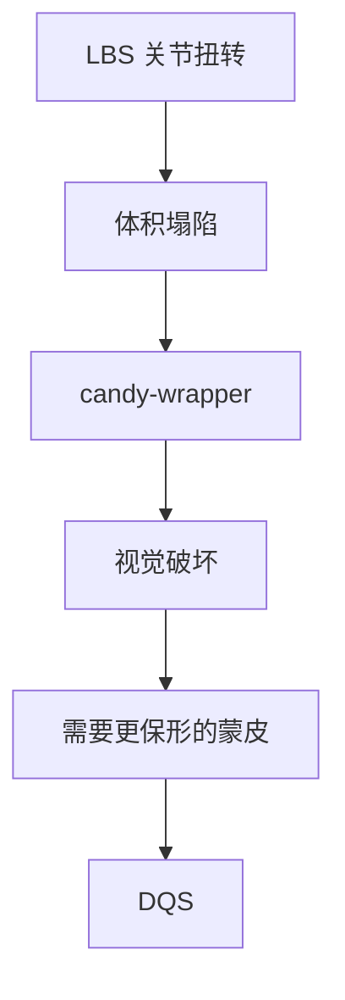
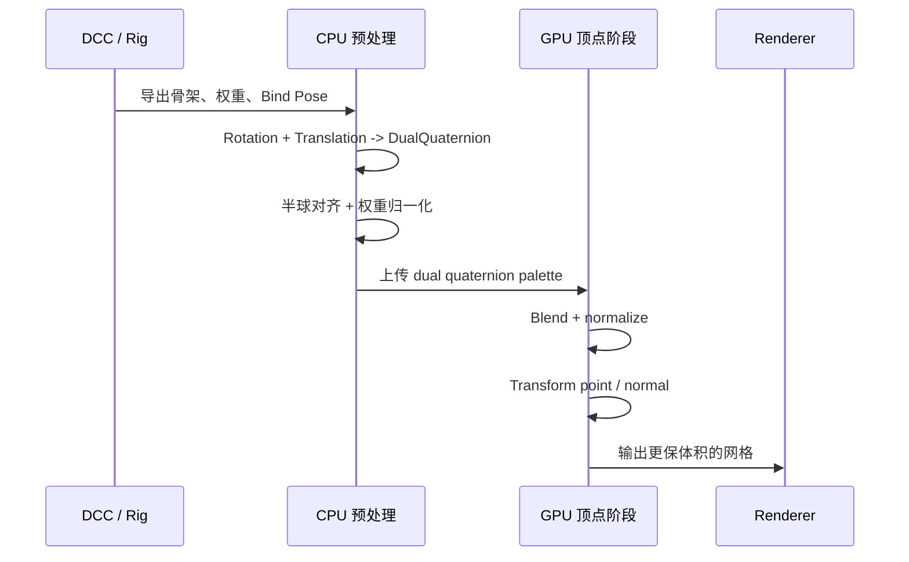
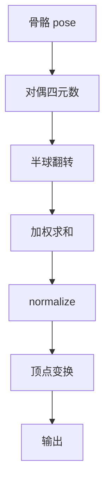
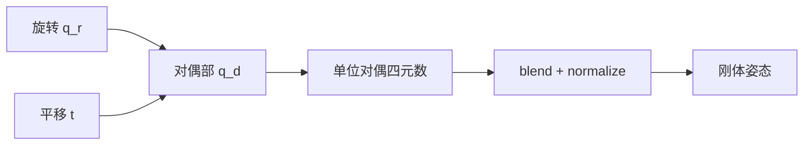

---
title: "游戏与引擎算法 08｜DQS 对偶四元数蒙皮"
slug: "algo-08-dual-quaternion-skinning"
date: "2026-04-17"
description: "把对偶四元数蒙皮放回真实角色管线：从代数结构、加权归一化到性能代价，讲清它为什么比 LBS 更保体积，也讲清它为什么不是万能替代。"
tags:
  - "DQS"
  - "对偶四元数"
  - "骨骼动画"
  - "体积保持"
  - "扭转"
  - "游戏动画"
  - "蒙皮"
  - "GPU蒙皮"
series: "游戏与引擎算法"
weight: 1808
---

一句话本质：DQS 不是“把 LBS 再套一层四元数壳”，而是把骨骼的刚体变换改写成对偶四元数，再在这个更接近刚体流形的表示上做加权与归一化。

> 读这篇之前：建议先看 [LBS 线性混合蒙皮]() 和 [四元数完全指南]()。前者说明 DQS 要修的是什么，后者说明旋转空间为什么不能随便线性平均。

## 问题动机

LBS 最大的工程问题，是它在扭转关节上会明显掉体积。
手臂一拧，前臂像被拧干的毛巾；肩膀一转，皮肤会朝关节中心塌下去。

如果角色是卡通风格，这些问题有时还能被忽略。
但只要你做的是 humanoid、紧身衣、脸部局部表情、长袖上衣或者强扭转动作，LBS 的缺陷就会很难看。

DQS 的目标，就是在不显著增加管线复杂度的前提下，让蒙皮更像在做刚体插值而不是矩阵平均。
它不是为所有资产提供完美解，而是把“最刺眼的 LBS 缺陷”一次性压下去。



## 历史背景

对偶四元数并不是图形学临时发明的技巧。
它来自 19 世纪关于双数和运动几何的代数传统，后来被用于表示刚体变换的旋转 + 平移组合。到了机器人学和计算机图形学里，这套表示法才真正找到了高频工程用途。

2007 年，Kavan 等人在 *Skinning with Dual Quaternions* 中明确提出：线性混合四元数/矩阵都无法同时兼顾简单、效率和保体积，而对偶四元数可以以很小代价修复 LBS 的主要伪影。[论文页](https://users.cs.utah.edu/~ladislav/kavan07skinning/kavan07skinning.html)

2008 年的 *Geometric Skinning with Approximate Dual Quaternion Blending* 进一步把它推广成一个更完整的工业算法，并明确说明：即便是近似的 dual quaternion blending，也能去掉 LBS 的典型伪影，同时保持高效 GPU 实现。[论文页](https://dcgi.fel.cvut.cz/en/publications/2008/kavan-tog-adqb/)

2013 年 Disney 的 *Enhanced Dual Quaternion Skinning for Production Use* 则把这条路线推到生产环境，说明 DQS 单独使用还不够，要和 non-rigid transforms、hierarchy 支持、support joints 这些生产需求一起打包。[Disney 论文页](https://disneyanimation.com/publications/enhanced-dual-quaternion-skinning-for-production-use/)

这条历史线很重要，因为它说明 DQS 不是“学术上更高级”，而是“在保形和性能之间找到了更合适的中间点”。

## 数学基础

### 1. 对偶数与对偶四元数

对偶数写成

$$
a + \varepsilon b, \qquad \varepsilon^2 = 0
$$

对偶四元数则是

$$
\hat q = q_r + \varepsilon q_d
$$

其中 $q_r$ 是实部四元数，$q_d$ 是对偶部四元数。
如果 $q_r$ 表示旋转，$q_d$ 可以编码平移。

对一个刚体变换，常见写法是：

$$
\hat q = q_r + \varepsilon \frac{1}{2} \, t \; q_r
$$

这里 $t$ 写成纯虚四元数 $(0,\mathbf{t})$。
这条式子很关键，因为它把“旋转”和“平移”绑定成一个单位刚体元。

### 2. 刚体变换如何作用于点

如果点 $p$ 也是纯虚四元数 $(0,\mathbf{p})$，则刚体变换可以写成：

$$
\mathbf{p}' = q_r \mathbf{p} q_r^* + 2\,(q_d q_r^*)_{vec}
$$

其中 $q_r^*$ 是共轭，$(\cdot)_{vec}$ 表示取向量部。

这条式子比矩阵更适合做蒙皮，因为旋转和平移被统一到了同一表示里。
LBS 会在矩阵空间里平均条目，而 DQS 会在更接近刚体变换的参数空间里平均再投回去。

### 3. 归一化与符号翻转

对偶四元数的权重混合不是简单地把骨骼结果直接相加。
如果骨骼姿态分布很散，四元数会出现“半球不一致”的问题：$q$ 和 $-q$ 表示同一个旋转，但它们在向量空间里是相反方向。

所以 DQS 必须先做符号一致化：

$$
\text{if } \langle q_{r,i}, q_{r,ref} \rangle < 0, \quad \hat q_i \leftarrow -\hat q_i
$$

然后才做加权和：

$$
\hat q = \sum_i w_i \hat q_i
$$

最后做归一化，投影回单位对偶四元数集合。
这就是 DQS 里最重要的两个词：`blend + normalize`。

### 4. 它为什么能保体积

DQS 不是严格意义上的“精确平均刚体运动”，但它比 LBS 更接近刚体流形。
LBS 会把旋转线性平均成剪切和缩放；DQS 会把多个刚体位姿先统一到同一代数表示，再沿着更合理的几何路径做混合。

从直觉上说，LBS 在“空间里平均点”，DQS 在“变换里平均姿态”。
后者更接近动画师想要的结果。


## 算法推导

DQS 的实际流程可以分成四步。

1. 从每根骨骼的当前变换，构造单位对偶四元数。
2. 对每个顶点的骨影响，先做符号翻转，保证都在同一半球。
3. 按权重做线性组合。
4. 归一化后把结果作用到顶点。

如果只看旋转部分，这其实和 `Slerp` 的精神一致：不要在欧氏空间里平均旋转参数，而要在表示刚体运动的正确对象上做归约。

### 为什么要先翻符号

四元数的双覆盖性质在这里会造成一个非常实际的问题。
两个骨骼旋转方向可能非常接近，但由于四元数选取了相反号，线性相加会彼此抵消，最后把旋转平均成接近零。

所以标准做法是选择一个参考四元数 `q_ref`，把所有与它内积为负的骨骼四元数翻转：

$$
\langle q_i, q_{ref} \rangle < 0 \Rightarrow q_i \leftarrow -q_i
$$

这一步是 DQS 成败的前提，不是可选优化。

### 为什么要 normalize

权重和本身并不会让加权和保持单位长度。
而单位长度对四元数和对偶四元数都很重要，因为它们表示的是刚体变换，不是任意仿射映射。

混合后的结果要通过归一化重新投回刚体空间。
如果不做这一步，顶点仍然会漂，法线也会错，只是错得没有 LBS 那么夸张。

### DQS 的局限从哪来

对偶四元数表示的是刚体变换，天然不包含一般剪切，也不直接支持非均匀缩放。
这意味着：

- 纯刚体骨骼非常适合。
- 有缩放、镜像、拉伸的骨架需要额外处理。
- 生产管线里经常要把 DQS 和 LBS、segment scale compensation 或 corrective shapes 混用。

Disney 的 production paper 之所以重要，就是因为它明确说明：真正的角色管线不只是一套纯数学公式，而是一组要能服务 production 的工程规则。[Disney 论文页](https://disneyanimation.com/publications/enhanced-dual-quaternion-skinning-for-production-use/)

## 算法实现

下面的实现按生产管线常见的方式写：
骨骼先给出旋转 + 平移，DQS 负责把它们变成单位对偶四元数并做加权归一化。
这份代码刻意包含半球翻转和 rigid projection，因为这两步决定了 DQS 是否稳定。

```csharp
using System;
using System.Collections.Generic;
using System.Numerics;

namespace GameAnimation;

public readonly record struct BoneInfluence(int BoneIndex, float Weight);
public readonly record struct BonePose(Quaternion Rotation, Vector3 Translation);
public readonly record struct SkinnedVertex(Vector3 Position, Vector3 Normal)
{
    public static SkinnedVertex Empty => new(Vector3.Zero, Vector3.UnitY);
}

public static class QuaternionMath
{
    public static Quaternion Multiply(in Quaternion a, in Quaternion b) => new(
        a.W * b.X + a.X * b.W + a.Y * b.Z - a.Z * b.Y,
        a.W * b.Y - a.X * b.Z + a.Y * b.W + a.Z * b.X,
        a.W * b.Z + a.X * b.Y - a.Y * b.X + a.Z * b.W,
        a.W * b.W - a.X * b.X - a.Y * b.Y - a.Z * b.Z);

    public static Quaternion Scale(in Quaternion q, float s) => new(q.X * s, q.Y * s, q.Z * s, q.W * s);

    public static Quaternion Add(in Quaternion a, in Quaternion b) => new(a.X + b.X, a.Y + b.Y, a.Z + b.Z, a.W + b.W);

    public static Quaternion Subtract(in Quaternion a, in Quaternion b) => new(a.X - b.X, a.Y - b.Y, a.Z - b.Z, a.W - b.W);

    public static Quaternion Conjugate(in Quaternion q) => new(-q.X, -q.Y, -q.Z, q.W);

    public static float Dot(in Quaternion a, in Quaternion b) => a.X * b.X + a.Y * b.Y + a.Z * b.Z + a.W * b.W;

    public static Quaternion NormalizeRigid(in Quaternion q)
    {
        float len = MathF.Sqrt(Dot(q, q));
        if (len <= 1e-8f)
            throw new InvalidOperationException("Quaternion length is too small.");
        float inv = 1f / len;
        return Scale(q, inv);
    }

    public static Vector3 RotateVector(in Quaternion q, in Vector3 v)
    {
        Vector3 u = new(q.X, q.Y, q.Z);
        Vector3 t = 2f * Vector3.Cross(u, v);
        return v + q.W * t + Vector3.Cross(u, t);
    }

    public static Vector3 SafeNormalize(Vector3 value, Vector3 fallback)
    {
        float lenSq = value.LengthSquared();
        if (lenSq <= 1e-12f)
            return fallback;
        return value / MathF.Sqrt(lenSq);
    }
}

public readonly struct DualQuaternion
{
    public Quaternion Real { get; }
    public Quaternion Dual { get; }

    public DualQuaternion(Quaternion real, Quaternion dual)
    {
        Real = real;
        Dual = dual;
    }

    public static DualQuaternion Identity => new(Quaternion.Identity, new Quaternion(0, 0, 0, 0));

    public static DualQuaternion FromRotationTranslation(in Quaternion rotation, in Vector3 translation)
    {
        Quaternion r = QuaternionMath.NormalizeRigid(rotation);
        Quaternion t = new(translation.X, translation.Y, translation.Z, 0f);
        Quaternion d = QuaternionMath.Scale(QuaternionMath.Multiply(t, r), 0.5f);
        return new DualQuaternion(r, d);
    }

    public static DualQuaternion FromBonePose(in BonePose pose) => FromRotationTranslation(pose.Rotation, pose.Translation);

    public DualQuaternion WithHemisphereAligned(in Quaternion referenceReal)
    {
        if (QuaternionMath.Dot(Real, referenceReal) < 0f)
        {
            return new DualQuaternion(
                QuaternionMath.Scale(Real, -1f),
                QuaternionMath.Scale(Dual, -1f));
        }
        return this;
    }

    public DualQuaternion NormalizeRigid()
    {
        float len = MathF.Sqrt(QuaternionMath.Dot(Real, Real));
        if (len <= 1e-8f)
            throw new InvalidOperationException("Dual quaternion real part is too small.");

        float invLen = 1f / len;
        Quaternion real = QuaternionMath.Scale(Real, invLen);
        Quaternion dual = QuaternionMath.Scale(Dual, invLen);
        float dot = QuaternionMath.Dot(real, dual);
        dual = QuaternionMath.Subtract(dual, QuaternionMath.Scale(real, dot));
        return new DualQuaternion(real, dual);
    }

    public Vector3 TransformPoint(in Vector3 point)
    {
        Quaternion translationQuat = QuaternionMath.Multiply(Dual, QuaternionMath.Conjugate(Real));
        Vector3 translation = new(2f * translationQuat.X, 2f * translationQuat.Y, 2f * translationQuat.Z);
        return QuaternionMath.RotateVector(Real, point) + translation;
    }

    public Vector3 TransformNormal(in Vector3 normal)
        => QuaternionMath.SafeNormalize(QuaternionMath.RotateVector(Real, normal), normal);
}

public sealed class DualQuaternionSkinner
{
    private readonly int _maxInfluences;

    public DualQuaternionSkinner(int maxInfluences = 4)
    {
        if (maxInfluences is < 1 or > 4)
            throw new ArgumentOutOfRangeException(nameof(maxInfluences));
        _maxInfluences = maxInfluences;
    }

    public SkinnedVertex SkinVertex(
        ReadOnlySpan<BonePose> bonePoses,
        Vector3 bindPosition,
        Vector3 bindNormal,
        ReadOnlySpan<BoneInfluence> influences)
    {
        if (influences.IsEmpty)
            return new SkinnedVertex(bindPosition, SafeNormalize(bindNormal, Vector3.UnitY));

        Span<BoneInfluence> selected = stackalloc BoneInfluence[Math.Min(_maxInfluences, influences.Length)];
        int count = SelectTopInfluences(influences, selected);
        if (count == 0)
            return new SkinnedVertex(bindPosition, SafeNormalize(bindNormal, Vector3.UnitY));

        float weightSum = 0f;
        for (int i = 0; i < count; i++)
        {
            float w = MathF.Max(0f, selected[i].Weight);
            selected[i] = selected[i] with { Weight = w };
            weightSum += w;
        }

        if (weightSum <= 1e-8f)
            return new SkinnedVertex(bindPosition, SafeNormalize(bindNormal, Vector3.UnitY));

        float invWeightSum = 1f / weightSum;
        for (int i = 0; i < count; i++)
            selected[i] = selected[i] with { Weight = selected[i].Weight * invWeightSum };

        if ((uint)selected[0].BoneIndex >= (uint)bonePoses.Length)
            throw new ArgumentOutOfRangeException(nameof(influences));

        DualQuaternion reference = DualQuaternion.FromBonePose(bonePoses[selected[0].BoneIndex]);
        Quaternion refReal = reference.Real;

        Quaternion blendedReal = new(0f, 0f, 0f, 0f);
        Quaternion blendedDual = new(0f, 0f, 0f, 0f);

        for (int i = 0; i < count; i++)
        {
            int boneIndex = selected[i].BoneIndex;
            if ((uint)boneIndex >= (uint)bonePoses.Length)
                throw new ArgumentOutOfRangeException(nameof(influences));

            BonePose pose = bonePoses[boneIndex];
            DualQuaternion dq = DualQuaternion.FromBonePose(pose).WithHemisphereAligned(refReal);
            float w = selected[i].Weight;
            blendedReal = QuaternionMath.Add(blendedReal, QuaternionMath.Scale(dq.Real, w));
            blendedDual = QuaternionMath.Add(blendedDual, QuaternionMath.Scale(dq.Dual, w));
        }

        DualQuaternion blended = new(blendedReal, blendedDual).NormalizeRigid();
        Vector3 finalPosition = blended.TransformPoint(bindPosition);
        Vector3 finalNormal = blended.TransformNormal(bindNormal);
        return new SkinnedVertex(finalPosition, finalNormal);
    }

    private static Vector3 SafeNormalize(Vector3 value, Vector3 fallback)
    {
        float lenSq = value.LengthSquared();
        if (lenSq <= 1e-12f)
            return fallback;
        return value / MathF.Sqrt(lenSq);
    }

    private int SelectTopInfluences(ReadOnlySpan<BoneInfluence> influences, Span<BoneInfluence> output)
    {
        int count = Math.Min(_maxInfluences, influences.Length);
        if (count == 0)
            return 0;

        BoneInfluence[] sorted = influences.ToArray();
        Array.Sort(sorted, (a, b) => b.Weight.CompareTo(a.Weight));
        for (int i = 0; i < count; i++)
            output[i] = sorted[i];

        return count;
    }
}
```

这份实现做了三件必须做的事：

- 同半球对齐，避免四元数符号相反导致互相抵消。
- 权重归一化，避免顶点整体缩放。
- 只对刚体姿态做投影，不把 scale/shear 偷塞进来。

### 管线分解





## 结构图 / 流程图



## 复杂度分析

| 阶段 | 时间复杂度 | 空间复杂度 | 备注 |
|---|---:|---:|---|
| 每骨对偶四元数构建 | $O(B)$ | $O(B)$ | 每帧一次 |
| 单顶点 DQS | $O(k)$ | $O(1)$ | $k$ 通常 $\le 4$ |
| 单网格 DQS | $O(Vk)$ | $O(B)$ | $V$ 为顶点数 |
| 与 LBS 相比 | 计算略高 | 传输可更紧凑 | 双四元数 8 浮点，矩阵通常 12 浮点 |

Kavan 的实现页明确写到：DQS 相比 LBS 只多了少量顶点着色器指令，原始版本里大约是 7 条额外 vertex shader instructions；支持 scale/shear 的两阶段版本则会再多 29 条左右。[原始说明页](https://users.cs.utah.edu/~ladislav/dq/index.html)

## 变体与优化

1. 对刚体骨骼，DQS 可以直接替代 LBS 的主路径。
2. 对有 scale/shear 的角色，常见做法是 DQS 处理旋转和平移，缩放交给单独层或 corrective 方案。
3. 对高扭转关节，可在 DQS 上再叠加局部 corrective shape，保住脸部、肩膀和袖口细节。
4. 对 GPU 管线，双四元数 palette 的带宽通常比 4×4 矩阵更友好，但算术比 LBS 更重。
5. 对角色批量渲染，DQS 常与骨骼压缩、LOD 和权重裁剪一起使用。

工程上，DQS 最值得优化的不是乘法本身，而是“哪些骨骼真的需要参与 blend”。
如果权重分布能被压到 2 到 4 个有效影响，DQS 的额外代价通常是可以接受的。

## 对比其他算法

| 方法 | 优点 | 缺点 | 适合场景 |
|---|---|---|---|
| LBS | 最简单、最便宜、最通用 | 体积损失、扭转塌陷 | 大多数实时角色 |
| DQS | 保体积更好、扭转更自然 | 代数更复杂、scale/shear 不自然 | 肩膀、肘部、头颈 |
| Spherical Blend Skinning | 旋转更自然 | 实现和管线更重 | 学术/高质量角色 |
| Corrective Blend Shapes | 局部修正能力强 | 需要额外资产和调参 | 重点角色、过场动画 |

## 批判性讨论

DQS 不是“无条件替代 LBS”的终局答案。
它对刚体变换非常合适，但并不直接支持一般仿射变换，也不自动处理所有生产需求。

这就是为什么很多 production pipeline 会把 DQS 作为一层，再混合局部修正、support joints、segment scale compensation，甚至在某些部位保留 LBS。
Disney 的 production paper 正是这类现实约束的最好证据。[Disney 论文页](https://disneyanimation.com/publications/enhanced-dual-quaternion-skinning-for-production-use/)

还有一个常被忽略的事实：DQS 只修正“刚体平均方式”，不修正“权重本身坏掉”的问题。
权重分布不合理、骨骼层级不干净、绑定姿态不一致，DQS 一样会出错，只是错得更像一个“保形但不对”的角色。

## 跨学科视角

DQS 的关键，不是“多了一个 quaternion 层”，而是把骨骼位姿放进了更接近李群的表示里。
这和 [四元数完全指南]() 里的核心结论一致：旋转不是普通向量，不能随便做笛卡尔平均。

从几何角度看，DQS 试图在刚体流形上做近似 barycentric blend。
从机器人学角度看，它和刚体位姿插值、Screw motion、SE(3) 表示是同一条知识链。
从数值角度看，它是在可接受的额外代价下，用更好的参数化换掉更差的平均方式。

## 真实案例

Kavan 官方主页直接给出了 DQS 的优缺点：它可以消除皮肤塌陷伪影，GPU 友好，但相比 LBS 稍慢，并且在其实现中需要多 7 条顶点着色器指令；如果还要支持 scale/shear，则还需要额外指令。[DQS 主页](https://users.cs.utah.edu/~ladislav/dq/index.html)

Disney 的 *Enhanced Dual Quaternion Skinning for Production Use* 把 DQS 推向《Frozen》这类生产资产，明确说明它不是简单 drop-in replacement，而要和非刚性变换、不同层级的关节、support joints 一起工作。[Disney 论文页](https://disneyanimation.com/publications/enhanced-dual-quaternion-skinning-for-production-use/)

ozz-animation 的 `samples/skinning` 和 `samples/blend` 则是一个很好的现实参照：前者说明它如何把 skeleton、animation、mesh 组合成高性能 skinning matrices；后者说明 runtime animation 的 blending 与管线组织方式。[skinning sample](https://guillaumeblanc.github.io/ozz-animation/samples/skinning/) / [blend sample](https://guillaumeblanc.github.io/ozz-animation/samples/blend/)

Unity 的 `SkinnedMeshRenderer` / `quality` 直接暴露每顶点骨数限制，说明真实引擎里“骨数、吞吐、质量”是直接挂钩的。[Unity API](https://docs.unity3d.com/cn/2022.3/ScriptReference/SkinnedMeshRenderer.html) / [quality](https://docs.unity3d.com/cn/2020.3/ScriptReference/SkinnedMeshRenderer-quality.html)

Unreal 的 `TBoneWeights::Blend` 和 `Skin Weight Profiles` 则说明工业管线会把“权重混合”和“平台/LOD 权重替换”做成显式系统，而不是把它藏进单个 shader 里。[TBoneWeights::Blend](https://dev.epicgames.com/documentation/en-us/unreal-engine/API/Runtime/AnimationCore/TBoneWeights/Blend/1) / [Skin Weight Profiles](https://dev.epicgames.com/documentation/en-us/unreal-engine/skin-weight-profiles-in-unreal-engine?application_version=5.6)

## 量化数据

DQS 的原始说明页给出的一个直接量化是：与 LBS 相比，它在作者实现里只多出约 7 条 vertex shader instructions；如果开启支持 scale/shear 的两阶段处理，则会多出约 29 条指令。[原始说明页](https://users.cs.utah.edu/~ladislav/dq/index.html)

Kavan 的 2007 论文页面还展示了一个非常直观的性能对比：DQS 在同一测试场景里，相比 log-matrix blending 和 spherical blend skinning 保持了更高的帧率，同时消除了 LBS 的扭转伪影。[论文页](https://users.cs.utah.edu/~ladislav/kavan07skinning/kavan07skinning.html)

从几何量化角度看，DQS 在双骨 180° 扭转时不会像 LBS 那样把截面半径压到 0，而会更接近保持原始半径，这就是它最重要的视觉收益。

## 常见坑

1. 忘记做半球翻转。
为什么错：同一旋转的相反号会在线性和时相互抵消，混合结果会突然翻转。怎么改：用参考四元数对所有输入做 sign correction。

2. 只 normalize 实部，不处理 dual 部分。
为什么错：会把刚体约束弄残，translation extraction 也会漂。怎么改：把 normalize 写成 rigid projection，并始终通过 `qd * conj(qr)` 提取平移。

3. 把非均匀缩放硬塞进 DQS。
为什么错：DQS 只能自然表示刚体变换，缩放/剪切会破坏它的几何假设。怎么改：把缩放拆到单独层，或者 fallback 到 LBS / production extension。

4. 仍然用错误的 bind pose 或骨索引顺序。
为什么错：DQS 只修正变换表示，不修正数据源错位。怎么改：和 LBS 一样，先保证导出和运行时的骨链一致。

5. 以为 DQS 能自动修正权重分布。
为什么错：权重布局烂，DQS 也会烂，只是塌陷少一些。怎么改：先修权重，再上 DQS。

## 何时用 / 何时不用

适合用 DQS 的情况：
角色扭转大、肩膀和肘部对体积保真敏感、头颈和脸部局部旋转明显、你希望尽量少加 corrective shapes。

不适合只用 DQS 的情况：
骨架有明显 scale/shear、你需要严格非刚性变形、资产管线要求和现有矩阵层完全一致、你不想承担一点点额外算术成本。

现实里最常见的策略，不是“LBS 或 DQS 二选一”，而是“全局 LBS / 局部 DQS / 关键部位 corrective shapes”。

## 相关算法

- [LBS 线性混合蒙皮]()
- [四元数完全指南]()
- [坐标空间变换全景]()
- [浮点精度与数值稳定性]()
- [数值积分：Euler、Verlet、RK4]()

## 小结

DQS 解决的是 LBS 最刺眼的几何错误：扭转塌陷和体积损失。
它通过对偶四元数把刚体变换表示得更贴近旋转流形，然后用 `blend + normalize` 得到更自然的蒙皮结果。

它不是生产管线里的万能替代品，但它已经足够接近“默认高质量方案”。
真正成熟的角色系统，通常会把 DQS 当成底座，再叠加针对性修正和特殊骨段规则。

## 参考资料

- [Skinning with Dual Quaternions (2007)](https://users.cs.utah.edu/~ladislav/kavan07skinning/kavan07skinning.html)
- [Kavan DQ project page](https://users.cs.utah.edu/~ladislav/dq/index.html)
- [Geometric Skinning with Approximate Dual Quaternion Blending (2008)](https://dcgi.fel.cvut.cz/en/publications/2008/kavan-tog-adqb/)
- [Enhanced Dual Quaternion Skinning for Production Use (Disney, 2013)](https://disneyanimation.com/publications/enhanced-dual-quaternion-skinning-for-production-use/)
- [ozz-animation skinning sample](https://guillaumeblanc.github.io/ozz-animation/samples/skinning/)
- [Unity SkinnedMeshRenderer](https://docs.unity3d.com/cn/2022.3/ScriptReference/SkinnedMeshRenderer.html)
- [Unreal Skin Weight Profiles](https://dev.epicgames.com/documentation/en-us/unreal-engine/skin-weight-profiles-in-unreal-engine?application_version=5.6)


