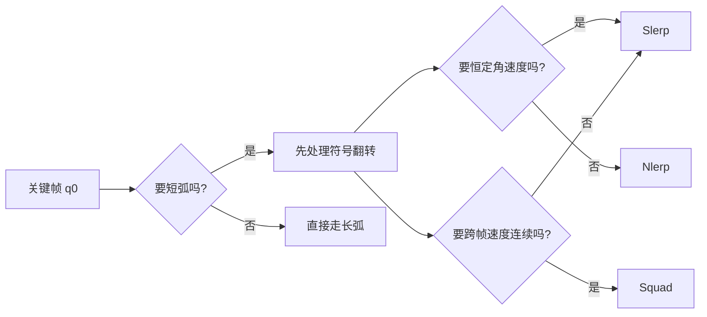
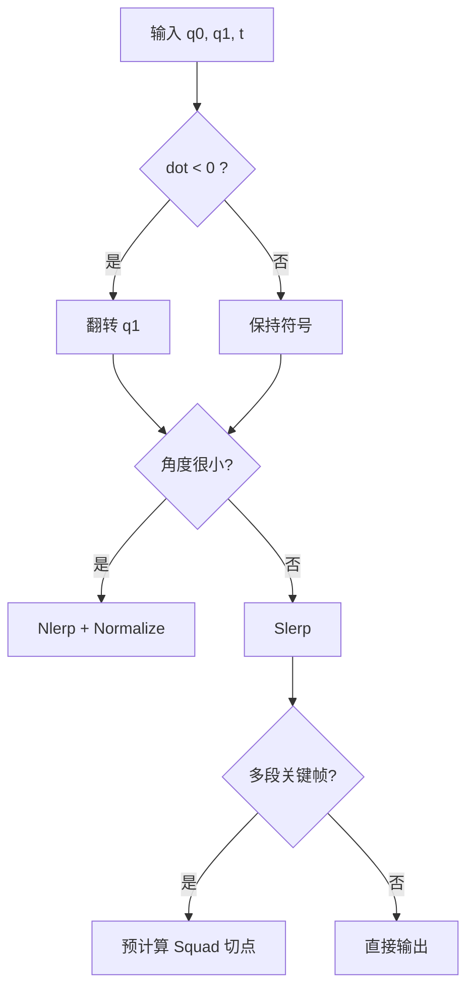
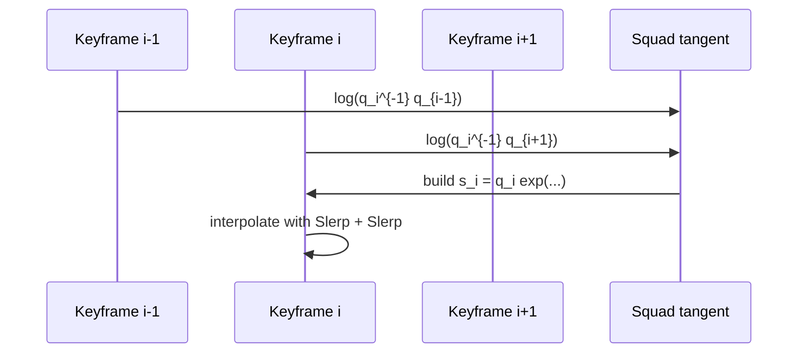

---
title: "游戏与引擎算法 09｜旋转插值：Slerp、Nlerp、Squad"
slug: "algo-09-rotation-interpolation"
date: "2026-04-17"
description: "把四元数插值放回旋转流形上，讲清短弧、对数映射、恒定角速度和 Squad 控制点为什么能让动画曲线更顺。"
tags:
  - "四元数"
  - "旋转插值"
  - "Slerp"
  - "Nlerp"
  - "Squad"
  - "动画"
  - "数值稳定性"
  - "游戏引擎"
series: "游戏与引擎算法"
weight: 1809
---

**一句话本质：旋转插值不是在四个标量上做线性混合，而是在四元数球面上走最短弧，再决定要不要为速度连续性多付一点计算成本。**

> 读这篇之前：建议先看 [游戏与引擎算法 38｜四元数完全指南：旋转表示、Log/Exp、奇异性]() 和 [游戏与引擎算法 41｜浮点精度与数值稳定性]()。这篇默认你已经接受单位四元数、短弧和 `Log/Exp` 的符号约定。

## 问题动机

动画里最常见的旋转问题不是“转不到”，而是“转得不对劲”。

相机从 A 看向 B，角色从待机切到奔跑，武器从前握切到后摆，网络同步在两帧之间补姿态，所有这些都在问同一件事：**两帧姿态之间应该沿哪条路径走，速度该怎么分配。**

如果直接把四元数四个分量逐项线性插值，结果大多还能看，但角速度会漂，长弧会抖，接近 180° 时还可能翻面。

如果只追求几何正确，Slerp 已经足够；如果还要跨过多个关键帧保持速度连续，就得把 `Squad` 和四元数切空间接进来。

### 旋转插值真正要解决的事



## 历史背景

四元数旋转插值的现代起点，通常要追到 Shoemake 1985 年的 `Animating rotation with quaternion curves`。那篇文章真正解决的不是“怎么算四元数”，而是“怎么在球面上构造曲线”，让相机和刚体动画不再受欧拉角的怪脾气影响。

Slerp 很快成为工业标准，因为它把“从一个姿态到另一个姿态”的路径写成了球面大圆弧，几何上直接，速度也均匀。到了 1990 年代到 2000 年代，工程师们又开始嫌它贵，于是 `Nlerp` 作为近似方案普及开来。

`Squad` 则是为了补上多段关键帧拼接时的速度不连续。单段 Slerp 很干净，但把很多段 Slerp 接起来，速度在关键帧处会有折角。Shoemake 的思路是给每个关键帧造一个切向控制点，再把两次 Slerp 组合成一条更像三次样条的旋转曲线。

今天的引擎仍在沿着这条路走。Unity 明确说明 `Quaternion.Slerp` 做球形插值，而 `Quaternion.Lerp` 更快但远角时角速度不会恒定。`ozz-animation` 的 runtime blending 和 additive blending 则把四元数插值当作骨骼姿态混合的基础操作，甚至在 0.15.0 版修复过错误的四元数乘法顺序，这说明“旋转插值”从来不是纯数学题，而是生产问题。

## 数学基础

### 1. 单位四元数和短弧

单位四元数满足：

$$
\|q\| = 1
$$

两组单位四元数 `q_0`、`q_1` 表示的旋转之间，球面距离可以写成：

$$
 d(q_0,q_1) = 2\arccos\left(|q_0 \cdot q_1|\right)
$$

绝对值很关键，因为 `q` 和 `-q` 是同一个三维旋转。若不先处理符号，插值可能走到球面另一侧，视觉上就像突然绕了远路。

### 2. Slerp 是球面大圆弧

令

$$
\cos\theta = q_0 \cdot q_1, \quad \theta \in [0, \pi]
$$

则球形线性插值为：

$$
\operatorname{Slerp}(q_0,q_1,t)
=\frac{\sin((1-t)\theta)}{\sin\theta}q_0
+\frac{\sin(t\theta)}{\sin\theta}q_1
$$

如果先做短弧修正，即当 `q_0 \cdot q_1 < 0` 时令 `q_1 \leftarrow -q_1`，那 `\theta` 就被限制在 `0` 到 `\pi/2` 左右的短路径上。

把单位四元数写成切空间形式更直观：

$$
q(t) = q_0 \exp\big(t\log(q_0^{-1}q_1)\big)
$$

这就是“沿球面测地线前进”的李群写法。

### 3. 为什么 Slerp 角速度恒定

对单位四元数来说，`\log(q_0^{-1}q_1)` 给出的是旋转向量。`t` 线性地缩放这个向量，就意味着角度按线性比例增长。

所以在理想条件下，Slerp 的角速度是：

$$
\omega = \frac{\theta}{\Delta t}
$$

它不会像分量线性插值那样在大角度区间里忽快忽慢。

### 4. Nlerp 只是归一化的线性混合

Nlerp 写成：

$$
\operatorname{Nlerp}(q_0,q_1,t)
= \frac{(1-t)q_0 + t q_1}{\|(1-t)q_0 + t q_1\|}
$$

它不是球面测地线，只是把线性混合后的结果拉回单位球。

当角度很小的时候，它和 Slerp 很接近；当角度很大时，它的角速度不会恒定，但它便宜得多。

### 5. Squad 是四元数三次样条

`Squad` 的想法是：端点之间做一次球面插值，但端点自己还要有“切向控制点”。

对中间关键帧 `q_i`，常见的控制点可以写成：

$$
 s_i = q_i \exp\left(-\frac{1}{4}\left[
 \log(q_i^{-1}q_{i-1}) + \log(q_i^{-1}q_{i+1})
 \right]\right)
$$

然后用两次 Slerp 组合：

$$
\operatorname{Squad}(q_0,q_1,s_0,s_1,t)
=\operatorname{Slerp}\Big(
\operatorname{Slerp}(q_0,q_1,t),
\operatorname{Slerp}(s_0,s_1,t),
2t(1-t)
\Big)
$$

`2t(1-t)` 的作用，就是把曲线中段的影响放大，让两端速度更容易对齐。

## 算法推导

### Slerp 为什么先赢

如果只看两个关键帧，最自然的目标不是“空间中的直线”，而是“旋转流形上的最短路径”。

对欧氏向量做线性插值，走的是直线；对单位四元数做 Slerp，走的是大圆弧。前者容易偏离旋转约束，后者天然保留单位长度和短弧。

这也是为什么 `Quaternion.Lerp` 即便更快，也只适合角度不大的情况，或者适合已经很密的关键帧序列。

### Nlerp 为什么常常够用

Nlerp 的本质是“先做一次线性近似，再投影回球面”。

它的误差主要出现在大角度区间。若相邻关键帧本身已经很密，或者镜头变化很小，那么 `Nlerp` 的误差往往被压到不可见范围里。

从工程角度看，Nlerp 把昂贵的 `acos` 和 `sin` 变成了几次乘加和一次归一化，这在大量骨骼逐关节混合时很重要。

### Squad 为什么能补速度折角

连续 Slerp 的问题不在于路径错，而在于拼接处的一阶导数容易断。

`Squad` 先在每个关键帧上构造切向控制点，再让端点插值和切线插值一起参与最终曲线。它类似三次样条在欧氏空间里的作用：不仅管位置，还管斜率。

这就是它在相机轨道、姿态路径和长镜头过渡里特别好用的原因。

### 符号翻转为什么必须做

因为 `q` 和 `-q` 表示同一旋转。如果不先选短弧，Slerp 可能在球面上绕远圈。

所以工程上第一步总是：

$$
\text{if } q_0 \cdot q_1 < 0 \text{ then } q_1 \leftarrow -q_1
$$

这条规则和四元数文章的约定一致，也和 Unity、ozz 等工具链里的常见实践一致。

## 结构图 / 流程图





## 算法实现

下面的实现把短弧、Nlerp、Slerp 和 Squad 放在同一个工具类里。`System.Numerics.Quaternion` 足够做工程原型，但这里把 `Log / Exp` 也显式写出来，避免只会调用 API 却不知道它在旋转流形上的含义。

```csharp
using System;
using System.Numerics;

public static class QuaternionInterpolation
{
    private const float Epsilon = 1e-6f;

    private static Quaternion NormalizeSafe(Quaternion q)
    {
        float lenSq = q.LengthSquared();
        if (lenSq <= Epsilon) return Quaternion.Identity;
        return Quaternion.Normalize(q);
    }

    private static Quaternion LerpRaw(Quaternion a, Quaternion b, float t)
        => new(
            a.X + (b.X - a.X) * t,
            a.Y + (b.Y - a.Y) * t,
            a.Z + (b.Z - a.Z) * t,
            a.W + (b.W - a.W) * t);

    public static Quaternion NlerpShortest(Quaternion a, Quaternion b, float t)
    {
        t = Math.Clamp(t, 0f, 1f);
        a = NormalizeSafe(a);
        b = NormalizeSafe(b);

        if (Quaternion.Dot(a, b) < 0f)
        {
            b = Negate(b);
        }

        return NormalizeSafe(LerpRaw(a, b, t));
    }

    public static Quaternion SlerpShortest(Quaternion a, Quaternion b, float t)
    {
        t = Math.Clamp(t, 0f, 1f);
        a = NormalizeSafe(a);
        b = NormalizeSafe(b);

        float dot = Quaternion.Dot(a, b);
        if (dot < 0f)
        {
            b = Negate(b);
            dot = -dot;
        }

        if (dot > 0.9995f)
        {
            return NlerpShortest(a, b, t);
        }

        dot = Math.Clamp(dot, -1f, 1f);
        float theta = MathF.Acos(dot);
        float sinTheta = MathF.Sin(theta);

        if (MathF.Abs(sinTheta) <= Epsilon)
        {
            return NlerpShortest(a, b, t);
        }

        float w0 = MathF.Sin((1f - t) * theta) / sinTheta;
        float w1 = MathF.Sin(t * theta) / sinTheta;
        return NormalizeSafe(Scale(a, w0) + Scale(b, w1));
    }

    // Returns a 3D rotation vector whose length is the rotation angle in radians.
    public static Vector3 Log(Quaternion q)
    {
        q = NormalizeSafe(q);
        if (q.W < 0f)
        {
            q = Negate(q);
        }

        Vector3 v = new(q.X, q.Y, q.Z);
        float vLen = v.Length();
        if (vLen <= Epsilon)
        {
            return 2f * v;
        }

        float halfAngle = MathF.Atan2(vLen, Math.Clamp(q.W, -1f, 1f));
        float angle = 2f * halfAngle;
        return v / vLen * angle;
    }

    public static Quaternion Exp(Vector3 rotationVector)
    {
        float angle = rotationVector.Length();
        if (angle <= Epsilon)
        {
            Vector3 half = 0.5f * rotationVector;
            return NormalizeSafe(new Quaternion(half, 1f));
        }

        Vector3 axis = rotationVector / angle;
        float halfAngle = 0.5f * angle;
        float s = MathF.Sin(halfAngle);
        return NormalizeSafe(new Quaternion(axis * s, MathF.Cos(halfAngle)));
    }

    public static Quaternion SquadTangent(Quaternion qPrev, Quaternion q, Quaternion qNext)
    {
        qPrev = NormalizeSafe(qPrev);
        q = NormalizeSafe(q);
        qNext = NormalizeSafe(qNext);

        Quaternion inv = Quaternion.Inverse(q);
        Vector3 a = Log(Multiply(inv, qPrev));
        Vector3 b = Log(Multiply(inv, qNext));
        Vector3 omega = -0.25f * (a + b);
        return NormalizeSafe(Multiply(q, Exp(omega)));
    }

    public static Quaternion Squad(Quaternion q0, Quaternion q1, Quaternion s0, Quaternion s1, float t)
    {
        t = Math.Clamp(t, 0f, 1f);
        Quaternion a = SlerpShortest(q0, q1, t);
        Quaternion b = SlerpShortest(s0, s1, t);
        return SlerpShortest(a, b, 2f * t * (1f - t));
    }

    public static Quaternion EnsureShortestArc(Quaternion a, Quaternion b)
        => Quaternion.Dot(a, b) < 0f ? Negate(b) : b;

    private static Quaternion Scale(Quaternion q, float s)
        => new(q.X * s, q.Y * s, q.Z * s, q.W * s);

    private static Quaternion Negate(Quaternion q)
        => new(-q.X, -q.Y, -q.Z, -q.W);

    private static Quaternion Multiply(Quaternion a, Quaternion b)
    {
        // Hamilton product, written explicitly so the order is unambiguous.
        return new Quaternion(
            a.W * b.X + a.X * b.W + a.Y * b.Z - a.Z * b.Y,
            a.W * b.Y - a.X * b.Z + a.Y * b.W + a.Z * b.X,
            a.W * b.Z + a.X * b.Y - a.Y * b.X + a.Z * b.W,
            a.W * b.W - a.X * b.X - a.Y * b.Y - a.Z * b.Z);
    }
}
```

## 复杂度分析

如果只看单次求值，`Slerp`、`Nlerp` 和 `Squad` 都是 `O(1)`。

但常数差异很大：

- `Slerp` 需要一次点积、一次 `acos`、两次 `sin`，还有归一化或权重混合。
- `Nlerp` 只要线性混合加一次归一化，没有三角函数。
- `Squad` 的在线评估是 3 次球面插值；切点可以离线预计算，因此成本主要转移到加载或编辑阶段。

这就是为什么 `Unity` 文档直接说 `Lerp` 比 `Slerp` 快，但远角时角速度不恒定。速度和几何正确性之间的账，工程上必须自己算。

## 变体与优化

- **Nlerp + shortest arc**：适合密集关键帧、相机抖动平滑和网络状态补间。
- **Slerp small-angle fallback**：角度很小时直接回退到 `Nlerp`，避免 `sinθ` 的数值损失。
- **Squad precompute**：把切向控制点离线算好，运行时只保留 2 次 Slerp。
- **Fast Slerp**：在移动端可用近似 `acos/sin` 的多项式替代，但要明确误差预算。
- **Unrolled quaternions**：在长序列里先做符号连续化，避免帧与帧之间频繁翻面。

## 对比其他算法

| 方法 | 几何正确性 | 角速度 | 计算成本 | 适合场景 |
|---|---|---|---|---|
| Euler Lerp | 差 | 差 | 低 | 仅调试、UI 近似 |
| Nlerp | 好 | 不恒定 | 很低 | 密集关键帧、批量混合 |
| Slerp | 很好 | 恒定 | 中等 | 相机、角色姿态、网络补间 |
| Squad | 很好 | 段间连续 | 较高 | 长轨迹、要求顺滑过渡 |

## 批判性讨论

Slerp 的正确性很强，但它不是银弹。它只保证两端之间那一段路径好看，不保证多段拼接后整条轨迹的速度也好看。

Nlerp 的缺点也明确：角速度不是恒定的。只是当关键帧足够密时，这个缺点经常被视觉噪声淹没，所以它在动画混合里很受欢迎。

`Squad` 解决了速度折角，却引入了额外的控制点和预处理。它比 Slerp 更像样条，也比 Slerp 更像一套编辑工具，而不是单纯的求值函数。

真正要警惕的，是把“数学上的插值正确”误认为“工程上的动画正确”。动画里还要考虑父子空间、重定位、root motion、约束和局部极小值；四元数只是旋转那一层。

## 跨学科视角

Slerp 本质上是球面上的测地线插值，属于差分几何和李群的交叉问题。

Nlerp 更像信号处理里的低成本近似滤波，先做线性混合，再投影回约束集合。

`Squad` 则像曲线拟合里的三次样条。它不是只管点的位置，还管切向信息，所以才会比单段插值更平滑。

## 真实案例

- [Unity `Quaternion.Slerp`](https://docs.unity3d.com/es/current/ScriptReference/Quaternion.Slerp.html) 明确说明它是球形插值，并对 `t` 做 `[0,1]` 钳制；[Unity `Quaternion.Lerp`](https://docs.unity3d.com/ja/current/ScriptReference/Quaternion.Lerp.html) 也明确写出它更快，但远角时角速度不恒定。
- [ozz-animation](https://guillaumeblanc.github.io/ozz-animation/) 的 runtime blending、partial blending 和 additive blending 都基于局部空间姿态的插值与混合；[Animation blending sample](https://guillaumeblanc.github.io/ozz-animation/samples/blend/) 和 [Motion blending sample](https://guillaumeblanc.github.io/ozz-animation/samples/motion_blend/) 都把骨骼混合和 root motion 混合放进了统一管线。
- [ozz 0.15.0 release notes](https://github.com/guillaumeblanc/ozz-animation/releases) 里修复了 additive animation blending 的四元数乘法顺序问题，这正好说明旋转组合的顺序错误会直接污染最终姿态。
- Shoemake 1985 的原始论文 `Animating rotation with quaternion curves` 是 `Squad` 和四元数旋转样条的起点。

## 量化数据

这个问题最有用的量化，不是“谁更酷”，而是“谁花了多少运算预算”。

- `Slerp` 至少需要 1 次点积、1 次 `acos`、2 次 `sin` 和若干标量乘除。
- `Nlerp` 只需要 1 次线性混合和 1 次归一化，没有三角函数。
- `Squad` 在线评估需要 3 次 `Slerp`，但切点预计算后可把额外的 `Log/Exp` 成本移到离线阶段。
- Unity 的官方文档明确写出：`Lerp` 更快，但角速度不恒定；这就是常数成本与几何质量之间最直观的交换。

## 常见坑

1. **忘记做短弧翻转。**  
   错因：`q` 和 `-q` 是同一旋转，不翻转就可能走长弧。  
   怎么改：先看 `dot`，小于 0 就把目标四元数取反。

2. **把 Nlerp 当成恒速插值。**  
   错因：Nlerp 只是投影后的线性混合。  
   怎么改：密集关键帧或小角度用它，长弧和镜头轨道还是用 Slerp / Squad。

3. **在父子空间混用不同插值空间。**  
   错因：局部空间和模型空间的旋转不能直接混。  
   怎么改：先统一到同一空间，再插值，再回写到目标空间。

4. **Squad 切点算错顺序。**  
   错因：`Log/Exp` 的乘法次序错了，切线会朝反方向长。  
   怎么改：保持与四元数文章一致的乘法约定，并在长序列里做符号连续化。

## 何时用 / 何时不用

**适合用 Slerp 的场景：**

- 相机旋转、角色朝向、武器瞄准、网络状态补间。
- 两个关键帧之间要求几何正确和恒定角速度。

**适合用 Nlerp 的场景：**

- 角度很小。
- 关键帧很密。
- 你正在做大批量姿态混合，先要吞吐再谈精度。

**适合用 Squad 的场景：**

- 多段关键帧轨迹。
- 需要跨帧速度连续。
- 相机轨道、长动作过渡、动画控制曲线。

**不适合只用 Squad 的场景：**

- 只有两个关键帧。
- 你不需要速度连续，只需要一次简单补间。
- 你在做离线压缩时更关心解码成本，而不是曲线阶次。

## 相关算法

- [游戏与引擎算法 38｜四元数完全指南：旋转表示、Log/Exp、奇异性]()
- [游戏与引擎算法 40｜贝塞尔曲线与样条]()
- [游戏与引擎算法 11｜动画压缩]()
- [游戏与引擎算法 41｜浮点精度与数值稳定性]()

## 小结

Slerp 解决的是“姿态之间怎么沿最短路径走”，Nlerp 解决的是“能不能更便宜一点”，Squad 解决的是“多段路径接起来时能不能别折角”。

三者不是替代关系，而是三个精度档位。先选几何正确，再决定速度连续性，最后才轮到性能优化。

如果你只记住一句话，那就记住：**旋转插值的第一条规则是短弧，第二条规则才是速度。**

## 参考资料

- [Shoemake, 1985. Animating Rotation with Quaternion Curves](https://doi.org/10.1145/325334.325242)
- [Unity `Quaternion.Slerp`](https://docs.unity3d.com/es/current/ScriptReference/Quaternion.Slerp.html)
- [Unity `Quaternion.Lerp`](https://docs.unity3d.com/ja/current/ScriptReference/Quaternion.Lerp.html)
- [ozz-animation overview](https://guillaumeblanc.github.io/ozz-animation/)
- [ozz-animation animation blending sample](https://guillaumeblanc.github.io/ozz-animation/samples/blend/)
- [ozz-animation motion blending sample](https://guillaumeblanc.github.io/ozz-animation/samples/motion_blend/)
- [ozz-animation release 0.15.0](https://github.com/guillaumeblanc/ozz-animation/releases)

