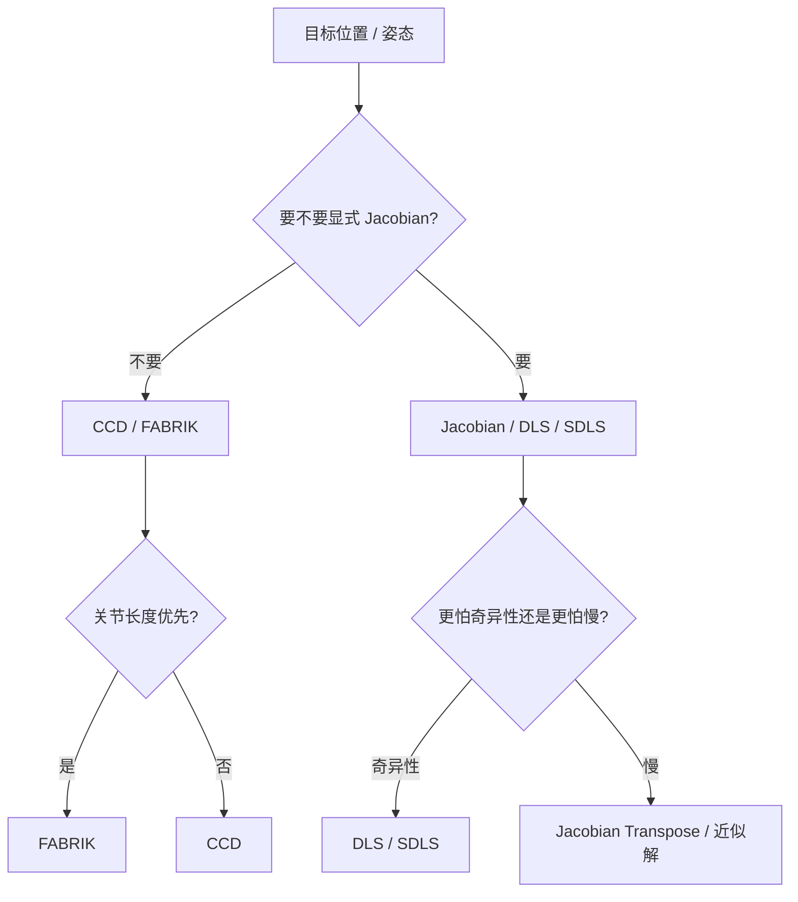
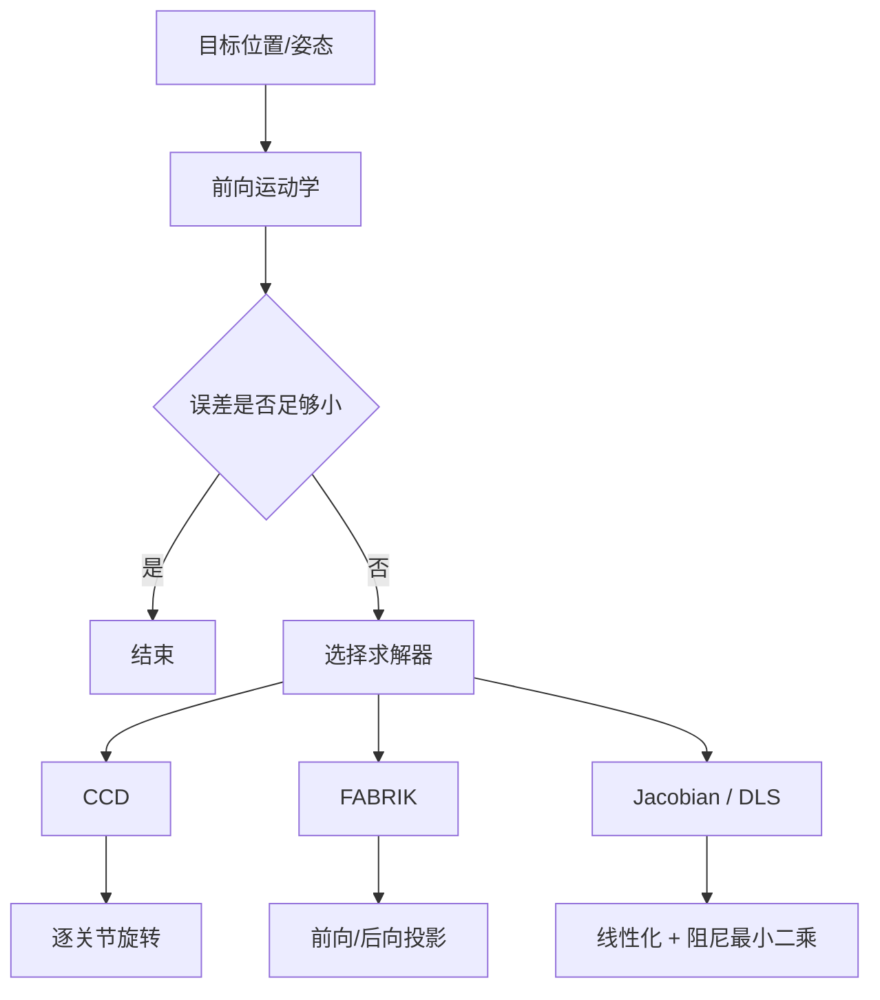
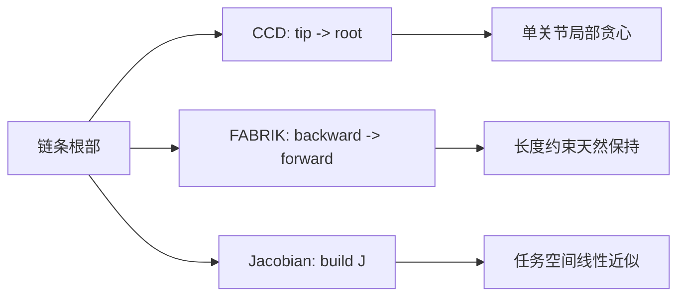

---
title: "游戏与引擎算法 10｜逆向运动学：CCD、FABRIK、Jacobian"
slug: "algo-10-inverse-kinematics"
date: "2026-04-17"
description: "从目标误差函数出发，比较 CCD、FABRIK 与 Jacobian / DLS 的收敛性、局部极小值、关节约束和实时性。"
tags:
  - "逆向运动学"
  - "CCD"
  - "FABRIK"
  - "Jacobian"
  - "关节约束"
  - "动画"
  - "实时控制"
  - "游戏引擎"
series: "游戏与引擎算法"
weight: 1810
---

**一句话本质：IK 不是“让末端到目标点”，而是“在关节空间里找一个代价足够低、又不违反关节限制的姿态”。**

> 读这篇之前：建议先看 [游戏与引擎算法 38｜四元数完全指南：旋转表示、Log/Exp、奇异性]()、[游戏与引擎算法 03｜约束求解：Sequential Impulse 与 PBD]() 和 [游戏与引擎算法 41｜浮点精度与数值稳定性]()。IK 本质上就是一个带约束的迭代优化问题。

## 问题动机

角色把手碰到门把、脚踩到台阶、枪口对准目标、机器人抓住道具，背后都在做同一件事：从“末端要去哪里”反推“每个关节该转多少”。

正向运动学简单：给定关节角，末端位置就出来了。逆向运动学反过来，却不是一条公式就能解完，因为它常常有多个解、没有解析解，或者根本没有满足全部约束的精确解。

游戏里的 IK 还有一个现实要求：它必须快。动画帧预算通常只有几毫秒，而链条、目标和约束会在每帧变动。

这就把 IK 拆成三类路线：`CCD` 追求简单稳定，`FABRIK` 追求几何直觉和少迭代，`Jacobian` 追求更统一的数学框架和更强的约束表达。

### 三类方法各自解决什么



## 历史背景

IK 先是机器人学问题，再变成动画问题，最后变成游戏引擎的日常工具。

早期的 Jacobian 方法来自机器人控制。Wampler 1986 年就把逆解写成阻尼最小二乘问题，说明“直接求逆”在奇异位形附近会失效。1990 年代的工业机器人文献继续围绕 Jacobian transpose、伪逆和 DLS 做工程化改良。

CCD 作为一类逐关节迭代方法，在 2000 年代被动画和图形学系统广泛吸收。Kenwright 2013 年的文章明确把 CCD 描述成适合高关节数角色的快速、简单、可交互算法。它受欢迎，不是因为数学漂亮，而是因为太容易落地。

FABRIK 则是 2011 年的转折点。Aristidou 和 Lasenby 提出它时，刻意绕开矩阵和旋转角，直接用点和线做前向/后向迭代。这个选择很像游戏开发里常见的策略：不要一开始就求全局最优，先找一个足够稳、足够快的近似。

后来 Unity、Unreal、ozz-animation 都把 IK 变成了标准工具链的一部分。Unity Mecanim 提供人形 IK，Animation Rigging 提供 Two Bone IK 和 Chain IK；Unreal 的 Control Rig 和 Full-Body IK 则把 IK 深度集成进编辑器；ozz-animation 则把 TwoBoneIKJob、IKAimJob 和 Look-at 变成轻量、可组合的运行时作业。

## 数学基础

### 1. 目标函数不是只有位置

对末端位置 `x(θ)` 和目标位置 `x*`，最基本的目标函数是：

$$
E(\theta) = \frac12 \|x(\theta) - x^*\|^2
$$

如果还要考虑朝向，就把旋转误差也加进去。最自然的写法是用四元数对数映射：

$$
E(\theta) = \frac12 \|p(\theta) - p^*\|^2 + \frac{w_r}{2} \|\log(q^* q(\theta)^{-1})\|^2
$$

这里的 `\log` 和 `q^* q^{-1}` 的意义和四元数文章一致：把姿态误差搬到切空间里，才能像向量一样处理。

### 2. Jacobian 是局部线性化

把关节变量写成 `\theta`，末端误差 `e` 可以在当前姿态附近线性化为：

$$
\Delta x \approx J(\theta)\,\Delta \theta
$$

其中 `J` 是雅可比矩阵。于是最经典的最小二乘解是：

$$
\Delta \theta = J^+ e
$$

如果担心奇异性，就加阻尼：

$$
\Delta \theta = J^T (J J^T + \lambda^2 I)^{-1} e
$$

这就是 DLS。它不会真的把奇异性消灭，但会把无穷大的增益压回可用范围。

### 3. CCD 本质上是坐标下降

CCD 不去显式建 `J`，而是一次只改一个关节。对第 `i` 个关节，它寻找一个角度增量，使末端向目标方向更近。

从优化角度看，这就是沿坐标轴逐个下降误差。它简单、局部、贪心，所以几何上很直观，也很容易受局部极小值和关节限位影响。

### 4. FABRIK 是交替投影

FABRIK 不先想角度，而是先想位置。每条骨骼长度固定，所以每次移动一个关节时，都会把它投影到以相邻关节为球心、骨长为半径的球面上。

这让它很像两次交替投影：一次从末端往根部拉，一次从根部往末端推。长度约束天然满足，所以它在关节链上很稳。

### 5. 收敛性、局部极小值和约束

- **CCD**：通常单次更新会让末端更接近目标，但整体收敛不是全局保证。关节限位会让它提前卡住。
- **FABRIK**：对纯长度约束和可达目标，收敛性质比 CCD 更像几何投影；一旦加上复杂角度约束，仍然可能变慢或 oscillate。
- **Jacobian**：局部线性化只在小步长内成立。DLS 把奇异性压下去，但局部极小值、冗余自由度和冲突约束仍然存在。

## 算法推导

### CCD：从末端往根部拧

如果当前关节 `j` 到末端的向量是 `u`，到目标的向量是 `v`，那么关节要做的事就是让 `u` 更接近 `v`。

在 3D 里，常见做法是用旋转轴：

$$
 a = u \times v,
 \quad \phi = \operatorname{atan2}(|a|, u\cdot v)
$$

然后围绕 `a` 旋转 `\phi`，再把它传播到所有下游关节。

这一步的工程实现特别直接，但它对关节限制很敏感。只要某个关节转不动了，后面整条链都可能开始抖。

### FABRIK：先拉回去，再推回去

FABRIK 的两段式非常清楚。

- **Backward pass**：把末端固定在目标上，沿链反推回根部，每一段都保持原骨长。
- **Forward pass**：把根部固定回原位，再向末端推进，同样保持骨长。

对单段骨骼 `i`，如果当前点是 `p_i`，目标方向是 `d`，骨长是 `l_i`，更新就是：

$$
 p_{i+1} = p_i + l_i \frac{d}{\|d\|}
$$

这个公式看似简单，但它有一个巨大的工程优势：**长度始终不丢。**

### Jacobian：用线性化解局部最优

Jacobian 方法把 IK 写成线性最小二乘。对位置任务，最常见的是：

$$
\min_{\Delta\theta} \|J\Delta\theta - e\|^2 + \lambda^2 \|\Delta\theta\|^2
$$

求导后得到 DLS。若还要处理关节限位和次级目标，可以加一个零空间项：

$$
\Delta\theta = J^+ e + (I - J^+J) z
$$

`z` 可以是“远离关节极限”“保持姿态自然”“尽量少动基座”的偏好项。

这一步是 Jacobian 方法的真正价值：它能把“主任务”和“次任务”分层表达。代价是线性代数和调参成本更高。

### 为什么会有局部极小值

IK 的局部极小值，常常不是数学上的平滑谷底，而是约束造成的“死角”。

比如目标超过链长、关节限位把一侧全堵死、或者链条对称导致多个关节互相抵消。CCD 和 FABRIK 都会在这种情况下停住，Jacobian 也只会在局部最近点附近打转。

这就是为什么实际系统里经常要加：目标钳制、关节软约束、hint 方向、姿态偏好和碰撞回避。

## 结构图 / 流程图





## 算法实现

下面用一条单轴关节链来示范。游戏里很多肘、膝、脊柱段都接近这种模型；多轴球关节只是在 Jacobian 里多展开几列，在 CCD / FABRIK 里多加一次投影。

```csharp
// C#-style pseudocode, suitable for runtime translation.
using System;
using System.Collections.Generic;
using System.Numerics;

public sealed class IkChain
{
    public sealed class Joint
    {
        public Vector3 Position;
        public Quaternion Rotation = Quaternion.Identity;
        public Vector3 AxisLocal = Vector3.UnitY;
        public float LengthToChild;
        public float AngleDegrees;
        public float MinAngleDegrees = -180f;
        public float MaxAngleDegrees = 180f;
    }

    public readonly List<Joint> Joints = new(); // root -> tip

    public Vector3 EndEffector => Joints[^1].Position;

    public bool SolveCcd(Vector3 target, int iterations, float tolerance)
    {
        if (Joints.Count < 2) return false;

        for (int iter = 0; iter < iterations; iter++)
        {
            if (Vector3.DistanceSquared(EndEffector, target) <= tolerance * tolerance)
                return true;

            for (int i = Joints.Count - 2; i >= 0; i--)
            {
                Vector3 jointPos = Joints[i].Position;
                Vector3 toEff = Vector3.Normalize(EndEffector - jointPos);
                Vector3 toTarget = Vector3.Normalize(target - jointPos);

                float dot = Math.Clamp(Vector3.Dot(toEff, toTarget), -1f, 1f);
                if (dot > 0.99999f) continue;

                Vector3 axis = Vector3.Cross(toEff, toTarget);
                if (axis.LengthSquared() < 1e-8f)
                {
                    axis = FindFallbackAxis(Joints[i]);
                }
                axis = Vector3.Normalize(axis);

                float angle = MathF.Acos(dot);
                ApplyWorldRotation(i, axis, angle);
                EnforceJointLimit(i);
                RebuildDownstream(i);
            }
        }

        return Vector3.DistanceSquared(EndEffector, target) <= tolerance * tolerance;
    }

    public bool SolveFabrik(Vector3 target, int iterations, float tolerance)
    {
        if (Joints.Count < 2) return false;

        Vector3 root = Joints[0].Position;
        float totalLength = 0f;
        for (int i = 0; i < Joints.Count - 1; i++)
            totalLength += Joints[i].LengthToChild;

        if (Vector3.Distance(root, target) >= totalLength)
        {
            // Unreachable: stretch toward target.
            Vector3 dir = Vector3.Normalize(target - root);
            Joints[0].Position = root;
            for (int i = 0; i < Joints.Count - 1; i++)
                Joints[i + 1].Position = Joints[i].Position + dir * Joints[i].LengthToChild;
            return false;
        }

        for (int iter = 0; iter < iterations; iter++)
        {
            if (Vector3.DistanceSquared(EndEffector, target) <= tolerance * tolerance)
                return true;

            // Backward pass: tip to root.
            Joints[^1].Position = target;
            for (int i = Joints.Count - 2; i >= 0; i--)
            {
                Vector3 dir = Vector3.Normalize(Joints[i].Position - Joints[i + 1].Position);
                Joints[i].Position = Joints[i + 1].Position + dir * Joints[i].LengthToChild;
            }

            // Forward pass: root to tip.
            Joints[0].Position = root;
            for (int i = 0; i < Joints.Count - 1; i++)
            {
                Vector3 dir = Vector3.Normalize(Joints[i + 1].Position - Joints[i].Position);
                Joints[i + 1].Position = Joints[i].Position + dir * Joints[i].LengthToChild;
            }
        }

        return Vector3.DistanceSquared(EndEffector, target) <= tolerance * tolerance;
    }

    public bool SolveJacobianDls(Vector3 target, int iterations, float tolerance, float damping)
    {
        if (Joints.Count < 2) return false;

        for (int iter = 0; iter < iterations; iter++)
        {
            ForwardKinematics();
            Vector3 e = target - EndEffector;
            if (e.LengthSquared() <= tolerance * tolerance) return true;

            int n = Joints.Count - 1;
            float[,] j = new float[3, n];

            for (int col = 0; col < n; col++)
            {
                Vector3 jointPos = Joints[col].Position;
                Vector3 axisWorld = Vector3.Normalize(TransformAxisToWorld(col, Joints[col].AxisLocal));
                Vector3 r = EndEffector - jointPos;
                Vector3 dp = Vector3.Cross(axisWorld, r);
                j[0, col] = dp.X;
                j[1, col] = dp.Y;
                j[2, col] = dp.Z;
            }

            // DLS in task space: delta = J^T (J J^T + λ^2 I)^-1 e
            float[,] a = MultiplyJJT(j, damping * damping);
            float[] rhs = new[] { e.X, e.Y, e.Z };
            float[] task = Solve3x3(a, rhs);
            float[] delta = MultiplyJT(j, task);

            for (int i = 0; i < n; i++)
            {
                Joints[i].AngleDegrees += delta[i] * 180f / MathF.PI;
                Joints[i].AngleDegrees = Math.Clamp(Joints[i].AngleDegrees, Joints[i].MinAngleDegrees, Joints[i].MaxAngleDegrees);
            }
        }

        ForwardKinematics();
        return Vector3.DistanceSquared(EndEffector, target) <= tolerance * tolerance;
    }

    private void ForwardKinematics()
    {
        if (Joints.Count == 0)
            return;

        Quaternion worldRotation = Quaternion.Identity;
        for (int i = 0; i < Joints.Count; i++)
        {
            var joint = Joints[i];
            Vector3 axis = SafeNormalize(joint.AxisLocal, Vector3.UnitY);
            joint.Rotation = Quaternion.CreateFromAxisAngle(axis, joint.AngleDegrees * MathF.PI / 180f);
            Joints[i] = joint;

            worldRotation = Quaternion.Normalize(Multiply(worldRotation, joint.Rotation));
            if (i < Joints.Count - 1)
            {
                Vector3 childOffset = Vector3.Transform(Vector3.UnitX * joint.LengthToChild, worldRotation);
                var child = Joints[i + 1];
                child.Position = joint.Position + childOffset;
                Joints[i + 1] = child;
            }
        }
    }

    private void ApplyWorldRotation(int jointIndex, Vector3 worldAxis, float radians)
    {
        Vector3 axisWorld = SafeNormalize(TransformAxisToWorld(jointIndex, Joints[jointIndex].AxisLocal), Vector3.UnitY);
        float signedRadians = radians * MathF.Sign(Vector3.Dot(axisWorld, worldAxis));
        if (MathF.Abs(signedRadians) <= 1e-8f)
            return;

        var joint = Joints[jointIndex];
        joint.AngleDegrees += signedRadians * 180f / MathF.PI;
        Joints[jointIndex] = joint;
    }

    private void RebuildDownstream(int fromJoint)
    {
        _ = fromJoint;
        ForwardKinematics();
    }

    private void EnforceJointLimit(int jointIndex)
    {
        var joint = Joints[jointIndex];
        joint.AngleDegrees = Math.Clamp(joint.AngleDegrees, joint.MinAngleDegrees, joint.MaxAngleDegrees);
        Joints[jointIndex] = joint;
    }

    private static Vector3 FindFallbackAxis(Joint joint)
        => SafeNormalize(Math.Abs(Vector3.Dot(joint.AxisLocal, Vector3.UnitY)) > 0.9f ? Vector3.UnitX : Vector3.UnitY, Vector3.UnitY);

    private Vector3 TransformAxisToWorld(int jointIndex, Vector3 axisLocal)
    {
        if (jointIndex <= 0)
            return SafeNormalize(axisLocal, Vector3.UnitY);

        Quaternion parentRotation = ComputeWorldRotation(jointIndex - 1);
        return SafeNormalize(Vector3.Transform(axisLocal, parentRotation), Vector3.UnitY);
    }

    private Quaternion ComputeWorldRotation(int jointIndex)
    {
        Quaternion world = Quaternion.Identity;
        int last = Math.Clamp(jointIndex, 0, Joints.Count - 1);
        for (int i = 0; i <= last; i++)
        {
            Vector3 axis = SafeNormalize(Joints[i].AxisLocal, Vector3.UnitY);
            Quaternion local = Quaternion.CreateFromAxisAngle(axis, Joints[i].AngleDegrees * MathF.PI / 180f);
            world = Quaternion.Normalize(Multiply(world, local));
        }
        return world;
    }

    private static Quaternion Multiply(Quaternion a, Quaternion b)
        => new(
            a.W * b.X + a.X * b.W + a.Y * b.Z - a.Z * b.Y,
            a.W * b.Y - a.X * b.Z + a.Y * b.W + a.Z * b.X,
            a.W * b.Z + a.X * b.Y - a.Y * b.X + a.Z * b.W,
            a.W * b.W - a.X * b.X - a.Y * b.Y - a.Z * b.Z);

    private static Vector3 SafeNormalize(Vector3 v, Vector3 fallback)
    {
        float lenSq = v.LengthSquared();
        if (lenSq <= 1e-12f)
            return fallback;
        return v / MathF.Sqrt(lenSq);
    }

    private static float[,] MultiplyJJT(float[,] j, float lambda2)
    {
        float[,] a = new float[3, 3];
        int n = j.GetLength(1);
        for (int r = 0; r < 3; r++)
        for (int c = 0; c < 3; c++)
        {
            float sum = 0f;
            for (int k = 0; k < n; k++) sum += j[r, k] * j[c, k];
            a[r, c] = sum + (r == c ? lambda2 : 0f);
        }
        return a;
    }

    private static float[] MultiplyJT(float[,] j, float[] v)
    {
        int n = j.GetLength(1);
        float[] outVec = new float[n];
        for (int c = 0; c < n; c++)
        {
            outVec[c] = j[0, c] * v[0] + j[1, c] * v[1] + j[2, c] * v[2];
        }
        return outVec;
    }

    private static float[] Solve3x3(float[,] a, float[] b)
    {
        // Small dense solver for the 3x3 task-space system.
        // Production code should use a numerically robust implementation.
        float det =
            a[0,0] * (a[1,1] * a[2,2] - a[1,2] * a[2,1]) -
            a[0,1] * (a[1,0] * a[2,2] - a[1,2] * a[2,0]) +
            a[0,2] * (a[1,0] * a[2,1] - a[1,1] * a[2,0]);

        if (Math.Abs(det) < 1e-8f)
            return new float[3];

        float invDet = 1f / det;
        float x = invDet * (
            b[0] * (a[1,1] * a[2,2] - a[1,2] * a[2,1]) -
            a[0,1] * (b[1] * a[2,2] - a[1,2] * b[2]) +
            a[0,2] * (b[1] * a[2,1] - a[1,1] * b[2]));
        float y = invDet * (
            a[0,0] * (b[1] * a[2,2] - a[1,2] * b[2]) -
            b[0] * (a[1,0] * a[2,2] - a[1,2] * a[2,0]) +
            a[0,2] * (a[1,0] * b[2] - b[1] * a[2,0]));
        float z = invDet * (
            a[0,0] * (a[1,1] * b[2] - b[1] * a[2,1]) -
            a[0,1] * (a[1,0] * b[2] - b[1] * a[2,0]) +
            b[0] * (a[1,0] * a[2,1] - a[1,1] * a[2,0]));
        return new[] { x, y, z };
    }
}
```

这段代码把三个方法的哲学差异暴露出来了：CCD 改局部角，FABRIK 改关节位置，Jacobian 改任务空间的线性近似。

## 复杂度分析

对单条链条、单末端目标来说，三者都能做到每次迭代近似 `O(n)`，其中 `n` 是关节数。

但常数差异很大：

- **CCD**：每个关节都要重新算一次末端方向，单次 sweep 代价低，调参简单。
- **FABRIK**：每次需要一次 backward pass 和一次 forward pass，长度约束天然满足，稳定性通常优于 CCD。
- **Jacobian / DLS**：要建 Jacobian、解线性系统、再做关节限位和次级目标处理。对单末端位置任务，task-space 系统是 3×3 或 6×6，矩阵求解很小；但多目标、旋转任务和冗余关节会把成本和调试复杂度一起抬高。

真正影响帧时间的，往往不是一次迭代，而是你要跑多少次迭代才能把误差压到阈值以内。

## 变体与优化

- **CCD + hinge limit**：每步都做关节限位投影，适合肘、膝、脖子。
- **FABRIK + cone projection**：每次位置投影后，把关节方向再投回允许锥体。
- **Jacobian transpose**：比伪逆更简单，适合低自由度、低精度、强实时需求。
- **DLS / SDLS**：给奇异位形加阻尼，或按奇异值分别加权，减少震荡。
- **Secondary objectives**：用零空间项保持姿态自然、远离关节极限或避免自碰撞。

## 对比其他算法

| 方法 | 核心思想 | 收敛性 | 局部极小值 | 关节约束 | 典型用途 |
|---|---|---|---|---|---|
| CCD | 逐关节旋转末端朝目标 | 好，容易实现 | 会卡在对称姿态和限位边界 | 易加，但会影响收敛 | 四肢、简单角色 |
| FABRIK | 前向/后向长度投影 | 通常比 CCD 更稳 | 仍会被约束冲突卡住 | 容易加长度约束，角度约束需额外投影 | 手臂、腿、链条 |
| Jacobian / DLS | 任务空间线性化 | 局部收敛强 | 奇异和局部谷底仍在 | 表达力最强 | 多自由度、复杂约束 |

## 批判性讨论

CCD 的最大优点是简单。缺点也是简单：它只看当前这一步，天然贪心，遇到复杂约束时很容易抖。

FABRIK 很适合“长度必须守住”的链条，但它的几何直觉不是免费午餐。只要加入肩膀极限、腕部方向、闭链或者自碰撞，算法就会从“几行代码”迅速变成“一个小型约束系统”。

Jacobian 的表达力最强，也最接近控制理论里的标准做法。问题在于，表达力越强，奇异性、权重设计、任务优先级和数值稳定性就越像一个系统工程问题，而不再是单一公式。

所以游戏里常见的做法不是“选一个最好的 IK”，而是**先用 FABRIK 或 CCD 快速给出可视结果，再用 Jacobian 或约束投影做局部修正。**

## 跨学科视角

CCD 很像坐标下降法，逐变量贪心优化；FABRIK 像交替投影和几何约束满足；Jacobian DLS 则是标准的最小二乘优化。

这也是 IK 之所以跨越机器人学、动画和蛋白质折叠的原因。比如蛋白 loop closure 里就借用了 CCD 的思想，因为它和“让一串受限自由度回到目标构型”在数学上是同一类问题。

在机器人里，IK 还和奇异位形、任务优先级、冗余自由度紧密绑定；在游戏里，它则进一步和角色骨架、约束空间、地形适配和 root motion 混合在一起。

## 真实案例

- [Unity Mecanim IK manual](https://docs.unity3d.com/cn/2018.3/Manual/InverseKinematics.html) 明确说明了 humanoid IK 的目标是从空间目标反推关节方向；[Unity Animation Rigging `Two Bone IK`](https://docs.unity3d.com/ja/Packages/com.unity.animation.rigging%401.2/manual/constraints/TwoBoneIKConstraint.html) 则把三关节链、Target 和 Hint 直接做成组件。
- [Unity `animation-jobs-samples`](https://github.com/Unity-Technologies/animation-jobs-samples) 的 `TwoBoneIK` 和 `FullBodyIK` sample 把 IK 做成了可运行的动画作业。
- [ozz-animation 的 IK 文档](https://guillaumeblanc.github.io/ozz-animation/documentation/ik/) 说明 `IKTwoBoneJob`、`IKAimJob` 和 `Foot IK` 采用模型空间输入、局部空间输出的作业化管线。
- [Unreal Control Rig](https://dev.epicgames.com/documentation/en-us/unreal-engine/control-rig-in-unreal-engine?application_version=5.6) 和 [Full-Body IK](https://dev.epicgames.com/documentation/ru-ru/unreal-engine/control-rig-full-body-ik-in-unreal-engine) 则把基于 Position Based IK 的约束式求解接进了编辑器和运行时。

## 量化数据

可核实的量化比较，不一定来自游戏引擎本身，但足以说明三类方法的差异。

- FABRIK 原论文强调它“少迭代、低计算成本”，这是它被游戏和机器人同时接受的关键。
- 一篇 FABRIK 家族的公开基准论文在多组机器人上报告：FABRIK 变体 `FABRIKx(P)` 的平均求解时间大约是 `2.1-4.0 ms`，Jacobian 方案约 `5.1-26.6 ms`，迭代次数也从 `11-14` 对 `19-28` 这样分开。
- `IKPy` 这个开源库在项目说明里给出单次完整 IK 计算约 `7 ms to 50 ms` 的范围，说明 Jacobian 类方法在精度需求上去之后，实时性仍然会明显受链长和数值条件影响。

这些数字要放回语境里看：它们不是“谁永远更快”，而是“在同类目标和同类约束下，谁更容易用较少迭代达到可用误差”。

## 常见坑

1. **把 CCD 当成单次旋转就完事。**  
   错因：转一个关节，后面的关节位置全变了。  
   怎么改：每改一个关节都要重算下游链条。

2. **FABRIK 只保持长度，不管角度。**  
   错因：纯长度约束会让肘部翻折到不自然的方向。  
   怎么改：每次投影后再做关节限位和 hint 投影。

3. **Jacobian 只看伪逆，不加阻尼。**  
   错因：一到奇异位形，解会爆。  
   怎么改：至少用 DLS；多目标和关节限制再加零空间项。

4. **忽略目标不可达。**  
   错因：链长不够时还继续硬追，会在边界上抖。  
   怎么改：先把目标钳制到可达半径内，或者显式处理 unreachable case。

## 何时用 / 何时不用

**适合用 CCD 的场景：**

- 单条肢体、关节少、需要快速出结果。
- 你更在意“够用”和“好调”，而不是数学漂亮。

**适合用 FABRIK 的场景：**

- 链长必须严格守住。
- 手臂、腿、尾巴、绳索、脊柱段这类几何直觉强的链条。
- 你要比 CCD 更平滑，但又不想上完整 Jacobian 系统。

**适合用 Jacobian / DLS 的场景：**

- 多自由度、多个目标、姿态和位置都要管。
- 需要任务优先级、零空间优化和更完整的约束表达。

**不适合只靠 IK 的场景：**

- 目标常常不可达，且你又不做目标钳制。
- 自碰撞很强、关节约束很复杂、链条很长。
- 你其实需要的是一个小型约束求解器，而不只是一个 IK 步骤。

## 相关算法

- [游戏与引擎算法 38｜四元数完全指南：旋转表示、Log/Exp、奇异性]()
- [游戏与引擎算法 03｜约束求解：Sequential Impulse 与 PBD]()
- [游戏与引擎算法 09｜旋转插值：Slerp、Nlerp、Squad]()
- [游戏与引擎算法 41｜浮点精度与数值稳定性]()

## 小结

CCD、FABRIK 和 Jacobian 不是互相取代，而是三种优化哲学：贪心局部修正、几何投影、局部线性化。

在游戏里，最好的 IK 往往不是最数学化的那个，而是最能把关节限制、实时预算和动画自然度一起平衡好的那个。

如果你只记住一句话，那就记住：**IK 不是找到唯一答案，而是在可用答案里尽量选一个最像人的。**

## 参考资料

- [Wampler, 1986. Manipulator Inverse Kinematic Solutions Based on Vector Formulations and Damped Least-Squares Methods](https://doi.org/10.1109/TSMC.1986.289285)
- [Buss & Kim, 2005. Selectively Damped Least Squares for Inverse Kinematics](https://doi.org/10.1080/2151237X.2005.10129202)
- [Kenwright, 2013. Inverse Kinematics – Cyclic Coordinate Descent (CCD)](https://doi.org/10.1080/2165347X.2013.823362)
- [Aristidou & Lasenby, 2011. FABRIK: A fast, iterative solver for the Inverse Kinematics problem](https://www.sciencedirect.com/science/article/pii/S1524070311000178)
- [Unity Mecanim IK](https://docs.unity3d.com/cn/2018.3/Manual/InverseKinematics.html)
- [Unity Animation Rigging Two Bone IK](https://docs.unity3d.com/ja/Packages/com.unity.animation.rigging%401.2/manual/constraints/TwoBoneIKConstraint.html)
- [ozz-animation IK documentation](https://guillaumeblanc.github.io/ozz-animation/documentation/ik/)
- [Unreal Control Rig](https://dev.epicgames.com/documentation/en-us/unreal-engine/control-rig-in-unreal-engine?application_version=5.6)
- [Unreal Full-Body IK](https://dev.epicgames.com/documentation/ru-ru/unreal-engine/control-rig-full-body-ik-in-unreal-engine)

