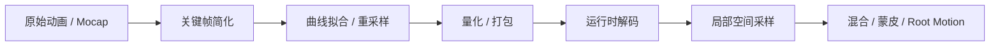
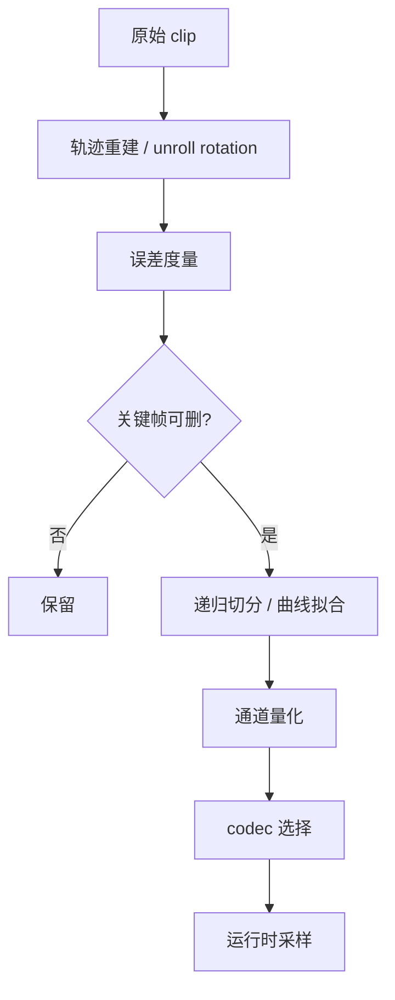
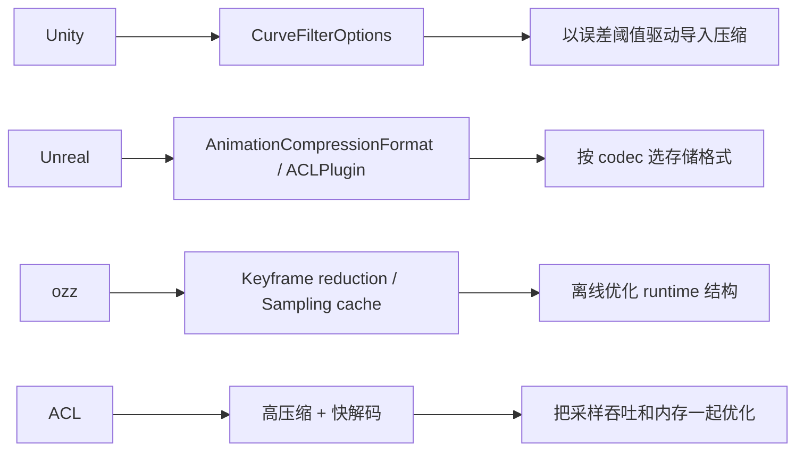

---
title: "游戏与引擎算法 11｜动画压缩"
slug: "algo-11-animation-compression"
date: "2026-04-17"
description: "解释关键帧简化、曲线拟合、量化和运行时解码如何共同把动画数据从‘又大又慢’变成‘足够小且足够快’。"
tags:
  - "动画压缩"
  - "关键帧简化"
  - "曲线拟合"
  - "量化"
  - "ACL"
  - "ozz-animation"
  - "Mecanim"
  - "Unreal"
series: "游戏与引擎算法"
weight: 1811
---

**一句话本质：动画压缩不是把数据“变少”这么简单，而是在可接受的误差预算内，把存储、加载和采样成本重新分配。**

> 读这篇之前：建议先看 [游戏与引擎算法 09｜旋转插值：Slerp、Nlerp、Squad]()、[游戏与引擎算法 38｜四元数完全指南：旋转表示、Log/Exp、奇异性]() 和 [游戏与引擎算法 41｜浮点精度与数值稳定性]()。动画压缩的核心误差，几乎总会落到插值和量化上。

## 问题动机

动画数据在引擎里很容易成为隐形大户。

一个角色的骨架可能只有几十到几百根骨头，但一条动作片段常常包含成百上千帧的位移、旋转、缩放和曲线事件。几百个角色、几套 LOD、再叠上 root motion 和 additive clip，内存和磁盘就会很快上去。

更麻烦的是，动画不是只占内存。采样时你还要查关键帧、插值、重建局部空间姿态、再做局部到模型空间转换。数据越大，缓存局部性越差，解码次数越多，采样就越慢。

所以动画压缩的目标不是“越狠越好”，而是**让引擎在可控误差下，以更低的内存和更高的采样吞吐播放同样的动作。**

### 压缩管线要平衡三件事



## 历史背景

动画压缩的历史，和视频压缩很像：先有原始采集数据，再有离线处理，再有按硬件预算选择表示法。

在早期 DCC 和游戏管线里，动画往往以较密的关键帧存储。那时存储贵、内存小、CPU 也慢，所以大家先学会的是“删掉冗余关键帧”。Unity 的 `Keyframe Reduction`、`Animation Compression` 选项都延续了这条思路。

后来，游戏开始追求更大的角色库、更长的动作片段和更快的运行时采样，单纯删帧不够了。必须把曲线表示、量化策略、运行时 codec 和数据布局一起考虑。

`ozz-animation` 把这件事做成了一个完整 pipeline：离线构建优化结构，运行时做局部空间采样和混合。`ACL` 则更进一步，把“压得更小、解得更快、误差更低”变成了明确的工程目标，并做成可嵌入引擎的压缩库。Unreal 在 5.3 把 ACL 插件直接纳入引擎默认 codec，这说明动画压缩已经从可选优化变成了基础设施。

## 数学基础

### 1. 误差预算

压缩本质上是在最小化误差，同时控制比特数。

对一个标量轨迹 `x(t)`，压缩后的近似曲线 `\hat x(t)` 的最大误差可以写成：

$$
\varepsilon_{\infty} = \max_{t \in [t_0, t_n]} |x(t) - \hat x(t)|
$$

对位置向量 `p(t)`：

$$
\varepsilon_p = \max_t \|p(t) - \hat p(t)\|
$$

对单位四元数旋转，最自然的误差度量是测地角：

$$
\varepsilon_q = \max_t 2\arccos\left(|q(t) \cdot \hat q(t)|\right)
$$

这条式子和旋转插值文章是一致的：旋转误差不该在分量空间里算，而要在球面上算。

### 2. 关键帧简化

最常见的简化问题是：在一条离散轨迹里删掉尽量多的点，但删掉后误差不能超标。

对线性插值的简化，可以递归地检查一段 `[i,j]` 的中间点是否都落在误差阈值内。若超标，就在最大误差处切开。

这和 Ramer-Douglas-Peucker 很像，只是误差度量不再是平面折线距离，而是标量、向量或四元数距离。

### 3. 曲线拟合

如果只删点，得到的是折线式恢复。更好的做法是把关键帧拟合成 Hermite、Bezier 或分段样条，再在运行时采样。

拟合的好处，是可以用更少的控制点表达更平滑的曲线；坏处是拟合阶段更复杂，运行时还得付更多插值成本。

### 4. 量化

量化把连续值映射到有限比特宽度。

标量 `x` 的常见映射是：

$$
 u = \operatorname{round}\left(\frac{x - x_{\min}}{x_{\max} - x_{\min}} (2^b - 1)\right)
$$

解码时再反算回去：

$$
\hat x = x_{\min} + \frac{u}{2^b - 1}(x_{\max} - x_{\min})
$$

对于单位四元数，常见做法是存三个分量和一个符号位，第四个分量由单位长度约束恢复。

这就是为什么很多引擎里的旋转 codec 都会写成 `NoW`：不是不管 `W`，而是把它从显式存储改成隐式恢复。

## 算法推导

### 为什么“删关键帧”是第一步

动画轨迹里常常有大量冗余帧。对于缓慢变化的关节，连续帧之间差别很小，留着只会增加存储和采样成本。

所以最先做的通常是错误有界的关键帧简化。它能直接减少 key count，也能降低运行时查找和插值次数。

### 为什么“单一误差阈值”不够

位置、旋转和缩放的误差感知方式不同。1 厘米的位置误差和 1 度的旋转误差，视觉影响完全不是一个量级。

Unity 的 `CurveFilterOptions` 就把 `positionError`、`rotationError`、`scaleError` 和 `floatError` 分开。这个设计很实际：不同通道用不同单位，才能让导演、动画师和程序员达成一致。

### 为什么量化通常要和运行时 codec 绑定

如果离线只做简化，运行时还是按原始浮点全量读写，那收益会很有限。

真正的压缩体系会把表示法也一起变掉：例如把旋转改成 48/32 位格式，把常量轨迹单独剥离，把索引和时间点压缩掉，把相邻帧的读取顺序也优化掉。

`ozz-animation` 0.15.0 的 release note 里就明确提到：keyframe 结构重排后，keyframe size 因为时间索引收缩而减少了 17% 到 25%。这说明“结构设计”本身就是压缩的一部分。

### 为什么 root motion 要单独处理

Root motion 是角色运动和碰撞的来源，不只是普通动画通道。

如果你把根骨轨迹压得太狠，角色脚底会滑，位移会抖，网络同步也会更容易分叉。所以 `ozz` 的 motion extraction / motion blending、Unreal 的数据库和 ACL 的 bind-pose stripping 都在做一件相似的事：**把根运动和普通姿态分开考虑。**

## 结构图 / 流程图





## 算法实现

下面给一个可落地的压缩骨架。它不是 ACL 完整实现，但把“简化、拟合、量化”三步拆清楚了。

```csharp
using System;
using System.Collections.Generic;
using System.Numerics;

public readonly record struct Keyframe<T>(float Time, T Value);

public sealed class AnimationCompressionSettings
{
    public float PositionError = 0.0025f;
    public float RotationErrorDegrees = 0.5f;
    public float FloatError = 0.01f;
    public int QuantizationBits = 16;
}

public sealed class CompressedTrack<T>
{
    public readonly List<float> KeyTimes = new();
    public readonly List<T> QuantizedValues = new();
    public T DefaultValue = default!;
    public bool IsConstant;
}

public static class AnimationCompression
{
    public static CompressedTrack<float> CompressScalarTrack(
        IReadOnlyList<Keyframe<float>> source,
        AnimationCompressionSettings settings)
    {
        var reduced = SimplifyScalarTrack(source, settings.FloatError);
        var track = new CompressedTrack<float>();
        if (reduced.Count == 0) return track;

        if (IsConstant(reduced))
        {
            track.IsConstant = true;
            track.DefaultValue = reduced[0].Value;
            return track;
        }

        foreach (var k in reduced)
        {
            track.KeyTimes.Add(k.Time);
            track.QuantizedValues.Add(QuantizeFloat(k.Value, Min(source), Max(source), settings.QuantizationBits));
        }

        return track;
    }

    public static List<Keyframe<float>> SimplifyScalarTrack(IReadOnlyList<Keyframe<float>> keys, float maxError)
    {
        if (keys.Count <= 2) return new List<Keyframe<float>>(keys);
        var keep = new bool[keys.Count];
        keep[0] = true;
        keep[^1] = true;
        SimplifyScalarRec(keys, 0, keys.Count - 1, maxError, keep);

        var result = new List<Keyframe<float>>();
        for (int i = 0; i < keys.Count; i++)
            if (keep[i]) result.Add(keys[i]);
        return result;
    }

    public static List<Keyframe<Quaternion>> SimplifyRotationTrack(IReadOnlyList<Keyframe<Quaternion>> keys, float maxErrorDegrees)
    {
        if (keys.Count <= 2) return new List<Keyframe<Quaternion>>(keys);
        var unrolled = UnrollQuaternionSign(keys);
        var keep = new bool[unrolled.Count];
        keep[0] = true;
        keep[^1] = true;
        SimplifyRotationRec(unrolled, 0, unrolled.Count - 1, maxErrorDegrees, keep);

        var result = new List<Keyframe<Quaternion>>();
        for (int i = 0; i < unrolled.Count; i++)
            if (keep[i]) result.Add(unrolled[i]);
        return result;
    }

    public static float RotationErrorDegrees(Quaternion a, Quaternion b)
    {
        a = Quaternion.Normalize(a);
        b = Quaternion.Normalize(b);
        float dot = MathF.Abs(Quaternion.Dot(a, b));
        dot = Math.Clamp(dot, -1f, 1f);
        return 2f * MathF.Acos(dot) * 180f / MathF.PI;
    }

    public static ushort QuantizeFloat(float value, float min, float max, int bits)
    {
        if (bits <= 0 || bits > 16) throw new ArgumentOutOfRangeException(nameof(bits));
        if (Math.Abs(max - min) < 1e-8f) return 0;

        float t = (value - min) / (max - min);
        t = Math.Clamp(t, 0f, 1f);
        uint levels = (1u << bits) - 1u;
        return (ushort)Math.Round(t * levels);
    }

    public static Vector3 QuantizeQuaternionXYZ(Quaternion q, int bitsPerComponent)
    {
        q = Quaternion.Normalize(q);
        if (q.W < 0f) q = Negate(q);
        float scale = (1 << bitsPerComponent) - 1;
        return new Vector3(
            MathF.Round((q.X * 0.5f + 0.5f) * scale) / scale,
            MathF.Round((q.Y * 0.5f + 0.5f) * scale) / scale,
            MathF.Round((q.Z * 0.5f + 0.5f) * scale) / scale);
    }

    private static void SimplifyScalarRec(IReadOnlyList<Keyframe<float>> keys, int i0, int i1, float maxError, bool[] keep)
    {
        float t0 = keys[i0].Time;
        float t1 = keys[i1].Time;
        float v0 = keys[i0].Value;
        float v1 = keys[i1].Value;
        float max = 0f;
        int split = -1;

        for (int i = i0 + 1; i < i1; i++)
        {
            float u = (keys[i].Time - t0) / (t1 - t0);
            float predicted = v0 + (v1 - v0) * u;
            float error = MathF.Abs(keys[i].Value - predicted);
            if (error > max)
            {
                max = error;
                split = i;
            }
        }

        if (max > maxError && split >= 0)
        {
            keep[split] = true;
            SimplifyScalarRec(keys, i0, split, maxError, keep);
            SimplifyScalarRec(keys, split, i1, maxError, keep);
        }
    }

    private static void SimplifyRotationRec(IReadOnlyList<Keyframe<Quaternion>> keys, int i0, int i1, float maxErrorDegrees, bool[] keep)
    {
        float t0 = keys[i0].Time;
        float t1 = keys[i1].Time;
        Quaternion q0 = keys[i0].Value;
        Quaternion q1 = keys[i1].Value;
        float max = 0f;
        int split = -1;

        for (int i = i0 + 1; i < i1; i++)
        {
            float u = (keys[i].Time - t0) / (t1 - t0);
            Quaternion predicted = SlerpShortest(q0, q1, u);
            float error = RotationErrorDegrees(keys[i].Value, predicted);
            if (error > max)
            {
                max = error;
                split = i;
            }
        }

        if (max > maxErrorDegrees && split >= 0)
        {
            keep[split] = true;
            SimplifyRotationRec(keys, i0, split, maxErrorDegrees, keep);
            SimplifyRotationRec(keys, split, i1, maxErrorDegrees, keep);
        }
    }

    private static List<Keyframe<Quaternion>> UnrollQuaternionSign(IReadOnlyList<Keyframe<Quaternion>> keys)
    {
        var result = new List<Keyframe<Quaternion>>(keys.Count);
        if (keys.Count == 0) return result;

        Quaternion prev = Quaternion.Normalize(keys[0].Value);
        result.Add(new Keyframe<Quaternion>(keys[0].Time, prev));

        for (int i = 1; i < keys.Count; i++)
        {
            Quaternion q = Quaternion.Normalize(keys[i].Value);
            if (Quaternion.Dot(prev, q) < 0f) q = Negate(q);
            result.Add(new Keyframe<Quaternion>(keys[i].Time, q));
            prev = q;
        }

        return result;
    }

    private static bool IsConstant<T>(IReadOnlyList<Keyframe<T>> keys)
        => keys.Count > 0 && EqualityComparer<T>.Default.Equals(keys[0].Value, keys[^1].Value);

    private static float Min(IReadOnlyList<Keyframe<float>> keys)
    {
        float m = float.PositiveInfinity;
        foreach (var k in keys) m = MathF.Min(m, k.Value);
        return m;
    }

    private static float Max(IReadOnlyList<Keyframe<float>> keys)
    {
        float m = float.NegativeInfinity;
        foreach (var k in keys) m = MathF.Max(m, k.Value);
        return m;
    }

    private static Quaternion SlerpShortest(Quaternion a, Quaternion b, float t)
    {
        a = Quaternion.Normalize(a);
        b = Quaternion.Normalize(b);
        float dot = Quaternion.Dot(a, b);
        if (dot < 0f) b = Negate(b);
        dot = Math.Clamp(MathF.Abs(dot), -1f, 1f);
        if (dot > 0.9995f)
            return Quaternion.Normalize(LerpRaw(a, b, t));

        float theta = MathF.Acos(dot);
        float sinTheta = MathF.Sin(theta);
        float w0 = MathF.Sin((1f - t) * theta) / sinTheta;
        float w1 = MathF.Sin(t * theta) / sinTheta;
        return Quaternion.Normalize(Add(Scale(a, w0), Scale(b, w1)));
    }

    private static Quaternion LerpRaw(Quaternion a, Quaternion b, float t)
        => new(
            a.X + (b.X - a.X) * t,
            a.Y + (b.Y - a.Y) * t,
            a.Z + (b.Z - a.Z) * t,
            a.W + (b.W - a.W) * t);

    private static Quaternion Add(Quaternion a, Quaternion b)
        => new(a.X + b.X, a.Y + b.Y, a.Z + b.Z, a.W + b.W);

    private static Quaternion Scale(Quaternion q, float s)
        => new(q.X * s, q.Y * s, q.Z * s, q.W * s);

    private static Quaternion Negate(Quaternion q)
        => new(-q.X, -q.Y, -q.Z, -q.W);
}
```

这段骨架故意把“删关键帧”和“量化”分开写。原因很简单：它们解决的是不同层次的成本。

删关键帧减少采样次数；量化减少每个 key 的位宽；曲线拟合减少控制点数量；运行时 codec 负责把这些收益兑现成 cache 友好的解码路径。

## 复杂度分析

关键帧简化最常见的递归切分是 `O(n^2)`，如果每次都扫描整段中间点做最大误差检查，最坏情况会比较贵。

量化本身通常是 `O(n)`，而且主要是一次范围映射和位打包。

曲线拟合和更复杂的 codec 可能会把离线构建成本推到更高，但它们把压力从运行时移开了。

所以动画压缩的核心不是“有没有计算成本”，而是“把成本放在哪个时点、哪个设备、哪条数据路径上更划算”。

## 变体与优化

- **Keyframe reduction**：删掉误差阈值内的冗余帧，最容易落地。
- **Curve fitting**：用分段样条或 Hermite 拟合控制点，减少 key 数。
- **Quaternion unroll**：先把符号连续化，再做简化和量化。
- **Track-wise quantization**：不同通道用不同位宽，不要一刀切。
- **Bind pose stripping**：把未动画化的关节绑定姿态剥离掉，减少冗余。
- **Sampling cache**：把常见采样点的解码状态缓存起来，减少重复解压。

## 对比其他算法

| 路线 | 核心思路 | 优点 | 缺点 | 典型代表 |
|---|---|---|---|---|
| 原始浮点存储 | 什么都不压 | 最简单、最精确 | 最占内存、采样最慢 | 早期导入管线 |
| 关键帧简化 | 删掉冗余点 | 容易实现、收益明显 | 对高频动作不够狠 | Unity keyframe reduction |
| 曲线拟合 | 少量控制点拟合整段 | 平滑、控制力强 | 离线成本高 | 样条 / Hermite 轨迹 |
| codec / quantization | 改表示法和位宽 | 内存和速度一起优化 | 误差预算更难调 | ACL、Unreal codec |

## 批判性讨论

动画压缩没有“免费午餐”。压得越狠，foot sliding、肩部塌陷、手腕抖动、root motion 漂移就越容易出现。

另一个误区是把压缩当纯存储优化。对游戏引擎来说，动画更重要的是运行时采样成本。数据越大，缓存越差，后续插值、混合和蒙皮也越慢。

所以真正成熟的方案，都会把离线构建和运行时表示一起设计。`ozz-animation` 和 ACL 都是在这条线上做文章，而不是只删几个关键帧就结束。

还有一个事实必须承认：压缩不是为了让“所有 clip 都一样好”。有些动作非常适合压缩，比如缓慢循环、程序生成动作、远景 NPC；有些动作则不适合过度压缩，比如近景手部表演、精确击打、root motion 极强的过场。

## 跨学科视角

动画压缩和信号压缩本质上很像。

关键帧就是采样点，删帧相当于稀疏采样，曲线拟合像带约束的重建，量化就是把连续值映射到离散码字。误差预算、码率和重建质量之间的关系，和视频编码、音频编码一模一样。

它也像统计里的模型选择：你不是单纯追求拟合误差最低，而是在更少参数和更高泛化之间找平衡。一个更短的轨迹编码，不一定比原始序列“更真”，但它可能更适合引擎。

## 真实案例

- [Unity `CurveFilterOptions`](https://docs.unity3d.com/ru/2019.4/ScriptReference/Animations.CurveFilterOptions.html) 明确暴露了 `keyframeReduction`、`rotationError`、`positionError`、`scaleError` 和 `floatError`，这就是典型的导入期关键帧压缩入口。
- [Unity `ModelImporterAnimationCompression`](https://docs.unity3d.com/es/530/ScriptReference/ModelImporterAnimationCompression.html) 提供 `Off`、`KeyframeReduction`、`KeyframeReductionAndCompression`、`Optimal` 等选项，直接把压缩策略做成了导入器设置。
- [Unreal Engine 5.3 release notes](https://dev.epicgames.com/documentation/en-us/unreal-engine/unreal-engine-5.3-release-notes%3Fapplication_version%3D5.3%3Fapplication_version%3D5.3?application_version=5.3) 说明 ACL Plugin 已作为引擎插件并设为默认动画压缩 codec，路径在 `/Engine/Plugins/Animation/ACLPlugin/Source/ACLPlugin/`。
- [Unreal `AnimationCompressionFormat`](https://dev.epicgames.com/documentation/en-us/unreal-engine/API/Runtime/Engine/AnimationCompressionFormat) 列出了 `ACF_Float96NoW`、`ACF_Fixed48NoW`、`ACF_IntervalFixed32NoW`、`ACF_Fixed32NoW`、`ACF_Float32NoW`、`ACF_Identity` 等格式，说明运行时 codec 选择是显式的一部分。
- [ACL UE plugin repository](https://github.com/nfrechette/acl-ue4-plugin) 和 [ACL core repository](https://github.com/nfrechette/acl) 都把“压缩比、解码速度、准确性”列成明确目标。
- [ozz-animation features page](https://guillaumeblanc.github.io/ozz-animation/documentation/features/) 和 [Release 0.15.0](https://github.com/guillaumeblanc/ozz-animation/releases) 则展示了 keyframe optimizations、sampling cache、backward sampling optimization 和 keyframe 时间索引压缩。

## 量化数据

这篇最重要的量化数据，来自真实系统的公开说明。

- ACL UE 插件对比 UE 5.2.0：**最多 2.9x 更小、最多 2x 更准确、最多 2x 更快压缩、最多 6.3x 更快解压**。这不是局部技巧，而是整条 codec 路线的结果。
- ozz-animation 0.15.0：keyframe times indexed 后，**每个 keyframe 节省约 16b 到 24b**，也就是 **17% 到 25%** 的 keyframe size。
- Unity `CurveFilterOptions` 把旋转误差明确为 **0 到 180 度**，位置 / 缩放 / float 误差明确为 **0 到 100%**。这说明压缩不是黑箱，而是可调预算。
- Unreal `AnimationCompressionFormat` 给出的位宽菜单本身就是数值证据：96、48、32 位和 identity，表示它已经在运行时把位宽当成一等公民。

这些数字放在一起，说明压缩不是单一技术，而是一整套从误差预算到存储格式再到解码器布局的系统设计。

## 常见坑

1. **忘记先做 quaternion unroll。**  
   错因：相邻帧符号翻转会让简化算法误判为大跳变。  
   怎么改：先做短弧连续化，再做简化和量化。

2. **所有通道共用一个误差阈值。**  
   错因：位置、旋转和缩放的视觉敏感度不同。  
   怎么改：按通道分别设置误差预算，至少把旋转和位移分开。

3. **只看磁盘，不看采样。**  
   错因：离线压小了，运行时解码却更慢。  
   怎么改：把采样缓存、codec 结构和 cache locality 一起算。

4. **对 root motion 和普通关节一刀切。**  
   错因：根骨压坏了，脚底就滑，网络回放也容易偏。  
   怎么改：root motion 单独建轨迹、单独设阈值、单独验证。

## 何时用 / 何时不用

**适合用动画压缩的场景：**

- 大量角色、长动作库、跨平台发布。
- 需要降低磁盘占用、内存占用和采样带宽。
- 运行时采样和混合频繁，缓存命中率重要。

**不适合过度压缩的场景：**

- 近景高精度表演。
- 手部、面部、道具交互等对细节极敏感的动作。
- 需要完全可逆、完全无损的离线分析。

## 相关算法

- [游戏与引擎算法 09｜旋转插值：Slerp、Nlerp、Squad]()
- [游戏与引擎算法 38｜四元数完全指南：旋转表示、Log/Exp、奇异性]()
- [游戏与引擎算法 41｜浮点精度与数值稳定性]()
- [游戏与引擎算法 10｜逆向运动学：CCD、FABRIK、Jacobian]()

## 小结

动画压缩的本质，是把“原始采样数据”变成“更适合引擎消费的运行时表示”。

关键帧简化解决冗余，曲线拟合解决平滑，量化解决位宽，运行时 codec 解决采样和缓存效率。

如果你只记住一句话，那就记住：**压缩不是删数据，而是让每一比特都更值钱。**

## 参考资料

- [ACL core repository](https://github.com/nfrechette/acl)
- [ACL UE plugin repository](https://github.com/nfrechette/acl-ue4-plugin)
- [Unity `CurveFilterOptions`](https://docs.unity3d.com/ru/2019.4/ScriptReference/Animations.CurveFilterOptions.html)
- [Unity `ModelImporterAnimationCompression`](https://docs.unity3d.com/es/530/ScriptReference/ModelImporterAnimationCompression.html)
- [Unreal Engine 5.3 release notes](https://dev.epicgames.com/documentation/en-us/unreal-engine/unreal-engine-5.3-release-notes%3Fapplication_version%3D5.3%3Fapplication_version%3D5.3?application_version=5.3)
- [Unreal `AnimationCompressionFormat`](https://dev.epicgames.com/documentation/en-us/unreal-engine/API/Runtime/Engine/AnimationCompressionFormat)
- [ozz-animation features](https://guillaumeblanc.github.io/ozz-animation/documentation/features/)
- [ozz-animation release 0.15.0](https://github.com/guillaumeblanc/ozz-animation/releases)
