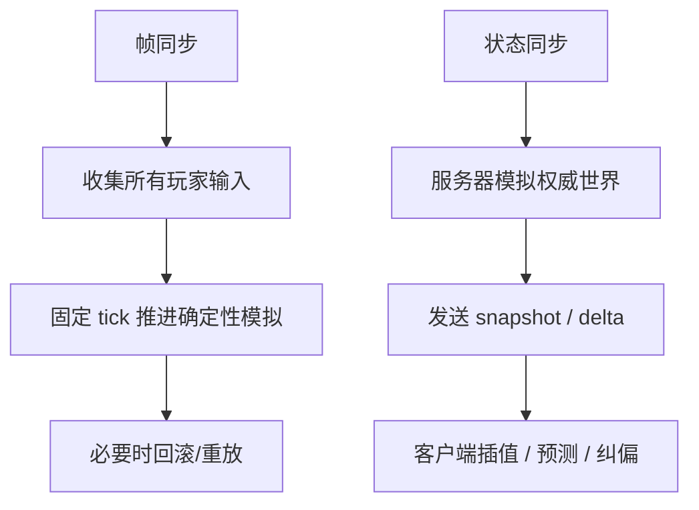

---
title: "游戏与引擎算法 12｜帧同步 vs 状态同步"
slug: "algo-12-lockstep-vs-state-sync"
date: "2026-04-17"
description: "把 deterministic lockstep、input delay、rollback 前提和 server-authoritative state sync 的差异讲透，并落到 RTS、格斗和 FPS 的真实取舍上。"
tags:
  - "帧同步"
  - "状态同步"
  - "deterministic lockstep"
  - "rollback"
  - "server authoritative"
  - "输入延迟"
  - "网络同步"
  - "多人游戏"
series: "游戏与引擎算法"
weight: 1812
---

一句话本质：帧同步把网络问题变成“交换输入”，状态同步把网络问题变成“复制状态”；前者依赖确定性，后者依赖服务器权威和插值/预测。

> 读这篇之前：建议先看 [数值积分：Euler、Verlet、RK4]() 和 [浮点精度与数值稳定性]()。前者决定模拟步进怎么写，后者决定你能不能在多机上跑出一样的结果。

## 问题动机

联网游戏最难的，不是“把数据发出去”，而是“在不同机器上把同一局游戏解释成同一件事”。
如果你让每台机器都随便模拟，哪怕只差一个浮点舍入、一个随机数种子、一个事件顺序，过几秒后状态就会漂开。

所以同步模型必须先回答一个根问题：
到底要同步什么？

帧同步和状态同步给出的答案完全不同。
帧同步同步的是输入，大家在同一 tick 上吃到同一组命令；状态同步同步的是结果，服务器说世界长什么样，客户端再尽量把画面贴过去。

这两条路不是谁更现代，而是适配的游戏类型不同。
RTS、格斗更吃确定性和公平性；FPS、动作协作更吃响应速度、容错和服务器裁决。

## 历史背景

早期联网游戏的带宽很少，CPU 也紧，最自然的办法就是尽量少传。
QuakeWorld 时代把“客户端预测、服务器校正、实体插值”推到大众视野，解决的是第一人称射击里那种“我按了键却要等一会儿才看到自己动”的迟滞问题。

另一条路则来自 RTS 和格斗游戏。
它们把游戏切成离散 tick，只交换玩家输入，靠确定性模拟让每台机器都得到相同结果。
GGPO 把这条思路推广到高精度对战游戏里，并把 rollback 变成可复用的中间层。

随着网络环境变好、云服务器普及，状态同步越来越常见。
Unity、Photon、Unreal 都把 server-authoritative 作为默认或强推选项之一，因为它对作弊、跨平台、可观测性和工程维护都更稳。

## 数学与理论基础

把帧同步看成离散时间系统最容易。
设游戏在第 $t$ 个 tick 的状态为 $S_t$，玩家输入为 $I_t$，更新函数为
$$
S_{t+1} = F(S_t, I_t).
$$
如果函数 $F$ 是确定性的，而且所有客户端都拿到相同的 $S_0$ 和相同的输入序列，那么每台机器都会得到相同的状态序列。

这就解释了帧同步为什么依赖“确定性”。
只要某台机器在任意 tick 上多吃了一个输入、少算了一次碰撞、或者浮点结果略有偏差，后面的序列就会分叉。

状态同步看的是另一个变量。
服务器维护真实世界状态 $S_t^{srv}$，客户端维护本地近似状态 $\hat S_t$。
服务器定期发送快照 $\Delta S_t$，客户端用插值、预测和回滚把画面贴近真实值：
$$
\hat S_t \leftarrow \mathrm{render}(S_{t-k}^{srv}, S_{t-k-1}^{srv}) + \mathrm{predict}(I_{t..t+r}).
$$

这里的关键不是完全一致，而是“足够像”。
客户端允许和服务器短暂不一致，只要最终被纠正，玩家感觉就仍然顺滑。

## 帧同步：deterministic lockstep 的推导

帧同步最核心的前提有三个：

- 同一 tick 顺序执行。
- 同一输入序列。
- 同一确定性模拟。

如果这三个前提都成立，大家就可以只交换输入，而不用交换整个世界状态。
这有两个直接收益：带宽更省，所有人视角更一致。

代价也很直接：你必须等到所有人的输入都到齐，或者等到一个安全的 input delay 窗口。
所以锁步本质上是在“低带宽”和“低响应”之间取平衡。

input delay 越大，越不容易卡住；但按键反馈越慢，体验越钝。
它不是补丁，而是这种模型本来就内置的代价。

## 什么时候需要 rollback

严格说，纯 lockstep 不一定需要 rollback。
如果你愿意永远等所有输入齐了再推进 tick，就只会得到延迟，不会得到回滚。

rollback 出现的前提，是你想在输入没到齐时先乐观推进。
这时本地会先用预测输入跑一小段，等真实输入到达后，如果有偏差，就回滚到分歧点重放。

所以 rollback 和 lockstep 的关系是：
lockstep 提供确定性的模拟骨架，rollback 提供“先演再修”的体验层。
没有确定性，rollback 只能越滚越乱；没有状态缓存，rollback 没法重放。

## 状态同步：server-authoritative 的推导

状态同步的核心不是一致性，而是权威性。
服务器决定世界的真值，客户端只是复制它。
这条路天然适合有作弊风险、实体多、碰撞复杂、或者客户端平台差异大的游戏。

服务器只要维护一份权威状态，客户端就可以各自做本地预测和插值。
局部的误差会被后续快照慢慢抹平，而不是要求所有人始终同帧同值。

这也解释了为什么状态同步常常配合 entity interpolation、snapshot interpolation 和 lag compensation。
因为如果你直接按最新快照逐点渲染，移动实体会抖成锯齿。

## 图示 1：帧同步和状态同步的时间线

```mermaid
sequenceDiagram
    participant A as Client A
    participant B as Client B
    participant S as Server / Peer

    A->>S: 输入 I_t
    B->>S: 输入 I_t
    Note over A,B,S: Frame sync 等待所有输入到齐
    S-->>A: 确认同 tick 输入后推进
    S-->>B: 确认同 tick 输入后推进
    Note over A,B,S: State sync 直接发送快照
    S-->>A: Snapshot S_t
    S-->>B: Snapshot S_t
    A->>A: 本地预测 / 插值 / 纠偏
    B->>B: 本地预测 / 插值 / 纠偏
```

## 图示 2：两种同步范式的工作流



## 算法实现

下面的实现分成两半：
第一半是 deterministic lockstep 的输入缓冲和固定 tick 推进；第二半是 server-authoritative state sync 的快照插值、客户端预测和回滚纠偏。

```csharp
using System;
using System.Collections.Generic;
using System.Linq;

public readonly record struct PlayerInput(bool MoveLeft, bool MoveRight, bool MoveUp, bool MoveDown, bool Fire)
{
    public static PlayerInput Neutral => new(false, false, false, false, false);
}

public readonly record struct SimState(float X, float Y, float Vx, float Vy, int Ammo)
{
    public ulong Hash()
    {
        unchecked
        {
            ulong h = 1469598103934665603UL;
            h = (h ^ (ulong)BitConverter.SingleToInt32Bits(X)) * 1099511628211UL;
            h = (h ^ (ulong)BitConverter.SingleToInt32Bits(Y)) * 1099511628211UL;
            h = (h ^ (ulong)BitConverter.SingleToInt32Bits(Vx)) * 1099511628211UL;
            h = (h ^ (ulong)BitConverter.SingleToInt32Bits(Vy)) * 1099511628211UL;
            h = (h ^ (ulong)Ammo) * 1099511628211UL;
            return h;
        }
    }
}

public static class DeterministicSimulation
{
    public static SimState Step(SimState state, PlayerInput input, float dt)
    {
        const float accel = 20f;
        const float friction = 7f;
        float ax = 0f;
        float ay = 0f;

        if (input.MoveLeft) ax -= accel;
        if (input.MoveRight) ax += accel;
        if (input.MoveDown) ay -= accel;
        if (input.MoveUp) ay += accel;

        float vx = state.Vx + ax * dt;
        float vy = state.Vy + ay * dt;

        float damp = MathF.Max(0f, 1f - friction * dt);
        vx *= damp;
        vy *= damp;

        int ammo = state.Ammo;
        if (input.Fire && ammo > 0)
            ammo--;

        return new SimState(
            state.X + vx * dt,
            state.Y + vy * dt,
            vx,
            vy,
            ammo);
    }
}

public sealed class LockstepSession
{
    private readonly int _inputDelayTicks;
    private readonly float _dt;
    private readonly SortedDictionary<int, Dictionary<int, PlayerInput>> _pending = new();
    private readonly Dictionary<int, SimState> _stateByTick = new();
    private SimState _current;

    public LockstepSession(SimState initialState, float fixedDt, int inputDelayTicks)
    {
        if (fixedDt <= 0f) throw new ArgumentOutOfRangeException(nameof(fixedDt));
        if (inputDelayTicks < 0) throw new ArgumentOutOfRangeException(nameof(inputDelayTicks));
        _current = initialState;
        _dt = fixedDt;
        _inputDelayTicks = inputDelayTicks;
        _stateByTick[0] = initialState;
    }

    public void SubmitInput(int tick, int playerId, PlayerInput input)
    {
        if (!_pending.TryGetValue(tick, out var frameInputs))
        {
            frameInputs = new Dictionary<int, PlayerInput>();
            _pending[tick] = frameInputs;
        }

        frameInputs[playerId] = input;
    }

    public bool TryAdvance(int tick, IReadOnlyList<int> players, out SimState state)
    {
        state = _current;
        int simTick = tick - _inputDelayTicks;
        if (simTick < 0)
            return false;

        if (!_pending.TryGetValue(simTick, out var inputs))
            return false;

        foreach (var player in players)
            if (!inputs.ContainsKey(player))
                return false;

        _current = StepOneTick(_current, players, inputs);
        _stateByTick[simTick + 1] = _current;
        _pending.Remove(simTick);
        state = _current;
        return true;
    }

    private SimState StepOneTick(SimState start, IReadOnlyList<int> players, Dictionary<int, PlayerInput> inputs)
    {
        var state = start;
        foreach (var player in players)
        {
            var input = inputs[player];
            state = DeterministicSimulation.Step(state, input, _dt);
        }
        return state;
    }

    public SimState? GetStateAtTick(int tick)
        => _stateByTick.TryGetValue(tick, out var state) ? state : null;
}

public readonly record struct Snapshot(int Tick, SimState State);

public sealed class StateSyncClient
{
    private readonly float _dt;
    private readonly Queue<Snapshot> _snapshots = new();
    private readonly Dictionary<int, SimState> _predictionHistory = new();
    private SimState _predicted;
    private int _lastPredictedTick;

    public StateSyncClient(SimState initialState, float fixedDt)
    {
        if (fixedDt <= 0f) throw new ArgumentOutOfRangeException(nameof(fixedDt));
        _predicted = initialState;
        _dt = fixedDt;
        _lastPredictedTick = 0;
        _predictionHistory[0] = initialState;
    }

    public void ApplySnapshot(Snapshot snapshot)
    {
        _snapshots.Enqueue(snapshot);
        while (_snapshots.Count > 2)
            _snapshots.Dequeue();
    }

    public SimState PredictLocal(int tick, PlayerInput localInput)
    {
        if (tick <= _lastPredictedTick)
            return _predicted;

        _predicted = DeterministicSimulation.Step(_predicted, localInput, _dt);
        _lastPredictedTick = tick;
        _predictionHistory[tick] = _predicted;
        return _predicted;
    }

    public SimState ReconcileIfNeeded(Snapshot authoritative)
    {
        if (!_predictionHistory.TryGetValue(authoritative.Tick, out var predicted))
            return authoritative.State;

        if (predicted.Hash() == authoritative.State.Hash())
            return _predicted;

        _predicted = authoritative.State;
        var historyTicks = _predictionHistory.Keys.Where(t => t > authoritative.Tick).OrderBy(t => t).ToArray();
        foreach (var t in historyTicks)
        {
            var localInput = PlayerInput.Neutral;
            _predicted = DeterministicSimulation.Step(_predicted, localInput, _dt);
            _predictionHistory[t] = _predicted;
        }

        return _predicted;
    }

    public static SimState Interpolate(Snapshot a, Snapshot b, float alpha)
    {
        alpha = Math.Clamp(alpha, 0f, 1f);
        return new SimState(
            Lerp(a.State.X, b.State.X, alpha),
            Lerp(a.State.Y, b.State.Y, alpha),
            Lerp(a.State.Vx, b.State.Vx, alpha),
            Lerp(a.State.Vy, b.State.Vy, alpha),
            b.State.Ammo);
    }

    private static float Lerp(float a, float b, float t) => a + (b - a) * t;
}
```

这段代码刻意把两个范式放在一起看。
`LockstepSession` 的核心是“输入没齐就不推进”，因此能得到强一致的 tick 序列，但代价是 input delay。
`StateSyncClient` 的核心是“先预测，再被服务器校正”，因此能得到更低的本地延迟，但代价是 reconciliation 和插值复杂度。

## 复杂度分析

帧同步的单 tick 模拟成本，取决于模拟本身，而不是网络复制。
如果有 $P$ 个玩家，每个 tick 只收输入，那网络侧复杂度大致是 $O(P)$；模拟侧则是 $O(S)$，其中 $S$ 是游戏世界的模拟工作量。
真正的系统成本是“等输入”的停顿时间，通常可以写成
$$
L_{lockstep} \approx RTT_{max} + input\_delay + sim\_cost.
$$

状态同步的成本更分散。
服务器要复制快照或 delta，客户端要做插值、预测和回滚纠偏，所以单帧通常可写成
$$
L_{state} \approx sim_{server} + serialize + bandwidth + interpolate + predict + reconcile.
$$
如果物体很多，带宽和序列化会成为主成本；如果局部预测频繁失配，回滚和重放会成为主成本。

## 变体与优化

帧同步常见变体有三种。

- 纯 lockstep：完全等输入，最简单，延迟最高。
- lockstep + input delay：用固定缓冲换更少卡顿。
- lockstep + rollback：先乐观执行，再回滚重放。

状态同步常见变体也有三种。

- 完全服务器权威：最稳，最容易管作弊。
- 客户端预测 + 服务器纠偏：动作更顺，代码更复杂。
- 分布式权威 / 客户端托管：延迟更低，但信任边界更难管。

优化方向通常集中在三件事：

- 降低快照频率但保留关键实体高频更新。
- 对输入和状态做 delta 压缩。
- 把不敏感的表现层和敏感的模拟层拆开。

## 对比其他网络模型

| 模型 | 网络内容 | 优点 | 缺点 | 典型游戏 |
|---|---|---|---|---|
| deterministic lockstep | 只发输入 | 低带宽、强一致 | input delay、依赖确定性 | RTS、格斗 |
| rollback lockstep | 只发输入 + 回滚 | 响应快、适合对战 | 实现复杂、重放成本高 | 格斗、部分动作对战 |
| server-authoritative state sync | 发状态 / 快照 | 反作弊强、容错好 | 带宽更高、插值复杂 | FPS、协作、开放世界 |
| distributed authority | 多端拥有局部权威 | 延迟低、架构灵活 | 一致性和安全更难 | 客户端托管、轻社交玩法 |

## 批判性讨论

帧同步最大的优点是公平和可重放。
因为所有人都在吃同样的输入流，所以 replay、观战和同步判断都很自然。
它的代价也是最硬的：一旦 determinism 失控，整个系统就会开始 desync。

状态同步最大的优点是现实主义。
服务器说了算，客户端只负责尽量贴近，这让作弊、回放、断线恢复和跨平台兼容都更容易做。
但它也更像“权威近似”，不是“全员同一真值”。

所以真正的工程问题不是选边站，而是选哪一层做权威。
很多项目会在不同子系统里混用两种模型：输入层用锁步或 rollback，实体层用服务器权威，表现层用插值和预测。

## 跨学科视角

帧同步像分布式系统里的共识。
大家先同意输入，再推进状态；如果输入不一致，就等或者回滚。
这和日志复制、状态机复制、Lamport 时钟的思想都很接近。

状态同步更像流式数据处理。
服务器持续产出状态快照，客户端持续消费并重建一个近似视图。
这里的关键不是完全一致，而是时延、抖动和回放窗口内的视觉连续性。

从控制论看，rollback 是一种纠错控制。
预测相当于开环控制，服务器纠正相当于闭环反馈。
系统越不确定，纠偏越频繁，体验也越容易出现跳变。

## 真实案例

- [GGPO Rollback Networking SDK](https://www.ggpo.net/) 说明 rollback netcode 的设计目标就是零输入延迟，并明确指出它需要可预测、可回滚的确定性游戏模拟。
- [GGPO GitHub 仓库](https://github.com/pond3r/ggpo) 提供了官方 SDK、文档和 Vector War 示例，是 rollback 方向最直接的一手资料。
- [Source Multiplayer Networking](https://developer.valvesoftware.com/wiki/Source_Multiplayer_Networking) 系统性解释了 Source 的 client-server 架构、实体插值、input prediction 和 lag compensation。
- [Prediction](https://developer.valvesoftware.com/wiki/Prediction) 直接说明客户端会预测本地玩家的动作，并在与服务器不符时重新模拟，这就是 state sync + prediction/reconciliation 的标准形态。
- [Unity Netcode packages](https://docs.unity.com/en-us/multiplayer/netcode/netcode) 明确区分了 Netcode for GameObjects 与 Netcode for Entities，后者是 server-authoritative 并带 client prediction 的高性能方案。
- [Photon Fusion Introduction](https://doc.photonengine.com/fusion/v1/getting-started/) 说明 Fusion 支持 hosted/server mode 的 state transfer、client-side prediction 和 reconciliation，同时 shared mode 则更偏 eventual consistency。
- [Unreal Networking Overview](https://dev.epicgames.com/documentation/en-us/unreal-engine/networking-overview-for-unreal-engine?application_version=5.6) 和 [Dedicated Servers in Unreal](https://dev.epicgames.com/documentation/de-de/unreal-engine/setting-up-dedicated-servers-in-unreal-engine%3Fapplication_version%3D5.0) 都明确把 UE 的默认路线描述为 server authoritative replication。
- [QuakeWorld / Source networking discussion](https://developer.valvesoftware.com/wiki/Zh/Source_Multiplayer_Networking) 这类源自 QuakeWorld 的预测 + 插值 + lag compensation 体系，是状态同步体验设计的历史根基。

## 量化数据

Source 文档给出一个很具体的数字：默认每秒大约 20 个 snapshot，且默认插值期为 100ms。
这意味着客户端看到的世界通常会比服务器时间慢一小段，但换来的是连续平滑的运动。

GGPO 官方把它称为 zero-input-latency networking，核心代价是要承受输入回滚和重模拟。
如果回滚窗口是 8 帧，而每帧模拟耗时 1 ms，那么一次纠偏最坏就可能再多花 8 ms 模拟时间。

Photon Fusion 的文档明确提到：在 shared mode 下不提供 prediction 和 rollback，而 hosted/server mode 才支持 reconciliation。
这很好地说明了不同模型的性能预算并不一样：有些模式把复杂度放到一致性，有些模式把复杂度放到预测和纠偏。

从 Unreal 的 Replication Graph 描述也能看到量化压力：Epic 提到 Fortnite 这类场景可能有 100 个玩家、约 50,000 个 replicated actors。
如果按逐 actor、逐 connection 复制，服务器 CPU 会很快成为瓶颈，所以必须引入图结构和优先级调度。

## 常见坑

- 把确定性想得太简单。为什么错：浮点、随机数、迭代顺序、物理库都会让模拟分叉。怎么改：固定步长、固定顺序、固定随机种子，必要时用定点数或受控浮点子集。
- 在 lockstep 里允许非确定性副作用。为什么错：日志、粒子、音效时间差都会让调试变复杂，偶尔还会回写状态。怎么改：模拟层和表现层分离。
- 在 state sync 里不做插值。为什么错：快照一到就跳，画面抖动明显。怎么改：至少做 entity interpolation 或 snapshot interpolation。
- 预测后不做校正。为什么错：局部误差会累计，最后客户端与服务器越走越远。怎么改：保存输入历史，按服务器快照回滚重放。
- 误以为 rollback 等于万能。为什么错：回滚窗口太长时，CPU 和代码复杂度会爆。怎么改：控制回滚上限，并尽量减少失配。

## 何时用 / 何时不用

适合用帧同步的情况：

- RTS、格斗、回合式推演，或者其他能接受输入延迟的对战游戏。
- 你想要低带宽、强一致、容易重放。
- 你能把模拟做成稳定确定性的。

不适合用帧同步的情况：

- 高速 FPS、动作协作、强调即时响应的玩法。
- 你依赖大量非确定性物理或平台差异很大的系统。
- 你不能接受因为某个客户端丢包而让全房间一起等。

适合用状态同步的情况：

- 绝大多数实时动作、射击、协作和开放世界玩法。
- 你更关心手感和反作弊，而不是严格帧级一致。
- 你愿意支付快照、插值和纠偏的工程复杂度。

## 相关算法

- [客户端预测与服务器回滚]()
- [Snapshot Interpolation]()
- [可靠 UDP：KCP、QUIC]()
- [浮点精度与数值稳定性]()

## 小结

帧同步和状态同步不是“谁更高级”，而是“谁更适合这个游戏”。
前者把复杂度压在确定性和输入缓冲上，后者把复杂度压在服务器权威、快照复制和视觉纠偏上。

如果你的玩法更像 RTS 或格斗，帧同步/rollback 往往更合理；如果你的玩法更像 FPS 或实时协作，状态同步通常更稳。
真正成熟的方案，往往不是二选一，而是把输入层、模拟层和表现层分开，在不同层使用不同的网络模型。

## 参考资料

- [GGPO Rollback Networking SDK](https://www.ggpo.net/)
- [pond3r/ggpo GitHub repository](https://github.com/pond3r/ggpo)
- [Source Multiplayer Networking](https://developer.valvesoftware.com/wiki/Zh/Source_Multiplayer_Networking)
- [Prediction](https://developer.valvesoftware.com/wiki/Prediction)
- [Unity Netcode packages](https://docs.unity.com/en-us/multiplayer/netcode/netcode)
- [Photon Fusion Introduction](https://doc.photonengine.com/fusion/v1/getting-started/)
- [Unreal Engine Networking Overview](https://dev.epicgames.com/documentation/en-us/unreal-engine/networking-overview-for-unreal-engine?application_version=5.6)
- [Setting Up Dedicated Servers in Unreal Engine](https://dev.epicgames.com/documentation/de-de/unreal-engine/setting-up-dedicated-servers-in-unreal-engine%3Fapplication_version%3D5.0)
- [Source Multiplayer Networking: Entity interpolation / prediction / lag compensation](https://developer.valvesoftware.com/wiki/Source_Multiplayer_Networking)
