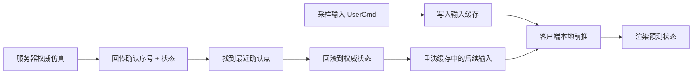
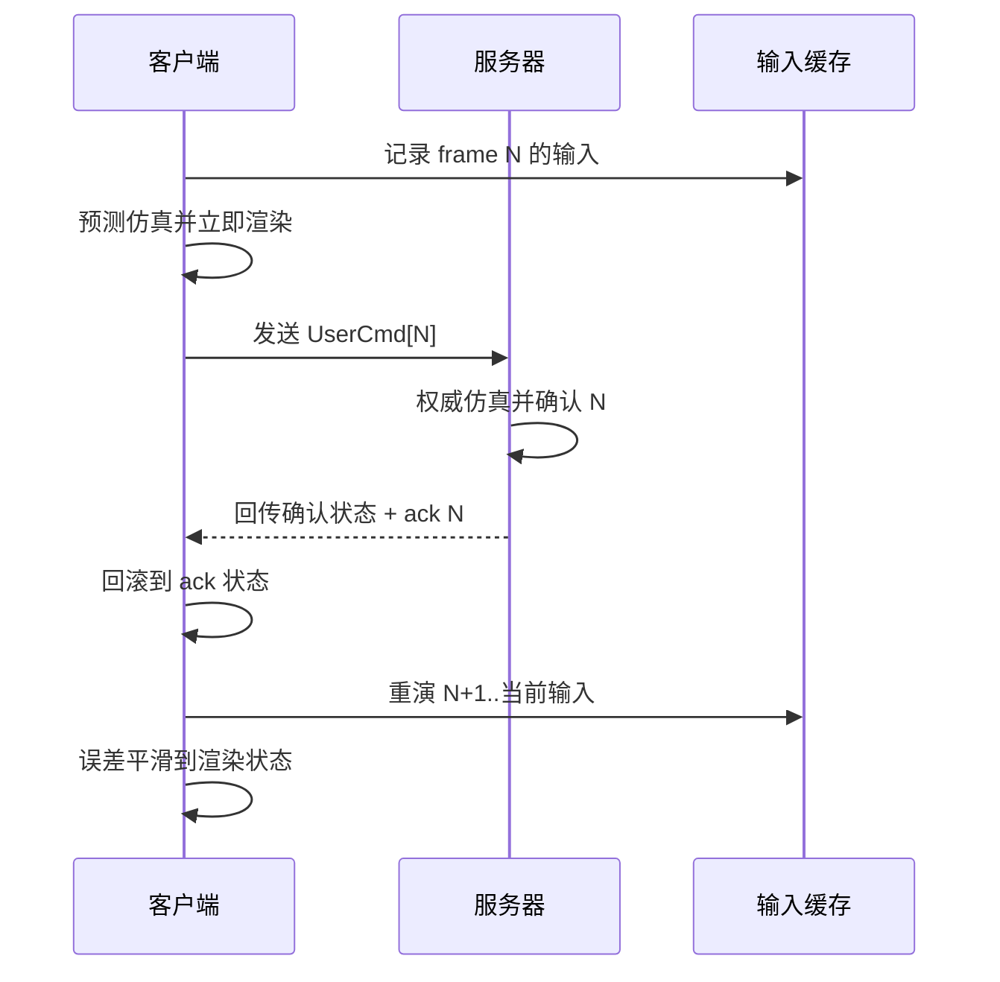

---
title: "游戏与引擎算法 13｜客户端预测与服务器回滚"
slug: "algo-13-client-prediction-rollback"
date: "2026-04-17"
description: "从 QuakeWorld 到现代网络运动系统：客户端预测、服务器校正、状态重演、输入缓存与误差平滑。"
tags:
  - "客户端预测"
  - "服务器回滚"
  - "QuakeWorld"
  - "输入缓存"
  - "状态重演"
  - "误差平滑"
  - "网络同步"
  - "快节奏射击"
series: "游戏与引擎算法"
weight: 1813
---

> **读这篇之前**：建议先看 [无锁 Ring Buffer：SPSC]() 和 [无锁队列：MPMC 与 CAS]()。本篇的输入缓存、快照回放和回滚队列，工程上都和这两篇的循环缓冲、单调序列有关。

一句话本质：客户端预测不是“自己瞎跑”，而是客户端先按本地输入提前模拟，等服务器把权威结果发回来后，再把差异回滚、重演、平滑掉。

## 问题动机

在射击、动作、赛车这类快节奏游戏里，按下前进键却要等一个往返延迟才动起来，体验会直接坏掉。这个坏掉不是“有点慢”，而是“角色像被胶水粘住”。

如果所有移动都等服务器确认，客户端就只是一个远程终端。只要 ping 上去，操作手感就会被网络往返时间吞掉。问题不是网络慢，而是玩家不该为自己的本地操作支付整整一圈 RTT。

客户端预测的目标，是把“自己按键后的即时反馈”留在本地；服务器的目标，是保持权威性和一致性。两者看起来冲突，实际上靠重演就能兼容：客户端先乐观执行，服务器后裁决，裁决不一致时再修正。

## 历史背景

这条路线的起点通常被追到 QuakeWorld。John Carmack 在发布前公开说过，他允许客户端“guess at the results of the users movement until the authoritative response from the server comes through”。这句话的工程含义很直接：客户端必须知道摩擦、重力、碰撞等一部分模拟细节。

Quake 之前的网络模型更像“哑客户端”。客户端发输入，服务器算完再回传，结果是所有本地动作都得等一趟回合。QuakeWorld 把移动模拟前移到客户端，FPS 的手感才真正摆脱了高延迟的拖沓。

Glenn Fiedler 后来在 Gaffer on Games 上把这套思路写得更清楚：先用服务器驱动状态，再把客户端自己的输入缓存起来，收到修正后从旧的权威状态重放这些输入。这套方法后来成了网络动作游戏的标准模板。

## 数学与理论基础

客户端预测的核心不是“猜中未来”，而是“让状态演化尽量接近确定性”。

设玩家状态为 $x_t$，输入为 $u_t$，离散仿真函数为：

$$
x_{t+1} = f(x_t, u_t)
$$

若客户端和服务器对同一组输入使用同一组物理规则，那么理论上它们应得到相同轨迹。现实里因为浮点误差、碰撞分支、帧率差异、输入到达顺序不同，轨迹会偏离，于是需要校正：

$$
\Delta_t = x_t^{srv} - x_t^{cli}
$$

如果误差太小，可以直接平滑：

$$
x_t^{render} = x_t^{cli} + \alpha \Delta_t, \quad 0 < \alpha < 1
$$

如果误差太大，就不能只做插值，否则角色会一直“漂”。这时要回滚到最近一次服务器确认的状态 $x_k^{srv}$，然后把本地缓存的输入 $u_{k+1}, \dots, u_t$ 重新跑一遍：

$$
x_t^{replay} = f(\cdots f(f(x_k^{srv}, u_{k+1}), u_{k+2}) \cdots, u_t)
$$

这套模型的关键是“输入比状态更便宜”。你可以缓存几十帧输入，再按需重算状态；但你不能把每一帧的完整世界状态都长期同步一份，否则带宽和内存都会先死。

## 算法推导

客户端预测系统一般拆成四个层次。

第一层是输入采样。每帧把按键、鼠标、摇杆封装成 `UserCmd`，附带序号和时间戳，丢进本地环形缓冲。

第二层是本地前推。客户端用最新状态和最新输入做一次完整仿真，得到立即可渲染的预测状态。

第三层是服务器裁决。服务器收到输入后，以权威规则推进状态，并把确认过的序号和状态回传。

第四层是回滚重演。客户端找到最后一个已确认输入序号，恢复对应状态，把后续输入重新模拟一遍，再把误差通过位置/速度平滑掩掉。

这里最容易出错的是“只修最后一帧”。如果你只把当前状态往服务器状态拉一下，后面仍然叠着错误输入，下一帧就会重新歪回去。正确做法是修正起点，再把中间所有输入重演一遍。

## 结构图





## C# 实现

下面的实现把客户端预测拆成了三个对象：`UserCmd`、可重放状态 `PlayerState`、以及负责回滚和重演的 `PredictionController`。它是 2D 化的，但逻辑和 FPS / 动作游戏是同构的。

```csharp
using System;
using System.Collections.Generic;

public readonly record struct UserCmd(int Sequence, float Dt, float MoveX, float MoveY, bool Jump);

public struct PlayerState
{
    public float X;
    public float Y;
    public float VX;
    public float VY;
    public bool OnGround;

    public PlayerState Clone() => this;
}

public sealed class PredictionController
{
    private readonly Dictionary<int, UserCmd> _pendingCmds = new();
    private readonly Dictionary<int, PlayerState> _stateHistory = new();
    private PlayerState _current;
    private int _lastAckSequence = -1;

    public PlayerState Current => _current;

    public void SeedFromServer(PlayerState authoritativeState, int ackSequence)
    {
        _current = authoritativeState;
        _lastAckSequence = ackSequence;
        _stateHistory[ackSequence] = authoritativeState.Clone();

        // 清理已确认输入，避免无限增长。
        var remove = new List<int>();
        foreach (var seq in _pendingCmds.Keys)
            if (seq <= ackSequence)
                remove.Add(seq);
        foreach (var seq in remove)
            _pendingCmds.Remove(seq);
    }

    public PlayerState PredictAndCache(UserCmd cmd)
    {
        _pendingCmds[cmd.Sequence] = cmd;
        _current = Simulate(_current, cmd);
        _stateHistory[cmd.Sequence] = _current.Clone();
        return _current;
    }

    public void ApplyServerCorrection(PlayerState authoritativeState, int ackSequence)
    {
        SeedFromServer(authoritativeState, ackSequence);
        ReplayFrom(ackSequence);
    }

    public PlayerState GetSmoothedRenderState(float smoothing)
    {
        if (_lastAckSequence < 0)
            return _current;

        if (!_stateHistory.TryGetValue(_lastAckSequence, out var serverState))
            return _current;

        var deltaX = _current.X - serverState.X;
        var deltaY = _current.Y - serverState.Y;

        _current.X = Lerp(serverState.X, _current.X, smoothing);
        _current.Y = Lerp(serverState.Y, _current.Y, smoothing);
        _current.VX = serverState.VX;
        _current.VY = serverState.VY;

        // 这里保留当前状态作为最终渲染态；平滑只针对可见误差，不改输入历史。
        return _current;
    }

    private void ReplayFrom(int ackSequence)
    {
        var seq = ackSequence + 1;
        while (_pendingCmds.TryGetValue(seq, out var cmd))
        {
            _current = Simulate(_current, cmd);
            _stateHistory[seq] = _current.Clone();
            seq++;
        }
    }

    private static PlayerState Simulate(PlayerState s, UserCmd cmd)
    {
        const float moveSpeed = 6.0f;
        const float gravity = 18.0f;
        const float jumpSpeed = 7.5f;

        s.VX = cmd.MoveX * moveSpeed;
        if (s.OnGround)
            s.VY = cmd.MoveY * moveSpeed;
        else
            s.VY -= gravity * cmd.Dt;

        if (cmd.Jump && s.OnGround)
        {
            s.VY = jumpSpeed;
            s.OnGround = false;
        }

        s.X += s.VX * cmd.Dt;
        s.Y += s.VY * cmd.Dt;

        if (s.Y <= 0)
        {
            s.Y = 0;
            s.VY = 0;
            s.OnGround = true;
        }

        return s;
    }

    private static float Lerp(float a, float b, float t) => a + (b - a) * Math.Clamp(t, 0f, 1f);
}
```

这个实现里最重要的点不是“能跑”，而是它保留了三条链：输入缓存、状态历史、服务器确认序号。少一条，回滚就断。

## 复杂度分析

单次本地预测是 $O(1)$。

服务器回包后的重演，最坏情况是把未确认的所有输入重放一遍，复杂度是 $O(k)$，其中 $k$ 是未确认输入的数量。`k` 直接受 RTT 和本地帧率影响：ping 越高、帧率越高，缓存越长，重演次数越多。

空间复杂度也是 $O(k)$。你需要保留未确认输入和必要的状态快照，才能从确认点重演到当前帧。

## 变体与优化

最常见的优化有四个。

第一，输入序号必须单调，且最好和 tick 对齐。否则你很难在服务器确认和客户端缓存之间找到同一个时间点。

第二，状态修正不要总是硬跳。位置、朝向这类可见量通常做指数平滑，速度、角速度这类导数量直接同步。Gaffer 的建议也很明确：平滑位置，直接同步速度。

第三，预测与执行要尽量共用同一套移动代码。Half-Life / Source 系里的经典做法，就是把一部分移动逻辑放在共享代码里，减少客户端和服务器之间的分叉。

第四，只有玩家自己控制的对象才适合强预测。对象交互越复杂，和其他实体的耦合越强，预测错误就越难平滑。

## 对比其他算法

| 方案 | 优点 | 缺点 | 适用场景 |
|---|---|---|---|
| 纯服务器权威 | 简单、绝对一致 | 手感差 | 低频策略、回合制 |
| 客户端预测 + 校正 | 手感好、仍保留权威 | 需要回滚和重演 | FPS、动作、赛车 |
| 纯 rollback | 反馈最直接 | 强依赖确定性 | 格斗、对战、确定性模拟 |
| 状态同步 + 插值 | 容易做、容错好 | 本地输入不够跟手 | 非玩家主控实体 |

## 批判性讨论

客户端预测最容易被神化成“零延迟”。不是。它只是把等待服务器确认的那一段，先用本地仿真填上。

如果本地和服务器的仿真分叉太大，你还是会看到回弹。尤其是碰撞、门、可破坏物、复杂移动平台这些东西，哪怕只差一个碰撞分支，重演后也可能明显跳动。

它还有一个设计层面的副作用：你越依赖预测，就越要求模拟可复现。也就是说，代码越“工程化地分层”，反而越难把那些隐藏副作用混进来。这个要求很苛刻，但它也是系统稳定的关键。

## 跨学科视角

客户端预测本质上是控制理论里的前馈加反馈。前馈部分是本地输入驱动的预测，反馈部分是服务器校正。你可以把回滚看成离散控制系统里的状态观测修正。

它也像编译器里的增量重算。你先跑一版不等外部依赖的结果，外部确认回来之后，只从受影响的节点重放。区别只是这里的“外部依赖”是网络输入，而不是 AST 或缓存。

## 真实案例

- Gaffer on Games 的 *What Every Programmer Needs To Know About Game Networking* 和 *Networked Physics (2004)* 都把客户端预测、输入缓存、重演和误差平滑讲得很清楚，并明确指出它源自 QuakeWorld。见 [What Every Programmer Needs To Know About Game Networking](https://www.gafferongames.com/post/what_every_programmer_needs_to_know_about_game_networking/) 与 [Networked Physics (2004)](https://www.gafferongames.com/post/networked_physics_2004/)。
- Valve 的《Latency Compensating Methods in Client/Server In-game Protocol Design and Optimization》明确描述了客户端预测、回滚重放和服务器权威的关系。见 [Source Multiplayer Networking](https://developer.valvesoftware.com/wiki/Source_Multiplayer_Networking) 与 [Yahn Bernier 2001 文档](https://developer.valvesoftware.com/wiki/Latency_Compensating_Methods_in_Client/Server_In-game_Protocol_Design_and_Optimization)。
- GGPO 官方站点直接把 rollback 描述为“先预测本地输入，若远端输入迟到则从分歧点重新模拟”。见 [GGPO](https://www.ggpo.net/)。
- Epic 的 Network Prediction 插件文档显示，Unreal 5 也在用显式的网络预测缓冲和回滚式状态管理，`TNetworkPredictionBuffer` 就是其循环缓冲核心。见 [TNetworkPredictionBuffer](https://dev.epicgames.com/documentation/en-us/unreal-engine/API/Plugins/NetworkPrediction/TNetworkPredictionBuffer) 与 [FNetworkPredictionModelDef](https://dev.epicgames.com/documentation/en-us/unreal-engine/API/Plugins/NetworkPrediction/FNetworkPredictionModelDef%3Fapplication_version%3D5.0)。

## 量化数据

Valve 的 Source 文档默认把插值时间设在 100ms 左右；这意味着即使不谈预测，客户端本地看到的世界也会天然滞后一个插值窗口。Gaffer 也指出，在 50fps、100ms RTT 的例子里，客户端往往会缓存大约 5 个尚未确认的命令用于重演。

GGPO 官方文档把 rollback 的目标概括成“zero-input latency networking”。这不代表网络真的零延迟，而是本地输入到反馈之间的感知延迟尽可能被隐藏。它的代价是回滚重演次数会随着延迟增加而上升。

## 常见坑

1. 服务器和客户端没有共享同一套移动逻辑。错因是本地仿真永远对不上权威结果。改法是抽出共享的可复现移动代码。
2. 只缓存输入不缓存确认点。错因是回滚时没有起点，重演无从开始。改法是同时缓存最近确认状态和未确认输入。
3. 把每次误差都硬拉回去。错因是角色会抽搐。改法是小误差平滑，大误差回滚重演。
4. 输入序号和 tick 不对齐。错因是服务端 ack 和客户端缓存没法稳定匹配。改法是统一时间基准。
5. 把所有对象都做强预测。错因是复杂交互会把误差放大到不可控。改法是只对本地拥有者强预测。

## 何时用 / 何时不用

适合用：玩家主控角色、动作射击、赛车、平台跳跃、需要立刻响应的本地输入。

不适合用：纯服务器结算的回合制、非常不确定且难以重演的复杂物理、大量非拥有对象、对确定性要求极高但引擎不可控的场景。

## 相关算法

- [帧同步 vs 状态同步]()
- [Snapshot Interpolation]()
- [延迟补偿]()
- [无锁 Ring Buffer：SPSC]()

## 小结

客户端预测把“等待服务器确认”的时间藏进了本地仿真；回滚和重演则把权威性拉了回来。两者合在一起，才是现代动作游戏手感的底座。

这套方法的本质不是作弊式的乐观，而是把误差管理成一等公民：输入要缓存，状态要可重放，误差要可平滑，时间线要可回滚。能把这四件事做干净，网络游戏的操作感会立刻上一个台阶。

## 参考资料

- [What Every Programmer Needs To Know About Game Networking](https://www.gafferongames.com/post/what_every_programmer_needs_to_know_about_game_networking/)
- [Networked Physics (2004)](https://www.gafferongames.com/post/networked_physics_2004/)
- [Source Multiplayer Networking](https://developer.valvesoftware.com/wiki/Source_Multiplayer_Networking)
- [Latency Compensating Methods in Client/Server In-game Protocol Design and Optimization](https://developer.valvesoftware.com/wiki/Latency_Compensating_Methods_in_Client/Server_In-game_Protocol_Design_and_Optimization)
- [GGPO](https://www.ggpo.net/)
- [TNetworkPredictionBuffer](https://dev.epicgames.com/documentation/en-us/unreal-engine/API/Plugins/NetworkPrediction/TNetworkPredictionBuffer)
- [FNetworkPredictionModelDef](https://dev.epicgames.com/documentation/en-us/unreal-engine/API/Plugins/NetworkPrediction/FNetworkPredictionModelDef%3Fapplication_version%3D5.0)
