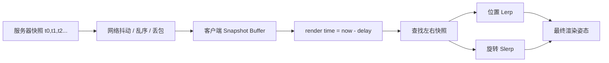
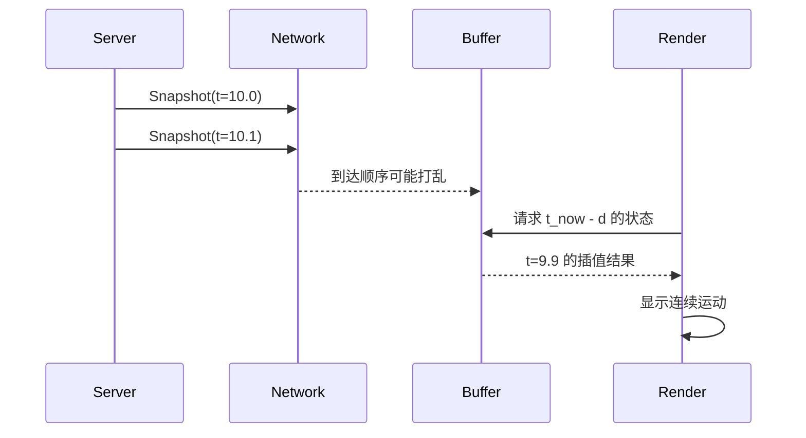

---
title: "游戏与引擎算法 14｜Snapshot Interpolation"
slug: "algo-14-snapshot-interpolation"
date: "2026-04-17"
description: "讲透 snapshot buffer、插值延迟、抖动缓冲、位置与旋转插值，以及丢包时外推的边界。"
tags:
  - "Snapshot Interpolation"
  - "状态同步"
  - "抖动缓冲"
  - "插值"
  - "外推"
  - "网络同步"
  - "Mirror"
  - "Valve"
series: "游戏与引擎算法"
weight: 1814
---

一句话本质：Snapshot Interpolation 不是“把位置变平滑”，而是把网络收到的离散快照，放进一个带时间轴的缓冲区，再在客户端用固定延迟重建连续运动。

> 读这篇之前：建议先看 [帧同步 vs 状态同步]()、[客户端预测与服务器回滚]() 和 [可靠 UDP：KCP、QUIC]()。这篇只讲“状态流如何在客户端被重建”，不讲完整的输入回滚链路。

## 问题动机

网络同步最常见的失败，不是“数据没到”，而是“数据到了，但时间不对”。
服务器通常按固定 tick 发快照，客户端却按显示刷新率渲染。两者之间还叠着抖动、乱序、丢包和负载波动。

如果客户端一收到包就立刻应用，画面会跟着包的到达节奏一跳一跳地抖。
如果只等最新包，角色会一直卡在旧位置，像冻住一样。

Snapshot Interpolation 的做法是折中：故意落后服务器一点点，换来一个稳定的插值窗口。
这个窗口越大，越能吃掉抖动；但延迟也越大。

## 历史背景

Gaffer on Games 在 2014 年系统化讲了 snapshot interpolation，把它变成游戏网络里的标准套路之一。
Valve 的 Source 引擎更早把它写成“interpolation”机制，用插值缓冲来对抗 jitter 和 packet loss。

后来 Mirror 把它抽成独立 C# 类 `SnapshotInterpolation.cs`，说明这件事已经从“某个项目里的技巧”变成“可复用的同步内核”。
这条演进线很重要：越多人在线，越不能指望包准时到；越不能准时到，越需要一个明确的缓冲与重建策略。

## 数学基础

设服务器以时间戳 `t_i` 发送快照 `S_i = (p_i, q_i, v_i)`，其中 `p` 是位置，`q` 是旋转，`v` 是速度或角速度的估计。
客户端在渲染时刻 `t_now` 不直接使用最新快照，而是构造一个渲染时间：

$$
t_r = t_{now} - d
$$

其中 `d` 是插值延迟。若服务器发送间隔为 `\Delta_s`，网络抖动上界为 `J`，则工程上通常需要：

$$
d \ge \Delta_s + J
$$

对于位置，线性插值为：

$$
p(u) = (1-u)p_a + u p_b,\quad u = \frac{t_r - t_a}{t_b - t_a}
$$

对于旋转，四元数应使用球面插值：

$$
q(u) = \operatorname{slerp}(q_a, q_b, u)
$$

如果 `t_r` 已经过了最后一个快照 `t_n`，就进入外推区。
外推只适合短时间兜底，不适合长期运动重建。

## 算法推导

快照插值可以拆成四步。

第一步，接收端按服务器时间戳把快照放进有序缓冲。
乱序包不能直接覆盖新状态，因为它可能比当前缓冲里的数据更旧。

第二步，确定当前渲染时间 `t_r`。
客户端每帧都用 `t_now - d` 去“追”服务器，而不是让画面追网络。

第三步，找到夹住 `t_r` 的两个快照。
如果缓冲里有 `t_a <= t_r <= t_b`，就用 `u` 做位置插值、用 `slerp` 做旋转插值。

第四步，处理边界。
如果只剩一个快照，就保持最后状态，或者短时间外推。
如果缓冲快见底，就把渲染时间稍微往后追一点，直到重新回到目标缓冲长度。

这就是 Mirror 文档里说的“buffer 太大要 catch up”的本质：
不是重算网络，而是慢慢恢复到目标延迟。

## 结构图





## C# 实现

下面的实现是一个足够自洽的核心版本：它维护一个按时间排序的快照缓冲，支持位置和旋转插值，并在短暂缺包时做有限外推。

```csharp
using System;
using System.Collections.Generic;
using UnityEngine;

public sealed class SnapshotInterpolation
{
    public struct Snapshot
    {
        public double Time;
        public Vector3 Position;
        public Quaternion Rotation;
        public Vector3 Velocity;
    }

    private readonly List<Snapshot> _buffer = new List<Snapshot>(32);
    private readonly double _bufferDelay;
    private readonly double _maxExtrapolationTime;

    public SnapshotInterpolation(double bufferDelaySeconds = 0.15, double maxExtrapolationTimeSeconds = 0.25)
    {
        if (bufferDelaySeconds <= 0) throw new ArgumentOutOfRangeException(nameof(bufferDelaySeconds));
        if (maxExtrapolationTimeSeconds < 0) throw new ArgumentOutOfRangeException(nameof(maxExtrapolationTimeSeconds));
        _bufferDelay = bufferDelaySeconds;
        _maxExtrapolationTime = maxExtrapolationTimeSeconds;
    }

    public void AddSnapshot(Snapshot snapshot)
    {
        int index = _buffer.BinarySearch(snapshot, SnapshotTimeComparer.Instance);
        if (index >= 0)
        {
            _buffer[index] = snapshot;
            return;
        }

        _buffer.Insert(~index, snapshot);
        TrimOldSnapshots(snapshot.Time - 2.0);
    }

    public bool TryEvaluate(double now, out Vector3 position, out Quaternion rotation)
    {
        position = default;
        rotation = default;

        if (_buffer.Count == 0)
            return false;

        double renderTime = now - _bufferDelay;
        if (_buffer.Count == 1)
        {
            Snapshot only = _buffer[0];
            double dt = renderTime - only.Time;
            if (dt > 0 && dt <= _maxExtrapolationTime)
            {
                position = only.Position + only.Velocity * (float)dt;
                rotation = only.Rotation;
                return true;
            }

            position = only.Position;
            rotation = only.Rotation;
            return true;
        }

        int upper = FindFirstSnapshotAfter(renderTime);
        if (upper <= 0)
        {
            Snapshot latest = _buffer[0];
            position = latest.Position;
            rotation = latest.Rotation;
            return true;
        }

        if (upper >= _buffer.Count)
        {
            Snapshot b = _buffer[_buffer.Count - 1];
            double dt = renderTime - b.Time;
            if (dt > 0 && dt <= _maxExtrapolationTime)
            {
                position = b.Position + b.Velocity * (float)dt;
                rotation = b.Rotation;
                return true;
            }

            position = b.Position;
            rotation = b.Rotation;
            return true;
        }

        Snapshot left = _buffer[upper - 1];
        Snapshot right = _buffer[upper];
        double span = right.Time - left.Time;
        if (span <= 1e-9)
        {
            position = right.Position;
            rotation = right.Rotation;
            return true;
        }

        float u = (float)((renderTime - left.Time) / span);
        u = Mathf.Clamp01(u);
        position = Vector3.Lerp(left.Position, right.Position, u);
        rotation = Quaternion.Slerp(left.Rotation, right.Rotation, u);
        return true;
    }

    private int FindFirstSnapshotAfter(double time)
    {
        int lo = 0;
        int hi = _buffer.Count;
        while (lo < hi)
        {
            int mid = lo + (hi - lo) / 2;
            if (_buffer[mid].Time <= time)
                lo = mid + 1;
            else
                hi = mid;
        }
        return lo;
    }

    private void TrimOldSnapshots(double keepAfterTime)
    {
        while (_buffer.Count > 2 && _buffer[0].Time < keepAfterTime)
            _buffer.RemoveAt(0);
    }

    private sealed class SnapshotTimeComparer : IComparer<Snapshot>
    {
        public static readonly SnapshotTimeComparer Instance = new SnapshotTimeComparer();
        public int Compare(Snapshot x, Snapshot y) => x.Time.CompareTo(y.Time);
    }
}
```

这个版本刻意保留了最关键的工程边界。
它不尝试无限外推，也不把旋转硬塞成欧拉角差值。

## 复杂度分析

插入快照的复杂度是 `O(log n + n)`，因为二分查找是 `O(log n)`，`List.Insert` 需要搬移元素。
如果你改成环形缓冲加近似有序输入，插入可以逼近 `O(1)`。

评估当前帧是 `O(log n)` 查找加 `O(1)` 插值。
内存复杂度是 `O(B)`，其中 `B` 是缓冲中的快照数，通常由 `bufferDelay / sendInterval` 决定。

## 变体与优化

常见优化有三类。

第一类是自适应缓冲：网络越抖，`bufferDelay` 越大；网络越稳，延迟越小。
第二类是速度辅助插值：如果快照里带了速度，就能在非线性运动中减少停顿感。
第三类是分量分离：位置、旋转、缩放可以采用不同采样率和不同平滑参数。

更激进的做法是 Hermite 或 Catmull-Rom 插值。
它们可以在给定速度时把轨迹做得更顺，但也更依赖正确的导数和更稳定的采样。

## 对比其他算法

| 算法 | 目标 | 优点 | 代价 |
|---|---|---|---|
| Snapshot Interpolation | 平滑状态同步 | 稳定、简单、对抖动友好 | 额外延迟 |
| 客户端预测 / 回滚 | 降低本地输入延迟 | 手感更即时 | 复杂度高，状态重演成本大 |
| 纯锁步 | 保持强一致 | 决定性强 | 对延迟和丢包最敏感 |
| 直接状态覆盖 | 实现最简单 | 代码短 | 画面抖动明显 |

## 批判性讨论

Snapshot Interpolation 不是万能药。
它的前提是“看见的是状态，不是输入”，所以它解决的是视觉连续性，不是交互因果。

如果你的玩法强依赖击中判定、近战判定或高速转向，纯插值会让本地响应显得迟钝。
如果你的对象经常 teleport、瞬移、切场景，强行插值只会把错误轨迹画得更长。

## 跨学科视角

它和音频领域的 jitter buffer 很像。
语音通话不会把每个包到达的时间当成播放时间，而是先攒一点缓冲，再按稳定节奏播出去。

游戏里的状态同步也是同一个逻辑：
先承认网络有抖动，再用小幅延迟换稳定输出。

## 真实案例

- [Mirror Snapshot Interpolation](https://mirror-networking.gitbook.io/docs/manual/components/network-transform/snapshot-interpolation) 直接把算法抽成独立 C# 实现，并说明了 buffer time multiplier、测试模拟和 catch-up 行为。
- [Valve Developer Community: Interpolation](https://developer.valvesoftware.com/wiki/Interpolation) 说明了 Source 引擎如何用插值缓冲来对抗 jitter 和 packet loss。
- [Valve Developer Community: Prediction](https://developer.valvesoftware.com/wiki/Prediction) 用来区分“插值显示”和“预测本地输入”，这两者不是一回事。
- [Gaffer on Games: Snapshot Interpolation](https://gafferongames.com/post/snapshot_interpolation/) 给出了这条路线的经典网络时序分析。
- [Unity Network Transform](https://docs.unity3d.com/ja/2022.3/Manual/class-NetworkTransform.html) 是 Unity 旧网络栈里最容易对照的同步入口。

## 量化数据

Gaffer 文章里给过一个很直观的量级：如果以 10Hz 发快照，最低插值延迟就是 100ms；考虑抖动后，更实用的下限会到 150ms 左右，遇到连续丢包还可能膨胀到 250ms 到 350ms。

Mirror 的文档也直接给出经验值：总缓冲时间通常按 `sendInterval * Buffer Time Multiplier` 计算，常见建议是 3 倍。
这组数字说明了一件事：你不是在“消灭延迟”，而是在“设计可控的延迟”。

## 常见坑

- 把最新快照直接画出来。这样会把网络抖动原封不动地映射到屏幕上，结果就是抖。
- 用欧拉角线性插值。旋转会在跨越 180 度时出问题，最少也会走错路径。
- 外推太久。速度只要不是常量，误差就会迅速放大。
- 不按时间戳排序。乱序包一旦覆盖新状态，客户端会出现反向跳跃。

## 何时用 / 何时不用

适合用在状态同步、观众回放、远端玩家位置展示、低频快照的连续显示。
不适合用在输入必须立即反馈的本地角色控制、强交互格斗判定、瞬移非常频繁的对象。

## 相关算法

- [帧同步 vs 状态同步]()
- [客户端预测与服务器回滚]()
- [Delta Compression]()
- [可靠 UDP：KCP、QUIC]()
- [设计模式教科书｜Pipeline / Pipes and Filters：让数据按阶段流动]()

## 小结

Snapshot Interpolation 的核心不是“插值公式”，而是时间管理。
你先给客户端一个稳定的观察点，再让状态沿着这个观察点重建，最后把抖动、乱序和短丢包都收进缓冲里。

它付出的代价是延迟。
但对大多数在线游戏来说，稳定的 100ms 往往比抖动的 30ms 更可控。

## 参考资料

- [Gaffer on Games: Snapshot Interpolation](https://gafferongames.com/post/snapshot_interpolation/)
- [Gaffer on Games: Snapshot Compression](https://gafferongames.com/post/snapshot_compression/)
- [Mirror: Snapshot Interpolation](https://mirror-networking.gitbook.io/docs/manual/components/network-transform/snapshot-interpolation)
- [Valve Developer Community: Interpolation](https://developer.valvesoftware.com/wiki/Interpolation)
- [Valve Developer Community: Prediction](https://developer.valvesoftware.com/wiki/Prediction)
- [Unity Network Transform](https://docs.unity3d.com/ja/2022.3/Manual/class-NetworkTransform.html)
