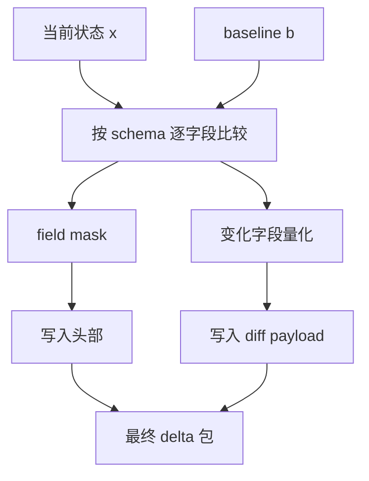
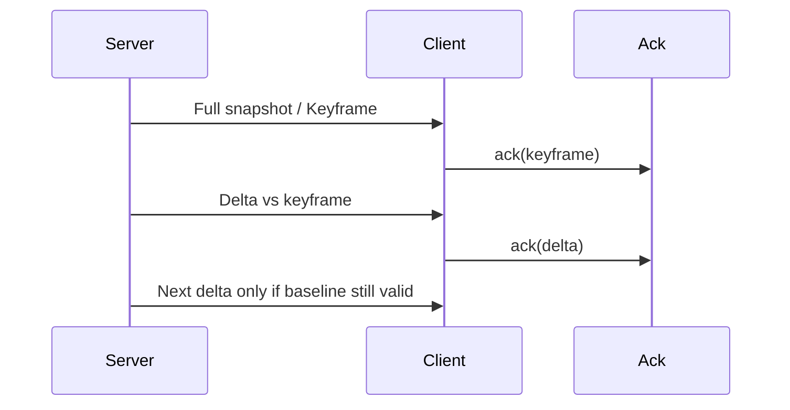

---
title: "游戏与引擎算法 15｜Delta Compression"
slug: "algo-15-delta-compression"
date: "2026-04-17"
description: "讲清 baseline、field mask、schema、state diff、压缩率，以及 CPU 和带宽之间的取舍。"
tags:
  - "Delta Compression"
  - "状态同步"
  - "带宽优化"
  - "字段掩码"
  - "序列化"
  - "网络压缩"
  - "Photon"
  - "Unreal Iris"
series: "游戏与引擎算法"
weight: 1815
---

一句话本质：Delta Compression 不是把整包“压缩一下”，而是用 schema 描述状态结构，再只发送相对 baseline 发生变化的那一小部分。

> 读这篇之前：建议先看 [Snapshot Interpolation]()、[帧同步 vs 状态同步]() 和 [可靠 UDP：KCP、QUIC]()。这篇关注的是“怎么少发”，不是“怎么重放”。

## 问题动机

在线游戏最贵的资源之一，不是算力，而是每秒要发多少字节。
状态同步如果每次都把完整对象树、完整位置、完整动画、完整 Buff 都发出去，很快就会撞上带宽预算。

可现实里，大部分对象在大部分时刻都没变。
门可能没开，血量可能没动，某些子状态可能整个帧都静止。
Delta Compression 的意义，就是利用这个“多数没变”的事实。

## 历史背景

早期网络游戏就已经在做“当前状态相对上一状态”的变化编码，只是实现常常很粗。
Gaffer on Games 在 *Snapshot Compression* 里把 baseline、delta 和量化讲得足够工程化，之后 Mirror、Photon、Unreal Iris 才把它做成了正式的复制框架。

这条演进的本质是：带宽便宜了，但实时同步对象更多了。
于是压缩不再只是“可选优化”，而成了协议设计的一部分。

## 数学基础

设状态向量为 `x = (x_1, x_2, ..., x_n)`，baseline 为 `b`。
字段级差异集合可以写成：

$$
D = \{ i \mid |x_i - b_i| > \varepsilon_i \}
$$

编码后的包大小近似为：

$$
B_{delta} = B_{header} + B_{schema} + B_{mask} + \sum_{i \in D} B_i
$$

压缩率：

$$
 r = 1 - \frac{B_{delta}}{B_{full}}
$$

所以 delta 压缩真正依赖的是两件事：字段的稳定性，以及 schema 是否能让“没变”的字段完全不出现在 payload 里。

## 算法推导

Delta Compression 通常分三层。

第一层是 schema。
schema 定义字段顺序、类型、量化方式和默认值。
没有 schema，就不知道哪个 bit 代表哪个字段，也不知道如何做版本兼容。

第二层是 field mask。
每个字段比较当前值和 baseline，如果变化超过阈值，就把对应 bit 置 1。
mask 的意义不是压缩本身，而是让接收端知道“后面哪些字段要读”。

第三层是 state diff。
只有被 mask 选中的字段才真正写入流。
如果字段类型是位置、角度、生命值、状态枚举，就分别用不同的量化策略和写入宽度。

baseline 的选择很重要。
最稳的 baseline 不是“上一个发出的快照”，而是“对端已经确认收到的最后一个快照”。
否则一旦丢包，delta 会失真。

## 结构图





## C# 实现

下面的实现展示一个小而完整的 delta codec。
它支持 schema、字段掩码、量化写入和按 baseline 重建。

```csharp
using System;
using System.IO;
using UnityEngine;

public sealed class DeltaCompressionDemo
{
    [Flags]
    public enum StateMask : ushort
    {
        None      = 0,
        Position  = 1 << 0,
        Rotation  = 1 << 1,
        Velocity  = 1 << 2,
        Health    = 1 << 3,
        Ammo      = 1 << 4,
        Flags     = 1 << 5
    }

    public struct EntityState
    {
        public Vector3 Position;
        public Quaternion Rotation;
        public Vector3 Velocity;
        public float Health;
        public ushort Ammo;
        public byte Flags;
    }

    public sealed class Schema
    {
        public readonly float PositionQuant = 0.01f;
        public readonly float VelocityQuant = 0.01f;
        public readonly float HealthQuant = 0.1f;
    }

    public static void WriteDelta(BinaryWriter writer, Schema schema, EntityState baseline, EntityState current)
    {
        StateMask mask = StateMask.None;
        if ((current.Position - baseline.Position).sqrMagnitude > schema.PositionQuant * schema.PositionQuant) mask |= StateMask.Position;
        if (Quaternion.Dot(current.Rotation, baseline.Rotation) < 1f - 0.0001f) mask |= StateMask.Rotation;
        if ((current.Velocity - baseline.Velocity).sqrMagnitude > schema.VelocityQuant * schema.VelocityQuant) mask |= StateMask.Velocity;
        if (Mathf.Abs(current.Health - baseline.Health) > schema.HealthQuant) mask |= StateMask.Health;
        if (current.Ammo != baseline.Ammo) mask |= StateMask.Ammo;
        if (current.Flags != baseline.Flags) mask |= StateMask.Flags;

        writer.Write((ushort)mask);
        if (mask.HasFlag(StateMask.Position)) WriteQuantizedVector3(writer, current.Position, schema.PositionQuant);
        if (mask.HasFlag(StateMask.Rotation)) WriteQuantizedQuaternion(writer, current.Rotation);
        if (mask.HasFlag(StateMask.Velocity)) WriteQuantizedVector3(writer, current.Velocity, schema.VelocityQuant);
        if (mask.HasFlag(StateMask.Health)) writer.Write((short)Mathf.RoundToInt(current.Health / schema.HealthQuant));
        if (mask.HasFlag(StateMask.Ammo)) writer.Write(current.Ammo);
        if (mask.HasFlag(StateMask.Flags)) writer.Write(current.Flags);
    }

    public static EntityState ReadDelta(BinaryReader reader, Schema schema, EntityState baseline)
    {
        StateMask mask = (StateMask)reader.ReadUInt16();
        EntityState current = baseline;
        if (mask.HasFlag(StateMask.Position)) current.Position = ReadQuantizedVector3(reader, schema.PositionQuant);
        if (mask.HasFlag(StateMask.Rotation)) current.Rotation = ReadQuantizedQuaternion(reader);
        if (mask.HasFlag(StateMask.Velocity)) current.Velocity = ReadQuantizedVector3(reader, schema.VelocityQuant);
        if (mask.HasFlag(StateMask.Health)) current.Health = reader.ReadInt16() * schema.HealthQuant;
        if (mask.HasFlag(StateMask.Ammo)) current.Ammo = reader.ReadUInt16();
        if (mask.HasFlag(StateMask.Flags)) current.Flags = reader.ReadByte();
        return current;
    }

    private static void WriteQuantizedVector3(BinaryWriter writer, Vector3 value, float q)
    {
        writer.Write((short)Mathf.RoundToInt(value.x / q));
        writer.Write((short)Mathf.RoundToInt(value.y / q));
        writer.Write((short)Mathf.RoundToInt(value.z / q));
    }

    private static Vector3 ReadQuantizedVector3(BinaryReader reader, float q)
    {
        return new Vector3(reader.ReadInt16() * q, reader.ReadInt16() * q, reader.ReadInt16() * q);
    }

    private static void WriteQuantizedQuaternion(BinaryWriter writer, Quaternion q)
    {
        if (q.w < 0f) { q.x = -q.x; q.y = -q.y; q.z = -q.z; q.w = -q.w; }
        writer.Write((short)Mathf.RoundToInt(q.x * short.MaxValue));
        writer.Write((short)Mathf.RoundToInt(q.y * short.MaxValue));
        writer.Write((short)Mathf.RoundToInt(q.z * short.MaxValue));
        writer.Write((short)Mathf.RoundToInt(q.w * short.MaxValue));
    }

    private static Quaternion ReadQuantizedQuaternion(BinaryReader reader)
    {
        Quaternion q = new Quaternion(
            reader.ReadInt16() / (float)short.MaxValue,
            reader.ReadInt16() / (float)short.MaxValue,
            reader.ReadInt16() / (float)short.MaxValue,
            reader.ReadInt16() / (float)short.MaxValue);
        return q.normalized;
    }
}
```

## 复杂度分析

编码复杂度是 `O(n)`，其中 `n` 是 schema 中的字段数。
解码复杂度也是 `O(n)`，但只会对 mask 置位的字段真正读 payload。

空间复杂度通常接近 `O(1)`。
如果 schema 固定且字段顺序稳定，mask 写法就很省内存。

## 变体与优化

常见变体有四种。

第一种是定期 keyframe：每隔几帧发一次完整快照，防止 delta 链条过长。
第二种是层级 diff：先比较对象是否变化，再比较字段是否变化。
第三种是按字段分组：位置、旋转、动画、Buff 分开编码，减少无关字段混入。
第四种是再叠一层 entropy coding，例如 LZ4 或 Huffman，但前提是 CPU 预算足够。

## 对比其他算法

| 方法 | 优点 | 缺点 | 适合场景 |
|---|---|---|---|
| 全量状态发送 | 最稳，解码简单 | 带宽最高 | 小对象、低频率 |
| Delta Compression | 带宽低，结构清晰 | baseline 依赖强 | 状态同步、多人对象 |
| 通用压缩（LZ4 / zstd） | 对重复字节有效 | 不理解语义字段 | 大块二进制或归档 |
| 事件流编码 | 对离散变化最省 | 难重建完整状态 | 日志、输入流、技能事件 |

## 批判性讨论

Delta Compression 很容易被误用成“只要压缩就更好”。
但它的收益来自语义差异，不来自字节熵本身。

如果对象几乎每帧都在大幅变化，delta 会接近全量发送，甚至因为 mask 和 baseline 维护而更慢。
如果 schema 经常变，版本兼容和回退策略也会比你想的难。

## 跨学科视角

它和版本控制的 diff、文件同步的增量补丁很像。
先有一个基线，再记录变化，最后在另一端重建。

也像列式存储里的稀疏更新。
很多列在很多行上都不变，所以只记录变动列才划算。

## 真实案例

- [Gaffer on Games: Snapshot Compression](https://gafferongames.com/post/snapshot_compression/) 是游戏网络里讲 delta 压缩最经典的公开材料之一。
- [Mirror: Serialization](https://mirror-networking.gitbook.io/docs/manual/guides/serialization) 解释了 Weaver 如何生成读写函数，是字段级差分编码的工程入口。
- [Mirror: SyncVars](https://mirror-networking.gitbook.io/docs/manual/guides/synchronization/syncvars) 展示了服务器到客户端的增量状态同步。
- [Photon Realtime: Serialization in Photon](https://doc.photonengine.com/realtime/current/reference/serialization-in-photon) 说明了 Photon 的二进制协议和自定义序列化。
- [Unreal Iris: Replication State Descriptor](https://dev.epicgames.com/documentation/en-us/unreal-engine/replication-state-descriptor) 和 [Replication Protocol](https://dev.epicgames.com/documentation/en-us/unreal-engine/replication-protocol) 把“状态描述 + 复制格式”做成了显式数据结构。

## 量化数据

Gaffer 在 *Snapshot Compression* 里把 10Hz 快照的插值延迟算得很直观：基础延迟就是 100ms，再加抖动安全边际后会更高。
同一条链路里，delta compression 是为了解决“频繁发快照导致带宽失控”的问题。

Mirror 的文档也直接说，开启更细粒度的位打包和 delta compression 后，带宽会显著下降。
这说明工程实践里，delta 不是可选修饰，而是多人同步里的基础设施。

## 常见坑

- baseline 选错。拿“自己本地最后一次发送”当基线，一丢包就全线漂移。
- schema 没版本号。字段一增一删，旧客户端会把后面的 bit 全读歪。
- 浮点直接做 bit 比较。微小误差会把本来没变的字段当成变化。
- 只追求低带宽，不算 CPU。差分、量化和重建都要算帧预算。

## 何时用 / 何时不用

适合用在状态同步、复制协议、实体属性更新、快照下发、可重建的离散状态。
不适合用在每帧都全量重写的短生命周期对象，或者字段结构极不稳定的临时协议。

## 相关算法

- [Snapshot Interpolation]()
- [可靠 UDP：KCP、QUIC]()
- [帧同步 vs 状态同步]()
- [延迟补偿]()
- [浮点精度与数值稳定性]()

## 小结

Delta Compression 的本质是“围绕 schema 发送变化”。
它靠 baseline 减少重复，靠 field mask 降低无效负载，靠量化把带宽换成可控误差。

一旦 baseline、schema 和量化策略设计好，状态同步的带宽和 CPU 就都能落到可预期的范围内。

## 参考资料

- [Gaffer on Games: Snapshot Compression](https://gafferongames.com/post/snapshot_compression/)
- [Gaffer on Games: Reliable Ordered Messages](https://gafferongames.com/post/reliable_ordered_messages/)
- [Mirror: Serialization](https://mirror-networking.gitbook.io/docs/manual/guides/serialization)
- [Mirror: SyncVars](https://mirror-networking.gitbook.io/docs/manual/guides/synchronization/syncvars)
- [Photon Realtime: Serialization in Photon](https://doc.photonengine.com/realtime/current/reference/serialization-in-photon)
- [Unreal Iris: Replication State Descriptor](https://dev.epicgames.com/documentation/en-us/unreal-engine/replication-state-descriptor)
- [Unreal Iris: Replication Protocol](https://dev.epicgames.com/documentation/en-us/unreal-engine/replication-protocol)
