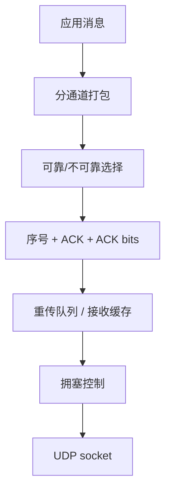
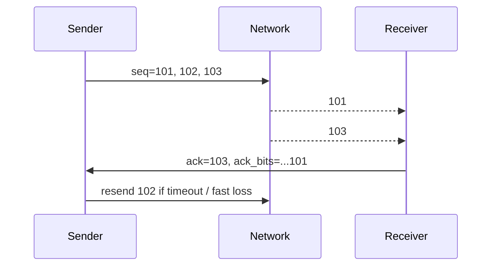

---
title: "游戏与引擎算法 16｜可靠 UDP：KCP、QUIC"
slug: "algo-16-reliable-udp"
date: "2026-04-17"
description: "讲清 ACK、ARQ、拥塞控制、KCP 与 QUIC 的边界，以及为什么可靠 UDP 不是把 TCP 重新写一遍。"
tags:
  - "可靠UDP"
  - "KCP"
  - "QUIC"
  - "ARQ"
  - "ACK"
  - "拥塞控制"
  - "ENet"
  - "Photon"
series: "游戏与引擎算法"
weight: 1816
---

一句话本质：Reliable UDP 不是“UDP 变成 TCP”，而是在 UDP 之上补上游戏真正需要的那部分可靠性、顺序性和节流策略，同时保留不可靠通道给实时状态。

> 读这篇之前：建议先看 [Snapshot Interpolation]()、[Delta Compression]()、[帧同步 vs 状态同步]() 和 [客户端预测与服务器回滚]()。这篇讲的是传输层，不是玩法层。

## 问题动机

TCP 的语义太强，游戏的语义太杂。
游戏里既有必须可靠到达的命令、道具、匹配结果，也有“丢一两帧没关系”的位置、动画和传感器数据。

如果把所有数据都放进 TCP，丢包时的 head-of-line blocking 会把最新状态卡在旧包后面。
如果完全裸 UDP，又没有重传、排序、拥塞控制、分片和流量整形，协议很快就会在真实网络里崩掉。

Reliable UDP 的目标，就是在两者之间找一条中间路：
可靠，但只可靠该可靠的；
有序，但只在需要有序的通道上有序；
拥塞控制存在，但不会把应用全局都绑死成一个 stream。

## 历史背景

Gaffer on Games 很早就把游戏网络协议的核心问题讲透了：我们想要的是 packet-based transport，不是可靠有序字节流。
后来开发者们把“可靠消息 + 不可靠状态”的想法落实成各种 UDP 协议栈，ENet 是其中最经典的早期代表之一，KCP 是更轻、更偏算法实现的一支。

QUIC 则把这条路线标准化了。
它不是“游戏协议专用库”，而是现代安全传输协议，但它的多路复用、ACK、恢复和拥塞控制都对游戏网络很有参考价值。

## 数学基础

Reliable UDP 的核心，不是某个花哨公式，而是三个最基础的状态量：
序号、确认和重传窗口。

设发送包序号为 `seq`，接收方回传最近收到的 `ack`，再加一个 32 位位图 `ack_bits`。
若 `ack_bits` 的第 `k` 位为 1，则表示 `ack-k` 已收到。

这类编码的价值在于把一段历史确认压进一个字段里。
Gaffer 的做法里，ack_bits 让同一个确认信息在多次发包中反复出现，抗丢包能力会明显提高。

再往上是 ARQ。
Selective Repeat 的基本思想是：只重传没确认的包，不必像 Go-Back-N 那样把后面全部重来。
它的代价是 sender 和 receiver 都要维护窗口和缓存，换来的好处是带宽更省、延迟更稳。

拥塞控制则是在“能不能发”之外再加一层“该发多少”。
QUIC 的恢复机制由 RFC 9002 定义，KCP 则把拥塞窗口、快速重传和 RTT 平滑做成轻量算法。

## 算法推导

一个实用的可靠 UDP 协议一般分成四层。

第一层是 packet header。
最少要有 `sequence`、`ack`、`ack_bits`，通常还会有 `channel`、`flags`、`payload length`。

第二层是 send buffer。
每个已发未确认的包都留在缓冲里，直到 ACK 到达。
超时后重发，或者在快速重传条件满足时提前重发。

第三层是 receive buffer。
乱序到达的包先缓存，等前面的序号齐了再按序交给上层。
如果包是“不要求有序”的，就直接走旁路。

第四层是 congestion control。
它决定每个 tick 最多发多少、是否要退让、是否要按 RTT 调整节奏。

KCP 和 ENet 都可以看作“UDP 上的可靠消息层”。
QUIC 则更像“带安全、多路复用、恢复、拥塞控制的现代传输协议”。
这也是边界所在：KCP 适合做轻量、可嵌入的游戏传输层；QUIC 适合做标准化、跨场景的通用传输。

## 结构图





## C# 实现

下面是一个“游戏消息级”可靠 UDP 核心，演示序号、ACK 位图、发送缓冲和超时重传。
它不是完整的 QUIC，也不是完整的 KCP，但能把可靠消息层的骨架讲清楚。

```csharp
using System;
using System.Collections.Generic;

public sealed class ReliableUdpSession
{
    public struct Packet
    {
        public ushort Sequence;
        public ushort Ack;
        public uint AckBits;
        public byte Channel;
        public byte[] Payload;
    }

    private sealed class PendingPacket
    {
        public Packet Packet;
        public double SentAt;
        public int Retries;
    }

    private readonly Dictionary<ushort, PendingPacket> _sendWindow = new Dictionary<ushort, PendingPacket>(4096);
    private readonly Dictionary<ushort, Packet> _recvBuffer = new Dictionary<ushort, Packet>(4096);

    private ushort _nextSequence = 1;
    private ushort _highestReceived = 0;
    private uint _receivedBits = 0;
    private ushort _nextDeliver = 1;

    public double RtoSeconds { get; set; } = 0.25;

    public Packet CreatePacket(byte channel, byte[] payload, double now)
    {
        var packet = new Packet
        {
            Sequence = _nextSequence++,
            Ack = _highestReceived,
            AckBits = _receivedBits,
            Channel = channel,
            Payload = payload ?? Array.Empty<byte>()
        };

        _sendWindow[packet.Sequence] = new PendingPacket { Packet = packet, SentAt = now };
        return packet;
    }

    public void RegisterReceived(Packet packet)
    {
        if (SeqMoreRecent(packet.Sequence, _highestReceived))
        {
            int shift = SeqDelta(packet.Sequence, _highestReceived);
            _receivedBits = shift >= 32 ? 1u : (_receivedBits << shift) | 1u;
            _highestReceived = packet.Sequence;
        }
        else
        {
            int delta = SeqDelta(_highestReceived, packet.Sequence);
            if (delta > 0 && delta <= 32)
                _receivedBits |= 1u << (delta - 1);
        }

        _recvBuffer[packet.Sequence] = packet;
    }

    public bool TryDeliverNext(out Packet packet)
    {
        if (_recvBuffer.TryGetValue(_nextDeliver, out packet))
        {
            _recvBuffer.Remove(_nextDeliver);
            _nextDeliver++;
            return true;
        }

        packet = default;
        return false;
    }

    public List<Packet> Tick(double now)
    {
        var resend = new List<Packet>();
        foreach (var kv in _sendWindow)
        {
            PendingPacket pending = kv.Value;
            if (now - pending.SentAt >= RtoSeconds)
            {
                pending.SentAt = now;
                pending.Retries++;
                resend.Add(pending.Packet);
            }
        }
        return resend;
    }

    public void AckRemote(ushort ack, uint ackBits)
    {
        var toRemove = new List<ushort>();
        foreach (var kv in _sendWindow)
        {
            if (IsAcked(kv.Key, ack, ackBits))
                toRemove.Add(kv.Key);
        }

        foreach (ushort seq in toRemove)
            _sendWindow.Remove(seq);
    }

    private static bool IsAcked(ushort seq, ushort ack, uint ackBits)
    {
        if (seq == ack) return true;
        int delta = SeqDelta(ack, seq);
        if (delta <= 0 || delta > 32) return false;
        return (ackBits & (1u << (delta - 1))) != 0;
    }

    private static bool SeqMoreRecent(ushort s1, ushort s2)
    {
        return (s1 > s2 && s1 - s2 <= ushort.MaxValue / 2) ||
               (s2 > s1 && s2 - s1 > ushort.MaxValue / 2);
    }

    private static int SeqDelta(ushort newer, ushort older)
    {
        return (newer - older + 65536) % 65536;
    }
}
```

这个实现故意只做“游戏最常见的那部分”。
更完整的协议还要加 MTU 探测、拥塞窗口、流优先级、分片重组和统计采样。

## 复杂度分析

按当前写法，发送和 ACK 处理的平均复杂度接近 `O(1)` 到 `O(w)`，其中 `w` 是未确认窗口大小。
如果改成环形缓冲和定长窗口，常见路径可以压到近似 `O(1)`。

空间复杂度是 `O(w)`，窗口越大，乱序和重传容错越强，但内存和恢复成本也越高。

## 变体与优化

常见变体有四类。

第一类是消息可靠、通道不可靠：把输入、状态、事件拆开，避免所有包都被最慢的消息拖住。
第二类是选择性重传：只重发缺失包，不重放整个窗口。
第三类是拥塞友好：结合 RTT、丢包率和带宽采样主动降速。
第四类是多流/多通道：不同语义的数据不共享同一条有序队列。

## 对比其他算法

| 协议 / 算法 | 优点 | 缺点 | 适合场景 |
|---|---|---|---|
| TCP | 成熟、通用 | Head-of-line blocking 明显 | 通用字节流 |
| ENet | 轻量、适合游戏消息 | 功能比 QUIC 少 | 游戏自定义协议 |
| KCP | 实现短、延迟友好 | 需要自己补安全与路由 | 嵌入式 RUDP 层 |
| QUIC | 安全、多路复用、标准化 | 实现和栈更重 | 通用高性能传输 |

## 批判性讨论

Reliable UDP 最容易被写错成“TCP 的小游戏版”。
这会导致两个错误：一是把所有消息都强制可靠有序，二是把可靠、拥塞、加密、路由混成一个不可拆的黑盒。

游戏协议真正需要的是语义分层。
输入和事件可以可靠，位置和姿态可以不可靠；有序只在需要时启用；丢包恢复要服务于玩法，而不是服务于协议洁癖。

## 跨学科视角

它本质上是 ARQ 族协议在实时交互场景里的改造。
通信原理里熟悉的 selective repeat、ACK 轮询、重传定时器，到了游戏里要再加上“最新状态比旧状态更重要”的时间偏好。

这也解释了为什么游戏网络既像网络工程，又像实时系统调度。
它不是把包送到就结束，而是要在合适的时间送到合适的语义层。

## 真实案例

- [KCP 官方仓库](https://github.com/skywind3000/kcp) 是最典型的游戏向可靠 UDP 实现之一，README 直接给出了延迟和带宽的权衡说明。
- [ENet 官方仓库](https://github.com/lsalzman/enet) 是早期经典的可靠 UDP 库，明确提供可靠、有序、分片等基础能力。
- [IETF RFC 9000: QUIC](https://www.ietf.org/rfc/rfc9000.html)、[RFC 9001](https://www.ietf.org/rfc/rfc9001.html) 和 [RFC 9002](https://www.rfc-editor.org/rfc/rfc9002.html) 是 QUIC 的原始标准入口。
- [Photon Realtime Intro](https://doc.photonengine.com/realtime/current/getting-started/realtime-intro) 和 [Serialization in Photon](https://doc.photonengine.com/realtime/current/reference/serialization-in-photon) 说明了可靠与不可靠消息如何在同一系统里共存。
- [Mirror: Ignorance Transport](https://mirror-networking.gitbook.io/docs/manual/transports/ignorance) 明确把 ENet 作为其可靠 UDP 传输层基础。
- [Unity Transport](https://docs.unity3d.com/cn/2023.1/Manual/com.unity.transport.html) 是 Unity 官方的低层网络传输入口。
- [Unreal Replicated Object Execution Order](https://dev.epicgames.com/documentation/en-us/unreal-engine/replicated-object-execution-order-in-unreal-engine) 解释了 Unreal 对可靠和不可靠复制语义的区分。

## 量化数据

KCP 仓库 README 里给出的最常引用数据是：在 10% 到 20% 的额外带宽成本下，平均延迟可降低 30% 到 40%，最大延迟可降低约三倍。
这正是游戏网络会接受它的原因：不是免费午餐，而是更适合实时玩法的折中。

Gaffer 在 *Reliable Ordered Messages* 里还解释了 ACK 位图的价值：一个 ACK 不只确认当前包，还能把历史 ACK 一起带上，实战中相当于把同一确认信息重复多次，抗丢包能力会明显提高。

## 常见坑

- 把可靠 UDP 写成 TCP 克隆。结果就是所有状态都被可靠有序拖慢，实时性没了。
- 不做拥塞控制。局域网里也许能跑，一上公网就会把丢包和排队放大。
- 忽略 MTU 和分片。大包一旦碎裂，重传和抖动都会恶化。
- 把可靠通道和高频状态混在一起。位置包应该大多是不可靠的。

## 何时用 / 何时不用

适合用在游戏消息层、实时对战、房间状态、RPC、匹配、技能结果、少量可靠事件。
不适合把它当成通用文件传输、后台队列、日志系统或完整替代 TCP 的工具。

## 相关算法

- [Snapshot Interpolation]()
- [Delta Compression]()
- [帧同步 vs 状态同步]()
- [客户端预测与服务器回滚]()
- [设计模式教科书｜Actor Model：把并发和分布式交给消息，而不是锁]()

## 小结

Reliable UDP 的重点不是“可靠”，而是“可靠到什么程度”。
游戏真正需要的是一层能区分语义、能承受抖动、能按需重传、能和不可靠状态共存的传输层。

KCP、ENet、Photon、Unity Transport 和 QUIC 走的是不同路径，但目标都很清楚：
别让最新的数据，等在最旧的数据后面。

## 参考资料

- [KCP 官方仓库](https://github.com/skywind3000/kcp)
- [ENet 官方仓库](https://github.com/lsalzman/enet)
- [IETF RFC 9000: QUIC](https://www.ietf.org/rfc/rfc9000.html)
- [IETF RFC 9001: Using TLS to Secure QUIC](https://www.ietf.org/rfc/rfc9001.html)
- [RFC 9002: QUIC Loss Detection and Congestion Control](https://www.rfc-editor.org/rfc/rfc9002.html)
- [Gaffer on Games: Reliable Ordered Messages](https://gafferongames.com/post/reliable_ordered_messages/)
- [Gaffer on Games: UDP vs TCP](https://www.gafferongames.com/post/udp_vs_tcp/)
- [Photon Realtime Intro](https://doc.photonengine.com/realtime/current/getting-started/realtime-intro)
- [Photon Realtime: Performance Tips](https://doc.photonengine.com/realtime/current/reference/performance-tips)
