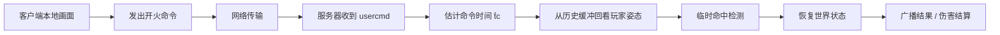
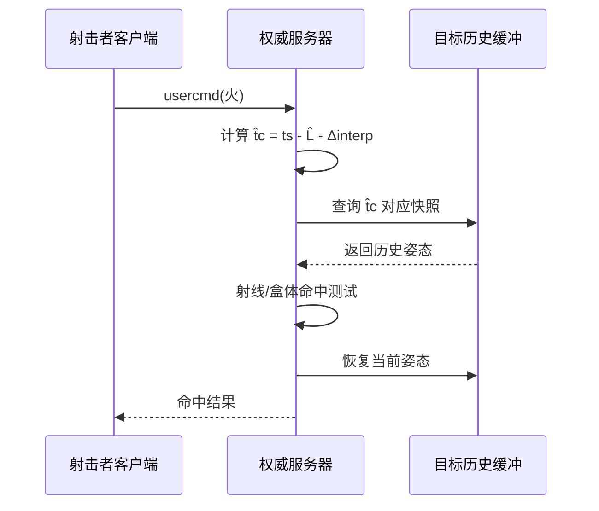

---
title: "游戏与引擎算法 17｜延迟补偿"
slug: "algo-17-lag-compensation"
date: "2026-04-17"
description: "从 Source 式服务器回看命中到插值缓冲、公平性与 peekers advantage：解释延迟补偿为什么必要、怎么做、做到什么程度就该停。"
tags:
  - "延迟补偿"
  - "服务器回看"
  - "Source"
  - "命中判定"
  - "插值缓冲"
  - "peekers advantage"
  - "网络射击"
  - "回滚"
series: "游戏与引擎算法"
weight: 1817
---

> **读这篇之前**：建议先看 [客户端预测与服务器回滚]() 和 [无锁 Ring Buffer：SPSC]()。本篇依赖输入时间戳、历史快照和循环缓冲的思路。

一句话本质：延迟补偿不是“服务器帮你作弊”，而是服务器把世界回放到玩家开火那一刻，再按那一刻的几何关系判断命中。

## 问题动机

如果只按服务器收到命令的那一帧判定命中，枪口明明对着人，服务器却说没中。这个错不是射线算法错了，而是判定时刻错了。

在高延迟对局里，玩家看到的是“过去”的画面。移动目标在客户端被插值，开火命令却要过一段时间才能到服务器。等服务器收到命令，目标早就跑开了。

延迟补偿要解决的，不是“让网络变快”，而是“让判定时刻对齐到玩家当时看到的世界”。这就是 Source 式 rewind 的核心。

## 历史背景

这条路线在 Valve 的 Source 体系里被系统化了。Source 开发文档把 lag compensation 定义成：服务器在执行当前 user command 之前，先根据玩家延迟和客户端插值，把其他玩家回退到命令产生时的历史位置，再执行命中检测。

Gaffer on Games 早年把这个问题讲得很直白：客户端预测解决的是“自己动起来慢”，而延迟补偿解决的是“我明明打中了却判没中”。两者对应不同的时序错位，不能混为一谈。

GGPO 虽然主攻的是 rollback netcode，但它把“先接受输入，再在更正确的时间轴上重算”的思想推到了更极致。延迟补偿和 rollback 不是一回事，但它们共享同一个直觉：时间轴必须可重放。

## 数学与理论基础

把服务器当前时刻记为 $t_s$，玩家命令生成时刻记为 $\hat t_c$。命中判定真正该看的，不是 $t_s$ 的世界，而是 $\hat t_c$ 的世界：

$$
\hat t_c = t_s - \hat L_{oneway} - \Delta_{interp}
$$

其中 $\hat L_{oneway}$ 是单程网络时延的估计值，$\Delta_{interp}$ 是客户端渲染缓冲导致的视图滞后。Source 文档明确指出，插值会影响 lag compensation，服务器必须把它算进去。

如果客户端按固定帧率发送输入，服务器会维护时间有序的历史快照序列：

$$
H = \{S(t_0), S(t_1), \dots, S(t_n)\}, \quad t_0 < t_1 < \cdots < t_n
$$

对任意命中检测对象 $p$，服务器需要从历史中插值出 $S_p(\hat t_c)$。线性插值在时间足够短时成立：

$$
x(\hat t_c) = (1-\alpha)x_i + \alpha x_{i+1}, \qquad
\alpha = \frac{\hat t_c - t_i}{t_{i+1} - t_i}
$$

但位置插值不等于公平。只要客户端仍在显示过去的画面，开火那一瞬间看到的目标和服务器判定时刻的目标就不一致。延迟补偿只是把判定对齐，不会消灭这种不一致。

## 算法推导

最直接的想法是：把所有玩家每帧位置都存在服务器上，收到射击命令后回到那一刻，重放所有玩家姿态，再做一次射线检测。

这个想法对，但太粗。完整世界回放成本高，而且不必要。大多数射击命中只需要还原“可被命中的角色碰撞体”，而不是地形、投射物、粒子或布料。

所以工程上通常分三层：

1. 记录每个可命中实体的历史姿态。
2. 根据射击命令估计命中时间点。
3. 只回看相关实体，做临时碰撞测试，然后恢复现场状态。

这和数据库的 MVCC 很像。读操作拿到的是某个时间点的一致快照，不会因为并发写入而改变结果。延迟补偿做的也是“时间旅行读”。

Source 的关键是把插值延迟算进去。若客户端渲染比服务器慢了 $\Delta_{interp}$，那么玩家瞄准的不是“最新服务器状态”，而是“比最新状态更早的状态”。不补这个偏移，就会系统性偏向防守方。

## 结构图 / 流程图





## C# 实现

下面的实现保留了生产系统的核心边界：只回看玩家历史，不重算整个世界；只回看有限窗口；命中测试完成后必须恢复现场。

```csharp
using System;
using System.Collections.Generic;
using System.Numerics;

public sealed class LagCompensationServer
{
    private readonly Dictionary<int, TemporalHistory<PlayerSnapshot>> _players = new();
    private readonly float _maxHistorySeconds;

    public LagCompensationServer(float maxHistorySeconds = 1.0f)
    {
        if (maxHistorySeconds <= 0f) throw new ArgumentOutOfRangeException(nameof(maxHistorySeconds));
        _maxHistorySeconds = maxHistorySeconds;
    }

    public void RegisterPlayer(int playerId)
    {
        if (_players.ContainsKey(playerId)) return;
        _players[playerId] = new TemporalHistory<PlayerSnapshot>(256);
    }

    public void RecordSnapshot(int playerId, in PlayerSnapshot snapshot)
    {
        if (!_players.TryGetValue(playerId, out var history))
            throw new InvalidOperationException($"Unknown player {playerId}.");

        history.Push(snapshot);
        history.PruneOlderThan(snapshot.ServerTimeSeconds - _maxHistorySeconds);
    }

    public ShotResult ProcessShot(ShotCommand cmd, IReadOnlyList<int> targetPlayerIds)
    {
        if (cmd.ServerReceiveTimeSeconds <= 0f) throw new ArgumentOutOfRangeException(nameof(cmd));

        float rewindTime = cmd.ServerReceiveTimeSeconds - cmd.EstimatedOneWayLatencySeconds - cmd.InterpolationDelaySeconds;
        if (rewindTime < 0f) rewindTime = 0f;

        var rewound = new List<(int playerId, PlayerSnapshot current)>(targetPlayerIds.Count);

        foreach (int playerId in targetPlayerIds)
        {
            if (!_players.TryGetValue(playerId, out var history) || history.Count == 0)
                continue;

            var current = history.Latest;
            rewound.Add((playerId, current));

            if (history.TrySample(rewindTime, out var historical))
                history.OverwriteLatest(historical);
        }

        try
        {
            foreach (int playerId in targetPlayerIds)
            {
                if (!_players.TryGetValue(playerId, out var history) || history.Count == 0)
                    continue;

                var sample = history.Latest;
                if (IntersectsShot(cmd.RayOrigin, cmd.RayDirection, sample.HitSphere))
                {
                    return new ShotResult(true, playerId, rewindTime);
                }
            }

            return new ShotResult(false, null, rewindTime);
        }
        finally
        {
            foreach (var (playerId, current) in rewound)
            {
                _players[playerId].OverwriteLatest(current);
            }
        }
    }

    private static bool IntersectsShot(Vector3 origin, Vector3 direction, BoundingSphere sphere)
    {
        Vector3 d = Vector3.Normalize(direction);
        Vector3 m = origin - sphere.Center;
        float b = Vector3.Dot(m, d);
        float c = Vector3.Dot(m, m) - sphere.Radius * sphere.Radius;

        if (c > 0f && b > 0f) return false;

        float discr = b * b - c;
        return discr >= 0f;
    }
}

public readonly record struct ShotCommand(
    float ServerReceiveTimeSeconds,
    float EstimatedOneWayLatencySeconds,
    float InterpolationDelaySeconds,
    Vector3 RayOrigin,
    Vector3 RayDirection);

public readonly record struct ShotResult(bool Hit, int? PlayerId, float RewindTimeSeconds);

public readonly record struct PlayerSnapshot(
    float ServerTimeSeconds,
    BoundingSphere HitSphere);

public readonly record struct BoundingSphere(Vector3 Center, float Radius);

public sealed class TemporalHistory<T> where T : struct
{
    private readonly T[] _items;
    private readonly float[] _times;
    private int _head;
    private int _count;

    public TemporalHistory(int capacity)
    {
        if (capacity < 2) throw new ArgumentOutOfRangeException(nameof(capacity));
        _items = new T[capacity];
        _times = new float[capacity];
    }

    public int Count => _count;

    public T Latest
    {
        get
        {
            if (_count == 0) throw new InvalidOperationException("History is empty.");
            int idx = (_head - 1 + _items.Length) % _items.Length;
            return _items[idx];
        }
    }

    public void Push(in T value)
    {
        float time = ExtractTime(value);
        _items[_head] = value;
        _times[_head] = time;
        _head = (_head + 1) % _items.Length;
        if (_count < _items.Length) _count++;
    }

    public void PruneOlderThan(float cutoffTime)
    {
        while (_count > 0 && _times[OldestIndex] < cutoffTime)
        {
            OldestPop();
        }
    }

    public bool TrySample(float timeSeconds, out T value)
    {
        value = default;
        if (_count == 0) return false;

        if (timeSeconds <= _times[OldestIndex])
        {
            value = _items[OldestIndex];
            return true;
        }

        int newest = NewestIndex;
        if (timeSeconds >= _times[newest])
        {
            value = _items[newest];
            return true;
        }

        int i0 = OldestIndex;
        for (int n = 0; n < _count - 1; n++)
        {
            int i1 = (i0 + 1) % _items.Length;
            if (_times[i0] <= timeSeconds && timeSeconds <= _times[i1])
            {
                value = Interpolate(_items[i0], _items[i1], _times[i0], _times[i1], timeSeconds);
                return true;
            }
            i0 = i1;
        }

        return false;
    }

    public void OverwriteLatest(in T value)
    {
        if (_count == 0) throw new InvalidOperationException("History is empty.");
        int idx = (_head - 1 + _items.Length) % _items.Length;
        _items[idx] = value;
        _times[idx] = ExtractTime(value);
    }

    private int OldestIndex => (_head - _count + _items.Length) % _items.Length;
    private int NewestIndex => (_head - 1 + _items.Length) % _items.Length;

    private void OldestPop()
    {
        if (_count == 0) return;
        _count--;
    }

    private static T Interpolate(in T a, in T b, float ta, float tb, float t)
    {
        if (typeof(T) == typeof(PlayerSnapshot))
        {
            if (Math.Abs(tb - ta) <= 1e-6f)
                return a;

            var pa = (PlayerSnapshot)(object)a;
            var pb = (PlayerSnapshot)(object)b;
            float alpha = Math.Clamp((t - ta) / (tb - ta), 0f, 1f);

            var blended = new PlayerSnapshot(
                t,
                new BoundingSphere(
                    Vector3.Lerp(pa.HitSphere.Center, pb.HitSphere.Center, alpha),
                    pa.HitSphere.Radius + (pb.HitSphere.Radius - pa.HitSphere.Radius) * alpha));

            return (T)(object)blended;
        }

        return a;
    }

    private static float ExtractTime(in T value)
    {
        if (value is PlayerSnapshot snapshot) return snapshot.ServerTimeSeconds;
        throw new InvalidOperationException("History samples must carry server time.");
    }
}
```

这段代码故意没有把整个玩家刚体世界回放。那是因为延迟补偿的成本控制点不在“全局重模拟”，而在“只对命中对象做时间切片”。

## 复杂度分析

若每次射击只回看 $k$ 个候选目标，历史窗口长度为 $W$，则：

- 记录快照：$O(1)$。
- 查询历史姿态：顺序版 $O(W)$，带时间索引或双端指针可降到近似 $O(1)$ 到 $O(\log W)$。
- 命中测试：$O(k)$，每个目标一次射线/盒体测试。
- 空间：$O(nW)$，$n$ 是被记录的实体数。

Source 公开文档提到历史会保留约 1 秒，这个量级正是为了把空间和回看误差都控制住。

## 变体与优化

最常见的工程优化有四类。

第一类是“只存命中体历史，不存全身世界状态”。角色、背包、武器、粒子都没必要回放。

第二类是“按时间戳二分查找”，把历史采样从线性扫降到对数查找。对高 tick 服务器，这个差异会很明显。

第三类是“限制最大回看时长”。如果某个玩家延迟高到超出历史窗口，服务器宁可拒绝精确回看，也不要把自己拖进无限历史。

第四类是“分命中类型处理”。Hitscan 适合 rewind；慢速弹丸、爆炸和持续伤害，通常需要单独规则，而不是套同一个公式。

## 对比其他方案

| 方案 | 优点 | 缺点 | 适用场景 |
|---|---|---|---|
| 服务器收到时刻直接判定 | 简单 | 高延迟下明显不公平 | 教学原型、低要求游戏 |
| 客户端本地判定 | 手感快 | 易作弊，权威性差 | 单机、弱对抗 |
| Source 式服务器回看 | 公平、成熟 | 需要历史缓冲和时间估计 | FPS、TPS、竞技射击 |
| 完整 rollback | 最一致 | 成本高，依赖确定性 | 格斗、RTS、小规模同步 |

## 批判性讨论

延迟补偿只能修正“命中判定时刻”的错位，不能修正“信息先后到达”的物理事实。也就是说，它可以让服务器承认你打中的人，但不能让你真的比对手更早看到对手。

这就是 peekers advantage 的来源。绕角的人先看到对方，不是因为算法偏袒，而是因为他先离开掩体、先获得视线、再叠加网络和插值优势。服务器回看能缓和这个差异，但不能消灭。

另一个常见误解是“回看越多越公平”。不是。回看过多会让被射击者感觉自己“死在过去”，而不是死在当前世界。公平不是单边追溯到极致，而是找到双方都能接受的时间窗。

## 跨学科视角

延迟补偿最像数据库里的 MVCC 和时间旅行查询。写事务持续推进，读事务却拿到自己需要的旧版本。服务器历史缓冲就是一段按时间切片的版本链。

它也像视频剪辑里的 time-slice 回放。你不需要重新渲染整条时间线，只要回到某个关键帧，检查当时的几何关系，再返回现在。

从系统设计看，这种“临时回滚再恢复”的方法和分布式系统里的补偿事务很接近：先做局部逆操作，再继续主流程。

## 真实案例

Valve 的 Source 文档给了这个算法最清晰的公开定义：服务器记录玩家历史，按 `current time - latency - interpolation` 回到命令产生时刻，再做命中判定。它还明确说明历史缓存约为 1 秒，并提醒插值缓冲必须计入。

Gaffer on Games 在《What Every Programmer Needs To Know About Game Networking》中把命中回看和客户端预测分成两件事，避免把“移动手感”与“命中公平”混为一谈。这种拆分后来几乎成了网络射击的默认架构。

GGPO 的资料虽然面向 rollback，但它公开说明了 speculative execution、预测和重演的基本逻辑。对比它能帮助你看清：延迟补偿是在服务端修正历史，rollback 是把整个游戏逻辑做成可回滚。

Unreal 的 Network Prediction 文档说明了现代引擎已经把历史缓冲、预测缓冲、重演缓冲做成独立组件。它不是 Source 的复刻，但说明工业界已经把“时间缓冲”当成基础设施。

## 量化数据

Source 文档和 Valve 说明里给出的几个量级很关键：

- 默认插值缓冲通常是 100 ms 级别。
- Source 的网络更新常见在 20 Hz 左右，对应约 50 ms 一次 snapshot。
- 服务器历史缓冲通常保留约 1 秒，足够覆盖常见 RTT 和抖动。
- 在 200 ms 人工延迟的演示里，Source 文档展示了客户端看到的碰撞盒和服务器判定位置并不一致。

这些数字说明一件事：延迟补偿不是边角料，而是 FPS 网络栈的核心稳定器。

## 常见坑

第一坑是把 `ServerReceiveTime` 当成命中时间。为什么错：它是包到达时间，不是玩家开火时间。怎么改：估计单程延迟并减去插值缓冲。

第二坑是忘记把插值延迟算进去。为什么错：客户端画面本来就滞后，服务器如果只补 RTT，会系统性偏向防守方。怎么改：把 `Δ_interp` 明确纳入命中时间公式。

第三坑是回看整个世界。为什么错：成本高，而且会把不该参与命中的对象也拉回去。怎么改：只回看可命中实体，并在命中检测结束后恢复。

第四坑是历史窗口太短。为什么错：抖动稍大就查不到正确快照，命中开始变得随机。怎么改：按目标玩家网络分布和 tick rate 设定窗口，通常至少覆盖几百毫秒到约 1 秒。

## 何时用 / 何时不用

适合用在：

- 竞技 FPS/TPS 的 hitscan 武器。
- 需要严肃命中判定的多人对战。
- 服务端权威、客户端只是表现层的架构。

不适合直接照搬到：

- 强物理反馈的慢速弹丸。
- 完全确定性回滚架构的格斗游戏主循环。
- 需要全局因果一致的协同仿真。

## 相关算法

- [帧同步 vs 状态同步]()
- [客户端预测与服务器回滚]()
- [Snapshot Interpolation]()
- [可靠 UDP：KCP、QUIC]()
- [浮点精度与数值稳定性]()

## 小结

延迟补偿的目标不是“让子弹穿越时空”，而是“让判定回到玩家当时看到的世界”。

它只解决一个问题：命中判定的时间轴错位。它不解决渲染延迟，也不消灭 peekers advantage，更不替代客户端预测。

你可以把它当作网络射击的时间索引层。没有这层，服务器只看到到达时刻；有了这层，服务器才能看到玩家开火那一刻。

## 参考资料

- Valve Developer Community: [Latency Compensating Methods in Client/Server In-game Protocol Design and Optimization](https://developer.valvesoftware.com/wiki/Latency_Compensating_Methods_in_Client/Server_In-game_Protocol_Design_and_Optimization)
- Valve Developer Community: [Source Multiplayer Networking](https://developer.valvesoftware.com/wiki/Source_Multiplayer_Networking)
- Valve Developer Community: [Interpolation](https://developer.valvesoftware.com/wiki/Interpolation)
- Gaffer on Games: [What Every Programmer Needs To Know About Game Networking](https://www.gafferongames.com/post/what_every_programmer_needs_to_know_about_game_networking/)
- Gaffer on Games: [Snapshot Interpolation](https://www.gafferongames.com/post/snapshot_interpolation/)
- GGPO: [Rollback Networking SDK](https://www.ggpo.net/)
- Unreal Engine: [TNetworkPredictionBuffer](https://dev.epicgames.com/documentation/en-us/unreal-engine/API/Plugins/NetworkPrediction/TNetworkPredictionBuffer)
- Unreal Engine: [FNetworkPredictionModelDef](https://dev.epicgames.com/documentation/en-us/unreal-engine/API/Plugins/NetworkPrediction/FNetworkPredictionModelDef?application_version=5.0)
