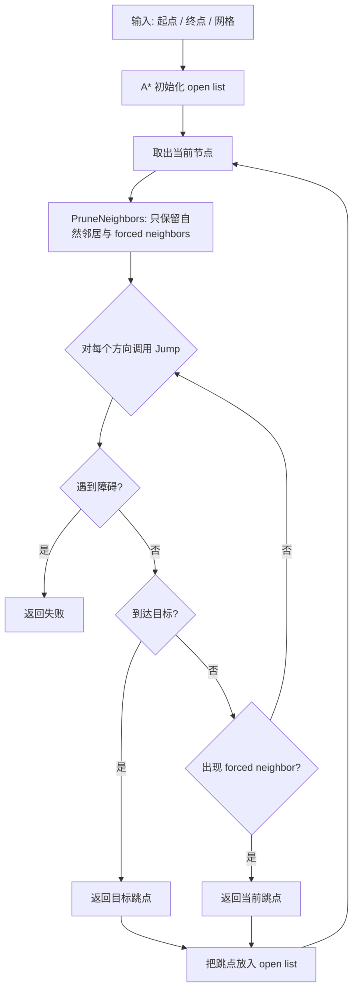
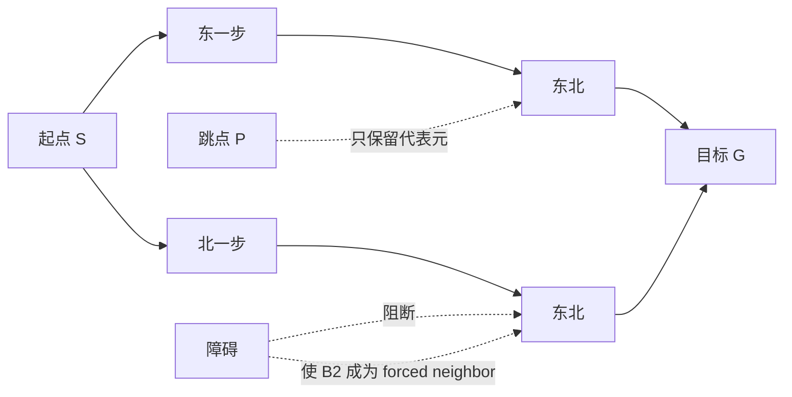

---
title: "游戏与引擎算法 18｜Jump Point Search（JPS）"
slug: "algo-18-jump-point-search"
date: "2026-04-17"
description: "讲透 JPS 如何用对称性剪枝、forced neighbors 和 jump 规则把网格 A* 的冗余扩展砍掉，并给出工程级实现。"
tags:
  - "寻路"
  - "JPS"
  - "A*"
  - "对称性剪枝"
  - "forced neighbor"
  - "网格寻路"
  - "游戏AI"
  - "路径规划"
series: "游戏与引擎算法"
weight: 1818
---

一句话本质：JPS 不是新的最短路定义，而是专门给均匀代价网格做的在线对称性剪枝。它把一串在代价上等价的中间格子跳过去，只保留会改变最优性的跳点。

> 读这篇之前：建议先看 [坐标空间变换全景]() 和 [浮点精度与数值稳定性]()。前者决定网格坐标怎么和世界坐标对齐，后者决定启发式和代价累计不会在大地图上慢慢跑偏。

## 问题动机

网格寻路的麻烦，不在于“找不到路”，而在于“等价的路太多”。
A* 在 4 邻域或 8 邻域网格上跑得正确，但它会把大量只差移动顺序的路径全部展开。

在一条长走廊里，向东再向北，和先向北再向东，可能是同价的；在空旷房间里，很多中间格子只是把同一条最短路径拆成更多步。
A* 不知道这些状态是等价的，只会一个个扩出来。

JPS 的目标很直接：保留最优性，砍掉对称分支。
它不是把搜索变成别的问题，而是把“哪些邻居值得展开”这件事重新定义了一遍。

## 历史背景

JPS 由 Daniel Harabor 和 Alban Grastien 在 2011 年提出，论文题目是 *Online Graph Pruning for Pathfinding on Grid Maps*。
它背后的时代约束很明确：游戏地图越来越大，NPC 查询越来越多，CPU 频率提升却跟不上分支爆炸。

JPS 的关键直觉很朴素：在均匀网格上，很多最短路并不真正不同，只是网格步子的排列顺序不同。
把这些路径视作一个等价类后，搜索树可以只保留代表元。

2014 年，作者又给出 *Improving Jump Point Search*，把在线剪枝进一步做成块级扫描和离线 jump point 预处理。
这说明 JPS 不是一个孤立技巧，而是一条完整的“对称性压缩”路线。

## 数学基础

把网格写成图最清楚。令 $G=(V,E)$ 为一个二维网格图，节点是可走格子，边表示允许的相邻移动。
若允许 8 邻域，直走代价记为 $D$，对角代价记为 $D_2$，通常取 $D=1$、$D_2=\sqrt{2}$。

一条路径 $p=\langle v_0,v_1,\dots,v_k\rangle$ 的总代价是
$$
cost(p)=\sum_{i=0}^{k-1} w(v_i,v_{i+1}).
$$

JPS 依赖的不是新代价，而是路径等价关系。
如果两条路径只是在若干可交换步上顺序不同，并且总代价相同，我们就把它们看成对称路径。
在均匀网格上，横向、纵向和对角移动的组合会产生大量这样的等价路径。

A* 的启发式一般用八方向网格常见的 octile distance：
$$
 h(n)=D\,(|dx|+|dy|)+(D_2-2D)\min(|dx|,|dy|),
$$
其中 $dx,dy$ 是当前节点到目标的坐标差。
只要这个启发式是可采纳的，A* 就保证最优；JPS 也建立在这个前提上。

## 推导：从 A* 到 JPS

A* 的问题不是“搜错了”，而是“搜得太细”。
如果从父节点到当前节点的方向已经确定，那么很多邻居根本不会改变最优解的结构。
JPS 把这些邻居分成两类：

- natural neighbors：沿着当前方向继续走、且不会破坏最优结构的邻居。
- forced neighbors：因为障碍把原本可等价的选择切断了，当前节点被迫成为分叉点的邻居。

这就引出两个核心步骤。

第一步是 `PruneNeighbors`。
它根据父节点方向，只保留自然邻居，再额外补上 forced neighbors。
对称路径的其他分支直接丢弃，因为它们只是把同一条最优路径换一种顺序展开。

第二步是 `Jump`。
从当前方向出发，沿着网格一格一格推进，直到遇到以下三种情况之一：

- 碰到障碍，说明这条射线走到头了；
- 到达目标，直接返回成功；
- 发现 forced neighbor，说明当前位置是新的跳点。

直觉上，jump point 是“这一方向上第一次出现非对称结构的格子”。
在它之前的中间格子都只是直线上的中继，不需要进 open list。

## 规则直觉：forced neighbors 为什么会出现

以向东移动为例。
如果当前格子北侧被挡住，但东北侧可走，那么东北这个方向突然变得“强制相关”。
原因是：不经过当前格子，就无法在保持同等代价的前提下同时满足那个东北分支。

对角移动时也是同样的逻辑。
当你沿东北方向前进时，如果北或东侧的某个障碍切断了某个等价顺序，当前位置就会冒出 forced neighbor。
于是 JPS 不再把它当作普通中间点，而把它升级成跳点。

这个判断本质上是一个“局部最优解唯一性”检测。
如果局部没有新的分叉，继续跳；如果局部最优解开始分裂，停在这里。

## 图示 1：JPS 的工作流



## 图示 2：对称路径与跳点



## 算法实现

下面的实现假设网格是均匀代价、支持 8 邻域、禁止对角穿角。
代码保留了 JPS 最关键的三件事：邻居剪枝、jump、路径回溯。

```csharp
using System;
using System.Collections.Generic;
using System.Numerics;

public sealed class JpsPathfinder
{
    private readonly GridMap _map;
    private readonly PriorityQueue<SearchNode, float> _open = new();
    private readonly Dictionary<Vector2Int, SearchNode> _best = new();

    public JpsPathfinder(GridMap map)
    {
        _map = map ?? throw new ArgumentNullException(nameof(map));
    }

    public IReadOnlyList<Vector2Int> FindPath(Vector2Int start, Vector2Int goal)
    {
        ValidatePoint(start);
        ValidatePoint(goal);
        if (!_map.IsWalkable(start) || !_map.IsWalkable(goal))
            return Array.Empty<Vector2Int>();

        _open.Clear();
        _best.Clear();

        var startNode = new SearchNode(start, g: 0f, h: Heuristic(start, goal), parent: null);
        _best[start] = startNode;
        _open.Enqueue(startNode, startNode.F);

        while (_open.Count > 0)
        {
            var current = _open.Dequeue();
            if (current.Position == goal)
                return Reconstruct(current);

            if (_best.TryGetValue(current.Position, out var best) && !ReferenceEquals(best, current))
                continue;

            foreach (var successor in IdentifySuccessors(current, goal))
            {
                if (_best.TryGetValue(successor.Position, out var existing) && existing.G <= successor.G)
                    continue;

                _best[successor.Position] = successor;
                _open.Enqueue(successor, successor.F);
            }
        }

        return Array.Empty<Vector2Int>();
    }

    private IEnumerable<SearchNode> IdentifySuccessors(SearchNode current, Vector2Int goal)
    {
        var parent = current.Parent?.Position;
        foreach (var dir in PruneNeighbors(current.Position, parent))
        {
            var jp = Jump(current.Position, dir, goal);
            if (jp is null)
                continue;

            var stepCost = current.G + Distance(current.Position, jp.Value);
            yield return new SearchNode(jp.Value, stepCost, Heuristic(jp.Value, goal), current);
        }
    }

    private IEnumerable<Vector2Int> PruneNeighbors(Vector2Int pos, Vector2Int? parent)
    {
        if (parent is null)
        {
            foreach (var dir in Directions.All8)
                if (CanStep(pos, dir))
                    yield return dir;
            yield break;
        }

        var dx = Math.Sign(pos.X - parent.Value.X);
        var dy = Math.Sign(pos.Y - parent.Value.Y);

        if (dx != 0 && dy != 0)
        {
            if (CanStep(pos, new Vector2Int(dx, dy))) yield return new Vector2Int(dx, dy);
            if (CanStep(pos, new Vector2Int(dx, 0))) yield return new Vector2Int(dx, 0);
            if (CanStep(pos, new Vector2Int(0, dy))) yield return new Vector2Int(0, dy);

            if (! _map.IsWalkable(pos + new Vector2Int(-dx, 0)) && CanStep(pos, new Vector2Int(-dx, dy)))
                yield return new Vector2Int(-dx, dy);
            if (! _map.IsWalkable(pos + new Vector2Int(0, -dy)) && CanStep(pos, new Vector2Int(dx, -dy)))
                yield return new Vector2Int(dx, -dy);
        }
        else if (dx != 0)
        {
            if (CanStep(pos, new Vector2Int(dx, 0))) yield return new Vector2Int(dx, 0);
            if (! _map.IsWalkable(pos + new Vector2Int(0, 1)) && CanStep(pos, new Vector2Int(dx, 1)))
                yield return new Vector2Int(dx, 1);
            if (! _map.IsWalkable(pos + new Vector2Int(0, -1)) && CanStep(pos, new Vector2Int(dx, -1)))
                yield return new Vector2Int(dx, -1);
        }
        else
        {
            if (CanStep(pos, new Vector2Int(0, dy))) yield return new Vector2Int(0, dy);
            if (! _map.IsWalkable(pos + new Vector2Int(1, 0)) && CanStep(pos, new Vector2Int(1, dy)))
                yield return new Vector2Int(1, dy);
            if (! _map.IsWalkable(pos + new Vector2Int(-1, 0)) && CanStep(pos, new Vector2Int(-1, dy)))
                yield return new Vector2Int(-1, dy);
        }
    }

    private Vector2Int? Jump(Vector2Int pos, Vector2Int dir, Vector2Int goal)
    {
        var next = pos + dir;
        if (!CanEnter(pos, dir))
            return null;
        if (next == goal)
            return next;
        if (HasForcedNeighbor(next, dir))
            return next;

        if (dir.X != 0 && dir.Y != 0)
        {
            if (Jump(next, new Vector2Int(dir.X, 0), goal) is not null)
                return next;
            if (Jump(next, new Vector2Int(0, dir.Y), goal) is not null)
                return next;
        }

        return Jump(next, dir, goal);
    }

    private bool HasForcedNeighbor(Vector2Int pos, Vector2Int dir)
    {
        int dx = dir.X;
        int dy = dir.Y;

        if (dx != 0 && dy != 0)
        {
            return (!_map.IsWalkable(pos + new Vector2Int(-dx, 0)) && _map.IsWalkable(pos + new Vector2Int(-dx, dy)))
                || (!_map.IsWalkable(pos + new Vector2Int(0, -dy)) && _map.IsWalkable(pos + new Vector2Int(dx, -dy)));
        }

        if (dx != 0)
        {
            return (!_map.IsWalkable(pos + new Vector2Int(0, 1)) && _map.IsWalkable(pos + new Vector2Int(dx, 1)))
                || (!_map.IsWalkable(pos + new Vector2Int(0, -1)) && _map.IsWalkable(pos + new Vector2Int(dx, -1)));
        }

        return (!_map.IsWalkable(pos + new Vector2Int(1, 0)) && _map.IsWalkable(pos + new Vector2Int(1, dy)))
            || (!_map.IsWalkable(pos + new Vector2Int(-1, 0)) && _map.IsWalkable(pos + new Vector2Int(-1, dy)));
    }

    private bool CanStep(Vector2Int pos, Vector2Int dir) => CanEnter(pos, dir);

    private bool CanEnter(Vector2Int from, Vector2Int dir)
    {
        var to = from + dir;
        if (!_map.InBounds(to) || !_map.IsWalkable(to))
            return false;

        if (dir.X != 0 && dir.Y != 0)
        {
            if (!_map.IsWalkable(new Vector2Int(from.X + dir.X, from.Y)))
                return false;
            if (!_map.IsWalkable(new Vector2Int(from.X, from.Y + dir.Y)))
                return false;
        }

        return true;
    }

    private float Heuristic(Vector2Int a, Vector2Int b)
    {
        int dx = Math.Abs(a.X - b.X);
        int dy = Math.Abs(a.Y - b.Y);
        int min = Math.Min(dx, dy);
        int max = Math.Max(dx, dy);
        return (max - min) + min * 1.41421356f;
    }

    private static float Distance(Vector2Int a, Vector2Int b) => new Vector2(a.X - b.X, a.Y - b.Y).Length();

    private IReadOnlyList<Vector2Int> Reconstruct(SearchNode node)
    {
        var jumpPoints = new List<Vector2Int>();
        for (var p = node; p is not null; p = p.Parent)
            jumpPoints.Add(p.Position);
        jumpPoints.Reverse();

        if (jumpPoints.Count <= 1)
            return jumpPoints;

        var fullPath = new List<Vector2Int> { jumpPoints[0] };
        for (int i = 1; i < jumpPoints.Count; i++)
        {
            foreach (var step in ExpandSegment(jumpPoints[i - 1], jumpPoints[i]))
                fullPath.Add(step);
        }
        return fullPath;
    }

    private static IEnumerable<Vector2Int> ExpandSegment(Vector2Int from, Vector2Int to)
    {
        int dx = Math.Sign(to.X - from.X);
        int dy = Math.Sign(to.Y - from.Y);
        var current = from;
        while (current != to)
        {
            current = new Vector2Int(current.X + dx, current.Y + dy);
            yield return current;
        }
    }

    private void ValidatePoint(Vector2Int p)
    {
        if (!_map.InBounds(p))
            throw new ArgumentOutOfRangeException(nameof(p));
    }

    private sealed record SearchNode(Vector2Int Position, float G, float H, SearchNode? Parent)
    {
        public float F => G + H;
    }
}

public readonly record struct Vector2Int(int X, int Y)
{
    public static Vector2Int operator +(Vector2Int a, Vector2Int b) => new(a.X + b.X, a.Y + b.Y);
}

public sealed class GridMap
{
    private readonly bool[,] _walkable;

    public GridMap(bool[,] walkable) => _walkable = walkable ?? throw new ArgumentNullException(nameof(walkable));

    public int Width => _walkable.GetLength(0);
    public int Height => _walkable.GetLength(1);

    public bool InBounds(Vector2Int p) => (uint)p.X < (uint)Width && (uint)p.Y < (uint)Height;
    public bool IsWalkable(Vector2Int p) => InBounds(p) && _walkable[p.X, p.Y];
}

public static class Directions
{
    public static readonly Vector2Int[] All8 =
    {
        new(1, 0), new(-1, 0), new(0, 1), new(0, -1),
        new(1, 1), new(1, -1), new(-1, 1), new(-1, -1)
    };
}
```

这个实现有意保留了几个工程边界：

- 只在均匀代价网格上启用。
- 对角移动必须经过两个相邻格都可走的检查。
- 搜索阶段只维护 jump point 父链；回溯阶段再把相邻 jump point 线性展开成逐格路径。

## 复杂度分析

JPS 的最坏复杂度仍然是 A* 那一档：时间上可退化到 $O(E\log V)$，空间上仍要保留 open list、closed set 和父指针。
这点很重要，因为 JPS 不是一个把图规模“数学上压小”的算法，它只是把平均分支因子压低了。

平均情况下，JPS 的收益来自两件事。
第一，它把长直线上的中间节点全部跳过。
第二，它只在 forced neighbor 出现时才停止，因此在大空场景里可以极大减少扩展次数。

如果地图到处都是障碍，跳跃会变短，收益会下降。
如果地图还带有大量权重、标签惩罚或动态代价，JPS 需要额外约束，甚至不再适用。

## 变体与优化

JPS 不是终点，它只是一个家族起点。
后续常见分支包括：

- JPS+：离线预计算每个格子每个方向到下一个 jump point 的距离。
- Block-based JPS：按块扫描，用位运算一次处理一批格子。
- Constrained / bounded 变体：针对动态地图或特殊搜索边界做更稳健的剪枝。
- 与 goal bounding、connected component 过滤结合，先做可达性筛选再进搜索。

工程上，最划算的优化往往不是更复杂的搜索理论，而是更好的内存布局。
按行主序存储网格、用 bitset 表示 walkable、把常见查询放进 L1 cache，通常比多写一层花哨规则更有效。

## 对比其他算法

| 算法 | 最优性 | 适用场景 | 优点 | 缺点 |
|---|---|---|---|---|
| A* | 保证最优 | 通用网格和图 | 简单、稳定、通用 | 对称分支多，重复扩展多 |
| Theta* | 通常最优或近似最优 | 需要 any-angle 路径 | 路径更平滑，少折线 | 需要可视线判断，开销更高 |
| JPS | 保证最优 | 均匀代价网格 | 剪掉大量对称分支，通常比 A* 快很多 | 只适合特定网格假设 |

JPS 和 Theta* 的差别很关键。
Theta* 改的是“路径几何形状”，JPS 改的是“搜索树结构”。
前者追求更直的路径，后者追求更少的展开。

## 批判性讨论

JPS 的优点很明显：快、在线、无需预处理、几乎不占额外内存。
但它的边界也很硬。

如果网格上有非均匀代价、地形惩罚、单位尺寸差异、局部禁止区域，原版 JPS 的对称性假设会被破坏。
这不是实现细节，而是前提失效。

另一个问题是它对“网格”太友好，对“非网格”就没那么自然。
在 navmesh、稀疏图、交通路网这类场景里，HPA* 或 A* 的其他变体通常更顺手。

## 跨学科视角

JPS 本质上是在做等价类压缩。
这个思路和群论里按对称群划分轨道很像：我们不枚举所有元素，只保留代表元。

它也很像编译器优化里的公共子表达式消除。
如果一段中间状态不会改变最终语义，那就别重复做。

更工程一点看，JPS 还像缓存友好的批处理。
`Jump` 相当于把连续单步推进合并成一次逻辑操作，减少控制流分叉，让 CPU 更容易顺着一条热路径跑下去。

## 真实案例

- [Harabor 的 JPS 论文页](https://harabor.net/daniel/index.php/pathfinding/) 和 [论文仓库](https://harabor.net/data/papers/thesis.pdf) 给出了 JPS 的原始思想、正确性论证和大量实验，结论是它在网格上可以把 A* 的搜索时间压到原来的一个数量级以内。
- [A* Pathfinding Project](https://arongranberg.com/astar/documentation/dev_4_1_8_94c97625_old/class_pathfinding_1_1_grid_graph.php) 的 `GridGraph.useJumpPointSearch` 直接把 JPS 暴露成网格图选项；它同时说明了 JPS 依赖均匀代价网格，没有 penalties 或 tag weights 时效果最好。
- [A* Pathfinding Project 3.6 changelog](https://www.arongranberg.com/astar/documentation/3_6_ff6f06b/changelog.php) 记录了对 grid graph 的 JPS 支持，说明它已经是工业级导航系统中的标准加速选项之一。
- [grid_pathfinding](https://github.com/tbvanderwoude/grid_pathfinding) 是一个开源实现，明确把 JPS 和 connected component 预筛结合起来，用于快速网格路径规划。

## 量化数据

原始 JPS 论文和作者后续总结都给出了一致结论：在标准网格地图上，JPS 可以把 A* 的运行时间压到原来的一个数量级左右，甚至更高。
作者的后续实验还显示，在三个真实游戏地图上，JPS 处理一个查询时，大约有 86% 到 89% 的时间花在 successor 扫描上，而 A* 更多时间花在 open / closed 的维护上。

进一步的 2014 年实验表明，JPS 的块级优化版本在 StarCraft 基准上把单次展开开销从 19.89 μs 降到 1.85 μs，约 10.7×。
这不是原版 JPS 的唯一数字，但它清楚说明了一件事：JPS 家族真正的热点在“怎么更快地扫描并剪枝”，而不是“怎么更快地维护堆”。

## 常见坑

- 把 JPS 用在加权网格上。为什么错：等价路径不再等价，剪枝会误删最优分支。怎么改：回退 A*、Theta*，或先把权重离散成更稳妥的层级图。
- 允许对角穿角。为什么错：forced neighbor 判定和 jump 终止条件都会变。怎么改：统一 corner-cutting 规则，并把 `CanEnter` 写成唯一入口。
- 只回溯 jump point，不展开中间格。为什么错：上层调用通常要完整格路径，而不是稀疏代表点。怎么改：在后处理里把相邻 jump point 之间的线段展开成逐格路径。
- 启发式和移动规则不一致。为什么错：例如 8 邻域却用 Manhattan，会让搜索顺序变差。怎么改：用与步长一致的 octile 启发式。

## 何时用 / 何时不用

适合用 JPS 的情况：

- 地图是均匀代价网格。
- 路径请求很多，且大多发生在大空场景或长通道场景。
- 你想保留 A* 的最优性，但接受更复杂一点的邻居剪枝逻辑。

不适合用 JPS 的情况：

- 网格上有明显 penalties、不同地形权重、角色尺寸差异或频繁动态改权重。
- 你不在网格上，而在 navmesh 或任意图上。
- 你希望直接得到 any-angle 路径，而不是网格最短路。

## 相关算法

- [HPA*：层次化寻路]()
- [坐标空间变换全景]()
- [浮点精度与数值稳定性]()
- [Morton 编码与 Z-Order]()

## 小结

JPS 解决的不是“找路”本身，而是“别把等价路全都走一遍”。
它把 A* 的优势保留下来，把网格对称性造成的冗余展开大幅削掉。

如果地图满足它的前提，JPS 往往是网格最短路的默认加速器。
如果前提不满足，继续硬上只会把剪枝逻辑写得更复杂，最后还不如老老实实用 A*、Theta* 或 HPA*。

## 参考资料

- [Online Graph Pruning for Pathfinding on Grid Maps / Harabor 论文页](https://harabor.net/daniel/index.php/pathfinding/)
- [Fast and Optimal Pathfinding（Harabor thesis）](https://harabor.net/data/papers/thesis.pdf)
- [Improving Jump Point Search](https://harabor.net/data/papers/harabor-grastien-icaps14.pdf)
- [A* Pathfinding Project: GridGraph.useJumpPointSearch](https://arongranberg.com/astar/documentation/dev_4_1_8_94c97625_old/class_pathfinding_1_1_grid_graph.php)
- [A* Pathfinding Project changelog 3.6](https://www.arongranberg.com/astar/documentation/3_6_ff6f06b/changelog.php)
- [grid_pathfinding](https://github.com/tbvanderwoude/grid_pathfinding)


