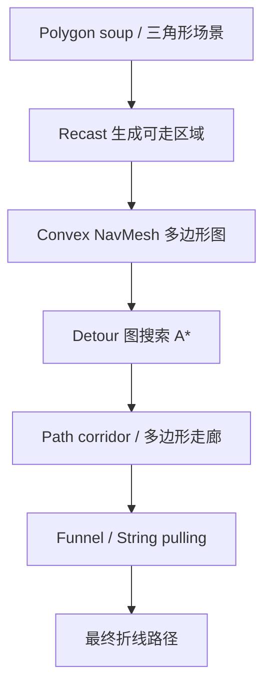
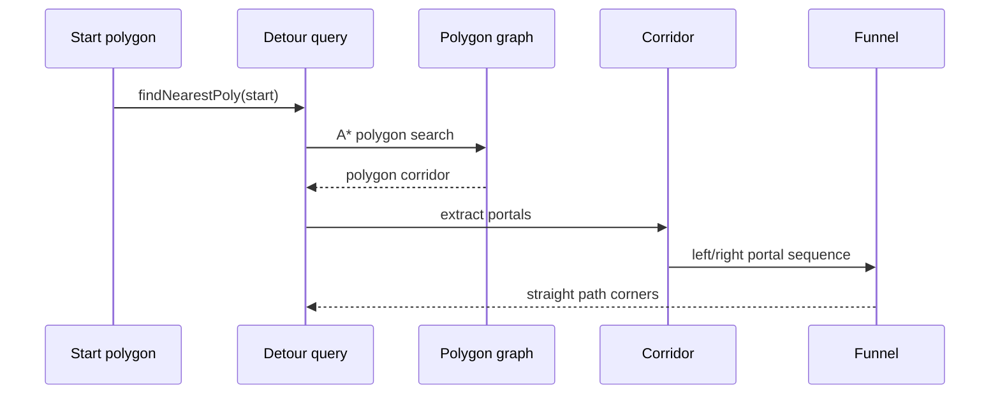

---
title: "游戏与引擎算法 19｜NavMesh 原理与 Funnel 算法"
slug: "algo-19-navmesh"
date: "2026-04-17"
description: "从 polygon soup 到 NavMesh，再到 graph search 和 funnel/string pulling，拆开 Recast/Detour 的工程分层与路径平滑。"
tags:
  - "导航网格"
  - "NavMesh"
  - "Funnel"
  - "Detour"
  - "Recast"
  - "A*"
  - "string pulling"
  - "路径规划"
series: "游戏与引擎算法"
weight: 1819
---

**一句话本质：NavMesh 不是‘让角色走多边形’，而是把复杂场景压成一个凸多边形图，再在图上找 corridor、在 corridor 里做 string pulling。**

## 问题动机

网格 A* 的问题不在“找不到路”，而在“找到了也太像机器人”。

在 3D 游戏里，地面不是规则方格，而是楼梯、斜坡、门洞、跳点、边缘和动态障碍拼出来的复杂几何。若直接在细网格上寻路，节点数会随着地图尺寸和分辨率爆炸，路径又会沿着格子边缘抖动。

NavMesh 的目标，是把“可走区域”从原始三角形 soup 里提炼出来，形成更少、更大的凸多边形。这样，路径搜索从“扫很多网格点”变成“扫少量多边形”，最后再把多边形走廊收成一条几乎最短、且足够平滑的折线。

### NavMesh 要解决的三层问题



## 历史背景

NavMesh 不是先天就有的游戏标准，它是从“要让角色在复杂 3D 场景里别乱撞”这件事里一点点长出来的。

早期游戏常见的是网格寻路、路点网络和手工脚本。网格太细会贵，路点太稀会飘，手工脚本又很难覆盖动态场景。随着 3D 地图、多人单位和实时 AI 变多，大家开始转向用几何表示可走面，再把寻路限制在这个“可走面图”上。

Recast/Detour 把这条路线工程化了。Recast 负责把任意场景几何转成 navmesh，Detour 负责运行时加载、图搜索和查询。今天 Unity、Unreal、Godot、O3DE 都把这种分层直接接到引擎导航系统里。

Unity 的导航系统说明得很直接：NavMesh 把场景的可走表面存成凸多边形，并记录邻接关系；找路径时先在多边形图上做 A*，再沿 corridor 取可见拐点。Unreal 则把 string pulled path、path corridor 和 path length 分开成不同 API，这说明“走廊”和“平滑后的路径”不是同一个东西。

## 数学基础

### 1. NavMesh 是一个多边形图

把可走区域记为一组凸多边形 `P_i`。只要两个多边形共享一条边或一个 portal，就认为它们在图上相邻：

$$
G = (V, E), \quad V = \{P_i\}
$$

图搜索不是在原始三角形 soup 上跑，而是在多边形邻接图上跑。搜索代价通常写成：

$$
 f(n) = g(n) + h(n)
$$

这里 `g(n)` 是已经走过的 corridor 代价，`h(n)` 是到目标的启发式估计，常用多边形质心或 portal 中点的欧氏距离。

### 2. corridor 比折线更重要

A* 在 NavMesh 上返回的不是最终折线，而是一串多边形或 portal。这个序列就是 corridor。

只要 corridor 已定，几何最短路径问题就变成“穿过这一串门洞时，哪条折线最短”。这一步可以不用在整个场景上搜索，只在 corridor 内部处理。

### 3. Funnel 是在一串 portal 里找最短折线

把 corridor 看成一串左右边界形成的“漏斗”。漏斗顶点是 apex，左右边界是 left leg 和 right leg。路径平滑时，真正起作用的不是“中线”，而是“每次哪条边先收窄”。

对任一 portal，若其左点 `L_i`、右点 `R_i` 与 apex 构成的扇形没有被新的 portal 收窄，就继续前进；一旦左/右边界交叉，就说明当前边已经被卡死，需要把上一条边界的拐点加入路径，然后把 apex 移到那个拐点继续扫。

这就是 Detour `findStraightPath` 背后的几何含义。Unreal 的 `PerformStringPulling` 直接把这件事叫作 string pulling；Unity 文档则用“沿 corridor 走到下一处可见拐点”来描述同一件事。

### 4. 走廊最短路径的直觉

在凸多边形 corridor 里，只要不穿墙，最短路径一定贴着某些 portal 的角点拐过去。

原因很简单：如果一段折线中间没有碰到边界，就能继续拉直。所谓 funnel/string pulling，就是把这些可以“拉直”的段落都拉掉，直到不能再拉。

## 算法推导

### 第一步：把 polygon soup 压成可搜索图

Recast 的工程分层非常清楚：

1. 先把三角形栅格化成 voxels。
2. 过滤掉角色无法通过的区域。
3. 把可走 voxel 区域分成若干 polygonal regions。
4. 对 regions 重新三角化，生成 navmesh。

这一步解决的是表示问题，不是路径问题。它把“场景几何”变成“多边形图”，让后续路径查询只面对可走面。

### 第二步：在多边形图上做图搜索

A* 在 NavMesh 上的工作方式和网格类似，但节点更少、分支更少。

如果两个多边形的共享边可通行，就把它们视为图边。代价可以取门洞中点距离、折线长度估计，或更细一点的局部几何代价。启发式通常直接用欧氏距离，因为它对最短路径是可采纳的。

### 第三步：把多边形序列还原成 corridor

图搜索的结果往往是一串多边形 ID。真正要走的不是这些 ID，而是它们之间的共享边。于是我们把相邻多边形之间的共享边抽成 portal 列表：

$$
\mathcal{C} = \{(L_0,R_0), (L_1,R_1), \dots, (L_k,R_k)\}
$$

其中每个 portal 都是 corridor 的一个“门”。

### 第四步：对 corridor 做 string pulling

Funnel 算法的状态只有三样：`apex`、`left`、`right`。

每来一个 portal，就试着收紧漏斗。如果新 portal 让左右边界交叉，说明当前边已经不能再拉直，于是把对应角点写入路径，并把 apex 移到那个角点重新开始。

这和最短路径几何的核心直觉完全一致：**能直就直，不能直才拐。**

### 第五步：把 off-mesh link 看成特殊 portal

跳跃、攀爬、开门、梯子都不是普通地面边，所以它们在 NavMesh 里通常以 off-mesh link 表达。

对 string pulling 而言，off-mesh link 不是障碍，而是一个特殊的 corridor 段。算法必须把它当作语义边，而不是普通几何边，否则路径会在 link 附近被错误拉直。

## 结构图 / 流程图




## 算法实现

下面给一个面向运行时的 C# 骨架。它把“图搜索”和“走廊平滑”拆开，和 Recast/Detour 的职责分层一致。

```csharp
using System;
using System.Collections.Generic;
using System.Numerics;

public sealed class NavMeshPolygon
{
    public int Id;
    public readonly List<int> Neighbors = new();
    public readonly List<Vector3> Vertices = new(); // XZ plane, Y is height

    public Vector3 Centroid
    {
        get
        {
            if (Vertices.Count == 0) return Vector3.Zero;
            Vector3 sum = Vector3.Zero;
            foreach (var v in Vertices) sum += v;
            return sum / Vertices.Count;
        }
    }
}

public readonly record struct Portal(Vector3 Left, Vector3 Right);

public sealed class NavMeshQuery
{
    private readonly Dictionary<int, NavMeshPolygon> _polygons;

    public NavMeshQuery(Dictionary<int, NavMeshPolygon> polygons)
    {
        _polygons = polygons;
    }

    public List<int> FindPolygonPath(int startPolyId, int goalPolyId)
    {
        if (!_polygons.ContainsKey(startPolyId) || !_polygons.ContainsKey(goalPolyId))
            throw new ArgumentException("Unknown polygon id.");

        var open = new PriorityQueue<int, float>();
        var cameFrom = new Dictionary<int, int>();
        var gScore = new Dictionary<int, float> { [startPolyId] = 0f };
        open.Enqueue(startPolyId, 0f);

        while (open.Count > 0)
        {
            int current = open.Dequeue();
            if (current == goalPolyId)
                return Reconstruct(cameFrom, current);

            var currentPoly = _polygons[current];
            foreach (int next in currentPoly.Neighbors)
            {
                float tentative = gScore[current] + Vector3.Distance(currentPoly.Centroid, _polygons[next].Centroid);
                if (gScore.TryGetValue(next, out float old) && tentative >= old)
                    continue;

                cameFrom[next] = current;
                gScore[next] = tentative;
                float h = Vector3.Distance(_polygons[next].Centroid, _polygons[goalPolyId].Centroid);
                open.Enqueue(next, tentative + h);
            }
        }

        return new List<int>();
    }

    public List<Vector3> StringPull(Vector3 start, Vector3 goal, IReadOnlyList<Portal> portals)
    {
        var result = new List<Vector3>();
        result.Add(start);

        Vector3 apex = start;
        Vector3 left = start;
        Vector3 right = start;
        int apexIndex = 0;
        int leftIndex = 0;
        int rightIndex = 0;

        for (int i = 0; i <= portals.Count; i++)
        {
            Vector3 pLeft = i == portals.Count ? goal : portals[i].Left;
            Vector3 pRight = i == portals.Count ? goal : portals[i].Right;

            if (TriArea2(apex, right, pRight) <= 0f)
            {
                if (apex.Equals(right) || TriArea2(apex, left, pRight) > 0f)
                {
                    right = pRight;
                    rightIndex = i;
                }
                else
                {
                    result.Add(left);
                    apex = left;
                    apexIndex = leftIndex;
                    left = apex;
                    right = apex;
                    leftIndex = apexIndex;
                    rightIndex = apexIndex;
                    i = apexIndex;
                    continue;
                }
            }

            if (TriArea2(apex, left, pLeft) >= 0f)
            {
                if (apex.Equals(left) || TriArea2(apex, right, pLeft) < 0f)
                {
                    left = pLeft;
                    leftIndex = i;
                }
                else
                {
                    result.Add(right);
                    apex = right;
                    apexIndex = rightIndex;
                    left = apex;
                    right = apex;
                    leftIndex = apexIndex;
                    rightIndex = apexIndex;
                    i = apexIndex;
                    continue;
                }
            }
        }

        result.Add(goal);
        return result;
    }

    private static float TriArea2(Vector3 a, Vector3 b, Vector3 c)
        => (b.X - a.X) * (c.Z - a.Z) - (c.X - a.X) * (b.Z - a.Z);

    private static List<int> Reconstruct(Dictionary<int, int> cameFrom, int current)
    {
        var path = new List<int> { current };
        while (cameFrom.TryGetValue(current, out int parent))
        {
            current = parent;
            path.Add(current);
        }
        path.Reverse();
        return path;
    }
}
```

这段代码故意把“多边形搜索”和“走廊拉直”分开。前者决定能不能到，后者决定怎么走得像人。

## 复杂度分析

NavMesh 的成本分成两半：离线构建和运行时查询。

- **构建阶段**：Recast 的 voxelization、区域划分和重新三角化，成本大致随输入几何规模增长；在工程上，瓶颈常常不是公式，而是场景复杂度和 tile 切分策略。
- **查询阶段**：A* 在多边形图上跑，复杂度是 `O(E log V)` 的典型图搜索形式；funnel/string pulling 对 corridor 做一次线性扫描，通常是 `O(k)`，`k` 是 corridor 里的 portal 数。
- **空间成本**：NavMesh 把原始三角形场景压成较少的凸多边形和邻接边，运行时主要存图结构和少量查询缓存。

真正的收益不只是“更快”，而是搜索空间变小、路径更平滑、局部避障更容易接上。

## 变体与优化

- **Tiled NavMesh**：把大世界切成 tile，支持流式加载、局部重烘焙和增量更新。
- **Hierarchical NavMesh**：先在粗图上找骨架，再在局部细图里找细节，适合大地图和多次查询。
- **Off-mesh links**：把跳跃、攀爬、开门、梯子当成显式语义边。
- **Path corridor 维护**：移动时只重算局部 corridor，不必每次从头 A*。
- **局部避障叠加**：NavMesh 负责全局通路，局部 steering 负责避人、绕障和速度调节。

Hierarchical NavMesh 方向的研究已经证明，分层后在若干 benchmark 上可以比普通 NavMesh A* 快到 `7.7x`，代价是预处理更重、更新更复杂。

## 对比其他算法

| 方法 | 表示层 | 优点 | 缺点 | 适合场景 |
|---|---|---|---|---|
| Grid A* | 规则网格 | 实现直观，更新简单 | 分辨率越高越贵，路径锯齿明显 | 2D、战棋、低精度地图 |
| Visibility Graph | 凸障碍顶点图 | 最短路径精确 | 静态几何更适合，动态障碍麻烦 | 简化平面几何 |
| NavMesh + Funnel | 凸多边形图 | 搜索空间小，路径自然 | 构建链条更复杂 | 3D 场景、角色移动 |
| Waypoint Graph | 人工路点图 | 最易控，成本低 | 路径质量依赖手工布点 | 预设关卡、剧情走位 |

## 批判性讨论

NavMesh 的强项是“把问题压扁”。这也是它的弱项。

如果场景是大范围动态破坏、地形持续变化、或大量临时障碍物频繁出现，离线烘焙好的 mesh 就会开始显得笨重。此时你要么做 tile 级增量更新，要么把全局导航换成更能动态响应的结构。

另一个常见误区是把 NavMesh 当成“自动动画系统”。它只能告诉你能去哪，不能替你解决脚步摆动、转身时机、人物拥挤和局部挤压。这个缺口通常要靠 steering、RVO/ORCA、动画状态机和 root motion 一起补。

还有一个容易被忽略的坑：NavMesh 质量高度依赖 agent 半径、高度、坡度和 step height。参数偏小会穿墙，偏大又会把可走空间削掉，最后看起来像“路径算法不对”，其实是烘焙规格错了。

## 跨学科视角

NavMesh 本质上是计算几何和图搜索的混合体。

它和 CAD 里的多边形简化、机器人里的配置空间、以及最短路径问题共享同一类思想：先把可行空间变成更容易算的形状，再在这个形状上做最短路。

Funnel/string pulling 也和几何优化很像。它不去暴力枚举所有折线，而是用凸性和可见性把路径一段段拉直，思路和“在约束内压掉自由度”非常接近。

## 真实案例

- **Recast/Detour**：官方 README 明确把模块拆成 `Recast/`、`Detour/`、`DetourCrowd/` 和 `DetourTileCache/`，并说明它支撑 Unity、Unreal、Godot、O3DE 等引擎的导航功能。[Recast Navigation](https://github.com/recastnavigation/recastnavigation)
- **Unity Navigation System**：Unity 文档写明 NavMesh 由凸多边形和邻接关系组成，路径搜索先找 corridor，再通过可见拐点沿 corridor 前进。[Unity Navigation System](https://docs.unity3d.com/es/2018.3/Manual/nav-NavigationSystem.html)
- **Unreal NavMesh**：Unreal 的 `FNavMeshPath::PerformStringPulling` 直接把“从 PathCorridor 找 string pulled path”作为 API，说明 corridor 与平滑路径在引擎层是两件不同的事。[PerformStringPulling](https://dev.epicgames.com/documentation/en-us/unreal-engine/API/Runtime/NavigationSystem/NavMesh/FNavMeshPath/PerformStringPulling)

## 量化数据

- Recast README 把构建流程明确拆成 4 步：三角形栅格化、过滤、区域划分、重新三角化。这是典型的“离线复杂、运行时轻量”的设计。
- Unity `NavMesh.CalculatePath` 文档明确警告：它是即时计算，长路径可能造成 frame rate hiccup，因此只适合少量调用或预计算。[Unity API](https://docs.unity3d.com/kr/530/ScriptReference/NavMesh.CalculatePath.html)
- Hierarchical NavMesh 论文报告，在测试场景里可比普通 NavMesh A* 快到 `7.7x`，说明分层在大图上很有意义。[HNA* 论文](https://doi.org/10.1016/j.cag.2016.05.023)
- Unreal `ARecastNavMesh::CalcPathLength` 备注指出它不生成 string pulled path，因此结果是 over-estimated approximation，且潜在昂贵。[CalcPathLength](https://dev.epicgames.com/documentation/en-us/unreal-engine/API/Runtime/NavigationSystem/NavMesh/ARecastNavMesh/CalcPathLength)

## 常见坑

1. **把图搜索结果直接当最终路径。**  
   错因：多边形序列只是 corridor，不是几何最短折线。  
   怎么改：必须做 funnel/string pulling。

2. **把 start/goal 点直接扔进图搜索。**  
   错因：场景点不一定落在 poly 内部，甚至可能离 NavMesh 很远。  
   怎么改：先 `findNearestPoly` / 投影到合法多边形。

3. **agent 参数和烘焙参数不一致。**  
   错因：半径、高度、坡度、step height 不匹配会让路径异常。  
   怎么改：把 bake 参数和角色碰撞体绑定成一套规范。

4. **忽略 off-mesh link 的语义。**  
   错因：跳跃、门和梯子不是普通边，不能按普通 portal 拉直。  
   怎么改：对语义边单独处理。

## 何时用 / 何时不用

**适合用 NavMesh 的场景：**

- 3D 角色在复杂场景中移动。
- 关卡可走区域明显，且需要平滑路径。
- 关卡设计会频繁烘焙，但不会每帧大改地形。

**不太适合的场景：**

- 整张地图是严格规则网格，且路径完全离散化。
- 需要大量点对点的独立短路查询，且没有几何连续性需求。
- 地形持续大范围破坏，连 tile 更新都跟不上。

## 相关算法

- [数据结构与算法 06｜Dijkstra 与 A*]()
- [游戏与引擎算法 18｜Jump Point Search（JPS）]()
- [游戏与引擎算法 20｜Flow Field：RTS 大规模寻路]()
- [游戏与引擎算法 21｜RVO / ORCA：多智能体避障]()
- [游戏与引擎算法 22｜HPA*：层次化寻路]()

## 小结

NavMesh 的价值不在“换了一种地面表示”，而在把几何、图搜索和路径平滑拆成三段，各做各最擅长的事。

Recast 负责把场景变成可走多边形，Detour 负责在图上找 corridor，funnel/string pulling 负责把 corridor 拉成自然路径。

如果要记住一条工程原则，就是：**NavMesh 解决全局可达性，funnel 解决几何顺滑，局部 steering 解决最后那 1 米。**

## 参考资料

- [Recast Navigation README](https://github.com/recastnavigation/recastnavigation)
- [Unity Navigation System](https://docs.unity3d.com/es/2018.3/Manual/nav-NavigationSystem.html)
- [Unity NavMesh.CalculatePath](https://docs.unity3d.com/kr/530/ScriptReference/NavMesh.CalculatePath.html)
- [Unreal Engine: FNavMeshPath::PerformStringPulling](https://dev.epicgames.com/documentation/en-us/unreal-engine/API/Runtime/NavigationSystem/NavMesh/FNavMeshPath/PerformStringPulling)
- [Unreal Engine: FNavMeshPath::bStringPulled](https://dev.epicgames.com/documentation/en-us/unreal-engine/API/Runtime/NavigationSystem/NavMesh/FNavMeshPath/bStringPulled)
- [Unreal Engine: ARecastNavMesh::CalcPathLength](https://dev.epicgames.com/documentation/en-us/unreal-engine/API/Runtime/NavigationSystem/NavMesh/ARecastNavMesh/CalcPathLength)
- [Hierarchical path-finding for Navigation Meshes (HNA*)](https://doi.org/10.1016/j.cag.2016.05.023)
- [Comparing navigation meshes: theoretical analysis and practical metrics](https://doi.org/10.1016/j.cag.2020.06.006)

