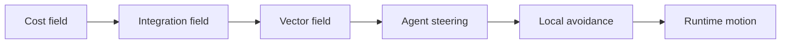
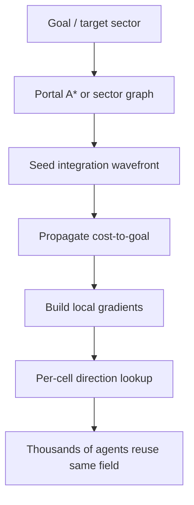

---
title: "游戏与引擎算法 20｜Flow Field：RTS 大规模寻路"
slug: "algo-20-flow-field"
date: "2026-04-17"
description: "把 RTS 群体寻路拆成 cost field、integration field 和 vector field 三层，解释为什么共享目标时它比逐单位 A* 更合算。"
tags:
  - "Flow Field"
  - "RTS"
  - "群体寻路"
  - "cost field"
  - "integration field"
  - "vector field"
  - "Supreme Commander"
  - "pathfinding"
series: "游戏与引擎算法"
weight: 1820
---

**一句话本质：Flow Field 不是给每个单位单独找路，而是先给整张地图算一张“去目标的方向场”，再让所有单位按局部梯度一起流过去。**

> 读这篇之前：建议先看 [游戏与引擎算法 19｜NavMesh 原理与 Funnel 算法]() 和 [游戏与引擎算法 21｜RVO / ORCA：多智能体避障]()。NavMesh 解决全局可达性，ORCA 解决局部互撞，Flow Field 夹在中间负责“共享目的地的大队伍如何整体移动”。

## 问题动机

单体 A* 很强，但它的成本是“每个单位算一次”。

当你只有一个英雄、一个侦察兵或一只宠物时，这没问题。可一旦场景变成 RTS：几十、几百甚至上千个单位同时朝同一个目标移动，单体 A* 就会把 CPU 预算吃干净。

更糟的是，这些单位往往还会共享相同的地形成本、相同的目标方向和相同的障碍信息。若每个单位都重复做同样的图搜索，就是把同一份信息算了很多遍。

Flow Field 的核心想法很直接：**对同一目标，只算一次全局方向场。**

### 为什么共享目标时它更合算

```mermaid
flowchart TD
    A[一个目标] --> B[一次全局 cost/integration 计算]
    B --> C[整张地图的 vector field]
    C --> D[每个单位只做 O(1) 采样]
    D --> E[单位按局部方向前进]
    E --> F[局部避障 / 编队修正]
```

## 历史背景

Flow Field 在游戏里不是从机器人学里“借一个名字”而已，它是 RTS 里被 CPU 压出来的工程答案。

早期 RTS 常见的是单位各自做 A*，然后沿路径走。问题在于单位一多，路径请求和重规划会互相放大，尤其在瓶颈、转角和拥挤区域，重复搜索的代价会越来越高。

Elijah Emerson 在 `Crowd Pathfinding and Steering Using Flow Field Tiles` 里把 Supreme Commander 2 的问题讲得很清楚：原先的单条 A* 路径在大规模单位冲突时会让游戏反复“停下、重算、再停下”。Flow field tiles 的做法，是把世界拆成 sector，再把多个单位的共同目标折成共享的方向场。

UW 的 `Crowd Flows` 则从连续介质和势场角度给了另一条路线：把人群看成连续流体，用动态势场把全局导航和移动障碍统一起来。它不是简单的“地图箭头”，而是把局部速度场和全局目标耦合起来。

## 数学基础

### 1. Cost field 是局部代价图

在每个格子上定义局部通行代价 `c(x,y)`：

$$
 c(x,y) \in [1, 255]
$$

其中 `255` 常用来表示墙或不可通行区域。`1` 代表普通通路，更高的值表示泥地、斜坡、拥挤区或其他难走区域。

### 2. Integration field 是到目标的离散势函数

Integration field `I(x,y)` 存的是“从这里走到目标的累计代价”。

离散形式通常写成：

$$
I(p) = 
\begin{cases}
0, & p \in G \\
\min_{q \in N(p)} \big(I(q) + w(p,q)\big), & \text{otherwise}
\end{cases}
$$

其中 `G` 是目标集合，`N(p)` 是邻居格子，`w(p,q)` 是从 `p` 到 `q` 的过渡代价。

这一步本质上是带权最短路，只不过目标不是一条单独路径，而是整张地图上每个格子的“到目标距离”。

### 3. Vector field 是局部负梯度

如果有了 `I(x,y)`，那么每个格子的前进方向就是朝着更小代价的邻居移动：

$$
 v(p) = \operatorname{normalize}\big(q^* - p\big), \quad q^* = \arg\min_{q \in N(p)} I(q)
$$

在连续视角里，它接近于：

$$
 v(x,y) \propto -\nabla I(x,y)
$$

这也是为什么它叫 flow field。它不是路径列表，而是一张局部方向场。

### 4. 三层字段各自负责什么

- **Cost field**：描述地形本身的穿越代价。
- **Integration field**：描述“从这里到目标要花多少代价”。
- **Vector field**：描述“此刻该朝哪个方向走”。

这三层分开后，目标变化时通常只需要重算 integration 和 vector；地形变化时才需要重算 cost。

## 算法推导

### 第一步：为什么不直接让单位各自跑 A*

单体 A* 的输出是一条路径。若 200 个单位共享同一目标，就会得到 200 次几乎相同的路径搜索。

如果地形不复杂、单位不多，这样做没问题。可在 RTS 场景，大家往往共享同一个战略目标、同一批通道和同一块瓶颈区域。重复搜索只会把开销放大。

### 第二步：为什么 integration field 能复用

目标一旦固定，地图上每个格子的“到目标代价”就固定了。换单位只需要读取这张字段，不需要重新跑整条路径。

这意味着：

- 全局代价计算只做一次。
- 每个单位只在本地做一次方向采样。
- 单位数量越多，摊销越明显。

### 第三步：为什么 cost / integration / vector 要拆开

如果只保存 vector field，后续你就不知道这条方向是怎么来的，也不知道成本变化后该怎么更新。

如果只保存 integration field，单位每次移动都要自己算梯度，局部采样成本会变高。

把三层拆开后，成本图是输入，距离图是中间层，方向图是输出。它像渲染管线一样，把“语义”和“执行”分层了。

### 第四步：为什么 flow field 能处理群体移动

群体移动时，单位彼此之间并不要求每个人都跟着一条独立最短路。很多时候，只要大家朝同一方向流动，并在局部用避障把彼此错开，就能得到更稳定的整体行为。

这就是流场优于逐单位 A* 的地方：它天生适合“很多单位去同一个地方”。

### 第五步：为什么它不适合所有场景

Flow field 的方向是局部的。它知道“下一步往哪走”，却不天然知道“你这个单位是不是应该抄近路、跳过去、还是在楼上绕一圈”。

所以它通常依赖更高层的路径骨架，比如 sector graph、navmesh corridor 或 portal path。也就是说，Flow field 常常是“全局骨架 + 局部场”的组合，不是单独全能。

## 结构图 / 流程图





## 算法实现

下面的实现把 flow field 拆成 tile 级数据结构。它保留了 cost、integration、vector 三层，也保留了一个可选的直视线优化。

```csharp
using System;
using System.Collections.Generic;
using System.Numerics;

public readonly record struct GridPoint(int X, int Y);

public sealed class FlowFieldTile
{
    public readonly int Width;
    public readonly int Height;
    public readonly byte[] Cost;           // 1..254 walkable, 255 wall
    public readonly int[] Integration;     // int.MaxValue means unreachable
    public readonly Vector2[] Flow;        // normalized 2D direction in map space
    public readonly bool[] HasLineOfSight; // optional quality flag

    public FlowFieldTile(int width, int height, byte[] cost)
    {
        if (width <= 0 || height <= 0) throw new ArgumentOutOfRangeException();
        if (cost.Length != width * height) throw new ArgumentException("Cost array size mismatch.");

        Width = width;
        Height = height;
        Cost = cost;
        Integration = new int[cost.Length];
        Flow = new Vector2[cost.Length];
        HasLineOfSight = new bool[cost.Length];
    }

    public void Build(IEnumerable<GridPoint> goals, bool useEightNeighbors = false)
    {
        Array.Fill(Integration, int.MaxValue);
        Array.Clear(Flow);
        Array.Clear(HasLineOfSight);

        var pq = new PriorityQueue<int, int>();
        foreach (var goal in goals)
        {
            if (!InBounds(goal.X, goal.Y)) continue;
            int index = Idx(goal.X, goal.Y);
            if (!IsWalkable(index)) continue;
            Integration[index] = 0;
            pq.Enqueue(index, 0);
        }

        while (pq.Count > 0)
        {
            int current = pq.Dequeue();
            int cx = current % Width;
            int cy = current / Width;
            int baseCost = Integration[current];

            foreach (var next in EnumerateNeighbors(cx, cy, useEightNeighbors))
            {
                int ni = Idx(next.X, next.Y);
                if (!IsWalkable(ni)) continue;

                int step = StepCost(current, ni);
                int candidate = baseCost + step;
                if (candidate >= Integration[ni]) continue;

                Integration[ni] = candidate;
                pq.Enqueue(ni, candidate);
            }
        }

        BuildVectorField(useEightNeighbors);
    }

    public Vector2 SampleDirection(Vector2 worldPos)
    {
        int x = Clamp((int)MathF.Floor(worldPos.X), 0, Width - 1);
        int y = Clamp((int)MathF.Floor(worldPos.Y), 0, Height - 1);
        return Flow[Idx(x, y)];
    }

    private void BuildVectorField(bool useEightNeighbors)
    {
        for (int y = 0; y < Height; y++)
        {
            for (int x = 0; x < Width; x++)
            {
                int i = Idx(x, y);
                if (!IsWalkable(i) || Integration[i] == int.MaxValue)
                {
                    Flow[i] = Vector2.Zero;
                    continue;
                }

                int best = i;
                int bestValue = Integration[i];
                foreach (var n in EnumerateNeighbors(x, y, useEightNeighbors))
                {
                    int ni = Idx(n.X, n.Y);
                    if (!IsWalkable(ni)) continue;
                    if (Integration[ni] < bestValue)
                    {
                        bestValue = Integration[ni];
                        best = ni;
                    }
                }

                if (best == i)
                {
                    Flow[i] = Vector2.Zero;
                }
                else
                {
                    Vector2 dir = new Vector2((best % Width + 0.5f) - (x + 0.5f), (best / Width + 0.5f) - (y + 0.5f));
                    Flow[i] = NormalizeSafe(dir);
                }
            }
        }
    }

    private int StepCost(int from, int to)
    {
        int a = Cost[from] == 255 ? 255 : Cost[from];
        int b = Cost[to] == 255 ? 255 : Cost[to];
        return 1 + (a + b) / 2;
    }

    private IEnumerable<GridPoint> EnumerateNeighbors(int x, int y, bool diagonal)
    {
        if (InBounds(x - 1, y)) yield return new GridPoint(x - 1, y);
        if (InBounds(x + 1, y)) yield return new GridPoint(x + 1, y);
        if (InBounds(x, y - 1)) yield return new GridPoint(x, y - 1);
        if (InBounds(x, y + 1)) yield return new GridPoint(x, y + 1);

        if (!diagonal) yield break;

        if (InBounds(x - 1, y - 1)) yield return new GridPoint(x - 1, y - 1);
        if (InBounds(x + 1, y - 1)) yield return new GridPoint(x + 1, y - 1);
        if (InBounds(x - 1, y + 1)) yield return new GridPoint(x - 1, y + 1);
        if (InBounds(x + 1, y + 1)) yield return new GridPoint(x + 1, y + 1);
    }

    private bool IsWalkable(int index) => Cost[index] != 255;
    private bool InBounds(int x, int y) => x >= 0 && y >= 0 && x < Width && y < Height;
    private int Idx(int x, int y) => y * Width + x;
    private static int Clamp(int v, int min, int max) => v < min ? min : (v > max ? max : v);

    private static Vector2 NormalizeSafe(Vector2 v)
    {
        float len = v.Length();
        return len > 1e-5f ? v / len : Vector2.Zero;
    }
}
```

这段代码的关键不是某个 API，而是数据布局：cost、integration、flow 分层后，单位只需要读 flow，就能在 O(1) 时间拿到局部方向。

## 复杂度分析

Flow field 的真正成本在“目标变化后重算整张场”。

- **构建 integration field**：如果用优先队列，复杂度接近 `O(N log N)`，其中 `N = W × H`。当代价离散且范围很小，也可以做成 bucket queue，把实际成本压得更接近 `O(N)`。
- **构建 vector field**：每格扫描固定邻居，复杂度是 `O(N)`。
- **每个单位移动**：只需要局部采样和少量 steering，近似 `O(1)`。

所以它最适合“单位数远大于目标数”的场景。目标越少，摊销越明显。

## 变体与优化

- **Sector tiles**：把大地图切成 10×10 或更大的 sector，只重算受影响区域。
- **Line-of-sight pass**：在目标附近做 LOS 修正，减少菱形伪影。
- **Merging A***：先在 sector graph 上找骨架，再在局部 tile 上做 flow。
- **Cost stamping**：动态障碍以 stamp 方式更新 cost，而不是全图重建。
- **多目标缓存**：同一目标被多批单位追逐时，直接复用 integration/vector field。

Supreme Commander 2 的实现就是这类思想的代表：每个 10×10 m sector 有三种字段，`cost` 是 8-bit，`integration` 是 24-bit，`flow` 是 8-bit；清空的 sector 甚至可以共用一张全 1 的静态 cost field。这样做的目的就是节省内存并复用结果。

## 对比其他算法

| 方法 | 核心输出 | 适合单位数 | 路径质量 | 更新成本 | 备注 |
|---|---|---|---|---|---|
| 单体 A* | 单条路径 | 少量单位 | 高 | 每单位都要算 | 最灵活，但重复工作多 |
| NavMesh + corridor | 走廊 + 折线 | 少量到中等单位 | 高 | 目标变动时重算 | 适合角色移动 |
| Flow Field | 整图方向场 | 大量单位共享目标 | 中高 | 每目标重算一次 | RTS 群体移动很合适 |
| Steering 纯局部 | 局部速度 | 单体/小群体 | 低到中 | 很低 | 不能保证全局可达 |

## 批判性讨论

Flow field 很强，但它不神奇。

它最适合“很多单位朝同一目标去”的情况，不适合大量独立目标、超稀疏场景，或者每个单位都需要不同战术路径的情况。你若把它硬塞到单体英雄寻路里，常常会得到“算一张很贵的大图，只服务一个人”的糟糕收益。

它还有一个天然限制：分辨率。grid 太粗，方向会抖；grid 太细，fields 变大，重算成本又会上去。它本质上是在精度和摊销之间做交换。

最后，flow field 只能告诉单位“朝哪走”。它不会替你解决单位互相挤住、突然刹车、互换位置、或狭窄通道里的局部冲突。这些通常要和 ORCA、局部 steering、碰撞体分离一起用。

## 跨学科视角

Flow field 和连续介质、势场、Eikonal 方程有很强的同构关系。

从数学上看，它很像在离散网格上解一个到目标的最短代价势函数，再取负梯度做运动方向。这和物理里的势能下降、与数值 PDE 里的 wavefront propagation 是同一条线。

在群体模拟里，它又和流体、交通和鸟群模型相似：不是每个个体都知道全局计划，而是共享一张局部方向场，借此形成宏观秩序。

## 真实案例

- **Supreme Commander 2 / Game AI Pro**：Elijah Emerson 的章节明确把 flow field tiles 拆成 sector、cost field、integration field 和 flow field，并解释了为什么这样能服务上千单位。[Game AI Pro Chapter 23](https://www.gameaipro.com/GameAIPro/GameAIPro_Chapter23_Crowd_Pathfinding_and_Steering_Using_Flow_Field_Tiles.pdf)
- **Crowd Flows / Continuum Crowds**：UW 的项目页面把动态势场用于实时人群导航，强调它能在没有显式碰撞回避的情况下处理大群体移动。[Crowd Flows](https://grail.cs.washington.edu/projects/crowd-flows/)
- **Integration field-based breadth-first search for flow field pathfinding**：2025 年的研究继续把 integration field 和 flow field 结合起来，强调其在动态障碍和大规模样本下的鲁棒性。[Scientific Reports](https://www.nature.com/articles/s41598-025-24412-x)

## 量化数据

- Supreme Commander 2 的世界按 `10 × 10 m` sector 切分，每个 sector 内有 `10 × 10` grid squares。
- 该实现中，cost field 使用 `8-bit`，integration field 使用 `24-bit`，flow field 使用 `8-bit`；必要时 integration 也可扩到 `40-bit`。
- 在 Supreme Commander 2 的场景里，大约 `50%~70%` 的 pathable space 是 clear sector，这使静态 cost field 复用非常划算。
- 2025 年的 flow field 研究里，测试地图采用 `1 m/pix`、目标距离 `100 m`、单位速度 `1 m/s`；在含 `15` 个静态和 `15` 个动态障碍的测试中，`IFBFS-FF` 的平均 timeout rate 为 `0.6%`，传统 flow field 为 `4.3%`。
- 同一研究还报告，采样量达到 `20,000` 时，flow field 的轨迹差异会明显受障碍数量和初始 integration distance 影响，这说明评价 flow field 时必须看“整图”而不是单次路径长度。

## 常见坑

1. **把 vector field 当成最终答案。**  
   错因：方向场只能给局部运动，不等于全局可达路径。  
   怎么改：先有 sector graph / navmesh corridor，再有 flow field。

2. **只做四邻域，但没有 LOS 修正。**  
   错因：目标附近会出现菱形伪影，单位会绕圈。  
   怎么改：在目标附近加 LOS pass 或更高质量的边界修正。

3. **把每个单位都单独重建一张场。**  
   错因：你把共享目标的优势全浪费掉了。  
   怎么改：按目标缓存 integration / vector field。

4. **忽略动态障碍的更新范围。**  
   错因：全图重算会把流场优势吃掉。  
   怎么改：做 sector 级 dirty region 更新。

## 何时用 / 何时不用

**适合用 Flow Field 的场景：**

- RTS、塔防、军团移动、编队推进。
- 很多单位共享少数几个目标点。
- 地图较大，路径重算频繁。

**不太适合的场景：**

- 单个英雄的精确点对点寻路。
- 每个单位目标都不同，且频繁切换。
- 地图分辨率极高、但只服务少量单位。

## 相关算法

- [数据结构与算法 06｜Dijkstra 与 A*]()
- [游戏与引擎算法 19｜NavMesh 原理与 Funnel 算法]()
- [游戏与引擎算法 21｜RVO / ORCA：多智能体避障]()
- [游戏与引擎算法 22｜HPA*：层次化寻路]()
- [数据结构与算法 13｜空间哈希：密集动态场景的 O(1) 近邻查询]()

## 小结

Flow field 的本质，是把“很多单位去同一个地方”的重复搜索，压成“做一次全局势场，然后大家共享结果”。

它不是 A* 的替代品，而是 A* 的上层批处理。A* 负责骨架，flow field 负责规模，局部 steering 负责最后一段的人味。

如果你只记住一句话，那就记住：**当单位数开始远大于目标数时，方向场比路径列表更值钱。**

## 参考资料

- [Crowd Pathfinding and Steering Using Flow Field Tiles](https://www.gameaipro.com/GameAIPro/GameAIPro_Chapter23_Crowd_Pathfinding_and_Steering_Using_Flow_Field_Tiles.pdf)
- [Crowd Flows](https://grail.cs.washington.edu/projects/crowd-flows/)
- [Integration field-based breadth-first search for flow field pathfinding](https://www.nature.com/articles/s41598-025-24412-x)
- [Direction Maps for Cooperative Pathfinding](https://webdocs.cs.ualberta.ca/~nathanst/papers/aiide_dm.pdf)
- [Recast Navigation README](https://github.com/recastnavigation/recastnavigation)
- [Unity Navigation System](https://docs.unity3d.com/es/2018.3/Manual/nav-NavigationSystem.html)


