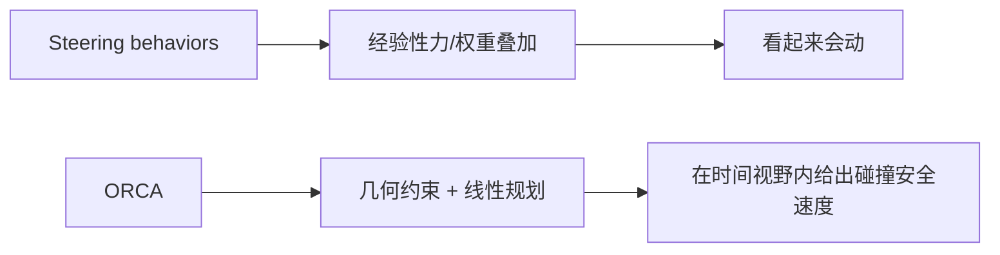
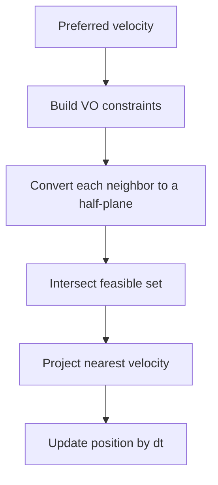
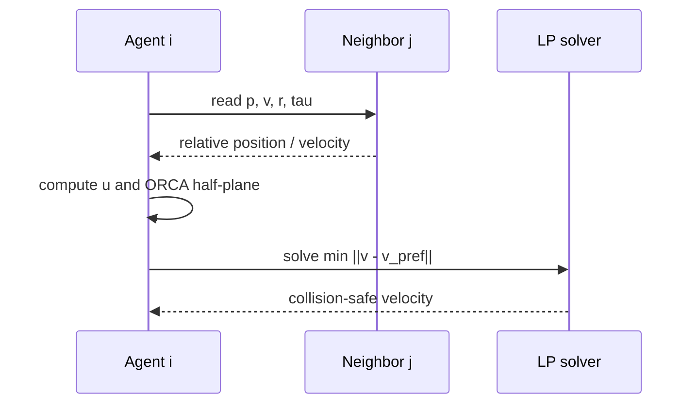

---
title: "游戏与引擎算法 21｜RVO / ORCA：多智能体避障"
slug: "algo-21-rvo-orca"
date: "2026-04-17"
description: "从 velocity obstacle 到半平面约束和线性规划，解释 RVO / ORCA 如何在多人群里给出平滑、分布式的局部避障解。"
tags:
  - "RVO"
  - "ORCA"
  - "velocity obstacle"
  - "半平面"
  - "线性规划"
  - "多智能体"
  - "避障"
  - "crowd simulation"
series: "游戏与引擎算法"
weight: 1821
---

**一句话本质：ORCA 不是“往旁边推一下”，而是把每个邻居造成的碰撞风险转成一个半平面约束，再在约束交集里投影出最接近期望速度的解。**

> 读这篇之前：建议先看 [游戏与引擎算法 20｜Flow Field：RTS 大规模寻路]() 和 [游戏与引擎算法 19｜NavMesh 原理与 Funnel 算法]()。前者解决共享目标的大队伍全局方向，后者解决可达路径；ORCA 负责它们进入拥挤区域后的局部避让。

## 问题动机

全局路径只能告诉你“去哪里”，不能保证“路上不会互相撞”。

在群体移动里，最常见的失败不是走错方向，而是大家都知道目标在哪，却在狭窄通道、门口、转角和瓶颈处彼此卡住。若用纯 steering 行为，只靠吸引、排斥和对齐，局部看起来会动，但全局不一定可达，也不一定稳定。

ORCA 的目标，是在不做中心协调的前提下，让每个智能体独立算出一个安全速度，并且这个速度尽量接近期望速度。它把“避障”变成一个局部几何优化问题，而不是一个拍脑袋的力场调参问题。

### Steering 和 ORCA 的区别



## 历史背景

碰撞避免的历史，先是机器人学，再是群体仿真，最后才成为游戏引擎里的日常工具。

1998 年的 velocity obstacle 提供了一个关键视角：把“未来会不会撞”转成速度空间里的禁区。这个思想很适合实时系统，因为你可以在速度平面里做几何判断，而不是在轨迹空间里做昂贵预测。

2008 年的 ORCA 把这件事推进了一步。van den Berg、Guy、Lin 和 Manocha 提出：如果双方都按同一规则行动，那么每个体只需要承担一半的避碰责任。这样一来，双边碰撞规避可以写成半平面约束，最终变成一个低维线性规划。

RVO2 库把这个方法落成了可直接调用的 C++ 实现。它明确支持静态障碍、智能体、偏好速度，并且在多核机器上可以并行计算。今天很多 Unity / C# / Python / ROS 适配实现，都是顺着这条路线扩出来的。

## 数学基础

### 1. Velocity obstacle 是速度空间里的禁区

对智能体 `A` 和 `B`，设它们的位置、速度和半径分别是 `p_A, v_A, r_A` 与 `p_B, v_B, r_B`。

如果在时间视野 `\tau` 内，两者在相对运动下会碰撞，那么 `A` 的某些速度就属于 `VO^\tau_{A|B}`：

$$
VO^\tau_{A|B} = \{ v \mid \exists t \in [0, \tau], \| (p_B - p_A) + t(v - v_B) \| \le r_A + r_B \}
$$

这不是轨迹空间，而是速度空间里的集合。

### 2. ORCA 把禁区边界变成半平面

假设 `u` 是把相对速度推出 VO 边界所需的最小修正向量，那么 ORCA 让每个智能体承担一半修正：

$$
ORCA^\tau_{A|B} = \{ v \mid (v - (v_A + \tfrac12 u)) \cdot n \ge 0 \}
$$

其中 `n` 是该边界的外法向。

这意味着：每个邻居都会贡献一个“不能跨过去”的半平面。所有半平面交起来，就是最终可选速度集合。

### 3. 目标函数是最近点投影

给定期望速度 `v_{pref}`，ORCA 要找的是：

$$
\min_v \|v - v_{pref}\|^2
$$

约束是所有 ORCA 半平面，再加上最大速度圆盘：

$$
\|v\| \le v_{max}
$$

所以它本质上是一个凸优化问题。因为约束是半平面和圆盘，低维情况下可以很快用线性规划求解。

### 4. 为什么它比 steering 更可控

Steering 往往把“想要去哪”分成几个经验项：分离、对齐、凝聚、到达、避障。问题在于这些项是拼出来的，不是统一求解出来的。

ORCA 直接在速度空间里找满足约束的最近解。它不是调权重，而是在可行域里做投影。这个差别决定了它更稳定，也更容易分析失败条件。

### 5. 为什么它仍然不是全局路径规划

ORCA 只解决短时间视野内的碰撞规避。它不知道你是不是应该绕楼、换门、上楼、走桥或者换边。

所以它必须和 NavMesh、Flow Field 或其他全局导航一起用。上层负责“去哪”，ORCA 负责“现在这一步怎么走得安全”。

## 算法推导

### 第一步：把碰撞条件转成速度空间约束

若两个圆形智能体在时间 `\tau` 内会碰撞，那么它们的相对速度必须落在危险区域里。

把相对位置 `p_{rel} = p_B - p_A` 和相对速度 `v_{rel} = v_A - v_B` 代入，就能在二维速度平面里定义一个禁区。这个禁区不是一条线，而是一个由圆锥/截断圆构成的区域。

### 第二步：从 VO 取出最小修正向量 `u`

对每个邻居，先找出使当前速度退出危险区的最小变化量 `u`。几何上，`u` 指向 VO 边界外侧最近点。

如果双方都使用同样规则，那么把 `u` 平分给两边就足够保证对称性。于是 A 只需要避开半个 `u`，B 也避开半个 `u`。

### 第三步：半平面就是一条约束线

把 `v_A + \tfrac12 u` 作为半平面上的一个点，法向 `n` 指向可行侧。这样每个邻居只贡献一条线性约束。

约束越多，可行域越小。但只要可行域非空，就能找到一个最接近期望速度的解。

### 第四步：线性规划比全局搜索更合适

因为速度空间是二维的，半平面交集问题可以做得非常快。

RVO2 的思路不是先枚举所有离散动作，而是直接在连续速度平面里找最优点。`LinearProgram2` 负责在圆盘和约束线上找解，`LinearProgram3` 负责在前一个约束冲突时回退到次优可行点。

### 第五步：ORCA 和局部 steering 的分界线

如果你希望的是“自然摇摆、轻松绕行、动画味更强”的局部效果，steering 仍然有价值。

如果你希望的是“成百上千个单位在狭窄区域里依然不会撞成一团”，ORCA 更像正确答案。它的可解释性来自几何，而不是权重手感。

## 结构图 / 流程图





## 算法实现

下面给出一个 2D 圆形智能体的 C# 骨架。它保留了半平面构造和线性规划框架，也方便把 Unity / C# 项目接进去。

```csharp
using System;
using System.Collections.Generic;
using System.Numerics;

public readonly record struct OrcaLine(Vector2 Point, Vector2 Direction);

public sealed class OrcaAgent
{
    public Vector2 Position;
    public Vector2 Velocity;
    public Vector2 PreferredVelocity;
    public float Radius = 0.5f;
    public float MaxSpeed = 2.0f;
    public float TimeHorizon = 2.5f;
}

public sealed class OrcaSimulator
{
    public readonly List<OrcaAgent> Agents = new();

    public void Step(float dt)
    {
        if (dt <= 0f) throw new ArgumentOutOfRangeException(nameof(dt));

        var newVelocities = new Vector2[Agents.Count];
        for (int i = 0; i < Agents.Count; i++)
        {
            OrcaAgent self = Agents[i];
            var lines = BuildConstraints(i);
            Vector2 result = SolveVelocity(self, lines);
            newVelocities[i] = result;
        }

        for (int i = 0; i < Agents.Count; i++)
        {
            Agents[i].Velocity = newVelocities[i];
            Agents[i].Position += newVelocities[i] * dt;
        }
    }

    private List<OrcaLine> BuildConstraints(int selfIndex)
    {
        OrcaAgent self = Agents[selfIndex];
        var lines = new List<OrcaLine>();

        for (int j = 0; j < Agents.Count; j++)
        {
            if (j == selfIndex) continue;
            OrcaAgent other = Agents[j];
            if (!ShouldConsiderNeighbor(self, other)) continue;

            lines.Add(BuildOrcaLine(self, other));
        }

        return lines;
    }

    private static bool ShouldConsiderNeighbor(OrcaAgent self, OrcaAgent other)
        => Vector2.DistanceSquared(self.Position, other.Position) < 100f;

    private static OrcaLine BuildOrcaLine(OrcaAgent a, OrcaAgent b)
    {
        Vector2 p = b.Position - a.Position;
        Vector2 v = a.Velocity - b.Velocity;
        float radius = a.Radius + b.Radius;
        float radiusSq = radius * radius;
        float invTau = 1f / MathF.Max(a.TimeHorizon, 1e-3f);

        Vector2 w = v - p * invTau;
        float wLen = w.Length();

        // This is the circle-agent ORCA branch in compact form.
        // Exact obstacle and degenerate branches follow the same half-plane idea.
        Vector2 n = NormalizeSafe(wLen > 1e-5f ? w : p);
        Vector2 u = (radius * invTau - Vector2.Dot(v, n) + Vector2.Dot(p, n) * invTau) * n;

        if (p.LengthSquared() < radiusSq)
        {
            // Already intersecting: push away harder.
            n = NormalizeSafe(p == Vector2.Zero ? new Vector2(1f, 0f) : p);
            u = (radius - MathF.Sqrt(MathF.Max(p.LengthSquared(), 1e-6f))) * n * 2f;
        }

        Vector2 point = a.Velocity + 0.5f * u;
        Vector2 direction = new Vector2(-n.Y, n.X); // tangent direction of the half-plane boundary
        return new OrcaLine(point, direction);
    }

    private static Vector2 SolveVelocity(OrcaAgent agent, IReadOnlyList<OrcaLine> lines)
    {
        Vector2 pref = ClampSpeed(agent.PreferredVelocity, agent.MaxSpeed);
        if (LinearProgram2(lines, agent.MaxSpeed, pref, false, out Vector2 result))
            return result;

        return LinearProgram3(lines, agent.MaxSpeed, pref);
    }

    private static bool LinearProgram2(IReadOnlyList<OrcaLine> lines, float maxSpeed, Vector2 pref, bool directionOpt, out Vector2 result)
    {
        if (directionOpt)
            result = NormalizeSafe(pref) * maxSpeed;
        else
            result = ClampSpeed(pref, maxSpeed);

        for (int i = 0; i < lines.Count; i++)
        {
            if (IsLeftOfLine(lines[i], result))
                continue;

            if (!ProjectToLine(lines, i, maxSpeed, ref result))
                return false;
        }

        return true;
    }

    private static Vector2 LinearProgram3(IReadOnlyList<OrcaLine> lines, float maxSpeed, Vector2 pref)
    {
        Vector2 best = ClampSpeed(pref, maxSpeed);
        float bestDist = Vector2.DistanceSquared(best, pref);

        // Search over active constraints and keep the closest feasible candidate.
        for (int i = 0; i < lines.Count; i++)
        {
            Vector2 candidate = ProjectToBoundary(lines[i], pref, maxSpeed);
            bool feasible = true;
            for (int j = 0; j < lines.Count; j++)
            {
                if (j == i) continue;
                if (!IsLeftOfLine(lines[j], candidate))
                {
                    feasible = false;
                    break;
                }
            }

            if (!feasible) continue;
            float dist = Vector2.DistanceSquared(candidate, pref);
            if (dist < bestDist)
            {
                best = candidate;
                bestDist = dist;
            }
        }

        return best;
    }

    private static bool ProjectToLine(IReadOnlyList<OrcaLine> lines, int lineIndex, float maxSpeed, ref Vector2 result)
    {
        OrcaLine line = lines[lineIndex];
        Vector2 dir = NormalizeSafe(line.Direction);
        Vector2 normal = new Vector2(-dir.Y, dir.X);

        float t = Vector2.Dot(line.Point - result, normal);
        Vector2 candidate = result + t * normal;
        candidate = ClampSpeed(candidate, maxSpeed);

        for (int i = 0; i < lineIndex; i++)
        {
            if (!IsLeftOfLine(lines[i], candidate))
                return false;
        }

        result = candidate;
        return true;
    }

    private static Vector2 ProjectToBoundary(OrcaLine line, Vector2 pref, float maxSpeed)
    {
        Vector2 dir = NormalizeSafe(line.Direction);
        Vector2 normal = new Vector2(-dir.Y, dir.X);
        float t = Vector2.Dot(line.Point - pref, normal);
        return ClampSpeed(pref + t * normal, maxSpeed);
    }

    private static bool IsLeftOfLine(OrcaLine line, Vector2 p)
        => Cross(line.Direction, p - line.Point) >= 0f;

    private static float Cross(Vector2 a, Vector2 b) => a.X * b.Y - a.Y * b.X;

    private static Vector2 ClampSpeed(Vector2 v, float maxSpeed)
    {
        float len = v.Length();
        return len <= maxSpeed ? v : v * (maxSpeed / len);
    }

    private static Vector2 NormalizeSafe(Vector2 v)
    {
        float len = v.Length();
        return len > 1e-6f ? v / len : Vector2.Zero;
    }
}
```

这段代码刻意保留了 ORCA 的核心结构：邻居 -> 半平面 -> 约束交集 -> 最近速度。

## 复杂度分析

ORCA 的复杂度分两层看。

- **邻居构造**：如果暴力遍历所有智能体，单个智能体是 `O(n)`，整帧是 `O(n^2)`。实际工程里通常会用空间哈希、kd-tree 或网格邻域，把邻居数压到局部常数。
- **线性规划**：二维 LP 很小，单个智能体通常是 `O(m)` 或 `O(m^2)` 级别，`m` 是邻居数量。RVO2 论文还给出了 3-D 线性规划的 `O(n)` expected time 结果。
- **空间成本**：每个智能体只保存位置、速度、半径和少量局部邻居数据，远比全局路径重规划便宜。

所以 ORCA 的可扩展性来自“局部化”。它不追求全局最优，只追求每帧都能算得动。

## 变体与优化

- **RVO**：对称分摊的 reciprocal velocity obstacles，是 ORCA 的前身之一。
- **HRVO**：在某些交会场景里改善互相让路时的 oscillation。
- **静态障碍半平面**：把墙、边界和障碍也转成线性约束。
- **邻域索引**：用空间哈希、kd-tree 或网格把邻居搜索从 `O(n^2)` 压下来。
- **优先级 / 权重**：给不同单位不同让路倾向，但一旦开始做，系统会从纯 ORCA 变成“ORCA + 规则层”。

## 对比其他算法

| 方法 | 约束形式 | 优点 | 缺点 | 典型用途 |
|---|---|---|---|---|
| Steering avoidance | 力/权重叠加 | 直观，易接动画 | 调参敏感，难保证安全 | 简单 NPC、视觉驱动 |
| RVO | 对称速度规避 | 比纯 steering 稳 | 仍可能振荡 | 中等密度群体 |
| ORCA | 半平面 + LP | 平滑、分布式、可分析 | 只解决短时视野 | 高密度 crowd、机器人 |
| NavMesh corridor + local avoidance | 全局路径 + 局部规避 | 工程上最常见 | 需要两层系统 | 角色导航 |

## 批判性讨论

ORCA 很强，但它不是“运动学万能解”。

第一，它默认智能体近似为圆或凸形，且速度是连续可选的。对于有转向惯性的车辆、非完整约束机器人、或者动画驱动角色，ORCA 往往还要再包一层运动学映射。

第二，它偏短视。ORCA 只对未来一小段时间负责。若全局路径本身绕错了、门被封了、或者目标根本不可达，ORCA 也只能帮你“别撞”，不能帮你“想对”。

第三，在非常密的拥挤场景里，局部可行域可能迅速缩到很小，出现犹豫、停滞或来回抖动。此时你需要额外的优先级、队形规则、目的地重分配或全局调度。

所以，ORCA 更像“高质量局部协商器”，不是“完整群体 AI”。

## 跨学科视角

ORCA 的数学底色是计算几何和凸优化。

它把未来碰撞区域投到速度空间里，再用半平面交集和线性规划求最近可行解，这和机器人控制里的约束满足、运筹学里的凸可行域投影、以及碰撞检测里的 Minkowski 思想都能接上。

它也有一点博弈论味道：每个体都假设对方会同样遵守协议，于是“互相承担一半责任”成了可证明的协商规则。这个结构比纯经验 steering 更容易分析，也更容易扩展到多机器人系统。

## 真实案例

- **ORCA 原论文**：原始论文直接说明方法能在几千个 agent 的密集场景里，在几毫秒内算出无碰撞动作，并把问题降成低维线性规划。[ORCA PDF](https://gamma.cs.unc.edu/ORCA/publications/ORCA.pdf)
- **RVO2 C++ 库**：官方仓库把 ORCA 实现成可直接调用的 2D C++98 库，支持静态障碍、偏好速度和 OpenMP 并行。[RVO2](https://github.com/snape/RVO2)
- **RVO2-C# / Unity 适配**：社区的 C# 端和 Unity 包装库把同一算法接到游戏项目里，说明它在引擎侧是可落地的。[RVO2-CS](https://github.com/snape/RVO2-CS)

## 量化数据

- ORCA 原论文和 RVO2 README 都明确提到：在包含**数千个 agents** 的密集场景里，可以在**几毫秒**内算出 collision-free actions。
- RVO2 库是 **2D**、**C++98**、并且支持 **OpenMP** 多核并行；这说明它的工程重点是吞吐和可嵌入性，而不是复杂对象模型。
- 论文还给出一个重要结论：3-D linear program 可以用随机化算法在 **`O(n)` expected time** 内求解，`n` 是邻居数。这也是 ORCA 能扩到大群体的关键。

## 常见坑

1. **把 ORCA 当 steering 权重叠加。**  
   错因：你会失去半平面约束的可解释性和安全边界。  
   怎么改：把它当凸优化问题，而不是力场拟合问题。

2. **时间视野 `tau` 设得太小。**  
   错因：单位只会在很近时才开始让路，容易抖。  
   怎么改：按场景速度和密度调足够的预测窗口。

3. **邻居搜索太粗或太慢。**  
   错因：邻居漏掉会撞，邻居太多会拖帧。  
   怎么改：先做空间索引，再做局部半平面构造。

4. **忽略运动学约束。**  
   错因：你算出的速度不可直接执行，角色会打滑或掉头过猛。  
   怎么改：把 ORCA 输出接到转向/加速度层。

## 何时用 / 何时不用

**适合用 ORCA 的场景：**

- 密集人群、士兵群、机器人群。
- 需要局部无碰撞，但不要求每个体严格跟踪离散路径。
- 单帧预算紧，希望每个 agent 都能独立算。

**不太适合的场景：**

- 单个角色的动作驱动移动。
- 非完整约束车辆、需要精确转向半径的交通系统。
- 需要全局协调、队形切换或战术重分配的高级群体行为。

## 相关算法

- [游戏与引擎算法 19｜NavMesh 原理与 Funnel 算法]()
- [游戏与引擎算法 20｜Flow Field：RTS 大规模寻路]()
- [游戏与引擎算法 03｜约束求解：Sequential Impulse 与 PBD]()
- [数据结构与算法 13｜空间哈希：密集动态场景的 O(1) 近邻查询]()
- [游戏与引擎算法 41｜浮点精度与数值稳定性]()

## 小结

ORCA 的厉害之处，在于它把“别撞车”这件事写成了一个可证明、可并行、可扩展的局部几何问题。

它不是 steering 的替代品，而是更硬的局部约束层；它也不是全局寻路的替代品，而是全局路径进入拥挤区之后的最后一层协商。

如果你只记住一句话，那就记住：**ORCA 不是在调和速度，它是在解一个小而快的凸问题。**

## 参考资料

- [Optimal Reciprocal Collision Avoidance (ORCA) PDF](https://gamma.cs.unc.edu/ORCA/publications/ORCA.pdf)
- [RVO2 C++ Library](https://github.com/snape/RVO2)
- [RVO2-CS](https://github.com/snape/RVO2-CS)
- [RVO2-Unity](https://github.com/warmtrue/RVO2-Unity)
- [Reciprocal n-body Collision Avoidance](https://gamma.cs.unc.edu/ORCA/publications/ORCA.pdf)
- [Unity Navigation System](https://docs.unity3d.com/es/2018.3/Manual/nav-NavigationSystem.html)

