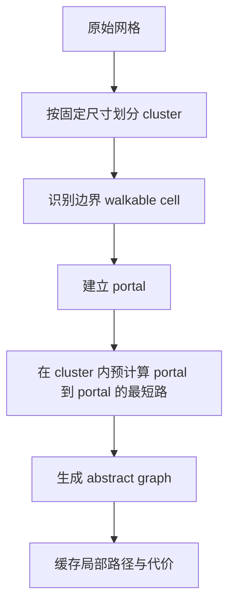
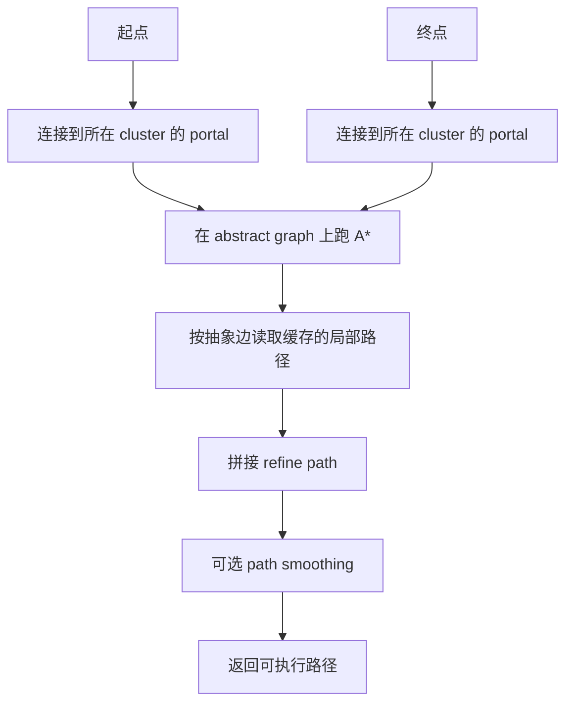

---
title: "游戏与引擎算法 22｜HPA*：层次化寻路"
slug: "algo-22-hpa-star"
date: "2026-04-17"
description: "把 HPA* 的 cluster、portal、abstract graph 和 refine 路线讲透，说明为什么它用预处理和少量内存换来了大图上的查询速度。"
tags:
  - "寻路"
  - "HPA*"
  - "层次化寻路"
  - "抽象图"
  - "portal"
  - "cluster"
  - "游戏AI"
  - "路径规划"
series: "游戏与引擎算法"
weight: 1822
---

一句话本质：HPA* 不是把 A* 换成别的搜索，而是先把大图压成抽象图，再把粗路径逐段下钻回原图。

> 读这篇之前：建议先看 [JPS：Jump Point Search]() 和 [坐标空间变换全景]()。前者是网格在线剪枝，后者是把世界坐标、网格坐标和局部坐标对齐的底层前提。

## 问题动机

A* 在小地图上很稳，但在大地图上会变成“每次都从零开始扫一遍”。
当查询次数只有一两次时，这没什么；当地图很大、单位很多、路径请求持续到来时，A* 的重复工作会迅速吞掉帧预算。

游戏里常见的真实需求不是一次性求完美路径，而是“先给我一个可靠的大方向”。
RTS、小队 AI、开放世界巡逻、动态寻路，都更关心查询延迟和吞吐，而不是把每一条路径都压到绝对最优。

HPA* 的思路是把大问题拆小：先离线把地图压缩成抽象图，在线查询只在抽象层跑 A*。
查询结束后，再把抽象路径逐段细化回可执行的低层路径。

## 历史背景

HPA* 由 Adi Botea、Martin Müller 和 Jonathan Schaeffer 在 2004 年提出，论文是 *Near Optimal Hierarchical Path-Finding*。
它面向的是商业游戏里的现实约束：CPU 紧、内存紧、地图大、动态单位多，而且不能指望每个地图都手工打点。

这篇工作把层次化搜索从“概念正确”推进到“工程可落地”。
它没有依赖特定地形语义，也没有要求设计师手工标注门点或通路，只是直接把网格切成 cluster，再把边界上的 portal 接起来。

后来的工业导航系统虽然不一定直接叫 HPA*，但很多都沿着同一思路演化：先抽象，再 refine。
Recast/Detour 的 navmesh corridor、Unity NavMesh 的区域和链接、以及一些商业路径库里的分层图，本质上都在做“先粗后细”。

## 数学基础

把原图写成图 $G=(V,E)$。
HPA* 做的第一件事是把 $V$ 划分成若干 cluster：
$$
V = \bigcup_{i=1}^{m} C_i, \qquad C_i \cap C_j = \varnothing \ (i\neq j).
$$

每个 cluster 内部再找边界入口，也就是 portal。
这些 portal 构成抽象节点集 $V_A$；抽象边集 $E_A$ 则表示两个 portal 之间存在可行的低层路径，并把这条路径的代价缓存下来。

于是抽象图成为
$$
G_A=(V_A,E_A), \qquad w_A(u,v)=d_{local}(u,v).
$$
这里的 $d_{local}$ 不是欧氏距离，而是 cluster 内部的最短路径代价。

如果把起点和终点插入抽象图，HPA* 其实就在 $G_A$ 上跑 A*。
这一步的关键，是把原图中大量内部格子替换成少量门户节点，让分支因子和搜索深度同时下降。

## 推导：为什么抽象图会更快

A* 的搜索成本可以粗略理解为“展开了多少节点”。
如果原图有 $N$ 个格子，而抽象图只有 $N_A$ 个 portal 节点，且 $N_A \ll N$，那么在线查询就不再直接面对原图规模。

HPA* 的账是这样平衡的：

- 预处理阶段：为每个 cluster 计算 portal 到 portal 的局部最短路。
- 查询阶段：先在抽象图上找一条粗路径，再按段细化。
- 结果：把高频查询从“大搜索”改成“少量大搜索 + 多次很小的局部搜索”。

这不是免费的。
如果 cluster 太大，portal 数会增多，边界插入和局部搜索都会变贵；如果 cluster 太小，抽象图会膨胀，查询又会退回 A*。
所以 HPA* 的本质不是“越抽象越好”，而是“找到一个能让总成本最小的层级粒度”。

## 图示 1：HPA* 的预处理流程



## 图示 2：查询与细化流程



## 算法实现

下面的实现给出 HPA* 的核心骨架：cluster 划分、portal 生成、局部最短路缓存、抽象图搜索和路径细化。
它是单层 HPA* 的完整核心；如果要做多层，只需把抽象图再作为新输入重复构建同样的流程。

```csharp
using System;
using System.Collections.Generic;
using System.Numerics;

public sealed class HpaStarPlanner
{
    private readonly GridMap _map;
    private readonly int _clusterSize;
    private readonly List<Cluster> _clusters = new();
    private readonly List<AbstractNode> _nodes = new();
    private readonly Dictionary<int, List<AbstractEdge>> _edges = new();

    public HpaStarPlanner(GridMap map, int clusterSize)
    {
        if (clusterSize <= 0) throw new ArgumentOutOfRangeException(nameof(clusterSize));
        _map = map ?? throw new ArgumentNullException(nameof(map));
        _clusterSize = clusterSize;
    }

    public void Build()
    {
        _clusters.Clear();
        _nodes.Clear();
        _edges.Clear();

        BuildClusters();
        BuildPortals();
        BuildIntraClusterShortcuts();
    }

    public IReadOnlyList<Vector2Int> FindPath(Vector2Int start, Vector2Int goal)
    {
        Validate(start);
        Validate(goal);
        if (!_map.IsWalkable(start) || !_map.IsWalkable(goal))
            return Array.Empty<Vector2Int>();

        int stableNodeCount = _nodes.Count;
        try
        {
            var startNode = AddTransientEndpoint(start);
            var goalNode = AddTransientEndpoint(goal);
            LinkEndpoint(startNode, start);
            LinkEndpoint(goalNode, goal);

            var abstractPath = SearchAbstractPath(startNode.Id, goalNode.Id);
            if (abstractPath.Count == 0)
                return Array.Empty<Vector2Int>();

            var refined = new List<Vector2Int> { start };
            foreach (var edge in abstractPath)
            {
                var segment = edge.Waypoints;
                for (int i = 1; i < segment.Length; i++)
                    refined.Add(segment[i]);
            }

            return RemoveCollinearDuplicates(refined);
        }
        finally
        {
            CleanupTransientState(stableNodeCount);
        }
    }

    private void BuildClusters()
    {
        int clusterId = 0;
        for (int y = 0; y < _map.Height; y += _clusterSize)
        {
            for (int x = 0; x < _map.Width; x += _clusterSize)
            {
                var bounds = new RectInt(x, y,
                    Math.Min(_clusterSize, _map.Width - x),
                    Math.Min(_clusterSize, _map.Height - y));
                _clusters.Add(new Cluster(clusterId++, bounds));
            }
        }
    }

    private void BuildPortals()
    {
        foreach (var cluster in _clusters)
        {
            foreach (var cell in EnumerateBoundaryCells(cluster.Bounds))
            {
                if (!_map.IsWalkable(cell))
                    continue;

                foreach (var dir in BoundaryDirections(cell, cluster.Bounds))
                {
                    var other = cell + dir;
                    if (!_map.InBounds(other) || !_map.IsWalkable(other))
                        continue;

                    var a = AddNode(cell, cluster.Id);
                    var bClusterId = ClusterIndexOf(other);
                    var b = AddNode(other, bClusterId);
                    AddEdge(a.Id, b.Id, StepCost(cell, other), new[] { cell, other });
                    AddEdge(b.Id, a.Id, StepCost(other, cell), new[] { other, cell });
                    cluster.Portals.Add(a.Id);
                }
            }
        }
    }

    private void BuildIntraClusterShortcuts()
    {
        foreach (var cluster in _clusters)
        {
            var portals = cluster.Portals;
            for (int i = 0; i < portals.Count; i++)
            {
                for (int j = i + 1; j < portals.Count; j++)
                {
                    var from = _nodes[portals[i]].Cell;
                    var to = _nodes[portals[j]].Cell;
                    if (!SameCluster(from, to, cluster.Bounds))
                        continue;

                    var path = RunLocalSearch(cluster.Bounds, from, to);
                    if (path.Count == 0)
                        continue;

                    float cost = PathCost(path);
                    AddEdge(portals[i], portals[j], cost, path.ToArray());
                    AddEdge(portals[j], portals[i], cost, Reverse(path).ToArray());
                }
            }
        }
    }

    private void LinkEndpoint(AbstractNode endpoint, Vector2Int cell)
    {
        var cluster = ClusterAt(cell);
        foreach (var portalId in cluster.Portals)
        {
            var portalCell = _nodes[portalId].Cell;
            var path = RunLocalSearch(cluster.Bounds, cell, portalCell);
            if (path.Count == 0)
                continue;

            AddEdge(endpoint.Id, portalId, PathCost(path), path.ToArray());
            AddEdge(portalId, endpoint.Id, PathCost(path), Reverse(path).ToArray());
        }
    }

    private List<AbstractEdge> SearchAbstractPath(int startId, int goalId)
    {
        var open = new PriorityQueue<int, float>();
        var cameFrom = new Dictionary<int, AbstractEdge>();
        var gScore = new Dictionary<int, float> { [startId] = 0f };
        open.Enqueue(startId, 0f);

        while (open.Count > 0)
        {
            var current = open.Dequeue();
            if (current == goalId)
                return ReconstructAbstractPath(cameFrom, goalId);

            if (!_edges.TryGetValue(current, out var outgoing))
                continue;

            foreach (var edge in outgoing)
            {
                float tentative = gScore[current] + edge.Cost;
                if (gScore.TryGetValue(edge.To, out var known) && known <= tentative)
                    continue;

                gScore[edge.To] = tentative;
                cameFrom[edge.To] = edge with { From = current };
                float h = Heuristic(_nodes[edge.To].Cell, _nodes[goalId].Cell);
                open.Enqueue(edge.To, tentative + h);
            }
        }

        return new List<AbstractEdge>();
    }

    private List<AbstractEdge> ReconstructAbstractPath(Dictionary<int, AbstractEdge> cameFrom, int goalId)
    {
        var path = new List<AbstractEdge>();
        var current = goalId;
        while (cameFrom.TryGetValue(current, out var edge))
        {
            path.Add(edge);
            current = edge.From;
        }
        path.Reverse();
        return path;
    }

    private Cluster ClusterAt(Vector2Int cell)
    {
        int cx = cell.X / _clusterSize;
        int cy = cell.Y / _clusterSize;
        int index = cy * ((_map.Width + _clusterSize - 1) / _clusterSize) + cx;
        return _clusters[index];
    }

    private int ClusterIndexOf(Vector2Int cell)
    {
        int cx = cell.X / _clusterSize;
        int cy = cell.Y / _clusterSize;
        return cy * ((_map.Width + _clusterSize - 1) / _clusterSize) + cx;
    }

    private Cluster ClusterAt(Vector2Int cell, RectInt bounds)
    {
        foreach (var cluster in _clusters)
        {
            if (cluster.Bounds.Contains(cell) && cluster.Bounds.Equals(bounds))
                return cluster;
        }
        throw new InvalidOperationException("Cluster not found.");
    }

    private bool SameCluster(Vector2Int a, Vector2Int b, RectInt bounds) => bounds.Contains(a) && bounds.Contains(b);

    private void AddEdge(int from, int to, float cost, Vector2Int[] waypoints)
    {
        if (!_edges.TryGetValue(from, out var list))
        {
            list = new List<AbstractEdge>();
            _edges[from] = list;
        }
        list.Add(new AbstractEdge(from, to, cost, waypoints));
    }

    private AbstractNode AddNode(Vector2Int cell, int clusterId)
    {
        var node = new AbstractNode(_nodes.Count, cell, clusterId, transient: false);
        _nodes.Add(node);
        return node;
    }

    private AbstractNode AddTransientEndpoint(Vector2Int cell)
    {
        var node = new AbstractNode(_nodes.Count, cell, clusterId: -1, transient: true);
        _nodes.Add(node);
        return node;
    }

    private void CleanupTransientState(int stableNodeCount)
    {
        if (_nodes.Count > stableNodeCount)
        {
            _nodes.RemoveRange(stableNodeCount, _nodes.Count - stableNodeCount);
        }

        var transientIds = new HashSet<int>();
        foreach (var key in _edges.Keys)
        {
            if (key >= stableNodeCount)
                transientIds.Add(key);
        }

        foreach (var key in transientIds)
            _edges.Remove(key);

        foreach (var kv in _edges)
            kv.Value.RemoveAll(edge => edge.To >= stableNodeCount);
    }

    private IEnumerable<Vector2Int> EnumerateBoundaryCells(RectInt bounds)
    {
        for (int x = bounds.X; x < bounds.Right; x++)
        {
            yield return new Vector2Int(x, bounds.Y);
            yield return new Vector2Int(x, bounds.Bottom - 1);
        }
        for (int y = bounds.Y + 1; y < bounds.Bottom - 1; y++)
        {
            yield return new Vector2Int(bounds.X, y);
            yield return new Vector2Int(bounds.Right - 1, y);
        }
    }

    private IEnumerable<Vector2Int> BoundaryDirections(Vector2Int cell, RectInt bounds)
    {
        if (cell.X == bounds.X) yield return new Vector2Int(-1, 0);
        if (cell.X == bounds.Right - 1) yield return new Vector2Int(1, 0);
        if (cell.Y == bounds.Y) yield return new Vector2Int(0, -1);
        if (cell.Y == bounds.Bottom - 1) yield return new Vector2Int(0, 1);
    }

    private List<Vector2Int> RunLocalSearch(RectInt bounds, Vector2Int start, Vector2Int goal)
    {
        var open = new PriorityQueue<Vector2Int, float>();
        var cameFrom = new Dictionary<Vector2Int, Vector2Int>();
        var gScore = new Dictionary<Vector2Int, float> { [start] = 0f };
        open.Enqueue(start, 0f);

        while (open.Count > 0)
        {
            var current = open.Dequeue();
            if (current == goal)
                return ReconstructLocalPath(cameFrom, current, start);

            foreach (var next in Neighbors(current, bounds))
            {
                float tentative = gScore[current] + StepCost(current, next);
                if (gScore.TryGetValue(next, out var known) && known <= tentative)
                    continue;

                gScore[next] = tentative;
                cameFrom[next] = current;
                open.Enqueue(next, tentative + Heuristic(next, goal));
            }
        }

        return new List<Vector2Int>();
    }

    private List<Vector2Int> ReconstructLocalPath(Dictionary<Vector2Int, Vector2Int> cameFrom, Vector2Int current, Vector2Int start)
    {
        var path = new List<Vector2Int> { current };
        while (current != start && cameFrom.TryGetValue(current, out var prev))
        {
            current = prev;
            path.Add(current);
        }
        path.Reverse();
        return path;
    }

    private IEnumerable<Vector2Int> Neighbors(Vector2Int cell, RectInt bounds)
    {
        foreach (var dir in Directions.All8)
        {
            var next = cell + dir;
            if (!bounds.Contains(next) || !_map.IsWalkable(next))
                continue;
            if (dir.X != 0 && dir.Y != 0 && (!_map.IsWalkable(new Vector2Int(cell.X + dir.X, cell.Y)) || !_map.IsWalkable(new Vector2Int(cell.X, cell.Y + dir.Y))))
                continue;
            yield return next;
        }
    }

    private float Heuristic(Vector2Int a, Vector2Int b)
    {
        int dx = Math.Abs(a.X - b.X);
        int dy = Math.Abs(a.Y - b.Y);
        int min = Math.Min(dx, dy);
        int max = Math.Max(dx, dy);
        return (max - min) + min * 1.41421356f;
    }

    private float StepCost(Vector2Int a, Vector2Int b)
    {
        int dx = Math.Abs(a.X - b.X);
        int dy = Math.Abs(a.Y - b.Y);
        return (dx == 1 && dy == 1) ? 1.41421356f : 1f;
    }

    private float PathCost(List<Vector2Int> path)
    {
        float cost = 0f;
        for (int i = 1; i < path.Count; i++)
            cost += StepCost(path[i - 1], path[i]);
        return cost;
    }

    private List<Vector2Int> RemoveCollinearDuplicates(List<Vector2Int> path)
    {
        if (path.Count <= 2)
            return path;

        var result = new List<Vector2Int> { path[0] };
        for (int i = 1; i < path.Count - 1; i++)
        {
            var a = result[^1];
            var b = path[i];
            var c = path[i + 1];
            if ((b.X - a.X) * (c.Y - b.Y) == (b.Y - a.Y) * (c.X - b.X))
                continue;
            result.Add(b);
        }
        result.Add(path[^1]);
        return result;
    }

    private List<Vector2Int> Reverse(List<Vector2Int> path)
    {
        var copy = new List<Vector2Int>(path);
        copy.Reverse();
        return copy;
    }

    private void Validate(Vector2Int cell)
    {
        if (!_map.InBounds(cell))
            throw new ArgumentOutOfRangeException(nameof(cell));
    }

    private sealed record AbstractNode(int Id, Vector2Int Cell, int ClusterId, bool Transient);
    private sealed record AbstractEdge(int From, int To, float Cost, Vector2Int[] Waypoints);
    private sealed class Cluster
    {
        public Cluster(int id, RectInt bounds)
        {
            Id = id;
            Bounds = bounds;
        }

        public int Id { get; }
        public RectInt Bounds { get; }
        public List<int> Portals { get; } = new();
    }
}

public readonly record struct RectInt(int X, int Y, int Width, int Height)
{
    public int Right => X + Width;
    public int Bottom => Y + Height;
    public bool Contains(Vector2Int p) => (uint)(p.X - X) < (uint)Width && (uint)(p.Y - Y) < (uint)Height;
}

public readonly record struct Vector2Int(int X, int Y)
{
    public static Vector2Int operator +(Vector2Int a, Vector2Int b) => new(a.X + b.X, a.Y + b.Y);
}

public sealed class GridMap
{
    private readonly bool[,] _walkable;

    public GridMap(bool[,] walkable) => _walkable = walkable ?? throw new ArgumentNullException(nameof(walkable));
    public int Width => _walkable.GetLength(0);
    public int Height => _walkable.GetLength(1);
    public bool InBounds(Vector2Int p) => (uint)p.X < (uint)Width && (uint)p.Y < (uint)Height;
    public bool IsWalkable(Vector2Int p) => InBounds(p) && _walkable[p.X, p.Y];
}

public static class Directions
{
    public static readonly Vector2Int[] All8 =
    {
        new(1, 0), new(-1, 0), new(0, 1), new(0, -1),
        new(1, 1), new(1, -1), new(-1, 1), new(-1, -1)
    };
}
```

这段代码故意做了三层分离：

- `Build*` 负责离线构建。
- `SearchAbstractPath` 负责在线粗搜。
- `RunLocalSearch` 负责 cluster 内的细化。

如果后续要扩成多层层级，最自然的做法不是重新发明第二套逻辑，而是把抽象图再喂回同一套 `Build` / `SearchAbstractPath` 框架。

## 复杂度分析

HPA* 的总成本要拆成两段看。

预处理阶段，主要开销是 cluster 内局部最短路缓存。
如果 cluster 尺寸固定、portal 数量有上界，那么它可以近似看成对整张地图做一次线性到超线性的离线构建，但这笔钱只付一次。

查询阶段，搜索的主体发生在抽象图上。
因此在线复杂度更接近 $O(|V_A|\log |V_A|)$ 加上少量局部 refine 的成本，而不是原图的 $O(|V|\log |V|)$。
这就是 HPA* 真正的利润来源：把昂贵的全图搜索换成便宜的抽象搜索。

## 变体与优化

HPA* 的关键调参点有三个。

- cluster size：决定抽象层的粗细。
- portal 数量：决定抽象图的分支因子。
- 层级深度：决定预处理和查询的分摊方式。

常见优化包括：

- 只缓存高频 portal 对的局部路径。
- 对 cluster 做可达性预筛，避免给不连通的边界对建边。
- 用 bitset 和紧凑数组存 portal 路径，减少缓存 miss。
- 对动态障碍做局部失效重建，而不是全图重算。

工程上，最重要的不是把 hierarchy 做得多深，而是让边界数据足够小、局部搜索足够快、重建足够局部。

## 对比其他算法

| 算法 | 最优性 | 预处理 | 查询速度 | 典型场景 |
|---|---|---|---|---|
| A* | 保证最优 | 无 | 中等到慢 | 小图、一次性查询 |
| JPS | 保证最优 | 无 | 很快 | 均匀网格、对称性强 |
| HPA* | 近似最优到最优取决于实现 | 有 | 很快 | 大图、多次查询、可接受抽象误差 |
| NavMesh + Funnel | 通常很自然地接近最优 | 有构建 | 查询和 refine 都快 | 3D 地形、非网格世界 |

HPA* 和 JPS 的区别很明显。
JPS 是“在线剪枝”，HPA* 是“先压缩，再搜索”。
前者不碰地图结构，后者直接改造搜索空间。

## 批判性讨论

HPA* 不是免费午餐。
它本质上是在用空间和预处理时间买查询速度。
如果你的地图很小，或者路径请求很少，预处理的投入不一定回本。

它还有一个老问题：cluster 划分不是万能的。
边界太密，portal 太多，抽象图会膨胀；边界太稀，局部细化会过重。
所以 HPA* 的质量非常依赖层级参数，而这些参数往往要根据地图和负载实测调出来。

另一个限制是动态地图。
如果障碍更新太频繁，抽象图和局部缓存会不断失效，HPA* 的优势会被维护成本吃掉。
这时纯在线算法或更局部化的重建策略往往更稳。

## 跨学科视角

HPA* 很像计算机体系结构里的缓存层级。
cluster 是 L1/L2 的粗分块，portal cache 是“热数据”，局部 refine 则像 cache miss 后的回退访问。
它成功的前提，不是总工作量最小，而是命中率高、平均访问代价低。

它也像多分辨率图像处理。
低分辨率先找到大方向，高分辨率只负责局部修边。
这就是 mipmap / multigrid 的同一种思路，只是对象从像素换成了可走空间。

## 真实案例

- [Near Optimal Hierarchical Path-Finding](https://webdocs.cs.ualberta.ca/~jonathan/publications/ai_publications/jogd.pdf) 是 HPA* 的原始论文，明确给出 cluster / portal / refinement 的结构，并报告了大幅减少搜索展开、路径质量接近最优的实验结果。
- [University of Alberta 的 HPA* 项目页](https://webdocs.cs.ualberta.ca/~games/pathfind/) 直接把 HPA* 作为可下载的软件包，说明这套方法不只是论文概念，而是可运行的路径规划系统。
- [HOG: hpaStar class reference](https://webdocs.cs.ualberta.ca/~nathanst/hog/classhpa_star.html) 和 [clusterAbstraction class reference](https://webdocs.cs.ualberta.ca/~nathanst/hog/classcluster_abstraction.html) 给出了 HPA* 的类接口，能看到它如何把抽象图搜索、路径细化和路径平滑拆成独立步骤。
- [Recast Navigation](https://recastnav.com/) 和 [recastnavigation/recastnavigation 仓库中的 Detour 模块](https://github.com/recastnavigation/recastnavigation/tree/main/Detour) 说明工业级导航系统普遍采用“先建粗导航结构，再做局部查询和 corridor refine”的思路，这和 HPA* 的核心路线非常接近。
- [Unity NavMesh 文档](https://docs.unity3d.com/es/current/ScriptReference/AI.NavMesh.html) 和 [NavMeshComponents 仓库](https://github.com/Unity-Technologies/NavMeshComponents) 则说明在 Unity 生态里，离线/在线导航构建、区域成本和连接器也都是成熟的工业方案。
- [Aron Granberg 的 HierarchicalGraph](https://arongranberg.com/astar/documentation/test/hierarchicalgraph.html) 提供了层次化图结构的工程实现，虽然目的不完全等同于 HPA*，但说明层次化导航数据结构在实际项目里是成熟路线。

## 量化数据

HPA* 论文给出的最核心数字很直接：在作者的实验里，相比高度优化过的 A*，HPA* 的查询速度最高可达 10 倍提升，而路径质量在平滑后通常保持在最优值的 1% 以内。

论文中的示例也能看出层级压缩的效果：一个 40×40 的迷宫例子里，低层 A* 需要展开 1462 个节点，而抽象层方案可以把总展开压到 83 或 48 个量级，取决于层级深度。
另一组 Baldur’s Gate 数据里，低层 A* 的平均 open list 大小是 51.24，而层次化方案的主搜索和细化阶段分别降到 17.23、4.50 和 5.48 左右。

这些数字说明了 HPA* 的真实利润点：它并不一定让每一次局部搜索都更聪明，但它让“真正需要全局搜索的节点数”变少了很多。

## 常见坑

- cluster 切得太大。为什么错：portal 和边界搜索变重，局部路径缓存也更难复用。怎么改：先从固定中等尺寸开始压测，再按地图类型调参。
- cluster 切得太小。为什么错：抽象图变得几乎和原图一样大，层次化收益消失。怎么改：不要凭感觉切，按查询吞吐和缓存命中率选点。
- 只缓存距离，不缓存路径。为什么错：在线还得重跑局部搜索，细化阶段会反吃掉 HPA* 的优势。怎么改：缓存 portal 对的 waypoints 或至少缓存 predecessor 链。
- 动态障碍只改了低层，没有失效抽象边。为什么错：抽象图会给出已经失效的路径。怎么改：把 cluster 作为失效单元，局部重建抽象边和缓存。
- refine 后不做碰撞/可行性复核。为什么错：抽象路径可能在局部层面贴边太紧。怎么改：保持与实际移动规则一致的后处理。

## 何时用 / 何时不用

适合用 HPA* 的情况：

- 地图很大，且查询很多。
- 你能接受离线预处理和一点额外内存。
- 地图结构相对稳定，或动态更新可以局部化。

不适合用 HPA* 的情况：

- 图很小，A* 已经足够快。
- 你的地图会频繁大范围改动，缓存不断失效。
- 你已经在用高质量 navmesh，并且查询模式更像 corridor navigation，而不是网格最短路。

## 相关算法

- [JPS：Jump Point Search]()
- [坐标空间变换全景]()
- [浮点精度与数值稳定性]()
- [Morton 编码与 Z-Order]()

## 小结

HPA* 的核心价值不是“更聪明地搜一张图”，而是“不要每次都在整张图上搜”。
它把离线预处理、抽象图搜索和局部细化拆开，使得大地图上的高频查询能够稳定地落进一个可控的成本区间。

如果说 JPS 是在网格上砍掉对称性，HPA* 就是在地图上砍掉层级冗余。
两者都保留了最短路的核心直觉，但它们优化的层面不同：一个改展开，一个改规模。

## 参考资料

- [Near Optimal Hierarchical Path-Finding（原论文）](https://webdocs.cs.ualberta.ca/~jonathan/publications/ai_publications/jogd.pdf)
- [University of Alberta Pathfinding / HPA* 项目页](https://webdocs.cs.ualberta.ca/~games/pathfind/)
- [HOG: hpaStar class reference](https://webdocs.cs.ualberta.ca/~nathanst/hog/classhpa_star.html)
- [HOG: clusterAbstraction class reference](https://webdocs.cs.ualberta.ca/~nathanst/hog/classcluster_abstraction.html)
- [Recast Navigation official site](https://recastnav.com/)
- [recastnavigation/recastnavigation: Detour module](https://github.com/recastnavigation/recastnavigation/tree/main/Detour)
- [Unity NavMesh scripting API](https://docs.unity3d.com/es/current/ScriptReference/AI.NavMesh.html)
- [Unity-Technologies/NavMeshComponents](https://github.com/Unity-Technologies/NavMeshComponents)
- [Aron Granberg HierarchicalGraph docs](https://arongranberg.com/astar/documentation/test/hierarchicalgraph.html)

