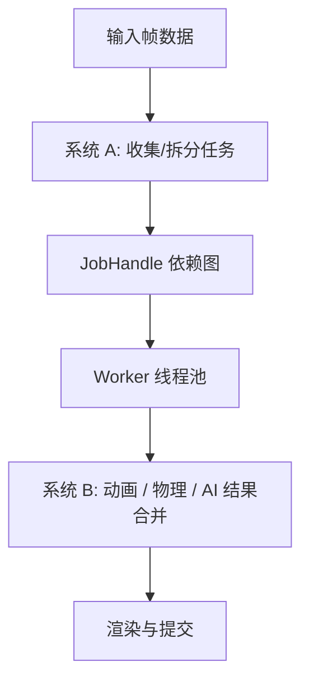
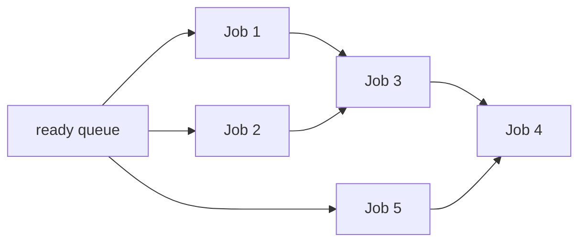

---
title: "游戏与引擎算法 23｜Job System 原理"
slug: "algo-23-job-system"
date: "2026-04-17"
description: "讲清楚 Job System 为什么不是简单线程池：它如何把 fork-join、task graph、ECS/DOTS、依赖图和 cache locality 绑成一套可落地的并行模型。"
tags:
  - "Job System"
  - "fork-join"
  - "task graph"
  - "ECS"
  - "DOTS"
  - "并发"
  - "缓存局部性"
  - "游戏引擎"
series: "游戏与引擎算法"
weight: 1823
---

一句话本质：Job System 不是“把代码丢给别的线程跑”，而是把计算拆成可调度的任务 DAG，再让调度器用更少同步、更好局部性和更低分配成本把它们跑完。

> 读这篇之前：建议先看 [刚体动力学]()、[约束求解：Sequential Impulse 与 PBD]() 和 [SIMD 数学：Vector4 / Matrix4 向量化]()。Job System 的价值，最后都会落到“把一批同构数据更快地处理完”。

## 问题动机

游戏引擎里最贵的从来不是“计算本身”，而是“把计算组织成能稳定跑在多核上的形状”。
如果每个系统都自己开线程，最后得到的通常是锁、抖动、优先级反转和一堆难复现的 race condition。

引擎需要的也不是“线程自由”，而是“帧自由”。
在 16.6 ms 的预算里，渲染、动画、物理、AI、音频和资源流都在抢时间，任何一个系统把主线程卡住，整帧就一起掉。

Job System 的出发点是把“要做的工作”从“执行它的线程”里剥离出来。
谁来执行不重要，什么时候依赖满足才重要，数据是否连续、是否可并行才真正重要。

## 历史背景

并行调度的核心思想比游戏引擎早得多。
学术界最早把这类问题形式化时，用的是 fork-join 计算模型和 work stealing 调度器。
这套思路后来进入通用并行库，再被游戏引擎改造成更偏数据流和帧预算的 Job System。

Unity 在 2018 年公开 C# Job System，并把它和 Burst、ECS/DOTS 合起来，形成了“数据布局、编译器优化、任务调度”三位一体的路线。
Unreal 的 Task Graph 则是另一条工业路径：它不强调用户显式管理线程，而是强调任务依赖和执行线程的分离。

Rayon、oneTBB 和 Bevy tasks 说明了一件事：Job System 不是 Unity 独有概念，而是现代高性能并行编程的共同答案。
游戏只是最苛刻的应用场景之一，因为它同时要求低延迟、可预测、跨平台、易调试。

## 数学与理论基础

把 Job System 看成一张有向无环图 $G=(V,E)$ 最清楚。
每个 job 是一个节点，每条边表示依赖关系：只有前置 job 完成后，后续 job 才能进入 ready 状态。

这类计算常用两个量描述。
总工作量 $T_1$ 表示顺序执行所需时间，临界路径长度 $T_\infty$ 表示无限处理器下的最短完成时间，也叫 span。
对任意 $P$ 个处理器，理想下界是
$$
T_P \ge \max\left(\frac{T_1}{P},\ T_\infty\right).
$$

这条式子解释了 Job System 的核心策略。
它不会神奇地减少总工作量，但可以尽量让更多工作并行，同时避免把同步点拉得太密。
真正好的任务划分，是让 $T_\infty$ 尽量短、让每个任务的粒度足够大、让调度开销远小于任务自身的计算量。

从缓存角度看，单次 job 的总成本更像
$$
C \approx C_{compute} + m_{L1}L_{L1} + m_{L2}L_{L2} + m_{sync}L_{sync},
$$
其中 $m$ 是 miss 或同步次数，$L$ 是对应延迟。
Job System 之所以强调 chunk、SoA、NativeArray 和 chunk iteration，本质上就是在压低这几个项。

## 从 fork-join 到 task graph

最朴素的并行模型是 fork-join：把一个大任务拆成若干子任务，最后再 join 回来。
这个模型很适合递归分治，但不够表达现实引擎里的复杂依赖。

真实引擎里，物理可能依赖动画，AI 可能依赖导航，渲染准备又依赖前面两者的结果。
这已经不是一棵树，而是一张 DAG。
Job System 的调度器，实际上就是在持续找 zero indegree 的节点，也就是那些前置依赖已经满足的 ready job。

Task graph 解决的不是“能不能并行”，而是“并行的合法边界在哪里”。
这也是为什么 Unity 的 `JobHandle`、Unreal 的 `FGraphEvent`、oneTBB 的任务依赖、Rayon 的 `join`，最后都绕回同一个问题：谁先完成，谁才能放行后继。

## ECS/DOTS 为什么和 Job System 天然匹配

如果数据是 AoS，对象指针到处跳，job 再多也只是在放大 cache miss。
如果数据是 SoA 或 chunk 化的 archetype store，那么一个 job 可以连续处理一大段同构数据，硬件预取器才有机会工作。

这就是 ECS 和 Job System 绑在一起的原因。
ECS 负责把实体数据按组件类型和 archetype 排好，Job System 负责把遍历这批连续内存的工作分发到 worker 线程。
当系统读取和写入的组件集合有依赖关系时，框架还能自动把这些依赖串起来，避免用户手动做同步。

从工程视角看，这一步比“多开线程”更重要。
如果数据布局不对，调度再聪明也只是把随机访问搬到多个线程上一起随机访问。

## 图示 1：ECS + Job System 的典型流水线



## 图示 2：任务 DAG 与 ready queue



## 算法推导

先把最简单的线程池想成“给线程喂活”。
这个模型的问题是，线程不知道任务之间的依赖，也不知道什么时候该停、什么时候该拆。
结果往往是长任务占满一个线程，短任务在另一个线程里等待，负载不均衡。

Job System 的改进是给每个 job 记录 `remainingDependencies`。
依赖没满足时，job 处于 blocked；一旦计数归零，它就变成 ready 并进入就绪队列。
这等于把“等待”从线程层面移到任务层面，线程不必在阻塞里空转。

再往前一步，是任务粒度控制。
如果一个 job 太细，调度成本和同步成本会吃掉收益；如果太粗，负载均衡变差，core 会出现长尾。
所以 Job System 经常把一个大循环切成若干 batch，让每个 batch 大到足以摊平调度开销，小到足以维持负载平衡。

## 算法实现

下面的实现把 Job System 的核心拆成三层：
`JobHandle` 表示依赖句柄，`JobNode` 表示任务节点，`JobScheduler` 负责依赖驱动和 worker 调度。
它没有借助 `Task.Run`，而是直接展示“依赖计数 + ready queue + worker loop”的结构。

```csharp
using System;
using System.Collections.Concurrent;
using System.Collections.Generic;
using System.Threading;

public sealed class JobScheduler : IDisposable
{
    private readonly ConcurrentQueue<JobNode> _ready = new();
    private readonly AutoResetEvent _signal = new(false);
    private readonly Thread[] _workers;
    private readonly object _graphLock = new();
    private readonly CancellationTokenSource _cts = new();
    private int _nextId;

    public JobScheduler(int workerCount)
    {
        if (workerCount <= 0) throw new ArgumentOutOfRangeException(nameof(workerCount));
        _workers = new Thread[workerCount];
        for (int i = 0; i < workerCount; i++)
        {
            _workers[i] = new Thread(WorkerLoop) { IsBackground = true, Name = $"JobWorker#{i}" };
            _workers[i].Start();
        }
    }

    public JobHandle Schedule(Action work, params JobHandle[] dependencies)
    {
        if (work is null) throw new ArgumentNullException(nameof(work));
        dependencies ??= Array.Empty<JobHandle>();

        var node = new JobNode(Interlocked.Increment(ref _nextId), work);

        lock (_graphLock)
        {
            node.RemainingDependencies = dependencies.Length;
            foreach (var dep in dependencies)
            {
                if (dep.Node is null) continue;
                dep.Node.Dependents.Add(node);
            }

            if (node.RemainingDependencies == 0)
                EnqueueReady(node);
        }

        return new JobHandle(node);
    }

    public JobHandle ScheduleParallelFor(int startInclusive, int endExclusive, int batchSize, Action<int, int> body, params JobHandle[] dependencies)
    {
        if (body is null) throw new ArgumentNullException(nameof(body));
        if (batchSize <= 0) throw new ArgumentOutOfRangeException(nameof(batchSize));
        if (endExclusive < startInclusive) throw new ArgumentException("Invalid range.");

        var batchHandles = new List<JobHandle>();
        for (int start = startInclusive; start < endExclusive; start += batchSize)
        {
            int from = start;
            int to = Math.Min(start + batchSize, endExclusive);
            batchHandles.Add(Schedule(() => body(from, to), dependencies));
        }

        return batchHandles.Count == 0
            ? Schedule(() => { }, dependencies)
            : Combine(batchHandles.ToArray());
    }

    public JobHandle Combine(params JobHandle[] handles)
    {
        handles ??= Array.Empty<JobHandle>();
        return Schedule(() => { }, handles);
    }

    public void Complete(JobHandle handle)
    {
        if (handle.Node is null) return;
        handle.Node.Completed.Wait();
    }

    private void EnqueueReady(JobNode node)
    {
        _ready.Enqueue(node);
        _signal.Set();
    }

    private void WorkerLoop()
    {
        while (!_cts.IsCancellationRequested)
        {
            if (_ready.TryDequeue(out var node))
            {
                Execute(node);
                continue;
            }

            _signal.WaitOne(1);
        }
    }

    private void Execute(JobNode node)
    {
        try
        {
            node.Work();
        }
        finally
        {
            node.Completed.Set();
            ReleaseDependents(node);
        }
    }

    private void ReleaseDependents(JobNode node)
    {
        lock (_graphLock)
        {
            foreach (var dependent in node.Dependents)
            {
                if (Interlocked.Decrement(ref dependent.RemainingDependencies) == 0)
                    EnqueueReady(dependent);
            }
            node.Dependents.Clear();
        }
    }

    public void Dispose()
    {
        _cts.Cancel();
        _signal.Set();
        foreach (var worker in _workers)
            worker.Join();
        _signal.Dispose();
        _cts.Dispose();
    }

    public sealed class JobHandle
    {
        internal JobHandle(JobNode node) => Node = node;
        internal JobNode? Node { get; }
        public void Complete() => Node?.Completed.Wait();
    }

    private sealed class JobNode
    {
        public JobNode(int id, Action work)
        {
            Id = id;
            Work = work;
        }

        public int Id { get; }
        public Action Work { get; }
        public List<JobNode> Dependents { get; } = new();
        public int RemainingDependencies;
        public ManualResetEventSlim Completed { get; } = new(false);
    }
}
```

这个实现刻意保留了三个引擎里都很重要的点。
第一，任务不依赖“主线程轮询完成”，而是依赖图驱动。
第二，`ScheduleParallelFor` 体现了 batch 粒度控制。
第三，`Combine` 把多个局部任务收束成一个完成句柄，和 ECS 里的系统依赖完全同构。

## 复杂度分析

如果把 job 图看成 DAG，调度本身的理论复杂度接近 $O(|V| + |E|)$，因为每个节点只会被就绪一次，每条依赖边只会在释放时处理一次。
真正的成本不是这部分，而是任务执行时间、同步开销和缓存失效率。

当任务粒度过细时，总运行时间会被 `enqueue/dequeue + wakeup + dependency bookkeeping` 放大。
当任务粒度过粗时，局部不平衡会抬高 span，最后把并行度吃掉。
所以 Job System 的实际复杂度，更像是“理论 DAG 复杂度 + 负载均衡损失 + 内存局部性损失”。

## 变体与优化

最常见的变体有四类。

- Work stealing 线程池：每个 worker 维护本地队列，空闲时去别人的队列偷。
- Task graph runtime：把依赖显式建图，系统根据依赖解锁任务。
- ECS chunk job：按 chunk 或 archetype 批处理，尽量顺序扫内存。
- Fiber / coroutine 任务：把任务挂起点交给调度器，适合高延迟 IO 或大规模异步。

优化手段也很明确。

- 把小任务合并成 batch，减少调度开销。
- 让读写组件按 chunk 连续访问，减少 cache miss。
- 避免在 job 里做动态分配和字符串拼接。
- 尽量让依赖图稀疏，减少同步点。
- 给热数据做 cache line 对齐，避免 false sharing。

## 对比其他方案

| 方案 | 优点 | 缺点 | 适合场景 |
|---|---|---|---|
| 原始线程 | 简单直接 | 资源开销大，调度粗糙 | 长生命周期后台线程 |
| 线程池 | 复用线程 | 只解决“线程重用”，不解决依赖图 | 轻量后台任务 |
| Fork-Join | 好理解 | 对复杂依赖表达力弱 | 递归分治 |
| Task Graph / Job System | 依赖清晰，易做帧级调度 | 需要设计任务粒度和数据布局 | 引擎系统、ECS、物理、动画 |
| Actor / 消息传递 | 降低共享状态 | 通信复杂，延迟不稳定 | 网络、AI、高并发服务 |

Job System 和线程池最容易被混为一谈。
线程池只回答“谁来跑”，Job System 还回答“什么先跑、什么能并行、什么该合并”。

## 批判性讨论

Job System 不是银弹。
如果你的工作本来就是强串行，比如单一状态机、长锁保护临界区，强行 job 化只会增加复杂度。
如果数据结构还是对象图、虚表、指针链，那并行只是把缓存失配复制到多核。

另一个常见误区是“把所有东西都拆成 job 就更快”。
实际上，调度器的吞吐、依赖图规模和 cache miss 会一起决定结果，过度碎片化往往比单线程更慢。

最后，Job System 解决的是 CPU 侧并行，不解决设计层耦合。
如果系统之间的数据流本来就乱，先重构数据边界，再谈 job 化，通常更有效。

## 跨学科视角

Job System 和编译器的 basic block 调度很像。
都要找 ready 节点，都要尽量拉长局部连续执行段，都要在依赖边允许的范围内推迟或提前一些操作。

它也像数据库查询计划。
planner 不会盲目执行 SQL，而是先把依赖、选择、投影和连接的顺序排出来，再找一个代价更低的执行计划。
Job System 的调度，本质上也是在做代价估计和执行计划选择。

## 真实案例

- [Unity C# Job System Manual](https://docs.unity3d.com/ja/2021.3/Manual/JobSystem.html) 说明 Unity 的 Job System 直接和 Unity Engine 的 worker threads 集成，并配合 Burst 和 ECS 使用。
- [Unity Entities: Use the job system with Entities](https://docs.unity.cn/Packages/com.unity.entities%401.3/manual/systems-scheduling-jobs.html) 说明 ECS 会追踪系统间读写依赖，并把 `Dependency` 链接到前序作业，正是任务图调度的标准用法。
- [Unreal Engine Task Graph API](https://dev.epicgames.com/documentation/en-us/unreal-engine/API/Runtime/Core/Async/FTaskGraphInterface) 和 [TGraphTask::ExecuteTask](https://dev.epicgames.com/documentation/en-us/unreal-engine/API/Runtime/Core/Async/TGraphTask/ExecuteTask) 显示 Unreal 用任务图接口管理任务创建、入队和执行线程，而不是让用户直接管理裸线程。
- [Rayon](https://docs.rs/crate/rayon/1.9.0) 以 `join` 和 `par_iter` 体现 fork-join 风格的任务并行，适合递归分治和数据并行。
- [oneTBB How Task Scheduler Works](https://uxlfoundation.github.io/oneTBB/main/tbb_userguide/How_Task_Scheduler_Works.html) 明确讲了 depth-first / breadth-first 的平衡、任务局部性和工作窃取队列的交互。
- [Bevy Tasks](https://docs.rs/bevy/latest/bevy/tasks/) 说明 Bevy 用轻量线程池支持 scoped fork-join，并按任务类型分成多个池，这和游戏引擎对 latency 的分层管理非常接近。

## 量化数据

并行任务的理论下界可以写成 $T_P \ge \max(T_1/P, T_\infty)$。
它告诉我们：单靠加线程，不能突破临界路径；单靠缩任务，也不能无限降低同步成本。

oneTBB 的调度器文档明确强调 depth-first 执行能让“热任务”留在 cache 里，同时避免 breadth-first 把同时在活跃的任务数推到指数级。
这不是一个具体 benchmark 数字，但它把 Job System 的性能来源说得很清楚：减少活跃状态的宽度，保住局部性。

在更广义的 work stealing 研究里，Microsoft 的 interactive-services work-stealing 扩展报告了在目标延迟场景下最高 58% 的相对改善。
这说明调度策略不是中性的：同样是 work stealing，任务是否面向 latency，是否允许局部帮助，结果会差很多。

## 常见坑

- 任务太细。为什么错：调度和同步开销吞掉并行收益。怎么改：提高 batch size，让每个 job 至少覆盖一段连续数据。
- 任务还在访问对象图。为什么错：并行化后 cache miss 和虚函数跳转更严重。怎么改：先搬数据到 chunk / SoA，再 job 化。
- 忽略依赖。为什么错：读写冲突会让结果时序不确定。怎么改：用 `JobHandle` 或 task graph 显式串起依赖。
- 在 job 里分配大量 GC 对象。为什么错：分配器和 GC 会变成跨线程瓶颈。怎么改：用池化、NativeContainer 或预分配缓冲。
- 把主线程 API 直接塞进 job。为什么错：大多数引擎 API 不是线程安全的。怎么改：把纯计算和引擎提交拆开。

## 何时用 / 何时不用

适合用 Job System 的情况：

- 同类数据量大，适合批处理。
- 系统之间有明确的依赖图。
- 你需要把每帧工作稳定地铺到多核上。

不适合用 Job System 的情况：

- 任务粒度很大但数量很少，线程池就够。
- 依赖关系极其复杂而且频繁变化，建图本身就太贵。
- 工作主要是 IO、等待或外部服务调用，异步模型更合适。

## 相关算法

- [Work Stealing 调度]()
- [数值积分：Euler、Verlet、RK4]()
- [刚体动力学]()
- [约束求解：Sequential Impulse 与 PBD]()
- [SIMD 数学：Vector4 / Matrix4 向量化]()

## 小结

Job System 的本质不是线程，而是依赖图和数据布局。
线程只是执行资源，真正决定并行上限的是 DAG 的 span、任务粒度和缓存局部性。

如果你把它只理解成“线程池加安全封装”，最后写出来的会是一个更难用的线程池。
如果你把它理解成“用任务图组织引擎系统”，它才会变成 DOTS、TaskGraph、Rayon、oneTBB 这类现代并行框架的共同语言。

## 参考资料

- [Unity C# Job System Manual](https://docs.unity3d.com/ja/2021.3/Manual/JobSystem.html)
- [Unity Entities: Use the job system with Entities](https://docs.unity.cn/Packages/com.unity.entities%401.3/manual/systems-scheduling-jobs.html)
- [Unity DOTS / Entities overview](https://docs.unity.cn/Packages/com.unity.entities%401.3/manual/index.html)
- [Unreal Engine Task Graph API](https://dev.epicgames.com/documentation/en-us/unreal-engine/API/Runtime/Core/Async/FTaskGraphInterface)
- [TGraphTask::ExecuteTask](https://dev.epicgames.com/documentation/en-us/unreal-engine/API/Runtime/Core/Async/TGraphTask/ExecuteTask)
- [Rayon docs](https://docs.rs/crate/rayon/1.9.0)
- [oneTBB: How Task Scheduler Works](https://uxlfoundation.github.io/oneTBB/main/tbb_userguide/How_Task_Scheduler_Works.html)
- [oneTBB memory allocation and false sharing](https://uxlfoundation.github.io/oneTBB/main/tbb_userguide/Memory_Allocation.html)
- [Bevy Tasks](https://docs.rs/bevy/latest/bevy/tasks/)
