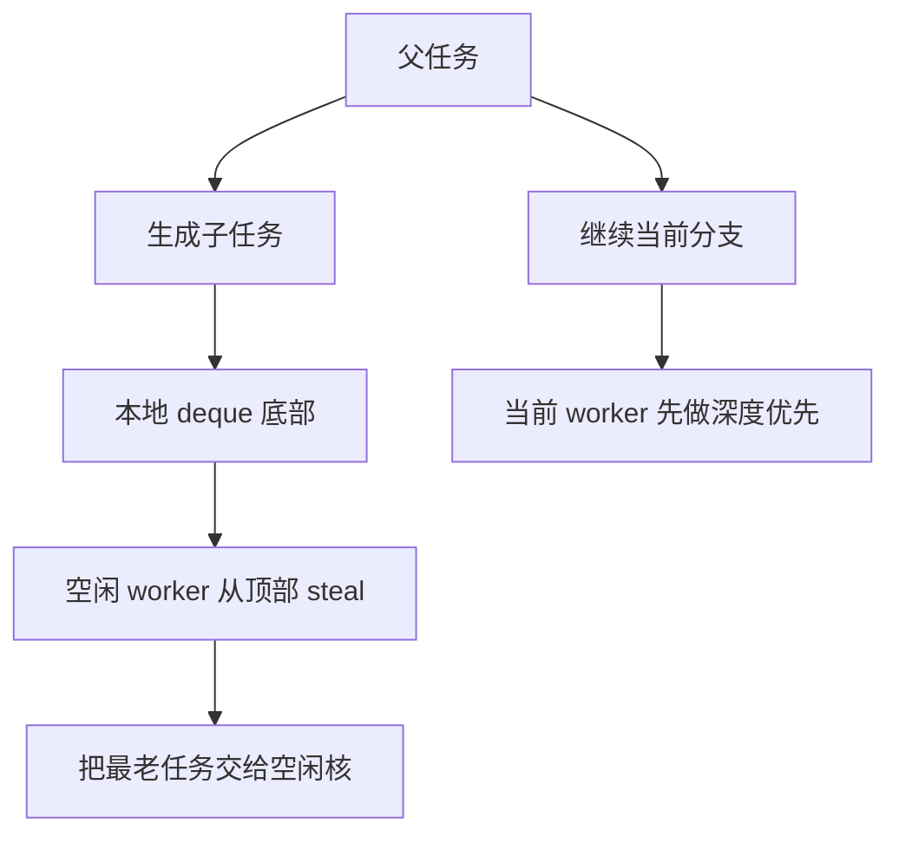
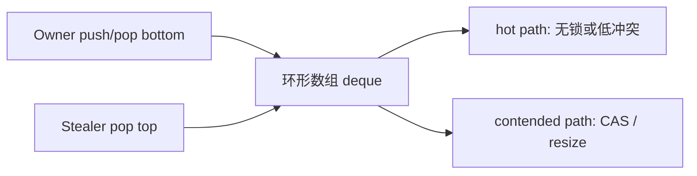

---
title: "游戏与引擎算法 24｜Work Stealing 调度"
slug: "algo-24-work-stealing"
date: "2026-04-17"
description: "讲透 Chase-Lev deque、work-first / help-first、stealing cost、false sharing 和 NUMA 风险，解释为什么现代任务调度器都离不开 work stealing。"
tags:
  - "work stealing"
  - "Chase-Lev"
  - "调度"
  - "线程池"
  - "false sharing"
  - "NUMA"
  - "并发"
  - "游戏引擎"
series: "游戏与引擎算法"
weight: 1824
---

一句话本质：Work stealing 的核心不是“抢别人的活”，而是让每个 worker 先深挖自己刚产生的热任务，只有真正空闲时才去别人的队列顶部偷最老的任务。

> 读这篇之前：建议先看 [Job System 原理]() 和 [SIMD 数学：Vector4 / Matrix4 向量化]()。前者说明任务图为什么存在，后者说明任务内部为什么也要尽量连续、紧凑、批处理。

## 问题动机

普通线程池只有一个强项：复用线程。
但在游戏引擎里，线程复用远远不够，因为任务负载天然不均匀。
一帧里有的任务是几十个实体的简单更新，有的任务是成千上万粒子的碰撞预处理，还有的任务是递归分治的路径、蒙皮或压缩。

如果任务只进一个全局队列，worker 会在锁上互相抢，局部性会被打散，热点也会被竞争放大。
如果任务完全由固定线程分配，某些线程会空转，某些线程会过载。
Work stealing 解决的就是这个悖论：让每个 worker 先吃自己生成的孩子，再把尾部闲置的工作偷给别人。

这套策略特别适合游戏引擎。
游戏的计算常常是“递归拆分 + 局部消费 + 结果回收”，而 work stealing 恰好把这一类结构映射得很自然。

## 历史背景

Work stealing 不是近几年才有的时髦词。
1999 年 Blumofe 和 Leiserson 给出了经典的工作窃取调度分析，证明了对 fully strict 计算模型的良好期望界。
2005 年 Chase 和 Lev 又把关键数据结构推进到更现实的 lock-free circular deque，让 work stealing 真正能在工业里跑得快、跑得稳。

TBB、Rayon、Bevy tasks、许多引擎内部任务系统，最后都站在同一条谱系上。
差别只在于：有的更偏通用并行库，有的更偏游戏帧调度，有的更偏数据流。

Work stealing 的真正意义，不在于某个具体 deque，而在于它给出了一个非常稳定的调度哲学：
局部深度优先，全球广度兜底。

## 理论基础

把并行程序看成一张 DAG，work stealing 的目标是同时逼近两个极限：
总工作量 $T_1$ 和临界路径 $T_\infty$。
对 $P$ 个 worker，经典上界可以写成
$$
T_P \le \frac{T_1}{P} + O(T_\infty)
$$
在合理假设下，这意味着只要任务图足够“宽”，work stealing 就能接近线性加速；只要临界路径不太长，它就不会被强同步点拖死。

但是，理论只管“偷得到”，不管“偷得值不值”。
现实里每次 steal 都有成本：同步、缓存失配、分支预测失效、NUMA 跨节点访问，都会把偷来的收益打折。
所以工作窃取的工程关键，不是让 steal 发生得越多越好，而是让它发生在“本地已经没活、远端还有富余”这类真正值得的时刻。

## work-first / help-first

Work stealing 里最重要的策略差异，是 work-first 和 help-first。

- work-first：当前 worker 优先执行自己刚产生的“子任务”，把继续执行的权利留在本地，旧任务往后放。
- help-first：当前 worker 优先把“自己正在等待的 continuation”留下，把新任务先扔出去给别人帮忙。

work-first 的优势是 cache 热、执行深度优先、局部性好。
help-first 的优势是更适合暴露并行度、让其他 worker 更早拿到可做的工作。
现代游戏任务系统大多会在这两者之间做折中，但经典 work stealing 的默认味道，还是 work-first。

## Chase-Lev deque 为什么重要

work stealing 要成立，需要一个“单生产者，多偷者”的双端队列。
owner 只在底部 push / pop，stealer 只从顶部 steal。
这样 owner 的热路径可以尽量无锁，stealer 才去承担同步成本。

Chase-Lev deque 的关键，是把这个 deque 做成可增长的环形数组，并让 owner 热路径只碰自己的底端。
这意味着绝大多数 push/pop 不需要全局锁，而 steal 时只需要对 top 做 CAS 竞争。

它解决了早期 bounded deque 的一个硬伤：队列会 overflow。
在真实游戏里，递归分治和 bursty 负载很容易把固定大小 deque 撑爆，动态扩容是必须的。

## 图示 1：work-first 调度如何展开



## 图示 2：Chase-Lev deque 的 owner / stealer 分工



## 算法推导

先看为什么“偷顶部”是合理的。
底部任务是 owner 最近产生的，通常更热，也更可能形成连续递归链。
顶部任务是更早进入队列的旧活，往往已经等待了一段时间。
偷老的，能最大程度保留 owner 的局部性，同时让空闲 worker 尽快接手长尾任务。

再看为什么“本地先深挖”是合理的。
分治任务在本地连续执行时，父任务刚写入的数据通常还在 cache 里，子任务继续用这些数据就能命中更多缓存。
如果一生成子任务就立刻丢给别人，数据往返就会把 cache 热度磨掉。

所以 work stealing 实际上是在做一种延迟均衡：
本地线程先吸收能吸收的局部性，远端线程只在需要时帮忙补尾。

## 算法实现

下面的实现包含两个核心部分：
一个可增长的 Chase-Lev 风格 deque，和一个基于多个本地 deque 的 work-stealing 调度器。
调度器默认是 work-first：worker 产生的子任务优先留在本地，空闲 worker 才从别人的顶部偷。

```csharp
using System;
using System.Collections.Generic;
using System.Runtime.CompilerServices;
using System.Runtime.InteropServices;
using System.Threading;

public sealed class WorkStealingScheduler : IDisposable
{
    private readonly Worker[] _workers;
    private readonly ThreadLocal<Worker?> _currentWorker;
    private readonly CancellationTokenSource _cts = new();
    private int _nextVictim;

    public WorkStealingScheduler(int workerCount)
    {
        if (workerCount <= 0) throw new ArgumentOutOfRangeException(nameof(workerCount));

        _workers = new Worker[workerCount];
        _currentWorker = new ThreadLocal<Worker?>(() => null, trackAllValues: true);

        for (int i = 0; i < workerCount; i++)
        {
            _workers[i] = new Worker(this, i);
        }

        foreach (var worker in _workers)
            worker.Start();
    }

    public void Schedule(Action action)
    {
        if (action is null) throw new ArgumentNullException(nameof(action));

        var worker = _currentWorker.Value;
        if (worker is not null)
        {
            worker.Local.PushBottom(action);
            return;
        }

        var victim = PickVictim();
        victim.Local.PushBottom(action);
        victim.Notify();
    }

    public void ParallelFor(int fromInclusive, int toExclusive, int grainSize, Action<int> body)
    {
        if (body is null) throw new ArgumentNullException(nameof(body));
        if (grainSize <= 0) throw new ArgumentOutOfRangeException(nameof(grainSize));
        if (toExclusive < fromInclusive) throw new ArgumentException("Invalid range.");

        using var done = new CountdownEvent(1);
        Schedule(() => ExecuteRange(fromInclusive, toExclusive, grainSize, body, done));
        done.Wait();
    }

    private void ExecuteRange(int from, int to, int grainSize, Action<int> body, CountdownEvent done)
    {
        if (to - from <= grainSize)
        {
            for (int i = from; i < to; i++)
                body(i);
            done.Signal();
            return;
        }

        int mid = from + ((to - from) >> 1);
        done.AddCount();
        Schedule(() => ExecuteRange(mid, to, grainSize, body, done));

        // work-first: keep the left half hot on the current worker
        ExecuteRange(from, mid, grainSize, body, done);
    }

    private Worker PickVictim()
    {
        int start = Interlocked.Increment(ref _nextVictim);
        return _workers[start % _workers.Length];
    }

    internal bool TrySteal(Worker thief, out Action? action)
    {
        int count = _workers.Length;
        int start = Environment.TickCount & int.MaxValue;
        for (int i = 0; i < count; i++)
        {
            var victim = _workers[(start + i) % count];
            if (victim == thief)
                continue;

            if (victim.Local.TrySteal(out action))
                return true;
        }

        action = null;
        return false;
    }

    public void Dispose()
    {
        _cts.Cancel();
        foreach (var worker in _workers)
            worker.Notify();
        foreach (var worker in _workers)
            worker.Join();
        _currentWorker.Dispose();
        _cts.Dispose();
    }

    private sealed class Worker
    {
        private readonly WorkStealingScheduler _scheduler;
        private readonly Thread _thread;
        private readonly AutoResetEvent _wake = new(false);
        private volatile bool _running = true;

        public Worker(WorkStealingScheduler scheduler, int index)
        {
            _scheduler = scheduler;
            Index = index;
            Local = new WorkStealingDeque<Action>();
            _thread = new Thread(Run) { IsBackground = true, Name = $"WS#{index}" };
        }

        public int Index { get; }
        public WorkStealingDeque<Action> Local { get; }

        public void Start() => _thread.Start();
        public void Join() => _thread.Join();
        public void Notify() => _wake.Set();

        private void Run()
        {
            _scheduler._currentWorker.Value = this;

            while (_running && !_scheduler._cts.IsCancellationRequested)
            {
                if (Local.TryPopBottom(out var action))
                {
                    action();
                    continue;
                }

                if (_scheduler.TrySteal(this, out action))
                {
                    action();
                    continue;
                }

                _wake.WaitOne(1);
            }
        }
    }
}

[StructLayout(LayoutKind.Sequential)]
public sealed class WorkStealingDeque<T>
{
    private T[] _buffer;
    private readonly object _resizeLock = new();
    private PaddedInt _top;
    private PaddedInt _bottom;

    public WorkStealingDeque(int initialCapacity = 32)
    {
        if (initialCapacity < 2) throw new ArgumentOutOfRangeException(nameof(initialCapacity));
        int capacity = 1;
        while (capacity < initialCapacity) capacity <<= 1;
        _buffer = new T[capacity];
    }

    public void PushBottom(T item)
    {
        int b = Volatile.Read(ref _bottom.Value);
        int t = Volatile.Read(ref _top.Value);
        if (b - t >= _buffer.Length - 1)
            Grow(t, b);

        _buffer[b & (_buffer.Length - 1)] = item;
        Volatile.Write(ref _bottom.Value, b + 1);
    }

    public bool TryPopBottom(out T? item)
    {
        int b = Volatile.Read(ref _bottom.Value) - 1;
        Volatile.Write(ref _bottom.Value, b);

        int t = Volatile.Read(ref _top.Value);
        if (t <= b)
        {
            int index = b & (_buffer.Length - 1);
            item = _buffer[index];

            if (t == b)
            {
                if (Interlocked.CompareExchange(ref _top.Value, t + 1, t) != t)
                {
                    item = default;
                    Volatile.Write(ref _bottom.Value, b + 1);
                    return false;
                }
                Volatile.Write(ref _bottom.Value, b + 1);
            }

            _buffer[index] = default!;
            return true;
        }

        Volatile.Write(ref _bottom.Value, t);
        item = default;
        return false;
    }

    public bool TrySteal(out T? item)
    {
        while (true)
        {
            int t = Volatile.Read(ref _top.Value);
            int b = Volatile.Read(ref _bottom.Value);
            if (t >= b)
            {
                item = default;
                return false;
            }

            int index = t & (_buffer.Length - 1);
            item = _buffer[index];
            if (Interlocked.CompareExchange(ref _top.Value, t + 1, t) == t)
            {
                _buffer[index] = default!;
                return true;
            }
        }
    }

    private void Grow(int top, int bottom)
    {
        lock (_resizeLock)
        {
            int currentTop = Volatile.Read(ref _top.Value);
            int currentBottom = Volatile.Read(ref _bottom.Value);
            if (currentBottom - currentTop < _buffer.Length - 1)
                return;

            var next = new T[_buffer.Length << 1];
            for (int i = currentTop; i < currentBottom; i++)
                next[i & (next.Length - 1)] = _buffer[i & (_buffer.Length - 1)];

            _buffer = next;
        }
    }

    [StructLayout(LayoutKind.Explicit, Size = 128)]
    private struct PaddedInt
    {
        [FieldOffset(64)] public int Value;
    }
}
```

这个实现有几个故意的工程取向。
第一，owner 的 push/pop 热路径几乎不碰锁。
第二，steal 只在本地空了之后才发生。
第三，外部线程提交新任务时会显式唤醒目标 worker，避免空闲线程只能靠轮询发现新活。第四，resize 只在队列接近满载时触发，而且放到单独锁里，不污染平时的 fast path。

如果要把它再往生产级推一步，下一层通常是把 `Action` 换成 struct job、把 worker 私有 deque 和 cache line 对齐、把外部提交队列和本地 deque 分开，并给 NUMA 节点做局部绑定。

## 复杂度分析

单次 `pushBottom`、`popBottom` 和 `steal` 的平均复杂度都接近 $O(1)$。
真正昂贵的是这三个操作背后的同步和缓存迁移成本。

在理想情况下，work stealing 把整体执行时间压到接近 `T1/P`。
在最坏情况下，如果任务极细、竞争极高、steal 频繁，调度系统会退化成“很多时间花在搬运任务上，而不是执行任务上”。

所以 work stealing 的复杂度判断不能只看算法表面。
它是一个“$O(1)$ 队列操作 + $O(1)$ 竞争损耗 + 取决于任务粒度的系统级成本”的组合体。

## 变体与优化

work stealing 的变体很多，但最常见的改造集中在四个方向。

- work-first 调度：最大化 owner 的局部性。
- help-first 调度：更早暴露并行度，适合一些 latency 敏感任务。
- 分层队列：每个 NUMA 节点一个本地池，减少跨节点 steal。
- 任务压缩：把小任务合并成批，减少 steal 和同步频率。

优化时最值钱的不是“让 steal 更快”，而是“让 steal 更少”。
只要本地队列里还有足够工作，远端偷取就是额外成本。
所以真正成熟的实现都尽量把局部任务做厚，再把剩下的尾部交给全局平衡。

## 对比其他调度器

| 调度器 | 优点 | 缺点 | 典型用途 |
|---|---|---|---|
| 全局任务队列 | 简单，易实现 | 锁竞争重，局部性差 | 小规模并发 |
| 固定线程分片 | 可预测 | 负载不均衡 | 规则循环 |
| Work stealing | 负载均衡好，局部性强 | 实现复杂，steal 有开销 | 游戏引擎、fork-join |
| Actor 调度 | 隔离共享状态 | 消息成本高 | 网络、AI、服务端 |
| 协程 / fiber | 挂起恢复方便 | 不是天然负载均衡器 | IO、异步任务 |

work stealing 和全局队列的差别，通常比想象中大。
前者把竞争压到“只有空闲 worker 才去碰别人”，后者把所有 worker 都压在同一把锁上。

## 批判性讨论

work stealing 不是免费的。
它对任务形状有要求：如果任务太粗，偷不动；如果任务太细，偷得太多。
它对内存布局也有要求：如果任务对象堆上乱飞，steal 本身就会把 cache 打散。

NUMA 是更隐蔽的问题。
在双路或多路机器上，本地内存访问和跨节点访问差距很大，盲目 steal 可能把“平衡”变成“把热数据扔到远端去访问”。
所以高端 runtime 往往会先做节点内平衡，再做节点间窃取。

最后，work stealing 并不能消除所有长尾。
如果任务图的临界路径很长，或者有一个重尾 job 持续拖后腿，偷再多也只是抢到一些边缘收益。
这时要改的是任务切分和数据布局，不是调度器参数。

## 跨学科视角

work stealing 很像操作系统里的页面回收策略。
本地先尽量吸热，等“本地缺页”或“本地空闲”时，再去别处回收。
它的目标不是完全平均，而是把最坏情况的尾部拉平。

它也像分布式系统里的负载迁移。
worker 的本地队列就像节点局部缓存，偷工作就像把请求迁到更空闲的实例上。
但和服务端不同，游戏调度更在乎 cache locality 和 frame latency，而不是吞吐极大化。

## 真实案例

- [oneTBB: How Task Scheduler Works](https://uxlfoundation.github.io/oneTBB/main/tbb_userguide/How_Task_Scheduler_Works.html) 明确展示了一个典型 work-stealing 线程如何在本地 deque 深度优先执行，并在空闲时从别的 deque 顶部偷任务。
- [oneTBB: Memory Allocation](https://uxlfoundation.github.io/oneTBB/main/tbb_userguide/Memory_Allocation.html) 直接把 false sharing 作为并行程序的关键问题之一，说明 work stealing 运行得快不只是调度问题，还受内存分配和 cache line 影响。
- [Rayon](https://docs.rs/crate/rayon/1.9.0) 是 Rust 里最知名的 work-stealing 并行库之一，`par_iter` 和 `join` 都建立在动态任务切分和窃取上。
- [Bevy Tasks](https://docs.rs/bevy/latest/bevy/tasks/) 明确把它描述为适合 scoped fork-join 的轻量线程池，适合游戏场景里的短命并行任务。
- [Microsoft Research: Work Stealing for Interactive Services to Meet Target Latency](https://www.microsoft.com/en-us/research/publication/work-stealing-for-interactive-services-to-meet-target-latency/) 说明 work stealing 还可以进一步按延迟目标调参，在交互式负载中把超时请求比例压下来。
- [Intel oneTBB 主页](https://www.intel.com/content/www/us/en/developer/tools/oneapi/onetbb.html) 直接把 work-stealing task scheduler 作为产品特性之一，说明这不只是学术论文里的概念，而是工业并行库的核心能力。

## 量化数据

经典 work-stealing 理论给出的是期望上界：在 fully strict 计算上，执行时间接近 $T_1/P + O(T_\infty)$。
这条式子很重要，因为它告诉你，调度器的最佳目标不是神奇超越工作量，而是把额外开销限制在临界路径附近。

Microsoft Research 在 interactive services 场景里报告过最高 58% 的相对改进。
这类数据的意义不是“work stealing 一定有 58% 收益”，而是说明一旦把调度目标从纯吞吐改成延迟约束，窃取策略本身也需要重新设计。

oneTBB 文档还明确强调：depth-first 的本地执行能让最近生成的任务保持热度，同时避免 breadth-first 让同时活跃的任务数量急剧膨胀。
这在工程上对应的就是：减少 steal 次数、减少活跃对象、减少 cache churn。

## 常见坑

- 把所有队列做成一个全局共享队列。为什么错：锁竞争会把并行性耗光。怎么改：每个 worker 一条本地 deque，偷取只做兜底。
- 忽略 false sharing。为什么错：两个线程即使改不同字段，也可能争同一 cache line。怎么改：对 top/bottom、计数器和热状态做 cache line 对齐。
- 任务切得太碎。为什么错：偷取和同步开销占比过高。怎么改：提高 grain size，让每个任务足够厚。
- NUMA 上随机偷。为什么错：跨节点内存访问把局部收益吃掉。怎么改：先节点内平衡，再节点间窃取。
- 让任务频繁分配 GC 对象。为什么错：堆分配和回收会破坏热路径。怎么改：用池化、struct job 或预分配缓冲。

## 何时用 / 何时不用

适合用 work stealing 的情况：

- 任务数量大，负载不均匀。
- 任务具有明显递归拆分结构。
- 你想在多核上既保局部性又保平衡。

不适合用 work stealing 的情况：

- 任务极少且非常大，简单线程固定分配就够。
- 你的代码已经被严格串行锁保护，steal 不能打开并行度。
- 你在单核、弱内存或极端受限平台上，没有足够并行资源。

## 相关算法

- [Job System 原理]()
- [约束求解：Sequential Impulse 与 PBD]()
- [刚体动力学]()
- [SIMD 数学：Vector4 / Matrix4 向量化]()
- [浮点精度与数值稳定性]()

## 小结

work stealing 之所以成为现代任务调度的基础，不是因为它神秘，而是因为它很诚实。
本地任务尽量本地做，空闲了再去偷，偷最老的，尽量少打扰 owner 的缓存热度。

Chase-Lev deque 让这个哲学变成了可实现的数据结构，TBB、Rayon、Bevy 和大量引擎 runtime 又把它变成了工业常识。
真正要记住的不是某个 CAS 细节，而是：调度器的第一目标不是“平均”，而是“让热数据留在热核上”。

## 参考资料

- [Scheduling Multithreaded Computations by Work Stealing](https://supertech.mit.edu/biblio/scheduling-multithreaded-computations-work-stealing/)
- [Dynamic Circular Work-Stealing Deque](https://www.cs.wm.edu/~dcschmidt/PDF/work-stealing-dequeue.pdf)
- [oneTBB: How Task Scheduler Works](https://uxlfoundation.github.io/oneTBB/main/tbb_userguide/How_Task_Scheduler_Works.html)
- [oneTBB: Memory Allocation](https://uxlfoundation.github.io/oneTBB/main/tbb_userguide/Memory_Allocation.html)
- [Rayon docs](https://docs.rs/crate/rayon/1.9.0)
- [Bevy Tasks](https://docs.rs/bevy/latest/bevy/tasks/)
- [Intel oneTBB](https://www.intel.com/content/www/us/en/developer/tools/oneapi/onetbb.html)
- [Microsoft Research: Work Stealing for Interactive Services to Meet Target Latency](https://www.microsoft.com/en-us/research/publication/work-stealing-for-interactive-services-to-meet-target-latency/)

