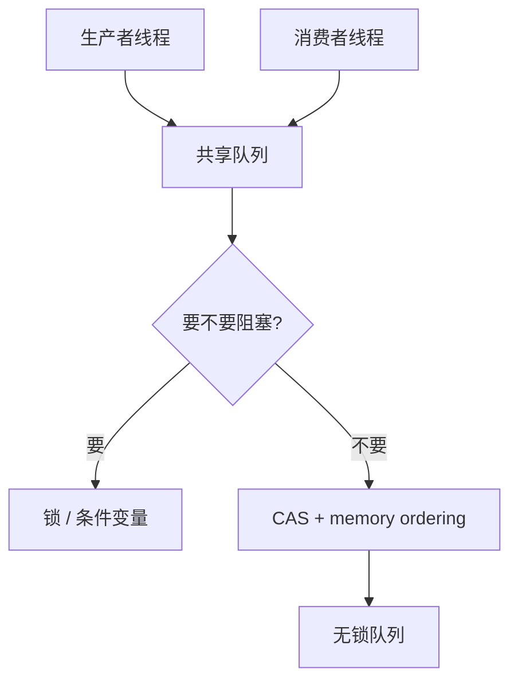
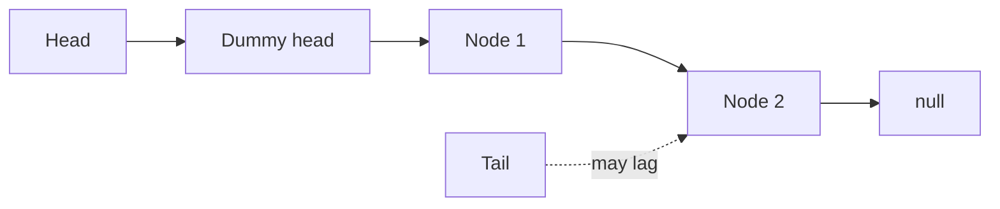
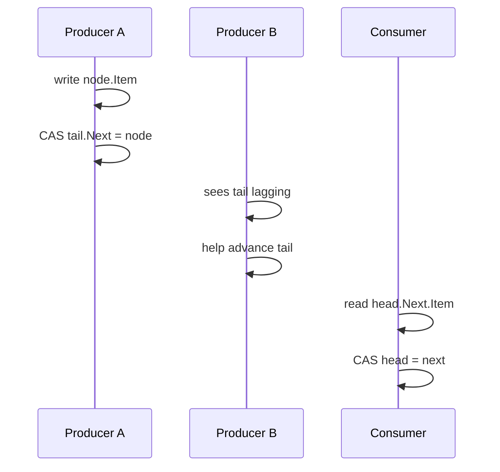

---
title: "游戏与引擎算法 25｜无锁队列：MPMC 与 CAS"
slug: "algo-25-lock-free-queue"
date: "2026-04-17"
description: "从 Michael-Scott queue 出发，讲清 CAS、ABA、memory ordering、hazard pointer 与 epoch reclamation 的工程边界。"
tags:
  - "无锁队列"
  - "MPMC"
  - "CAS"
  - "ABA"
  - "memory ordering"
  - "hazard pointer"
  - "epoch reclamation"
  - "并发"
series: "游戏与引擎算法"
weight: 1825
---

**一句话本质：无锁队列不是‘不加锁’，而是在共享队列上用 CAS 和明确的内存顺序，把互斥换成可证明的并发进度。**

> 读这篇之前：建议先看 [游戏与引擎算法 41｜浮点精度与数值稳定性]()。这篇会频繁提到原子操作、可见性和跨线程一致性。 

## 问题动机

游戏引擎里，队列几乎无处不在。

渲染线程收事件，音频线程收样本块，作业系统分发任务，网络线程投递包，主线程回收回调。只要有“生产者把东西交给消费者”的模型，队列就会出现。

加锁的队列最容易理解，但它有两个典型问题。一个是抢锁导致抖动，另一个是高并发下的缓存线争用。对于需要稳定帧时间的引擎来说，这两个问题都很讨厌。

无锁队列的价值，不是把一切变快，而是把最坏情况压低，让“偶尔卡死几毫秒”的风险变小。

### 为什么它值得单独成文



## 历史背景

Michael 和 Scott 在 1996 年提出的非阻塞 FIFO 队列，是现代无锁队列的原点之一。那篇论文的出发点很朴素：如果机器已经提供了 CAS 或 LL/SC 这样的通用原子原语，那为什么还要用互斥锁把队列卡住？

他们的答案是一个带哨兵节点的单链表队列。入队只需要把新节点挂到尾部，出队只需要把头节点向前推进。这个结构后来成了 Java `ConcurrentLinkedQueue`、大量 C++ 无锁队列和工程化消息系统的基础。

Rochester 的伪代码页面后来把这件事说得更清楚：Michael-Scott queue 可以工作，但它依赖 CAS，并且需要一个“类型保持”的内存回收策略。页面还直接点名了 hazard pointers、epoch-based reclamation 和 interval-based reclamation，说明真正难的部分往往不是链表，而是“节点什么时候能安全回收”。

今天，moodycamel::ConcurrentQueue、folly 的并发队列、.NET 的 Channel、以及各种 C++/Java 运行时实现，都还在沿着这条路线演化。

## 数学与内存模型基础

### 1. 无锁不是无竞争，而是有进度保证

锁会阻塞所有人。无锁算法不保证每个线程都立刻成功，但至少保证系统整体还能前进。

这类算法通常追求的是 lock-free 进度：只要有线程在跑，整体操作就会不断完成。它不是 wait-free；wait-free 要更强，要求每个线程都在有界步数内完成。

### 2. CAS 不是魔法，它只是原子比较交换

在 .NET 里，`Interlocked.CompareExchange` 把“比较当前值并在相等时替换”合成一次原子操作。它本身不解决逻辑正确性，只解决并发更新时的竞争窗口。

如果把共享状态记作 `S`，CAS 的语义可以写成：

$$
\text{CAS}(S, e, n) =
\begin{cases}
\text{success}, & S = e \land S \leftarrow n \\
\text{fail}, & S \ne e
\end{cases}
$$

队列算法的关键，不是“会不会用 CAS”，而是“CAS 保护的临界状态到底是什么”。

### 3. memory ordering 决定可见性

原子操作如果只看“原子”，不看“顺序”，很容易写出在 x86 上偶尔能跑、在 ARM 上偶尔炸的代码。

`Volatile.Read` / `Volatile.Write` 提供 acquire / release 语义；`Interlocked.CompareExchange` 提供原子更新并通常带有更强的顺序保证。它们一起用，才能让“先写数据，再发布指针”这件事对其他线程可见。

### 4. ABA 是无锁队列的经典陷阱

ABA 的问题是：线程 A 读到一个指针值 `A`，后来别的线程把它改成 `B`，又改回 `A`。如果 A 只比较指针值，它会以为中间什么都没发生。

对 Michael-Scott queue 来说，ABA 在“节点被回收并重新复用”时最危险。单纯的 CAS 只比较值，不比较历史，所以如果节点地址被重新分配给新对象，旧 CAS 可能会误判。

### 5. 为什么回收比入队出队更难

队列逻辑本身只关心 head 和 tail。内存回收则要关心“谁还可能持有旧节点的引用”。

在原生代码里，如果一个节点刚被另一个线程从队列摘掉，你不能立刻把它交回 allocator，因为别的线程可能还在读它的 next 指针。于是你需要 hazard pointer、epoch reclamation 或类型保持分配器。

在 C# 里，GC 会帮你把大部分回收问题接过去，所以经典 ABA 风险通常小很多。但如果你自己做对象池、重用节点实例，ABA 问题就会重新回来。

## 算法推导

### Michael-Scott queue 的核心结构

队列从一个哨兵节点开始：head 和 tail 一开始都指向它。这个哨兵不存业务数据，只负责让空队列和非空队列共享同一种拓扑。

这样做有一个巨大的好处：入队和出队都不用处理“空链表的特殊分支”。你只要维护好 head / tail 和 next 指针，逻辑会简单很多。

### 入队为什么要两步

入队的第一步，是把新节点挂到尾节点的 next 上。第二步，才是尝试把 tail 推到新节点。

为什么不能直接先改 tail？因为 tail 只是一个快速入口，不是队列的语义边界。真正的语义边界是“最后一个节点的 next 是否为空”。

所以入队时先 CAS `tail.next`，成功后再帮忙推进 tail。即使第二步失败，也不影响正确性，因为下一个线程看到 tail 落后时，可以帮你补上。

### 出队为什么要先读 value 再 CAS head

出队时先读 `head.next.value`，再 CAS head。顺序不能反过来。

如果你先把 head 改掉，再去读 value，就可能在别的线程回收或重用节点后读到脏数据。先读 value 是为了把业务数据拿到手，再做结构推进。

### helper 机制为什么重要

Michael-Scott queue 的一个经典特征，是允许别的线程帮忙推进 tail。

这不是“多此一举”，而是为了减少尾指针落后的窗口。假设一个线程已经成功把新节点挂到链表尾部，但还没来得及把 tail 推过去；如果别的线程继续看见旧 tail，它就会顺手把 tail 也推进。

这类 helper 机制让队列在高并发下更稳，因为状态恢复不只依赖原始操作线程。

### 为什么 GC 版代码和原生版边界不同

在原生 C/C++ 版本里，`free(head.ptr)` 只在确定没人会再碰它时才安全。Rochester 的伪代码明确指出，如果默认分配器不合适，可以换 hazard pointers、epoch-based reclamation 或 interval-based reclamation。

在本篇的 C# 实现里，节点是托管对象，GC 负责回收。所以代码可以聚焦在算法本体，而不用写一整套内存回收协议。但这不是说回收问题不存在，只是它被语言运行时托管了。

## 结构图 / 流程图





## 算法实现

下面这份 C# 代码是 Michael-Scott queue 的直接翻译。它是 MPMC，使用 `Interlocked.CompareExchange` 做结构更新，使用 `Volatile.Read/Write` 保证发布与可见性。

```csharp
using System;
using System.Threading;

public sealed class MichaelScottQueue<T>
{
    private sealed class Node
    {
        public T? Item;
        public Node? Next;

        public Node(T? item)
        {
            Item = item;
            Next = null;
        }
    }

    private Node _head;
    private Node _tail;

    public MichaelScottQueue()
    {
        var dummy = new Node(default);
        _head = dummy;
        _tail = dummy;
    }

    public void Enqueue(T item)
    {
        var node = new Node(default);
        Volatile.Write(ref node.Item, item);
        Volatile.Write(ref node.Next, null);

        while (true)
        {
            Node tail = Volatile.Read(ref _tail);
            Node? next = Volatile.Read(ref tail.Next);

            if (ReferenceEquals(tail, Volatile.Read(ref _tail)))
            {
                if (next is null)
                {
                    // Try to link the new node at the physical end.
                    if (Interlocked.CompareExchange(ref tail.Next, node, null) is null)
                    {
                        // Help future operations by moving Tail forward.
                        Interlocked.CompareExchange(ref _tail, node, tail);
                        return;
                    }
                }
                else
                {
                    // Tail is behind; help advance it.
                    Interlocked.CompareExchange(ref _tail, next, tail);
                }
            }
        }
    }

    public bool TryDequeue(out T? item)
    {
        while (true)
        {
            Node head = Volatile.Read(ref _head);
            Node tail = Volatile.Read(ref _tail);
            Node? next = Volatile.Read(ref head.Next);

            if (!ReferenceEquals(head, Volatile.Read(ref _head)))
                continue;

            if (ReferenceEquals(head, tail))
            {
                if (next is null)
                {
                    item = default;
                    return false;
                }

                // Tail is lagging behind the real last node.
                Interlocked.CompareExchange(ref _tail, next, tail);
                continue;
            }

            if (next is null)
                continue;

            T? value = Volatile.Read(ref next.Item);
            if (Interlocked.CompareExchange(ref _head, next, head) == head)
            {
                // Clear the old value so the new dummy node does not retain it.
                Volatile.Write(ref next.Item, default);
                item = value;
                return true;
            }
        }
    }

    public bool IsEmpty
    {
        get
        {
            Node head = Volatile.Read(ref _head);
            Node tail = Volatile.Read(ref _tail);
            return ReferenceEquals(head, tail) && Volatile.Read(ref head.Next) is null;
        }
    }
}
```

这段代码的管理边界很明确：结构推进由 CAS 保证，读写顺序由 Volatile 保证，节点生命周期交给 GC。

## 复杂度分析

Michael-Scott queue 的单次操作是摊还 `O(1)`，但这里的“常数”是有并发条件的。

- **Enqueue**：通常只需要一次成功 CAS，少数情况下会因为 tail 落后而多做一次帮助推进。
- **Dequeue**：通常只需要一次成功 CAS；如果队列空或者 tail 落后，会多一次检查或帮助推进。
- **空间复杂度**：如果不做回收优化，节点对象数量与在队列中的元素数成正比。

严格地说，它是 lock-free，不是 wait-free。高竞争下个别线程可能重试很多次，但整体系统会前进。

## 变体与优化

- **Bounded MPMC array queue**：固定容量、无分配、常用于实时系统。
- **Segmented queue**：把链表换成分段数组，减少分配和指针追逐。
- **Bulk enqueue / dequeue**：批量操作能显著摊薄同步成本。
- **Pool-aware reclaim**：如果必须复用节点，用 hazard pointer 或 epoch。
- **Tagged pointers / version counters**：通过版本号缓解 ABA，但会增加状态宽度和实现复杂度。

Rochester 的伪代码页面还明确写到：如果类型保持分配器不合适，可以改成 hazard pointers、epoch-based reclamation 或 interval-based reclamation。换句话说，算法本体和回收协议是两层东西。

## 对比其他算法

| 方法 | 容量 | 同步原语 | 是否分配 | 优点 | 缺点 |
|---|---|---|---|---|---|
| Michael-Scott queue | 无界 | CAS | 是 | 通用、经典、MPMC | 需要内存回收协议 |
| Bounded array queue | 有界 | CAS / 序号 | 否 | 固定内存、快 | 需要容量规划 |
| `Channel<T>` | 有界/无界 | 运行时协调 | 视实现而定 | 高层 API、可 async | 不是最低层同步原语 |
| `ConcurrentQueue<T>` | 无界 | 运行时内部原子 | 是 | 易用 | 一般不强调低级边界 |

## 批判性讨论

无锁队列很容易被神化。实际上，它只是把问题从“谁拿锁”变成“谁负责内存顺序和回收”。

如果你的瓶颈不是锁，而是内存分配、对象复制、缓存未命中或消费者逻辑本身，那么换成无锁队列未必能救帧时间。

另外，MPMC 无锁队列的调试成本比阻塞队列高得多。逻辑 bug 常常不是立刻崩，而是低概率丢消息、重复消费、顺序错乱或偶发死循环。测试与模型检验的价值在这里特别大。

最后，很多场景真正需要的不是“通用无锁队列”，而是更专门的东西：SPSC ring buffer、MPSC work queue、或 bounded mailbox。选错抽象，代码会比锁还复杂。

## 跨学科视角

这类队列在形式上很像分布式系统里的无领导协作。

每个线程都像一个参与者，CAS 像原子提交，helper 机制像故障转移。它不要求中心调度者，但要求每个参与者能在失败后重试，并且能看到最新状态。

从内存模型角度看，它又像编译器和 CPU 之间的合同。你不能只写“先赋值再发布”，你要用 `Volatile` 或 `Interlocked` 把这层合同写成代码，不然优化器和乱序执行会帮你“改写事实”。

## 真实案例

- **Michael-Scott 原始算法**：Rochester 的伪代码页直接说明该算法需要 CAS 或 LL/SC，并建议在不合适的分配器下使用 hazard pointers 或 epoch-based reclamation。[Rochester pseudocode](https://www.cs.rochester.edu/research/synchronization/pseudocode/queues.html)
- **moodycamel::ConcurrentQueue**：C++ 单头文件实现，支持任意数量的 producer/consumer，强调 bulk enqueue/dequeue 和动态/预分配两种模式。[moodycamel::ConcurrentQueue](https://github.com/cameron314/concurrentqueue)
- **folly::ProducerConsumerQueue / MPMCQueue**：Folly 明确把队列拆成 SPSC 和 MPMC 两类；社区 issue 里也能看到用户在单生产者单消费者测试中比较这两者的吞吐。[Folly](https://github.com/facebook/folly) / [issue #2024](https://github.com/facebook/folly/issues/2024)
- **.NET Channels**：`System.Threading.Channels` 提供有界和无界通道，是 .NET 里更高层的生产者-消费者同步结构。[Channels namespace](https://learn.microsoft.com/en-us/dotnet/api/system.threading.channels?view=net-9.0)

## 量化数据

- [1024cores 的 bounded MPMC queue 页面](https://www.1024cores.net/home/lock-free-algorithms/queues/bounded-mpmc-queue) 给出一个非常具体的参考值：在作者的 dual-core laptop 上，`enqueue/dequeue` 平均大约 `75 cycles`。
- 同一页还明确写出这类有界 MPMC 队列在 steady state 下可以做到“`1 CAS per operation`”且“操作期间不做动态内存分配”，这正是实时系统偏爱数组型无锁队列的原因。
- moodycamel 的 README 明确强调 bulk enqueue/dequeue 能显著摊薄同步成本，说明在高竞争下“批量化”往往比继续抠单次 CAS 更值钱。
- [rigtorp/MPMCQueue](https://github.com/rigtorp/MPMCQueue) 的 README 直接把 bounded MPMC queue 列为 Frostbite、EA SEED 和低延迟交易基础设施的常用构件，说明这条路线已经不是论文玩具，而是工业级热路径部件。

## 常见坑

1. **只看 CAS，不看内存顺序。**  
   错因：原子更新不等于正确可见。  
   怎么改：用 `Volatile.Read/Write` 配合 `Interlocked`，明确发布与观察顺序。

2. **把节点池和无锁队列混在一起用。**  
   错因：复用节点会把 ABA 拉回来。  
   怎么改：要么用 GC 管理对象，要么给池加 hazard/epoch 协议。

3. **把 queue 当成吞吐万能钥匙。**  
   错因：队列快不代表消费者快。  
   怎么改：先确认瓶颈真在同步，不在业务处理。

4. **忽略 helper 分支。**  
   错因：tail 落后不推进，会让后续入队反复碰旧尾巴。  
   怎么改：把帮助推进 tail 写成标准路径，而不是异常分支。

5. **在实时线程里做分配。**  
   错因：锁没了，分配器还是会抖。  
   怎么改：实时路径尽量预分配，或者改成有界数组队列。

## 何时用 / 何时不用

**适合用无锁队列的场景：**

- 多线程消息传递，吞吐高，延迟敏感。
- 需要 MPMC，且不想让锁成为热点。
- 可以接受更复杂的调试与验证。

**不太适合的场景：**

- 单生产者单消费者，且容量固定。那通常更适合 ring buffer。
- 你需要 async 等待、取消和 backpressure 语义。那更像 `Channel<T>`。
- 你能把共享状态改成更少的写共享。那最好先减少共享，而不是先换算法。

## 相关算法

- [数据结构与算法 18｜环形缓冲区：固定内存下的高频队列]()
- [游戏与引擎算法 26｜无锁 Ring Buffer：SPSC]()
- [游戏与引擎算法 41｜浮点精度与数值稳定性]()
- [设计模式教科书｜Actor Model：把并发和分布式交给消息，而不是锁]()

## 小结

无锁队列真正难的地方，不是把 CAS 写出来，而是把“状态推进、发布顺序、回收边界”三件事一起处理对。

Michael-Scott queue 之所以经典，是因为它把队列语义和 helper 机制拆得足够清楚；它之所以难，是因为一旦离开 GC 环境，内存回收立刻变成一等公民。

如果你只记住一句话，就记住：**无锁队列把锁的问题解决了，但把内存模型和回收协议的问题摆到了台前。**

## 参考资料

- [Simple, Fast, and Practical Non-Blocking and Blocking Concurrent Queue Algorithms](https://urresearch.rochester.edu/institutionalPublicationPublicView.action?institutionalItemId=344&versionNumber=1)
- [Rochester concurrent queue pseudocode](https://www.cs.rochester.edu/research/synchronization/pseudocode/queues.html)
- [moodycamel::ConcurrentQueue](https://github.com/cameron314/concurrentqueue)
- [folly](https://github.com/facebook/folly)
- [Folly issue #2024: MPMCQueue vs ProducerConsumerQueue](https://github.com/facebook/folly/issues/2024)
- [System.Threading.Channels namespace](https://learn.microsoft.com/en-us/dotnet/api/system.threading.channels?view=net-9.0)
- [Interlocked.CompareExchange](https://learn.microsoft.com/en-us/dotnet/api/system.threading.interlocked.compareexchange?view=net-10.0)
- [Volatile.Read](https://learn.microsoft.com/en-us/dotnet/api/system.threading.volatile.read?view=net-10.0)
- [1024cores: Bounded MPMC queue](https://www.1024cores.net/home/lock-free-algorithms/queues/bounded-mpmc-queue)
- [Rigtorp MPMCQueue](https://github.com/rigtorp/MPMCQueue)

