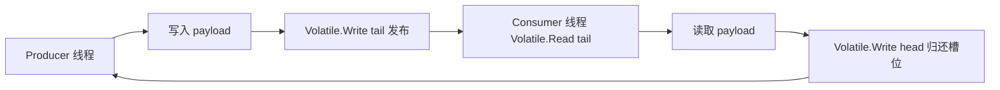
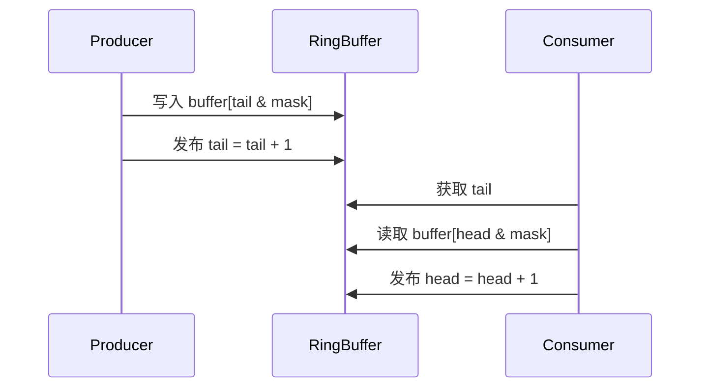

---
title: "游戏与引擎算法 26｜无锁 Ring Buffer：SPSC"
slug: "algo-26-lock-free-ring-buffer"
date: "2026-04-17"
description: "SPSC 无锁环形缓冲区的 head/tail 协议、内存屏障、缓存行对齐与音频/作业管线实践"
tags:
  - "无锁环形缓冲区"
  - "SPSC"
  - "Ring Buffer"
  - "内存模型"
  - "缓存行"
  - "False Sharing"
  - "音频管线"
  - "作业系统"
series: "游戏与引擎算法"
weight: 1826
---

> **读这篇之前**：建议先看 [无锁队列：MPMC 与 CAS]() 和 [浮点精度与数值稳定性]()。前者补齐 CAS、ABA 和回收边界，后者补齐“数值正确但工程仍会炸”的思维方式。

一句话本质：SPSC Ring Buffer 是“只有一个写线程、一个读线程”的定长循环队列；它把队列语义压缩成 `head/tail` 两个单向递增序列，再用 acquire/release 语义把数据发布给另一端。

## 问题动机

游戏引擎里最常见的跨线程传递，不是“任意线程把任意对象塞给任意线程”，而是两个固定线程之间的单向流动：音频采样从解码线程到混音线程，渲染命令从主线程到提交线程，作业结果从 worker 回到消费者。

这类场景里，锁的代价不只是阻塞。更致命的是缓存行抖动、系统调用路径、优先级反转，以及“明明只是传一个指针，却把两颗核心都打成了串行”。SPSC Ring Buffer 针对的正是这类固定拓扑。

它的判断标准很硬：如果生产端和消费端都固定，且你能接受定长容量，SPSC 基本就是最便宜的正确答案。只要角色不固定，立刻退回到更通用的队列，例如 [无锁队列：MPMC 与 CAS]() 里那类 MPMC 方案。

## 历史背景

环形缓冲区本身并不新，早期嵌入式、声卡驱动、串口收发都在用。真正把它推到并发设计核心位置的，是低延迟系统对“零分配、零锁、可预测尾延迟”的执念。

2011 年，LMAX 把 ring buffer 作为 Disruptor 的核心结构公开出来，目标不是“更像队列”，而是“绕开队列在并发上的混杂职责”。它把生产、存储、消费拆开，让每一段都单线程化，再用序列号连接阶段。JCTools 之后在 JVM 上把这一思路模块化，直接提供 `SpscArrayQueue`、`MpscArrayQueue`、`MpmcArrayQueue` 等专用实现。

Folly 的 `ProducerConsumerQueue`、.NET 的 `Channel<T>`、以及大量音频中间件也在不同层面复用同一个思想：如果拓扑是单生产者到单消费者，就别把通用并发成本硬塞进热路径。

## 数学与内存模型基础

SPSC 的核心不在“环”，而在两个单调递增的序列：`head` 表示已消费的位置，`tail` 表示已发布的位置。

设容量为 `N`，且 `N` 是 2 的幂，则槽位索引为：

$$
index(x) = x \bmod N = x \& (N-1)
$$

为了避免“只看索引就分不出满和空”的经典歧义，我们不只存取模后的下标，而是保留单调递增的序列号。于是队列不变量可以写成：

$$
0 \le tail - head \le N
$$

空队列：`tail == head`。

满队列：`tail - head == N`。

这也是为什么很多教材会浪费一个槽位；而序列号方案不用浪费。代价是序列号变成了 `long`，并且实现必须对“发布先于可见”有严格约束。

在 .NET 里，`Volatile.Write` 对应发布语义，`Volatile.Read` 对应获取语义。生产端先写入 payload，再发布 `tail`；消费端先获取 `tail`，再读取 payload。只要这个顺序不被重排，SPSC 就成立。x86 上很多代码“碰巧能跑”，但 ARM / Apple Silicon 不会替你兜底。

## 算法推导

如果直接用 `lock`，问题简单，但每次跨线程传递都要争用同一把锁。若用 `count` 共享计数，又会让两端同时写同一缓存行，带来 false sharing。更糟的是，`count` 还得处理满/空判定和回绕歧义。

把 `count` 拆成 `head` 和 `tail` 后，写端只写 `tail`，读端只写 `head`，每个线程只“读对方的序列、写自己的序列”。这正是 SPSC 能跑到极致的原因：没有 CAS，没有 ABA，没有帮助推进，没有回收争议。相比之下，MPMC 队列必须处理多写者抢占同一位置的问题，所以需要 CAS 轮询和更复杂的内存回收策略。

工程上还要做两件事：

1. 容量必须是 2 的幂，这样索引可以用位与替代取模。
2. `head` 和 `tail` 必须分离到不同缓存行，否则“逻辑上无锁，物理上互相踩”。

## 结构图





## C# 实现

下面的实现是讲解级别，但不是玩具。它包含：定长数组、幂次容量校验、head/tail 发布获取、cache-line padding、空槽清理，且没有 `NotImplemented`。

```csharp
using System;
using System.Runtime.InteropServices;
using System.Threading;

public sealed class SpscRingBuffer<T>
{
    [StructLayout(LayoutKind.Explicit, Size = 128)]
    private struct PaddedLong
    {
        [FieldOffset(64)]
        public long Value;
    }

    private readonly T[] _buffer;
    private readonly int _mask;
    private PaddedLong _head = new();
    private PaddedLong _tail = new();

    public SpscRingBuffer(int capacity)
    {
        if (capacity < 2) throw new ArgumentOutOfRangeException(nameof(capacity));
        if ((capacity & (capacity - 1)) != 0) throw new ArgumentException("Capacity must be a power of two.", nameof(capacity));

        _buffer = new T[capacity];
        _mask = capacity - 1;
    }

    public int Capacity => _buffer.Length;

    public int CountApprox()
    {
        long tail = Volatile.Read(ref _tail.Value);
        long head = Volatile.Read(ref _head.Value);
        return (int)(tail - head);
    }

    public bool TryWrite(T item)
    {
        long tail = _tail.Value;
        long head = Volatile.Read(ref _head.Value);

        if (tail - head >= _buffer.Length)
            return false;

        int index = (int)(tail & _mask);
        _buffer[index] = item;

        // 发布：先写 payload，再推进 tail。
        Volatile.Write(ref _tail.Value, tail + 1);
        return true;
    }

    public bool TryRead(out T item)
    {
        long head = _head.Value;
        long tail = Volatile.Read(ref _tail.Value);

        if (head == tail)
        {
            item = default!;
            return false;
        }

        int index = (int)(head & _mask);
        item = _buffer[index];
        _buffer[index] = default!; // 释放引用，避免 GC 记忆保留。

        // 归还槽位：先读 payload，再推进 head。
        Volatile.Write(ref _head.Value, head + 1);
        return true;
    }

    public void Clear()
    {
        while (TryRead(out _))
        {
        }
    }
}
```

这段代码有一个关键点：它没有任何 CAS。SPSC 不需要争抢槽位，所以不需要 `CompareExchange`。这里的 `PaddedLong` 采用显式布局 struct，只是为了把“尽量隔离缓存行”的工程意图写清楚；在托管运行时里，这类 padding 更像强约束提示，而不是对所有 CLR 布局的绝对物理保证。这也是它和 [无锁队列：MPMC 与 CAS]() 的分界线。

## 复杂度分析

`TryWrite` 和 `TryRead` 都是 $O(1)$。

空间复杂度是 $O(N)$，其中 `N` 是容量。因为是定长数组，额外元数据只有两个序列号和少量 padding，热路径没有分配。

从并发语义上看，它是 wait-free 的：单个生产者和单个消费者不会因为对方“抢同一个原子变量”而自旋。唯一失败条件是满或空，这属于容量条件，不是调度条件。

## 变体与优化

最常见的变体有三种。

第一种是“浪费一个槽位”的经典环形数组。它实现简单，但在高利用率场景下容量少 1。第二种是“序列号 + 幂次容量”，也就是这里的写法，容量利用率高，代价是序列号更长。第三种是带批量接口的版本，例如一次写入/读取一段连续元素，适合音频 block、网络包批处理或 job chunk。

优化上，最值钱的是这三条：

1. 预分配对象池，避免参考类型在热路径反复分配。
2. 把 `head/tail` 分到不同 cache line，减少 MESI 失效。
3. 用批量读写代替逐项读写，降低序列号读写次数。

## 对比其他算法

| 方案 | 适用拓扑 | 是否无锁 | 是否定长 | 备注 |
|---|---|---:|---:|---|
| `lock + Queue<T>` | 任意 | 否 | 否 | 最易写，尾延迟最差 |
| `ConcurrentQueue<T>` | MPMC | 是 | 否 | 通用，但代价高于 SPSC |
| `Channel<T>` | 异步管线 | 视配置而定 | 视配置而定 | 强在 async/backpressure，不是极限热路径 |
| `SPSC Ring Buffer` | 1P1C | 是 | 是 | 音频、渲染提交、job handoff 首选 |
| `Disruptor RingBuffer` | 多阶段事件流 | 是 | 是 | 更像流水线框架，不只是队列 |

## 批判性讨论

SPSC Ring Buffer 不是“更高级的队列”，它只是“更窄但更快的队列”。一旦生产者不是一个人，或者消费端可能被多个线程抢占，这个结构立刻失效。

它也不适合“消息大小高度不稳定、峰值不可控、必须无限堆积”的业务。那种场景应该优先考虑可增长结构、带背压的 `Channel<T>`，或者直接用 MPMC 队列。

更现实的问题是：很多团队在性能热点里并不缺算法，缺的是边界纪律。SPSC 用错线程模型，常常不是慢，而是错得很隐蔽：偶发丢消息、偶发重复消费、偶发音频爆音。

## 跨学科视角

从信号处理看，Ring Buffer 就是离散时间系统里的循环 FIFO。写端把样本放进环，读端按固定采样节拍取出，本质上就是把时间连续流离散成稳定批次。音频链路里常见的 block-based processing，和这里的 `head/tail` 语义完全同构。

从硬件看，它是在把“数据竞争”降维成“缓存行所有权切换”。写端只独占自己的序列缓存线，读端只独占自己的序列缓存线，真正跨核传递的只有发布后的序列值。这就是为什么它能和 CPU cache coherence 机制配合得很好。

## 真实案例

- JCTools 在官方仓库和入门文档里明确把 `SpscArrayQueue` 作为 SPSC 专用实现，并强调 `SPSC - Single Producer Single Consumer (Wait Free, bounded and unbounded)`。见 [JCTools/JCTools](https://github.com/JCTools/JCTools) 和 [Getting Started With JCTools](https://github.com/JCTools/JCTools/wiki/Getting-Started-With-JCTools)。
- [rigtorp/SPSCQueue](https://github.com/rigtorp/SPSCQueue) 把 SPSC ring buffer 做成了独立库，并公开给出了吞吐/延迟 benchmark，还专门解释了 head/tail cache 和 false sharing padding 为什么有效。
- LMAX Disruptor 的官方文档把 RingBuffer 作为核心结构，并说明它面向低延迟、高吞吐事件处理；RingBuffer 的 API 也要求容量必须是 2 的幂。见 [Disruptor User Guide](https://lmax-exchange.github.io/disruptor/user-guide/index.html) 和 [RingBuffer javadoc](https://lmax-exchange.github.io/disruptor/javadoc/com.lmax.disruptor/com/lmax/disruptor/RingBuffer.html)。
- Folly 的 [ProducerConsumerQueue](https://github.com/facebook/folly/blob/main/folly/ProducerConsumerQueue.h) 直接把它界定为 one-producer one-consumer、固定容量、低同步开销的队列。

## 量化数据

- [rigtorp/SPSCQueue](https://github.com/rigtorp/SPSCQueue) 给出了一组可复查的双线程基准：在 AMD Ryzen 9 3900X 上，`SPSCQueue` 吞吐约 `362723 ops/ms`，往返延迟约 `133 ns`；对比项 `boost::lockfree::spsc` 约 `209877 ops/ms / 222 ns`，`folly::ProducerConsumerQueue` 约 `148818 ops/ms / 147 ns`。
- [Boost.Lockfree `spsc_queue`](https://www.boost.org/doc/libs/1_84_0/doc/html/boost/lockfree/spsc_queue.html) 的官方文档直接把 `push` 和 `pop` 标成 `wait-free`，这说明 SPSC 的理论优势已经落成了工业库契约，而不是停留在论文术语。
- Disruptor 的 [RingBuffer javadoc](https://lmax-exchange.github.io/disruptor/javadoc/com.lmax.disruptor/com/lmax/disruptor/RingBuffer.html) 明确要求 buffer size 必须是 2 的幂；这条限制看似苛刻，换来的就是位与索引、预分配槽位和稳定的常数项。

## 常见坑

1. 把容量设成非 2 的幂。错因是你会被迫用取模，性能下降；更严重的是后续很多优化都失效。改法是入参直接校验并拒绝。
2. `head/tail` 共享缓存行。错因是两端都在写同一条 cache line，逻辑上无锁，硬件上互相打架。改法是 padding 或 explicit layout。
3. 只在 x86 上验证就上线。错因是 TSO 比较宽容，但 ARM/移动端不会替你保证重排次序。改法是保留 `Volatile.Read/Write`。
4. 让对象引用长期留在槽位里。错因是 GC 会把它们当成可达对象，内存回收延迟升高。改法是读出后立即清空槽位。
5. 误把 SPSC 当成通用队列。错因是拓扑一变，正确性直接破产。改法是先确认线程模型，再选结构。

## 何时用 / 何时不用

适合用：音频块、渲染命令、固定 producer/consumer 的 job handoff、日志采集线程到落盘线程、网络收包线程到协议解析线程。

不适合用：多生产者抢同一缓冲区、消费端不固定、需要无界积压、必须支持阻塞等待与取消、需要复杂 backpressure 策略。

## 相关算法

- [数据结构与算法 18｜环形缓冲区：固定内存下的高频队列]()
- [无锁队列：MPMC 与 CAS]()
- [设计模式教科书｜Actor Model：把并发和分布式交给消息，而不是锁]()
- [浮点精度与数值稳定性]()

## 小结

SPSC Ring Buffer 的价值不在“无锁”这个标签，而在它把并发问题精确压缩到了一个可证明、可缓存、可预测的边界内。只要你的线程模型真的是 1P1C，它通常比任何通用队列都更合适。

它背后的判断逻辑也值得记住：能不用 CAS 就不用 CAS，能不用共享写就不用共享写，能不用动态分配就不用动态分配。把这三条守住，很多音频卡顿、作业抖动和尾延迟问题，会在设计阶段就被消掉。

## 参考资料

- [JCTools/JCTools](https://github.com/JCTools/JCTools)`r`n- [Getting Started With JCTools](https://github.com/JCTools/JCTools/wiki/Getting-Started-With-JCTools)
- [rigtorp/SPSCQueue](https://github.com/rigtorp/SPSCQueue)
- [Boost.Lockfree spsc_queue](https://www.boost.org/doc/libs/1_84_0/doc/html/boost/lockfree/spsc_queue.html)
- [LMAX Disruptor User Guide](https://lmax-exchange.github.io/disruptor/user-guide/index.html)
- [RingBuffer javadoc](https://lmax-exchange.github.io/disruptor/javadoc/com.lmax.disruptor/com/lmax/disruptor/RingBuffer.html)
- [facebook/folly: ProducerConsumerQueue](https://github.com/facebook/folly/blob/main/folly/ProducerConsumerQueue.h)
- [System.Threading.Volatile.Read](https://learn.microsoft.com/en-us/dotnet/api/system.threading.volatile.read?view=net-10.0)
- [System.Threading.Channels](https://learn.microsoft.com/en-us/dotnet/api/system.threading.channels?view=net-9.0)


