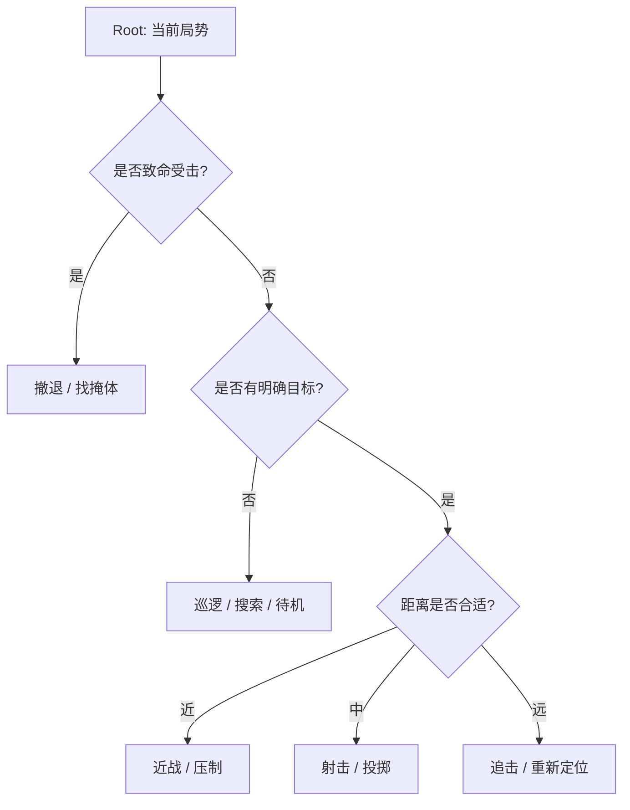
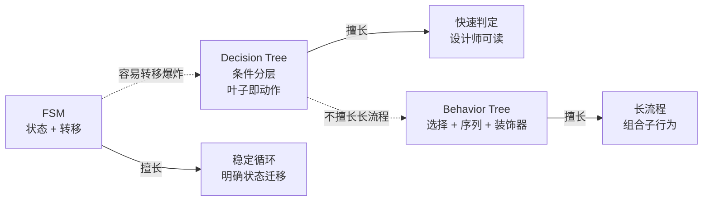

---
title: "游戏与引擎算法 27｜决策树：AI 决策基础"
slug: "algo-27-decision-tree"
date: "2026-04-17"
description: "把游戏 AI 的手工决策树讲清楚：如何用条件层级、可视化 authoring 和局部重构控制复杂度，并和 FSM、Behavior Tree 划出边界。"
tags:
  - "决策树"
  - "游戏AI"
  - "条件树"
  - "authoring"
  - "FSM"
  - "Behavior Tree"
  - "层级拆分"
  - "脚本化"
series: "游戏与引擎算法"
weight: 1827
---

一句话本质：这里的决策树不是机器学习里的分类树，而是给设计师和 AI 程序员用的手工条件树，用层级判断把“这时该做什么”拆成可维护、可调试的分支。

> 读这篇之前：建议先看 [Job System 原理]() 和 [Work Stealing 调度]()。前者说明大规模 AI 决策如何并行评估，后者说明很多小分支怎样避免调度开销拖垮帧预算。

## 问题动机

游戏 AI 最先崩的，通常不是“不会思考”，而是“分支太多以后，谁也不敢改”。
一个角色有攻击、追击、找掩体、后撤、换弹、呼叫支援、看见玩家、看不见玩家、低血、缺弹、被包围等条件时，如果每个条件都直接写成散落的 `if/else`，最后会变成互相打架的脚本。

决策树的价值，在于把这些条件整理成一个可视化的判断层级。
它让“先判断什么、后判断什么、哪些条件是大类、哪些条件只是叶子”变得非常明确。
对设计师来说，这比读一堆散落在行为脚本里的逻辑更接近作者工作流。

更重要的是，决策树比 FSM 更容易扩展。
FSM 在复杂角色上容易爆炸，因为状态一多，状态之间的转移组合就失控；决策树把很多“从 A 到 B 的边”收缩成对条件的层层筛选。
但它也比 Behavior Tree 更窄：它擅长做“判断”，不擅长做长流程的并发与回退控制。

## 历史背景

游戏 AI 早期大量依赖脚本和 FSM。
它们足够直接，也足够容易落地，但一旦角色复杂度上来，维护成本会迅速爬升。
决策树作为游戏中的手工 authoring 结构，正是在这个阶段被反复使用：用树状条件把“从海量规则里挑一个动作”变成自顶向下的确定性选择。

2000 年代中期，Bungie 在 Halo 3 里公开了 *Objective Trees* 的思路：把 encounter 里的任务定义成带优先级、容量和激活条件的树，让系统在运行时把 squad 分配到当前最重要的任务上。
这类系统和机器学习决策树没有关系，但它们把“树”用作作者可控的决策表达，思路非常接近游戏里的条件树。

同一时期，Game AI Pro 里关于 behavior selection、FSM、utility theory 和结构化 AI 的章节也反复强调：复杂 AI 的问题不是有没有数学模型，而是能不能让作者在脑子里装下整个系统。
决策树之所以长期存在，原因就在这里——它是最容易被人读懂、最容易被关卡设计和战斗设计反复试错的一种层级结构。

## 数学与理论基础

游戏里的决策树，本质上是一个有根有序树。
每个内部节点对应一个条件判断，每个叶子对应一个动作、一个子流程或一个更小的策略片段。
如果树的深度是 $d$，平均分支数是 $b$，最坏情况下的叶子数上界是 $b^d$；但一次求值只沿着一条路径走，复杂度是 $O(d)$。

这和 FSM 很不一样。
FSM 的状态数如果是 $n$，且每个状态都可能转到其他状态，那么转移边最坏可到 $O(n^2)$。
这也是为什么复杂角色更适合把决策逻辑“向上收束”为条件树，而不是“向外扩张”为巨大状态网。

决策树最关键的理论问题不是“最优性”，而是“判定顺序”。
如果一个条件能以很小的代价迅速排除大批分支，就应该放在靠上的层级；如果一个条件很贵、但只在少数情况下才需要，就应该尽量往下放。
这是典型的启发式代价排序问题，而不是统计学习问题。

## 推导：从 if/else 到可维护条件树

直接堆 `if/else` 的问题，不在语法，在结构。
你会得到很多局部判断，但很难看出“这类角色当前总共有几个大方向”，也很难做统一调试。
决策树把这些逻辑提升成“节点”，让条件复用、分支共享、局部替换都更容易。

构建决策树时，通常先按最稳定的高层语义拆分：
先判断是否有硬性禁行条件，再判断战斗态势，再判断资源状态，最后才落到具体动作。
这样做的原因很简单：越上层的判断越应该快速、稳定、可解释。

另一条经验是把“互斥策略”放在同层。
比如“进攻”和“撤退”通常不应该在两个互不相干的树枝里各自偷偷判断，而应该在同一个高层节点下由统一的态势评估决定。
否则设计师一改一个条件，另一个分支可能完全不知道自己为何被选中。

## 图示 1：条件树的作者视角



## 图示 2：决策树、FSM、Behavior Tree 的边界



## 算法实现

下面的实现把决策树做成可配置节点：内部节点保存一个谓词和两个分支，叶子节点保存一个动作。
它支持上下文对象、可解释的 `Reason`，并且可以在编辑器里序列化成树。

```csharp
using System;
using System.Collections.Generic;

public sealed class DecisionTree<TContext, TResult>
{
    private readonly INode _root;

    public DecisionTree(INode root)
    {
        _root = root ?? throw new ArgumentNullException(nameof(root));
    }

    public TResult Evaluate(TContext context, out string reason)
    {
        return _root.Evaluate(context, out reason);
    }

    public interface INode
    {
        TResult Evaluate(TContext context, out string reason);
    }

    public sealed class LeafNode : INode
    {
        private readonly Func<TContext, TResult> _action;
        private readonly string _label;

        public LeafNode(string label, Func<TContext, TResult> action)
        {
            _label = label ?? throw new ArgumentNullException(nameof(label));
            _action = action ?? throw new ArgumentNullException(nameof(action));
        }

        public TResult Evaluate(TContext context, out string reason)
        {
            reason = _label;
            return _action(context);
        }
    }

    public sealed class BranchNode : INode
    {
        private readonly string _label;
        private readonly Func<TContext, bool> _predicate;
        private readonly INode _trueBranch;
        private readonly INode _falseBranch;

        public BranchNode(string label, Func<TContext, bool> predicate, INode trueBranch, INode falseBranch)
        {
            _label = label ?? throw new ArgumentNullException(nameof(label));
            _predicate = predicate ?? throw new ArgumentNullException(nameof(predicate));
            _trueBranch = trueBranch ?? throw new ArgumentNullException(nameof(trueBranch));
            _falseBranch = falseBranch ?? throw new ArgumentNullException(nameof(falseBranch));
        }

        public TResult Evaluate(TContext context, out string reason)
        {
            if (_predicate(context))
            {
                var value = _trueBranch.Evaluate(context, out var childReason);
                reason = $"{_label}: true -> {childReason}";
                return value;
            }

            var falseValue = _falseBranch.Evaluate(context, out var falseReason);
            reason = $"{_label}: false -> {falseReason}";
            return falseValue;
        }
    }
}

public readonly record struct CombatContext(
    bool IsHitCritical,
    bool HasVisibleTarget,
    bool IsLowAmmo,
    float DistanceToTarget,
    float HealthRatio,
    bool HasCover)
{
    public bool IsLowHealth => HealthRatio < 0.35f;
    public bool IsMidRange => DistanceToTarget >= 8f && DistanceToTarget <= 25f;
    public bool IsCloseRange => DistanceToTarget < 8f;
}

public static class ExampleDecisionTree
{
    public static DecisionTree<CombatContext, string> Build()
    {
        var retreat = new DecisionTree<CombatContext, string>.LeafNode("critical damage -> retreat", _ => "Retreat");
        var search = new DecisionTree<CombatContext, string>.LeafNode("no target -> search", _ => "Search");
        var reload = new DecisionTree<CombatContext, string>.LeafNode("low ammo -> reload", _ => "Reload");
        var close = new DecisionTree<CombatContext, string>.LeafNode("close range -> melee", _ => "MeleeAttack");
        var mid = new DecisionTree<CombatContext, string>.LeafNode("mid range -> attack", _ => "FireWeapon");
        var far = new DecisionTree<CombatContext, string>.LeafNode("far range -> reposition", _ => "Reposition");

        var range = new DecisionTree<CombatContext, string>.BranchNode(
            "range",
            c => c.IsCloseRange,
            close,
            new DecisionTree<CombatContext, string>.BranchNode(
                "mid range",
                c => c.IsMidRange,
                mid,
                far));

        var resource = new DecisionTree<CombatContext, string>.BranchNode(
            "low ammo",
            c => c.IsLowAmmo,
            reload,
            range);

        var hasTarget = new DecisionTree<CombatContext, string>.BranchNode(
            "has target",
            c => c.HasVisibleTarget,
            resource,
            search);

        var root = new DecisionTree<CombatContext, string>.BranchNode(
            "critical damage",
            c => c.IsHitCritical || c.IsLowHealth,
            retreat,
            hasTarget);

        return new DecisionTree<CombatContext, string>(root);
    }
}
```

这个实现故意保留了三个作者友好点。
第一，节点可直接序列化进编辑器。
第二，每次评估都能带回 `reason`，方便调试和回放。
第三，树的结构天然支持“把大分支拆成子树”，这正是游戏 AI 里最常见的维护方式。

## 复杂度分析

对单次查询来说，决策树的时间复杂度是 $O(d)$，空间复杂度是 $O(d)$（如果递归展开调用栈）或 $O(1)$（如果迭代实现）。
从维护角度看，它的编辑复杂度通常比 FSM 低，因为新增一个大类行为时，往往只需要插入或替换一小段子树，而不是把状态转移矩阵重新补一遍。

但它也不是零成本。
如果树的公共条件没有抽出来，很多叶子都会重复计算同样的 predicate，最后会回到“换个壳的 if/else 海”。
因此真正的维护重点，不是画出树本身，而是抽出可以复用的高层判断和共享条件。

## 变体与优化

常见变体有三类。

- 数据驱动树：节点不写死在代码里，而是由 JSON、Lua、ScriptableObject 或专用编辑器描述。
- 分层决策树：把高层态势判断和低层动作选择拆成多个子树。
- 规则树 / 优先级树：把叶子替换成带优先级或权重的选择器，向 Behavior Tree 靠拢。

优化通常集中在三件事。

- 先判便宜条件，再判昂贵条件，减少平均分支代价。
- 把高频共享条件缓存到上下文里，避免重复计算。
- 对大规模 NPC 评估做批处理，交给 Job System / work stealing 去跑。

## 对比其他算法

| 结构 | 强项 | 弱项 | 典型用途 |
|---|---|---|---|
| 决策树 | 条件分层清晰、易 authoring | 不擅长长流程和并发控制 | 角色选择、战斗分流 |
| FSM | 状态稳定、行为可控 | 转移边爆炸、难扩展 | 状态循环、低复杂行为 |
| Behavior Tree | 组合行为强、可表达长流程 | 工程复杂度高，调试更重 | 复杂 NPC、长链行为 |
| Utility AI | 连续评分，选择更平滑 | 需要曲线调参和归一化 | 动态权衡、软决策 |

决策树最适合做“入口层”。
它像一个总分流器：先判断当前属于哪一类问题，再把后续的执行交给 FSM、BT 或动作系统。

## 批判性讨论

决策树最大的弱点，是它容易长成“全是条件的树”。
如果设计师没有统一的命名、层级和复用规范，树会在很短时间内变成重复逻辑的温床。

另一个弱点是它是硬分支。
如果条件稍微抖动，就会立刻从一条叶子跳到另一条叶子，角色表现会显得机械。
这也是为什么很多项目会把决策树只用在高层切换，而把叶子行为交给更连续的系统，比如 BT、Utility AI 或带冷却的状态机。

它还不擅长表达“多个目标同时存在”的情况。
遇到这种需求时，单纯的决策树往往会被逼成权重系统，最后又会走向 utility AI。
这不是失败，而是它的边界被推到了更适合连续评分的区域。

## 跨学科视角

决策树和编译器的控制流图很像。
它们都在做条件分流，只不过编译器关心可达性和优化，游戏 AI 关心作者可控性和玩家可读性。

它也像诊断树或故障排查流程。
医生或运维工程师先按症状缩小范围，再进入更细的判断，这和游戏 AI 的“先分态势，再分动作”非常一致。

再往工程一点看，决策树的价值和可观测性高度相关。
如果每个节点都能打印理由，设计师就能把“为什么没选那个动作”快速定位到树上的某一层，而不是去全文搜脚本。

## 真实案例

- [Building a Better Battle: HALO 3 AI Objectives](https://gdcvault.com/play/497/Building-a-Better-Battle-HALO) 是 Damian Isla 在 GDC 2008 的官方演讲页，明确说明 Objective Trees 是面向设计师的 encounter authoring / scripting 方法，用来把任务按优先级和容量分配给 squad。
- [AIIDE 2008 Program PDF](https://aaai.org/wp-content/uploads/2023/01/aiide08program-1.pdf) 收录了 Damián Isla 的 Halo 3 Objective Trees 演讲，说明这套方法是正式会议材料，不是二手转述。
- [Combat Dialogue in FEAR: The Illusion of Communication](https://www.gameaipro.com/GameAIPro2/GameAIPro2_Chapter02_Combat_Dialogue_in_FEAR_The_Illusion_of_Communication.pdf) 展示了 FEAR 如何用有条件的 squad dialogue 和状态分流，让简单逻辑表现出“队友在协作”的幻觉。
- [Behavior Selection Algorithms: An Overview](https://www.gameaipro.com/GameAIPro/GameAIPro_Chapter04_Behavior_Selection_Algorithms_An_Overview.pdf) 讨论了 FSM、规则、优先级和其它选择结构的边界，也解释了为什么复杂 AI 需要层级化结构，而不是平铺一堆 if/else。
- [A Character Decision-Making System for FINAL FANTASY XV by Combining Behavior Trees and State Machines](https://www.gameaipro.com/GameAIPro3/GameAIPro3_Chapter11_A_Character_Decision-Making_System_for_FINAL_FANTASY_XV_by_Combining_Behavior_Trees_and_State_Machines.pdf) 提供了一个工业级混合架构案例：高层决策和底层行为分开，各司其职。

## 量化数据

Halo 3 的 Objective Trees 演讲里最直接的量化点，是它把任务分配问题写成了有容量约束的分配问题：任务有 capacity，squad 要从上往下“过滤”，而不是对每个行为都手工连转移边。
演讲中还明确指出，Halo 2 式的显式转移会走向 $n^2$ 级复杂度，而 Halo 3 的树状分流把维护重点收缩到局部子树。

从一般工程角度看，如果一个角色有 25 个原子状态，且每个状态都可能连到 6 个其它状态，FSM 至少要维护 150 条转移边。
如果改成三层决策树，假设根节点 4 分支、第二层 3 分支、叶子 2 分支，作者只需要维护有限的层级条件，而不必维护接近全连接的转移图。

这不是“数学上更优”，而是“编辑成本和认知成本更低”。
对游戏 AI 来说，这种成本往往比 CPU 成本更早成为瓶颈。

## 常见坑

- 把机器学习决策树的训练语义混进来。为什么错：游戏里的决策树通常是手工 authoring，不是训练分类器。怎么改：只把它当作条件分流结构来设计。
- 把所有判断都堆在同一层。为什么错：树会退化成一串难维护的 if/else。怎么改：把高层态势、资源状态和动作选择拆开。
- 叶子直接执行太重的逻辑。为什么错：判断层和执行层耦在一起，调试困难。怎么改：叶子只给出策略或动作 ID，真正执行交给行为层。
- 每个叶子都重复检查同一批条件。为什么错：重复计算让树评估变慢。怎么改：把共享 predicate 提前上提成父节点。
- 节点命名不稳定。为什么错：设计师和程序员无法对齐讨论。怎么改：让每个节点都能输出稳定的 reason / path。

## 何时用 / 何时不用

适合用决策树的情况：

- 你在做角色的高层行为入口。
- 条件分流明显，且需要强 authoring 可控性。
- 设计师希望通过可视化结构快速迭代。

不适合用决策树的情况：

- 你需要连续评分、平滑切换或软偏好。
- 你的行为需要长链执行、并发、回退和恢复。
- 条件数量太多，已经明显出现重复和抖动。

## 相关算法

- [Utility AI：评分决策]()
- [Job System 原理]()
- [Work Stealing 调度]()
- [浮点精度与数值稳定性]()

## 小结

决策树在游戏 AI 里的位置很明确：它是条件 authoring 的骨架，不是智能本身。
它最擅长的是把复杂的“如果这样就那样”整理成可解释、可维护、可复用的层级结构。

当角色越来越复杂时，决策树往往不是终点，而是入口。
它先把大类问题分出来，再把更细的行为交给 FSM、BT、Utility AI 或任务系统去做。

## 参考资料

- [Building a Better Battle: HALO 3 AI Objectives](https://gdcvault.com/play/497/Building-a-Better-Battle-HALO)
- [AIIDE 2008 Program PDF](https://aaai.org/wp-content/uploads/2023/01/aiide08program-1.pdf)
- [Combat Dialogue in FEAR: The Illusion of Communication](https://www.gameaipro.com/GameAIPro2/GameAIPro2_Chapter02_Combat_Dialogue_in_FEAR_The_Illusion_of_Communication.pdf)
- [Behavior Selection Algorithms: An Overview](https://www.gameaipro.com/GameAIPro/GameAIPro_Chapter04_Behavior_Selection_Algorithms_An_Overview.pdf)
- [Structural Architecture: Tricks of the Trade](https://www.gameaipro.com/papers/structural-architecture-tricks-of-the-trade.html)
- [A Character Decision-Making System for FINAL FANTASY XV by Combining Behavior Trees and State Machines](https://www.gameaipro.com/GameAIPro3/GameAIPro3_Chapter11_A_Character_Decision-Making_System_for_FINAL_FANTASY_XV_by_Combining_Behavior_Trees_and_State_Machines.pdf)

