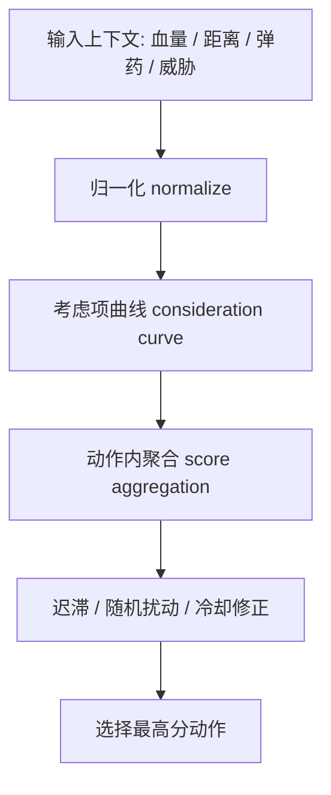
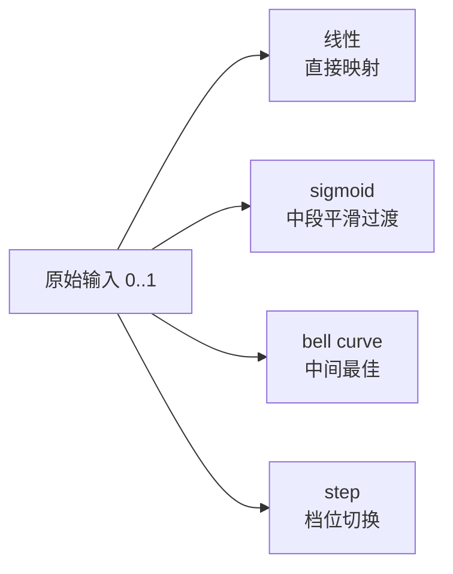

---
title: "游戏与引擎算法 28｜Utility AI：评分决策"
slug: "algo-28-utility-ai"
date: "2026-04-17"
description: "讲透 Utility AI 的 consideration curve、score aggregation、上下文归一化、抖动控制与迟滞，让‘连续评分’真正替代粗糙的 if/else。"
tags:
  - "Utility AI"
  - "评分决策"
  - "consideration curve"
  - "response curve"
  - "归一化"
  - "迟滞"
  - "游戏AI"
  - "行为选择"
series: "游戏与引擎算法"
weight: 1828
---

一句话本质：Utility AI 不是“找一个满足条件的动作”，而是把每个动作的适配度映射成连续分数，再通过曲线、聚合和迟滞选择当前最合适的行为。

> 读这篇之前：建议先看 [决策树：AI 决策基础]() 和 [浮点精度与数值稳定性]()。前者说明离散分流怎么工作，后者说明连续评分为什么一定要关注阈值、归一化和数值噪声。

## 问题动机

如果说决策树解决的是“这个角色现在属于哪一类情况”，Utility AI 解决的就是“在这类情况里，哪个动作最值”。
它不喜欢硬切换，而喜欢连续变化。
血量从 40% 掉到 39% 时，角色不应该突然从勇猛进攻跳成无限逃跑；更合理的是，撤退意愿慢慢上升，攻击意愿慢慢下降。

这类连续性对玩家体验非常重要。
当 AI 的选择像开关一样抖来抖去时，玩家会立刻感到“这不是人，是脚本”。
Utility AI 的目标，就是用曲线和评分把这种抖动压平，同时还保留可调参、可解释和可 authoring 的空间。

它特别适合“多个都合理，但哪个更合适”的场景：
喝血还是换弹、追击还是包抄、站位还是补位、继续搜敌还是放弃搜索、使用大招还是省蓝。
这些问题不是布尔问题，而是权衡问题。

## 历史背景

Utility AI 的思想根子不在游戏，而在经济学、心理学、决策理论和控制理论。
它在游戏 AI 里真正流行起来，是因为设计师需要一种比 FSM 更柔和、比脚本更自适应、比纯规则列表更有表达力的方式。

Dave Mark 和 Kevin Dill 在 GDC / AI Summit 上多次讲过 utility-based AI。
2010 年的 *Improving AI Decision Modeling Through Utility Theory* 直接把 response curves、population distributions 和 weighted random 作为游戏 AI 的工具箱。
2012 年的 *Embracing the Dark Art of Mathematical Modeling in AI* 又把这些思路进一步落到实际游戏场景里，说明 utility 不是抽象玩具，而是可生产的决策方法。

Game AI Pro 也持续把这条线往前推。
从 *An Introduction to Utility Theory* 到 *Choosing Effective Utility-Based Considerations*，重点都不是“utility 多高深”，而是“怎样把真实游戏里的需求写成可复用的考虑项”。
这正是 Utility AI 和传统决策树的分界线：前者看连续度，后者看分流。

## 数学与理论基础

Utility AI 的基本公式很简单。
对动作 $a_i$，我们定义若干考虑项 $c_{ij}$，每个考虑项先把上下文值 $x_j$ 归一化，再通过响应曲线 $f_{ij}$ 变成 $[0,1]$ 之间的分数：
$$
c_{ij} = f_{ij}(\mathrm{normalize}(x_j)).
$$

最后把这些考虑项聚合成动作分数 $S_i$。
最常见的两种聚合方式是加权和和加权乘积：
$$
S_i = \sum_j w_{ij} c_{ij}
$$
或
$$
S_i = \prod_j c_{ij}^{w_{ij}}.
$$

加权和直观，容易调参，但会允许一个很差的考虑项被其它高分项部分掩盖。
加权乘积更“苛刻”，任何一个重要条件掉得很低，整体分数都会被拉下来，所以更适合“这些条件缺一不可”的动作。

真正的难点在于归一化。
如果不同输入的量纲不同，比如血量是 0~100、距离是 0~80 米、威胁值是 0~5，直接比较毫无意义。
因此每个输入都必须先被映射到统一尺度，最常见的就是
$$
\hat{x}=\mathrm{clamp}\left(\frac{x-x_{min}}{x_{max}-x_{min}}, 0, 1\right).
$$

## 推导：为什么曲线比阈值更重要

一个阈值能回答“够不够”，但回答不了“有多合适”。
游戏 AI 大量情况下需要后者。
例如低血量越低，撤退动机越强，但这条关系通常不是线性的；再比如距离目标越近，近战意愿可能先升后降，也不是单调函数。

这就是 consideration curve 的价值。
曲线让设计师可以把经验性规则写成连续映射：
- 线性曲线适合简单单调关系；
- sigmoid 适合中间过渡；
- bell curve 适合“中间最好、太近太远都不好”；
- stepped curve 适合离散门槛和档位选择。

Utility AI 的另一个关键，是把“评分”和“选择”分离。
评分阶段只负责把条件变成可比数值，选择阶段再根据最高分、随机扰动或迟滞策略决定最终动作。
这样做的好处是：同一套评分可以被多个上层策略复用，而选择层可以按角色性格、难度或战斗节奏调整。

## 图示 1：Utility AI 的评分流水线



## 图示 2：不同响应曲线的直觉



## 算法实现

下面的实现把 Utility AI 分成三个层次：
- `UtilityAction` 描述一个动作和它的考虑项；
- `Consideration` 把一个上下文值映射成分数；
- `UtilityBrain` 负责评分、迟滞和最终选择。

```csharp
using System;
using System.Collections.Generic;
using System.Linq;

public sealed class UtilityBrain<TContext, TResult>
{
    private readonly List<UtilityAction<TContext, TResult>> _actions = new();
    private readonly Func<TContext, string, float> _random01;
    private readonly float _hysteresisMargin;
    private readonly float _noiseAmplitude;
    private string? _currentActionId;

    public UtilityBrain(Func<TContext, string, float> random01, float hysteresisMargin = 0.08f, float noiseAmplitude = 0.02f)
    {
        _random01 = random01 ?? throw new ArgumentNullException(nameof(random01));
        _hysteresisMargin = Math.Clamp(hysteresisMargin, 0f, 0.5f);
        _noiseAmplitude = Math.Clamp(noiseAmplitude, 0f, 0.25f);
    }

    public void AddAction(UtilityAction<TContext, TResult> action)
    {
        _actions.Add(action ?? throw new ArgumentNullException(nameof(action)));
    }

    public SelectionResult<TResult> Tick(TContext context)
    {
        if (_actions.Count == 0)
            throw new InvalidOperationException("No utility actions registered.");

        var evaluated = new List<EvaluatedAction>(_actions.Count);
        foreach (var action in _actions)
        {
            float score = action.Evaluate(context);
            score += Jitter(context, action.Id);
            evaluated.Add(new EvaluatedAction(action.Id, action.Execute, score));
        }

        evaluated.Sort((a, b) => b.Score.CompareTo(a.Score));
        var best = evaluated[0];
        var current = evaluated.FirstOrDefault(a => a.Id == _currentActionId);

        if (_currentActionId is not null && current.Id is not null)
        {
            if (current.Score + _hysteresisMargin >= best.Score)
                return new SelectionResult<TResult>(current.Id, current.Action(context), current.Score, retained: true);
        }

        _currentActionId = best.Id;
        return new SelectionResult<TResult>(best.Id, best.Action(context), best.Score, retained: false);
    }

    private float Jitter(TContext context, string actionId)
    {
        float r = _random01(context, actionId);
        return (r * 2f - 1f) * _noiseAmplitude;
    }

    private readonly record struct EvaluatedAction(string Id, Func<TContext, TResult> Action, float Score);
}

public sealed class UtilityAction<TContext, TResult>
{
    private readonly List<IConsideration<TContext>> _considerations = new();
    private readonly Func<TContext, TResult> _execute;
    private readonly string _id;
    private readonly AggregationMode _mode;

    public UtilityAction(string id, Func<TContext, TResult> execute, AggregationMode mode = AggregationMode.Product)
    {
        _id = id ?? throw new ArgumentNullException(nameof(id));
        _execute = execute ?? throw new ArgumentNullException(nameof(execute));
        _mode = mode;
    }

    public string Id => _id;

    public void AddConsideration(IConsideration<TContext> consideration)
    {
        _considerations.Add(consideration ?? throw new ArgumentNullException(nameof(consideration)));
    }

    public float Evaluate(TContext context)
    {
        if (_considerations.Count == 0)
            return 1f;

        return _mode switch
        {
            AggregationMode.Sum => EvaluateSum(context),
            _ => EvaluateProduct(context)
        };
    }

    public TResult Execute(TContext context) => _execute(context);

    private float EvaluateSum(TContext context)
    {
        float weighted = 0f;
        float weightSum = 0f;
        foreach (var c in _considerations)
        {
            float s = c.Score(context);
            weighted += s * c.Weight;
            weightSum += c.Weight;
        }
        return weightSum <= 0f ? 0f : weighted / weightSum;
    }

    private float EvaluateProduct(TContext context)
    {
        float result = 1f;
        float weightSum = 0f;
        foreach (var c in _considerations)
        {
            float s = Math.Clamp(c.Score(context), 0f, 1f);
            result *= MathF.Pow(Math.Max(s, 0.0001f), c.Weight);
            weightSum += c.Weight;
        }
        return weightSum <= 0f ? 0f : MathF.Pow(result, 1f / weightSum);
    }
}

public interface IConsideration<TContext>
{
    float Weight { get; }
    float Score(TContext context);
}

public sealed class CurveConsideration<TContext> : IConsideration<TContext>
{
    private readonly Func<TContext, float> _input;
    private readonly Func<float, float> _curve;
    private readonly float _min;
    private readonly float _max;
    public float Weight { get; }

    public CurveConsideration(float weight, float min, float max, Func<TContext, float> input, Func<float, float> curve)
    {
        if (max <= min) throw new ArgumentException("max must be greater than min.");
        Weight = Math.Max(0f, weight);
        _min = min;
        _max = max;
        _input = input ?? throw new ArgumentNullException(nameof(input));
        _curve = curve ?? throw new ArgumentNullException(nameof(curve));
    }

    public float Score(TContext context)
    {
        float value = _input(context);
        float normalized = Math.Clamp((value - _min) / (_max - _min), 0f, 1f);
        return Math.Clamp(_curve(normalized), 0f, 1f);
    }
}

public static class UtilityCurves
{
    public static Func<float, float> Linear() => x => x;

    public static Func<float, float> InverseLinear() => x => 1f - x;

    public static Func<float, float> Sigmoid(float sharpness = 10f)
        => x => 1f / (1f + MathF.Exp(-sharpness * (x - 0.5f)));

    public static Func<float, float> Bell(float center = 0.5f, float width = 0.25f)
        => x => MathF.Exp(-MathF.Pow((x - center) / Math.Max(width, 0.0001f), 2f));

    public static Func<float, float> SmoothStep()
        => x => x * x * (3f - 2f * x);
}

public enum AggregationMode
{
    Sum,
    Product
}

public readonly record struct SelectionResult<TResult>(string Id, TResult Result, float Score, bool Retained);


```

这个实现里，`CurveConsideration` 负责把上下文转成统一分数，`UtilityCurves` 负责把设计师语言翻译成数学曲线，`UtilityBrain` 负责处理抖动和迟滞。生产环境里，这里的 `Execute` 更适合作为“返回动作 token / command 对象”的选择器；真正带副作用的执行，应该放在评分完成之后的行为层。
它和传统决策树最大的差别，就是“选择”不是一步到位的布尔判定，而是一个连续排序过程。

如果要更接近生产用法，通常还会再加三层：
黑板缓存、动作冷却、以及输入信号的时间滤波。
这些都不是为了让模型更复杂，而是为了避免一帧一帧地在边界上来回跳。

## 复杂度分析

Utility AI 的每次 tick 成本，基本上是动作数乘以每个动作的考虑项数。
如果有 $N$ 个动作，每个动作平均 $M$ 个考虑项，那么单帧复杂度大致是 $O(NM)$。
这比决策树的单路径 $O(d)$ 贵，但它换来的是连续性、平滑性和更强的表达力。

从调度角度看，这也是典型的可并行工作负载。
多个 NPC 的评分可以拆成并行 job，或者把每个 action 的考虑项批量计算后再汇总。
只要上下文是只读的，Utility AI 非常适合和 Job System、Burst 或 SIMD 结合。

## 变体与优化

Utility AI 常见变体有四类。

- Weighted sum：最容易理解，适合原型和调参初期。
- Weighted product / geometric mean：对短板更敏感，适合“缺一不可”的动作。
- Stochastic utility：按分数软采样，减少过拟合和机械感。
- Hierarchical utility：高层先选意图，低层再选具体动作。

工程优化也很明确。

- 先做归一化，再做曲线，不要把量纲混进权重里。
- 对连续输入做平滑或时间滤波，减少抖动。
- 把冷却、硬性约束和软评分分开，不要让一个曲线承担所有职责。
- 对大量 NPC 使用批处理，让同一类 consideration 一次算完。

## 对比其他算法

| 方法 | 优点 | 缺点 | 适合场景 |
|---|---|---|---|
| 决策树 | 清晰、确定性强 | 硬切换、扩展后容易重复 | 高层分流 |
| FSM | 状态明确、易控 | 状态/转移爆炸 | 短周期行为 |
| Behavior Tree | 长流程组合强 | 结构更重，调试成本高 | 复杂交互流程 |
| Utility AI | 连续、平滑、可软权衡 | 调参多、需要归一化 | 多目标权衡、动态选择 |

Utility AI 最值得替代决策树的地方，不是“逻辑更多”，而是“逻辑更连续”。
当你想表达“现在更倾向于某动作，但还没到必须切换”的时候，它几乎总比布尔树更自然。

## 批判性讨论

Utility AI 的缺点很真实。
最常见的问题不是算不动，而是“调不稳”。
曲线太陡会变成硬切，太平又会变成谁都差不多；权重太大时，某个 consideration 会盖过所有其它信号，最终行为看起来还是很机械。

另一个问题是隐藏复杂度。
表面上它比 FSM 简单，实际上你把复杂度从“状态转移”搬到了“曲线形状、权重、归一化区间、迟滞阈值和冷却参数”上。
这不是坏事，但它要求团队有更强的调参纪律。

如果项目缺少数据回放、可视化和自动测试，Utility AI 很容易演化成“只有某个老 AI 工程师知道怎么调”的黑箱。
所以真正成熟的做法，是把每个考虑项、曲线和最终分数都可视化出来，而不是只显示最终动作。

## 跨学科视角

Utility AI 很像控制理论里的连续控制器。
输入不是非黑即白，而是沿着曲线逐渐变化，输出也因此更平滑。
这和 PID、阈值控制、死区和迟滞本质上都属于一类思想：避免在边界附近反复翻转。

它也像信号处理。
归一化是把不同频段对齐，曲线是滤波器的响应函数，迟滞是噪声抑制。
当角色行为输入本来就带着抖动时，Utility AI 实际上是在做一个有语义的低通系统。

再往数学上看，它接近多目标优化的标量化。
你把几个不可直接比较的目标压成一个分数，再在分数空间里做选择。
这当然损失信息，但它换来的是可解释、可调优、可落地。

## 真实案例

- [Improving AI Decision Modeling Through Utility Theory](https://www.gdcvault.com/play/1012841/Improving-AI-Decision-Modeling-Through) 是 Dave Mark 和 Kevin Dill 的 GDC 2010 资料，直接把 utility theory、response curves 和 weighted random 带入游戏 AI。
- [Embracing the Dark Art of Mathematical Modeling in AI](https://www.gdcvault.com/play/1015683/embracing-the-dark-art-of) 是他们 2012 年的后续分享，继续用 utility-based AI 解释更复杂的行为选择和真实案例。
- [Game AI Pro 3 Chapter 13: Choosing Effective Utility-Based Considerations](https://www.gameaipro.com/GameAIPro3/GameAIPro3_Chapter13_Choosing_Effective_Utility-Based_Considerations.pdf) 把 utility considerations 落到 Guild Wars 2 的具体决策项上，说明这不是理论玩具，而是能在 AAA 项目里持续打磨的工具。
- [Game Creator Utility AI 文档](https://docs.gamecreator.io/behavior/utility-ai/) 是现成的工业产品文档，直接把 need / score / curve 作为行为选择方式，并且明确提到它适合“需要连续需求驱动”的角色。
- [Game AI Pro 2 的 Dual-Utility Reasoning](https://www.gameaipro.com/GameAIPro2/GameAIPro2_Chapter03_Dual-Utility_Reasoning.pdf) 和 [Building Utility Decisions into Your Existing Behavior Tree](https://www.gameaipro.com/GameAIPro/GameAIPro_Chapter10_Building_Utility_Decisions_into_Your_Existing_Behavior_Tree.pdf) 说明 utility 并不要求你推翻现有架构，它可以作为行为树上的决策层慢慢接入。

## 量化数据

Utility AI 的单帧成本可以很直接地估算：如果有 18 个动作、每个动作平均 5 个考虑项，那么一次评分就是 90 次曲线评估。
如果这个脑子要同时服务 120 个 NPC，那就是 10,800 次评分函数调用每帧，60 Hz 下是 648,000 次每秒。
这类数字不是论文实测，而是典型生产预算的量级估算，足够说明为什么它和 Job System、SIMD、批处理常常绑在一起。

GDC 2010 和 2012 的 utility theory 分享都强调，response curves、population distributions 和 weighted random 能把离散的 yes/no 变成连续的决策空间。
换句话说，它的性能压力不在“算不算得动”，而在“你能不能用更少的计算得到更平滑的行为边界”。

另一个量化点是迟滞。
如果两个动作分数只差 0.01，而你设置的 hysteresis margin 是 0.08，那么系统会明显更不容易抖动。
这不是纯算法胜利，而是工程上用一点保守性换玩家可感知稳定性的典型做法。

## 常见坑

- 不做归一化。为什么错：不同量纲直接相乘或相加，权重毫无意义。怎么改：先把输入映射到统一区间，再谈曲线和权重。
- 所有曲线都写成线性。为什么错：线性很少符合真实设计意图。怎么改：把 sigmoid、bell、step、smoothstep 当成基础组件。
- 过度依赖加权乘积。为什么错：一个小分数会把整体压得过低，导致动作不敢被选。怎么改：对“必须满足”和“偏好满足”分开建模。
- 没有迟滞。为什么错：邻近动作会频繁互换。怎么改：给当前动作加保持窗口或切换门槛。
- 把所有东西都塞进一个总分。为什么错：调参会失去解释性。怎么改：分层评分，把硬约束、软偏好和冷却时间拆开。

## 何时用 / 何时不用

适合用 Utility AI 的情况：

- 多个动作都合理，但需要连续权衡。
- 角色行为需要更自然的切换，而不是硬分支。
- 你愿意投入曲线和权重的调参成本。

不适合用 Utility AI 的情况：

- 你需要绝对确定的流程控制。
- 你的行为长链依赖很多阶段状态，Utility 只是入口，不是执行器。
- 团队没有可视化和回放工具，没法稳定调曲线。

## 相关算法

- [决策树：AI 决策基础]()
- [Job System 原理]()
- [Work Stealing 调度]()
- [浮点精度与数值稳定性]()

## 小结

Utility AI 解决的是“怎么在一堆都合理的动作里，选出最合适的那个”。
它把决策从布尔世界搬到连续世界，用归一化、响应曲线、聚合和迟滞把行为做得更像一个会权衡的系统。

它的代价是参数更多、调试更细，但它换来的也是更自然的角色、更平滑的切换和更强的设计表达力。
如果说决策树解决“属于哪类”，那 Utility AI 解决的就是“在这一类里，倾向哪一个”。

## 参考资料

- [Improving AI Decision Modeling Through Utility Theory](https://www.gdcvault.com/play/1012841/Improving-AI-Decision-Modeling-Through)
- [Embracing the Dark Art of Mathematical Modeling in AI](https://www.gdcvault.com/play/1015683/embracing-the-dark-art-of)
- [Game AI Pro 3 Chapter 13: Choosing Effective Utility-Based Considerations](https://www.gameaipro.com/GameAIPro3/GameAIPro3_Chapter13_Choosing_Effective_Utility-Based_Considerations.pdf)
- [Game AI Pro 2 Chapter 03: Dual-Utility Reasoning](https://www.gameaipro.com/GameAIPro2/GameAIPro2_Chapter03_Dual-Utility_Reasoning.pdf)
- [Building Utility Decisions into Your Existing Behavior Tree](https://www.gameaipro.com/GameAIPro/GameAIPro_Chapter10_Building_Utility_Decisions_into_Your_Existing_Behavior_Tree.pdf)
- [Game Creator Utility AI](https://docs.gamecreator.io/behavior/utility-ai/)
- [Behavior Selection Algorithms: An Overview](https://www.gameaipro.com/GameAIPro/GameAIPro_Chapter04_Behavior_Selection_Algorithms_An_Overview.pdf)


