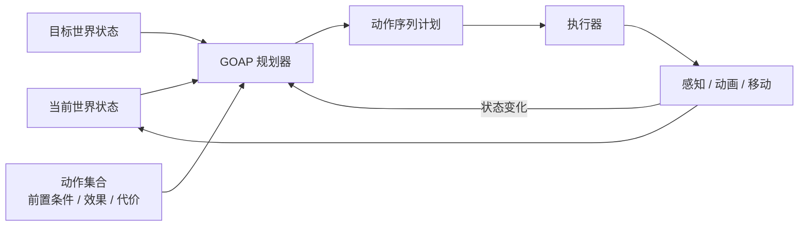
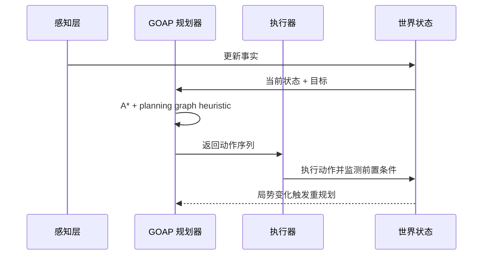

---
title: "游戏与引擎算法 29｜GOAP：目标导向计划"
slug: "algo-29-goap"
date: "2026-04-17"
description: "从 STRIPS 到 F.E.A.R. 的 GOAP：世界状态、动作前置条件与效果、A* 规划、规划图与重规划。"
tags:
  - "GOAP"
  - "STRIPS"
  - "A*规划"
  - "世界状态"
  - "前置条件"
  - "效果"
  - "规划图"
  - "重规划"
series: "游戏与引擎算法"
weight: 1829
---

> **读这篇之前**：建议先看 [数据结构与算法 06｜Dijkstra 与 A*]()。本篇会反复用到启发式搜索、open/closed list 和代价累积的概念。

一句话本质：GOAP 不是“把一堆 if-else 包成系统”，而是把 NPC 行为写成一组可搜索的动作，把当前世界状态和目标世界状态之间的差距交给规划器去补。

## 问题动机

传统 FSM 的问题不是“不会做行为”，而是行为和条件绑死后会指数膨胀。敌人想要同时处理找掩体、换弹、追击、撤退、呼叫支援、切换武器，状态数很快就不是几页图能画完的。

脚本式 AI 也有同样的问题。设计师能写出很漂亮的固定路径，但只要玩家把门关上、把掩体打烂、把距离拉开，脚本就会露出硬伤。游戏里最讨厌的不是“弱”，而是“看起来像在演”。

GOAP 的价值是把“怎么做”从“做什么”里拆出来。设计师只描述动作能满足什么前置条件、会改变什么世界状态、代价多少；规划器负责在实时世界里拼出一条可执行路径。NPC 于是能根据局势变化重排顺序，而不是死守脚本。

## 历史背景

GOAP 的根不是游戏，而是 1971 年的 STRIPS。Fikes 和 Nilsson 把动作表示成前置条件、添加列表、删除列表，给计划问题提供了一个比通用定理证明更窄的表示法。它的关键，不是“更聪明”，而是“让问题变得足够结构化”。

1997 年的 Graphplan 又把这条路往前推了一步。Blum 和 Furst 用 planning graph 显式展开事实层和动作层，把可达性信息在展开过程中传播出去，再用它做剪枝和启发式估计。对游戏 AI 来说，这类结构特别重要，因为它允许我们用“层数”和“可达性”来估计离目标还有多远。

真正把规划变成游戏工业工具的人，是 Jeff Orkin。F.E.A.R. 的 AI 不是靠巨大的脚本树堆出来的，而是靠一个可重规划的目标-动作架构。GDC 的公开资料里，Monolith 明确写了 GOAP 最早为 F.E.A.R. 在 2004 年开发，后续又被用到《Condemned》《Condemned 2》《Middle-earth: Shadow of Mordor》等作品里。

## 数学与理论基础

GOAP 本质上是 STRIPS 风格的状态空间搜索。

把世界状态记作集合 $S$，把原子命题记作 fluent。若动作 $a$ 的前置条件是 $pre(a)$，效果是 $add(a)$ 与 $del(a)$，则动作可执行的条件是：

$$
pre(a) \subseteq S
$$

执行动作后的状态转移是：

$$
\gamma(S, a) = (S \setminus del(a)) \cup add(a)
$$

给定初始状态 $S_0$ 和目标状态 $G$，我们要找一串动作 $\pi = (a_1, a_2, \dots, a_n)$，使得：

$$
G \subseteq \gamma(\cdots\gamma(\gamma(S_0, a_1), a_2)\cdots, a_n)
$$

同时最小化总代价：

$$
C(\pi) = \sum_{i=1}^{n} c(a_i)
$$

这就把问题变成了标准的启发式搜索。A* 的 `g(n)` 是已花费代价，`h(n)` 是到目标的估计距离，`f(n)=g(n)+h(n)`。GOAP 的差别只在于节点不是地图格子，而是世界状态。

## 算法推导

为什么 GOAP 常常会从 STRIPS、再到 A*、再到 planning graph 走一遍？因为每一步都在减少“搜索空间的解释成本”。

STRIPS 给出动作的最小表达式。Graphplan 告诉我们：不用一开始就枚举完整动作序列，可以先把可达事实层一层层展开，借此得到一个更便宜的下界估计。A* 再把这些估计变成实时可用的路径搜索。

在游戏里，Orkin 的实用改造很关键：

- World state 只保留设计师真的关心的少量事实。
- 动作只描述局部、可验证、可组合的效果。
- 规划器不负责执行动画、移动和感知，它只负责算顺序。
- 世界变化后立刻重规划，不把旧计划当圣旨。

这也是为什么 F.E.A.R. 那套方法能在实时游戏里跑得起来。规划器不需要“理解世界”，只需要在小而稳定的事实集合上做局部搜索。

## 结构图





## C# 实现

下面的实现保留了 GOAP 的核心结构：世界状态、动作、目标、A*、重规划。为了让规划图启发式成立，示例把世界事实当成一组稀疏布尔谓词，否定条件通常会被建模成另一条正谓词，例如 `WeaponHolstered`。

```csharp
using System;
using System.Collections.Generic;
using System.Linq;

public sealed class GoapAction
{
    public string Name { get; }
    public float Cost { get; }
    public Dictionary<string, bool> Preconditions { get; } = new();
    public Dictionary<string, bool> Effects { get; } = new();

    public GoapAction(string name, float cost)
    {
        Name = name ?? throw new ArgumentNullException(nameof(name));
        Cost = cost;
    }

    public bool IsApplicable(IReadOnlyDictionary<string, bool> state)
    {
        foreach (var kv in Preconditions)
        {
            if (!state.TryGetValue(kv.Key, out var value) || value != kv.Value)
                return false;
        }
        return true;
    }

    public Dictionary<string, bool> Apply(IReadOnlyDictionary<string, bool> state)
    {
        var next = new Dictionary<string, bool>(state);
        foreach (var kv in Effects)
            next[kv.Key] = kv.Value;
        return next;
    }
}

public sealed class GoapGoal
{
    public string Name { get; }
    public Dictionary<string, bool> DesiredState { get; } = new();

    public GoapGoal(string name)
    {
        Name = name ?? throw new ArgumentNullException(nameof(name));
    }
}

public sealed class GoapPlanner
{
    private sealed class Node
    {
        public Dictionary<string, bool> State { get; }
        public GoapAction? Action { get; }
        public Node? Parent { get; }
        public float G { get; }
        public float H { get; }
        public float F => G + H;

        public Node(Dictionary<string, bool> state, GoapAction? action, Node? parent, float g, float h)
        {
            State = state;
            Action = action;
            Parent = parent;
            G = g;
            H = h;
        }
    }

    public List<GoapAction>? Plan(
        IReadOnlyDictionary<string, bool> currentState,
        IReadOnlyDictionary<string, bool> goal,
        IReadOnlyList<GoapAction> actions,
        int maxExpandedNodes = 2048)
    {
        var open = new PriorityQueue<Node, float>();
        var bestG = new Dictionary<string, float>(StringComparer.Ordinal);

        var start = new Node(
            new Dictionary<string, bool>(currentState),
            action: null,
            parent: null,
            g: 0f,
            h: Heuristic(currentState, goal, actions));

        open.Enqueue(start, start.F);
        bestG[StateKey(currentState)] = 0f;

        int expanded = 0;
        while (open.Count > 0 && expanded < maxExpandedNodes)
        {
            var node = open.Dequeue();
            expanded++;

            if (Satisfies(node.State, goal))
                return Reconstruct(node);

            foreach (var action in actions)
            {
                if (!action.IsApplicable(node.State))
                    continue;

                var nextState = action.Apply(node.State);
                var nextG = node.G + action.Cost;
                var key = StateKey(nextState);

                if (bestG.TryGetValue(key, out var knownG) && knownG <= nextG)
                    continue;

                bestG[key] = nextG;
                var nextH = Heuristic(nextState, goal, actions);
                open.Enqueue(new Node(nextState, action, node, nextG, nextH), nextG + nextH);
            }
        }

        return null;
    }

    public static bool Satisfies(IReadOnlyDictionary<string, bool> state, IReadOnlyDictionary<string, bool> goal)
    {
        foreach (var kv in goal)
        {
            if (!state.TryGetValue(kv.Key, out var value) || value != kv.Value)
                return false;
        }
        return true;
    }

    private static float Heuristic(IReadOnlyDictionary<string, bool> state, IReadOnlyDictionary<string, bool> goal, IReadOnlyList<GoapAction> actions)
    {
        int mismatch = 0;
        foreach (var kv in goal)
        {
            if (!state.TryGetValue(kv.Key, out var value) || value != kv.Value)
                mismatch++;
        }

        int relaxed = RelaxedPlanningGraphDistance(state, goal, actions);
        return Math.Max(mismatch, relaxed);
    }

    private static int RelaxedPlanningGraphDistance(IReadOnlyDictionary<string, bool> state, IReadOnlyDictionary<string, bool> goal, IReadOnlyList<GoapAction> actions)
    {
        var facts = new HashSet<string>(state.Where(kv => kv.Value).Select(kv => kv.Key), StringComparer.Ordinal);
        var targetFacts = new HashSet<string>(goal.Where(kv => kv.Value).Select(kv => kv.Key), StringComparer.Ordinal);

        if (targetFacts.Count == 0)
            return 0;

        for (int level = 0; level < 32; level++)
        {
            if (targetFacts.IsSubsetOf(facts))
                return level;

            var next = new HashSet<string>(facts, StringComparer.Ordinal);
            bool changed = false;

            foreach (var action in actions)
            {
                if (!action.Preconditions.All(p => p.Value ? facts.Contains(p.Key) : !facts.Contains(p.Key)))
                    continue;

                foreach (var effect in action.Effects)
                {
                    if (effect.Value && next.Add(effect.Key))
                        changed = true;
                }
            }

            if (!changed)
                break;

            facts = next;
        }

        return 32;
    }

    private static string StateKey(IReadOnlyDictionary<string, bool> state)
        => string.Join('|', state.OrderBy(kv => kv.Key, StringComparer.Ordinal).Select(kv => kv.Key + '=' + kv.Value));

    private static List<GoapAction> Reconstruct(Node node)
    {
        var plan = new List<GoapAction>();
        for (var current = node; current != null; current = current.Parent)
        {
            if (current.Action != null)
                plan.Add(current.Action);
        }
        plan.Reverse();
        return plan;
    }
}

public sealed class GoapAgent
{
    private readonly GoapPlanner _planner = new();
    private List<GoapAction>? _cachedPlan;
    private int _cursor;

    public GoapAction? PeekNextAction(
        IReadOnlyDictionary<string, bool> world,
        IReadOnlyDictionary<string, bool> goal,
        IReadOnlyList<GoapAction> actions)
    {
        if (_cachedPlan == null || _cursor >= _cachedPlan.Count || !_cachedPlan[_cursor].IsApplicable(world))
        {
            _cachedPlan = _planner.Plan(world, goal, actions);
            _cursor = 0;
        }

        if (_cachedPlan == null || _cursor >= _cachedPlan.Count)
            return null;

        return _cachedPlan[_cursor];
    }

    public void MarkActionSucceeded()
    {
        if (_cachedPlan != null && _cursor < _cachedPlan.Count)
            _cursor++;
    }

    public void InvalidatePlan()
    {
        _cachedPlan = null;
        _cursor = 0;
    }
}
```

这里的重点不是语法，而是边界：规划器只算动作序列，执行器只负责在世界变化后重跑计划。示例把“查看下一步动作”和“确认这一步已经执行成功”拆开，是为了避免执行失败时光标提前前进。不要把动画、移动、感知写进规划器，否则你会把搜索树变成一个无法维护的怪物。

## 复杂度分析

GOAP 的复杂度不漂亮，但它比“把逻辑手写进状态机”更可控。

在最坏情况下，搜索空间仍然是指数级的。若分支因子为 $b$，最优计划深度为 $d$，则朴素搜索最坏复杂度接近 $O(b^d)$。A* 通过启发式把平均情况压低，但不改变最坏情况的指数本质。

空间复杂度取决于 open/closed list 的规模，通常也是指数级上界。真正的工程优化，不是妄图消灭指数，而是让 `b` 和 `d` 变小：减少世界状态变量、缩短计划长度、把低层动作交给别的系统。

## 变体与优化

工业版 GOAP 常见的优化有四类。

第一类是状态压缩。Monolith 的公开资料里明确写了要尽量减少世界状态变量，因为规划成本会随变量数上涨。很多布尔状态会被折成枚举或分层状态，例如 `Alert / Suspicious / Ambient`。

第二类是局部化动作。把“走路、动画、头部转向、换枪”拆给别的系统，规划器只处理角色意图层。这样 plan length 变短，搜索树会明显缩小。

第三类是缓存与重用。频繁重复的局部状态可以缓存“到达某个中间目标的子计划”，或者在目标不变时复用前缀。

第四类是分层规划。高层先决定角色扮演什么职责，低层再决定具体动作顺序。这个思路和 HTN 很接近，但比纯 HTN 更强调运行时再规划。

## 对比其他算法

| 算法 | 优点 | 缺点 | 适用场景 |
|---|---|---|---|
| FSM | 简单、可视化强 | 状态爆炸快 | 低复杂度角色 |
| Behavior Tree | 节点复用好，调试直观 | 局部逻辑多时仍会碎片化 | 以条件分支为主的 NPC |
| Utility AI | 行为选择灵活 | 不保证可达计划 | 需要实时打分的角色 |
| HTN | 层次清晰，适合设计师 | 依赖领域知识，维护成本高 | 复杂但稳定的任务链 |
| GOAP | 运行时自适应，动作模块化 | 搜索与调参成本高 | 局势变化快、行为组合多 |

## 批判性讨论

GOAP 的常见误解是“它会自动生成聪明行为”。不会。它只会在你给的动作空间里搜索。

如果动作定义太粗，GOAP 会笨得像脚本。比如把“战斗”当成单一动作，它就没有任何机会选择换弹、找掩体、绕侧翼。反过来，如果动作定义太细，搜索树又会炸掉，执行也会变得不稳定。

另一个误区是把世界状态堆得过满。每加一个变量，都在给规划器增加一个维度。很多团队把感知结果、动画状态、导航状态、战术状态全塞进 planner，最后不是更智能，而是更慢、更难调。

## 跨学科视角

GOAP 可以看成“把规划问题写成依赖图，再用搜索解决”。这和构建系统、包管理器、数据库查询优化都很像：目标是满足约束，代价是执行顺序，搜索空间是动作排列。

STRIPS 的核心也很像编译器中间表示。动作是 operator，world state 是程序状态，前置条件是 guard，效果是 state transition。区别只在于游戏里的“程序”是角色行为，而不是寄存器和内存。

## 真实案例

- F.E.A.R. 的公开演讲《Three States and a Plan》直接说明：有限状态机只保留了三个状态，A* 被用来规划动作，同时还被用来规划路径。见 [GDC Vault](https://gdcvault.com/play/1013282/Three-States-and-a-Plan)。
- Monolith 2015 的公开资料说明 GOAP 最初为 F.E.A.R. 于 2004 年开发，之后用于 F.E.A.R.、F.E.A.R. 2、Condemned、Condemned 2、Middle-earth: Shadow of Mordor；他们还提到《Shadow of Mordor》里规划器每帧最多处理 50 个 AI。见 [GOAP at Monolith Productions](https://media.gdcvault.com/gdc2015/presentations/Higley_Peter_Goal-Oriented_Action_Planning.pdf)。
- Ubisoft 的 GDC 2021 资料说明《Assassin's Creed Odyssey》与《Immortals Fenyx Rising》采用了 GOAP 体系来替代传统脚本式决策。见 [AI Action Planning on Assassin's Creed Odyssey and Immortals Fenyx Rising](https://gdcvault.com/play/1027357/AI-Action-Planning-on-Assassin)。
- 开源实现方面，`ReGoap` 和 `MountainGoap` 都是可核实的 C# GOAP 库，分别面向 Unity 和通用游戏 AI。见 [ReGoap](https://github.com/luxkun/ReGoap) 与 [Mountain Goap](https://github.com/caesuric/mountain-goap)。

## 量化数据

Monolith 的公开幻灯片给了两个很实在的数字：`Shadow of Mordor` 的 GOAP 规划器可以在单帧里服务最多 50 个 AI，而且他们明确要求把大部分布尔状态折叠掉，以控制规划成本。

F.E.A.R. 的公开演讲则把 FSM 压缩成了三个状态。这不是“状态少所以简单”，而是说明当复杂度被转移到规划器之后，行为层本身可以非常薄。

从搜索角度看，GOAP 的代价函数也很清楚：如果一个场景里 `b=12`，平均 plan depth 为 `d=6`，朴素枚举就是天文数字；而把世界状态变量从 40 个布尔压到 12 个高层谓词，搜索成本会肉眼可见地下降。这里的核心不是精确常数，而是维度压缩。

## 常见坑

1. 动作没有显式效果。错因是规划器无法验证“这一步到底改变了什么”。改法是给每个动作写清 add/delete。
2. 世界状态过大。错因是每个额外变量都会放大状态空间。改法是合并变量、去掉低层细节、把职责下沉到别的系统。
3. 把负条件直接写成隐式缺失。错因是规划图和可达性分析会变得不稳定。改法是把否定命题也建模成独立谓词。
4. 执行期间不重规划。错因是计划会在门被关上、掩体被打碎时立刻过期。改法是每次状态变化都验证下一动作。
5. 目标设得过抽象。错因是 planner 找到的路径没有可执行的中间语义。改法是把高层目标拆成多个可达子目标。

## 何时用 / 何时不用

适合用：敌人战术行为、任务驱动 NPC、需要运行时组合动作的角色、世界状态变化频繁且组合空间大的系统。

不适合用：动作极少的简单敌人、绝大多数行为都能用固定树稳定表达的系统、超高频极限性能路径、动作副作用复杂且难以形式化的领域。

## 相关算法

- [数据结构与算法 06｜Dijkstra 与 A*]()
- [决策树：AI 决策基础]()
- [Utility AI：评分决策]()
- [MCTS：蒙特卡洛树搜索]()
- [浮点精度与数值稳定性]()

## 小结

GOAP 不是把设计师从行为编排里解放出来，而是把编排的粒度从“每一步怎么做”上移到“什么动作可以把世界推向目标”。

它强在组合，弱在规模；强在重规划，弱在无约束扩张。只要动作、状态、代价这三件事定义得足够干净，GOAP 会比传统脚本系统更稳，也更容易演化。

## 参考资料

- [STRIPS: A new approach to the application of theorem proving to problem solving](https://www-formal.stanford.edu/jmc/strips.pdf)
- [FORMALIZATION OF STRIPS IN SITUATION CALCULUS](https://www-formal.stanford.edu/jmc/strips/strips.html)
- [Fast Planning Through Planning Graph Analysis](https://www.cs.cmu.edu/~./avrim/Papers/graphplan.pdf)
- [Graphplan home page](https://www.cs.cmu.edu/~avrim/graphplan.html)
- [Symbolic Representation of Game World State: Toward Real-Time Planning in Games](https://procedings.aaai.org/Library/Workshops/2004/ws04-04-006.php)
- [Agent Architecture Considerations for Real-Time Planning in Games](https://ocs.aaai.org/Library/AIIDE/2005/aiide05-018.php)
- [Three States and a Plan: The AI of F.E.A.R.](https://gdcvault.com/play/1013282/Three-States-and-a-Plan)
- [Goal-Oriented Action Planning: Ten Years Old and No Fear!](https://media.gdcvault.com/gdc2015/presentations/Higley_Peter_Goal-Oriented_Action_Planning.pdf)
- [AI Action Planning on Assassin's Creed Odyssey and Immortals Fenyx Rising](https://gdcvault.com/play/1027357/AI-Action-Planning-on-Assassin)
- [ReGoap](https://github.com/luxkun/ReGoap)
- [Mountain Goap](https://github.com/caesuric/mountain-goap)

