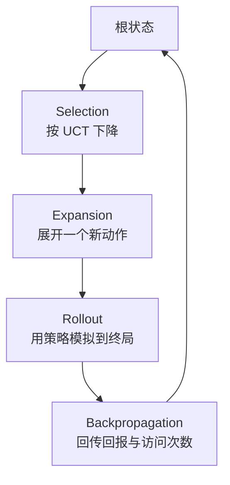
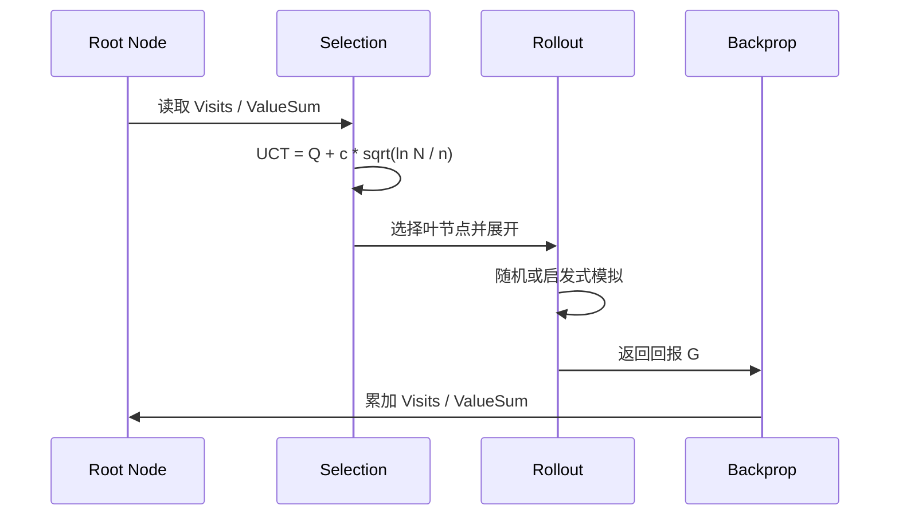

---
title: "游戏与引擎算法 30｜MCTS：蒙特卡洛树搜索"
slug: "algo-30-mcts"
date: "2026-04-17"
description: "MCTS 的四阶段循环、UCT 公式、rollout、transposition 与 progressive widening 的游戏 AI 实践。"
tags:
  - "MCTS"
  - "UCT"
  - "蒙特卡洛树搜索"
  - "探索利用"
  - "rollout"
  - "transposition"
  - "progressive widening"
  - "博弈搜索"
series: "游戏与引擎算法"
weight: 1830
---

> **读这篇之前**：建议先看 [无锁队列：MPMC 与 CAS]() 和 [无锁 Ring Buffer：SPSC]()。MCTS 在工程里常常要配合工作队列、任务窃取和结果回收。

一句话本质：MCTS 不是穷举搜索，而是在可模拟的环境里，用“先采样、再偏向、再回传”的方式，把有限算力持续压到更有希望的分支上。

## 问题动机

当分支因子大、局面评估难、又要求 anytime 行为时，传统 minimax 很容易卡住。你没有足够的时间把树搜完，但又不能只看一层的局面分数。

Go、麻将、扑克、RTS 乃至部分规划问题，都有类似特征。它们要么状态空间太大，要么评估函数太脆，要么结果里有随机性和不完全信息。MCTS 的出发点就是承认这个现实：先模拟，再用统计量逼近价值。

它的工程优势也很直接。搜索可以随时停，停在任何时刻都能给出一个当前最优动作；你可以把模拟器当黑盒；你还可以在 rollout 里注入启发式，从而让系统逐步从“纯随机”走向“带知识的采样”。

## 历史背景

MCTS 不是一夜之间冒出来的。早期的 Monte Carlo 方法就已经用于局面评估，但真正把它变成树搜索核心的，是 bandit 理论和游戏搜索的合流。

2006 年，Kocsis 和 Szepesvári 在 *Bandit Based Monte-Carlo Planning* 里提出 UCT，把 UCB1 用到树节点上。这个点很关键：不是在整棵树上平均撒样本，而是在每个节点上做探索-利用平衡。

随后，Coulom、Gelly 等人不断完善选择、回传和并行化策略。2016 年的 AlphaGo 把 MCTS 和 policy/value 网络结合起来，证明“采样式搜索 + 学习式评估”可以击穿人类顶尖水平。2017 年的 AlphaGo Zero 更进一步，完全依赖自我对弈和树搜索，把人类先验从主路径上移走。

## 数学与理论基础

把问题写成 MDP 最容易理解：状态集 $S$，动作集 $A$，转移概率 $P(s'|s,a)$，回报 $R$。我们要估的是某状态下的动作价值 $Q(s,a)$。

MCTS 的关键不是一次算出精确值，而是用采样估计它：

$$
Q(s,a) \approx \frac{1}{N(s,a)} \sum_{i=1}^{N(s,a)} G_i
$$

其中 $G_i$ 是第 $i$ 次模拟得到的回报，$N(s,a)$ 是边 `(s,a)` 被访问的次数。

UCT 把 UCB1 用在树上：

$$
UCT(s,a) = Q(s,a) + c \sqrt{\frac{\ln N(s)}{N(s,a) + \epsilon}}
$$

`Q` 是利用项，右边那项是探索项。`c` 越大，系统越愿意试新分支；`c` 越小，系统越偏向当前看起来最优的分支。

这就是 MCTS 的核心矛盾：如果只利用，容易过早收敛到坏分支；如果只探索，永远得不到稳定答案。UCT 的价值在于，它把这个平衡变成了可调的数学项。

## 算法推导

MCTS 的四步很好记，但真正的重点在于每一步都在修正上一步的偏差。

1. **Selection**：从根节点开始，按 UCT 逐层选子节点，直到到达一个尚未完全展开的节点。
2. **Expansion**：从未展开动作里挑一个，挂到树上。
3. **Simulation / Rollout**：从新节点开始，用一个轻量策略把局面滚到终局或深度上限。
4. **Backpropagation**：把 rollout 得到的回报回传到路径上的所有节点，更新访问次数和价值均值。

和 minimax 相比，MCTS 的搜索对象不是“整树展开后做精确回溯”，而是“不断把统计预算投向更有前景的区域”。这使它特别适合评估函数不可靠、但模拟器便宜的场景。

## 结构图





## C# 实现

下面的实现是一个自洽的 MCTS 骨架，支持：UCT 选择、随机 rollout、时间/迭代预算、可选 transposition table，以及 progressive widening。它面向两人零和或单代理奖励最大化场景，回报约定为“根玩家视角”。

```csharp
using System;
using System.Collections.Generic;
using System.Diagnostics;
using System.Linq;

public interface IMctsState<TMove> where TMove : notnull
{
    int PlayerToMove { get; }
    bool IsTerminal { get; }
    double Evaluate(int rootPlayer);
    IReadOnlyList<TMove> GetLegalMoves();
    void ApplyMove(TMove move);
    IMctsState<TMove> Clone();
    string StateKey { get; }
}

public interface IRolloutPolicy<TMove> where TMove : notnull
{
    TMove SelectMove(IMctsState<TMove> state, IReadOnlyList<TMove> legalMoves, Random rng);
}

public sealed class RandomRolloutPolicy<TMove> : IRolloutPolicy<TMove> where TMove : notnull
{
    public TMove SelectMove(IMctsState<TMove> state, IReadOnlyList<TMove> legalMoves, Random rng)
    {
        if (legalMoves.Count == 0)
            throw new InvalidOperationException("Rollout policy received no legal moves.");
        return legalMoves[rng.Next(legalMoves.Count)];
    }
}

public sealed class MctsSearch<TMove> where TMove : notnull
{
    private sealed class Node
    {
        public readonly List<TMove> UntriedMoves;
        public readonly Dictionary<TMove, Node> Children = new();
        public int Visits;
        public double ValueSum;

        public Node(IReadOnlyList<TMove> legalMoves)
        {
            UntriedMoves = new List<TMove>(legalMoves);
        }
    }

    private readonly double _explorationConstant;
    private readonly int _rolloutDepthLimit;
    private readonly double _progressiveWideningK;
    private readonly double _progressiveWideningAlpha;
    private readonly bool _useTranspositions;
    private readonly IRolloutPolicy<TMove> _rolloutPolicy;
    private readonly Dictionary<string, Node> _transpositionTable = new(StringComparer.Ordinal);

    public MctsSearch(
        double explorationConstant = Math.Sqrt(2.0),
        int rolloutDepthLimit = 128,
        IRolloutPolicy<TMove>? rolloutPolicy = null,
        bool useTranspositions = false,
        double progressiveWideningK = 0,
        double progressiveWideningAlpha = 0.5)
    {
        _explorationConstant = explorationConstant;
        _rolloutDepthLimit = rolloutDepthLimit;
        _rolloutPolicy = rolloutPolicy ?? new RandomRolloutPolicy<TMove>();
        _useTranspositions = useTranspositions;
        _progressiveWideningK = progressiveWideningK;
        _progressiveWideningAlpha = progressiveWideningAlpha;
    }

    public TMove Search(IMctsState<TMove> rootState, int iterations, Random? rng = null)
    {
        if (iterations <= 0) throw new ArgumentOutOfRangeException(nameof(iterations));
        rng ??= Random.Shared;

        _transpositionTable.Clear();
        var root = GetOrCreateNode(rootState);
        int rootPlayer = rootState.PlayerToMove;

        for (int i = 0; i < iterations; i++)
        {
            var state = rootState.Clone();
            var path = new List<Node> { root };
            var current = root;

            // 1) Selection
            while (!state.IsTerminal)
            {
                if (current.UntriedMoves.Count > 0 && CanExpand(current))
                {
                    var move = TakeExpansionMove(current, rng);
                    state.ApplyMove(move);
                    current = Expand(current, state, move);
                    path.Add(current);
                    break;
                }

                if (current.Children.Count == 0)
                    break;

                var edge = SelectChildByUct(current);
                state.ApplyMove(edge.Key);
                current = edge.Value;
                path.Add(current);
            }

            // 2) Rollout
            double reward = Rollout(state, rootPlayer, rng);

            // 3) Backpropagation
            foreach (var node in path)
            {
                node.Visits++;
                node.ValueSum += reward;
            }
        }

        return SelectBestRootMove(root);
    }

    private Node GetOrCreateNode(IMctsState<TMove> state)
    {
        if (_useTranspositions && _transpositionTable.TryGetValue(state.StateKey, out var existing))
            return existing;

        var node = new Node(state.GetLegalMoves());
        if (_useTranspositions)
            _transpositionTable[state.StateKey] = node;
        return node;
    }

    private Node Expand(Node parent, IMctsState<TMove> state, TMove move)
    {
        if (parent.Children.TryGetValue(move, out var existing))
            return existing;

        var child = GetOrCreateNode(state);
        parent.Children[move] = child;
        parent.UntriedMoves.Remove(move);
        return child;
    }

    private KeyValuePair<TMove, Node> SelectChildByUct(Node node)
    {
        KeyValuePair<TMove, Node>? best = null;
        double bestScore = double.NegativeInfinity;

        foreach (var edge in node.Children)
        {
            var child = edge.Value;
            double exploitation = child.Visits == 0 ? 0.0 : child.ValueSum / child.Visits;
            double exploration = child.Visits == 0
                ? double.PositiveInfinity
                : _explorationConstant * Math.Sqrt(Math.Log(node.Visits + 1.0) / child.Visits);

            double score = exploitation + exploration;
            if (score > bestScore)
            {
                bestScore = score;
                best = edge;
            }
        }

        return best!.Value;
    }

    private bool CanExpand(Node node)
    {
        if (_progressiveWideningK <= 0)
            return true;

        int allowed = Math.Max(1, (int)Math.Floor(_progressiveWideningK * Math.Pow(node.Visits + 1, _progressiveWideningAlpha)));
        return node.Children.Count < allowed;
    }

    private TMove TakeExpansionMove(Node node, Random rng)
    {
        int index = rng.Next(node.UntriedMoves.Count);
        return node.UntriedMoves[index];
    }

    private double Rollout(IMctsState<TMove> state, int rootPlayer, Random rng)
    {
        int depth = 0;
        while (!state.IsTerminal && depth < _rolloutDepthLimit)
        {
            var moves = state.GetLegalMoves();
            if (moves.Count == 0)
                break;

            var move = _rolloutPolicy.SelectMove(state, moves, rng);
            state.ApplyMove(move);
            depth++;
        }

        return state.Evaluate(rootPlayer);
    }

    private TMove SelectBestRootMove(Node root)
    {
        if (root.Children.Count == 0)
            throw new InvalidOperationException("Root state has no expanded child. Check whether the root is terminal or has no legal moves.");

        return root.Children
            .OrderByDescending(kv => kv.Value.Visits)
            .ThenByDescending(kv => kv.Value.ValueSum / Math.Max(1, kv.Value.Visits))
            .First().Key;
    }
}
```

这份代码刻意把 transposition table 设计成“可选”。原因很简单：一旦你开始复用状态节点，树就会变成 DAG，边统计和节点统计会分家。示例里保留了节点共享，但没有把所有边统计复杂化，否则读者会在代码里先迷路。

## 复杂度分析

MCTS 是典型的 anytime 算法。给定 `I` 次迭代、平均选择深度 `D_s`、平均 rollout 深度 `D_r`，总时间复杂度大致是：

$$
O(I \cdot (D_s + D_r))
$$

如果 rollout 里有复杂模拟器或昂贵评估函数，常数会很高，但结构上仍然可控。

空间复杂度是已展开节点数 `O(N)`。`N` 取决于迭代次数、扩展策略和分支因子。若加入 transposition table，空间不一定变少，但重复状态的统计会更集中。

最坏情况仍然很大，因为树搜索本身没法逃离高分支空间。但和穷举相比，MCTS 的优势在于它不是按“树的总大小”付费，而是按“你愿意给它多少时间”付费。

## 变体与优化

MCTS 的变体很多，但本质上都在修三个问题：怎么选、怎么评、怎么控树。

- **RAVE / AMAF**：把“最近在别处验证过的动作”快速借给当前节点，降低早期样本方差。
- **PUCT**：把策略先验引入 UCT，AlphaGo 和后续系统广泛使用。
- **Transposition table**：合并重复状态，适合确定性、完全可观测、可稳定哈希的游戏。
- **Progressive widening**：当动作空间极大时，只随着访问次数增长逐步开放新子节点，防止分支爆炸。
- **Parallel MCTS**：在多核上并行 rollout，但要处理虚拟损失、锁竞争和结果合并。

其中 progressive widening 的边界最值得强调。它在巨大动作空间里非常有效，但也会压掉少数关键动作。如果动作稀有但重要，`k` 和 `alpha` 设错以后，系统会把正确分支永远挡在门外。

## 对比其他算法

| 算法 | 优点 | 缺点 | 适用场景 |
|---|---|---|---|
| Minimax | 语义直接，适合确定性博弈 | 评估函数弱时效果差 | 小分支、可完全展开 |
| Alpha-Beta | 比 minimax 快，易做剪枝 | 仍依赖评价函数 | 棋类、已知深度搜索 |
| Beam Search | 简单、易控预算 | 早剪会丢最优路径 | 近似规划、候选筛选 |
| MCTS | anytime、可模拟、抗大分支 | rollout 方差高，调参复杂 | 大分支、难评估、可模拟环境 |

## 批判性讨论

MCTS 不等于“更现代”。它只是把搜索预算从“预先展开”改成了“边采样边聚焦”。如果你的评价函数已经很强，alpha-beta 依然可能更合适。

它也很容易被 rollout policy 绑架。随机 rollout 很廉价，但方差大；启发式 rollout 更准，但更贵。你省下来的搜索预算，可能又被 rollout 吃掉了。

最隐蔽的问题是状态重复。如果你不处理 transposition，同一个局面会在不同路径上被重复探索；如果你处理了 transposition，但哈希不稳定、或者游戏里有隐藏信息和随机事件，又会引入错误合并。

## 跨学科视角

MCTS 和多臂老虎机几乎是同一思想在树上的展开。节点上的 child selection 本质上就是对多个臂做 exploration-exploitation 平衡，UCT 只是把 UCB1 换到了树节点。

它也很像科学实验设计。你不会把所有实验时间平均分给所有假设，而是先粗采样，再把预算投给更有希望的假设。树搜索只是把这个过程形式化了。

## 真实案例

- UCT 的原始论文 *Bandit Based Monte-Carlo Planning* 明确把 bandit 思想引入 Monte Carlo planning，并给出了收敛与有限样本分析。见 [DOI: 10.1007/11871842_29](https://doi.org/10.1007/11871842_29)。
- DeepMind 的 AlphaGo 论文明确给出 99.8% 对其他程序的胜率，并以 5:0 击败了欧洲冠军 Fan Hui；论文图 3 就是 MCTS 在 AlphaGo 中的工作方式。见 [Nature 2016](https://www.nature.com/articles/nature16961)。
- AlphaGo Zero 论文显示，系统在没有人类棋谱的情况下，通过自我对弈训练 500 万局，并以 100:0 击败前一版 AlphaGo。见 [Nature 2017](https://www.nature.com/articles/nature24270)。
- OpenSpiel 是 Google DeepMind 维护的研究框架，明确面向 games 的 reinforcement learning 和 search/planning，并包含多种算法实现。见 [google-deepmind/open_spiel](https://github.com/google-deepmind/open_spiel)。
- `mctx` 是 DeepMind 的 JAX 版 MCTS 实现，支持 AlphaZero、MuZero、Gumbel MuZero 等算法。见 [google-deepmind/mctx](https://github.com/google-deepmind/mctx)。
- 开源 Go 引擎 `Leela Zero` 是 AlphaGo Zero 的开源重实现。见 [Leela Zero](https://github.com/leela-zero)。

## 量化数据

AlphaGo 的公开论文给出了两组最有名的数字：对其他 Go 程序的胜率达到 99.8%，并以 5 比 0 击败 Fan Hui。AlphaGo Zero 进一步在完全自我对弈下训练了 500 万局，并以 100 比 0 击败前一代 AlphaGo。

这些数字不只是宣传，它们说明了 MCTS + 学习评估的组合能把“采样式搜索”的上限抬得非常高。更重要的是，MCTS 是 anytime 的：哪怕只给它很短时间，它也能返回一个当前最好动作，而不是等到整棵树都处理完。

## 常见坑

1. rollout 全随机。错因是方差太大，样本要跑很多次才稳定。改法是把策略先验、规则启发式或轻量评估塞进 rollout。
2. 只看 `ValueSum` 不看 `Visits`。错因是少量高回报样本会误导决策。改法是最终选点通常看访问次数或置信均值。
3. 选择公式写错玩家视角。错因是奖励会在回传时翻转错误。改法是统一用根玩家视角记录回报。
4. transposition table 哈希不稳定。错因是不同局面被误合并，或者同一局面无法复用。改法是只在确定性、完全可观测、可规范化哈希的状态上启用。
5. progressive widening 设太紧。错因是关键动作永远进不了树。改法是根据分支因子和访问节奏调 `k` / `alpha`。

## 何时用 / 何时不用

适合用：大分支博弈、可模拟环境、难以手写评价函数、需要 anytime 输出、可以逐步增强策略先验的系统。

不适合用：分支很小且评价函数足够强的确定性游戏、没有稳定模拟器的环境、极端低延迟硬实时场景、对隐藏信息和随机因素没有建模能力的系统。

## 相关算法

- [数据结构与算法 06｜Dijkstra 与 A*]()
- [GOAP：目标导向计划]()
- [Job System 原理]()
- [Work Stealing 调度]()
- [浮点精度与数值稳定性]()

## 小结

MCTS 的本质是“把算力当实验预算”。它不承诺一次给出精确答案，但它能持续把样本堆到更值得看的地方。

如果你的问题有模拟器、有巨大分支、有很难手写的评价函数，MCTS 往往比传统穷举更合适。反过来，如果你已经有稳定而强的静态评估，别迷信它；算法不是越新越对，只有和问题结构匹配才对。

## 参考资料

- [Bandit Based Monte-Carlo Planning](https://doi.org/10.1007/11871842_29)
- [A Survey of Monte Carlo Tree Search Methods](https://doi.org/10.1109/TCIAIG.2012.2186810)
- [Mastering the game of Go with deep neural networks and tree search](https://www.nature.com/articles/nature16961)
- [Mastering the game of Go without human knowledge](https://www.nature.com/articles/nature24270)
- [OpenSpiel](https://github.com/google-deepmind/open_spiel)
- [mctx](https://github.com/google-deepmind/mctx)
- [Leela Zero](https://github.com/leela-zero)

