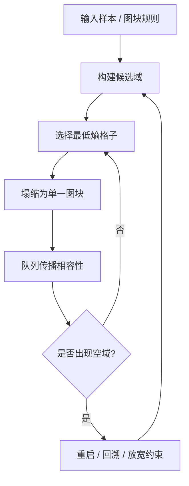
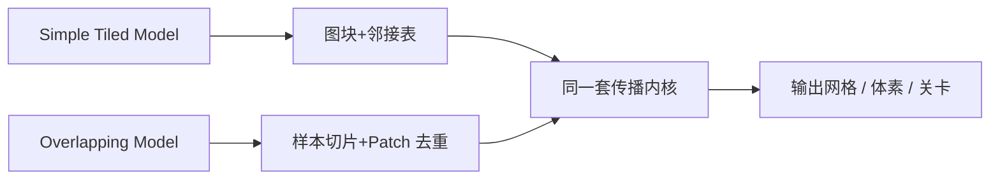

---
title: "游戏与引擎算法 31｜Wave Function Collapse：约束传播与图块生成"
slug: "algo-31-wave-function-collapse"
date: "2026-04-18"
description: "把 WFC 拆成约束建模、熵选择、传播修正和失败恢复四件事，并对比 simple tiled 与 overlapping 两种实现路径。"
tags:
  - "Wave Function Collapse"
  - "WFC"
  - "程序化生成"
  - "约束传播"
  - "图块生成"
  - "CSP"
  - "游戏引擎"
series: "游戏与引擎算法"
weight: 1831
---

**Wave Function Collapse 本质上是一个带启发式的离散约束求解器：先把每个格子的可能性收成域，再用最小熵把不确定性一格一格压到 0。**

> 读这篇之前：建议先看 [浮点精度与数值稳定性]() 和 [Morton 编码与 Z-Order]()。前者解释熵、随机种子和跨平台一致性，后者解释网格遍历与缓存局部性。

## 问题动机

关卡、美术图块、室内布局、建筑外立面、地牢、城市场景，这些东西最难的不是“随机”，而是“看起来像被设计过”。

纯随机会碎；纯规则会僵；纯手写模板会贵。你需要的是一种方法：既能从样本里学到局部风格，又能让生成结果保持连接关系、边界一致性和重复可控。

WFC 正好踩在这个需求上。它不是神秘的机器学习，也不是把一张图生硬贴满网格，而是把“哪些图块能挨着出现”这件事变成约束传播问题，再用最少不确定性的地方先下手。

### WFC 适合解决什么

- 地牢房间与走廊的局部拼接。
- 城市立面、地板花纹、装饰边框。
- 基于示例的二维/三维体素布局。
- 需要“像样”但不必完全手工设计的离散空间。

## 历史背景

Maxim Gumin 把 WFC 公开到 GitHub 后，这个算法迅速传播开来。它的核心贡献不是提出了全新的数学分支，而是把原本分散在模型合成、约束传播和样本纹理生成里的想法，收敛成一个工程师能直接拿去用的方案。

README 里很明确：WFC 分成 `Simple Tiled Model` 和 `Overlapping Model` 两条线，前者把问题看成带邻接规则的图块 CSP，后者从输入样本里抽取局部 patch，再做相容性传播。README 也列出了实际应用场景，例如 `Bad North`、`Caves of Qud`、`Townscaper`、`Dead Static Drive` 和 `The Matrix Awakens`。

更早的学术脉络来自约束满足和模型合成。WFC 的传播阶段和 arc consistency 很接近，和更一般的 table constraint filtering 也属于同一类思想：不是全局暴搜，而是不断删掉不可能的取值。

## 数学基础

把网格记作 `G`，每个格子 `c` 都有一个候选域 `D(c)`，域里装的是可放置的图块或 patch。

对每个方向 `dir`，定义相容关系 `R_dir(a, b)`，表示图块 `a` 右边能不能接 `b`，或者上边能不能接 `b`。若某个相邻方向上没有任何合法邻居，那个值就应当从域里删掉。

WFC 常用的“熵”其实是一个启发式，不是物理学里的严格熵。若图块权重为 `w_i`，归一化概率为 `p_i = w_i / Σw`，则：

$$
H(c) = -\sum_{i \in D(c)} p_i \log p_i + \varepsilon
$$

`\varepsilon` 是一个很小的随机扰动，用来打破同熵格子的平局。这个做法的意义很工程化：避免每次都沿着完全相同的低位差异走向同一个失败模式。

在 `Overlapping Model` 里，样本被切成 `N\times N` 的局部 patch。设原图中去重后的 patch 集合为 `P`，那么问题从“放 tile”变成“放 patch”，域大小和兼容矩阵都会明显膨胀。

## 算法推导

### 为什么先选最小熵格子

如果你先随便选一个格子，传播会非常慢；如果你先选不确定性最高的格子，分支太多，也容易把错误留到后面。

最小熵是一种折中：它优先处理“约束最紧、分歧最少”的位置。这个位置最容易暴露矛盾，也最容易把局部选择传导到周边。

### 为什么传播比回溯更像 WFC

WFC 的传播不是“走一步看一步”的单条路径搜索，而是“删掉所有不可能的值”。这就是它和普通 DFS 最大的区别。

如果格子 A 被确定为某图块，那么 A 周围四个方向上所有不相容的候选都必须删掉；删掉之后，邻居的邻居也可能继续失去支持，直到队列收敛。

这一步就是 CSP 里的 arc consistency：只要某个值在任何约束边上没有支持，就该被移除。

### 为什么失败是常态而不是异常

WFC 不是求必然有解的命题证明器。它更像带启发式的 constructive search：如果样本本身太窄、约束太紧、边界条件太强，就会出现空域。

工程上通常有三种处理方式：

- 直接重启。
- 加回溯栈。
- 放宽约束或补充样本。

对关卡编辑器来说，重启往往是最简单、也最稳定的版本；对运行时生成器来说，回溯更可靠，但实现复杂度更高。

## 结构图 / 流程图





## 算法实现

下面是一个面向 `Simple Tiled Model` 的 C# 版本。它用 `ulong` 作为域位图，因此最多支持 64 个图块，优点是代码短、传播快、边界清晰。`Overlapping Model` 只需要把“图块”替换成“patch”，传播内核不变。

```csharp
using System;
using System.Collections.Generic;
using System.Numerics;

public sealed class WaveFunctionCollapse
{
    private readonly float[] _weights;
    private readonly ulong[][] _allowedByDir; // [dir][tile] => mask of neighbors
    private readonly int _tileCount;
    private readonly int _width;
    private readonly int _height;
    private readonly Random _rng;

    // 0: left, 1: right, 2: up, 3: down
    private static readonly (int dx, int dy)[] DirOffset =
    {
        (-1, 0), (1, 0), (0, -1), (0, 1)
    };

    public WaveFunctionCollapse(int width, int height, float[] weights, ulong[][] allowedByDir, int seed)
    {
        if (width <= 0 || height <= 0) throw new ArgumentOutOfRangeException();
        _width = width;
        _height = height;
        _weights = weights ?? throw new ArgumentNullException(nameof(weights));
        _allowedByDir = allowedByDir ?? throw new ArgumentNullException(nameof(allowedByDir));
        _tileCount = weights.Length;
        if (_tileCount == 0 || _tileCount > 64) throw new ArgumentOutOfRangeException(nameof(weights));
        _rng = new Random(seed);
    }

    public int[] Solve(int maxRestarts = 32)
    {
        for (int restart = 0; restart < maxRestarts; restart++)
        {
            var domains = new ulong[_width * _height];
            ulong fullMask = _tileCount == 64 ? ulong.MaxValue : ((1UL << _tileCount) - 1UL);
            for (int i = 0; i < domains.Length; i++) domains[i] = fullMask;

            if (TryRun(domains))
                return Decode(domains);
        }

        throw new InvalidOperationException("WFC failed after too many restarts.");
    }

    private bool TryRun(ulong[] domains)
    {
        var queue = new Queue<int>();

        while (true)
        {
            int cell = SelectLowestEntropyCell(domains);
            if (cell < 0) return true;

            ulong domain = domains[cell];
            int chosen = SampleTile(domain);
            domains[cell] = 1UL << chosen;
            queue.Enqueue(cell);

            if (!Propagate(domains, queue))
                return false;
        }
    }

    private int SelectLowestEntropyCell(ulong[] domains)
    {
        int best = -1;
        double bestEntropy = double.MaxValue;

        for (int i = 0; i < domains.Length; i++)
        {
            ulong mask = domains[i];
            if (IsSingleton(mask)) continue;

            double entropy = ComputeEntropy(mask);
            if (entropy < bestEntropy)
            {
                bestEntropy = entropy;
                best = i;
            }
        }

        return best;
    }

    private double ComputeEntropy(ulong mask)
    {
        double sum = 0.0;
        double weightedLogSum = 0.0;

        for (int t = 0; t < _tileCount; t++)
        {
            if (((mask >> t) & 1UL) == 0) continue;
            double w = Math.Max(_weights[t], 1e-9f);
            sum += w;
            weightedLogSum += w * Math.Log(w);
        }

        if (sum <= 0.0) return double.NegativeInfinity;
        return Math.Log(sum) - weightedLogSum / sum + _rng.NextDouble() * 1e-6;
    }

    private int SampleTile(ulong mask)
    {
        double total = 0.0;
        for (int t = 0; t < _tileCount; t++)
            if (((mask >> t) & 1UL) != 0)
                total += Math.Max(_weights[t], 1e-9f);

        double r = _rng.NextDouble() * total;
        for (int t = 0; t < _tileCount; t++)
        {
            if (((mask >> t) & 1UL) == 0) continue;
            r -= Math.Max(_weights[t], 1e-9f);
            if (r <= 0.0) return t;
        }

        throw new InvalidOperationException("Failed to sample tile.");
    }

    private bool Propagate(ulong[] domains, Queue<int> queue)
    {
        while (queue.Count > 0)
        {
            int cell = queue.Dequeue();
            int x = cell % _width;
            int y = cell / _width;
            ulong sourceDomain = domains[cell];

            for (int dir = 0; dir < 4; dir++)
            {
                int nx = x + DirOffset[dir].dx;
                int ny = y + DirOffset[dir].dy;
                if ((uint)nx >= (uint)_width || (uint)ny >= (uint)_height) continue;

                int neighbor = ny * _width + nx;
                ulong supported = 0;
                for (int t = 0; t < _tileCount; t++)
                {
                    if (((sourceDomain >> t) & 1UL) == 0) continue;
                    supported |= _allowedByDir[dir][t];
                }

                ulong nextDomain = domains[neighbor] & supported;
                if (nextDomain == 0) return false;

                if (nextDomain != domains[neighbor])
                {
                    domains[neighbor] = nextDomain;
                    queue.Enqueue(neighbor);
                }
            }
        }

        return true;
    }

    private int[] Decode(ulong[] domains)
    {
        var result = new int[domains.Length];
        for (int i = 0; i < domains.Length; i++)
        {
            ulong mask = domains[i];
            if (!IsSingleton(mask)) throw new InvalidOperationException("Unresolved cell.");
            result[i] = BitOperations.TrailingZeroCount(mask);
        }
        return result;
    }

    private static bool IsSingleton(ulong mask) => mask != 0 && (mask & (mask - 1)) == 0;
}
```

### 代码边界

- 这个版本是 `Simple Tiled Model` 的完整内核，不是编辑器全家桶。
- `Overlapping Model` 只是在输入端多一步 patch 抽取与去重。
- `ulong` 版适合 64 个图块以内的生产原型；更大图块集要换成位数组或 `UInt128`/分块位集。

## 复杂度分析

设网格格子数为 `C = W × H`，图块数为 `T`，邻接方向数为 `D = 4`。

- 传播阶段：每次域收缩会沿队列往外扩散，平均接近 `O(C × D × T / word_size)`。
- 选点阶段：朴素实现需要扫描全部格子，约 `O(C × T)`。
- 总体平均：很多实际地图接近线性到准线性，但取决于样本与约束密度。
- 最坏情况：这是 CSP，带重启或回溯时，仍可能退化到指数级。
- 空间：简单 tiled model 约 `O(C × T + T × D)`；overlapping model 的 `P` 通常远大于 `T`，内存压力更大。

一个具体量级：如果你有 `256×256` 网格、`64` 个图块、按 1 bit 记录一个可能性，那么仅域位图就是 `256×256×64 = 4,194,304` bit，约 `512 KiB`。真实工程还要加上队列、邻接表、权重和缓存，因此实际占用会高于这个下限。

## 变体与优化

- `Simple Tiled Model`：规则明确、性能稳定，适合关卡拼接。
- `Overlapping Model`：更像从样本里“抄风格”，适合纹理、地表和微结构。
- `Symmetry reduction`：把旋转/镜像等价类合并，减少状态数。
- `Bitset + support count`：把域和邻接支持都缓存成位运算，传播会快很多。
- `Entropy cache`：把当前最小熵格子放进堆里，避免每轮全图扫描。
- `Backtracking`：比纯重启更稳，但需要 trail / undo stack。
- `Chunked generation`：大地图分块生成时，必须保留边缘 halo，不然拼缝会穿帮。

## 对比其他算法

| 算法 | 输入方式 | 全局结构 | 控制粒度 | 典型用途 |
|------|----------|----------|----------|----------|
| WFC | 样本 + 邻接约束 | 偏局部 | 中等 | 图块、地牢、立面、装饰纹理 |
| L-System | 显式重写规则 | 强递归 | 高 | 树木、藤蔓、珊瑚、分形结构 |
| Cellular Automata | 局部状态转移 | 弱到中等 | 中低 | 洞穴、菌落、地形粗化 |

WFC 和 L-system 经常被放在一起比较，但两者的控制对象完全不同。L-system 写的是“成长规则”，WFC 写的是“相容规则”。前者偏生成语法，后者偏约束满足。

## 批判性讨论

WFC 的优点是局部风格学习能力强，缺点也是局部风格学习能力太强。

如果样本没有足够的全局多样性，WFC 会把局部关系机械复制到整张图上，结果看起来“像同一块素材被反复拼接”。如果你的目标是有大尺度叙事的地图，比如必须保证主城、关卡节点、任务链和路径拓扑，WFC 只能做底层排布，不能替你决定全局结构。

所以在复杂项目里，WFC 更像一个子系统：先由图论、任务规划或手工布局决定宏观骨架，再让 WFC 填局部细节。单独用它做完整世界，通常会卡在连接性、可玩性和可读性上。

## 跨学科视角

WFC 本质上是离散 CSP。它和 AC-3、GAC、table constraints、MRF 以及信念传播共享同一个精神内核：让局部一致性不断削掉不可行解。

这也是它为什么容易和编译器优化、排版系统、图着色问题放在同一页上讨论。只要你有一组“域”与“约束”，你就已经在做约束传播，而不是在做图形特效。

## 真实案例

- `mxgmn/WaveFunctionCollapse` 是最核心的官方实现与说明来源，README 里清楚区分了 `Simple Tiled Model` 和 `Overlapping Model`。
- README 还列出了 `Bad North`、`Caves of Qud`、`Townscaper`、`Dead Static Drive` 和 `The Matrix Awakens` 等实际使用或相关案例，这说明它已经跨过了“只适合 demo”的阶段。
- `CodingTrain/Wave-Function-Collapse` 是一个公开、可运行的教学实现，适合对照理解 tiled 与 overlapping 两条路线。

## 量化数据

- `Simple Tiled Model` 中，如果图块数为 `T`，一个格子的域最多就有 `T` 个候选，`W×H` 网格的域位图至少要 `W×H×T` bit。
- `Overlapping Model` 里，`N×N` patch 的候选数通常远大于图块数；当 `N` 增大时，状态空间膨胀很快，内存和传播代价都会上升。
- WFC README 提到，后来实现者对 overlapping model 做过“数量级级别”的运行时间改进，这也是为什么工程实现普遍更依赖位图和传播缓存。

## 常见坑

- **把熵当成物理熵硬解释。** 错在它只是启发式，不是热力学定律。改法是把它理解成“优先处理最不确定格子”的排序键。
- **只做塌缩，不做传播。** 错在你只随机选值，约束不会自动扩散，最后会得到一堆局部冲突。改法是用队列把邻域删值传出去。
- **忽略全局约束。** 错在路径连通性、任务可达性和边界对齐不是局部关系能自动保证的。改法是在 WFC 前后加图搜索或规则校验。
- **对称性没处理好。** 错在旋转/镜像等价类会放大状态数。改法是先做规范化，再生成邻接表。
- **随机源不固定。** 错在同一张图在不同机器上生成不同结果，调试会非常痛苦。改法是把 seed 显式传入，并记录失败样本。

## 何时用 / 何时不用

适合用在：

- 图块风格明确、局部一致性重要的内容。
- 关卡编辑器里的自动填充。
- 需要从示例中提取风格，而不是从语法中编排结构的场景。

不适合用在：

- 需要强拓扑保证的世界结构。
- 依赖任务流、剧情流、可达性验证的关卡。
- 你必须严格控制每个区域语义的时候。

## 相关算法

- [浮点精度与数值稳定性]()：WFC 的 entropy 排序、随机扰动和跨平台一致性都会碰到数值问题。
- [Morton 编码与 Z-Order]()：大地图分块、邻域扫描和缓存局部性会直接受益。
- [贝塞尔曲线与样条]()：WFC 常和样条道路、轮廓编辑组合使用。
- [Command 模式]()：关卡编辑器里把“生成一次”封装成命令，方便撤销和重放。
- [Actor 模式]()：批量生成和异步预览时，生成任务适合拆成消息驱动的 actor。

## 参考资料

- [mxgmn/WaveFunctionCollapse](https://github.com/mxgmn/WaveFunctionCollapse) - Maxim Gumin 的官方仓库与 README。
- [CodingTrain/Wave-Function-Collapse](https://github.com/CodingTrain/Wave-Function-Collapse) - 一个公开的教学实现，适合对照 tiled / overlapping 两条路线。
- [AAAI: An Improved Algorithm for Maintaining Arc Consistency in Dynamic Constraint Satisfaction Problems](https://aaai.org/papers/flairs-2005-027/) - 传播阶段的 arc consistency 背景。
- [ScienceDirect: STR3: A path-optimal filtering algorithm for table constraints](https://www.sciencedirect.com/science/article/pii/S000437021400143X) - 更一般的 table constraint filtering 背景。

## 小结

WFC 最重要的价值，不是“把随机变成神奇效果”，而是把样本风格、邻接约束和失败恢复做成了一个能落地的工程流程。

它适合做局部生成，不适合单独承担全局设计。把它放在正确层级上，它会很强；把它当万能世界生成器，它会很快露出边界。


