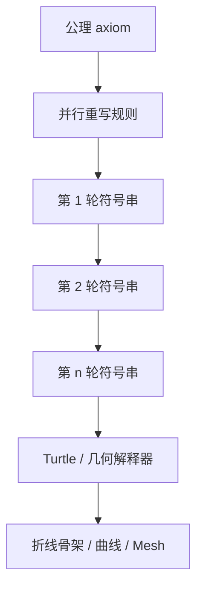
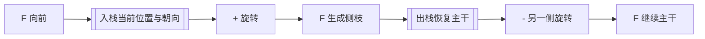

---
title: "游戏与引擎算法 32｜L-System"
slug: "algo-32-l-system"
date: "2026-04-18"
description: "从 Lindenmayer 1968 的并行重写系统讲到 turtle 几何、参数化与随机化扩展，解释 L-System 为什么能长出植物、分形和枝状结构，也解释它为什么很难独自做完整关卡。"
tags:
  - "L-System"
  - "Lindenmayer System"
  - "形式语法"
  - "过程化生成"
  - "分形"
  - "植物建模"
  - "Turtle Graphics"
series: "游戏与引擎算法"
weight: 1832
---

一句话本质：L-System 是一种并行字符串重写系统，它先在符号层生成“生长程序”，再由 turtle 或几何解释器把程序翻译成形状。

> **读这篇之前**：建议先看 [贝塞尔曲线与样条]()、[四元数完全指南]()、[浮点精度与数值稳定性]() 和 [Wave Function Collapse]()。L-System 解决的是生长规则，不解决曲线拟合、姿态稳定和局部拼接问题。

## 问题动机

树、藤蔓、珊瑚、闪电、血管网络有个共同特征：
它们不是“拼起来像自然”，而是“长起来像自然”。

如果你用手工建模去做成千上万棵树，成本会高得离谱。
如果你只用噪声去扰动，又很难得到有层级、有分枝、有生长逻辑的结构。

L-System 之所以经久不衰，是因为它抓住了“局部生长规则重复施加，最后形成复杂整体”这个本质。
你不用逐顶点描述一棵树，只要描述“枝条如何在下一轮生长时变成更多枝条”。

这是一种非常适合程序化生成的压缩方式。
规则少，展开后却能很大；
局部简单，整体却能很复杂。

## 历史背景

L-System 的源头比多数图形算法更生物学。
1968 年，Aristid Lindenmayer 为了描述丝状生物和植物细胞的生长过程，提出了这套并行重写系统。

后来这套形式系统被计算机图形学接住。
Prusinkiewicz 和 Lindenmayer 在《The Algorithmic Beauty of Plants》中，把它从理论生物学推向了图形建模，把 turtle interpretation、参数化、随机化和植物案例系统化了。

再往后，L-System 一路进入 Houdini、L-Py、研究型植物建模平台和大量程序化植物工具里。
如今工业工具不一定还叫自己 L-System，但“分枝 grammar + 参数生长 + 几何解释器”这条血脉一直没断。

## 数学基础

最基本的 L-System 是一个四元组：

$$
G = (V, \omega, P, I)
$$

其中：
- $V$ 是符号集合。
- $\omega$ 是初始公理串，也叫 axiom。
- $P$ 是产生式集合。
- $I$ 是解释函数，把最终字符串映射到几何动作。

和普通文法最大的不同，是它通常采用并行重写。
假设当前串为 $s_t$，则下一轮：

$$
s_{t+1} = P(s_t)
$$

这里的 $P$ 不是“挑一个位置替换”，而是对所有可重写符号同时应用规则。
这点决定了它更像“生长”，而不是“解析”。

若只看符号计数，可以把规则写成产生矩阵 $M$。
设向量 $c_t$ 表示第 $t$ 轮各类符号数量，则有：

$$
c_{t+1} = M c_t
$$

因此增长速度通常由 $M$ 的主特征值控制。
这就是为什么某些看似简单的规则，会在十几轮后爆出指数级长度。

几何解释层最常见的是 turtle graphics。
把 `F` 解释成“向前走并画线”，`+` 解释成“左转角度 $\theta$”，`-` 解释成“右转角度 $\theta$”，`[` 入栈、`]` 出栈。
于是字符串：

$$
F[+F]F[-F]F
$$

就不再只是文本，而是一段可执行的生长脚本。

## 算法推导

L-System 的工程化过程通常分成三层。

第一层是重写层。
这里根本不关心顶点和 mesh，只关心“当前符号串下一轮变成什么”。
你可以把它看成一个只处理 token 的并行编译器前端。

第二层是参数层。
真正能进生产的系统，几乎都不会满足于无参数重写。
枝长、半径、分叉角、年龄、光照权重这些量，必须能跟着符号一起传播。
于是规则会从 `A -> AB` 变成 `A(l) -> A(l*r)[+A(l*r)]` 这类带参数形式。

第三层是几何解释层。
同一串符号，既可以画成二维分形，也可以解释成三维枝条骨架，还可以进一步 sweep 成 mesh。
因此 L-System 从来不是几何本身，而是几何生成程序。

这个分层很重要。
如果把重写、随机数、几何解释全搅在一起，系统很快就会不可控。
工业工具之所以还能用，就是因为它们把“规则”和“解释”分开了。

## 图示 1：L-System 的三层结构



## 图示 2：分枝依赖栈保存局部坐标系



## 算法实现

下面给一个够用的参数化骨架。
它不做完整 parser，而是聚焦最关键的两件事：
- 并行重写。
- 把结果串解释成 3D 线段骨架。

```csharp
using System;
using System.Collections.Generic;
using System.Globalization;
using System.Numerics;
using System.Text;

public sealed class LSystemGenerator
{
    public readonly record struct Segment(Vector3 From, Vector3 To, float Radius);
    public readonly record struct TurtleState(Vector3 Position, Quaternion Rotation, float Radius);

    public sealed class Rule
    {
        public string Symbol { get; }
        public Func<SymbolInstance, string> Rewrite { get; }

        public Rule(string symbol, Func<SymbolInstance, string> rewrite)
        {
            Symbol = symbol ?? throw new ArgumentNullException(nameof(symbol));
            Rewrite = rewrite ?? throw new ArgumentNullException(nameof(rewrite));
        }
    }

    public readonly record struct SymbolInstance(string Name, float Value);

    private readonly Dictionary<string, Rule> _rules = new(StringComparer.Ordinal);

    public void AddRule(Rule rule) => _rules[rule.Symbol] = rule;

    public string Expand(string axiom, int iterations)
    {
        if (string.IsNullOrWhiteSpace(axiom)) throw new ArgumentException(nameof(axiom));
        if (iterations < 0) throw new ArgumentOutOfRangeException(nameof(iterations));

        string current = axiom;
        for (int i = 0; i < iterations; i++)
        {
            var tokens = Tokenize(current);
            var next = new StringBuilder(current.Length * 2);

            foreach (var token in tokens)
            {
                if (_rules.TryGetValue(token.Name, out Rule? rule))
                    next.Append(rule.Rewrite(token));
                else
                    next.Append(Serialize(token));
            }

            current = next.ToString();
        }

        return current;
    }

    public List<Segment> Interpret(string program, float stepLength, float angleDegrees, float radiusShrink)
    {
        if (stepLength <= 0f) throw new ArgumentOutOfRangeException(nameof(stepLength));
        if (radiusShrink <= 0f || radiusShrink > 1f) throw new ArgumentOutOfRangeException(nameof(radiusShrink));

        var tokens = Tokenize(program);
        var result = new List<Segment>(tokens.Count / 2);
        var stack = new Stack<TurtleState>();
        var state = new TurtleState(Vector3.Zero, Quaternion.Identity, 1.0f);
        float angle = MathF.PI / 180f * angleDegrees;

        foreach (var token in tokens)
        {
            switch (token.Name)
            {
                case "F":
                {
                    float length = token.Value > 0f ? token.Value : stepLength;
                    Vector3 dir = Vector3.Transform(Vector3.UnitY, state.Rotation);
                    Vector3 nextPos = state.Position + dir * length;
                    result.Add(new Segment(state.Position, nextPos, state.Radius));
                    state = state with { Position = nextPos, Radius = MathF.Max(0.01f, state.Radius * radiusShrink) };
                    break;
                }
                case "+":
                    state = state with { Rotation = Quaternion.Normalize(Quaternion.CreateFromAxisAngle(Vector3.UnitZ, angle) * state.Rotation) };
                    break;
                case "-":
                    state = state with { Rotation = Quaternion.Normalize(Quaternion.CreateFromAxisAngle(Vector3.UnitZ, -angle) * state.Rotation) };
                    break;
                case "&":
                    state = state with { Rotation = Quaternion.Normalize(Quaternion.CreateFromAxisAngle(Vector3.UnitX, angle) * state.Rotation) };
                    break;
                case "^":
                    state = state with { Rotation = Quaternion.Normalize(Quaternion.CreateFromAxisAngle(Vector3.UnitX, -angle) * state.Rotation) };
                    break;
                case "[":
                    stack.Push(state);
                    break;
                case "]":
                    if (stack.Count == 0) throw new InvalidOperationException("Unbalanced branch stack.");
                    state = stack.Pop();
                    break;
            }
        }

        return result;
    }

    private static List<SymbolInstance> Tokenize(string source)
    {
        var tokens = new List<SymbolInstance>(source.Length);
        for (int i = 0; i < source.Length; i++)
        {
            char c = source[i];
            if (char.IsWhiteSpace(c)) continue;

            string name = c.ToString();
            float value = 0f;
            if (i + 1 < source.Length && source[i + 1] == '(')
            {
                int end = source.IndexOf(')', i + 2);
                if (end < 0) throw new FormatException("Missing ')' in parametric token.");
                string raw = source.Substring(i + 2, end - (i + 2));
                value = float.Parse(raw, CultureInfo.InvariantCulture);
                i = end;
            }
            tokens.Add(new SymbolInstance(name, value));
        }
        return tokens;
    }

    private static string Serialize(SymbolInstance token)
    {
        if (MathF.Abs(token.Value) <= 1e-6f)
            return token.Name;
        return token.Name + "(" + token.Value.ToString("0.###", CultureInfo.InvariantCulture) + ")";
    }
}

public static class LSystemExamples
{
    public static string BuildPlantProgram(int iterations)
    {
        var system = new LSystemGenerator();
        system.AddRule(new LSystemGenerator.Rule("X", s => "F(" + MathF.Max(0.2f, s.Value == 0 ? 1.0f : s.Value).ToString("0.###", CultureInfo.InvariantCulture) + ")[+X(" + (MathF.Max(0.2f, s.Value == 0 ? 1.0f : s.Value) * 0.7f).ToString("0.###", CultureInfo.InvariantCulture) + ")][-X(" + (MathF.Max(0.2f, s.Value == 0 ? 1.0f : s.Value) * 0.7f).ToString("0.###", CultureInfo.InvariantCulture) + ")]X(" + (MathF.Max(0.2f, s.Value == 0 ? 1.0f : s.Value) * 0.85f).ToString("0.###", CultureInfo.InvariantCulture) + ")"));
        system.AddRule(new LSystemGenerator.Rule("F", s => "F(" + MathF.Max(0.1f, (s.Value == 0 ? 1.0f : s.Value) * 0.95f).ToString("0.###", CultureInfo.InvariantCulture) + ")"));
        return system.Expand("X(1.0)", iterations);
    }
}
```

这份代码故意保留了 L-System 的工程边界。
它生成的是“枝条骨架”，不是最终网格。
真实生产里还会再接样条平滑、截面 sweep、叶片实例化、LOD 和风动画。

## 复杂度分析

若第 $k$ 轮字符串长度为 $L_k$，则：
- 单轮重写成本通常是 $O(L_k)$。
- 总展开成本是 $O(\sum_{k=0}^{n-1} L_k)$。
- turtle 解释成本是 $O(L_n)$。
- 栈空间成本是 $O(d)$，其中 $d$ 是最大分枝深度。

真正危险的是增长率。
如果产生矩阵主特征值是 $\lambda > 1$，则 $L_n$ 往往按 $\Theta(\lambda^n)$ 增长。
这意味着你多加一两轮，规模就可能直接翻倍。

例如经典规则 `F -> F[+F]F[-F]F`，单个 `F` 每轮会扩成 5 个新的 `F`。
忽略控制符号后，主干符号数量近似满足：

$$
N_{n+1} = 5N_n,
$$

于是 $N_n = 5^n$。
`n=8` 时就是 `390,625` 个 `F`，还没算括号和旋转符号。
这就是 L-System 最常见的性能陷阱。

## 变体与优化

L-System 在研究和工业里主要沿五条线演化。

第一条是参数化。
没有参数，你很难控制枝长衰减、角度渐变、年龄和半径。
参数化之后，它才真正变成一门生长程序语言。

第二条是随机化。
完全确定性的规则很快会显得机械。
加概率规则、角度扰动和 tropism 后，个体差异才会出来。

第三条是上下文相关。
普通规则只看当前符号；上下文相关规则还能看左右邻域，表达能力更强，但实现复杂度也更高。

第四条是 3D turtle 与外部场耦合。
植物不会只在平面里长。
实际系统会把光照、重力、碰撞体、风场也纳入解释层。

第五条是混合流程。
现代工具很少只靠 L-System 一路长到底。
更常见的是：L-System 长骨架，样条做平滑，叶片/果实用实例系统填充，最后再做物理和风动画。

## 对比其他算法

| 算法 | 优点 | 缺点 | 适用场景 |
|---|---|---|---|
| L-System | 生长感强，层级清晰，规则压缩度高 | 规模爆炸快，全局语义弱，调参难 | 植物、枝状结构、分形 |
| WFC | 局部拼接强，样例驱动 | 生长逻辑弱，偏局部约束 | 模块拼接、瓦片世界 |
| Shape Grammar | 建筑与高层语义强 | 规则重，编写维护成本高 | 建筑、街区、立面 |
| Space Colonization | 更像真实树冠争夺空间 | 实现比纯文法复杂 | 植物冠层、目标导向生长 |
| 噪声 + 实例散布 | 便宜、易扩展 | 结构感弱，像“摆放”不是“生长” | 草地、碎石、点状散布 |

## 批判性讨论

L-System 最容易被高估的地方，是“看起来像生长，所以就能表达所有自然结构”。
事实并不是这样。

它非常擅长层级重复和递归分枝。
但一旦你要处理强环境反馈、资源竞争、遮挡、拓扑修复和结构优化，纯规则系统就会开始吃力。

第二个问题，是参数调得像炼丹。
规则一旦多起来，局部修改会在五六轮后放大成完全不同的全局形态。
这对艺术迭代很不友好。

第三个问题，是它天然偏“描述生成过程”，而不是“描述功能目标”。
如果你的目标是“必须有一条主干通路连接 A 到 B”，L-System 并不自然。
那种问题更适合图搜索、布局优化或 grammar。

所以现代工具很少把 L-System 当唯一生成器。
它更常被当成植物骨架语言、分枝层，外面再套实例化、物理和编辑器工具。

## 跨学科视角

从形式语言理论看，L-System 是并行重写系统，不是传统的顺序文法。
这使它非常适合描述“所有细胞同时分裂一轮”这类生长过程。

从线性代数看，符号增长率和产生矩阵的谱半径直接相关。
所以它不只是图形技巧，还是一个能被增长矩阵分析的离散动力系统。

从生物学看，L-System 的意义并不止于“画树”。
它起初就是为了描述发育过程。
图形学只是把这种描述法接到 turtle 解释器上，才获得了直观几何形态。

## 真实案例

- [The Algorithmic Beauty of Plants](https://www.algorithmicbotany.org/papers/) 是 L-System 进入图形学和植物建模的经典文献入口，很多今天仍在用的 turtle 解释和参数化套路都能追到这里。
- [Houdini 的 L-System SOP 文档](https://www.sidefx.com/docs/houdini/nodes/sop/lsystem) 说明 L-System 至今仍是工业工具的一等公民，不只是历史教材。
- [openalea/lpy](https://github.com/openalea/lpy) 与论文 [L-Py: an L-system simulation framework](https://pmc.ncbi.nlm.nih.gov/articles/PMC3362793/) 展示了研究界如何把 L-System 做成带 Python、优化与可视化的完整框架。
- [Algorithmic Botany: Visual models of plant development](https://algorithmicbotany.org/papers/handbook.95.html) 则展示了它如何从简单文法扩展成真正的植物生长建模语言。

## 量化数据

L-System 最核心的量化风险不是渲染，而是展开规模。
如果某条规则的平均扩张因子是 `2.4`，那 10 轮后的符号量级大约就是 `2.4^10 ≈ 6,340` 倍初始规模。

栈深也会成为实际成本。
假设最大分枝深度 `d=64`，每个 turtle 状态保存 `position + rotation + radius` 共约 `32~48` 字节，那么单条解释栈就要数 KB 级别。
多线程批量生成时，这部分内存不能装作不存在。

从艺术流程看，工业系统通常也会主动限制迭代层数。
超过 `6~10` 轮以后，很多规则的增长已经不再给你可见细节，只是在无意义地制造顶点和 draw call。

## 常见坑

第一坑是把规则和几何解释写死在一起。
为什么错：一旦你想换渲染方式、加风场或改 2D/3D 表达，就会牵一发而动全身。
怎么改：把重写器和 turtle 解释器拆开。

第二坑是忽略字符串爆炸。
为什么错：你以为多加一轮只是“更细一点”，实际上可能让符号数直接翻几倍。
怎么改：用计数矩阵估增长率，提前设定最大迭代轮数和最大输出预算。

第三坑是分枝栈不平衡。
为什么错：`[`、`]` 一旦不配对，解释器不是崩，就是长出完全错误的结构。
怎么改：在编译阶段先做括号平衡检查。

第四坑是 3D 旋转直接堆欧拉角。
为什么错：分枝多了以后误差和姿态耦合会很快把方向搞坏。
怎么改：内部姿态用四元数，输出时再转成需要的表示。

## 何时用 / 何时不用

适合用在：
- 树、藤蔓、珊瑚、闪电、血管、雪花等分枝或递归结构。
- 需要“像生长出来的”，而不是“像摆出来的”的资产。
- 规则可压缩、局部重复明显的自然形态。

不适合用在：
- 高层语义强、必须满足功能拓扑的关卡布局。
- 需要强环境反馈和复杂可达性约束的结构生成。
- 设计师更想直接摆放模块，而不是调生长规则的工作流。

## 相关算法

- [Wave Function Collapse]()
- [程序化噪声]()
- [贝塞尔曲线与样条]()
- [四元数完全指南]()
- [设计模式教科书｜Template Method]()

## 小结

L-System 的价值，不在于“能画分形”，而在于它把生长规则压缩成了一门可执行语言。
它先展开符号，再解释几何，因此天然适合分枝、递归和层级结构。

但它并不是全能生成器。
规则一复杂，调参和规模控制都会迅速变难；
一旦需求转向全局功能和环境响应，就必须和别的算法混合使用。

## 参考资料

- [Algorithmic Botany: Publications / The Algorithmic Beauty of Plants](https://www.algorithmicbotany.org/papers/)
- [The Algorithmic Beauty of Plants - Springer](https://link.springer.com/book/10.1007/978-1-4613-8476-2)
- [Visual models of plant development](https://algorithmicbotany.org/papers/handbook.95.html)
- [Houdini L-System geometry node](https://www.sidefx.com/docs/houdini/nodes/sop/lsystem)
- [openalea/lpy](https://github.com/openalea/lpy)
- [L-Py: an L-system simulation framework for modeling plant architecture development based on a dynamic language](https://pmc.ncbi.nlm.nih.gov/articles/PMC3362793/)