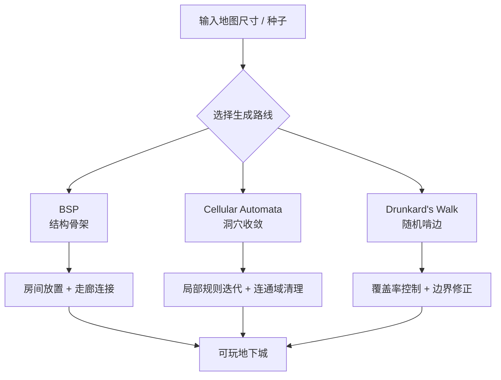

---
title: "游戏与引擎算法 33｜地下城生成：BSP、Cellular Automata 与 Drunkard's Walk"
slug: "algo-33-dungeon-generation"
date: "2026-04-18"
description: "把地下城生成拆成三条工程路线：BSP 负责结构，Cellular Automata 负责洞穴，Drunkard's Walk 负责有机连通，并解释它们各自的边界、成本和工业用法。"
tags:
  - "程序化生成"
  - "地下城生成"
  - "BSP"
  - "Cellular Automata"
  - "Drunkard's Walk"
  - "关卡生成"
  - "Unity"
series: "游戏与引擎算法"
weight: 1833
---

**地下城生成不是“随机打洞”，而是在有限网格上同时满足结构、连通性、节奏和可玩性的约束求解。**

> 读这篇之前：建议先看 [数据结构 14｜BSP]()、[数据结构 20｜程序化噪声]() 和 [游戏与引擎算法 42｜Morton 编码与 Z-Order]()。

## 问题动机

地下城生成要同时回答四个问题：房间放哪、怎么连、怎么避免“全是走廊”或者“全是空地”、以及如何让玩家觉得每次都不一样。纯手工关卡能控制节奏，但成本高；纯随机地图能省时间，但很容易生成死路、孤岛、重复走向，甚至不可达。

所以工业实现通常不会只押一招。更常见的是把地图拆成多个层次：先用 BSP 控结构骨架，再在局部用 Cellular Automata 做洞穴感，最后用 Drunkard's Walk 把连通性补齐或者打散成自然边缘。这个分层思路，和引擎里“先粗筛，再细化”的可见性管线很像。

## 历史背景

地下城生成最早不是游戏编程课里的抽象题，而是 roguelike 社区为了解决“重复玩、内容多、成本低”这三个硬约束慢慢摸出来的。早期地牢大多靠手工摆格子，后来开始出现基于房间、走廊、洞穴、房间模板和规则系统的自动生成。

BSP 路线在 Roguelike 圈子里很早就流行：把矩形区域递归切分，再在叶子里放房间，通过叶子之间连线得到主路径。它的优势是控制力强，能稳定地产出“像地牢”的结构，代价是形态容易有方块感。Cellular Automata 路线更像“先噪一遍，再用规则收敛”，常用于洞穴和天然地貌；它在视觉上更有机，但路径连通性和尺度控制更难。Drunkard's Walk 则来自随机游走的直觉：从一个起点反复走，走过的格子变成地面，像把墙面慢慢啃开。它的边缘自然，但全局布局基本靠后处理。

今天的引擎实现通常把这三类方法视为不同的“生成算子”，而不是互斥阵营。真正可用的管线，往往会把它们串起来：BSP 决定大房间和主干，CA 塑造局部洞穴，Random Walk 修边、填洞或生成支路。

## 数学基础

### 1. BSP 是递归分割树

把一个矩形区域记成 `R`。BSP 做的事，是在每一层选择一条分割线，把 `R` 切成两个子区域：`R1` 和 `R2`。

如果每次切分都只看当前区域，那么整个过程就是一棵二叉树。第 `k` 层的节点数上界是 `2^k`，但实际节点数量会被最小房间尺寸和长宽比约束截断。

一个常见的代价函数可以写成：

$$
J = \alpha \cdot \text{aspectPenalty} + \beta \cdot \text{sizePenalty} + \gamma \cdot \text{corridorCost}
$$

工程里不会真做连续优化，但这个式子能说明一件事：BSP 不是在“随便切”，而是在约束空间里找一棵更像关卡的树。

### 2. Cellular Automata 是局部规则迭代

把地图看成一个二维格点场 `s_t(x,y) \in \{0,1\}`，`1` 代表墙，`0` 代表地。每一轮更新只依赖一个邻域，例如 8 邻域。

最常见的规则之一是“墙的生死阈值”：

$$
s_{t+1}(p)=\begin{cases}
1,& N(p) \ge k \\
0,& N(p) < k
\end{cases}
$$

这里 `N(p)` 是邻域内墙的数量。`k` 越高，地图越容易闭合；`k` 越低，洞穴越容易连成片。多轮迭代后，局部噪声会收敛成块状结构，这就是洞穴感的来源。

### 3. Drunkard's Walk 是受边界约束的随机游走

把地图上的位置看成离散状态 `X_t`。每一步以固定概率向四个方向之一移动：

$$
P(X_{t+1}=x+e_i\mid X_t=x)=\frac14
$$

如果不加边界和停止条件，它只是简单随机游走；加上“走过的格子变成地面”“达到目标覆盖率就停止”“靠近边界就反弹”之后，它就变成一个可用于关卡塑形的随机过程。

从概率论角度看，Drunkard's Walk 的强项不是生成精确形状，而是制造“边缘不那么人工”的连通性和空洞分布。它对局部噪声很自然，但对全局节奏几乎没有控制力。

## 结构图 / 流程图




## 算法推导

### BSP：先让“像样的骨架”成立

如果你一上来就在整张图上随机挖洞，最容易得到的是无组织的碎片。BSP 的思路是先把大问题降成小问题：

1. 把大矩形拆成若干子矩形。
2. 在叶子矩形里放房间。
3. 在树的父子之间连线。

这样做的核心收益是可控。最少房间尺寸、长宽比、房间密度、主路径长度，都能通过分割参数间接约束。

从树的角度看，BSP 的难点不是“能不能切”，而是“什么时候停”。停得太早，房间太少；停得太晚，碎片太多，走廊成本升高。工程里通常会设置：最小宽高、最大深度、最小房间面积、叶子随机保留率。

### Cellular Automata：让局部噪声自组织

Cellular Automata 常用在洞穴，因为它擅长把“随机墙点”收敛成大片岩体和连通空腔。它不是在求全局最优，而是在反复强化局部多数派。

这意味着它有天然偏置：

- `k` 大，墙会吞掉空地。
- `k` 小，空地会侵蚀墙体。

所以实际流程通常是：先随机填充，再做多轮规则更新，再用 flood fill 取最大连通域，最后补洞或者删孤岛。否则你会得到“看着像洞，走起来像迷宫碎渣”的地图。

### Drunkard's Walk：用随机过程补连通性

Drunkard's Walk 更像“局部雕刻”。它不关心全局形状，只关心当前脚下可走、以及走了多少格。

它的工程价值在于两点：

- 你可以很容易控制覆盖率。
- 它天然会生成不那么笔直的边界。

所以它常用于：

- 把 BSP 过于整齐的房间边缘啃成自然过渡。
- 在洞穴边缘补出支路和死胡同。
- 生成“有手工味”的不规则区域。

但它并不适合承担全部关卡逻辑。没有后处理时，它会在边界附近堆出大量随机噪声；没有连通域检查时，可能把关键点埋死。

## 算法实现

下面给一个可自洽的 C# 版本。它把三种路线放进同一个 `DungeonGenerator`，便于你按关卡类型切换。

```csharp
using System;
using System.Collections.Generic;
using System.Linq;

public enum Tile
{
    Wall,
    Floor
}

public sealed class DungeonMap
{
    private readonly Tile[,] _tiles;

    public int Width { get; }
    public int Height { get; }

    public DungeonMap(int width, int height)
    {
        if (width <= 0 || height <= 0)
            throw new ArgumentOutOfRangeException("Map size must be positive.");

        Width = width;
        Height = height;
        _tiles = new Tile[width, height];
        Fill(Tile.Wall);
    }

    public Tile this[int x, int y]
    {
        get => _tiles[x, y];
        set => _tiles[x, y] = value;
    }

    public bool InBounds(int x, int y) => x >= 0 && y >= 0 && x < Width && y < Height;

    public void Fill(Tile tile)
    {
        for (int y = 0; y < Height; y++)
        for (int x = 0; x < Width; x++)
            _tiles[x, y] = tile;
    }
}

public readonly record struct RectInt(int X, int Y, int Width, int Height)
{
    public int Right => X + Width;
    public int Bottom => Y + Height;
    public int Area => Width * Height;
}

public static class DungeonGenerator
{
    private static readonly (int dx, int dy)[] Dirs =
    {
        (0, 1), (1, 0), (0, -1), (-1, 0)
    };

    public static DungeonMap GenerateBsp(int width, int height, int seed)
    {
        var rng = new Random(seed);
        var map = new DungeonMap(width, height);
        var rooms = new List<RectInt>();
        var leaves = new List<RectInt> { new(1, 1, width - 2, height - 2) };

        const int minLeafSize = 12;
        const int minRoomSize = 5;
        const int maxDepth = 5;

        for (int depth = 0; depth < maxDepth; depth++)
        {
            var next = new List<RectInt>();
            foreach (var leaf in leaves)
            {
                if (leaf.Width <= minLeafSize * 2 && leaf.Height <= minLeafSize * 2)
                {
                    next.Add(leaf);
                    continue;
                }

                bool splitVertical = leaf.Width > leaf.Height
                    ? true
                    : leaf.Height > leaf.Width
                        ? false
                        : rng.Next(2) == 0;

                if (splitVertical && leaf.Width <= minLeafSize * 2)
                {
                    next.Add(leaf);
                    continue;
                }

                if (!splitVertical && leaf.Height <= minLeafSize * 2)
                {
                    next.Add(leaf);
                    continue;
                }

                if (splitVertical)
                {
                    int split = rng.Next(minLeafSize, leaf.Width - minLeafSize);
                    next.Add(new RectInt(leaf.X, leaf.Y, split, leaf.Height));
                    next.Add(new RectInt(leaf.X + split, leaf.Y, leaf.Width - split, leaf.Height));
                }
                else
                {
                    int split = rng.Next(minLeafSize, leaf.Height - minLeafSize);
                    next.Add(new RectInt(leaf.X, leaf.Y, leaf.Width, split));
                    next.Add(new RectInt(leaf.X, leaf.Y + split, leaf.Width, leaf.Height - split));
                }
            }
            leaves = next;
        }

        foreach (var leaf in leaves)
        {
            var room = CarveRoomInsideLeaf(leaf, minRoomSize, rng);
            rooms.Add(room);
            CarveRoom(map, room);
        }

        for (int i = 1; i < rooms.Count; i++)
        {
            var a = CenterOf(rooms[i - 1]);
            var b = CenterOf(rooms[i]);
            CarveCorridor(map, a, b);
        }

        return map;
    }

    public static DungeonMap GenerateCellularAutomata(int width, int height, int seed, double initialFill = 0.45, int steps = 5)
    {
        var rng = new Random(seed);
        var map = new DungeonMap(width, height);

        for (int y = 1; y < height - 1; y++)
        for (int x = 1; x < width - 1; x++)
            map[x, y] = rng.NextDouble() < initialFill ? Tile.Wall : Tile.Floor;

        for (int i = 0; i < steps; i++)
        {
            var next = new Tile[width, height];
            for (int y = 0; y < height; y++)
            for (int x = 0; x < width; x++)
            {
                if (x == 0 || y == 0 || x == width - 1 || y == height - 1)
                {
                    next[x, y] = Tile.Wall;
                    continue;
                }

                int wallCount = CountWallNeighbors(map, x, y);
                next[x, y] = wallCount >= 5 ? Tile.Wall : Tile.Floor;
            }

            for (int y = 0; y < height; y++)
            for (int x = 0; x < width; x++)
                map[x, y] = next[x, y];
        }

        KeepLargestConnectedFloorComponent(map);
        return map;
    }

    public static DungeonMap GenerateDrunkardsWalk(int width, int height, int seed, double targetFloorRatio = 0.35)
    {
        var rng = new Random(seed);
        var map = new DungeonMap(width, height);
        var pos = new System.Drawing.Point(width / 2, height / 2);
        int floorTarget = Math.Max(1, (int)(width * height * targetFloorRatio));
        int carved = 0;

        while (carved < floorTarget)
        {
            if (map.InBounds(pos.X, pos.Y) && map[pos.X, pos.Y] == Tile.Wall)
            {
                map[pos.X, pos.Y] = Tile.Floor;
                carved++;
            }

            var (dx, dy) = Dirs[rng.Next(Dirs.Length)];
            int nx = pos.X + dx;
            int ny = pos.Y + dy;

            if (nx <= 1 || ny <= 1 || nx >= width - 2 || ny >= height - 2)
                continue;

            pos = new System.Drawing.Point(nx, ny);
        }

        return map;
    }

    private static RectInt CarveRoomInsideLeaf(RectInt leaf, int minRoomSize, Random rng)
    {
        int roomWidth = rng.Next(minRoomSize, Math.Max(minRoomSize + 1, leaf.Width - 2));
        int roomHeight = rng.Next(minRoomSize, Math.Max(minRoomSize + 1, leaf.Height - 2));
        int roomX = rng.Next(leaf.X + 1, Math.Max(leaf.X + 2, leaf.Right - roomWidth - 1));
        int roomY = rng.Next(leaf.Y + 1, Math.Max(leaf.Y + 2, leaf.Bottom - roomHeight - 1));
        return new RectInt(roomX, roomY, roomWidth, roomHeight);
    }

    private static (int x, int y) CenterOf(RectInt rect)
        => (rect.X + rect.Width / 2, rect.Y + rect.Height / 2);

    private static void CarveRoom(DungeonMap map, RectInt room)
    {
        for (int y = room.Y; y < room.Bottom; y++)
        for (int x = room.X; x < room.Right; x++)
            map[x, y] = Tile.Floor;
    }

    private static void CarveCorridor(DungeonMap map, (int x, int y) a, (int x, int y) b)
    {
        int x = a.x;
        int y = a.y;

        while (x != b.x)
        {
            map[x, y] = Tile.Floor;
            x += Math.Sign(b.x - x);
        }

        while (y != b.y)
        {
            map[x, y] = Tile.Floor;
            y += Math.Sign(b.y - y);
        }

        map[b.x, b.y] = Tile.Floor;
    }

    private static int CountWallNeighbors(DungeonMap map, int x, int y)
    {
        int count = 0;
        for (int dy = -1; dy <= 1; dy++)
        for (int dx = -1; dx <= 1; dx++)
        {
            if (dx == 0 && dy == 0)
                continue;

            int nx = x + dx;
            int ny = y + dy;
            if (!map.InBounds(nx, ny) || map[nx, ny] == Tile.Wall)
                count++;
        }
        return count;
    }

    private static void KeepLargestConnectedFloorComponent(DungeonMap map)
    {
        var visited = new bool[map.Width, map.Height];
        List<(int x, int y)> best = new();

        for (int y = 1; y < map.Height - 1; y++)
        for (int x = 1; x < map.Width - 1; x++)
        {
            if (visited[x, y] || map[x, y] != Tile.Floor)
                continue;

            var component = FloodFill(map, x, y, visited);
            if (component.Count > best.Count)
                best = component;
        }

        var keep = new HashSet<(int, int)>(best);
        for (int y = 1; y < map.Height - 1; y++)
        for (int x = 1; x < map.Width - 1; x++)
            if (map[x, y] == Tile.Floor && !keep.Contains((x, y)))
                map[x, y] = Tile.Wall;
    }

    private static List<(int x, int y)> FloodFill(DungeonMap map, int startX, int startY, bool[,] visited)
    {
        var stack = new Stack<(int x, int y)>();
        var result = new List<(int x, int y)>();
        stack.Push((startX, startY));
        visited[startX, startY] = true;

        while (stack.Count > 0)
        {
            var (x, y) = stack.Pop();
            result.Add((x, y));

            foreach (var (dx, dy) in Dirs)
            {
                int nx = x + dx;
                int ny = y + dy;
                if (!map.InBounds(nx, ny) || visited[nx, ny] || map[nx, ny] != Tile.Floor)
                    continue;

                visited[nx, ny] = true;
                stack.Push((nx, ny));
            }
        }

        return result;
    }
}
```

## 复杂度分析

### BSP

如果把每次切分都视为一次 `O(1)` 决策，那么切分树的构建是 `O(n)` 到 `O(n log n)` 之间，取决于你是否在叶子上做额外采样和搜索。房间放置和走廊连接通常与叶子数量线性相关。空间复杂度主要来自树节点和房间列表，通常是 `O(n)`。

### Cellular Automata

每一轮迭代都要扫描整张网格，所以时间复杂度是 `O(W × H × k)`，其中 `k` 是迭代轮数。空间复杂度通常是 `O(W × H)`，因为你至少需要当前网格和下一轮缓冲。

### Drunkard's Walk

如果最终要挖出 `m` 个地板格，且每步移动和边界检查是 `O(1)`，总体时间大致是 `O(m)`。但如果你的随机游走反复撞墙、在边界附近徘徊，常数会明显上升。空间复杂度仍是 `O(W × H)`，因为地图本身要存下来。

## 变体与优化

### BSP 的常见变体

- 叶子房间中允许多房间而不是单房间。
- 切分不再只看长宽比，而是加入房间密度目标。
- 走廊不再是 Manhattan 折线，而是 A* 路径或曲线模板。
- 把 BST 式二分切换成 k 叉切分，用来做大区块地城或室内建筑。

### Cellular Automata 的常见变体

- 用不同邻域半径，例如 `5x5`，让洞穴边界更圆。
- 采用多状态规则，区分墙、薄墙、裂缝、可破坏墙。
- 先做规则迭代，再做连通域清理。
- 用 distance field 或 erosion pass 进一步圆滑边界。

### Drunkard's Walk 的常见变体

- 方向带惯性，减少来回抖动。
- 对边界使用反弹或环绕，而不是直接停止。
- 设定多个起点，用于连接多个子区域。
- 先随机游走，再用最短路/最小生成树连接关键点。

## 对比其他算法

| 方法 | 优点 | 缺点 | 典型用途 |
|---|---|---|---|
| BSP | 可控、稳定、便于分区 | 容易方块化 | 房间型地牢、战术地图 |
| Cellular Automata | 自然、洞穴感强 | 连通性难控 | 洞穴、岩层、地下裂隙 |
| Drunkard's Walk | 边界自然、实现简单 | 全局节奏弱 | 修边、支路、天然通道 |
| 房间模板 + 走廊 | 设计感最强 | 内容生产成本高 | 手工感强的主线关卡 |
| 波函数塌缩 | 约束表达力强 | 规则设计复杂 | 高度结构化拼装关卡 |

## 批判性讨论

BSP 的批评点很明确：它太容易做出“过于工程化”的地牢。你能控制每个房间，但也正因为太可控，地图会显得像被尺子切过。它适合规则明确、玩家需要稳定导航的关卡，不适合追求天然地貌的洞穴。

Cellular Automata 的问题则是“局部对了，全局未必对”。规则一旦调得偏，地图就会塌成大团空腔或者封死成砖墙。它需要后处理，不然很难保证可达性。

Drunkard's Walk 解决的是边缘自然性，不是结构完整性。它很适合当补丁，但不适合单独承担关卡骨架。要么限制移动、要么加连通域检查、要么把它放在 BSP 或 CA 后面做收尾。

如果目标是现代商业关卡，还要多问一层：这张地图是给玩家“探索”还是给玩家“战斗”？如果是战斗，过于有机的路径会破坏节奏；如果是探索，过于规则的房间又会显得乏味。地下城生成的本质，其实是节奏设计，不只是几何生成。

## 跨学科视角

- BSP 对应递归分治和空间剖分。
- Cellular Automata 对应离散动力系统和局部传播。
- Drunkard's Walk 对应马尔可夫链和随机游走。
- 连通域清理对应图论里的连通分量与 flood fill。

换句话说，这篇文章不是在讲“游戏里的随机地图”，而是在讲如何把分治、局部规则和随机过程拼成一个能玩的系统。

## 真实案例

- `ammarsufyan/Procedural-2D-Dungeon-Unity` 的 README 明确写了随机游走和 binary space partitioning，两条路线正好对应“有机连通”和“结构骨架”两种目标。[1]
- `fdefelici/dungen-unity` 把 Cellular Automata 与 Room/Corridor 混合起来，说明单靠 CA 不够，工程上通常要再加结构约束和渲染层级。[2]
- `libtcod` 官方文档长期保留了独立的 BSP toolkit，2021 教程也继续把房间-走廊式地牢生成当作入门管线的一部分，说明 BSP 仍然是最容易产品化、也最容易让设计师调参的方案之一。[3]
- `Cataclysm: DDA` 的官方 MAPGEN 文档把大型地图拆成 `24×24` tile 区块，并允许嵌套、旋转和参数化 mapgen，说明现代 roguelike 已经把“多生成器混合”做成正式内容管线。[4]

## 量化数据

- `Procedural-2D-Dungeon-Unity` 标注了 Unity `2020.3.25f1`，说明这类生成器完全能落进现代 Unity 工程，而不是停留在教学脚本层。[1]
- `dungen-unity` 提供三种生成输出：mesh-only、asset-driven、mixed，这说明同一个算法内核可以拆成至少三种渲染/资产管线。[2]
- `Cataclysm: DDA` 官方文档明确写到多数 mapgen 在 `24×24` tile 区块上工作，并通过嵌套与多 tile 组合扩展成更大建筑，这给了地下城生成一个非常具体的工业量级参考。[4]
- BSP 的理论树深通常受最小叶子尺寸约束，实际不会无限递归；CA 的每轮成本是整张网格扫描；Drunkard's Walk 的总步数通常与目标覆盖率近似线性相关。

## 常见坑

- 只做生成，不做连通性检查。错在地图可能不可达；改法是 flood fill 后保留最大连通域，或者在关键点之间补最短路。
- BSP 分割过深。错在叶子太碎，走廊数量暴涨；改法是增加最小叶子尺寸和最大深度约束。
- CA 阈值固定不调。错在不同地图尺寸下，规则会过强或过弱；改法是把初始填充率和邻域阈值做成参数组。
- Drunkard's Walk 没有边界保护。错在随机游走会卡边或越界；改法是做反弹、回缩或软边界。
- 只生成地形，不放入口出口。错在关卡没有目标感；改法是先定入口/出口，再围绕它们做结构约束。
- 把“看起来像洞”当成“可玩”。错在视觉噪声不等于路径可达；改法是用图搜索验证关键点连通。

## 何时用 / 何时不用

### 适合用

- 你需要重复可玩、成本低的关卡内容。
- 你接受程序化风格，而不是逐格手工雕刻。
- 你能在生成后做连通性、节奏和敌人分布的二次修整。

### 不适合用

- 你在做强叙事、强脚本、强镜头控制的关卡。
- 你需要严格对齐演出、任务、战斗和视线设计。
- 你没有后处理预算，却又想靠随机生成一次到位。

## 相关算法

- [数据结构 14｜BSP]()
- [数据结构 20｜程序化噪声]()
- [游戏与引擎算法 30｜MCTS]()
- [游戏与引擎算法 42｜Morton 编码与 Z-Order]()
- [游戏与引擎算法 44｜视锥体与包围盒测试]()
- [游戏与引擎算法 34｜Poisson Disk Sampling：蓝噪点的工程实现]()

## 小结

地下城生成的核心，不是“随机”，而是“用什么规则把随机收成可玩结构”。BSP 解决骨架，Cellular Automata 解决自然性，Drunkard's Walk 解决边缘和连通。三者各自都不完整，但拼起来就能覆盖大多数地牢、洞穴和混合式关卡需求。

如果你要的是稳定节奏，先 BSP；如果你要的是天然洞穴，先 CA；如果你要的是边缘和支路的自然感，补 Drunkard's Walk。真正成熟的管线，通常会把它们串起来，而不是拿其中一个去赌全部。

## 参考资料

[1] `ammarsufyan/Procedural-2D-Dungeon-Unity`, README.md, GitHub: https://github.com/ammarsufyan/Procedural-2D-Dungeon-Unity
[2] `fdefelici/dungen-unity`, README.md, GitHub: https://github.com/fdefelici/dungen-unity
[3] `libtcod` documentation index / BSP toolkit / 2021 roguelike tutorial: https://libtcod.github.io/docs/ and https://libtcod.github.io/tutorials/python/2021/
[4] `Cataclysm: DDA` MAPGEN docs: https://docs.cataclysmdda.org/JSON/MAPGEN.html


