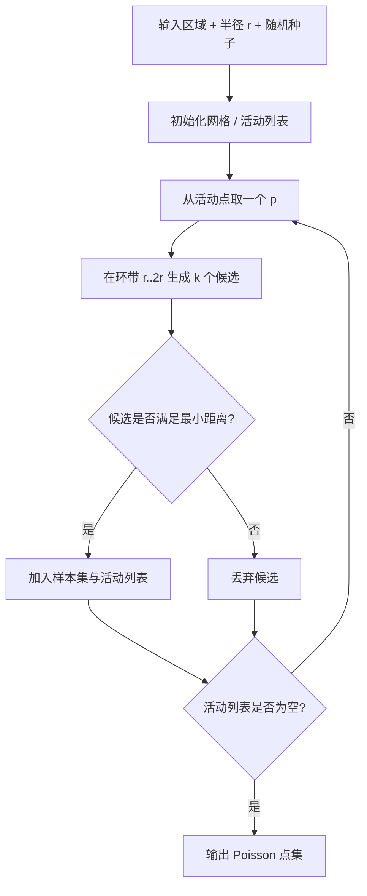

---
title: "游戏与引擎算法 34｜Poisson Disk Sampling：蓝噪点的工程实现"
slug: "algo-34-poisson-disk-sampling"
date: "2026-04-18"
description: "从 Bridson 2007 的 O(N) 采样法出发，讲清 Poisson Disk Sampling 为什么是蓝噪、为什么适合 GPU/图形管线、以及怎么落到 Unity 和引擎工具链里。"
tags:
  - "采样"
  - "Poisson Disk"
  - "蓝噪"
  - "Bridson"
  - "GPU"
  - "Unity"
  - "图形学"
series: "游戏与引擎算法"
weight: 1834
---

**Poisson Disk Sampling 的目标很简单：在给定区域里生成一批点，点与点之间至少相隔 `r`，同时又尽量保持随机，而不是排成规则网格。**

> 读这篇之前：建议先看 [数据结构 13｜空间哈希]()、[游戏与引擎算法 42｜Morton 编码与 Z-Order]() 和 [游戏与引擎算法 41｜浮点精度与数值稳定性]()。

## 问题动机

游戏和图形里最常见的“随机”需求，不是要完全无规律，而是要“看起来随机，但不要太近、不要成条纹、不要聚团太明显”。

你会在这些地方遇到它：

- 草地、岩石、树木、路灯的散布。
- VFX 里的粒子初始化。
- 采样纹理、重要性采样、屏幕空间抖动。
- 程序化关卡里敌人、战利品、资源点的布局。
- 蓝噪纹理、TAA 抖动、stochastic rendering 的采样模式。

如果直接 `rand()`，点会成团。若只用网格采样，点会太规则。Poisson Disk Sampling 站在中间：它保留随机性，同时施加最小间距约束，所以人眼更不容易看到低频结构。

## 历史背景

Poisson disk 的核心思想并不新，真正把它推成图形学常用工具的是 Robert Bridson。2007 年他在 SIGGRAPH sketches 里发表 *Fast Poisson Disk Sampling in Arbitrary Dimensions*，把经典的 dart throwing 变成了一个简单、实用、可扩展到任意维度的 O(N) 方案。[1]

那篇工作的时代背景很清楚：图形学已经大量依赖随机采样，但传统 rejection sampling 太慢，尤其在蓝噪采样这种“点不能太近”的约束下，拒绝率会随着密度迅速上升。Bridson 的改法把问题拆成两个局部结构：活动点表和网格加速结构，于是“全局试探”变成“局部扩张”。

后来 GPU 图形管线把这类采样进一步推开。NVIDIA 的 PixelPie 用 rasterization 直接在图形管线里并行生成 Poisson-disk 样本，说明这类问题不只适合 CPU，也适合大规模并行。[2] 到 2021-2022 年，NVIDIA 又把蓝噪扩展到时空域，推出 spatiotemporal blue noise masks，用于 TAA、体渲染和 stochastic rendering。[3][4]

这条演化线说明一件事：Poisson disk 不是一个“数学上漂亮”的算法标题，它是一个长期被图形工程、采样理论和并行硬件反复打磨的实用工具。

## 数学基础

### 1. 最小距离约束

在二维平面里，我们要生成点集 `P={p_i}`，满足：

$$
\|p_i - p_j\| \ge r, \quad \forall i \ne j
$$

这条约束让点之间不会聚得太近。若把点放到频域里看，低频结构会被抑制，结果更接近蓝噪分布。

### 2. 采样网格尺寸

Bridson 的关键技巧，是用一个网格来做邻居查询。设维度为 `d`，网格边长取：

$$
a = \frac{r}{\sqrt{d}}
$$

这样做有一个重要性质：每个网格单元最多容纳一个样本。因为如果两个点落在同一格里，它们的距离必然小于 `r`，直接违背约束。

在二维里，这意味着你只需要检查候选点周围有限数量的格子，而不是扫描全部已生成样本。

### 3. 候选点的 annulus

Bridson 不是在整个区域里乱扔候选点，而是在活动点周围的环带里采样：

$$
r \le \|q - p\| < 2r
$$

为什么是这个区间？因为如果候选点离活动点太近，几乎必然失败；如果离得太远，又会让“局部扩张”的效率下降。环带采样把候选点集中在最可能成功的区域，减少无效试探。

## 结构图 / 流程图



```mermaid
flowchart LR
    A[样本点] --> B[空间网格]
    B --> C[候选点只查邻近格子]
    C --> D[局部验证]
    D --> E[常数级邻居检查]
    E --> F[O(N) 生成]
```

## 算法推导

### 从朴素 dart throwing 到局部扩张

最直接的做法，是不断随机扔点，然后检查它离所有已有点够不够远。这个方法正确，但很慢。因为当点集越来越密时，大多数候选都会失败，拒绝率会迅速攀升。

Bridson 的贡献，不在于换了一个名字，而在于换了一个视角：

- 不再从全局空间均匀撒候选。
- 改成从“边界前沿”的活动点扩张。
- 用网格把邻居查询压成局部常数操作。

这让 Poisson disk 从“概念正确但太慢”变成“工程上足够快”。

### 为什么活跃点表有效

活动点表里的点，代表当前样本集的“边界”。如果一个点周围在环带里再也放不下新样本，它就不再具有扩张能力，可以从活动列表里移除。

这其实是一个非常朴素的前沿推进过程。点集不是一次性生成的，而是从稀疏种子开始，一圈一圈长大。这样一来，算法的失败只会局部发生，不会把整张图都拖进全局搜索。

### 为什么蓝噪比均匀随机更适合图形学

均匀随机会产生聚团和空洞，导致频域里出现低频能量。人眼对低频很敏感，所以它会“看起来脏”。

Poisson disk 刻意禁止近邻，等价于给样本施加了排斥力。结果是低频成分被压住，高频噪声增加，但高频噪声更不显眼。对抗锯齿、抖动采样和 stochastic rendering 来说，这种谱形状更友好。

## 算法实现

下面给一个可以直接用的 2D Bridson 版本。它的边界是一个矩形，也可以很容易扩展成纹理空间、世界空间或者屏幕空间。

```csharp
using System;
using System.Collections.Generic;
using System.Numerics;

public static class PoissonDiskSampling
{
    public readonly struct RectF
    {
        public readonly float Left;
        public readonly float Top;
        public readonly float Width;
        public readonly float Height;

        public float Right => Left + Width;
        public float Bottom => Top + Height;

        public RectF(float left, float top, float width, float height)
        {
            if (width <= 0f || height <= 0f)
                throw new ArgumentOutOfRangeException(nameof(width), "RectF dimensions must be positive.");

            Left = left;
            Top = top;
            Width = width;
            Height = height;
        }

        public bool Contains(float x, float y)
        {
            return x >= Left && x < Right && y >= Top && y < Bottom;
        }
    }

    private readonly struct GridCoord : IEquatable<GridCoord>
    {
        public readonly int X;
        public readonly int Y;

        public GridCoord(int x, int y)
        {
            X = x;
            Y = y;
        }

        public bool Equals(GridCoord other) => X == other.X && Y == other.Y;
        public override bool Equals(object? obj) => obj is GridCoord other && Equals(other);
        public override int GetHashCode() => HashCode.Combine(X, Y);
    }

    public static List<Vector2> Generate(RectF bounds, float minimumDistance, int seed, int k = 30)
    {
        if (minimumDistance <= 0f)
            throw new ArgumentOutOfRangeException(nameof(minimumDistance));
        if (bounds.Width <= 0f || bounds.Height <= 0f)
            throw new ArgumentOutOfRangeException(nameof(bounds));
        if (k <= 0)
            throw new ArgumentOutOfRangeException(nameof(k));

        var rng = new Random(seed);
        float cellSize = minimumDistance / MathF.Sqrt(2f);
        int gridWidth = Math.Max(1, (int)MathF.Ceiling(bounds.Width / cellSize));
        int gridHeight = Math.Max(1, (int)MathF.Ceiling(bounds.Height / cellSize));
        var grid = new Vector2?[gridWidth, gridHeight];
        var samples = new List<Vector2>();
        var active = new List<Vector2>();

        Vector2 first = new(
            bounds.Left + (float)rng.NextDouble() * bounds.Width,
            bounds.Top + (float)rng.NextDouble() * bounds.Height);

        AddSample(first, bounds, cellSize, grid, samples, active);

        while (active.Count > 0)
        {
            int activeIndex = rng.Next(active.Count);
            Vector2 center = active[activeIndex];
            bool found = false;

            for (int i = 0; i < k; i++)
            {
                Vector2 candidate = GenerateCandidate(center, minimumDistance, rng);
                if (!bounds.Contains(candidate.X, candidate.Y))
                    continue;

                if (!IsFarEnough(candidate, minimumDistance, cellSize, grid, bounds))
                    continue;

                AddSample(candidate, bounds, cellSize, grid, samples, active);
                found = true;
                break;
            }

            if (!found)
            {
                int last = active.Count - 1;
                active[activeIndex] = active[last];
                active.RemoveAt(last);
            }
        }

        return samples;
    }

    private static Vector2 GenerateCandidate(Vector2 center, float minimumDistance, Random rng)
    {
        float radius = minimumDistance * (1f + (float)rng.NextDouble());
        float angle = (float)(rng.NextDouble() * Math.PI * 2.0);
        return center + new Vector2(MathF.Cos(angle), MathF.Sin(angle)) * radius;
    }

    private static bool IsFarEnough(Vector2 candidate, float minimumDistance, float cellSize, Vector2?[,] grid, RectF bounds)
    {
        GridCoord coord = ToGrid(candidate, bounds, cellSize);
        int startX = Math.Max(0, coord.X - 2);
        int endX = Math.Min(grid.GetLength(0) - 1, coord.X + 2);
        int startY = Math.Max(0, coord.Y - 2);
        int endY = Math.Min(grid.GetLength(1) - 1, coord.Y + 2);
        float minDist2 = minimumDistance * minimumDistance;

        for (int y = startY; y <= endY; y++)
        for (int x = startX; x <= endX; x++)
        {
            Vector2? sample = grid[x, y];
            if (!sample.HasValue)
                continue;

            if (Vector2.DistanceSquared(candidate, sample.Value) < minDist2)
                return false;
        }

        return true;
    }

    private static void AddSample(Vector2 sample, RectF bounds, float cellSize, Vector2?[,] grid, List<Vector2> samples, List<Vector2> active)
    {
        GridCoord coord = ToGrid(sample, bounds, cellSize);
        grid[coord.X, coord.Y] = sample;
        samples.Add(sample);
        active.Add(sample);
    }

    private static GridCoord ToGrid(Vector2 p, RectF bounds, float cellSize)
    {
        int x = (int)((p.X - bounds.Left) / cellSize);
        int y = (int)((p.Y - bounds.Top) / cellSize);
        return new GridCoord(x, y);
    }
}
```

### 代码边界

这段代码故意只做“矩形区域内的 2D 采样”。原因很简单：先把最常见的工程边界讲清楚，再谈多边形、曲面和高维扩展。

如果你要放到 Unity：

- 纹理空间可以直接用 `RectInt`、归一化 UV，或者沿用这里的 `RectF`。
- 世界空间需要把采样点投到地形、NavMesh 或局部平面。
- 生成树木、草簇、石块时，Poisson 负责候选点，射线检测和地表法线负责最终落点。

## 复杂度分析

### 时间复杂度

Bridson 版本的平均复杂度通常近似 `O(N)`，其中 `N` 是最终生成的样本数。原因是每个点只会被加入一次，而每个候选只做常数级邻居检查。

朴素 rejection sampling 则会随着填充率上升迅速退化，因为你每生成一个新点，都要和越来越多已有点比较，极端情况下接近 `O(N^2)`。

### 空间复杂度

空间主要来自三部分：样本数组、活动列表和网格。总体是 `O(N)` 加上网格大小。网格大小与区域面积成正比，和最小距离平方成反比。

## 变体与优化

### 常见变体

- 固定半径的标准 Poisson disk。
- 变半径的 adaptive Poisson disk，用于重要性采样。
- 曲面上的 Poisson disk，用于网格、球面和参数曲面。
- 分层采样与 hierarchical Poisson disk，用于多分辨率。

### 工程优化

- 用 Morton order 或空间哈希替代稠密网格，减少大区域空网格内存。[5]
- 把候选生成和邻居检查并行化，适合 GPU 或 Job System。
- 对大批量采样先做块级切分，再在块内生成，减少随机访问。
- 如果要稳定复现，必须把 RNG、边界、`k` 和浮点路径全部固定下来。

## 对比其他算法

| 方法 | 优点 | 缺点 | 适用场景 |
|---|---|---|---|
| 均匀随机 + 拒绝 | 简单直观 | 后期极慢，聚团明显 | 小样本、教学演示 |
| 网格抖动 / Stratified | 实现简单，分布规则 | 容易有网格痕迹 | 低成本抖动、UI 采样 |
| Lloyd Relaxation / CVT | 视觉均匀 | 迭代贵，边界漂移 | 离线生成、网格优化 |
| Poisson Disk | 蓝噪、最小间距可控 | 实现复杂度略高 | 图形学、PCG、采样纹理 |

## 批判性讨论

Poisson disk 不是“万能随机”。它解决的是最小距离和视觉均匀性，不解决语义约束。也就是说，它能帮你把树撒得不挤，但不会帮你决定树该不该出现在悬崖边、任务点附近或者玩家视野里。

它也不是所有维度都同样划算。维度一高，网格邻居检查仍然是局部常数，但候选空间和可接受率都会恶化。高维重要性采样通常要结合其它策略，而不是只靠 Bridson。

GPU 方案同样有边界。PixelPie 把采样并行化了，但那不意味着“GPU 上总是更好”。如果你的总样本数很小，或者要频繁做复杂碰撞 / 约束测试，CPU 的局部缓存可能更划算。

## 跨学科视角

- 从信号处理看，Poisson disk 是在频域里塑造噪声谱。
- 从蒙特卡洛看，它是降低方差的采样策略。
- 从几何看，它是带排斥约束的点集构造问题。
- 从并行计算看，它把全局拒绝搜索改成了局部扩张和局部检查。

## 真实案例

- Robert Bridson 的 2007 论文是今天几乎所有工程实现的起点。[1]
- NVIDIA 的 PixelPie 把 Poisson-disk 生成搬到 graphics pipeline，公开给出了接近 `7 million samples/sec` 的结果。[2]
- NVIDIA 的 Spatiotemporal Blue Noise Masks 说明蓝噪已经从空间采样扩展到时间域，直接服务于 TAA、体渲染和 stochastic rendering。[3][4]
- `thinks/tph_poisson` 提供了一个无依赖、可复用的 C 实现，说明 Bridson 不是“论文算法”，而是真能落进代码库的工具。[6]
- `daikiyamanaka/fast-poisson-disk-sampling` 和 `thinks/tph_poisson` 提供了可直接复用的实现，说明这套采样器不是“论文草图”，而是能直接嵌进程序化生成和编辑器工具链的基础模块。[6][7]

## 量化数据

- Bridson 2007 的关键结论是：把采样从传统 dart throwing 改造成活动点扩张后，可以在任意维度里做到 `O(N)` 级别生成。[1]
- PixelPie 在 GTX 580 上实现了接近 `7 million samples/sec` 的采样速度，说明 Poisson disk 可以被 GPU 化，而不只是 CPU 小工具。[2]
- `k = 30` 是 Bridson 实现里非常常见的试探次数起点；它不是魔法常数，而是工程上“成功率和成本”之间的折中点。[1]
- 网格单元尺寸 `r / sqrt(2)` 会让二维里每格最多容纳一个样本，这直接把邻居检查压成常数级。

## 常见坑

- 把候选点均匀撒在整个区域。错在拒绝率太高；改法是在 `r..2r` 环带内生成候选。
- 网格太大或太小。错在前者漏检，后者浪费内存；改法是按 `r / sqrt(d)` 计算。
- 只检查当前格子。错在漏掉邻近格子的冲突；改法是扫邻域块。
- `k` 设得过小。错在样本密度不足，空洞过大；改法是提高候选尝试次数。
- 浮点边界处理不一致。错在样本落在边界附近时出现越界或重复；改法是把边界检查和坐标量化统一。
- 以为 Poisson disk 自带“美感”。错在它只负责分布，不负责语义；改法是把它放进更大的布局系统里。

## 何时用 / 何时不用

### 适合用

- 你要做蓝噪采样、对象散布、抖动、重要性采样。
- 你在乎最小距离，而不是严格规则网格。
- 你要把采样结果接到 GPU、TAA、Procedural Content Generation 或 Unity 工具链。

### 不适合用

- 你只需要最快的伪随机点。
- 你需要严格的格状布局，或者可控的分层结构。
- 你要在高维、强约束、低预算场景里一次性生成大量点，但又不愿意做额外优化。

## 相关算法

- [数据结构 13｜空间哈希]()
- [游戏与引擎算法 42｜Morton 编码与 Z-Order]()
- [游戏与引擎算法 41｜浮点精度与数值稳定性]()
- [游戏与引擎算法 33｜地下城生成]()
- [数据结构 20｜程序化噪声]()

## 小结

Poisson Disk Sampling 的价值，不在“随机”，而在“随机但有最小间距”。Bridson 把这个问题从高代价 rejection sampling 改成了活动点扩张 + 网格邻居检查，于是它变成了图形学、程序化生成、GPU 蓝噪和 Unity 工程里都能稳定使用的基础块。

如果你的问题是“点别挤在一起”，它几乎总是比纯随机更好；如果你的问题是“还要满足语义和节奏”，那它应该作为布局系统的一层，而不是整个系统。

## 参考资料

[1] Robert Bridson, *Fast Poisson disk sampling in arbitrary dimensions*, ACM SIGGRAPH 2007 sketches, DOI: 10.1145/1278780.1278807, PDF: https://www.cs.ubc.ca/~rbridson/docs/bridson-siggraph07-poissondisk.pdf
[2] *PixelPie: Maximal Poisson-disk Sampling with Rasterization*, NVIDIA Research, 2013: https://research.nvidia.com/publication/2013-07_pixelpie-maximal-poisson-disk-sampling-rasterization
[3] *Scalar Spatiotemporal Blue Noise Masks*, NVIDIA Research, 2021: https://research.nvidia.com/publication/2021-12_scalar-spatiotemporal-blue-noise-masks
[4] *Spatiotemporal Blue Noise Masks*, NVIDIA Research, 2022: https://research.nvidia.com/publication/2022-07_spatiotemporal-blue-noise-masks
[5] `algo-42-morton-z-order.md` and `ds-13-spatial-hashing.md` for spatial indexing context.
[6] `thinks/tph_poisson`, GitHub: https://github.com/thinks/poisson-disk-sampling
[7] `daikiyamanaka/fast-poisson-disk-sampling`, GitHub: https://github.com/daikiyamanaka/fast-poisson-disk-sampling


