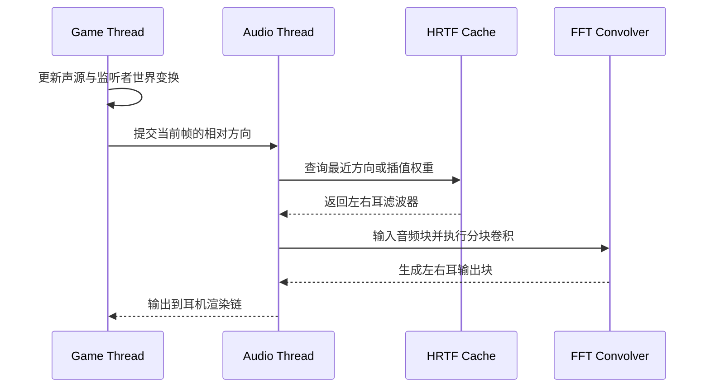

---
title: "游戏与引擎算法 35｜HRTF：3D 空间音频"
slug: "algo-35-hrtf"
date: "2026-04-18"
description: "从 HRIR/HRTF、ITD/ILD、频域卷积到方位插值，系统讲清 3D 空间音频的双耳渲染原理、工程实现和个体化难题。"
tags:
  - "音频"
  - "HRTF"
  - "HRIR"
  - "空间音频"
  - "双耳渲染"
  - "SOFA"
  - "Steam Audio"
  - "Wwise"
series: "游戏与引擎算法"
weight: 1835
---

**HRTF 的本质，是把“声音从某个方向到达耳朵后会变成什么样”这件事，压缩成一组可查询、可插值、可卷积的耳朵响应函数。**

> 读这篇之前：建议先看 [游戏与引擎算法 39｜坐标空间变换全景]()、[游戏与引擎算法 09｜旋转插值：Slerp、Nlerp、Squad]() 和 [游戏与引擎算法 41｜浮点精度与数值稳定性]()。

## 问题动机

普通立体声擅长左右分离，不擅长前后、上下和距离。游戏里只做声像平移，玩家会听见“左边大、右边小”，却很难判断声音来自头顶、身后还是正前方。

HRTF 解决的是“方向感”而不是“音量感”。它把头部、躯干和外耳对声波的散射结果编码为左右耳各自的滤波器，让播放器在耳机上合成双耳线索。

这件事在 VR、第一人称射击、驾驶舱、AR 导航、军事仿真里尤其关键。玩家需要的不只是“听见声音”，而是“靠耳朵知道方向”。如果没有 HRTF，很多空间线索会塌成一个平面，前后翻转和仰角判断会明显变差。

工程上还有第二层问题：实时性。每个声源都跑一遍长 FIR 卷积，CPU 会很快爆掉；每次头部转动都重新找 HRTF，数据规模又会炸。真正能落地的系统，必须同时解决查询、插值、卷积、缓存和线程安全。

## 历史背景

空间听觉的实验基础在 20 世纪中后期逐步成形，Blauert 等人的研究把人耳如何利用时间差、能量差和频谱差定位声音系统化了。1990 年代以后，Møller 等人推动了 HRTF 的测量和个体差异研究，让它从心理声学概念变成可用的数据集。进入 2000 年代，随着 HRTF 数据交换标准、头部追踪和实时 FFT 的成熟，HRTF 才真正从实验室进入游戏和 VR 管线。

早期的瓶颈不是“理论不成立”，而是“测量太慢、数据太大、算力太贵”。今天这些问题都还在，只是换了形态：我们不再担心算不出 HRTF，而是担心个体化不够、插值不稳、耳机外化不够自然，以及多声源场景的 CPU 预算被吃穿。

## 数学基础

### 1. HRIR 和 HRTF 不是一回事

HRIR 是时域脉冲响应，HRTF 是它在频域的表示。

设声源方向为 `d = (θ, φ)`，左/右耳的 HRIR 分别记为 `h_L[n; d]` 和 `h_R[n; d]`，输入单声道信号为 `x[n]`，则双耳输出是：

$$
 y_L[n] = (x * h_L(\cdot; d))[n], \qquad
 y_R[n] = (x * h_R(\cdot; d))[n]
$$

频域里，卷积变成乘法：

$$
Y_L(\omega) = X(\omega) H_L(\omega; d), \qquad
Y_R(\omega) = X(\omega) H_R(\omega; d)
$$

这里的 `H_L`、`H_R` 就是 HRTF。实际工程里我们拿到的常常是 SOFA 文件里的离散 HRIR，再通过 FFT 预处理成频域表。

### 2. ITD 和 ILD 是最基础的双耳线索

ITD 是两耳到达时间差，ILD 是两耳能量差。

一个常用定义是：

$$
\mathrm{ITD}(d) = \arg\max_{\tau} \; R_{LR}(\tau; d)
$$

其中 `R_{LR}` 是左右耳信号的互相关。直觉很简单：哪个时移能让左右耳波形最对齐，那个时移就是时间差。

ILD 则看幅度比：

$$
\mathrm{ILD}(f, d) = 20 \log_{10} \frac{|H_L(f; d)|}{|H_R(f; d)|}
$$

低频更依赖 ITD，高频更依赖 ILD。经验上，1500 Hz 左右是一个常见分界。高频波长更短，头部形成更明显的声影，ILD 才会变得强。

### 3. 头部不是点声源，它是散射体

HRTF 背后的物理本质是散射问题。声波撞到头部、躯干和耳廓后，不会只做几何投影，而会发生衍射、反射和频谱整形。

若把头部近似为刚性边界，频域声压满足 Helmholtz 方程：

$$
(\nabla^2 + k^2)p(\mathbf{x}) = 0
$$

边界上常见近似是刚性表面条件：

$$
\frac{\partial p}{\partial n} = 0
$$

这说明 HRTF 不是“摆个左右平移就完事”，而是和头部几何、耳廓形状、测量方向、甚至距离都有关。

### 4. 方位插值不能直接线性插 HRIR

HRTF 数据集永远是离散采样，不可能每个方向都测一遍。工程上必须插值。

最危险的做法，是直接对时域 HRIR 做线性插值。它会把相位和到达时间一起糊掉，容易引入梳状滤波和前后翻转的不稳定。

更稳妥的做法通常是分开处理：

$$
H(d) \approx H_{\min}(d) \cdot e^{-j\omega \tau(d)}
$$

也就是先把最小相位部分和纯延迟部分拆开，再分别插值。低频 ITD、整体延迟和高频谱形状不应该用同一种数值方法处理。

### 5. 方向是球面上的问题

声源方向不是二维平面坐标，而是球面方向。插值本质上是在球面三角形、近邻测点或者球面网格上做局部近似。

所以 HRTF 处理会和 `Slerp`、球面三角剖分、法线空间、听者局部坐标这些主题缠在一起。这个问题本身就和 [旋转插值]() 很近，只不过这里插的不是姿态，而是方向响应。

## 算法推导

### 1. 从“声像平移”走到“耳朵滤波”

最简单的空间音频只有声像平移。左边声源就把左声道拉大一点，右边声源就把右声道拉大一点。

这个方法能骗过“左右”，骗不过“前后”和“上下”。原因很直接：它没有编码耳廓带来的谱形差异，也没有编码头部造成的时间差。

HRTF 的思路是换一层抽象：不去模拟“声源在空间中的样子”，而是模拟“同一个声源从某个方向进到耳道后被怎样改写”。这样一来，输出就不再是普通立体声的左右混音，而是双耳耳机信号。

### 2. 方向查询必须在监听者局部坐标系里做

空间音频的输入不是世界坐标，而是相对监听者的局部方向。

每帧我们都要做：

1. 把声源位置减去监听者位置。
2. 用监听者朝向矩阵把向量转到头部局部坐标系。
3. 算出方位角、俯仰角和距离。
4. 用这些参数去查 HRTF 数据集。

如果头部跟踪存在，监听者局部坐标系会随头一起转。也就是说，声源相对于耳朵的方向每帧都可能变。这个步骤非常像渲染里的视图矩阵，只不过这里算的是“耳朵看世界”。

### 3. 查表只是开始，插值才是难点

大多数 HRTF 数据集只覆盖有限方向数。比如 0.5°、5° 或 10° 一类的离散采样，测得越密，数据越大，插值越容易，但内存和加载压力也越高。

常见策略有三种：

1. 最近邻，最快，但方向抖动明显。
2. 球面双线性或三角插值，平滑度更好。
3. 先插最小相位频谱，再补延迟和幅值，数值更稳。

对于游戏来说，通常不会追求“绝对数学最优”，而是追求“听感稳定、CPU 可控、头转动时不闪烁”。

### 4. 卷积必须做块处理

直接逐样本 FIR 卷积太慢。若一个 HRIR 长度是 `L`，一个音频块大小是 `B`，每个声源每个耳朵做时域卷积的成本约是 `O(BL)`。

这在少量短滤波器时还能撑住，但一旦有几十个声源、长尾 HRTF、再加上房间混响，CPU 很快不够用。

因此实际系统会用分块 FFT 卷积，也就是 overlap-save 或 overlap-add 的变体。核心思想是：

1. 预先把 HRIR 变到频域并分区。
2. 每来一个音频块，只做一次输入 FFT。
3. 用输入频谱和预存滤波器频谱做复数乘法。
4. 做 IFFT，丢掉重叠部分，拼回输出流。

这把成本从“每个样本都做长卷积”改成了“每块做一次 FFT + 若干复乘”，通常更适合实时引擎。

### 5. 个体化问题决定了系统上限

最好的 HRTF，不是“数学上最平滑”的那一个，而是“对这个人最像耳朵”的那一个。

个体化是 HRTF 的核心瓶颈。通用 HRTF 往往能给出方向感，但外化、前后判断和高度定位不一定好。原因不在卷积公式，而在于每个人的耳廓、头宽、肩膀和耳道都不同。

所以工业系统往往做折中：

1. 用通用 HRTF 保底。
2. 提供少量 HRTF 预设或测量库选择。
3. 结合头部追踪改善外化。
4. 对近场和关键声源做更高预算的个体化渲染。

## Mermaid 图示




## 算法实现

下面用高质量 C# 骨架把工程链路串起来。FFT 实现可以替换为你项目里的 `fftw`, `KissFFT`, `pffft` 或 .NET SIMD FFT 包。

```csharp
using System;
using System.Collections.Generic;
using System.Numerics;

public readonly record struct Vec3(float X, float Y, float Z)
{
    public static Vec3 operator +(Vec3 a, Vec3 b) => new(a.X + b.X, a.Y + b.Y, a.Z + b.Z);
    public static Vec3 operator -(Vec3 a, Vec3 b) => new(a.X - b.X, a.Y - b.Y, a.Z - b.Z);
    public static Vec3 operator *(float s, Vec3 v) => new(s * v.X, s * v.Y, s * v.Z);

    public float Length() => MathF.Sqrt(X * X + Y * Y + Z * Z);
    public Vec3 Normalized()
    {
        var len = Length();
        return len > 1e-8f ? new Vec3(X / len, Y / len, Z / len) : new Vec3(0, 0, 1);
    }
}

public readonly record struct ListenerPose(Vec3 Position, Vec3 Forward, Vec3 Up)
{
    public Vec3 Right
    {
        get
        {
            var f = Forward.Normalized();
            var u = Up.Normalized();
            return Cross(f, u).Normalized();
        }
    }

    public Vec3 WorldToListener(Vec3 worldDir)
    {
        var r = Right;
        var f = Forward.Normalized();
        var u = Up.Normalized();
        return new Vec3(Dot(worldDir, r), Dot(worldDir, u), Dot(worldDir, f));
    }

    private static float Dot(Vec3 a, Vec3 b) => a.X * b.X + a.Y * b.Y + a.Z * b.Z;
    private static Vec3 Cross(Vec3 a, Vec3 b) => new(
        a.Y * b.Z - a.Z * b.Y,
        a.Z * b.X - a.X * b.Z,
        a.X * b.Y - a.Y * b.X);
}

public sealed class HrirPair
{
    public required float SampleRate { get; init; }
    public required float[] Left { get; init; }
    public required float[] Right { get; init; }
}

public sealed class HrtfSample
{
    public required float AzimuthDeg { get; init; }
    public required float ElevationDeg { get; init; }
    public required HrirPair Hrir { get; init; }
}

public sealed class HrtfDatabase
{
    private readonly List<HrtfSample> _samples;

    public HrtfDatabase(IEnumerable<HrtfSample> samples)
    {
        _samples = new List<HrtfSample>(samples);
        if (_samples.Count == 0) throw new ArgumentException("HRTF database is empty.", nameof(samples));
    }

    public HrtfLookup Query(float azimuthDeg, float elevationDeg)
    {
        // 简化版：找最近的 4 个样本做球面局部插值。
        // 真实系统可替换成三角剖分、球面 Voronoi 或 SOFA 的原生查表。
        var ranked = new List<(HrtfSample sample, float dist)>(_samples.Count);
        foreach (var s in _samples)
        {
            var da = AngularDistanceDeg(azimuthDeg, elevationDeg, s.AzimuthDeg, s.ElevationDeg);
            ranked.Add((s, da));
        }

        ranked.Sort((a, b) => a.dist.CompareTo(b.dist));
        var count = Math.Min(4, ranked.Count);
        var selected = ranked.GetRange(0, count);

        var invSum = 0f;
        var weights = new float[count];
        for (int i = 0; i < count; i++)
        {
            // 距离越近权重越高，避免在稀疏角度网格上突然跳变。
            var w = 1f / MathF.Max(1e-4f, selected[i].dist * selected[i].dist);
            weights[i] = w;
            invSum += w;
        }

        for (int i = 0; i < count; i++) weights[i] /= invSum;
        return new HrtfLookup(Quantize(azimuthDeg), Quantize(elevationDeg), Blend(selected, weights));
    }

    private static HrirPair Blend(List<(HrtfSample sample, float dist)> selected, float[] weights)
    {
        var leftLen = selected[0].sample.Hrir.Left.Length;
        var rightLen = selected[0].sample.Hrir.Right.Length;
        var left = new float[leftLen];
        var right = new float[rightLen];

        for (int i = 0; i < selected.Count; i++)
        {
            var h = selected[i].sample.Hrir;
            var w = weights[i];
            if (h.Left.Length != leftLen || h.Right.Length != rightLen)
                throw new InvalidOperationException("HRIR lengths must match for interpolation.");

            for (int n = 0; n < leftLen; n++) left[n] += w * h.Left[n];
            for (int n = 0; n < rightLen; n++) right[n] += w * h.Right[n];
        }

        return new HrirPair
        {
            SampleRate = selected[0].sample.Hrir.SampleRate,
            Left = left,
            Right = right
        };
    }

    private static float AngularDistanceDeg(float az1, float el1, float az2, float el2)
    {
        var a1 = DegToRad(az1);
        var e1 = DegToRad(el1);
        var a2 = DegToRad(az2);
        var e2 = DegToRad(el2);

        var v1 = SphToVec(a1, e1);
        var v2 = SphToVec(a2, e2);
        var dot = Math.Clamp(Dot(v1, v2), -1f, 1f);
        return MathF.Acos(dot) * 180f / MathF.PI;
    }

    private static Vec3 SphToVec(float azRad, float elRad)
    {
        var cosEl = MathF.Cos(elRad);
        return new Vec3(
            cosEl * MathF.Sin(azRad),
            MathF.Sin(elRad),
            cosEl * MathF.Cos(azRad));
    }

    private static float DegToRad(float deg) => deg * MathF.PI / 180f;
    private static float Dot(Vec3 a, Vec3 b) => a.X * b.X + a.Y * b.Y + a.Z * b.Z;
}

public interface IFftEngine
{
    void Forward(float[] time, Complex[] freq);
    void Inverse(Complex[] freq, float[] time);
}

public sealed class PartitionedConvolver
{
    private readonly IFftEngine _fft;
    private readonly int _blockSize;
    private readonly int _fftSize;
    private readonly int _partitionCount;
    private readonly Complex[][] _hLeftPartitions;
    private readonly Complex[][] _hRightPartitions;
    private readonly Queue<Complex[]> _history = new();

    public PartitionedConvolver(IFftEngine fft, HrirPair hrir, int blockSize)
    {
        _fft = fft;
        _blockSize = blockSize;
        _fftSize = NextPow2(blockSize + Math.Max(hrir.Left.Length, hrir.Right.Length) - 1);
        _partitionCount = (Math.Max(hrir.Left.Length, hrir.Right.Length) + blockSize - 1) / blockSize;
        _hLeftPartitions = BuildPartitions(hrir.Left);
        _hRightPartitions = BuildPartitions(hrir.Right);
    }

    public void Process(float[] inputMono, float[] outputLeft, float[] outputRight)
    {
        if (inputMono.Length != _blockSize || outputLeft.Length != _blockSize || outputRight.Length != _blockSize)
            throw new ArgumentException("Block size mismatch.");

        var xFreq = new Complex[_fftSize];
        for (int i = 0; i < inputMono.Length; i++) xFreq[i] = new Complex(inputMono[i], 0);
        _fft.Forward(inputMono, xFreq);

        _history.Enqueue(xFreq);
        while (_history.Count > _partitionCount) _history.Dequeue();

        var yLeftFreq = new Complex[_fftSize];
        var yRightFreq = new Complex[_fftSize];

        var histArray = _history.ToArray();
        for (int p = 0; p < histArray.Length; p++)
        {
            var xPart = histArray[histArray.Length - 1 - p];
            MultiplyAccumulate(xPart, _hLeftPartitions[p], yLeftFreq);
            MultiplyAccumulate(xPart, _hRightPartitions[p], yRightFreq);
        }

        var yLeftTime = new float[_fftSize];
        var yRightTime = new float[_fftSize];
        _fft.Inverse(yLeftFreq, yLeftTime);
        _fft.Inverse(yRightFreq, yRightTime);

        Array.Copy(yLeftTime, 0, outputLeft, 0, _blockSize);
        Array.Copy(yRightTime, 0, outputRight, 0, _blockSize);
    }

    private Complex[][] BuildPartitions(float[] hrir)
    {
        var partitions = new Complex[_partitionCount][];
        for (int p = 0; p < _partitionCount; p++)
        {
            var time = new float[_fftSize];
            var start = p * _blockSize;
            for (int i = 0; i < _blockSize && start + i < hrir.Length; i++)
                time[i] = hrir[start + i];

            var freq = new Complex[_fftSize];
            _fft.Forward(time, freq);
            partitions[p] = freq;
        }
        return partitions;
    }

    private static void MultiplyAccumulate(Complex[] a, Complex[] b, Complex[] dst)
    {
        for (int i = 0; i < dst.Length; i++) dst[i] += a[i] * b[i];
    }

    private static int NextPow2(int v)
    {
        v--;
        v |= v >> 1;
        v |= v >> 2;
        v |= v >> 4;
        v |= v >> 8;
        v |= v >> 16;
        return v + 1;
    }
}

public sealed class BinauralVoice
{
    private readonly HrtfDatabase _db;
    private readonly IFftEngine _fft;
    private readonly int _blockSize;
    private HrirPair? _currentHrir;
    private PartitionedConvolver? _convolver;

    public BinauralVoice(HrtfDatabase db, IFftEngine fft, int blockSize)
    {
        _db = db;
        _fft = fft;
        _blockSize = blockSize;
    }

    public void ProcessBlock(ListenerPose listener, Vec3 sourceWorldPos, float[] mono, float[] left, float[] right)
    {
        var dirWorld = (sourceWorldPos - listener.Position).Normalized();
        var dirListener = listener.WorldToListener(dirWorld);

        var azimuth = MathF.Atan2(dirListener.X, dirListener.Z) * 180f / MathF.PI;
        var elevation = MathF.Asin(Math.Clamp(dirListener.Y, -1f, 1f)) * 180f / MathF.PI;

        var hrir = _db.Query(azimuth, elevation);
        if (_currentHrir is null || !ReferenceEquals(_currentHrir, hrir))
        {
            _currentHrir = hrir;
            _convolver = new PartitionedConvolver(_fft, hrir, _blockSize);
        }

        _convolver!.Process(mono, left, right);
    }
}
```

这段代码刻意把三个职责拆开了：方向查询、HRTF 插值、频域卷积。真实引擎里，`BinauralVoice` 不会每个块都重新 new convolver；正确做法是按方向变化更新滤波器缓存，只在 HRTF 版本切换时重建分区。

## 复杂度分析

设每个声源的 HRIR 长度为 `L`，音频块大小为 `B`，HRTF 方向样本数为 `D`，耳数为 2。

- 方向查询：如果做全量最近邻搜索，时间是 `O(D)`；如果预建球面索引或 KD-tree，可降到 `O(log D)` 或接近常数。
- 插值：最近邻是 `O(1)`；局部 4 点球面插值是 `O(1)`，但常数项更高。
- 直接时域卷积：每块每耳 `O(BL)`。
- 分块 FFT 卷积：预处理后，每块大致是 `O(B log B + L)` 级别的复数运算，空间约 `O(L + B)`，常数项与分区数有关。

结论很现实：如果你有很多短声源，方向查询往往不是瓶颈，卷积才是。反过来，如果你的 HRTF 库很大，或者每帧做高精度个体化匹配，查表和插值也会开始吃预算。

## 变体与优化

### 1. 最近邻、双线性、三角插值

最近邻最便宜，但角度网格一粗，声音就会“跳”。双线性或三角插值更平滑，但必须小心相位和延迟，不然会把耳内时差抹平。

### 2. 最小相位 + 显式 ITD

这是 HRTF 工程里很常见的拆法。把幅频形状尽量压成最小相位，再单独把时间延迟当作 ITD 处理。这样做的好处是插值更稳，坏处是实现复杂。

### 3. 方向缓存和姿态缓存分离

如果监听者转头频繁，但声源相对方向变化不大，就应该缓存 HRTF lookup 的结果。不要每个音频块都重新查完整库。

### 4. 多声源共享频谱计划

如果多个声源共用同一套 HRTF 方向或只做少量离散化，可以把 FFT 计划和滤波器频谱预热，避免反复生成临时对象。

### 5. 和 Ambisonics 混合使用

很多产品不会对所有声音都做逐源 HRTF，而是把环境床、远处 ambience 和密集声源先编码到 Ambisonics，再在末端做一次 binaural decode。这样 CPU 更稳。

## 与相似算法对比

| 算法 | 核心思路 | 优势 | 局限 | 典型场景 |
|---|---|---|---|---|
| HRTF | 用耳廓/头部响应做双耳滤波 | 方向感最好，能编码上下和前后 | 个体差异大，CPU 预算高 | VR、耳机空间音频 |
| VBAP / 声像平移 | 用左右声道增益塑形 | 简单、便宜、易调 | 几乎不提供高度和前后线索 | 传统立体声、低预算平台 |
| Ambisonics | 先编码声场，再整体解码 | 适合多声源、环境床、可旋转声场 | 低阶分辨率有限，局部定位不如 HRTF | 环境声、广播、规模化混音 |
| Crosstalk Cancellation | 用扬声器抵消左右串扰 | 适合扬声器上的双耳效果 | 受房间和座位位置影响大 | 定位展示、桌面扬声器方案 |

HRTF 不是“比别的都好”，它是“在耳机上做双耳定位最像人耳”的那条路。它的代价也最明确：个体化和算力。

## 批判性讨论

HRTF 经常被描述成“3D 音频的终极答案”，这说法不严谨。

第一，非个体化 HRTF 的外化效果不稳定。很多人能分辨左右，但前后翻转、仰角偏差和头内成像仍然明显。问题不是渲染器不努力，而是耳廓几何真的不同。

第二，HRTF 对扬声器播放并不天然成立。耳机没有左右串扰，扬声器有。想把 HRTF 原样搬到音箱上，通常还要叠 crosstalk cancellation，而这又引入甜点位、房间反射和稳定性问题。

第三，很多“空间感不好”的问题不在 HRTF 本身，而在其他链路：混响太少、头部追踪延迟太大、声源距离衰减不合理、动态范围压得过狠。这些问题会直接破坏外化。

第四，单声源逐个做 HRTF 的成本不便宜。声源一多，CPU 就会从“可接受”变成“每帧都在抢时间片”。这也是为什么实际产品常把 HRTF、Ambisonics、房间混响和普通增益控制混在一起。

## 跨学科视角

HRTF 不是纯音频技巧，它跨了四个领域：

- 物理：声波散射和边界条件决定了耳朵响应。
- 信号处理：FFT、分块卷积、最小相位和滤波器插值是核心工具。
- 心理声学：ITD、ILD、谱形线索和外化感来自人的知觉系统。
- 几何计算：方向插值本质上是在球面上找局部近似。

这也是为什么 HRTF 工程很像引擎数学的交叉题。你既要懂坐标变换，也要懂滤波器，还要懂感知阈值。只会写 FFT 不够，只会听音乐也不够。

## 真实案例

| 系统 | 相关能力 | 说明 |
|---|---|---|
| Steam Audio | HRTF、可导入自定义 SOFA、双耳渲染、路径应用 | 官方 C API 明确把 HRTF 定义为左右耳方向响应，并提示创建 HRTF 对象开销不低。[1][2][3] |
| Resonance Audio | 开源、HRTF、Ambisonics、Unity/Unreal/Wwise/Web 接入 | 官方文档说明它先把声音投到全局高阶 Ambisonics，再把 HRTF 应用到声场，降低逐源成本。[4][5] |
| Wwise Spatial Audio | 3D Audio、Rooms/Portals、binaural mix、5th-order Ambisonics | 官方 SDK 文档说明它支持耳机 binaural 渲染和高阶 Ambisonics，适合大型商业项目。[6] |
| SOFA | HRTF / BRIR / SRIR 数据标准 | AES69 标准把 HRTF 数据和元数据统一下来，解决不同实验室和引擎之间的数据交换问题。[7][8] |

Steam Audio 的官方入门文档把 HRTF 直接放进 `IPLAudioSettings` 和 `IPLHRTF` 的创建流程里，并明确把 `44100 / 48000 Hz`、`512 / 1024` frame size 当作典型运行时配置。这个信息更贴近真实引擎边界：HRTF 不是离线展示，而是按 block 接进实时音频系统的处理对象。[1][2][9]

## 量化数据

- Steam Audio 的官方入门文档把 `44100 / 48000 Hz` 和 `512 / 1024` frame size 列为常见运行时配置，这给 HRTF block 处理和 FFT 预算提供了直接量级参考。[2][9]
- Steam Audio 的 HRTF 插值设置里，Nearest 是最快方案，Bilinear 在某些场景下可带来更平滑的移动，但 CPU 最高可增加到约 2 倍。[3][5]
- Resonance Audio 的高质量 binaural 模式使用三阶 HRTF，低质量模式使用一阶 HRTF；它还宣称可空间化“数百个”同时声源。[4][5]
- Wwise Spatial Audio 支持到五阶 Ambisonics，并给出了最多 36 个通道的支持范围。[6]
- 心理声学里，ITD 更常支配低频定位，ILD 更常支配高频定位；ILD 在高频时可达到 20 dB 甚至更高，部分模型和测量中可见 30 dB 量级。[10][11]

## 常见坑

### 1. 把世界坐标当成耳朵坐标

错因：声源方向直接用世界轴算方位角，忽略监听者朝向。  
怎么改：先做监听者局部坐标变换，再查 HRTF。头一转，方向就变，不能只看世界坐标。

### 2. 直接插值时域 HRIR

错因：线性插 HRIR 会把相位和 ITD 一起糊掉，声音容易发虚、发飘。  
怎么改：优先做最小相位 + 显式延迟，或者至少在频域上对幅度和相位分别处理。

### 3. 忽略头部追踪延迟

错因：头转了，但 HRTF 还是上一帧的方向，外化会明显抖动。  
怎么改：把 listener pose 放进音频线程的低延迟路径，必要时用插值平滑姿态。

### 4. 一切都逐源 HRTF

错因：几十上百个声源全部做长滤波，CPU 会先死。  
怎么改：把环境床、远场和密集声源交给 Ambisonics 或分层混音，只把关键近场对象做高预算 HRTF。

### 5. 以为“有 HRTF 就够了”

错因：混响、距离衰减、遮挡、动态范围和头部追踪一样重要。  
怎么改：把 HRTF 放进完整空间音频管线，和传播、反射、延迟一起调。

## 何时用 / 何时不用

### 适合用 HRTF 的场景

- 目标设备是耳机。
- 需要清晰的前后、上下、距离和外化线索。
- 声源数量中等，或可以做层级混音。
- 交互速度快，玩家需要靠声音做定位决策。

### 不适合直接上 HRTF 的场景

- 主要输出是扬声器，且没有做串扰抵消。
- 声源数量极多，逐源 HRTF 超出预算。
- 你只是要“左一点右一点”的简单声像效果。
- 产品没有头部追踪，但又要求强外化和稳定前后定位。

## 相关算法

- [游戏与引擎算法 09｜旋转插值：Slerp、Nlerp、Squad]()
- [游戏与引擎算法 36｜卷积混响：Impulse Response 与房间声学]()
- [游戏与引擎算法 37｜多普勒效应与距离衰减：动态音源算法]()
- [游戏与引擎算法 39｜坐标空间变换全景]()
- [游戏与引擎算法 41｜浮点精度与数值稳定性]()
- [游戏与引擎算法 43｜SIMD 数学：Vector4 / Matrix4 向量化]()

## 小结

HRTF 把空间音频从“左右增益”推进到了“耳朵级滤波”。它的关键不在名字，而在三个工程判断：方向要在监听者局部坐标里求，滤波要在频域里高效做，数据要在个体差异和实时预算之间折中。

如果你只记住一句话，那就是：**HRTF 不是一个效果器，而是一套把几何、听觉和信号处理压到实时系统里的渲染管线。**

## 参考资料

[1] Valve, *HRTF*, Steam Audio C API Documentation. https://valvesoftware.github.io/steam-audio/doc/capi/hrtf.html

[2] Valve, *Programmer’s Guide*, Steam Audio C API Documentation. https://valvesoftware.github.io/steam-audio/doc/capi/guide.html

[3] Valve, *Steam Audio Spatialization Settings*, Steam Audio Unreal Integration Documentation. https://valvesoftware.github.io/steam-audio/doc/unreal/spatialization-settings.html

[4] Resonance Audio, *Developing with Resonance Audio*. https://resonance-audio.github.io/resonance-audio/develop/overview

[5] Resonance Audio, *Resonance Audio Source Code*. https://github.com/resonance-audio/resonance-audio

[6] Audiokinetic, *Spatial Audio | Wwise SDK 2025.1.4*. https://www.audiokinetic.com/library/edge/?id=spatial__audio.html&source=SDK

[7] SOFA, *Main Page*. https://sofacoustics.org/mediawiki/index.php/Main_Page

[8] SOFA, *SOFA Conventions*. https://sofacoustics.org/mediawiki/index.php/SOFA_conventions

[9] Valve, *Getting Started*, Steam Audio C API Documentation. https://valvesoftware.github.io/steam-audio/doc/capi/getting-started.html

[10] M. Klingel, B. Laback, *Binaural-cue Weighting and Training-Induced Reweighting Across Frequencies*, 2022. https://doi.org/10.1177/23312165221104872

[11] S. L. et al., *A Review on Head-Related Transfer Function Generation for Spatial Audio*, Applied Sciences, 2024. https://www.mdpi.com/2076-3417/14/23/11242