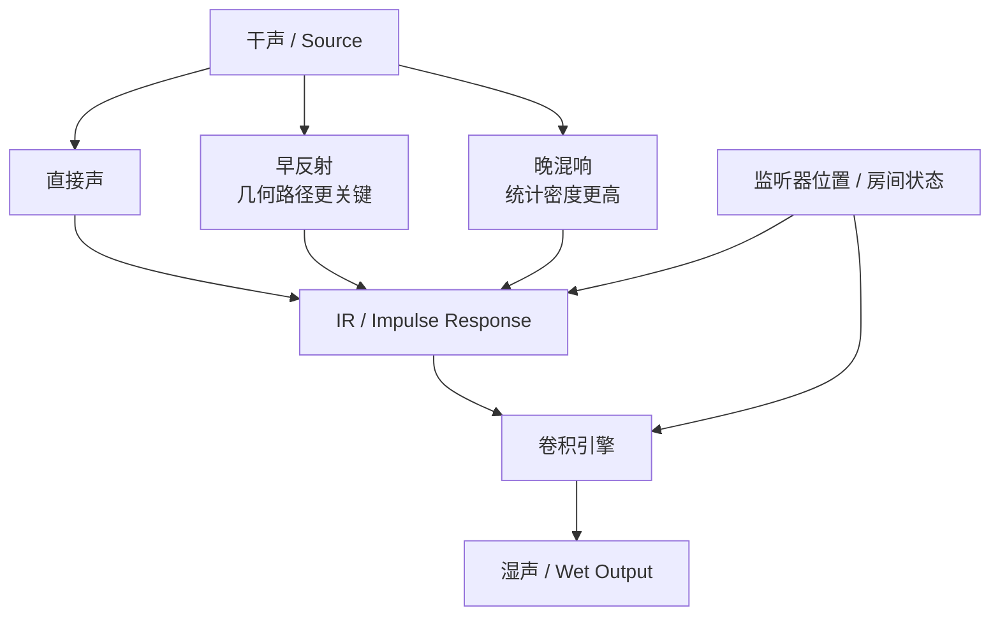
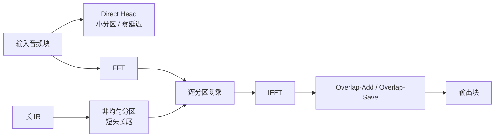

---
title: "游戏与引擎算法 36｜卷积混响：Impulse Response 与房间声学"
slug: "algo-36-convolution-reverb"
date: "2026-04-18"
description: "从 Impulse Response、FFT、overlap-add / overlap-save、分区卷积和零延迟分区讲清卷积混响如何落进实时游戏引擎。"
tags:
  - "音频"
  - "混响"
  - "卷积"
  - "Impulse Response"
  - "FFT"
  - "房间声学"
  - "实时音频"
  - "Unity"
  - "Wwise"
series: "游戏与引擎算法"
weight: 1836
---

**卷积混响的本质，是把“空间如何改写声音”压成一条 Impulse Response（IR），再把这条空间指纹用卷积施加到实时音频上。**

> 读这篇之前：建议先看 [游戏与引擎算法 41｜浮点精度与数值稳定性]()、[游戏与引擎算法 43｜SIMD 数学：Vector4 / Matrix4 向量化]() 和 [游戏与引擎算法 39｜坐标空间变换全景]()。

## 问题动机

游戏里最难做的音频之一，不是“声音响不响”，而是“这个声音到底像不像在这个空间里发生”。

参数化混响可以快速给你一个“有房间感”的结果，但它通常更像乐器上的效果器。你能调预延迟、扩散、阻尼、尾音长度，却很难精确复现某个仓库、走廊、洞穴、浴室、音乐厅，甚至一堵墙后面的那种方向性差异。

卷积混响的价值就在这里：它不是凭空捏一个“听起来像”的尾巴，而是把真实空间测出来或烘出来的 IR 直接作用到信号上。这样一来，早反射、晚混响、频率衰减、房间材料带来的色彩变化，都可以被同一条核函数统一描述。

这在以下场景尤其重要：

- VR / XR 的沉浸式空间音频。
- 影视级过场、叙事场景和写实室内环境。
- 需要“房间就是玩法”的关卡，比如狭窄通道、巨型大厅、地下设施。
- 需要把某个空间的声学特征做成可复用资产的音频管线。

真正的难点不在数学，而在工程边界：IR 可以很长，实时音频缓冲却很短；空间可以动态变化，IR 却天然是静态的；真实房间里的早反射很稀疏，晚混响却很密集，最划算的算法并不总是同一种。

## 历史背景

卷积混响站在两条历史线上：一条来自房间声学，一条来自数字信号处理。

早期人工混响主要靠弹簧、板式混响和 Schroeder / Moorer 一类算法型结构来模拟空间感。那个时代的硬件内存和 CPU 都不够，把整条房间响应直接卷起来太贵，所以人们先学会了“像混响”，再慢慢追求“就是这个房间”。FFT 和快速卷积成熟之后，IR 才真正进入可实时化的工程阶段。到今天，游戏引擎、DAW、浏览器和空间音频 SDK 都已经把卷积混响当成标准工具，而不是研究玩具。

工程侧的演化也很清楚：最早是单条房间 IR 的离线效果，后来变成分区卷积，再后来变成零延迟分区卷积、混合混响和空间探针驱动的烘焙系统。Steam Audio、Wwise、JUCE、Resonance Audio 和 Web Audio API 都体现了同一个趋势：不要再把“房间”只当一个效果参数，而要把它当成可 bake、可流式加载、可与监听器位置联动的资产。

## 数学基础

### 1. 卷积就是线性时不变系统的输出

如果把房间看作一个线性时不变系统（LTI），输入音频为 `x[n]`，Impulse Response 为 `h[n]`，输出就是：

$$
y[n] = (x * h)[n] = \sum_{k=0}^{L-1} x[n-k] h[k]
$$

这条公式很朴素，但它把“空间”变成了一个 FIR 滤波器。只要 IR 足够长，它就能把直接声、早反射、晚混响都编码进去。

### 2. 频域里，卷积会变成乘法

卷积定理是快速卷积的入口：

$$
Y(\omega) = X(\omega) H(\omega)
$$

也就是说，时域里做一长串乘加，到了频域只剩逐点相乘。真正的代价转移到了 FFT / IFFT，而不是每个输出采样都去扫完整个 IR。

### 3. 房间 IR 不是“一个尾巴”，而是三段结构

一个真实房间的 IR 通常可以粗分成三段：

$$
h(t) = h_{\text{direct}}(t) + h_{\text{early}}(t) + h_{\text{late}}(t)
$$

- `direct` 是直达声。
- `early` 是几十毫秒内的稀疏反射，决定定位感、空间边界和材质感。
- `late` 是更密集的尾音，决定房间大小、扩散度和整体衰减曲线。

这也是为什么很多工业系统把早反射和晚混响拆开：前者更像几何问题，后者更像统计问题。

### 4. 房间声学里常见的量级估算

在漫反射近似下，Sabine 公式常被用作一阶估算：

$$
T_{60} \approx 0.161 \frac{V}{A}
$$

其中 `V` 是房间体积，`A` 是等效吸声面积。它不是 IR 的替代品，只是给你一个“房间大概会响多久”的量级参考。卷积混响真正要做的，是把这件事从估算变成具体采样。

### 5. 多通道卷积是矩阵形式

在空间音频里，IR 往往不是单声道，而是多输入多输出：

$$
y_o[n] = \sum_i (x_i * h_{o,i})[n]
$$

Steam Audio 这类系统会把 IR 放进 Ambisonics 或多通道结构里，目的就是保留方向差异，而不是把所有空间信息压扁成一个立体声尾巴。

## 结构图 / 流程图





## 算法推导

### 1. 直接卷积为什么不适合实时引擎

假设 IR 长度是 `L`，每个输出采样都要做 `L` 次乘加。若 `L = 96,000`，这对应 48 kHz 下 2 秒的房间尾音，那么单个输出采样就要做约 9.6 万次 MAC。对于每秒 48,000 个输出采样，这就是每声道数十亿级别的乘加，根本不适合普通游戏音频线程。

所以“直接做”从一开始就不是可行答案。卷积混响真正要解决的，是把算力从“每个采样扫完整个 IR”，转移到“每个 block 只做少量 FFT 和复乘”。

### 2. FFT 快速卷积把问题拆成两个 block

如果把输入分成固定长度的 block，记 block 长度为 `N`，那么我们可以：

1. 对输入块做 FFT。
2. 对 IR 也做 FFT。
3. 在频域逐点相乘。
4. 再做 IFFT 回到时域。

这时单个 block 的代价主要来自 FFT，而不是整条 IR 的直接扫表。

但是这样会立刻碰到一个现实问题：`x[n]` 是连续流，FFT 卷积又是按块做的。块与块之间的边界怎么办？这就是 overlap-add 和 overlap-save。

### 3. Overlap-Add 和 Overlap-Save 解决块边界

#### Overlap-Add

把每个输入块记为 `x_m[n]`，它和 IR 卷积后会得到一个比原块更长的输出 `y_m[n]`。由于相邻块的卷积尾巴会重叠，所以要把后一个块的起始部分加到前一个块的尾部，这就是 overlap-add：

$$
y[n] = \sum_m z_m[n - mN]
$$

其中 `z_m` 是第 `m` 个块的卷积结果。

它的优点是直观，容易写，适合讲思路。

#### Overlap-Save

Overlap-save 的思路相反：先把前一个块的尾部保留下来，再把新的输入拼进去做 FFT。卷积结果里前面一段是循环卷积污染出来的无效区，直接丢掉，只保留中间真正有效的那一段。

如果 FFT 长度为 `M`，每次只输入 `N` 个新样本，那么前面的 `M-N` 个样本是重叠历史，后面的 `N` 个样本才是有效输出：

$$
\text{valid} = y[M-N : M-1]
$$

Overlap-save 的优点是更适合流式处理，历史缓存也更自然。实时引擎里很多块式卷积实现都会偏向这条路线。

### 4. 分区卷积才是长 IR 的工程答案

如果 IR 很长，单纯的 OLA / OLS 还是太贵，因为每个 block 仍然要处理整条 IR。于是就要把 IR 拆成多个 partition：

$$
h[n] = \sum_{p=0}^{P-1} h_p[n - pN]
$$

这里 `N` 是分区长度。这样做的意义很直接：

- 近处的头部，决定瞬态和定位感，优先算。
- 远处的尾巴，影响更平滑，可以晚一点算。
- 头尾可以用不同分区长度，形成非均匀分区。

### 5. 零延迟分区为什么重要

纯 block 卷积天然会引入至少一个 block 的算法延迟。对音频而言，128 或 256 采样的延迟已经能被感知：

- 128 samples @ 48 kHz ≈ 2.67 ms
- 256 samples @ 48 kHz ≈ 5.33 ms

卷积混响通常不能让主声音“等尾巴先算完再出声”。所以工业实现常把最前面的几十或上百个 taps 单独拿出来，用直接 FIR 或超小分区实时处理，让第一拍几乎没有额外等待，这就是零延迟分区的意义。

### 6. 早反射和晚混响最好不要用同一条算力预算

早反射的稀疏性很强，往往只需要较少的反射路径或较短的 IR 头部。晚混响却更长、更密、更平滑，适合更大 block 或更粗粒度的分区。把二者拆开，不只是省 CPU，也更符合听觉心理学：人耳更敏感地抓早反射来判断空间边界，而晚混响更像“空间氛围”。

## 算法实现

下面这段代码是 C# 风格的高质量伪代码，重点放在实时引擎的边界和数据流，而不是把 FFT 细节写成教学玩具。生产实现里，`IFftPlan` 可以接 FFTW、KissFFT、JUCE FFT、Burst 版 FFT，或者引擎自带的向量化实现。

```csharp
using System;
using System.Numerics;

public interface IFftPlan
{
    Complex[] Forward(ReadOnlySpan<float> timeDomain);
    float[] Inverse(ReadOnlySpan<Complex> frequencyDomain);
}

public sealed class ZeroLatencyPartitionedConvolutionReverb
{
    private readonly int _blockSize;
    private readonly int _fftSize;
    private readonly float[] _headTaps;
    private readonly Complex[][] _tailPartitions;
    private readonly IFftPlan _fft;

    private readonly float[] _history;
    private readonly float[] _outputDelay;
    private int _historyWrite;

    public ZeroLatencyPartitionedConvolutionReverb(
        ReadOnlySpan<float> impulseResponse,
        int blockSize,
        int headTapCount,
        IFftPlan fftPlan,
        bool normalize = false)
    {
        if (blockSize <= 0 || (blockSize & (blockSize - 1)) != 0)
            throw new ArgumentOutOfRangeException(nameof(blockSize), "blockSize should be a power of two.");
        if (headTapCount < 0)
            throw new ArgumentOutOfRangeException(nameof(headTapCount));
        if (fftPlan is null)
            throw new ArgumentNullException(nameof(fftPlan));

        _blockSize = blockSize;
        _fftSize = blockSize * 2;
        _fft = fftPlan;

        var ir = impulseResponse.ToArray();
        if (normalize)
        {
            NormalizeInPlace(ir);
        }

        var headLength = Math.Min(headTapCount, ir.Length);
        _headTaps = ir[..headLength].ToArray();
        var tail = ir[headLength..];

        _tailPartitions = BuildTailPartitions(tail, _blockSize, _fftSize, _fft);
        _history = new float[_blockSize];
        _outputDelay = new float[_blockSize * (_tailPartitions.Length + 2)];
    }

    public void ProcessBlock(ReadOnlySpan<float> input, Span<float> output)
    {
        if (input.Length != _blockSize || output.Length != _blockSize)
            throw new ArgumentException("input/output block size mismatch.");

        output.Clear();

        // 1) 零延迟头部：直接 FIR，保证首拍马上出声。
        ConvolveHead(input, output);

        // 2) 余下尾部：分区卷积。
        if (_tailPartitions.Length > 0)
        {
            var window = BuildOverlapSaveWindow(input);
            var xSpectrum = _fft.Forward(window);

            for (int p = 0; p < _tailPartitions.Length; ++p)
            {
                var ySpectrum = Multiply(xSpectrum, _tailPartitions[p]);
                var yTime = _fft.Inverse(ySpectrum);
                AccumulateValidHalf(yTime, p * _blockSize);
            }

            PullFromOutputDelay(output);
        }

        PushHistory(input);
    }

    private void ConvolveHead(ReadOnlySpan<float> input, Span<float> output)
    {
        for (int n = 0; n < input.Length; ++n)
        {
            double acc = 0.0;
            int tapCount = Math.Min(_headTaps.Length, n + 1);
            for (int k = 0; k < tapCount; ++k)
            {
                acc += input[n - k] * _headTaps[k];
            }
            output[n] += (float)acc;
        }
    }

    private float[] BuildOverlapSaveWindow(ReadOnlySpan<float> input)
    {
        var window = new float[_fftSize];
        _history.AsSpan().CopyTo(window);
        input.CopyTo(window.AsSpan(_blockSize));
        return window;
    }

    private void PushHistory(ReadOnlySpan<float> input)
    {
        input.CopyTo(_history);
        _historyWrite = (_historyWrite + 1) % _blockSize;
    }

    private void AccumulateValidHalf(float[] timeDomain, int partitionOffset)
    {
        // 只保留 IFFT 的有效半区，前半段是 overlap-save 污染区。
        int validStart = _blockSize;
        int validLength = _blockSize;

        for (int i = 0; i < validLength; ++i)
        {
            int dst = partitionOffset + i;
            if (dst < _outputDelay.Length)
            {
                _outputDelay[dst] += timeDomain[validStart + i];
            }
        }
    }

    private void PullFromOutputDelay(Span<float> output)
    {
        for (int i = 0; i < output.Length; ++i)
        {
            output[i] += _outputDelay[i];
        }

        Array.Copy(_outputDelay, output.Length, _outputDelay, 0, _outputDelay.Length - output.Length);
        Array.Clear(_outputDelay, _outputDelay.Length - output.Length, output.Length);
    }

    private static Complex[] Multiply(ReadOnlySpan<Complex> a, ReadOnlySpan<Complex> b)
    {
        var result = new Complex[a.Length];
        for (int i = 0; i < a.Length; ++i)
        {
            result[i] = a[i] * b[i];
        }
        return result;
    }

    private static Complex[][] BuildTailPartitions(ReadOnlySpan<float> tail, int blockSize, int fftSize, IFftPlan fft)
    {
        if (tail.IsEmpty)
            return Array.Empty<Complex[]>();

        int partitionCount = (tail.Length + blockSize - 1) / blockSize;
        var partitions = new Complex[partitionCount][];

        for (int p = 0; p < partitionCount; ++p)
        {
            var buffer = new float[fftSize];
            int copyCount = Math.Min(blockSize, tail.Length - p * blockSize);
            tail.Slice(p * blockSize, copyCount).CopyTo(buffer);
            partitions[p] = fft.Forward(buffer);
        }

        return partitions;
    }

    private static void NormalizeInPlace(float[] ir)
    {
        double energy = 0.0;
        for (int i = 0; i < ir.Length; ++i)
        {
            energy += ir[i] * ir[i];
        }
        if (energy <= 0.0)
            return;

        float gain = (float)(1.0 / Math.Sqrt(energy));
        for (int i = 0; i < ir.Length; ++i)
        {
            ir[i] *= gain;
        }
    }
}
```

这段伪代码刻意强调了三件事：

- 先给直达声和头部反射“零延迟”通道。
- 尾部用分区卷积，避免整条 IR 绑死每个音频块。
- IR 的加载、归一化、分区预计算都应该在音频线程之外完成。

真正的生产实现还会继续做这些事：

- 预分配 FFT 缓冲，避免 process 回调内分配内存。
- IR 热切换时双缓冲并交叉淡入，避免 zipper noise。
- 多声道 / Ambisonics 采用矩阵卷积，而不是只写单声道。
- 使用 SIMD 或 GPU FFT 时，把 `Complex` 结构替换成 SoA 布局，减少缓存失配。

## 复杂度分析

### 1. 直接时域卷积

- 时间复杂度：`O(L)` / 输出采样。
- 空间复杂度：`O(L)`。

对于长 IR，这个成本通常不可接受。

### 2. OLA / OLS 快速卷积

- 每个 block 一次 FFT 和一次 IFFT。
- 时间复杂度大致为 `O(M log M)` / block，外加频域逐点乘法。
- 空间复杂度为 `O(M)`。

其中 `M` 是 FFT 长度。`M` 越大，单次 FFT 越贵，但 block 越少；`M` 越小，延迟越低，但单位时间的调度开销越高。

### 3. 分区卷积

- 时间复杂度取决于 partition 数量、partition 长度和频域调度方式。
- 空间复杂度通常为 `O(P·M)`，其中 `P` 是分区数。

非均匀分区能把 CPU 预算更多地放在“人耳更敏感”的 IR 头部，尾巴则用更粗的分区处理。对于长尾房间，这是最常见的工程折中。

## 变体与优化

- **零延迟分区**：把头部 taps 用直接 FIR 或超小分区单独处理，首拍不等 block。
- **非均匀分区**：头部短、尾部长。早反射的时间分辨率高，尾音的更新频率低。
- **Frequency-Domain Delay Line（FDL）**：把历史输入的频谱保留下来，减少重复 FFT 工作。
- **多通道矩阵卷积**：适合 Ambisonics、stereo IR、5.1 / 7.1 房间响应。
- **IR 预处理**：去 DC、裁静音头、截断尾巴、分频段压缩低能量部分。
- **IR 热切换交叉淡入**：改变房间参数时，避免切换瞬间的跳变和毛刺。
- **SIMD / Burst / GPU FFT**：把复数乘法和窗口叠加向量化，省掉大量标量循环。

## 对比其他算法

| 算法 | 优点 | 缺点 | 适合场景 |
|---|---|---|---|
| 参数化 / 算法型混响（Schroeder、Moorer、FDN） | CPU 低、参数易调、空间感稳定 | 不像某个真实房间，材质和方向性不够真 | 大量同时发声、风格化游戏、低预算平台 |
| 直接 FIR 卷积 | 结构最直接、声音最贴近 IR | 长 IR 代价爆炸，实时性差 | 很短 IR、离线效果、音频工具链验证 |
| 分区卷积 / 零延迟卷积 | 兼顾真实度与实时性，可扩展到长 IR | 实现复杂，要处理缓存、延迟和热切换 | 游戏引擎、VR、空间音频、写实场景 |
| FDN 混响 | 延迟低、尾巴平滑、可控性强 | 更像“高质量合成混响”而不是特定空间 | 需要稳定尾音和低 CPU 的场景 |

卷积混响和 FDN 不是谁替代谁，而是各自擅长不同的问题：卷积混响擅长“复现空间”，FDN 擅长“制造空间感”。如果你只想让角色站进一个像样的大厅，FDN 可能更划算；如果你要让它听起来像“这个大厅本身”，卷积更合适。

## 批判性讨论

卷积混响的最大优点，是忠实；它最大的缺点，也是忠实。

它忠实地记录了一个静态空间的线性响应，所以一旦场景开始变化，忠实反而成了负担：门开了、窗户开了、人群进来了、玩家穿墙走了、监听器移动了，IR 立刻不再准确。你可以重新 bake，也可以做多点插值，但代价都会迅速上升。

另一个问题是“声学正确”不等于“游戏里最好听”。过于真实的房间会把对白、脚步和战斗提示淹掉。对游戏设计来说，混响不是炫技项，而是信息层的一部分。太长的尾音会吃掉节奏，太真实的反射会干扰定位，最终让玩家觉得“空间很对，但不好玩”。

因此，工业级方案几乎都不是纯卷积：

- 近处用几何或探针驱动的早反射。
- 中间用卷积或混合混响。
- 尾巴用参数化或 FDN 收束。

这不是妥协，而是把不同听觉阶段交给不同预算。

## 跨学科视角

卷积混响是一个典型的跨学科交汇点：

- **信号处理**：卷积定理、FIR、FFT、窗函数、谱泄漏。
- **房间声学**：RT60、吸声系数、漫反射、镜像声源法。
- **渲染管线类比**：IR bake 很像反射探针或光照探针，只不过这里探针烘的是声音而不是光。
- **数值计算**：分区策略、缓存局部性、向量化复乘、浮点归一化误差。
- **分布式系统思维**：IR 预烘和运行时切换本质上像资产版本管理，不能在音频回调里随意改全局状态。

从工程直觉上说，卷积混响是“把物理世界离线压缩成一个可实时播放的核”。这和图形里的 light probe / reflection probe 很像：你先付一次昂贵的 bake 成本，再在运行时换取稳定的实时性能。

## 真实案例

- **Steam Audio**：官方文档把 impulse response 明确做成单独对象，且能按 Ambisonics 存储；Unity 里的 Reverb Data Point 既能存 energy field，也能存完整 IR，并且强调采样率要和运行时音频引擎匹配。[1][2][3]
- **JUCE `dsp::Convolution`**：官方文档直接写明它做的是 stereo partitioned convolution，默认是 zero latency 的 uniform partitioned 算法；IR 很长时可以切到 fixed-latency 或 non-uniform partitioned 版本。[4]
- **Wwise AK Convolution Reverb**：官方帮助页说明它用预录 IR 来模拟真实空间，支持最多到 5.1 的声道配置、可导入 96kHz 以内的 PCM IR，并带有 20 个 IR 和 55 个工厂预设。[5][6]
- **Web Audio `ConvolverNode`**：W3C 的 Web Audio API 规范把 `ConvolverNode` 定义成线性卷积节点，并明确约束了 `buffer`、声道组合与实时图中的行为，这比二手接口摘要更适合作为规范级出处。[7][8]
- **Resonance Audio**：Unity API 里的 Reverb Probe 通过空间中的采样点、应用区域和几何交互来计算预烘混响，说明“probe 驱动的房间声学”已经是成熟的空间音频路线。[9]

## 量化数据

- 2 秒 IR 在 48 kHz 下就是 `96,000` 个 taps。若用直接卷积，单个输出采样就要约 `96,000` 次乘加，成本通常不可接受。
- `128` 采样块在 `48 kHz` 下约 `2.67 ms`，`256` 采样块约 `5.33 ms`。这就是为什么零延迟分区不能省：纯块级处理的首拍延迟会被用户直接听出来。
- JUCE 文档指出，当 IR 长度达到 `64` samples 或更大时，频域卷积通常比时域 FIR 更高效。[4]
- Wwise 文档给出的硬指标包括：最多 `5.1` 声道、`20` 个 impulse responses、`55` 个 factory presets、支持到 `96 kHz` 采样率。[5][6]
- Steam Audio 的 Reverb Data Point 会同时存 parametric 和 convolution reverb；`duration`、`order`、`sampling rate` 都会线性拉高存储和烘焙成本。[2][3]

这些数字背后的结论很简单：卷积混响不是“效果器”的小问题，而是一个和 IR 长度、采样率、声道数、block size 强耦合的系统工程问题。

## 常见坑

- **IR 采样率和运行时不一致**：Web Audio 和 Wwise 都明确要求 IR 采样率和运行时音频引擎匹配或按约定重采样。错了要么报错，要么音高和时长都跑偏。
- **把长 IR 直接塞进音频线程**：你会得到卡顿、XRUN 和不稳定的帧时间。FFT 计划、分区谱和缓冲区都应该在后台准备好。
- **只顾晚混响，不管早反射**：定位会糊，空间边界会散，听起来像“有尾巴但没有房间”。
- **归一化不受控**：IR 的能量一旦自动放大，wet mix 很容易压过 dry，最后对白和脚步都被抹平。
- **切 IR 不做交叉淡入**：瞬间更换卷积核会产生明显毛刺，尤其在音轨持续播放时更明显。

## 何时用 / 何时不用

### 适合用

- 你想复现某个具体空间，而不是泛泛的“室内感”。
- 场景比较静态，或者可以接受按区域 bake / 切换。
- 你做的是 VR、写实过场、空间音频、建筑可视化、沉浸式展览。
- 你愿意为更真实的空间感付出更多 CPU、内存和烘焙时间。

### 不适合用

- 大量动态门窗、可破坏墙体、频繁拓扑变化。
- 预算极紧，需要同时跑很多声源。
- 你只想要风格化空间感，而不关心真实房间指纹。
- 音频线程极端敏感，不能接受复杂的 block 管线和 IR 热切换。

## 相关算法

- [游戏与引擎算法 35｜HRTF：3D 空间音频]()
- [游戏与引擎算法 37｜多普勒效应与距离衰减：动态音源算法]()
- [数据结构 18｜环形缓冲区与双缓冲]()
- [浮点精度与数值稳定性]()
- [SIMD 数学：Vector4 / Matrix4 向量化]()
- [坐标空间变换全景]()

## 小结

卷积混响不是“把尾巴加长一点”的效果器问题，而是一个从房间声学、信号处理和实时系统共同决定的工程问题。

如果你只需要氛围，算法型混响更便宜。如果你要的是“这个空间本身的声音”，卷积混响才是正解。真正的工业实现不会把所有预算都砸在一条长 IR 上，而是把直达声、早反射和晚混响拆开，再用分区卷积、零延迟头部和多通道矩阵把它们重新拼回去。

## 参考资料

[1] Steam Audio C API: Impulse Response, https://valvesoftware.github.io/steam-audio/doc/capi/impulse-response.html
[2] Steam Audio Unity Integration: Reverb Data Point, https://valvesoftware.github.io/steam-audio/doc/unity/reverbdatapoint.html
[3] Steam Audio Unity Integration: Reverb, https://valvesoftware.github.io/steam-audio/doc/unity/reverb.html
[4] JUCE: `juce::dsp::Convolution` Class Reference, https://docs.juce.com/master/classjuce_1_1dsp_1_1Convolution.html
[5] Audiokinetic: AK Convolution Reverb, https://www.audiokinetic.com/library/2025.1.3_9039/?id=wwise_convolution_reverb_plug_in&source=Help
[6] Audiokinetic: Convolution Reverb optimizations, https://www.audiokinetic.com/library/2024.1.5_8803/?id=whatsnew_2010_3_new_features.html&source=SDK
[7] W3C, Web Audio API 1.1 - ConvolverNode. https://www.w3.org/TR/webaudio-1.1/
[8] W3C, Web Audio API 1.1 - BaseAudioContext.createConvolver / ConvolverNode buffer semantics. https://www.w3.org/TR/webaudio-1.1/
[9] Resonance Audio Unity SDK API Reference: ResonanceAudioReverbProbe, https://resonance-audio.github.io/resonance-audio/reference/unity/class/resonance-audio-reverb-probe.html