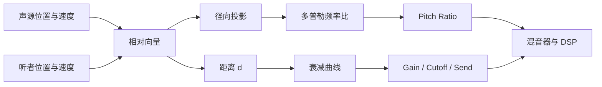
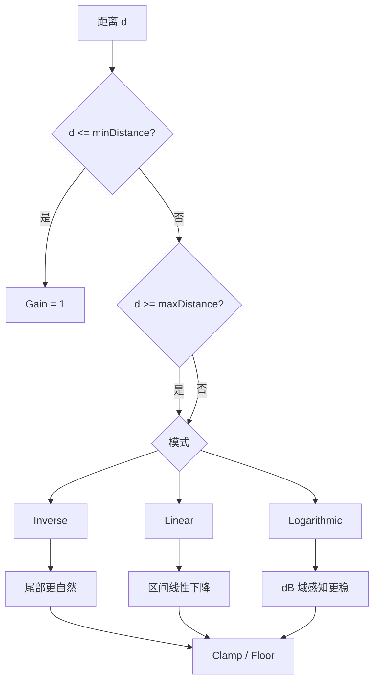

---
title: "游戏与引擎算法 37｜多普勒效应与距离衰减：动态音源算法"
slug: "algo-37-doppler-distance-attenuation"
date: "2026-04-18"
description: "把声源和听者的相对速度、相对距离与设计曲线，稳定映射为游戏引擎里的 pitch 和 volume。"
tags:
  - "Audio"
  - "3D Audio"
  - "Doppler"
  - "Attenuation"
  - "Game Engine"
series: "游戏与引擎算法"
weight: 1837
---

> **一句话本质定义**：多普勒效应把声源和听者的相对径向速度映射成频率比，距离衰减把空间距离映射成响度曲线；游戏引擎要做的，是把这两种物理量变成稳定、可调、不会抖的运行时参数。

## 问题动机

动态音源是游戏音频里最容易“露馅”的部分。警笛、引擎、枪声、飞弹、脚步、火车、直升机，这些声音一旦移动，玩家就会同时听到两件事：音高在变化，响度也在变化。

如果只改音量，不改频率，飞车从耳边掠过时会像贴图在滑动；如果只改 pitch，不改衰减，音源离得再远也像贴在脸上。

更麻烦的是，游戏里的“速度”不是单一来源。声源可能来自刚体、动画、根运动、路径跟随或网络插值；听者也可能不是静态摄像机，而是带惯性、带摇臂、带车内镜头的复杂控制器。

所以这类算法的目标不是“物理最精确”，而是“在每帧更新、网络抖动、镜头切换、性能预算有限的条件下，仍然给出可信、连续、可调的声音表现”。

## 历史背景

多普勒效应由 Christian Doppler 在 1842 年提出，最初讨论的是波源与观察者的相对运动如何改变波的频率。19 世纪中期，Buys Ballot 用火车与号角做了经典验证，让“接近时音高升高、远离时音高降低”从物理假说变成可观察现象。  

游戏音频把这件事工程化得很晚。早期 3D 音频 API 只关心“从哪儿来”“离多远”“朝哪边响”，多普勒只是可选修饰项。到了 OpenAL、Unity、Unreal、Wwise、FMOD 这一代，音源位置、速度、衰减曲线、listener transform 才真正进入统一的实时管线。  

今天的问题不再是“能不能做出来”，而是“在 60 FPS、120 FPS、变速镜头、低延迟混音、可设计曲线和跨平台 SDK 之间，怎样把这件事做稳”。这也是本文的重点。

## 数学基础

### 1. 多普勒效应只看径向分量

设声源位置为 $x_s$，听者位置为 $x_l$，对应速度分别为 $v_s$ 和 $v_l$。令

$$
u = \frac{x_l - x_s}{\|x_l - x_s\|}
$$

其中 $u$ 是从声源指向听者的单位向量。真正影响频率变化的不是三维速度大小，而是它们在视线方向上的投影，也就是径向速度：

$$
v_s^{\parallel} = v_s \cdot u,\qquad
v_l^{\parallel} = v_l \cdot (-u)
$$

这里的约定是：$v_s^{\parallel} > 0$ 表示声源朝听者移动，$v_l^{\parallel} > 0$ 表示听者朝声源移动。

在均匀介质中，多普勒频率比可以写成：

$$
f' = f \cdot \frac{c + D v_l^{\parallel}}{c - D v_s^{\parallel}}
$$

其中 $c$ 是声速，$D$ 是 Doppler factor，$f$ 是原始频率，$f'$ 是播放频率。  

如果用摄氏温度近似空气中的声速，可以取：

$$
c \approx 331.3 + 0.606 T_C \; \text{m/s}
$$

在 $20^\circ$C 左右，$c \approx 343.2$ m/s。这个数字后面会直接变成量化分析里的基准。

### 2. 距离衰减不是一个公式，而是一组曲线

游戏引擎通常把距离 $d$ 映射为增益 $g(d)$。常见做法不是“真实空气传播”，而是“可控的感知曲线”。

最常见的三类模型是：

$$
g_{\text{inv}}(d) = \frac{d_0}{d_0 + k(d-d_0)}
$$

$$
g_{\text{lin}}(d) = \text{clamp}\left(1 - \frac{d-d_0}{d_1-d_0},\,0,\,1\right)
$$

$$
g_{\text{log}}(d) = 10^{\frac{A(d)}{20}}, \quad A(d) \in [0, -A_{\max}]
$$

这里 $d_0$ 是最小距离，$d_1$ 是最大距离，$k$ 是衰减斜率，$A(d)$ 是 dB 域的衰减量。

从工程上看，`inverse` 更像“近大远小但不突然断”，`linear` 更像“设计师能直接画出来”，`logarithmic` 更接近人耳对响度的非线性感知。

### 3. pitch shift 近似其实是重采样

当 $f'/f$ 不大时，pitch shift 可以近似看作播放速率变化。也就是说，音频引擎把“更高的频率”转换成“更快的读样本速度”，或者在 DSP 层做更高质量的时间伸缩。

对游戏来说，小幅多普勒通常用重采样就够了；大幅 pitch 变化则更容易暴露插值误差、别名和 formant 失真。  

这也是为什么本文会强调“多普勒不是单纯改一个 pitch 参数”，而是“先算正确的速度比，再交给混音器或采样器实现”。

## 算法推导

### 第一步：把世界空间速度投影到声线方向

三维速度里，只有沿声源与听者连线的分量会改变传播时间差。横向绕着你跑的无人机，更多影响方位感；朝你飞来的无人机，才会带来明显 pitch 上升。

所以算法先做两件事：

1. 算出声源到听者的方向向量。
2. 分别把 source velocity 和 listener velocity 投影到这条轴上。

如果两者距离非常近，方向向量会变得不稳定。此时直接用当前帧几何方向，容易在穿越听者位置时产生抖动和符号翻转。更稳的做法是：

1. 距离小于阈值时冻结多普勒方向，或者直接把 Doppler factor 衰减到 0。
2. 用平滑后的速度，而不是 raw transform delta。

### 第二步：把径向速度变成频率比

经典公式里，分子表示听者朝声源移动时接收到的波前更密，分母表示声源朝听者移动时波前更密。  

工程上必须处理三类边界：

1. 分母接近 0，pitch 会爆炸。
2. 速度过大，音高会高得不像自然声源。
3. 网络插值或镜头切换会引入瞬时速度尖峰。

因此，真实引擎几乎都会做夹取：

$$
f' = f \cdot \text{clamp}\left(\frac{c + D v_l^{\parallel}}{\max(\varepsilon, c - D v_s^{\parallel})},\,r_{\min},\,r_{\max}\right)
$$

其中 $\varepsilon$ 是数值安全阈值，$r_{\min}$ 和 $r_{\max}$ 是表现层限幅。

### 第三步：把距离映射成可设计的衰减

距离衰减更像“内容制作曲线”，不是硬物理。  

如果你要的是模拟器，`inverse` 比较自然；如果你要的是可读性，`linear` 最容易调；如果你要的是听觉稳定性，`logarithmic` 或 dB 域曲线更好。

这里最关键的是 clamp 策略：

1. `d < minDistance` 时直接锁到 1。
2. `d > maxDistance` 时按模式决定是归零还是落到地板值。
3. 临界区间用 `smoothstep` 做软过渡，避免音量边界跳变。

### 第四步：把物理量和表现层拆开

生产系统里通常会把结果拆成三层：

1. 物理层：距离、径向速度、声速。
2. 表现层：pitch ratio、gain、cutoff、send。
3. 内容层：不同武器、车辆、环境各自的曲线和上限。

这样做的好处是，程序可以统一计算，音频设计师只改曲线，不必碰物理公式。  

## Mermaid 图示





## 完整 C# 实现

下面的实现刻意把“速度计算”“频率比”“衰减曲线”“数值保护”拆开。真实项目里，`SpatialVoice` 往往来自动画系统、物理系统或网络同步层；`SpatialAudioMath` 只负责把这些状态变成可喂给音频引擎的参数。

```csharp
using System;
using System.Numerics;

public enum RolloffMode
{
    Inverse,
    Linear,
    Logarithmic
}

public readonly struct SpatialVoice
{
    public SpatialVoice(Vector3 position, Vector3 velocity)
    {
        Position = position;
        Velocity = velocity;
    }

    public Vector3 Position { get; }
    public Vector3 Velocity { get; }
}

public sealed class SpatialAudioSettings
{
    public float SpeedOfSound { get; init; } = 343.2f;
    public float DopplerFactor { get; init; } = 1.0f;
    public float MinDistance { get; init; } = 1.0f;
    public float MaxDistance { get; init; } = 50.0f;
    public float MinGain { get; init; } = 0.0f;
    public float MinPitchRatio { get; init; } = 0.25f;
    public float MaxPitchRatio { get; init; } = 4.0f;
    public float RolloffScale { get; init; } = 1.0f;
    public float LogRolloffDb { get; init; } = 60.0f;
    public float NearCutoffHz { get; init; } = 20000.0f;
    public float FarCutoffHz { get; init; } = 2500.0f;
    public float DistanceEpsilon { get; init; } = 0.01f;
    public bool SilenceBeyondMaxDistance { get; init; } = false;
    public RolloffMode RolloffMode { get; init; } = RolloffMode.Logarithmic;
}

public readonly struct SpatialAudioFrame
{
    public float Distance { get; init; }
    public float RadialSourceVelocity { get; init; }
    public float RadialListenerVelocity { get; init; }
    public float PitchRatio { get; init; }
    public float Gain { get; init; }
    public float LowPassCutoffHz { get; init; }
}

public static class SpatialAudioMath
{
    public static SpatialAudioFrame Evaluate(
        in SpatialVoice source,
        in SpatialVoice listener,
        in SpatialAudioSettings settings,
        Vector3 fallbackLineOfSight = default)
    {
        Vector3 delta = listener.Position - source.Position;
        float distance = delta.Length();

        Vector3 los = distance > settings.DistanceEpsilon
            ? delta / distance
            : (fallbackLineOfSight.LengthSquared() > 0f
                ? Vector3.Normalize(fallbackLineOfSight)
                : Vector3.UnitZ);

        // 距离过小时，径向速度的方向会不稳定；直接关闭多普勒更安全。
        float directionWeight = distance > settings.DistanceEpsilon ? 1f : 0f;

        float sourceRadial = Vector3.Dot(source.Velocity, los) * directionWeight;
        float listenerRadial = Vector3.Dot(listener.Velocity, -los) * directionWeight;

        float pitchRatio = ComputeDopplerPitchRatio(sourceRadial, listenerRadial, settings);
        float gain = ComputeDistanceGain(distance, settings);
        float cutoffHz = ComputeCutoffHz(distance, settings);

        return new SpatialAudioFrame
        {
            Distance = distance,
            RadialSourceVelocity = sourceRadial,
            RadialListenerVelocity = listenerRadial,
            PitchRatio = pitchRatio,
            Gain = gain,
            LowPassCutoffHz = cutoffHz
        };
    }

    private static float ComputeDopplerPitchRatio(
        float sourceRadialVelocity,
        float listenerRadialVelocity,
        SpatialAudioSettings settings)
    {
        float c = MathF.Max(settings.SpeedOfSound, 1f);
        float d = MathF.Max(settings.DopplerFactor, 0f);
        float eps = MathF.Max(settings.DistanceEpsilon, 0.0001f);

        float numerator = c + d * listenerRadialVelocity;
        float denominator = c - d * sourceRadialVelocity;

        // 避免穿越听者时分母变号，导致 pitch 反转或爆炸。
        numerator = Math.Clamp(numerator, eps, c * 8f);
        denominator = Math.Clamp(denominator, eps, c * 8f);

        float ratio = numerator / denominator;
        return Math.Clamp(ratio, settings.MinPitchRatio, settings.MaxPitchRatio);
    }

    private static float ComputeDistanceGain(float distance, SpatialAudioSettings settings)
    {
        float d0 = Math.Max(settings.MinDistance, 0.0001f);
        float d1 = Math.Max(settings.MaxDistance, d0 + 0.0001f);
        float d = Math.Max(distance, 0f);

        if (d <= d0)
            return 1f;

        if (d >= d1)
            return settings.SilenceBeyondMaxDistance ? 0f : Math.Clamp(settings.MinGain, 0f, 1f);

        float t = SmoothStep01((d - d0) / (d1 - d0));

        float gain = settings.RolloffMode switch
        {
            RolloffMode.Inverse =>
                d0 / (d0 + settings.RolloffScale * (d - d0)),

            RolloffMode.Linear =>
                1f - t,

            RolloffMode.Logarithmic =>
                DbToLinear(-settings.LogRolloffDb * t),

            _ => 1f - t
        };

        return Math.Clamp(gain, settings.MinGain, 1f);
    }

    private static float ComputeCutoffHz(float distance, SpatialAudioSettings settings)
    {
        float d0 = Math.Max(settings.MinDistance, 0.0001f);
        float d1 = Math.Max(settings.MaxDistance, d0 + 0.0001f);
        float t = SmoothStep01(Math.Clamp((distance - d0) / (d1 - d0), 0f, 1f));
        return Lerp(settings.NearCutoffHz, settings.FarCutoffHz, t);
    }

    public static Vector3 SmoothVelocity(Vector3 previous, Vector3 current, float deltaTime, float timeConstantSeconds)
    {
        if (timeConstantSeconds <= 0f || deltaTime <= 0f)
            return current;

        float alpha = 1f - MathF.Exp(-deltaTime / MathF.Max(timeConstantSeconds, 0.0001f));
        return Vector3.Lerp(previous, current, alpha);
    }

    private static float SmoothStep01(float t)
    {
        t = Math.Clamp(t, 0f, 1f);
        return t * t * (3f - 2f * t);
    }

    private static float DbToLinear(float db) => MathF.Pow(10f, db / 20f);

    private static float Lerp(float a, float b, float t) => a + (b - a) * t;
}
```

这段代码的重点不是“把所有音频细节塞进去”，而是把易错点前置：

1. 速度投影只看径向分量。
2. 距离在最小和最大边界上都做了 clamp。
3. 多普勒比值在进入 DSP 前先做了安全限幅。
4. 用 `SmoothVelocity` 给网络插值或抖动镜头留了缓冲口。

## 复杂度分析

这类算法的主成本是每帧更新每个活跃声音的参数。

- 时间复杂度：$O(N)$，$N$ 是当前需要更新的 3D 声源数。
- 空间复杂度：$O(1)$，如果只保存当前状态和少量历史；如果做 velocity smoothing，仍然是每源常数级。

如果引擎支持多听者，成本会变成 $O(NK)$，$K$ 是 listener 数。大多数单人游戏里 $K=1$，所以关键优化点不在算法阶数，而在“别让无效声源进入更新路径”。

## 变体与优化

### 1. 夸张版与写实版分离

警笛、赛车、飞弹适合更高的 `DopplerFactor`；环境音、脚步、UI 提示则应该缩小甚至禁用多普勒。  

把“真实物理”和“可听效果”拆成两个档位，比在所有声音上共用一个常数更稳。

### 2. 速度平滑比位置平滑更重要

很多抖动不是来自位置，而是来自网络插值或动画骨架。  

只对位置做平滑，pitch 仍可能抽动；对速度做一阶低通，通常更直接。

### 3. 用软夹取代硬切换

`minDistance` 和 `maxDistance` 的边界如果直接硬切，耳朵会听到“台阶”。  

更好的做法是在边界附近加 `smoothstep`、`soft knee` 或自定义过渡窗，让音量和 cutoff 变化连续。

### 4. 需要时把 pitch 和 timbre 分开

如果只是把播放速率提高，声音会同时变高和变短。对某些武器和引擎声这没问题，但对人声或乐器就会很假。  

这时要把 pitch shift 交给高质量时间伸缩算法，把 loudness 交给 attenuation 曲线。

### 5. 批处理与 SIMD

大量远场环境音可以在音频线程里批量计算，先做可见性/可听性筛选，再更新 pitch 和 gain。  

如果引擎里已经有 SIMD math 层，径向投影和距离计算也可以向量化，但这通常只是次要收益。

## 对比其他算法

| 算法 | 主要目标 | 输入 | 输出 | 优点 | 局限 |
|---|---|---|---|---|---|
| 多普勒 + 距离衰减 | 动态音源可信感 | 位置、速度、距离 | pitch、gain、cutoff | 直接对应“靠近/远离”的听感 | 只解决一部分空间音频问题 |
| HRTF 空间化 | 方位感与前后定位 | 听者朝向、耳廓滤波 | 双耳滤波结果 | 方向感强，适合 VR | 不解决速度导致的音高变化 |
| 距离低通 / 空气吸收 | 远近 timbre 变化 | 距离、障碍、介质 | cutoff、EQ、reverb send | 让远处声音更像“远处” | 不改变 pitch，不能替代多普勒 |
| 简单 pitch envelope | 设计性音高变化 | 距离或事件触发 | pitch | 实现最简单 | 不依赖相对速度，容易失真 |

## 批判性讨论

多普勒和距离衰减看起来“物理正确”，但游戏里常常不能照搬现实。

第一，真实世界里声音还受空气温湿度、障碍、反射、源方向性、材料吸收影响。只做距离和速度，最多只是“可信的第一层”。

第二，真实世界里多普勒效应很容易被设计师故意夸张。赛车游戏和街机射击里，适度夸张往往比物理精确更有表现力。

第三，距离衰减不该直接等同于响度。人耳对响度是对数感知，线性衰减经常会在远场显得“太快没声”或“太近太吵”。

第四，如果音源位置来自网络同步，抖动往往不是音频算法的问题，而是上游位置/速度估计的问题。此时应该先修同步，再谈音频曲线。

## 跨学科视角

### 物理

多普勒就是波动方程在移动边界下的频率重标定。声速不是常数魔法，而是介质参数的函数。  

游戏里把它简化成一个比例公式，是为了实时性，不是为了否认物理。

### 信号处理

把 pitch ratio 应用到音频流，本质上是在重采样。重采样越直接，越容易引入别名；重采样越平滑，越吃算力。  

所以很多实现会在“足够便宜”和“足够干净”之间选一个工程平衡点。

### 统计与控制

速度平滑本质上是低通滤波。  

如果你把 listener/source velocity 当成测量值，就会像控制系统里的噪声输入；如果不做滤波，pitch 和 gain 会跟着抖。

## 真实案例

### OpenAL / OpenAL Soft

OpenAL 1.1 规范直接给出了 Doppler factor、listener velocity、source velocity 和径向投影的关系。OpenAL Soft 作为软件实现，也明确支持 distance attenuation、doppler shift 和 directional emitters。  

这类系统的价值在于：它把“多普勒不是特效，而是 3D 音频 API 的基础能力”这件事讲得很清楚。

### Unity Audio

Unity 的 `AudioSource` 组件暴露了 `dopplerLevel`、`minDistance`、`maxDistance`、`rolloffMode`，而且内置了 logarithmic、linear 和 custom rolloff。  

这说明 Unity 的思路非常典型：pitch 与 attenuation 分开配置，速度与距离是独立参数，但最终会在同一个 AudioSource 上合流。

### Unreal Audio

Unreal 的 `Sound Attenuation` 文档把距离衰减、listener focus、distance filtering、reverb send 分开建模，`AttenuationDistanceScale` 还能单独缩放距离测量。  

这类设计的好处是，音频设计师可以不碰代码，就把一个“太近、太远、太硬”的声音调顺。

### Wwise

Wwise 的官方文档强调 attenuation 曲线由 emitter 与 listener 的距离、遮挡和衍射共同驱动；而 Wwise 的 Doppler 方案更多依赖游戏侧计算相对速度，再把结果喂给 RTPC。  

这和很多大项目的真实做法一致：物理量由程序算，听感曲线由音频设计控制。

### FMOD

FMOD 的官方 3D sounds 白皮书和 Core API 距离模型常量把 inverse、linear、linear squared 等 rolloff 模式明确拆开，说明它的主干能力仍然是 spatialization 和 distance attenuation；更细的 pitch / Doppler 表现通常还要靠游戏侧速度计算和事件参数层配合。[10][11]  

这恰好说明一个现实：把“多普勒”和“衰减”拆开，是工业音频管线的常态，不是偷懒。

## 量化数据

下面这些数值可以直接拿来做调试基线。

| 场景 | 参数 | 结果 | 解释 |
|---|---:|---:|---|
| 标准空气 | $c \approx 343.2$ m/s | 1 m 传播约 2.91 ms | 声音不是瞬时到达 |
| 小车经过 | $v = 30$ m/s，声源朝向听者 | $f'/f \approx 1.096$ | 约上升 1.55 个半音 |
| 高速目标 | $v = 100$ m/s，声源朝向听者 | $f'/f \approx 1.411$ | 约上升 6.27 个半音 |
| 距离 10 m | `inverse`，$d_0 = 1$ m | gain = 0.1 | 约 -20 dB |
| 线性衰减 | $1 \to 0$，区间 1 m 到 50 m | 斜率约 -0.0204 /m | 每米下降更可预测 |
| 60 dB log 衰减 | 远场 floor 60 dB | gain = 0.001 | 适合远场快速收敛 |

这组数据有两个结论很重要：

1. 多普勒的变化在中低速下并不夸张，所以很多游戏会故意加大 `dopplerFactor`。
2. 距离衰减如果在 dB 域里做，曲线会比线性振幅更贴近听感。

## 常见坑

- **只用位置差分当速度**：如果你从每帧位置直接算速度，镜头抖动、动画骨架、网络插值都会被放大成 pitch 抖动。正确做法是用稳定的物理速度，或者对测量速度做低通滤波。
- **把三维速度大小直接喂给多普勒公式**：横向绕圈也会让音高乱跳。正确做法是只用径向投影，侧向速度留给 panning。
- **距离一过阈值就硬切静音**：听起来像按钮而不是空间。正确做法是用 soft knee、smoothstep 或尾部 floor。
- **忽略 listener velocity**：摄像机开车、镜头摆动、VR 头动时，听者自己也在运动。只算 source velocity 会少掉一半效果。
- **把物理精确当成表现正确**：现实里 1:1 的多普勒常常不够“爽”。正确做法是把物理公式和内容曲线分层，让设计师调表现层。

## 何时用 / 何时不用

### 适合用

- 赛车、飞行、射击、追逐、警笛、火车、无人机、弹道飞行物。
- VR 和沉浸式第一人称游戏。
- 需要让玩家靠声音判断距离、速度和方向的系统。

### 不适合用

- UI 音、菜单音、战斗反馈音、绝大多数音乐。
- 速度来源本身不稳定、但音频必须稳定的远程同步场景。
- 已经经过手工设计 pitch 的拟音，如果再叠加强多普勒会过头。

## 相关算法

- [游戏与引擎算法 35｜HRTF：3D 空间音频]()
- [游戏与引擎算法 36｜卷积混响：Impulse Response 与房间声学]()
- [坐标空间变换全景]()
- [浮点精度与数值稳定性]()
- [SIMD 数学：Vector4 / Matrix4 向量化]()

## 小结

多普勒效应解决的是“声音为什么会变调”，距离衰减解决的是“声音为什么会变小”。真正的工程难点不在公式本身，而在把相对速度、径向速度、声速、距离曲线、listener/source velocity 和 clamp 策略放进一个不抖、不爆、不跳的实时系统里。

OpenAL 给出的是物理基础，Unity、Unreal、Wwise、FMOD 给出的是工业做法。游戏引擎要做的不是照抄其中任何一个，而是在“物理可信”和“表现可控”之间选出合适的折中。

## 参考资料

1. [OpenAL 1.1 Specification and Reference](https://www.openal.org/documentation/openal-1.1-specification.pdf)
2. [OpenAL Soft - Software 3D Audio](https://openal-soft.org/)
3. [Audio Source - Unity Manual](https://docs.unity3d.com/cn/2022.3/Manual/class-AudioSource.html)
4. [AudioSource - Unity Scripting API](https://docs.unity3d.com/kr/2022.3/ScriptReference/AudioSource.html)
5. [Sound Attenuation - Unreal Engine](https://dev.epicgames.com/documentation/en-us/unreal-engine/sound-attenuation?application_version=4.27)
6. [Audio Engine Overview in Unreal Engine](https://dev.epicgames.com/documentation/ja-jp/unreal-engine/audio-engine-overview-in-unreal-engine)
7. [Applying attenuation - Wwise](https://www.audiokinetic.com/en/library/edge/?id=applying_distance_based_attenuation&source=Help)
8. [Integrating Listeners - Wwise SDK](https://www.audiokinetic.com/library/edge/?id=soundengine_listeners.html&source=SDK)
9. [Creating a Doppler Effect with Wwise](https://www.audiokinetic.com/en/blog/create-a-doppler-effect-with-wwise/)
10. [3D Sounds - FMOD White Papers](https://www.fmod.com/docs/2.02/api/white-papers-3d-sounds.html)
11. [FMOD_3D_INVERSEROLLOFF and related distance models - FMOD Core API](https://www.fmod.com/docs/2.02/api/core-api-common.html#fmod_3d_inverserolloff)