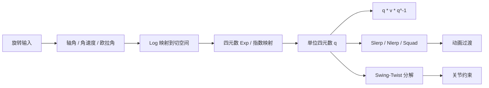
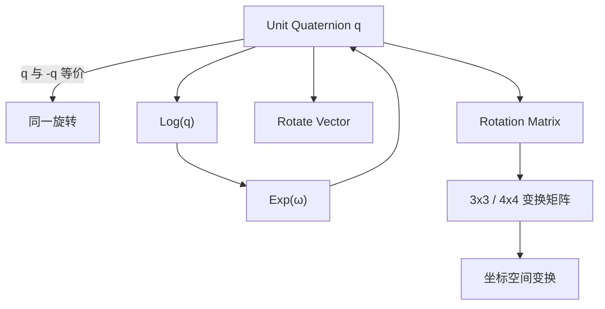

---
title: "游戏与引擎算法 38｜四元数完全指南：旋转表示、Log/Exp、奇异性"
slug: "algo-38-quaternion-deep-dive"
date: "2026-04-17"
description: "从 SU(2) 与 SO(3) 的双覆盖开始，把四元数放回工程现场：最短弧、Log/Exp、Swing-Twist、数值退化、动画插值与旋转积累，全部连成一条能落地的旋转管线。"
tags:
  - "四元数"
  - "旋转"
  - "数学基础"
  - "动画"
  - "Log Exp"
  - "SU2"
  - "SO3"
  - "数值稳定性"
series: "游戏与引擎算法"
weight: 1838
---
一句话本质：四元数不是“比欧拉角更高级的参数容器”，而是把三维旋转从欧氏坐标拉进李群后，最适合做插值、积分、约束分解和误差累积的工程表示。

> 版本说明：本文统一采用 Unity / Direct3D 常见的工程写法来解释旋转，符号约定以“单位四元数表示旋转”为主；若你在 OpenGL、GLM、JPL 约定或右手系里工作，只需要把坐标系和乘法顺序对齐，核心结论不变。

## 问题动机

游戏引擎里，旋转不是“一个角度”这么简单。相机要朝向目标，骨骼要按关节限位转动，刚体要在积分中积累角速度，动画要在两帧之间平滑过渡，IK 要在迭代里不断修正姿态。

欧拉角能看懂，但它把一个三维旋转拆成三个轴向角度，顺序一变，结果就变。更糟的是，某些姿态会让自由度塌掉，典型症状就是万向节锁。

矩阵更稳，但代价高。它存 9 到 16 个标量，正交性会被浮点误差慢慢侵蚀，插值也不天然落在旋转流形上。

四元数的价值在于，它同时保住了三个关键属性：它是最小冗余的平滑旋转参数之一，它能自然表达最短弧插值，它还能和指数映射、误差状态、关节分解、姿态积分接起来。

这就是为什么“会用 Quaternion.Slerp”只是开始。真正有工程价值的是：知道它为什么成立、什么时候会坏、怎么修、怎么和别的空间拼起来。

## 历史背景

四元数由 William Rowan Hamilton 在 1843 年提出。他原本想把复数从二维推广到三维，连续失败多年后，最终意识到要从四元数而不是三元组里寻找一致的代数结构。Hamilton 后来把这套体系写进《Elements of Quaternions》，并把标量、向量、乘法反交换等概念逐步整理成完整系统。

四元数在 20 世纪一度不如矩阵和向量法流行，原因很现实：工程师更愿意用熟悉的线性代数写法，矩阵也更容易和坐标变换、投影、力学方程对接。但到了计算机图形学和机器人学里，四元数的优势又重新变得明显，因为我们终于开始持续处理“姿态随时间变化”而不是“单次静态变换”。

Shoemake 在 1985 年提出 quaternion curves，把四元数真正带进动画插值；Grassia 在 1998 年把指数映射、微分和积分系统化，解决了“如何稳定地在旋转流形上做数值计算”的问题。Solà 的 [arXiv:1711.02508](https://arxiv.org/abs/1711.02508) 又把四元数和李群、误差状态估计重新接上，说明这套表示法并不只是图形学技巧，而是标准的旋转群工具。

## 数学基础

### 1. 四元数长什么样

四元数写成

$$
q = w + xi + yj + zk
$$

或向量形式

$$
q = (w, \mathbf{v}), \quad \mathbf{v} = (x, y, z)
$$

其中单位四元数满足

$$
\|q\|^2 = w^2 + x^2 + y^2 + z^2 = 1
$$

对于旋转，轴角表示为

$$
q = \left(\cos \frac{\theta}{2}, \; \mathbf{u}\sin \frac{\theta}{2}\right)
$$

这里 $\mathbf{u}$ 是单位轴，$\theta$ 是旋转角。半角不是装饰，它来自旋转群的双覆盖结构。

### 2. SU(2) 与 SO(3) 的双覆盖

三维旋转群是 $SO(3)$，而单位四元数构成的群与 $SU(2)$ 同构。两者之间存在一个二对一映射：

$$
\pi(q) = \pi(-q)
$$

也就是说，$q$ 和 $-q$ 对应同一个三维旋转。

这件事有两个直接后果。第一，四元数的符号本身没有物理意义，真正有意义的是它所在的“等价类”。第二，插值时如果不处理符号，算法可能沿着长弧走，结果看起来像“突然转了一大圈”。

### 3. 旋转向量、Log / Exp

在工程里，最方便的局部参数通常是旋转向量 $\boldsymbol\phi \in \mathbb{R}^3$。它的方向是轴，模长是角度。

指数映射把它变成单位四元数：

$$
\exp(\boldsymbol\phi) =
\left(
\cos \frac{\|\boldsymbol\phi\|}{2},
\frac{\boldsymbol\phi}{\|\boldsymbol\phi\|}\sin \frac{\|\boldsymbol\phi\|}{2}
\right)
$$

当 $\|\boldsymbol\phi\| \to 0$ 时，用极限展开：

$$
\sin \frac{\theta}{2} \approx \frac{\theta}{2}, \quad
\cos \frac{\theta}{2} \approx 1 - \frac{\theta^2}{8}
$$

所以

$$
\exp(\boldsymbol\phi) \approx \left(1, \frac{1}{2}\boldsymbol\phi\right)
$$

对单位四元数取对数，设 $q=(w,\mathbf{v})$，$\|\mathbf{v}\| > 0$：

$$
\log(q) = \mathbf{u}\theta
$$

其中 $\mathbf{u}=\frac{\mathbf{v}}{\|\mathbf{v}\|}$，$\theta = 2\arctan2(\|\mathbf{v}\|, w)$。

这两种写法本质相同，只是约定不同。本文后面统一把 `Log` 看作“输出完整旋转向量”。

### 4. 旋转向量作用在向量上

把向量 $\mathbf{p}$ 视为纯四元数 $(0,\mathbf{p})$，旋转后的结果是

$$
\mathbf{p}' = q(0,\mathbf{p})q^{-1}
$$

它表达的是“先把向量搬进四元数代数，再用共轭做旋转，再搬回来”。这也是为什么四元数乘法顺序必须讲清楚。

## 算法推导

### 1. 为什么欧拉角会坏

欧拉角把一个旋转拆成三个标量，似乎很直观。问题在于，三个旋转轴并不是天然独立的。一旦中间轴把前后两个轴对齐，局部坐标系会失去一个自由度。

数学上这是参数化的奇异性。工程上就是“你明明想向上仰头，结果相机开始歪着转”。

### 2. 为什么单位四元数更适合插值

单位四元数落在四维单位球 $S^3$ 上。两个旋转之间的最短路径，不是直线，而是球面大圆弧。

如果 $q_0$ 和 $q_1$ 都是单位四元数，且它们点积为

$$
\cos\theta = q_0 \cdot q_1
$$

那么球面插值就是

$$
\operatorname{Slerp}(q_0,q_1,t)
=
\frac{\sin((1-t)\theta)}{\sin\theta}q_0
+ \frac{\sin(t\theta)}{\sin\theta}q_1
$$

它保证角速度恒定。这比直接线性插值再归一化更像“沿球面走路”，而不是“穿过球内切一下再拉回去”。

### 3. 为什么要先做符号翻转

因为 $q$ 和 $-q$ 表示同一个旋转。如果 $q_0 \cdot q_1 < 0$，说明它们在四维球面上位于对跖区域。此时应该把其中一个翻号：

$$
q_1 \leftarrow -q_1
$$

这样能保证插值走短弧，而不是绕远路。

### 4. 为什么要有 Swing-Twist 分解

很多动画控制不是“任意旋转”，而是“绕某根轴旋转多少，再做其余摆动”。例如脊柱、前臂、脖子、轮子。

Swing-Twist 的核心是把旋转拆成：

$$
q = q_{\text{swing}} q_{\text{twist}}
$$

其中 `twist` 是绕指定轴的自转，`swing` 是剩余的摆动。

它的工程价值是可控。你可以限制 twist 的角度，或者给 swing 施加关节锥约束，而不用回到欧拉角做硬裁剪。

### 5. 为什么 Log / Exp 在姿态修正里更稳

四元数乘法适合组合旋转，但不适合“在旋转空间里做加法”。如果你直接拿两个四元数相加，结果一般不在单位球面上。

正确做法是把增量旋转映射到切空间：

$$
\delta q = \exp(\delta \boldsymbol\phi)
$$

再把它乘回去：

$$
q_{k+1} = \delta q \otimes q_k
$$

这就是误差状态滤波、姿态积分和角速度更新的标准路径。先在李代数里加，再回到李群里乘。
## 结构图 / 流程图





## 算法实现

下面这份实现不依赖 Unity 特定 API，方便你放进任何 C# 工程。它覆盖最常用的四个能力：归一化、乘法、Log/Exp、最短弧插值和 Swing-Twist。

```csharp
using System;
using System.Numerics;

public static class QuaternionMath
{
    private const float Epsilon = 1e-6f;

    public static Quaternion NormalizeSafe(Quaternion q)
    {
        float lenSq = q.LengthSquared();
        if (lenSq < Epsilon) return Quaternion.Identity;

        float invLen = 1.0f / MathF.Sqrt(lenSq);
        return new Quaternion(q.X * invLen, q.Y * invLen, q.Z * invLen, q.W * invLen);
    }

    public static Quaternion EnsureShortestArc(Quaternion from, Quaternion to)
    {
        return Quaternion.Dot(from, to) < 0.0f
            ? new Quaternion(-to.X, -to.Y, -to.Z, -to.W)
            : to;
    }

    // 旋转向量：角度用完整弧度表示，方向由向量方向决定
    public static Quaternion Exp(Vector3 rotationVector)
    {
        float angle = rotationVector.Length();
        if (angle < Epsilon)
        {
            // 小角度：sin(x)/x 的极限
            Vector3 half = 0.5f * rotationVector;
            return NormalizeSafe(new Quaternion(half.X, half.Y, half.Z, 1.0f));
        }

        Vector3 axis = rotationVector / angle;
        float halfAngle = 0.5f * angle;
        float s = MathF.Sin(halfAngle);
        float c = MathF.Cos(halfAngle);
        return new Quaternion(axis.X * s, axis.Y * s, axis.Z * s, c);
    }

    // 返回完整旋转向量 ω = axis * angle
    public static Vector3 Log(Quaternion q)
    {
        q = NormalizeSafe(q);
        q.W = Math.Clamp(q.W, -1.0f, 1.0f);

        Vector3 v = new Vector3(q.X, q.Y, q.Z);
        float sinHalf = v.Length();
        if (sinHalf < Epsilon)
        {
            return 2.0f * v;
        }

        float angle = 2.0f * MathF.Atan2(sinHalf, q.W);
        return v / sinHalf * angle;
    }

    public static Quaternion SlerpSafe(Quaternion a, Quaternion b, float t)
    {
        t = Clamp01(t);
        a = NormalizeSafe(a);
        b = NormalizeSafe(EnsureShortestArc(a, b));

        float dot = Math.Clamp(Quaternion.Dot(a, b), -1.0f, 1.0f);
        if (dot > 0.9995f)
        {
            return NormalizeSafe(new Quaternion(
                Lerp(a.X, b.X, t),
                Lerp(a.Y, b.Y, t),
                Lerp(a.Z, b.Z, t),
                Lerp(a.W, b.W, t)));
        }

        float theta = MathF.Acos(dot);
        float sinTheta = MathF.Sin(theta);
        if (MathF.Abs(sinTheta) < Epsilon)
            return a;

        float w0 = MathF.Sin((1.0f - t) * theta) / sinTheta;
        float w1 = MathF.Sin(t * theta) / sinTheta;
        return NormalizeSafe(new Quaternion(
            a.X * w0 + b.X * w1,
            a.Y * w0 + b.Y * w1,
            a.Z * w0 + b.Z * w1,
            a.W * w0 + b.W * w1));
    }

    public static Quaternion NlerpSafe(Quaternion a, Quaternion b, float t)
    {
        t = Clamp01(t);
        b = EnsureShortestArc(a, b);
        return NormalizeSafe(new Quaternion(
            Lerp(a.X, b.X, t),
            Lerp(a.Y, b.Y, t),
            Lerp(a.Z, b.Z, t),
            Lerp(a.W, b.W, t)));
    }

    public static void SwingTwist(Quaternion q, Vector3 twistAxis, out Quaternion swing, out Quaternion twist)
    {
        q = NormalizeSafe(q);
        if (twistAxis.LengthSquared() < Epsilon)
            throw new ArgumentException("twistAxis must be non-zero.", nameof(twistAxis));

        twistAxis = Vector3.Normalize(twistAxis);
        Vector3 qVec = new Vector3(q.X, q.Y, q.Z);
        Vector3 proj = Vector3.Dot(qVec, twistAxis) * twistAxis;
        twist = NormalizeSafe(new Quaternion(proj.X, proj.Y, proj.Z, q.W));

        if (twist.LengthSquared() < Epsilon)
            twist = Quaternion.Identity;

        swing = NormalizeSafe(q * Quaternion.Inverse(twist));
    }

    public static Quaternion IntegrateAngularVelocity(Quaternion current, Vector3 angularVelocityRadPerSec, float deltaTime)
    {
        Quaternion delta = Exp(angularVelocityRadPerSec * deltaTime);
        return NormalizeSafe(delta * current);
    }

    private static float Clamp01(float t) => t < 0 ? 0 : (t > 1 ? 1 : t);
    private static float Lerp(float a, float b, float t) => a + (b - a) * t;
}
```

这份实现里最重要的不是函数数量，而是三个保护：`NormalizeSafe` 防止漂移，`EnsureShortestArc` 防止长弧，`SwingTwist` 的退化分支防止 180° 附近炸掉。
## 复杂度分析

| 操作 | 时间复杂度 | 空间复杂度 | 说明 |
|---|---:|---:|---|
| 四元数乘法 | O(1) | O(1) | 固定标量运算，成本稳定 |
| 向量旋转 `qvq^-1` | O(1) | O(1) | 可进一步展开成优化公式 |
| `Slerp` | O(1) | O(1) | 含 `acos/sin`，常数开销较高 |
| `Nlerp` | O(1) | O(1) | 一次线性插值 + 一次归一化 |
| `Log/Exp` | O(1) | O(1) | 需要处理小角度退化 |
| `Swing-Twist` | O(1) | O(1) | 一次投影、一次归一化、一次乘法 |

这里没有渐进复杂度的戏剧性差别，真正的差异都藏在常数项。所以四元数算法的工程选择，通常不是“更快 10 倍”，而是“每帧几千次时能不能省掉一个三角函数”。

## 变体与优化

### 1. Nlerp 代替 Slerp

当两帧之间的夹角很小，`Slerp` 的几何精确性会被 `Nlerp` 的速度优势盖过。`Nlerp` 的误差在小角度时通常可接受，尤其在骨骼动画的逐帧更新里。

### 2. 动态重参数化

Grassia 的思路很关键：局部参数不要硬撑到整个球面。一旦接近奇异区，就重新选参考帧或切空间中心。这比在一个全局参数上死扛更稳。

### 3. 四元数压缩

常见做法是只存 `x,y,z` 三个分量，`w` 在运行时由单位长度约束恢复：

$$
w = \sqrt{1 - x^2 - y^2 - z^2}
$$

这能把 4 个浮点数压成 3 个，甚至进一步量化成 16-bit。代价是解包时要处理符号选择和数值误差。

### 4. 累积姿态时定期重归一化

连续乘法会把单位长度慢慢磨坏。经验上每隔若干步做一次归一化，比每步都归一化更省。这是一种很典型的“用小量稳定成本换长期稳定性”的策略。

### 5. 和滤波器结合

在 IMU、姿态估计、相机跟踪里，四元数通常不是直接状态，而是状态的一部分。真正在线性的误差状态里更新的是三维小旋转向量，四元数负责承载基态。

## 对比其他算法

| 方法 | 优点 | 缺点 | 适合场景 |
|---|---|---|---|
| 欧拉角 | 直观，编辑器好看 | 万向节锁，顺序敏感，插值差 | UI、作者面板、简单相机控制 |
| 旋转矩阵 | 组合方便，和线代统一 | 冗余大，正交性会漂，插值不自然 | 需要同时做旋转和坐标变换 |
| 轴角 / 旋转向量 | 局部参数简洁 | 全局拼接不方便 | 误差状态、优化、局部修正 |
| 单位四元数 | 无奇异、插值自然、存储紧凑 | 不直观、符号二义性、要处理退化 | 骨骼动画、相机、刚体姿态、IK |

如果把问题限定为“编辑器里让人类读懂”，欧拉角仍然有价值。如果问题是“让机器稳定地转”，四元数通常更合适。

## 批判性讨论

四元数并不是万能旋转表示。它只是把问题换成了“在四维球面上处理符号等价与归一化约束”。

它的局限至少有四个。第一，不能天然表达镜像和非刚体变形。第二，旋转轴接近 180° 时，很多分解和插值都会变得数值敏感。第三，四元数符号本身不连续，所以做序列学习、压缩和插值时必须额外管理符号。第四，当你需要把旋转和缩放、剪切、投影放在一个统一矩阵里时，四元数还得让位给矩阵。

所以更准确的说法是：四元数是旋转的最好局部表示之一，不是整个变换系统的终点。

## 跨学科视角

### 1. 李群与李代数

`SO(3)` 是旋转群，`su(2)` / `so(3)` 的指数映射解释了为什么 Log / Exp 能把“绕轴转多少”变成“切空间里的向量加法”。这和优化、机器人、状态估计是一套语言。

### 2. 机器人与惯导

Solà 的技术报告把四元数放到了误差状态卡尔曼滤波里，核心思想是：基态用四元数维护，小扰动用三维向量维护。这正好对应游戏里“姿态主值 + 局部修正”的做法。

### 3. 信号处理

Slerp 的“沿大圆弧平滑过渡”很像在频域里选更平滑的插值核。它不是简单点值插补，而是在流形上保留几何结构的插值。
## 真实案例

- [Unity.Mathematics](https://github.com/Unity-Technologies/Unity.Mathematics) 的 README 明确说明它提供 `float3`、`float4`、`quaternion` 和 `math` 内建类型，且被 Burst 识别为 SIMD 友好类型；这正是 Unity 在高性能旋转与向量计算里采用四元数体系的基础。
- [Bullet Physics SDK](https://github.com/bulletphysics/bullet3) 是官方 C++ 源码仓库，面向实时碰撞检测和多物理仿真；它的刚体与约束系统长期依赖四元数维护姿态，仓库根目录 README 也明确给出了这一定位。
- [DirectXMath](https://github.com/microsoft/DirectXMath) 是微软维护的 SIMD 线性代数库，README 中列出了 `Inc/DirectXMath.h` 和相关向量/矩阵/四元数 API；它是很多 Windows 游戏和图形代码里四元数实现的参考基线。
- [Quaternion.Slerp](https://docs.unity3d.com/kr/current/ScriptReference/Quaternion.Slerp.html) 的 Unity 文档直接说明了它是单位四元数之间的球面线性插值，并且把参数 `t` 限制在 `[0,1]`。

## 量化数据

| 表示法 | 标量数 | 常见内存占用 | 备注 |
|---|---:|---:|---|
| 单位四元数 | 4 | 16 B | 运行时最常见的旋转表示之一 |
| 3x3 旋转矩阵 | 9 | 36 B | 没有平移，适合纯旋转矩阵 |
| 4x4 变换矩阵 | 16 | 64 B | 同时包含旋转、平移、缩放 |

| 操作 | 代价特征 | 经验判断 |
|---|---|---|
| `Nlerp` | 1 次线性插值 + 1 次归一化 | 高帧率骨骼动画里通常够用 |
| `Slerp` | 2 次三角函数 + 1 次反余弦 | 适合关键帧插值和相机旋转 |
| `Log/Exp` | 需要处理小角度退化 | 适合优化、积分、滤波 |

从存储角度看，四元数比 4x4 矩阵小 4 倍。从计算角度看，`Slerp` 比 `Nlerp` 重，但几何意义更完整。这两个数字通常就足够解释工程选型。

## 常见坑

### 1. 忘记先归一化

为什么错：单位四元数的所有几何公式都建立在 `||q|| = 1` 上，漂移会让旋转不再纯净。怎么改：每次累计若干步后做 `NormalizeSafe`，或者在 API 边界上统一校验。

### 2. 不处理 `q` 和 `-q`

为什么错：两个符号对应同一个旋转，但点积为负时会走长弧。怎么改：插值前先做 `EnsureShortestArc`。

### 3. 把欧拉角顺序当成常识

为什么错：XYZ、ZYX、YXZ 不是同一个东西。怎么改：在接口上明确写顺序，并把转换函数固定在一处。

### 4. 在 180° 附近硬做 Swing-Twist

为什么错：投影分量可能接近零，twist 方向会变得不稳定。怎么改：加入退化分支，必要时换参考轴或退回矩阵分解。

### 5. 直接对四元数做线性平均

为什么错：平均结果通常不在单位球面上，也不一定是最短路径中的点。怎么改：要么先投影回单位球面，要么在切空间里平均，再 `Exp` 回去。

## 何时用 / 何时不用

### 用四元数

- 你在做骨骼动画、相机朝向、刚体姿态。
- 你需要平滑插值，尤其是关键帧之间。
- 你要和角速度、积分、滤波、IK 结合。

### 不用四元数

- 你只想给编辑器展示人类可读的角度。
- 你需要同时表达旋转、缩放、平移、投影。
- 你在做二维绕 Z 轴的简单旋转，复数或 2D 旋转矩阵更直接。

## 相关算法

- [图形数学 01｜向量与矩阵：内存布局、列主序 vs 行主序、精度陷阱]()
- [图形数学 03｜视锥体数学：裁剪平面提取、物体可见性判定]()
- [渲染入门：顶点为什么要经过五个坐标系]()
- [底层硬件 F03｜SIMD 指令集：一条指令处理 8 个 float，Burst 背后在做什么]()
- [游戏与引擎算法 39｜坐标空间变换全景]()

## 小结

四元数真正解决的，不是“如何把三个角写成四个数”，而是“如何在旋转流形上做稳定计算”。它让插值、积分、误差修正和关节约束都落回到同一套几何上。

如果你只记住一个工程规则，那就是：插值先检查符号，更新先做归一化，局部修正先进切空间。这三条够你在绝大多数引擎项目里少踩一半旋转坑。

## 参考资料

- [Hamilton, *Elements of Quaternions* (Cambridge Library Collection)](https://www.cambridge.org/core/series/cambridge-library-collection-mathematics/5A30CD613E77074BE6AE746A4A379C51)
- [Shoemake, 1985. Animating Rotation with Quaternion Curves](https://doi.org/10.1145/325334.325242)
- [Grassia, 1998. Practical Parameterization of Rotations Using the Exponential Map](https://doi.org/10.1080/10867651.1998.10487493)
- [Solà, 2017. Quaternion Kinematics for the Error-State Kalman Filter](https://arxiv.org/abs/1711.02508)