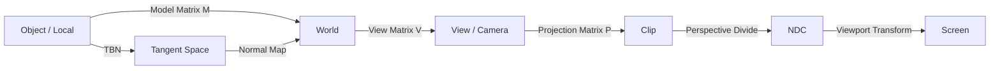
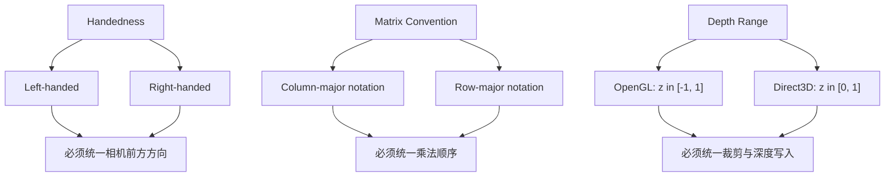

---
title: "游戏与引擎算法 39｜坐标空间变换全景"
slug: "algo-39-coordinate-spaces"
date: "2026-04-17"
description: "把 object/local、world、view、clip、NDC、screen、tangent space 串成一条完整工程链，同时解释左/右手系、行列主序、逆转置法线矩阵和深度映射差异。"
tags:
  - "坐标系"
  - "矩阵"
  - "MVP"
  - "NDC"
  - "法线矩阵"
  - "TBN"
  - "渲染数学"
  - "Unity"
series: "游戏与引擎算法"
weight: 1839
---
一句话本质：坐标空间不是名词表，而是一条回答“这点在哪、谁在看、能不能画、法线怎么算、屏幕怎么落点”的工程管线。

> **读这篇之前**：如果你对向量、矩阵、四元数还没统一符号，先读 [图形数学 01｜向量与矩阵：内存布局、列主序 vs 行主序、精度陷阱]() 和 [游戏与引擎算法 38｜四元数完全指南：旋转表示、Log/Exp、奇异性]()。

## 问题动机

顶点从模型文件里出来时，只知道“自己在物体局部坐标系里的位置”。
渲染器要做的，是把它一步步变成屏幕上的像素，同时还要决定它是否在视野里、法线该怎么变、贴图采样该怎么解释。

如果你只记 `MVP`，很容易把工程搞成黑箱。
一旦出现“相机一动物体就抖”“法线贴图翻面”“左右手系对不上”“深度像是倒着写的”，你会发现问题不在一个矩阵，而在整条空间链。

坐标空间的真正价值，是把每一步负责的事情切开。
对象空间回答“模型原始数据是什么”；世界空间回答“它放在场景的哪里”；视图空间回答“相机看见了什么”；裁剪空间回答“能不能进入光栅化”；NDC 回答“标准化后落在哪个立方体里”；屏幕空间回答“最后的像素坐标是多少”。
切空间再回答一次“法线贴图中的法线应该朝哪”。

## 历史背景

早期实时图形管线把这些东西强行塞进固定功能硬件里，开发者只需要往世界、视图、投影几个槽里塞矩阵。
随着可编程着色器、SRP、计算着色器和 GPU culling 出现，空间概念没有消失，只是从硬件固定步骤变成了工程师必须显式管理的协议。

Microsoft 的 Direct3D 文档一直把 world、view、projection、screen 作为标准术语；OpenGL Wiki 则从 object、eye、clip、NDC、window 这条链讲起。[Direct3D transforms](https://learn.microsoft.com/en-us/windows/win32/direct3d9/transforms) 和 Khronos 的 [General OpenGL: Transformations](https://www.khronos.org/opengl/wiki/General_OpenGL%3A_Transformations) 仍然是最清楚的入门坐标之一。

Unity 后来的 SRP 把这些空间重新包装成 `TransformObjectToHClip`、`TransformObjectToWorldNormal` 之类的 helper。[URP 基础着色器文档](https://docs.unity3d.com/jp/current/Manual/urp/writing-shaders-urp-basic-unlit-structure.html) 直接点明这些函数来自 `Packages/com.unity.render-pipelines.universal/ShaderLibrary/SpaceTransforms.hlsl`。
这说明现代引擎并没有抛弃经典空间，只是把它们变成了更可复用的 API。

## 数学基础

### 1. 齐次坐标让平移也能进矩阵

三维点写成四维齐次坐标：

$$
\mathbf{p} = (x, y, z, 1)
$$

方向向量写成：

$$
\mathbf{d} = (x, y, z, 0)
$$

这一个 `w` 值就把“点”和“方向”区分开了。
平移可以通过 4x4 矩阵表达，而方向不会被平移影响。

### 2. 仿射变换和投影变换不是一回事

对象到世界、世界到视图，都是仿射变换：

$$
\mathbf{p}' = M \mathbf{p}
$$

投影变换多了一步透视压缩：

$$
\mathbf{p}_{clip} = P V M \mathbf{p}_{object}
$$

接着做透视除法：

$$
\mathbf{p}_{ndc} = \frac{1}{w} (x_c, y_c, z_c)
$$

前面三步在几何上保持“同一条射线上的点投影到同一屏幕位置”，后面这一步把三维投影压回标准立方体。

### 3. 法线不是点，不能直接乘同一个矩阵

法线代表的是切平面方向，应该跟随表面局部切线结构变化。
如果模型含有非均匀缩放，直接用模型矩阵乘法线会把法线扭歪。

正确做法是用模型矩阵左上角 3x3 的逆转置：

$$
N = (M_{3x3}^{-1})^T
$$

然后

$$
\mathbf{n}' = \operatorname{normalize}(N \mathbf{n})
$$

这不是“习惯写法”，而是从平面方程保持不变推出来的。

### 4. 切空间需要三根轴

法线贴图工作在切空间，而不是世界空间。
每个顶点通常要有 T、B、N 三个方向：

$$
TBN = [\mathbf{t}\; \mathbf{b}\; \mathbf{n}]
$$

贴图中的法线向量先从 [0,1] 或 [-1,1] 还原，再通过 TBN 变回世界空间。
如果 TBN 的手性错了，法线贴图会像被翻面。

## 算法推导

### 1. 先问“这一层在回答什么”

对象空间回答“模型数据本身长什么样”。
世界空间回答“它在场景中的绝对位置”。
视图空间回答“相机前方的几何是什么”。
裁剪空间回答“能不能进入后续硬件管线”。
NDC 回答“标准化后落在什么范围”。
屏幕空间回答“最终像素坐标是多少”。

这不是术语排比，而是调试策略。
你只要知道问题发生在哪一层，排查范围就会立刻缩小。

### 2. 为什么要把 world 和 view 分开

world matrix 解决的是物体在场景中的摆放，view matrix 解决的是观察者的位置和朝向。
这两个矩阵看上去都在“搬东西”，但语义完全不同。

如果把相机也当成一个普通物体，你会很容易把“相机在世界中怎么摆”与“世界在相机看来怎么变”混淆。
在工程上，view 矩阵更适合作为世界的逆变换：

$$
V = (T_{camera})^{-1}
$$

### 3. 为什么 clip space 是硬件喜欢的形状

裁剪阶段需要一个统一的判定标准。
把点放进齐次裁剪空间后，只要检查分量是否落在约定范围内，就能快速决定是否保留。

OpenGL 的经典规则是：

$$
-w_c \le x_c, y_c, z_c \le w_c
$$

而 Direct3D 的经典规则是：

$$
-w_c \le x_c, y_c \le w_c, \quad 0 \le z_c \le w_c
$$

这就是很多跨 API 代码最容易踩的地方：你以为只是在换渲染后端，其实是连裁剪规则一起换了。

### 4. 为什么 screen space 还要再映射一次

NDC 只是标准立方体，不是最终像素。
视口变换要把 [-1,1] 的平面映射到渲染目标的宽高，还要处理 y 轴方向、深度范围和分辨率。

这一步是“屏幕像素坐标系”的落地，不是数学上最漂亮的一步，但它决定了最后画到哪。
## 结构图 / 流程图





## 算法实现

下面的代码用 C# 把整条空间链拆开：模型、视图、投影、屏幕映射、法线矩阵、切空间基、以及一个最小可用的项目到屏幕工具。

```csharp
using System;
using UnityEngine;

public static class SpaceTransformUtil
{
    private const float Epsilon = 1e-6f;

    public static Matrix4x4 BuildModelMatrix(Vector3 position, Quaternion rotation, Vector3 scale)
        => Matrix4x4.TRS(position, rotation, scale);

    public static Matrix4x4 BuildViewMatrix(Transform cameraTransform)
        => cameraTransform.worldToLocalMatrix;

    public static Matrix4x4 BuildProjectionMatrix(Camera camera)
        => GL.GetGPUProjectionMatrix(camera.projectionMatrix, false);

    public static Vector4 ToClip(Matrix4x4 model, Matrix4x4 view, Matrix4x4 projection, Vector3 objectPos)
    {
        Vector4 p = new Vector4(objectPos.x, objectPos.y, objectPos.z, 1f);
        return projection * view * model * p;
    }

    public static Vector3 ClipToNdc(Vector4 clip)
    {
        if (Mathf.Abs(clip.w) < Epsilon)
            return Vector3.zero;

        float invW = 1f / clip.w;
        return new Vector3(clip.x * invW, clip.y * invW, clip.z * invW);
    }

    public static Vector2 NdcToScreen(Vector3 ndc, Rect viewport, bool flipY = true)
    {
        float x = (ndc.x * 0.5f + 0.5f) * viewport.width + viewport.x;
        float y = (ndc.y * 0.5f + 0.5f) * viewport.height + viewport.y;
        if (flipY)
        {
            y = viewport.y + viewport.height - (y - viewport.y);
        }
        return new Vector2(x, y);
    }

    public static Vector3 TransformDirection(Matrix4x4 matrix, Vector3 direction)
    {
        return new Vector3(
            matrix.m00 * direction.x + matrix.m01 * direction.y + matrix.m02 * direction.z,
            matrix.m10 * direction.x + matrix.m11 * direction.y + matrix.m12 * direction.z,
            matrix.m20 * direction.x + matrix.m21 * direction.y + matrix.m22 * direction.z);
    }

    public static Matrix4x4 BuildNormalMatrix(Matrix4x4 model)
    {
        Matrix4x4 upper3x3 = model;
        upper3x3.m03 = upper3x3.m13 = upper3x3.m23 = 0f;
        upper3x3.m30 = upper3x3.m31 = upper3x3.m32 = 0f;
        upper3x3.m33 = 1f;

        Matrix4x4 inverse = upper3x3.inverse;
        return inverse.transpose;
    }

    public static Vector3 TransformNormal(Matrix4x4 model, Vector3 normal)
    {
        Matrix4x4 normalMatrix = BuildNormalMatrix(model);
        Vector3 transformed = TransformDirection(normalMatrix, normal);
        float lenSq = transformed.sqrMagnitude;
        if (lenSq < Epsilon) return Vector3.up;
        return transformed / Mathf.Sqrt(lenSq);
    }

    public static void BuildTangentFrame(Vector3 normal, Vector4 tangent, out Vector3 t, out Vector3 b, out Vector3 n)
    {
        n = normal.normalized;
        t = new Vector3(tangent.x, tangent.y, tangent.z).normalized;
        b = Vector3.Cross(n, t) * tangent.w;
        b = b.normalized;
        t = Vector3.Cross(b, n).normalized;
    }

    public static bool IsLeftHanded(Vector3 xAxis, Vector3 yAxis, Vector3 zAxis)
    {
        return Vector3.Dot(Vector3.Cross(xAxis, yAxis), zAxis) < 0f;
    }
}
```

这个实现有三个关键点。
第一，`BuildNormalMatrix` 只处理上面 3x3 的旋转与缩放，不把平移掺进去。
第二，`NdcToScreen` 明确处理了 y 轴翻转，不让“屏幕原点在左上还是左下”变成隐式假设。
第三，`BuildTangentFrame` 把切空间的手性显式写出来，法线贴图就不容易翻面。
## 复杂度分析

| 操作 | 时间复杂度 | 空间复杂度 | 说明 |
|---|---:|---:|---|
| 单点 MVP 变换 | O(1) | O(1) | 3 次矩阵向量乘可以合并成 1 次 |
| NDC / screen 映射 | O(1) | O(1) | 只做除法和线性映射 |
| 法线变换 | O(1) | O(1) | 需要逆转置，不是直接乘 model |
| TBN 构建 | O(1) | O(1) | 3 个向量 + 2 次叉乘 |
| 视锥裁剪 | O(1) / 对物体 | O(1) | 每个包围体固定测试次数 |

坐标空间本身不吃渐进复杂度，吃的是你把多少次乘法分散到 CPU 还是 GPU，是否提前合并矩阵，是否缓存逆矩阵，是否在正确的空间做剔除。

## 变体与优化

### 1. 预合并 MVP

如果一个顶点一定要经过 `M -> V -> P`，就没必要每次都分三次乘。
很多引擎会预先算出 `MVP = PVM`，减少顶点着色器的常数开销。

### 2. 相机相对渲染

当世界坐标非常大时，直接在世界空间里算会丢精度。
做法是把相机移到原点附近，只保留相对位置。
这能显著缓解大地图、开放世界和行星尺度场景里的浮点抖动。

### 3. 正确缓存逆矩阵

世界矩阵和法线矩阵都可能在一帧里被多次使用。
如果每个对象都重复求逆，会把常数成本放大。
更稳的做法是缓存 `worldToLocal`、`normalMatrix`、`viewProj`。

### 4. GPU 端做空间变换

对于大量实例，CPU 上先把顶点搬一次不一定划算。
把变换放到顶点着色器或计算着色器里，常常更适合批量数据。

### 5. 明确深度范围和反转 Z

经典 D3D 与 OpenGL 的深度范围不同，现代引擎还可能启用反转 Z。
反转 Z 的目标不是改变空间定义，而是把更高精度留给近裁剪面。

## 对比其他算法

| 方法 | 优点 | 缺点 | 适合场景 |
|---|---|---|---|
| 分层矩阵链（M/V/P 分开） | 概念清晰，便于调试 | 顶点阶段常数开销更高 | 教学、调试、工具链 |
| 预合并 MVP | 顶点阶段快，API 简单 | 不利于逐层插桩 | 绝大多数实时渲染 |
| 仅世界空间 | 方便做场景逻辑 | 不利于裁剪与相机相关计算 | 编辑器、非实时分析 |
| 仅视图空间 | 适合光照和裁剪 | 不适合做场景级逻辑 | 延迟渲染、相机分析 |

### 左手系 vs 右手系

| 维度 | 左手系 | 右手系 |
|---|---|---|
| 典型 API | Direct3D、Unity 常见工程约定 | OpenGL、很多数学库默认约定 |
| Z 轴含义 | 通常朝“前方” | 通常朝“屏幕外”或相反约定 |
| 风险 | 和右手系资源互导时容易翻转 | 和 D3D / Unity Shader 混用时容易错 |

### 行主序 vs 列主序

| 维度 | 行主序 | 列主序 |
|---|---|---|
| 关注点 | 代码如何按行理解矩阵 | 数学书里如何写矩阵 |
| 常见环境 | C/C++ 里的直觉写法 | OpenGL / GLSL / 许多数学推导 |
| 真正要防的坑 | 不是内存本身，而是乘法顺序和语义 | 同左 |

## 批判性讨论

坐标空间系统看似基础，其实最容易被“统一成一种写法”的欲望搞坏。
真正的风险不是你不知道 world/view/clip，而是你把所有东西都写成一个 `TransformPoint`，最后既看不出约定，也看不出 bug 来自哪一层。

另一个常见误区是把矩阵存储布局和数学约定混为一谈。
行主序、列主序、`mul(M, v)`、`mul(v, M)`、`GL_TRUE/GL_FALSE`、HLSL packing，这些不是同一件事。
你需要的是一套稳定的协议，而不是一条口号。

法线矩阵也是如此。
很多项目把“先能跑起来”当成理由，直接把 model matrix 乘给 normal，平时没事，一旦场景里出现非均匀缩放，阴影和高光立刻露馅。

## 跨学科视角

### 1. 线性代数和微分几何

法线之所以要逆转置，是因为它属于平面的对偶对象，而不是点的位置。
这类“对象属于对偶空间”的思维，是很多图形 bug 的根源，也是很多图形优化的钥匙。

### 2. 计算机视觉

相机外参和内参本质上就是 view 和 projection 的更严格版本。
图形学里的“相机看世界”，在视觉里就是“从三维投影到成像平面”。

### 3. 数值分析

相机相对渲染、深度重映射、反转 Z，本质上都是在有限浮点精度里重新分配误差预算。
这跟数值稳定性不是旁支，而是同一个问题。
## 真实案例

- [Unity URP 基础着色器文档](https://docs.unity3d.com/jp/current/Manual/urp/writing-shaders-urp-basic-unlit-structure.html) 明确说明了 `TransformObjectToHClip` 来自 `Packages/com.unity.render-pipelines.universal/ShaderLibrary/SpaceTransforms.hlsl`；这就是 Unity 在 shader 层统一 object 到 clip 的实际做法。
- [Unity URP 法线可视化文档](https://docs.unity3d.com/jp/current/Manual/urp/writing-shaders-urp-unlit-normals.html) 明确使用 `TransformObjectToWorldNormal`，并把法线从 object space 变换到 world space，再映射到颜色，直接展示了法线空间的工程意义。
- [Direct3D transforms](https://learn.microsoft.com/en-us/windows/win32/direct3d9/transforms)、[View Transform](https://learn.microsoft.com/en-us/windows/win32/direct3d9/view-transform) 和 [Viewports and clipping](https://learn.microsoft.com/en-us/windows/uwp/graphics-concepts/viewports-and-clipping) 这三篇文档把 world、view、projection、clipping、screen 的语义拆得非常清楚，是 D3D 路线的官方基线。
- [OpenGL Wiki: General OpenGL Transformations](https://www.khronos.org/opengl/wiki/General_OpenGL%3A_Transformations) 和 [Vertex Post-Processing](https://www.khronos.org/opengl/wiki/Vertex_Post-Processing) 则给出了 object -> eye -> clip -> NDC -> window 的经典链条。
- [DirectXMath](https://github.com/microsoft/DirectXMath) 和 [Unity Graphics](https://github.com/Unity-Technologies/Graphics) 是两条最实用的工程参考：前者把矩阵、向量、投影、深度缓冲 API 做成 SIMD 库，后者把空间转换、SRP shader helper 和 `SpaceTransforms.hlsl` 工具链整体公开。

## 量化数据

| 环节 | 定量信息 | 工程含义 |
|---|---|---|
| 裁剪空间 | OpenGL: `[-w, w]`；D3D: `z in [0, w]` | 跨 API 时不能只改一个投影矩阵 |
| 视口映射 | `x = (ndc.x + 1) / 2 * width` | 屏幕坐标是线性映射，不是透视映射 |
| 视锥测试 | 6 个平面 | 一个包围体只要固定次数测试 |
| AABB 取点 | 1 次 p-vertex，而不是 8 次顶点枚举 | 剔除效率明显高于暴力角点测试 |
| 法线变换 | 逆转置 3x3 | 非均匀缩放下不再翻车 |

如果你把 `M * V * P` 预先合并，顶点着色器里就少掉两次矩阵向量乘。对于大批量实例，这类常数优化的收益往往比你想象得更直接。

## 常见坑

### 1. 把空间和 API 绑死

为什么错：object/world/view/clip 是概念层，Direct3D/OpenGL/Unity 的实现约定只是映射方式。怎么改：先写清空间，再写清 API。

### 2. 混淆矩阵布局和乘法顺序

为什么错：row-major / column-major 不是同一个问题；内存布局和数学语义也不是同一个问题。怎么改：统一在一处封装矩阵构造和乘法，不要在 shader 外层手搓临时约定。

### 3. 直接用 model matrix 变换法线

为什么错：非均匀缩放会把法线扭歪。怎么改：使用逆转置，或者至少只对纯旋转矩阵这么做。

### 4. 忘记 depth range 差异

为什么错：OpenGL 和 Direct3D 的裁剪/深度约定并不完全一致。怎么改：把 depth range、viewport 以及反转 Z 作为渲染后端的一部分，而不是业务层的随手参数。

### 5. 忘记切空间手性

为什么错：切线 `tangent.w`、法线、bitangent 的手性错了，法线贴图就会翻。怎么改：把 TBN 的构建写成统一工具函数，并在导入阶段就校验手性。

## 何时用 / 何时不用

### 用坐标空间分层

- 你在写渲染管线、shader、剔除、拾取、法线贴图。
- 你在做相机、阴影、深度、后处理。
- 你需要和不同图形 API、不同坐标系互通。

### 不用再细分

- 你只是写一个纯 2D 逻辑，额外的 world/view/clip 只会制造噪音。
- 你只在一个封闭的编辑器工具里做简单拖拽，过度抽象反而不利于调试。
- 你已经到了纯屏幕空间 UI 阶段，再谈 object/view 只会把概念搞乱。

## 相关算法

- [图形数学 01｜向量与矩阵：内存布局、列主序 vs 行主序、精度陷阱]()
- [图形数学 02｜四元数：为什么旋转不该再用欧拉角]()
- [图形数学 03｜视锥体数学：裁剪平面提取、物体可见性判定]()
- [渲染入门：顶点为什么要经过五个坐标系]()
- [底层硬件 F03｜SIMD 指令集：一条指令处理 8 个 float，Burst 背后在做什么]()
- [游戏与引擎算法 38｜四元数完全指南：旋转表示、Log/Exp、奇异性]()

## 小结

坐标空间不是“换个名字再乘一次矩阵”，而是把每一步要解决的几何问题拆开。
对象空间负责原始数据，世界空间负责放置，视图空间负责观察，裁剪空间负责可见性，NDC 和屏幕空间负责落点，切空间负责法线贴图。

你只要把这条链条在脑子里接顺，绝大多数渲染 bug 都会从“神秘现象”变成“某一层的约定没对齐”。

## 参考资料

- [Microsoft: Direct3D Transforms](https://learn.microsoft.com/en-us/windows/win32/direct3d9/transforms)
- [Khronos OpenGL Wiki: General OpenGL - Transformations](https://www.khronos.org/opengl/wiki/General_OpenGL%3A_Transformations)
- [Unity Manual: Built-in Shader Variables](https://docs.unity3d.com/Manual/SL-UnityShaderVariables.html)
- [MikkTSpace reference implementation](https://github.com/mmikk/MikkTSpace)