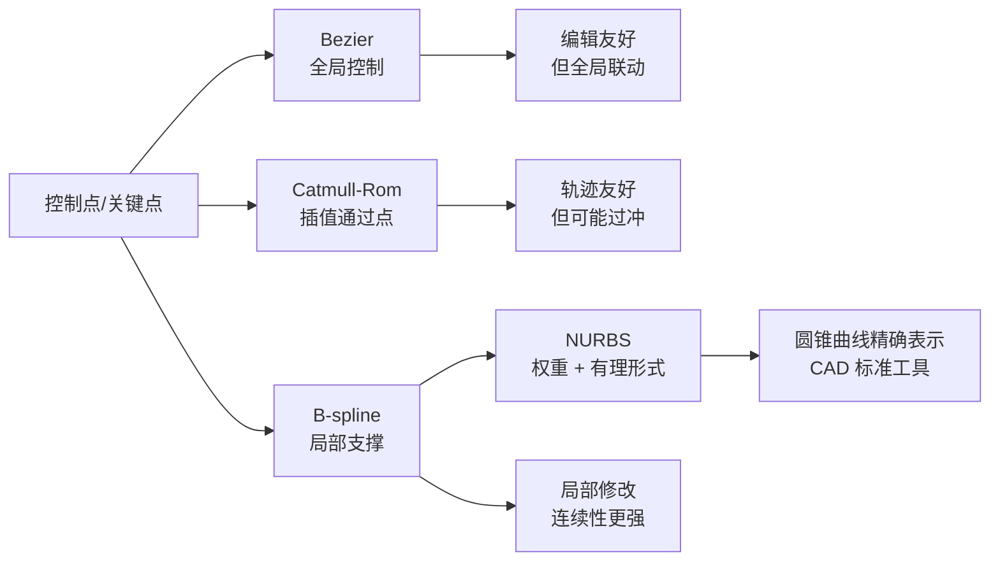
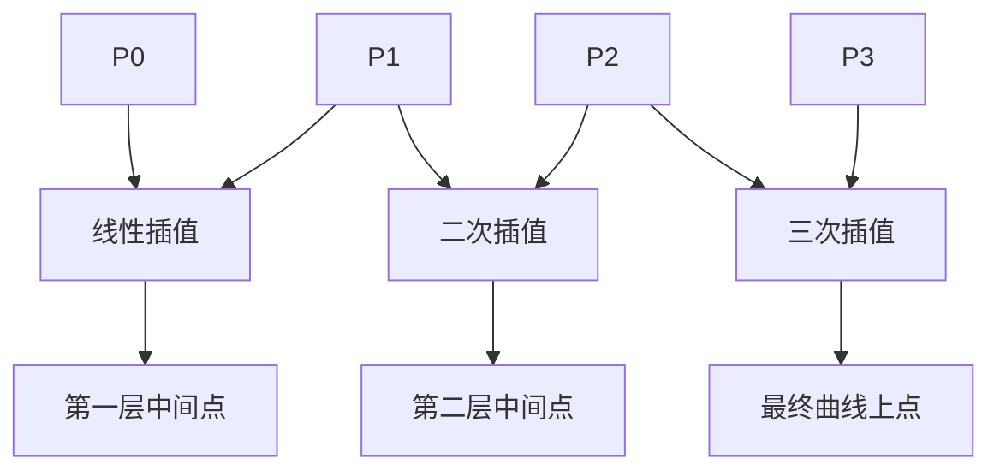

---
title: "游戏与引擎算法 40｜贝塞尔曲线与样条"
slug: "algo-40-bezier-splines"
date: "2026-04-17"
description: "把 Bézier、Catmull-Rom、B-spline 和 NURBS 放进同一张工程选择表，解释它们在稳定性、局部性和可编辑性上的取舍。"
tags:
  - "游戏引擎"
  - "数学"
  - "贝塞尔曲线"
  - "样条"
  - "Catmull-Rom"
  - "B样条"
  - "NURBS"
series: "游戏与引擎算法"
weight: 1840
---

**贝塞尔曲线与样条，本质上是在“可编辑性、局部控制、数值稳定性”之间选一个工程平衡点。**

> 读这篇之前：如果对矩阵、向量、仿射变换还不熟，先看 [图形数学 01｜向量与矩阵]()。

## 问题动机

游戏里真正要解决的，往往不是“画一条漂亮曲线”，而是“让曲线能被设计师改、让程序能稳定算、让运行时能快”。

镜头轨道、角色路径、UI 动效、轨迹预览、道路样条、赛车赛道、CAD 轮廓，背后都在问同一件事：点要怎么连，才能既平滑又可控。

如果只用折线，编辑简单，但速度、法线、曲率都会跳。 如果直接上高阶多项式，局部控制又变差，数值还更容易炸。

样条系统就是为这类矛盾而生的。

## 历史背景

贝塞尔曲线不是先在游戏里出现的。1960 年前后，Renault 的 Pierre Bézier 把它用于车身设计；Citroën 的 Paul de Casteljau 在 1959 年做出了稳定的递推求值算法，但因为内部研发限制，相关工作很晚才公开。1974 年，Catmull 与 Rom 提出局部插值样条，解决“曲线必须穿过关键点”的需求。随后，B-spline 和 NURBS 把“局部修改、连续性控制、精确表示圆锥曲线”统一到一套几何框架里。

这个演进顺序很重要：先有 CAD/CAM 对可编辑曲面的需求，再有稳定求值，再有局部控制，最后才是带权重的有理形式。

## 数学基础

Bezier 曲线的 Bernstein 形式是：

$$
B(t)=\sum_{i=0}^{n} P_i \binom{n}{i}(1-t)^{n-i}t^i,\quad t\in[0,1]
$$

de Casteljau 不是直接算幂，而是反复做线性插值：

$$
P_i^{(0)}=P_i,\qquad
P_i^{(k)}=(1-t)P_i^{(k-1)}+tP_{i+1}^{(k-1)}
$$

Catmull-Rom 是插值型样条，典型四点段可以写成 Hermite 形式：

$$
C(t)=h_{00}(t)P_1+h_{10}(t)M_1+h_{01}(t)P_2+h_{11}(t)M_2
$$

其中切向量通常由邻点差分估计，最常见的 uniform 版本有：

$$
M_1=\frac{1}{2}(P_2-P_0),\quad M_2=\frac{1}{2}(P_3-P_1)
$$

B-spline 的核心是局部支撑基函数。零次基函数是分段常量，高阶基函数由 Cox-de Boor 递推得到：

$$
N_{i,0}(t)=
\begin{cases}
1,& u_i\le t < u_{i+1}\\
0,& \text{otherwise}
\end{cases}
$$

$$
N_{i,p}(t)=\frac{t-u_i}{u_{i+p}-u_i}N_{i,p-1}(t)+\frac{u_{i+p+1}-t}{u_{i+p+1}-u_{i+1}}N_{i+1,p-1}(t)
$$

NURBS 只是在 B-spline 上引入权重：

$$
C(t)=\frac{\sum_i N_{i,p}(t)w_i P_i}{\sum_i N_{i,p}(t)w_i}
$$

这一步很关键。它把“平滑曲线”扩展成“可以精确表示圆、圆锥曲线、工程截面”的统一形式。

## 算法推导

### 从线性插值走到 de Casteljau

如果只知道两点，中间点就只能按比例插值。三点时，把两段线性插值再插一次，就得到二次曲线。

这个递推有两个好处：所有中间点都落在凸包内，几何意义直观；每一步都是“混合两个相邻点”，比直接展开高次多项式更稳。

对游戏引擎来说，这意味着曲线可以自然做裁剪、分段、细分和碰撞近似。

### 为什么 Bezier 常被拿来当编辑曲线

Bezier 的坏处也很明显：改一个控制点，整条曲线都会受影响。

这在 UI 动画和镜头曲线里通常是优点。设计师希望“拉一个把手，整段弧线都跟着变”，而不是只改一个局部片段。

### 为什么 Catmull-Rom 会更像“路径”

Catmull-Rom 的目标不是拟合控制多边形，而是穿过关键点。它更适合“角色必须经过这些 waypoint”的情况。

代价是局部曲率可能更激进。如果参数化方式不对，曲线会出现过冲、自交，甚至在极端点列上形成抖动。

### 为什么 B-spline 和 NURBS 更像 CAD

B-spline 把影响范围压缩到少数几个控制点。这让“局部重建”变得便宜，也让曲线更容易做层次化编辑。

NURBS 再加上权重后，能用同一套表示精确描述圆弧、椭圆和大多数工业曲面。这就是它在 CAD、造型、逆向工程里长期占主导的原因。

## 结构图 / 流程图





## 算法实现

下面给的是可直接搬进引擎的 C# 版本。重点不是“写得短”，而是把边界和稳定性先想清楚。

```csharp
using System;
using System.Numerics;

public static class SplineMath
{
    private static Vector3 Lerp(in Vector3 a, in Vector3 b, float t)
        => a + (b - a) * t;

    // de Casteljau: 数值稳定，适合 Bezier 评价与细分
    public static Vector3 EvaluateCubicBezier(
        in Vector3 p0, in Vector3 p1, in Vector3 p2, in Vector3 p3, float t)
    {
        t = Math.Clamp(t, 0f, 1f);

        var a = Lerp(p0, p1, t);
        var b = Lerp(p1, p2, t);
        var c = Lerp(p2, p3, t);

        var d = Lerp(a, b, t);
        var e = Lerp(b, c, t);

        return Lerp(d, e, t);
    }

    // uniform Catmull-Rom，适合“必须经过关键点”的轨迹
    public static Vector3 EvaluateCatmullRom(
        in Vector3 p0, in Vector3 p1, in Vector3 p2, in Vector3 p3, float t)
    {
        t = Math.Clamp(t, 0f, 1f);

        float t2 = t * t;
        float t3 = t2 * t;

        // 0.5 是常见基准；更激进的张力可转向 centripetal/chordal 参数化
        return 0.5f * (
            (2f * p1) +
            (-p0 + p2) * t +
            (2f * p0 - 5f * p1 + 4f * p2 - p3) * t2 +
            (-p0 + 3f * p1 - 3f * p2 + p3) * t3
        );
    }

    public static Vector3 EvaluateNurbs(
        ReadOnlySpan<Vector3> controlPoints,
        ReadOnlySpan<float> weights,
        ReadOnlySpan<float> knots,
        int degree,
        float t)
    {
        if (controlPoints.Length == 0)
            throw new ArgumentException("At least one control point is required.", nameof(controlPoints));
        if (controlPoints.Length != weights.Length)
            throw new ArgumentException("weights must match control point count.", nameof(weights));
        if (degree < 1 || degree >= controlPoints.Length)
            throw new ArgumentOutOfRangeException(nameof(degree));
        if (knots.Length != controlPoints.Length + degree + 1)
            throw new ArgumentException("Invalid knot vector length.", nameof(knots));

        int n = controlPoints.Length - 1;
        int span = FindSpan(n, degree, t, knots);
        float[] basis = new float[degree + 1];
        ComputeBasisFunctions(span, t, degree, knots, basis);

        Vector3 numerator = Vector3.Zero;
        float denominator = 0f;
        for (int i = 0; i <= degree; i++)
        {
            int index = span - degree + i;
            float weightedBasis = basis[i] * weights[index];
            numerator += controlPoints[index] * weightedBasis;
            denominator += weightedBasis;
        }

        if (MathF.Abs(denominator) < 1e-6f)
            throw new InvalidOperationException("Degenerate NURBS configuration: denominator is zero.");

        return numerator / denominator;
    }

    private static int FindSpan(int n, int degree, float t, ReadOnlySpan<float> knots)
    {
        float lowBound = knots[degree];
        float highBound = knots[n + 1];

        if (t <= lowBound) return degree;
        if (t >= highBound) return n;

        int low = degree;
        int high = n + 1;
        int mid = (low + high) >> 1;
        while (t < knots[mid] || t >= knots[mid + 1])
        {
            if (t < knots[mid])
                high = mid;
            else
                low = mid;
            mid = (low + high) >> 1;
        }
        return mid;
    }

    private static void ComputeBasisFunctions(int span, float t, int degree, ReadOnlySpan<float> knots, Span<float> basis)
    {
        basis[0] = 1f;
        float[] left = new float[degree + 1];
        float[] right = new float[degree + 1];

        for (int j = 1; j <= degree; j++)
        {
            left[j] = t - knots[span + 1 - j];
            right[j] = knots[span + j] - t;

            float saved = 0f;
            for (int r = 0; r < j; r++)
            {
                float denom = right[r + 1] + left[j - r];
                float temp = MathF.Abs(denom) < 1e-6f ? 0f : basis[r] / denom;
                basis[r] = saved + right[r + 1] * temp;
                saved = left[j - r] * temp;
            }

            basis[j] = saved;
        }
    }
}
```

NURBS 的实现路径可以压成三步：先 `FindSpan` 找局部定义域，再用 Cox-de Boor 递推算基函数，最后用权重把分子和分母分别累计，再做一次齐次归一化。
## 复杂度分析

de Casteljau 对 n 阶曲线求值，需要大约 `n(n+1)/2` 次线性插值。所以单点求值是 `O(n^2)`，但固定三次曲线时就是常数级。

B-spline / NURBS 的单段求值通常只依赖 `p+1` 个控制点。若阶数固定为三次，则每次求值近似 `O(1)`，但如果要做 knot search，整条管线会先有一次 `O(log m)` 或 `O(m)` 的定位开销。

空间上，Bezier、Catmull-Rom、B-spline 都只需要少量临时变量。真正吃内存的是曲线采样表、切线表和动画曲线缓存。

## 变体与优化

- **Bezier**：高阶曲线通常拆成多段三次，编辑和渲染都更稳。
- **Catmull-Rom**：uniform 简单，centripetal 更少过冲，chordal 更贴近弦长。
- **B-spline**：通过 knot insertion 做局部细化，不必重建整条曲线。
- **NURBS**：把权重归一化到合理范围，避免某个控制点把整段曲线“拉爆”。
- **采样优化**：运行时用弧长表而不是直接按 `t` 走，避免速度忽快忽慢。

## 对比其他算法

| 算法 | 是否插值关键点 | 局部修改 | 是否可精确表示圆锥曲线 | 常见用途 |
|---|---|---:|---:|---|
| Bezier | 否 | 差 | 仅有理形式可 | UI、镜头、轮廓绘制 |
| Catmull-Rom | 是 | 中 | 否 | 路径、相机轨迹、动画插值 |
| B-spline | 否 | 好 | 否 | CAD、平滑造型、局部编辑 |
| NURBS | 视构造而定 | 好 | 是 | 工业 CAD、精确几何 |

## 批判性讨论

Bezier 常被过度神化。它很适合“作者控制感”，但不适合“局部修改很多、路径很长”的场景。

Catmull-Rom 也不是万能路径曲线。uniform 版本在稀疏或锐角点列上容易过冲，必须考虑 centripetal 参数化。

B-spline 很平滑，但不一定穿过你想要的点。这对 CAD 是优点，对关卡路径编辑却可能是缺点。

NURBS 最强，也最不亲民。权重、节点向量、次数三个旋钮同时存在，编辑器如果不给可视化，很容易把设计师逼疯。

## 跨学科视角

样条和信号处理关系很深。B-spline 本质上就是一种局部平滑基函数，和重建滤波、卷积核、重采样误差有直接关系。

de Casteljau 的稳定性也不是“图形学专利”。它是在有限精度下做分治式插值，把高次多项式拆成低风险的局部平均。

NURBS 进入 CAD 之后，样条就不再只是“画曲线”的工具。它变成了“把几何、制造、公差和分析统一起来”的表示层。

## 真实案例

- [Skia 文档](https://skia.org/docs/)：Skia 是 Google 维护的 2D 图形库，路径系统大量使用 Bézier 曲线来绘制几何与文字轮廓。
- [Unity Splines 包](https://docs.unity3d.com/cn/2023.1/Manual/com.unity.splines.html)：Unity 官方样条包直接提供曲线、路径、轨迹生成，并暴露 `CatmullRomTension` 等工程参数。
- [openNURBS](https://developer.rhino3d.com/en/guides/opennurbs/what-is-opennurbs/) / [GitHub](https://github.com/mcneel/opennurbs)：提供 NURBS 评估工具和 3DM 交换能力，是工业 CAD 世界里很典型的 NURBS 实现。

## 量化数据

- 三次 Bezier 的 de Casteljau 求值只需要 `3 + 2 + 1 = 6` 次线性插值。
- `n` 阶 Bezier 的递推层数是 `n`，总插值次数是 `n(n+1)/2`。
- Unity Splines 文档里，`CatmullRomTension` 默认值是 `0.5`，`DefaultTension` 是 `0.33333334`，这说明工程里常常要把“数学曲线”映射成“可调参数”。
- B-spline 的局部支撑长度是 `p+1` 个基函数，三次时每段最多受 4 个控制点直接影响。

## 常见坑

1. **把 Catmull-Rom 当成不会过冲的“安全插值”**。为什么错：uniform 参数化在非均匀点列上会产生环路或尖峰。怎么改：改用 centripetal/chordal 参数化，并限制切向量长度。

2. **把 B-spline 当成“自动经过控制点的曲线”**。为什么错：B-spline 追求的是局部平滑，不是插值。怎么改：需要过点时改用插值样条，或者先求插值控制点。

3. **忘记 NURBS 的权重是分子和分母同时参与的**。为什么错：只改权重不归一化，会把曲线拉向某个控制点。怎么改：始终按齐次坐标计算，最后除以 `w`。

4. **按 `t` 直接走路径**。为什么错：参数空间速度不等于弧长速度。怎么改：预计算弧长表，或者按固定距离采样。

## 何时用 / 何时不用

- 需要设计师拖把手、快速做轮廓：用 Bezier。
- 需要曲线穿过一串 waypoint：用 Catmull-Rom。
- 需要局部编辑、长曲线连续性和工业建模：用 B-spline。
- 需要圆、圆锥曲线或 CAD 互通：用 NURBS。
- 需要严格的路径速度、精确碰撞或离散格点：不要直接依赖原始参数 `t`。

## 相关算法

- [图形数学 01｜向量与矩阵]()
- [程序化噪声 20｜Perlin、Simplex、Worley]()
- [游戏与引擎算法 39｜坐标空间变换全景]()
- [游戏与引擎算法 41｜浮点精度与数值稳定性]()

## 小结

Bezier 适合“作者控制”，Catmull-Rom 适合“路径经过点”，B-spline 适合“局部编辑”，NURBS 适合“工程几何”。

真正的工程判断不是问“哪个最数学”，而是问：你要的是编辑感、稳定性、局部性，还是 CAD 级精确表示。

## 参考资料

- Pierre Bézier, [How Renault Uses Numerical Control for Car Body Design and Tooling](https://saemobilus.sae.org/papers/renault-uses-numerical-control-for-car-body-design-tooling-680010), SAE 680010, 1968.
- Wolfgang Boehm, [On de Casteljau's algorithm](https://www.sciencedirect.com/science/article/abs/pii/S0167839699000230), Computer Aided Geometric Design, 1999.
- Edwin Catmull, Raphael Rom, [A class of local interpolating splines](https://www.sciencedirect.com/science/article/pii/B9780120790500500205), 1974.
- Carl de Boor, [On calculating with B-splines](https://www.sciencedirect.com/science/article/pii/0021904572900809), Journal of Approximation Theory, 1972.
- [Unity Splines 文档](https://docs.unity3d.com/cn/2023.1/Manual/com.unity.splines.html) 与 [SplineUtility API](https://docs.unity.cn/Packages/com.unity.splines%402.6/api/UnityEngine.Splines.SplineUtility.html)
- [Skia 文档](https://skia.org/docs/)；[openNURBS 文档](https://developer.rhino3d.com/en/guides/opennurbs/what-is-opennurbs/)；[openNURBS GitHub](https://github.com/mcneel/opennurbs)


