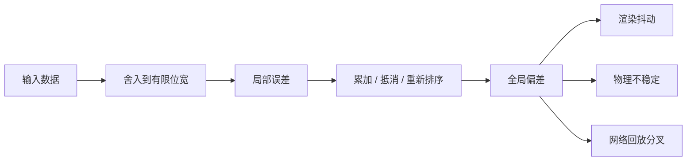
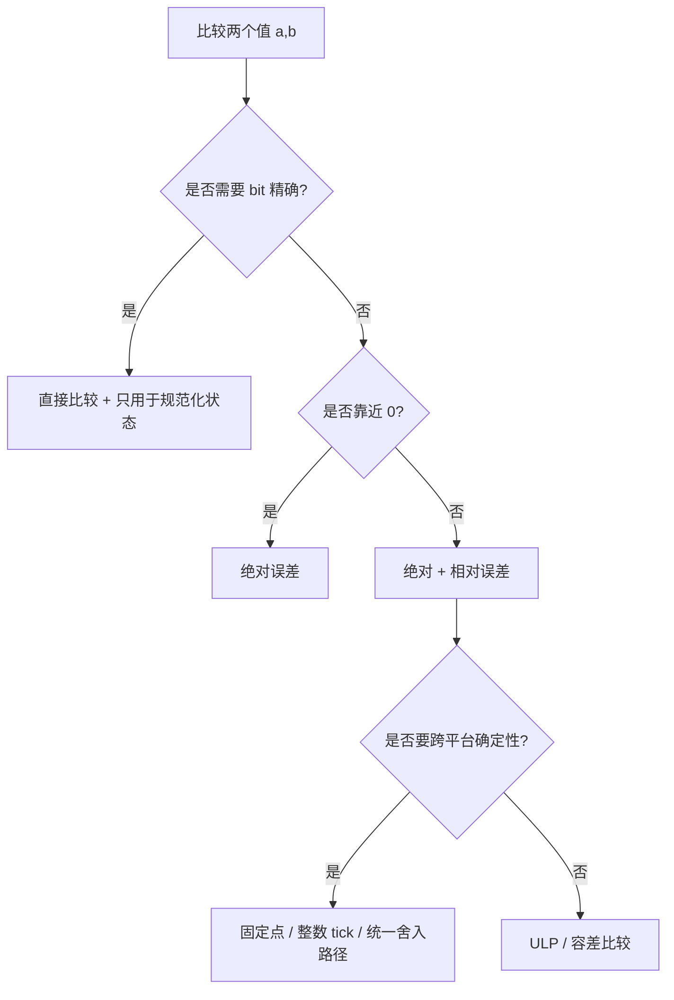

---
title: "游戏与引擎算法 41｜浮点精度与数值稳定性"
slug: "algo-41-floating-point-stability"
date: "2026-04-17"
description: "解释浮点为什么会在引擎里悄悄出错，并给出比较、累加、时间步和跨平台一致性的稳定做法。"
tags:
  - "浮点数"
  - "数值稳定性"
  - "IEEE 754"
  - "Kahan"
  - "误差分析"
  - "确定性"
  - "游戏引擎"
series: "游戏与引擎算法"
weight: 1841
---

**浮点不是“算不准”，而是“每一步都要付舍入税”；数值稳定性决定这笔税是可控还是失控。**

> 读这篇之前：建议先看 [图形数学 01｜向量与矩阵]()，再看 [游戏与引擎算法 40｜贝塞尔曲线与样条]()，因为曲线、相机和物理都会反复踩到浮点误差。

## 问题动机

引擎里最难排查的一类 bug，不是崩溃，而是“某些机器上偶尔偏一格、某条路径只在录制回放时抖一下、同一帧在 x86 和 ARM 上跑出不同结果”。

这些问题背后经常不是算法逻辑错了，而是浮点误差被累计、抵消、放大，最后以一个看似随机的症状爆出来。

### 一眼看见误差怎么长大



引擎中最典型的场景有四个：

1. 位置、速度、时间的长期累加。
2. 相似数相减导致灾难性抵消。
3. 直接用 `==` 比较状态值。
4. 不同平台、不同编译器、不同 SIMD 路径跑出不一样的低位误差。

## 历史背景

现代浮点算术的分水岭是 IEEE 754。1985 版把二进制浮点、舍入模式、异常值、NaN 和无穷统一起来，2008 和 2019 版继续扩展了格式和交换规则。它不是为了“让数字更准”，而是为了让不同硬件、不同语言、不同编译器之间至少能说同一种数值语言。

游戏开发最晚在三个地方撞上这套标准：动画与物理的长期累加、跨平台渲染差异、以及网络同步里的确定性需求。等到世界尺度变大、回放和联机变严苛，浮点才从“数学细节”变成“系统边界”。

C#、.NET、Unity、Godot 都在不同层面承认了这个事实：你不能指望 `==`，只能设计比较策略；你不能指望精度自动够用，只能明确在哪个层用 `float`、`double` 或更高层的重定位方案。

## 数学基础

浮点数可以看成有限位宽的科学计数法。以二进制为例，归一化形式是：

$$
 x = (-1)^s \times (1.f)_2 \times 2^{e-bias}
$$

对一个四则运算，常用的误差模型是：

$$
\mathrm{fl}(a \circ b) = (a \circ b)(1+\delta), \quad |\delta| \le u
$$

这里 `u` 是单位舍入误差，二进制 `p` 位尾数下通常有 `u=2^{-p}` 或 `2^{-(p+1)}` 的等价写法，取决于你把 `epsilon` 定义成“与 1 的差”还是“半个 ulp”。

灾难性抵消发生在两个很接近的数相减时。设 `a = x + \epsilon`，`b = x`，则：

$$
 a-b = \epsilon
$$

但如果 `a`、`b` 本身已经被舍入到相同尾数，`\epsilon` 可能在输入阶段就被吃掉了。

这就是为什么“差一点点”的数值问题，常常在代码里表现成“完全相等”。

## 算法推导

### 为什么顺序会改变结果

加法在数学上满足结合律，但浮点不满足。因为每次加法之后都要舍入，顺序不同，舍入点就不同。

例如 `((a+b)+c)` 和 `(a+(b+c))` 可能落在不同的 ulp 上。数越多，这个分叉越明显。

### Kahan 为什么有效

Kahan Summation 不是“提高精度”的魔法，而是把上一步丢掉的低位差值记下来，下一步再补回去。

设当前和为 `s`，补偿量为 `c`：

$$
 y = x_i - c
$$
$$
 t = s + y
$$
$$
 c = (t - s) - y
$$
$$
 s = t
$$

这里 `c` 捕获的是“这次加法舍掉的尾巴”。

从工程视角看，它的价值不是把误差消成 0，而是把线性增长的误差压到近乎常量级。

### 时间步为什么要特别处理

`deltaTime` 直接累加最常见的坑，是它不是精确分数。像 `1/60`、`1/120` 这种值，二进制里通常是无限循环小数，只能近似表示。

所以固定步模拟里，更稳的做法是：

- 用 `double` 或整数 tick 做累计器。
- 真正喂给物理步进的是离散、稳定的固定步长。
- 剩余误差放进 accumulator，而不是散落到每个系统里。

## 结构图 / 流程图

### 比较策略



最稳的通用比较式是：

$$
|a-b| \le \max(\varepsilon_{abs}, \varepsilon_{rel} \cdot \max(|a|, |b|))
$$

绝对误差适合零附近，相对误差适合大数附近。两者一起用，才不会在“接近 0 时太严、接近大数时太松”。

## 算法实现

下面的代码把三件事放到一起：安全比较、Kahan 累加、固定步累计器。它们是引擎里最常见的三块基础设施。

```csharp
using System;
using System.Numerics;

public static class StableMath
{
    public static bool AlmostEqual(float a, float b, float absEps = 1e-6f, float relEps = 1e-5f)
    {
        if (float.IsNaN(a) || float.IsNaN(b)) return false;
        if (float.IsInfinity(a) || float.IsInfinity(b)) return a.Equals(b);
        if (a == b) return true;

        float diff = MathF.Abs(a - b);
        if (diff <= absEps) return true;

        float scale = MathF.Max(MathF.Abs(a), MathF.Abs(b));
        return diff <= relEps * scale;
    }

    public static float KahanSum(ReadOnlySpan<float> values)
    {
        float sum = 0f;
        float c = 0f;

        for (int i = 0; i < values.Length; i++)
        {
            float y = values[i] - c;
            float t = sum + y;
            c = (t - sum) - y;
            sum = t;
        }

        return sum;
    }

    // 把累计器和固定步逻辑隔离，避免每个系统各自处理误差
    public sealed class FixedStepAccumulator
    {
        private double _accumulator;

        public void AddDelta(float deltaTime)
        {
            if (float.IsNaN(deltaTime) || float.IsInfinity(deltaTime))
                throw new ArgumentOutOfRangeException(nameof(deltaTime));

            _accumulator += deltaTime;
        }

        public int ConsumeSteps(float fixedStep, int maxStepsPerFrame)
        {
            if (fixedStep <= 0f) throw new ArgumentOutOfRangeException(nameof(fixedStep));
            if (maxStepsPerFrame <= 0) return 0;

            int steps = 0;
            while (_accumulator >= fixedStep && steps < maxStepsPerFrame)
            {
                _accumulator -= fixedStep;
                steps++;
            }

            return steps;
        }

        public float Remainder => (float)_accumulator;
    }
}
```

## 复杂度分析

单次浮点运算是 `O(1)`，但误差传播不是。它取决于操作次数、数据量级、数据顺序和平台路径。

Kahan Summation 仍然是线性复杂度 `O(n)`，空间是 `O(1)`，但多了几次加减法。换来的不是更快，而是更稳。

Fixed-step accumulator 也是 `O(1)` / 帧，真正的成本在于你是否把“时间”从“数值状态”中抽出来了。

## 变体与优化

- **Pairwise summation**：先分组再相加，通常比线性顺序更稳，适合数组归约。
- **Kahan / Neumaier**：适合长和、积分、统计量累计。
- **双精度累计，单精度状态**：常见于时间、相机、世界原点管理。
- **ULP 比较**：适合确实知道位级误差预算的内部工具。
- **重定位原点**：超大世界里比“全局升级成 double”更现实。

## 对比其他算法

| 方法 | 误差控制 | 性能 | 适用场景 | 局限 |
|---|---|---:|---|---|
| 直接累加 | 差 | 最快 | 短序列、粗略统计 | 长序列会漂移 |
| Pairwise | 中 | 稍慢 | 数组归约、并行归约 | 需要重排 |
| Kahan | 好 | 中等 | 时间累计、物理积分、统计和 | 不能解决所有平台不确定性 |
| 双精度累计 | 好 | 中等到慢 | 时间、相机、世界坐标 | 只是推迟问题，不是根治 |

## 批判性讨论

“全部换 double”是最常见的伪解决方案。它能缓解很多问题，但不能解决所有问题：GPU 端不一定有同等级支持，内存带宽会涨，SIMD 吞吐会掉，网络同步的确定性也不会自动变好。

另一个误区是“只要比较时加 epsilon 就行”。比较只是最后一道门，前面的累加、插值、坐标转换、归一化、排序才是误差的真正来源。

更现实的原则是：**把误差控制放在数据流边界，而不是等它扩散到每个系统内部再补救。**

## 跨学科视角

浮点稳定性属于数值分析，但它在游戏里往往表现为系统工程问题。

在信号处理里，我们会关心滤波器的相位和稳定性；在引擎里，我们关心积分器、插值器和比较器是否把误差放大。两者本质都在控制“近似计算的误差传播”。

在分布式系统里，版本冲突、最终一致性和重放顺序也很像浮点误差：单次偏差不可怕，序列中的偏差积累才可怕。

## 真实案例

- [IEEE 754-2019 官方页面](https://standards.ieee.org/content/ieee-standards/en/standard/754-2019.html)：标准定义了二进制和十进制浮点的交换、舍入和异常处理。
- [C# 语言规范：Floating-point types](https://learn.microsoft.com/en-us/dotnet/csharp/language-reference/language-specification/types)：说明 `float` / `double` 的 IEC 60559 语义、NaN、Infinity 和舍入行为。
- [Unity.Mathematics GitHub](https://github.com/Unity-Technologies/Unity.Mathematics)：Unity 的 C# 数学库围绕 `float3`、`float4` 等 SIMD 友好类型设计。
- [Godot float 文档](https://docs.godotengine.org/en/3.6/classes/class_float.html) 与 [large world coordinates](https://docs.godotengine.org/en/4.3/tutorials/physics/large_world_coordinates.html)：官方明确提醒浮点精度有限，并给出近似比较与大世界坐标方案。
- [Unity Shader data types and precision](https://docs.unity3d.com/cn/2023.2/Manual/SL-DataTypesAndPrecision.html)：Unity 直接把 `float` / `half` / `fixed` 的精度与平台差异写进文档。

## 量化数据

- `float` 的有效精度大约是 24 位有效二进制位，约 `7` 位十进制数。
- `double` 的有效精度大约是 53 位有效二进制位，约 `15~16` 位十进制数。
- `float` 的机器 epsilon 约为 `2^-23 ≈ 1.1920929e-7`。
- `double` 的机器 epsilon 约为 `2^-52 ≈ 2.220446049250313e-16`。
- 在数值约 `1,000,000` 的位置上，`float` 的相邻可表示值间隔约为 `0.125`，这就是大世界里“细节开始抖”的原因。
- `Kahan` 对 `0.1f` 这类反复累计的序列，通常能把“看起来差一点”的结果拉回到正确舍入。

## 常见坑

1. **直接用 `==` 比较浮点**。为什么错：相同数学值经过不同路径舍入后，位级结果可能不同。怎么改：用绝对+相对误差，或在确定性内部工具里用 ULP 规则。

2. **把 `deltaTime` 直接长期累加到 `float`**。为什么错：时间本身是无限重复的小数，长期累加会漂移。怎么改：用 `double` 或整数 tick 作为累计器，再转成固定步。

3. **在一个系统里混用 `float`、`double` 和隐式常量**。为什么错：表达式可能被悄悄提升或截断，误差预算不再可控。怎么改：统一字面量后缀和数据类型，明确边界转换。

4. **忽略 NaN 和 Infinity**。为什么错：它们不是“异常小数”，而是传播器，能把错误快速扩散到全系统。怎么改：在输入边界显式 `IsNaN` / `IsInfinity` 检查。

5. **期待跨平台位级一致**。为什么错：FMA、FTZ/DAZ、SIMD 重排、编译器优化都会改变低位结果。怎么改：如果要确定性，锁定编译选项和数学路径，必要时用固定点。

## 何时用 / 何时不用

- 需要长期累计、物理积分、统计归约：用 Kahan 或 pairwise。
- 需要大世界坐标、长时间运行：用 double 累计或原点重定位。
- 需要联机确定性：不要指望“换个 epsilon”解决，优先固定点或统一数值路径。
- 需要 GPU 大吞吐：不要盲目上 double，先做误差预算，再决定层级。

## 相关算法

- [图形数学 01｜向量与矩阵]()
- [游戏与引擎算法 39｜坐标空间变换全景]()
- [游戏与引擎算法 40｜贝塞尔曲线与样条]()
- [游戏与引擎算法 44｜视锥体与包围盒测试]()

## 小结

浮点误差不是“要不要存在”的问题，而是“你把它放在哪一层处理”的问题。

把比较规则、累计器、固定步和跨平台策略分别放到正确的位置，比单纯追求更高精度更重要。

## 参考资料

- IEEE SA, [IEEE 754-2019](https://standards.ieee.org/content/ieee-standards/en/standard/754-2019.html)
- Microsoft Learn, [Numerics in .NET](https://learn.microsoft.com/en-us/dotnet/standard/numerics)
- Microsoft Learn, [Floating-point numbers](https://learn.microsoft.com/en-us/dotnet/framework/data/adonet/floating-point-numbers)
- Microsoft Learn, [Precision and accuracy in floating-point calculations](https://learn.microsoft.com/en-us/troubleshoot/microsoft-365-apps/access/floating-calculations-info)
- Unity Technologies, [Unity.Mathematics](https://github.com/Unity-Technologies/Unity.Mathematics)
- Unity Docs, [Shader data types and precision](https://docs.unity3d.com/cn/2023.2/Manual/SL-DataTypesAndPrecision.html)
- Godot Docs, [float](https://docs.godotengine.org/en/3.6/classes/class_float.html) 与 [Large world coordinates](https://docs.godotengine.org/en/4.3/tutorials/physics/large_world_coordinates.html)


