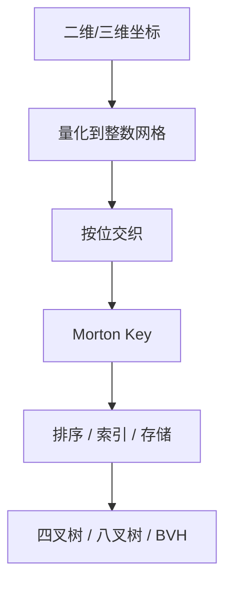
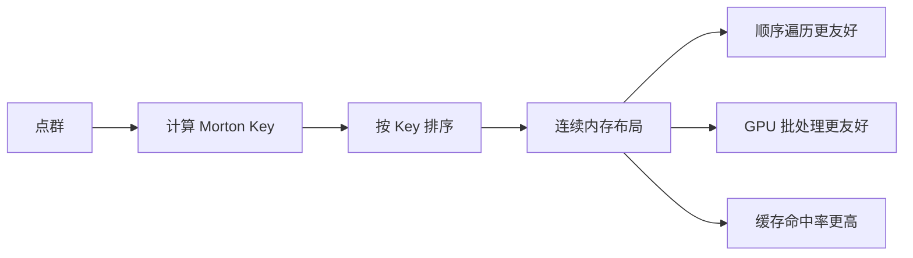

---
title: "游戏与引擎算法 42｜Morton 编码与 Z-Order"
slug: "algo-42-morton-z-order"
date: "2026-04-17"
description: "解释 Morton 编码如何把多维坐标压成一维键，并把四叉树、八叉树、BVH 和 GPU 缓存友好性串成一条工程链路。"
tags:
  - "空间索引"
  - "Morton编码"
  - "Z-Order"
  - "四叉树"
  - "八叉树"
  - "BVH"
  - "缓存局部性"
series: "游戏与引擎算法"
weight: 1842
---

**Morton 编码的目标很简单：把多维空间压成一维整数，同时尽量保住“附近的点仍然附近”这件事。**

> 读这篇之前：建议先看 [图形数学 01｜向量与矩阵]()，以及 [数据结构 11｜四叉树与八叉树]() 和 [数据结构 12｜BVH]()。

## 问题动机

当你要做碰撞 broadphase、体素索引、GPU 体素剖分、八叉树构建、点云排序、空间哈希、纹理 swizzle，最难的不是“能不能查”，而是“能不能查得快，并且让缓存别乱跳”。

二维和三维空间很自然，但内存和排序结构是线性的。Morton 编码就是那座桥：它把 `(x,y)` 或 `(x,y,z)` 交织成一个整数键，然后让数组、B 树、BVH、octree 都能沿着这个键工作。

## 历史背景

Morton 编码来自 1966 年 G. M. Morton 的报告 *A Computer Oriented Geodetic Data Base and a New Technique in File Sequencing*。它最早面向地理数据序列化，而不是游戏渲染。那个时代的约束很直接：存储贵、扫描慢、空间查询又频繁。

后来人们发现，这种“按位交织”的顺序，和四叉树/八叉树的深度优先遍历天然一致。再往后，GPU BVH 构建、纹理 swizzle、空间数据库、点云索引都开始复用同一件事：让空间相邻的数据在内存里也尽量相邻。

Morton 顺序不是唯一答案。Hilbert 曲线在理论上更能保持局部性，但实现更复杂、常数更高。工程里经常选 Morton，不是因为它最优，而是因为它够快、够简单、好并行。

## 数学基础

把整数坐标写成二进制位：

$$
 x=\sum_{i=0}^{b-1} x_i 2^i,\quad y=\sum_{i=0}^{b-1} y_i 2^i
$$

二维 Morton 编码把位交织起来：

$$
M(x,y)=\sum_{i=0}^{b-1} x_i 2^{2i} + \sum_{i=0}^{b-1} y_i 2^{2i+1}
$$

三维版本同理：

$$
M(x,y,z)=\sum_{i=0}^{b-1} x_i 2^{3i} + \sum_{i=0}^{b-1} y_i 2^{3i+1} + \sum_{i=0}^{b-1} z_i 2^{3i+2}
$$

这件事的直觉是：高位描述大范围，低位描述局部细节。把它们交织后，前缀相同的键会落在同一个四叉树/八叉树祖先块里。

所以 Morton 顺序看起来像“1D 排序”，本质上却是在编码树路径。

## 结构图 / 流程图





## 算法推导

### 从空间到键

Morton 编码不是直接对浮点坐标做位运算。实际工程里通常先做三步：

1. 选定世界范围和网格分辨率。
2. 把 `float` / `double` 坐标量化成无符号整数。
3. 对整数做 bit interleave。

量化这一步很重要。你必须先明确“一个格子代表多大”，否则空间顺序和误差预算都没有定义。

### 为什么它适合树结构

四叉树每下沉一层，都会把空间再切成 4 块；八叉树则切成 8 块。Morton key 的高位前缀正好描述“走到树的哪一层、哪一个分支”。

这让很多操作变成数组问题：

- 叶子节点可以按 key 排成连续区间。
- 子树往往对应 key 的连续前缀范围。
- 构建时可以先排序，再线性生成父节点。

这就是为什么 Morton 顺序在 LBVH / HLBVH 里特别常见。

### 为什么它能提高缓存局部性

缓存喜欢连续访问，不喜欢指针追踪。Morton 排序会把空间邻近的对象放到相邻位置，访问某个小区域时，往往只会触发少量 cache line 和少量 page 访问。

它不是让“所有近邻都变近”，而是让“近邻更有机会变近”。这已经足够让 broadphase、体素、点云和 GPU 批处理变快。

## 算法实现

下面给两种实现：一种是通用 SWAR 位扩散，另一种是可以在支持 BMI2 的平台上替换的思路。

```csharp
using System;
using System.Numerics;

public static class MortonCode
{
    // 2D: 每个坐标扩成偶/奇位交织
    public static uint Part1By1(uint x)
    {
        x &= 0x0000FFFFu;
        x = (x | (x << 8)) & 0x00FF00FFu;
        x = (x | (x << 4)) & 0x0F0F0F0Fu;
        x = (x | (x << 2)) & 0x33333333u;
        x = (x | (x << 1)) & 0x55555555u;
        return x;
    }

    // 3D: 每个坐标扩成每 3 位留 2 个空位
    public static ulong Part1By2(ulong x)
    {
        x &= 0x1FFFFFu;
        x = (x | (x << 32)) & 0x1F00000000FFFFul;
        x = (x | (x << 16)) & 0x1F0000FF0000FFul;
        x = (x | (x << 8))  & 0x100F00F00F00F00Ful;
        x = (x | (x << 4))  & 0x10C30C30C30C30C3ul;
        x = (x | (x << 2))  & 0x1249249249249249ul;
        return x;
    }

    public static uint Encode2D(uint x, uint y)
    {
        if (x > ushort.MaxValue || y > ushort.MaxValue)
            throw new ArgumentOutOfRangeException("2D Morton code only covers 16 bits per axis in this implementation.");

        return Part1By1(x) | (Part1By1(y) << 1);
    }

    public static ulong Encode3D(uint x, uint y, uint z)
    {
        if (x > 0x1FFFFFu || y > 0x1FFFFFu || z > 0x1FFFFFu)
            throw new ArgumentOutOfRangeException("3D Morton code only covers 21 bits per axis in this implementation.");

        return Part1By2(x) | (Part1By2(y) << 1) | (Part1By2(z) << 2);
    }

    // 世界坐标量化：把浮点映射到网格，再编码
    public static uint Encode2D(Vector2 pos, Vector2 min, float cellSize)
    {
        if (cellSize <= 0f) throw new ArgumentOutOfRangeException(nameof(cellSize));
        uint ix = Quantize(pos.X, min.X, cellSize);
        uint iy = Quantize(pos.Y, min.Y, cellSize);
        return Encode2D(ix, iy);
    }

    private static uint Quantize(float value, float min, float cellSize)
    {
        double normalized = (value - min) / cellSize;
        if (double.IsNaN(normalized) || double.IsInfinity(normalized))
            throw new ArgumentOutOfRangeException(nameof(value));

        if (normalized < 0.0) return 0u;
        if (normalized > uint.MaxValue) return uint.MaxValue;
        return (uint)normalized;
    }
}
```

如果平台支持 BMI2，可以把 `Part1By1` / `Part1By2` 替换成 `PDEP` / `PEXT` 类指令，减少常量掩码步骤。工程上常见做法是：保留 SWAR fallback，再在 x86_64 且支持 BMI2 的机器上走快速路径。

## 复杂度分析

Morton 编码本身是 `O(1)`。SWAR 实现的步骤数固定，不随输入规模变化。

真正贵的是排序。`n` 个对象先算 key，再排序，整体通常是 `O(n log n)`。如果 key 已经接近有序，某些基于分桶或 radix 的实现可以逼近线性。

空间上，Morton 编码只占一个整数键。真正的额外开销来自量化网格、对象排序后的索引表，以及构建出的树节点数组。

## 变体与优化

- **2D / 3D / 4D Morton**：维度越高，键宽越快吃满。
- **量化预缩放**：先把世界拆成局部块，再对块内坐标做 Morton，避免超出位宽。
- **Radix sort**：在 GPU / 大数据批量排序里，比通用比较排序更常见。
- **碰撞处理**：同一个 key 对应多个对象时，需要附加对象索引或次级排序键。
- **局部窗口查询**：对范围查询，通常要配合 BIGMIN / 扫描边界修正，而不是天真地做一维二分。

## 对比其他算法

| 方法 | 局部性 | 计算成本 | 实现难度 | 典型用途 |
|---|---|---:|---:|---|
| 行优先 / 列优先 | 一维方向强 | 最低 | 最低 | 矩阵、图像 |
| Morton / Z-Order | 好 | 低 | 低 | 空间索引、BVH、octree |
| Hilbert 曲线 | 更好 | 高 | 高 | 需要更强局部性的索引 |
| 哈希网格 | 取决于桶设计 | 低到中 | 中 | 粗粒度邻域查询 |

## 批判性讨论

Morton 不是“比 Hilbert 差所以不该用”。它在工程里赢的地方是：实现简单、并行友好、位运算开销低、适合 GPU 和批处理。

但它也有硬伤。二维里它会在子块边界上发生跳跃，三维里跳跃更明显；如果你把它当成“完美连续曲线”，就会误判范围查询和邻域扫描的代价。

另一个问题是量化。Morton 的空间局部性建立在“先离散化”的前提上。网格太粗会丢细节，太细又会把位宽吃满。

## 跨学科视角

Morton 编码和数据库索引很像。它把多维 range query 变成一维键的局部扫描，再把复杂度转移到排序和边界修正上。

它和图像存储也很像。纹理 swizzle / tiled texture 的核心动机，就是让 GPU 在访问邻近 texel 时尽量落在相邻缓存行里。Morton 顺序是这类布局的重要候选之一。

## 真实案例

- [IBM Research 原始报告](https://dominoweb.draco.res.ibm.com/0dabf9473b9c86d48525779800566a39.html)：Morton 1966 年的报告明确提出了面向地理数据的 file sequencing。
- [Fast BVH Construction on GPUs](https://research.nvidia.com/publication/2009-03_fast-bvh-construction-gpus)：NVIDIA 研究把 Morton code 作为 GPU BVH 构建的基础顺序之一。
- [ToruNiina/lbvh](https://github.com/ToruNiina/lbvh)：一个 GPU 线性 BVH 实现，直接在 README 里说明它处理 Morton code，并在代码里处理 code overlap。
- [libmorton](https://github.com/Forceflow/libmorton)：C++ header-only Morton 编解码库，提供 2D/3D 的 16/32/64 位实现。

## 量化数据

- 2D Morton 编码用 `b` 位坐标时，输出键宽是 `2b` 位。
- 3D Morton 编码用 `b` 位坐标时，输出键宽是 `3b` 位。
- 64 位 Morton 键在 3D 场景里通常意味着每轴大约 21 位有效分辨率，因为 `21*3 = 63`。
- `libmorton` 明确提供 2D / 3D 的 16、32、64 位编码和解码接口。
- NVIDIA 的 `Fast BVH Construction on GPUs` 论文说明，基于 Morton 顺序的 BVH 构建可以处理“数百万三角形”级别的数据集，并显著降低构建时间。

## 常见坑

1. **把浮点坐标直接拿去做位交织**。为什么错：浮点的符号位、指数位、尾数位不代表空间坐标顺序。怎么改：先量化到无符号整数网格，再编码。

2. **忽略 key 冲突**。为什么错：不同对象可能落到同一网格单元里。怎么改：加对象索引、二级排序键，或在叶子里保留小桶。

3. **把 Morton 当成“无损局部排序”**。为什么错：它只是在统计意义上保局部，不是数学上连续保持邻域。怎么改：对大范围查询做边界扫描和分段修正。

4. **位宽规划不够**。为什么错：三维 64 位键很快耗尽。怎么改：先做世界分块，再对局部坐标编码，或者改用 128 位键。

## 何时用 / 何时不用

- 需要快速构建 octree、BVH、空间哈希：用 Morton。
- 需要 GPU 批处理、缓存友好布局：用 Morton。
- 需要更强局部性的数据库型空间索引：考虑 Hilbert。
- 需要高精度连续几何而不是离散网格：不要把 Morton 当几何本体，它只是排序键。

## 相关算法

- [数据结构 11｜四叉树与八叉树]()
- [数据结构 12｜BVH]()
- [数据结构 10｜AABB 广义碰撞]()
- [游戏与引擎算法 44｜视锥体与包围盒测试]()

## 小结

Morton 编码不是最强的空间顺序，但它往往是最便宜、最容易并行、最容易落到硬件上的那一个。

工程上的真正问题，不是“能不能编码”，而是“你愿不愿意先把空间离散化，并接受这种离散带来的误差预算”。

## 参考资料

- G. M. Morton, [A Computer Oriented Geodetic Data Base and a New Technique in File Sequencing](https://dominoweb.draco.res.ibm.com/0dabf9473b9c86d48525779800566a39.html), IBM Research report, 1966.
- Christian Lauterbach et al., [Fast BVH Construction on GPUs](https://research.nvidia.com/publication/2009-03_fast-bvh-construction-gpus), NVIDIA / Eurographics 2009.
- Jacopo Pantaleoni, David Luebke, [HLBVH: Hierarchical LBVH Construction for Real-Time Ray Tracing](https://research.nvidia.com/publication/2010-06_hlbvh-hierarchical-lbvh-construction-real-time-ray-tracing), NVIDIA Research.
- [ToruNiina/lbvh](https://github.com/ToruNiina/lbvh)
- [Forceflow/libmorton](https://github.com/Forceflow/libmorton)


