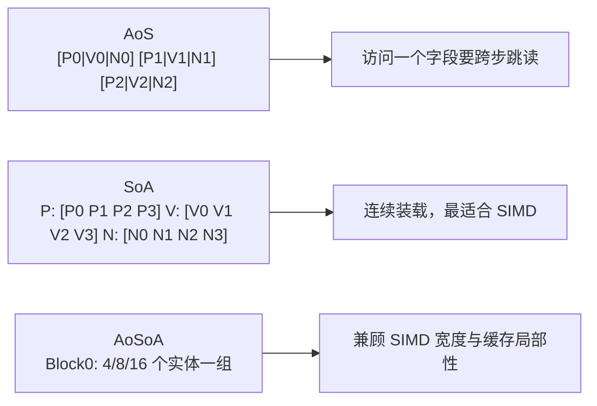
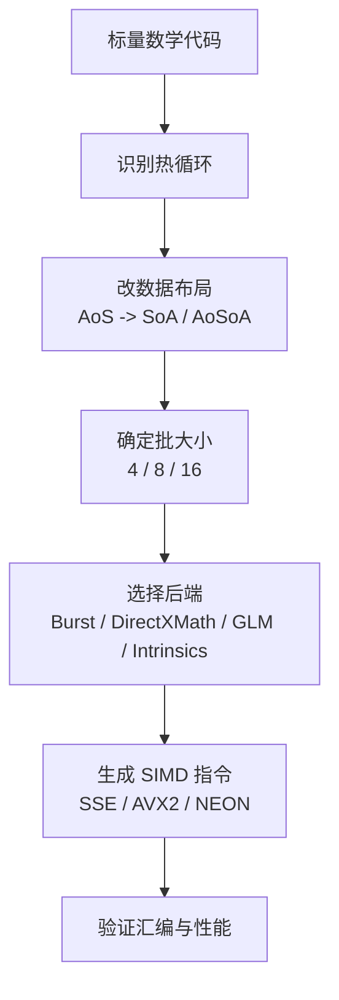
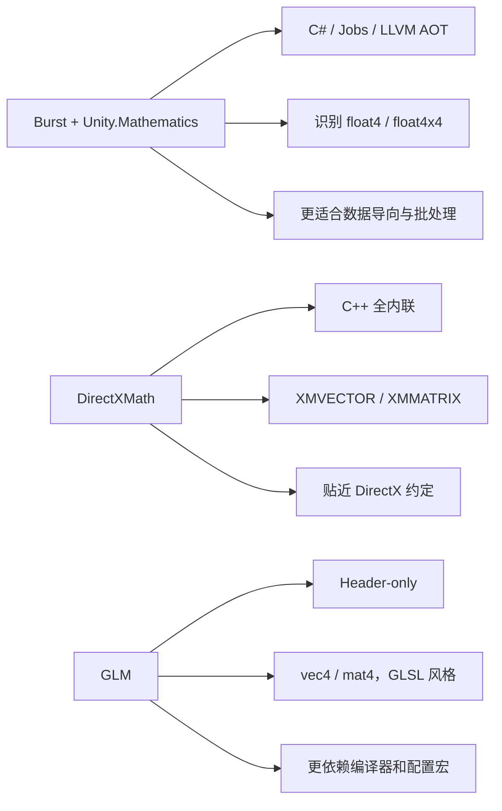

---
date: "2026-04-17"
title: "游戏与引擎算法 43｜SIMD 数学：Vector4 / Matrix4 向量化"
description: "把同一类线性代数运算打包到向量寄存器里，靠 ISA 宽度、数据布局和批处理减少指令条数与缓存抖动。"
slug: "algo-43-simd-math"
series: "游戏与引擎算法"
weight: 1843
tags:
  - "SIMD"
  - "向量化"
  - "数据布局"
  - "矩阵数学"
  - "Burst"
  - "DirectXMath"
  - "GLM"
---

SIMD 数学，就是把一批同型标量运算压进向量寄存器，让 `Vector4`、`Matrix4`、点集变换和批量点积从“逐个算”变成“成组算”。

> 版本说明：本篇按 Unity Burst / Unity.Mathematics、DirectXMath、GLM 的公开文档和仓库约定来讲；涉及矩阵约定时，我会明确指出行主序、列主序和向量左右乘的差异。

---

## 问题动机：为什么引擎里最先被 SIMD 吃掉的是数学

游戏引擎里，最容易形成热点的不是“一个大算法”，而是大量看似不起眼的线性代数循环。

- 每帧更新一万个物体的位置、速度、朝向。
- 每帧把几千个点、法线、包围盒从局部空间变到世界空间。
- 每帧对骨骼姿态、粒子、相机、光照参数做批处理。
- 每帧在物理、动画、渲染、AI 之间反复做点积、叉积、矩阵乘法、归一化。

这些操作有一个共同点：**同构、规则、可批量**。

如果还按标量写法，一个循环就是：

```csharp
for (int i = 0; i < count; i++)
{
    outPos[i] = M.TransformPoint(inPos[i]);
}
```

这段代码不慢在“公式复杂”，而慢在：

- 每个元素都要重复解码指令。
- 每个元素都要重复装载、写回。
- 每个元素都要跨一次函数调用或内联边界。
- 数据布局如果不对，还会把缓存和对齐一起拖垮。

SIMD 的价值不是“更聪明的数学”，而是把这类循环的**单位工作量**压低。

---

## 历史背景：从科学计算走到游戏引擎

SIMD 不是游戏行业发明的，它先在科学计算、图像处理和媒体编解码里成熟，再被图形 API、物理引擎和实时内容生产系统吸收。

Intel 官方把 SSE、AVX、AVX2、AVX-512 都归到“对同一组数据对象执行相同操作以提升性能”的指令扩展里。AVX 提供 256-bit 向量宽度，AVX2 把 256-bit 扩到整数和浮点通路，并加入 gather 等能力，AVX-512 则把宽度推进到 512-bit。[1]

这条演进对游戏引擎很关键，因为它把“向量化”从一种编译器幻想，变成了明确的硬件事实。

接下来，三条工程路线各自成熟：

- `DirectXMath` 把 SIMD 变成全内联 C++ 线性代数库。
- `GLM` 把 GLSL 风格的 `vec4 / mat4` 变成 header-only C++ 数学库。
- `Unity.Mathematics + Burst` 把 `float4 / float4x4` 变成面向 AOT/LLVM 的高性能 C# 数学层。[2][3][4]

这三者的共同点不是“都能算矩阵”，而是都在解决同一件事：**让编译器或库知道你的数据是可以批处理的**。

---

## 数学基础：向量寄存器里的线性代数

SIMD 本质上不是新数学，它只是把原本的标量运算，映射成一组并行的 lane。

如果一个 `float4` 放进 128-bit 寄存器，那么四个 lane 里做的是同一条指令下的四个独立标量：

$$
\mathbf{a} = (a_0, a_1, a_2, a_3),\quad
\mathbf{b} = (b_0, b_1, b_2, b_3)
$$

$$
\mathbf{a} + \mathbf{b} = (a_0+b_0,\ a_1+b_1,\ a_2+b_2,\ a_3+b_3)
$$

点积则把“乘、加、归约”拆成两层：

$$
\mathbf{a}\cdot\mathbf{b}=\sum_{i=0}^{3} a_i b_i
$$

在 SIMD 里，前半段是 lane-wise multiply，后半段是 horizontal add。  
这也是为什么“点积可向量化，但并不等于一条指令就结束”。

矩阵乘法也一样。若按行向量约定：

$$
\mathbf{y} = \mathbf{x}M
$$

其中

$$
y_j = \sum_{i=0}^{3} x_i M_{ij}
$$

这意味着一行结果可以拆成 4 次乘加，四行结果可以拆成 4 组独立批处理。  
所以 `Matrix4` 的 SIMD 化，通常不是“矩阵整体当一个值”，而是**把行、列、批量点云、批量骨骼向量放进不同层次的并行**。

---

## 算法推导

### 三种布局：AoS、SoA、AoSoA

SIMD 不是只看公式，它更看数据怎么排。



**AoS**（Array of Structures）对面向对象最自然，但对 SIMD 最不友好。

```csharp
struct Particle
{
    public Vector3 Position;
    public Vector3 Velocity;
    public Vector3 Force;
}
```

如果你要读 8 个 `Position.x`，它们在内存里并不连续，编译器只能：

- 做 gather。
- 或者退回标量循环。
- 或者先转置成临时缓冲。

**SoA**（Structure of Arrays）对 SIMD 友好得多。

```csharp
struct ParticleSoA
{
    public float[] Px, Py, Pz;
    public float[] Vx, Vy, Vz;
}
```

这时一次 128-bit/256-bit load 就能取到连续的多个 `x` 分量。

**AoSoA** 是工程里最常见的折中。

- 一层按实体类型分组。
- 一层按 SIMD 宽度分块。
- 一层在块内保持 SoA。

这样既保留了批处理，又不把整个系统改成纯列式存储。

---

### 批处理的真实目标：不是“每条指令更快”，而是“每次搬运更值”

SIMD 的收益经常被误解成“乘法变快了”。

实际更重要的是这三件事：

1. 一次解码更多数据。
2. 一次搬运更多数据。
3. 一次减少更多循环开销。

如果数据布局是 AoS，SIMD 的收益会被 gather/scatter 吃掉。

Intel 对 AVX2 的说明里明确提到 gather 操作用于“非连续内存元素的取数”，但这类操作本质上是在给不友好的布局补洞，而不是和连续 load 同级的廉价路径。[5]

一个粗略的工程模型可以写成：

$$
T \approx N\cdot(C_{load}+C_{fma}+C_{store}) + N\cdot C_{shuffle/gather}
$$

只要 `C_{shuffle/gather}` 足够大，SIMD 的理论宽度就会被抵消。

所以，SIMD 优化不是“先写代码再看编译器有没有帮我向量化”，而是：

- 先换布局。
- 再换批次大小。
- 再让编译器或手写 intrinsics 去吃红利。

---

### 由点到面：点、向量、矩阵各自怎么批量化

### 1. 批量点积

点积是引擎里最常见的低层操作之一。

```csharp
public static float Dot4(in Vector4 a, in Vector4 b)
{
    return a.x * b.x + a.y * b.y + a.z * b.z + a.w * b.w;
}
```

标量写法简单，但当你要对 1024 个向量做点积时，SIMD 版本会把“同一时刻的四个点积”放到一组 lane 里。

### 2. 批量点变换

```csharp
public static void TransformPoints(
    ReadOnlySpan<Vector4> input,
    Span<Vector4> output,
    in Matrix4x4 m)
{
    if (output.Length < input.Length)
        throw new ArgumentException("output too small");

    for (int i = 0; i < input.Length; i++)
    {
        Vector4 p = input[i];
        output[i] = new Vector4(
            p.x * m.m00 + p.y * m.m01 + p.z * m.m02 + p.w * m.m03,
            p.x * m.m10 + p.y * m.m11 + p.z * m.m12 + p.w * m.m13,
            p.x * m.m20 + p.y * m.m21 + p.z * m.m22 + p.w * m.m23,
            p.x * m.m30 + p.y * m.m31 + p.z * m.m32 + p.w * m.m33
        );
    }
}
```

这段代码是标量基线。  
真正 SIMD 化时，通常把 `input` 变成 SoA，再按 4 / 8 / 16 个点一起处理。

### 3. 批量矩阵乘法

矩阵不是“更复杂的向量”，它是“更密集的批处理容器”。

在 `Matrix4x4 * Matrix4x4` 里，最省事的策略通常不是逐元素乘，而是：

- 先把右矩阵转置成列友好布局。
- 再让一行对一列做向量点积。
- 再把 4 个结果拼回一个 `Matrix4x4`。

这就是为什么很多 SIMD 数学库都会把“矩阵转置”做成一等公民，而不是附属工具。

---

## 结构图 / 流程图



这条流水线里，最容易被低估的是第三步。

很多团队以为“上 SIMD”是最后一步，实际上它往往是倒数第二步。  
如果布局没改，后端再强也只能做昂贵的搬运和洗牌。

### 三套主流实现的工程差异



### Burst + Unity.Mathematics

Unity.Mathematics 的 README 直接说明，它提供 `float4`、`float3`、`float4x4` 这类对 SIMD 和 shader 开发者友好的类型，Burst 会识别这些类型，并把它们映射成针对当前 CPU 的优化 SIMD 类型。[2]

Burst 官方手册也明确说明，它是基于 LLVM 的 AOT 编译器，会把 IL/.NET bytecode 翻译为目标平台原生代码。[3]

这意味着它的工程哲学是：

- 先约束可编译子集。
- 再让编译器承担向量化。
- 再通过 Jobs 扩大批量执行。

### DirectXMath

DirectXMath 仓库直接把自己定义成 “an all inline SIMD C++ linear algebra library for use in games and graphics apps”。仓库目录里还明确分出了 `DirectXCollision.h`、`DirectXMathAVX2.h`、`DirectXMathFMA3.h` 这类代码路径。[4][6]

它的工程哲学是：

- 用内联函数把抽象成本压到最低。
- 用显式类型表达向量语义。
- 用平台分发头文件处理指令集差异。

### GLM

GLM 是 header-only 的 GLSL 风格数学库，官方 README 说明它是基于 OpenGL Shading Language 语义的 C++ 数学库。[7]

它的工程哲学是：

- 尽量沿用着色器语义。
- 尽量保持可移植。
- 把 SIMD 支持交给编译器、配置宏和扩展层。

这三条路线的差别，不是“谁更高级”，而是：

- Burst 偏 AOT + 数据导向。
- DirectXMath 偏 Windows/DirectX 约定 + 显式 SIMD。
- GLM 偏跨平台 + 语义一致性。

---

### Alignment、gather/scatter 和为什么有时 12 字节比 16 字节更糟

对 SIMD 来说，对齐不是美学问题，是吞吐问题。

如果你有 `Vector3` 数组：

- 逻辑上每个元素 12 字节。
- 物理上常常要跨缓存线取数。
- 取 4/8 个元素时步长不规则。

这会带来两个工程后果：

1. 连续 load 变成跨步 load。
2. 编译器更难证明无别名和可向量化。

在 1,000,000 个元素的场景里，把 `Vector3` 按 16 字节对齐或改成 SoA，等于额外多花约 4 MB 内存，但换来更高的 SIMD 友好度。  
这笔账在动画、粒子、物理和渲染里通常是划算的。

gather/scatter 的问题也在这里。

- 连续 load 的本质是“顺序搬运”。
- gather 的本质是“多次小搬运再拼装”。

所以，尽量把 gather 当作兜底，而不是主路径。

---

### 数值稳定性：SIMD 不是只会让结果更快，也会让误差更快出现

SIMD 的另一个误解是：既然它更快，那结果应该一样。

不一样的地方主要有三类：

1. 运算顺序变了。
2. FMA 可能改变舍入时机。
3. 横向归约的树形结构会改累积误差。

例如单精度归约：

$$
\left(\left(a_0+a_1\right)+a_2\right)+a_3
$$

和：

$$
\left(a_0+a_1\right)+\left(a_2+a_3\right)
$$

在数学上等价，在浮点上不等价。

这就是为什么你不能把 SIMD 视为“无副作用的等价替换”。

如果算法对误差特别敏感，就要：

- 在热路径之外做高精度归约。
- 或者改用稳定归约顺序。
- 或者在关键节点做重新归一化。

这也是 `Quaternion`、`Matrix4`、`Camera` 和 `Physics` 共享的底层问题。  
SIMD 只是把这个问题更快地暴露出来。

---

## 算法实现

```csharp
public static class SimdBatch
{
    public static void TransformSoA(
        ReadOnlySpan<float> xs,
        ReadOnlySpan<float> ys,
        ReadOnlySpan<float> zs,
        Span<float> ox,
        Span<float> oy,
        Span<float> oz,
        in Matrix4x4 m)
    {
        int n = xs.Length;
        if (ys.Length != n || zs.Length != n || ox.Length < n || oy.Length < n || oz.Length < n)
            throw new ArgumentException("length mismatch");

        // 标量基线：稳定、简单、可验证。
        // 真正的 SIMD 版本通常在这里换成 Vector<float> 或 intrinsics。
        for (int i = 0; i < n; i++)
        {
            float x = xs[i], y = ys[i], z = zs[i];
            ox[i] = x * m.m00 + y * m.m01 + z * m.m02 + m.m03;
            oy[i] = x * m.m10 + y * m.m11 + z * m.m12 + m.m13;
            oz[i] = x * m.m20 + y * m.m21 + z * m.m22 + m.m23;
        }
    }
}
```

这段代码看似普通，但它已经表达了 SIMD 最关键的工程前提：

- 连续数组。
- 单一职责。
- 无副作用。
- 同一公式重复执行。

一旦这四件事成立，`Vector<float>`、Burst、DirectXMath、GLM 或手写 intrinsics 才有机会真正把指令宽度吃满。

---

## 复杂度分析

SIMD 不改变渐进复杂度，但它会改变常数项和缓存行为。

| 场景 | 时间复杂度 | 空间复杂度 | 备注 |
|---|---|---|---|
| 标量点/矩阵批处理 | `O(n)` | `O(1)` | 常数项高 |
| SIMD 连续批处理 | `O(n)` | `O(1)` | 常数项显著下降 |
| AoS + gather/scatter | `O(n)` | `O(1)` | 可能被搬运成本吞掉收益 |
| SoA / AoSoA + SIMD | `O(n)` | `O(1)` 到 `O(n)` 缓冲 | 最常见的高收益区 |

理论加速上限取决于 ISA 宽度：

- SSE：128-bit，`float32` 一次 4 个 lane。
- AVX2：256-bit，`float32` 一次 8 个 lane。
- AVX-512：512-bit，`float32` 一次 16 个 lane。[1][5]

这不是“必达速度”，只是 lane 预算。  
实际速度仍受 load/store、分支、依赖链、热缓存命中率约束。

---

## 变体与优化

- **预转置矩阵**：把频繁使用的 `Matrix4` 预转置，减少行列转换成本。
- **AoSoA 分块**：按 4/8/16 个元素一组，兼顾寄存器宽度与缓存局部性。
- **分离静态和动态数据**：静态物体和动态物体不要混在一个热数组里。
- **先归一化再批处理**：向量、法线、四元数在批量进入主循环前先清洗。
- **尽量让分支外提**：把“类型判断”移到批处理外部，避免向量化被分支打断。
- **用 FMA 但别假设零误差**：`a*b+c` 的精度与普通乘加不完全等价。

如果你的数据是“点云 + 统一变换”，SIMD 很容易赚。  
如果你的数据是“树上随机跳转 + 小函数调用”，SIMD 往往不划算。

---

## 对比其他算法

| 方案 | 优点 | 缺点 | 适合场景 |
|---|---|---|---|
| 标量循环 | 最简单 | 指令冗余高 | 低频逻辑、原型验证 |
| `Vector<T>` | 跨平台、写法简单 | 抽象粒度有限 | 中等性能需求 |
| 显式 intrinsics | 控制力最强 | 代码复杂、维护成本高 | 热点极致优化 |
| Burst + Jobs | 批处理和调度友好 | 受限于可编译子集 | Unity ECS / 数据导向系统 |
| DirectXMath | 约定清晰、全内联 | 绑定 C++/DirectX 语义 | Windows/DirectX 工程 |
| GLM | 语义贴近 GLSL、可移植 | 优化高度依赖编译器 | 图形/数学通用库 |

我对这张表的判断很直接：

`没有一种 SIMD 路线能通吃所有引擎代码。`

真正合理的选择是把“布局、工具链、平台、团队能力”一起算进来。

---

## 批判性讨论：SIMD 不是银弹

SIMD 最常见的失败场景有四种。

### 1. 代码本身不是热路径

你如果只在每帧调用几十次，SIMD 省下来的指令数可能还不如函数边界和调试复杂度值钱。

### 2. 数据布局根本不配合

AoS、指针链、碎片化对象和虚调用，会把 SIMD 拖回标量世界。

### 3. 分支太多

SIMD 最怕“每个元素都走不同路径”。  
如果每个 lane 的控制流都不一样，向量化只会把复杂性转成掩码和洗牌。

### 4. 算法层面有更大的问题

有时真正该改的不是指令，而是算法。

- 能缓存就别重复算。
- 能重用就别重建。
- 能改为 SoA 就别硬扛 AoS。

SIMD 很像“最后一公里优化”。  
它能救热循环，但救不了烂数据结构。

## 跨学科视角：它和编译器、信号处理、数值线性代数是同一类问题

SIMD 与其说是游戏技巧，不如说是三门学科的交叉点。

- **编译器优化**：循环展开、依赖分析、别名分析、向量化都是编译器问题。
- **信号处理**：滤波、卷积、混音、图像处理都在大量使用向量点积和 FMA。
- **数值线性代数**：矩阵乘法、正交化、投影、归一化本来就是向量运算密集区。

换句话说，游戏引擎里最“看起来像图形”的一批数学，其实和 DSP、机器学习前处理、几何计算共享同一套硬件现实。

---

## 真实案例

### 1. `DirectXMath`

官方仓库把它定义为“全内联 SIMD C++ 线性代数库”，并把 `DirectXCollision.h` 单独列为包围体与碰撞库。[4][6]

仓库还把 AVX、AVX2、FMA3、FMA4 这些扩展头文件单独拆出来，说明它不是“泛泛的数学工具箱”，而是围绕 ISA 分发设计的工程库。[4]

### 2. `Unity.Mathematics + Burst`

Unity.Mathematics 明确把 `float4 / float3 / float4x4` 作为核心类型，并说明 Burst 能识别这些类型并映射到优化 SIMD 类型。[2]

Burst 手册则明确它用 LLVM 把 IL 转成目标平台原生代码，且最初就是为 Jobs 系统设计的。[3]

### 3. `GLM`

GLM 官方 README 说明它是 header-only 的 GLSL 风格数学库，并且扩展了 SIMD 支持、对齐类型和测试体系。[7]

这三者分别代表：

- C++ 显式 SIMD。
- C# AOT + 数据导向 SIMD。
- 跨平台语义一致的数学层。

---

## 量化数据

先给最直接的量化：

- SSE：128-bit，`float32` 4 lane。
- AVX2：256-bit，`float32` 8 lane。
- AVX-512：512-bit，`float32` 16 lane。[1][5]

再给一个工程上更有感觉的量化：

- `Vector3` 从 12 字节对齐到 16 字节，1,000,000 个元素会多占约 4 MB。
- 一个 `Matrix4x4` 若按 4 条 `float4` 行处理，一次矩阵变换可拆成 4 组 lane 运算。
- `AoS` 读取 8 个点的一个字段，往往要从“连续 load”退化到“跨步加载或 gather”。

这些数字不代表“必然速度”，但足够说明**布局和宽度比微调代码风格更重要**。

---

## 常见坑

### 坑 1：把 `Vector3[]` 当成天然 SIMD 友好

为什么错：12 字节步长会破坏连续 lane 读取。  
怎么改：改成 SoA，或至少做 AoSoA 和显式 padding。

### 坑 2：用 SIMD 后忽略浮点误差变化

为什么错：FMA、归约顺序和 lane 重排都会改变舍入路径。  
怎么改：对关键结果做重新归一化，或者保留高精度参考路径。

### 坑 3：只看 ISA 宽度，不看 gather/scatter

为什么错：宽度越大，搬运代价越容易暴露。  
怎么改：先压布局，再看指令。

### 坑 4：把 Burst/DirectXMath/GLM 当成同一类东西

为什么错：它们分别属于不同的编译模型和约束系统。  
怎么改：把“平台、工具链、约定、可维护性”一起评估。

---

## 何时用 / 何时不用

**适合用 SIMD 的情况：**

- 热循环里有大量同构 `float4 / Matrix4` 运算。
- 数据可以改成连续、对齐、规则批次。
- 结果允许少量浮点差异。
- 目标平台有明确 SIMD 指令集支持。

**不适合用 SIMD 的情况：**

- 代码大部分时间不在数学热点上。
- 控制流高度分叉，且每个元素都不同。
- 数据结构是指针链和碎片对象。
- 算法本身还能通过缓存或批次重构获得更大收益。

---

## 相关算法

- [底层硬件 F03｜SIMD 指令集：一条指令处理 8 个 float，Burst 背后在做什么]()
- [数据结构与算法 10｜AABB 与碰撞宽相：空间查询的第一道过滤]()
- [数据结构与算法 12｜BVH：层次包围体树，光线追踪与碰撞检测的基础]()
- [游戏与引擎算法 44｜视锥体与包围盒测试]()

---

## 小结

SIMD 数学的核心，不是“把公式换成更快的公式”，而是把**同构运算、连续数据和 ISA 宽度**三件事对齐。

- 公式决定能不能批处理。
- 布局决定批处理值不值。
- 工具链决定你能不能把红利稳定落地。

真正成熟的 SIMD 代码，通常不是最花哨的那段，而是最像数据工程的一段。

## 参考资料

1. Intel, *Intel Instruction Set Extensions Technology*，说明 SSE / AVX / AVX2 / AVX-512 与 SIMD 宽度。[https://www.intel.com/content/www/us/en/support/articles/000005779/processors.html](https://www.intel.com/content/www/us/en/support/articles/000005779/processors.html)
2. Unity-Technologies, *Unity.Mathematics* README，说明 `float4 / float4x4` 与 Burst 的 SIMD 识别。[https://github.com/Unity-Technologies/Unity.Mathematics](https://github.com/Unity-Technologies/Unity.Mathematics)
3. Unity Manual, *Burst compilation*，说明 Burst 使用 LLVM 将 IL 编译为原生代码。[https://docs.unity3d.com/ja/current/Manual/script-compilation-burst.html](https://docs.unity3d.com/ja/current/Manual/script-compilation-burst.html)
4. Microsoft, *DirectXMath* README / Wiki，说明全内联 SIMD 线性代数库与 `DirectXCollision.h`。[https://github.com/microsoft/DirectXMath](https://github.com/microsoft/DirectXMath)
5. Intel, *Intel AVX2* 文档，说明 256-bit 向量、gather 与 FMA 的扩展能力。[https://www.intel.com/content/www/us/en/docs/cpp-compiler/developer-guide-reference/2021-9/intrinsics-for-avx2.html](https://www.intel.com/content/www/us/en/docs/cpp-compiler/developer-guide-reference/2021-9/intrinsics-for-avx2.html)
6. Microsoft, *DirectXMath Wiki*，说明 DirectX 约定、行主序矩阵和相关头文件。[https://github.com/microsoft/directxmath/wiki](https://github.com/microsoft/directxmath/wiki)
7. g-truc, *GLM* README，说明 header-only、GLSL 风格与 SIMD 扩展。[https://github.com/g-truc/glm](https://github.com/g-truc/glm)


