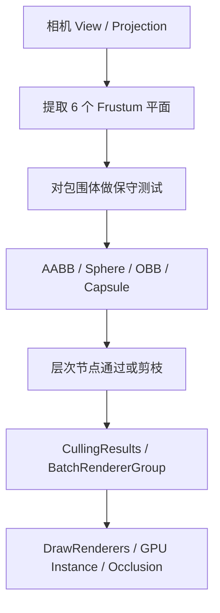
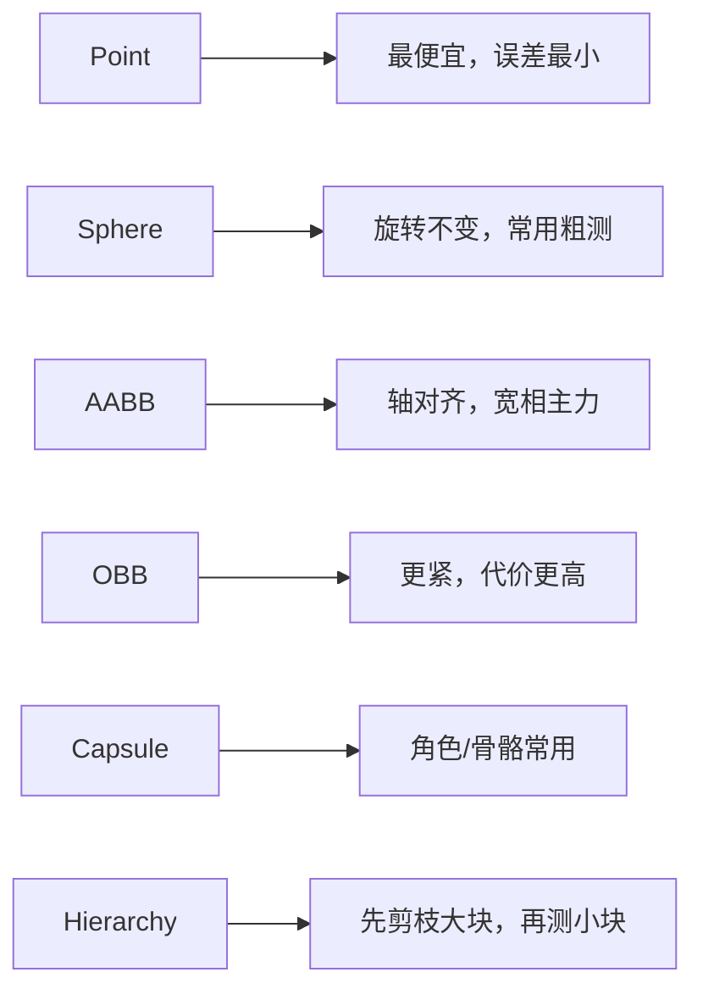
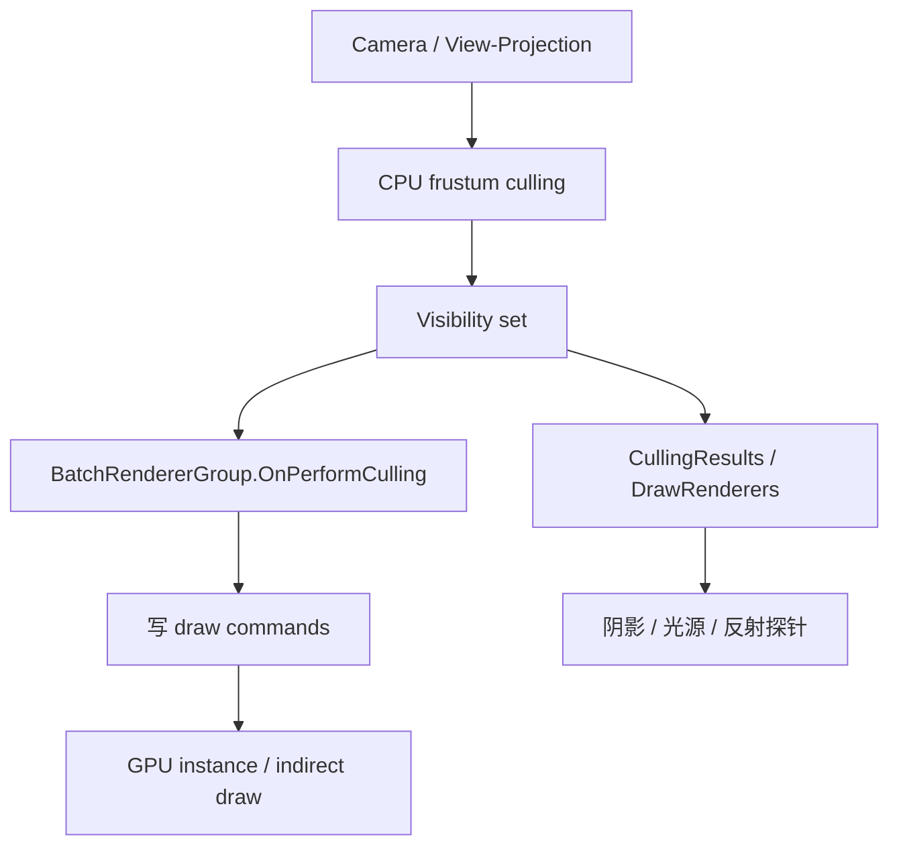

---
date: "2026-04-17"
title: "游戏与引擎算法 44｜视锥体与包围盒测试"
description: "从相机矩阵提取视锥平面，再用点、球、AABB、OBB、胶囊和层次包围体做保守裁剪，把无效渲染尽早挡在 CPU 和 GPU 之外。"
slug: "algo-44-frustum-bounds-tests"
series: "游戏与引擎算法"
weight: 1844
tags:
  - "视锥剔除"
  - "包围盒"
  - "平面提取"
  - "可见性裁剪"
  - "SRP"
  - "DirectXMath"
  - "GPU剔除"
---

视锥体与包围盒测试，本质上是在问：**一个对象的保守外包体，是否还可能进入相机可见域**。

> 版本说明：本篇默认按 Unity SRP / `GeometryUtility` / `CullingResults` 的语义、DirectXMath 的包围体库，以及 Gribb & Hartmann 的平面提取公式来讲。

---

## 问题动机：为什么“看不见”的东西也要先算一遍

渲染瓶颈里最便宜的优化，往往不是“让像素更快”，而是“别把根本不会出现的物体送进后续流水线”。

一帧里可能有：

- 几千个静态网格。
- 几万条粒子。
- 几百个角色部件。
- 数十个光源、反射探针、阴影级联。

如果每个对象都直接进提交阶段，CPU 会浪费在：

- 生成 draw command。
- 收集材质和常量。
- 组装批次。
- 触发 shader variant 和状态切换。

所以，视锥裁剪不是“可选的小优化”，而是**整个可见性管线的第一道过滤器**。

Unity 官方明确说明，`ScriptableRenderContext.Cull` 会根据相机的 `ScriptableCullingParameters` 执行剔除，并把结果放进 `CullingResults`；`GeometryUtility.CalculateFrustumPlanes` 会从相机或 worldToProjection matrix 里算出 6 个平面；`GeometryUtility.TestPlanesAABB` 则用这 6 个平面对包围盒做保守测试。[1][2]

这组 API 的存在本身就说明：**引擎希望你尽早丢掉不可能可见的对象**。

---

## 历史背景：从 2001 年的平面提取到现代引擎的分层剔除

现代视锥剔除的核心套路，基本都能追溯到 Gribb & Hartmann 2001 年的经典文章 *Fast Extraction of Viewing Frustum Planes from the World-View-Projection Matrix*。[3]

那篇文章解决的不是“怎么画得更漂亮”，而是一个非常工程的问题：

`能不能直接从组合矩阵里快速提取出六个视锥平面，而不是回到 FOV、near、far、aspect ratio 重新推一遍。`

这在早期图形 API 里很重要，因为当时的场景剔除、阴影裁剪和碰撞宽相都非常吃 CPU，任何避免重复计算的办法都值得做。

后来的演化很清楚：

- 先有单相机、单对象的视锥剔除。
- 再有包围体测试与层次剔除。
- 再有 `CullingResults`、批次级剔除、LOD 与阴影剔除。
- 再有 `BatchRendererGroup` 这类把剔除回调显式暴露给用户的高性能接口。[4][5]

所以，今天谈视锥剔除，不该只停留在“一个 AABB 和六个平面比不比得上”。

真正的现代问题是：

- 平面怎么从矩阵来？
- 什么包围体该用在什么层？
- 如何保持保守性而不把误差放大成闪烁？
- CPU 剔除和 GPU 剔除怎么接？

---

## 数学基础：视锥体其实是 6 个半空间的交集

视锥体不是一个神秘几何体，它只是 6 个半空间的交集。

### 1. Clip space 的不等式

在标准裁剪空间里，一个点要在可见范围内，必须满足这些不等式：

$$
-w \le x \le w,\quad -w \le y \le w,\quad -w \le z \le w
$$

D3D 风格的 z 约定会有细微差别，但本质一样：**所有边界都能写成平面不等式**。

把它展开，就得到六个平面：

$$
 x + w \ge 0,\quad -x + w \ge 0,
$$

$$
 y + w \ge 0,\quad -y + w \ge 0,
$$

$$
 z + w \ge 0,\quad -z + w \ge 0
$$

这就是为什么平面提取能从组合矩阵里直接做：

`矩阵负责把世界点映射到 clip space；clip space 的边界本来就是六个平面。`

### 2. 平面方程

平面通常写成：

$$
\mathbf{n}\cdot \mathbf{p} + d = 0
$$

其中 `n` 是单位法线，`d` 是平面常数。

点到平面的有符号距离就是：

$$
\delta = \mathbf{n}\cdot\mathbf{p} + d
$$

如果 `\delta < 0`，点在平面外侧；如果 `\delta >= 0`，点在平面内侧。

### 3. 为什么保守测试一定会有误报

如果你拿的是包围体而不是精确网格，测试目标本来就不是“是否完全在内”，而是“是否**可能**在内”。

这意味着：

- 假阳性可以接受。
- 假阴性不可以接受。

这也是 Unity 文档把 `TestPlanesAABB` 明确写成 conservative 的原因：它会把“与平面相交”也判成 true，从而避免漏剔除可见对象。[2]

---

## 结构图 / 流程图



这条链最关键的点是：

`视锥测试不是终点，它只是更大可见性系统的第一层。`

如果后面还有 occlusion culling、LOD、静态批次、实例剔除、GPU 深度金字塔，那么这 6 个平面只是入口。

---

## 平面提取：从矩阵到六个半空间

Gribb & Hartmann 的核心思想很朴素：

- 视锥边界在 clip space 里是简单不等式。
- clip space 由 world-to-clip 矩阵变换而来。
- 因此可以直接从矩阵的行或列组合出平面。

用行向量约定时，左右、上下、远平面的组合比较稳定，但近平面要跟 clip-space 的 z 范围一起看：

$$
P_{left} = r_4 + r_1,\quad P_{right} = r_4 - r_1
$$

$$
P_{bottom} = r_4 + r_2,\quad P_{top} = r_4 - r_2
$$

$$
P_{far} = r_4 - r_3
$$

近平面分两种常见约定：

- OpenGL 风格 clip z in `[-w, w]`：`P_{near} = r_4 + r_3`
- Direct3D / Unity GPU clip z in `[0, w]`：`P_{near} = r_3`

如果你的库是列向量约定，就把“行”换成“列”，或者先做等价转置。关键不是背公式，而是保持整个工程的矩阵约定一致。

这也是为什么在跨库移植时，很多 frustum bug 不是算法错，而是**行列约定和左右乘顺序错**。

---

## 需要测试哪些包围体

视锥测试不是只写一个 AABB 就结束。

引擎里常见的对象外包体至少有这几类：

- `Point`：最便宜，适合骨骼末端、粒子中心、采样点。
- `Sphere`：旋转不变，适合角色、粒子、视效、粗粒度代理。
- `AABB`：轴对齐，宽相和静态场景最常见。
- `OBB`：更紧，但每个平面测试更贵。
- `Capsule`：角色控制器和人体骨架很常见。
- `Hierarchy`：BVH / 八叉树 / 四叉树 / chunk bounds。

### Sphere

球体的测试最简单：

$$
\delta = \mathbf{n}\cdot\mathbf{c} + d
$$

如果 `\delta < -r`，球完全在外。

### AABB

AABB 不需要检查 8 个角点，通常用“支持点”法：

对某个平面法线 `n`，选择 AABB 在该方向上的最远点 `p^+`：

$$
 p_i^+ = \begin{cases}
 max_i, & n_i \ge 0 \\
 min_i, & n_i < 0
 \end{cases}
$$

若 `n · p^+ + d < 0`，则整盒都在平面外。

这比“8 个角点全测”便宜得多。

### OBB

OBB 不能偷懒成 AABB。最常用的保守判定是支持半径：

$$
 r = |\mathbf{n}\cdot\mathbf{u}|e_x + |\mathbf{n}\cdot\mathbf{v}|e_y + |\mathbf{n}\cdot\mathbf{w}|e_z
$$

其中 `u,v,w` 是 OBB 的局部轴，`e_x,e_y,e_z` 是半轴长。

若

$$
\mathbf{n}\cdot\mathbf{c} + d < -r
$$

则 OBB 在外。

### Capsule

胶囊体可以看成“线段扫过一个球”：

$$
 r_{eff} = r + h\,|\mathbf{n}\cdot\mathbf{a}|
$$

其中 `a` 是胶囊轴向单位向量，`h` 是半段长。

测试时只要把球半径替换成 `r_eff` 就能得到保守判定。

---

### 一张图看懂对象类型和保守性



从工程上看，最常见的顺序不是“谁最准”，而是：

`谁最便宜、谁最保守、谁最适合这一层。`

---

## 算法推导：为什么先测大包围体，再测小包围体

如果你拿一个场景的 10 万个对象逐个做精细测试，代价通常是不可接受的。

所以现代引擎会把视锥测试放进一个树形或层次流程里：

1. 先测场景块、Chunk、Node、Cluster 的大包围体。
2. 若整块在外，整块剪掉。
3. 若整块在内，整块放行。
4. 只有“穿边界”的块才继续往下递归。

这类策略的数学本质是：**用包含关系换取早停剪枝**。

在空间分布不均匀时，这个收益极大。若某个区域完全不在视锥里，整棵子树都可以不碰。

这也是为什么本系列里 `BVH`、`Quadtree / Octree` 和 `AABB Broadphase` 都能和视锥剔除互相引用。[6][7]

---

## 算法实现

```csharp
public readonly struct Plane4
{
    public readonly Vector3 Normal;
    public readonly float Distance;

    public Plane4(Vector3 normal, float distance)
    {
        float len = normal.magnitude;
        if (len < 1e-6f)
            throw new ArgumentException("invalid plane normal");
        Normal = normal / len;
        Distance = distance / len;
    }

    public float SignedDistance(in Vector3 p) => Vector3.Dot(Normal, p) + Distance;
}

public readonly struct Frustum
{
    public readonly Plane4 Left, Right, Bottom, Top, Near, Far;

    private Frustum(Plane4 left, Plane4 right, Plane4 bottom, Plane4 top, Plane4 near, Plane4 far)
    {
        Left = left; Right = right; Bottom = bottom; Top = top; Near = near; Far = far;
    }

    public static Frustum FromWorldToClip(in Matrix4x4 m, bool clipZZeroToOne = true)
    {
        // 这里按“行”理解；如果你的数学库是列向量约定，换成对应的列组合即可。
        // clipZZeroToOne=true 对应 Direct3D / Unity GPU 常见约定，near plane 取 r3。
        // clipZZeroToOne=false 对应 OpenGL 经典约定，near plane 取 r4 + r3。
        Vector4 r1 = new(m.m00, m.m01, m.m02, m.m03);
        Vector4 r2 = new(m.m10, m.m11, m.m12, m.m13);
        Vector4 r3 = new(m.m20, m.m21, m.m22, m.m23);
        Vector4 r4 = new(m.m30, m.m31, m.m32, m.m33);
        Vector4 near = clipZZeroToOne ? r3 : (r4 + r3);

        return new Frustum(
            Make(r4 + r1),
            Make(r4 - r1),
            Make(r4 + r2),
            Make(r4 - r2),
            Make(near),
            Make(r4 - r3)
        );

        static Plane4 Make(Vector4 p) => new(new Vector3(p.x, p.y, p.z), p.w);
    }

    public bool TestSphere(in Vector3 center, float radius)
    {
        return TestPlane(Left) && TestPlane(Right) && TestPlane(Bottom) &&
               TestPlane(Top) && TestPlane(Near) && TestPlane(Far);

        bool TestPlane(in Plane4 plane)
        {
            return plane.SignedDistance(center) >= -radius;
        }
    }

    public bool TestAabb(in Vector3 center, in Vector3 extents)
    {
        return TestPlane(Left) && TestPlane(Right) && TestPlane(Bottom) &&
               TestPlane(Top) && TestPlane(Near) && TestPlane(Far);

        bool TestPlane(in Plane4 plane)
        {
            Vector3 n = plane.Normal;
            Vector3 p = new(
                n.x >= 0 ? center.x + extents.x : center.x - extents.x,
                n.y >= 0 ? center.y + extents.y : center.y - extents.y,
                n.z >= 0 ? center.z + extents.z : center.z - extents.z
            );
            return plane.SignedDistance(p) >= 0f;
        }
    }
}
```

这段实现故意保持保守：

- 先标准化平面。
- AABB 用支持点，不枚举 8 个角。
- 没有“看起来更精致”的早期优化。

因为在剔除里，**正确比花哨更值钱**。

---

### 一张图看懂 CPU 剔除、批次剔除和 GPU 接口



Unity 的 `BatchRendererGroup` 文档明确说明：它会在可见性剔除阶段调用 `OnPerformCulling`，并根据返回结果生成一批 draw commands。[4][5]

这就是现代引擎的真实接口形态：

- 先做 CPU 保守剔除。
- 再把可见集合交给批次系统。
- 再让 GPU 或间接绘制处理剩下的提交。

---

## 复杂度分析

视锥测试的渐进复杂度都很低，真正重要的是常数项。

| 目标 | 代价 | 备注 |
|---|---|---|
| 点 | `O(6)` | 6 个平面，最便宜 |
| Sphere | `O(6)` | 每平面 1 次点积 + 1 次比较 |
| AABB | `O(6)` | 支持点法，避免 8 角全测 |
| OBB | `O(6)` | 每平面额外算支持半径 |
| Capsule | `O(6)` | 轴向投影后做球化判断 |
| 树形层次剔除 | 近似 `O(visible + cut)` | 取决于剪枝质量 |

如果你直接拿 AABB 做 8 角全测：

- 6 个平面 × 8 个角点 = 48 次点平面测试。

如果你用支持点法：

- 6 个平面 × 1 个支持点 = 6 次测试。

这就是为什么“包围体测试”看起来简单，工程收益却很大。

---

## 变体与优化

- **先测近/远平面**：经常能更快剪掉完全不在深度范围内的物体。
- **利用时间局部性**：上一帧可见的对象，这一帧大概率仍然可见。
- **按层级测**：先测 cluster / chunk / node，再测 object。
- **静动态分离**：静态几何进 BVH，动态角色进单独粗层。
- **平面顺序按概率排**：先测最容易失败的平面，早停更快。
- **GPU 剔除只吃保守输入**：CPU 端的 bounds 一旦错，GPU 不会替你纠正。

如果场景是室外大地形，视锥剔除通常是最便宜的大头。  
如果场景是室内迷宫，视锥剔除仍然有效，但 occlusion culling 往往更关键。[8]

---

## 对比其他算法

| 方案 | 优点 | 缺点 | 适用场景 |
|---|---|---|---|
| Sphere vs Frustum | 最便宜 | 太松 | 粗层剔除、角色代理 |
| AABB vs Frustum | 便宜且常用 | 旋转物体包围会偏松 | 大多数实时引擎 |
| OBB vs Frustum | 更紧 | 计算更贵 | 重要对象、少量高价值几何 |
| Capsule vs Frustum | 对角色友好 | 只适合特定形状 | 人体、控制器、武器轨迹 |
| Hierarchical Culling | 剪枝强 | 维护复杂 | 大场景、批次系统、ECS |

我对这张表的判断很明确：

- 粗层永远先要便宜。
- 细层才追求更紧。
- 视锥剔除本身不负责“完全精准”，它负责“尽可能少漏掉可见物体”。

---

## 批判性讨论：为什么“保守”不是瑕疵，而是契约

很多人第一次写视锥剔除时，会犯一个直觉错误：

`既然是裁剪，就应该越准越好。`

这在工程上不对。

视锥剔除的约束不是“尽量精确”，而是：

- 不能漏掉真可见物体。
- 可以多放进一些假阳性。

因为假阳性只是多画一点。  
假阴性则是直接消失、闪烁、穿帮。

这也是为什么 Unity 文档会特别提醒 `TestPlanesAABB` 的保守性：平面是无限延展的，包围盒和某个平面相交，并不意味着对象真的在视锥内，但这类误报是允许的。[2]

同样，GPU culling 也不是“更聪明的替代品”。

它只是把同一套保守合同，放进更靠近 GPU 的执行层。

---

## 跨学科视角：半空间、支持函数和层次索引

视锥剔除最像哪门学科？

不是渲染学，而是**计算几何**。

- 半空间交集来自凸几何。
- 支持点和支持半径来自凸分析。
- 层次剔除和 BVH 很像数据库索引里的分层过滤。
- GPU 深度剔除和 Hi-Z 则像多级缓存过滤。

这也是为什么 `AABB broadphase`、`BVH`、`Quadtree / Octree` 和视锥剔除总是一起出现：它们都在做同一件事，只是查询对象不同。[6][7]

---

## 真实案例

### 1. Unity `GeometryUtility`

Unity 官方明确提供 `GeometryUtility.CalculateFrustumPlanes` 和 `GeometryUtility.TestPlanesAABB`，并说明 `TestPlanesAABB` 返回的是保守结果：边界在平面内或与平面相交时都算 true。[1][2]

### 2. Unity `ScriptableRenderContext.Cull` / `CullingResults`

Unity Scripting API 说明 `Cull` 会根据相机参数产生 `CullingResults`，其内容包括可见对象、光源和反射探针，并且这些结果可以复用在同一次 render loop 里。[1][4]

### 3. Unity `BatchRendererGroup`

`BatchRendererGroup` 的文档明确说，它是高性能可定制渲染对象，并通过 `OnPerformCulling` 回调收集可见实例和生成 draw commands。[4][5]

### 4. DirectXMath

DirectXMath 仓库把 `DirectXCollision.h` 作为单独的 bounding volume collision library 暴露出来，这正是 frustum / bounding volume 这一类几何测试的官方落点。[6]

### 5. Gribb & Hartmann 论文

2001 年的平面提取论文仍然是今天很多引擎实现的理论底座：从 world-view-projection matrix 直接抽取六个平面，仍然是最通用的做法之一。[3]

---

## 量化数据

这里给几个足够直接的量化点：

- 视锥体固定由 6 个平面组成。
- `AABB` 用支持点法时，每个对象是 6 次平面测试。
- `Sphere` 每个对象也是 6 次平面测试，但常数更低。
- 朴素 AABB 角点全测是 48 次点平面测试，对比支持点法是 8 倍级别的差距。
- `BatchRendererGroup` 的 `OnPerformCulling` 是按 render pass 触发的，适合把“视图相关可见性”前移到批次级接口。[5]

这类量化不依赖某个机型跑分，但它足够说明：

`裁剪算法的收益，主要来自减少无意义的后续工作，而不是它本身非常复杂。`

---

## 常见坑

### 坑 1：矩阵约定写错

为什么错：行主序、列主序、左右乘混用，会把平面方向全部写反。  
怎么改：统一一个约定，测试左/右/上/下/近/远六个基准点。

### 坑 2：平面没归一化

为什么错：距离阈值会失真，导致测试结果和半径/支持半径不一致。  
怎么改：提取完先 normalize，再做所有包围体测试。

### 坑 3：拿 OBB 当 AABB 测

为什么错：旋转后的盒子会被过度放大，误报多，层次剔除收益下降。  
怎么改：对重要对象改用 OBB 或分层代理。

### 坑 4：把保守测试写成精确测试

为什么错：你会为了“更紧”引入假阴性，物体突然消失。  
怎么改：视锥测试只负责保守剪枝，精确性留给后续阶段。

### 坑 5：把视锥剔除和遮挡剔除混为一谈

为什么错：视锥只看相机范围，不看前后遮挡。  
怎么改：先用视锥，再叠遮挡剔除或 Hi-Z。[8]

---

## 何时用 / 何时不用

**适合用视锥测试的情况：**

- 场景里对象很多，提交阶段已经可见 CPU 压力。
- 你有明确的 bounds，可接受保守误报。
- 你能把剔除结果接进批次系统、LOD、阴影和 GPU 提交。

**不适合单独依赖视锥测试的情况：**

- 对象数量极少。
- 真正瓶颈在像素着色，而不是提交。
- 场景严重室内化，遮挡比视锥更关键。
- 你没有可靠 bounds，测试只会放大错误。

---

## 相关算法

- [游戏与引擎算法 43｜SIMD 数学：Vector4 / Matrix4 向量化]()
- [数据结构与算法 10｜AABB 与碰撞宽相：空间查询的第一道过滤]()
- [数据结构与算法 11｜四叉树与八叉树：空间分区的层次结构]()
- [数据结构与算法 12｜BVH：层次包围体树，光线追踪与碰撞检测的基础]()
- [数据结构与算法 15｜SAT / GJK：窄相碰撞检测的精确算法]()

---

## 小结

视锥体与包围盒测试的关键，不是“算 6 个平面有多复杂”，而是把可见性判断做成一条**保守、分层、尽早剪枝**的管线。

- 平面从矩阵来。
- 包围体按成本分层。
- 剔除结果要接回批次、LOD、阴影和 GPU 提交。

如果你把这件事做对了，后面的渲染、物理和实例化系统都会更轻。

## 参考资料

1. Unity Scripting API, `Rendering.CullingResults` 与 `ScriptableRenderContext.Cull`。[https://docs.unity3d.com/cn/2020.3/ScriptReference/Rendering.CullingResults.html](https://docs.unity3d.com/cn/2020.3/ScriptReference/Rendering.CullingResults.html)
2. Unity Scripting API, `GeometryUtility.CalculateFrustumPlanes` 与 `GeometryUtility.TestPlanesAABB`。[https://docs.unity3d.com/cn/2021.3/ScriptReference/GeometryUtility.CalculateFrustumPlanes.html](https://docs.unity3d.com/cn/2021.3/ScriptReference/GeometryUtility.CalculateFrustumPlanes.html) / [https://docs.unity3d.com/cn/2021.3/ScriptReference/GeometryUtility.TestPlanesAABB.html](https://docs.unity3d.com/cn/2021.3/ScriptReference/GeometryUtility.TestPlanesAABB.html)
3. Gil Gribb, Klaus Hartmann, *Fast Extraction of Viewing Frustum Planes from the World-View-Projection Matrix* (2001)。
4. Unity Scripting API, `BatchRendererGroup` / `OnPerformCulling`。[https://docs.unity3d.com/cn/2022.3/ScriptReference/Rendering.BatchRendererGroup.html](https://docs.unity3d.com/cn/2022.3/ScriptReference/Rendering.BatchRendererGroup.html) / [https://docs.unity3d.com/cn/2023.2/ScriptReference/Rendering.BatchRendererGroup.OnPerformCulling.html](https://docs.unity3d.com/cn/2023.2/ScriptReference/Rendering.BatchRendererGroup.OnPerformCulling.html)
5. Unity Scripting API, `BatchRendererGroup.AddBatch` / `SetGlobalBounds`。[https://docs.unity3d.com/es/current/ScriptReference/Rendering.BatchRendererGroup.AddBatch.html](https://docs.unity3d.com/es/current/ScriptReference/Rendering.BatchRendererGroup.AddBatch.html) / [https://docs.unity3d.com/ja/2022.1/ScriptReference/Rendering.BatchRendererGroup.SetGlobalBounds.html](https://docs.unity3d.com/ja/2022.1/ScriptReference/Rendering.BatchRendererGroup.SetGlobalBounds.html)
6. Microsoft, `DirectXMath` 与 `DirectXCollision.h`。[https://github.com/microsoft/DirectXMath](https://github.com/microsoft/DirectXMath)
7. Unity Manual, Occlusion Culling。[https://docs.unity3d.com/ru/2019.4/Manual/OcclusionCulling.html](https://docs.unity3d.com/ru/2019.4/Manual/OcclusionCulling.html)


