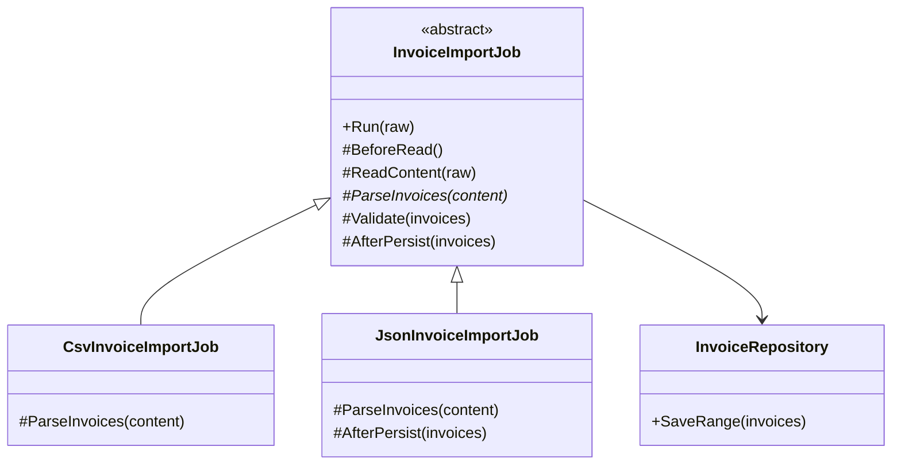
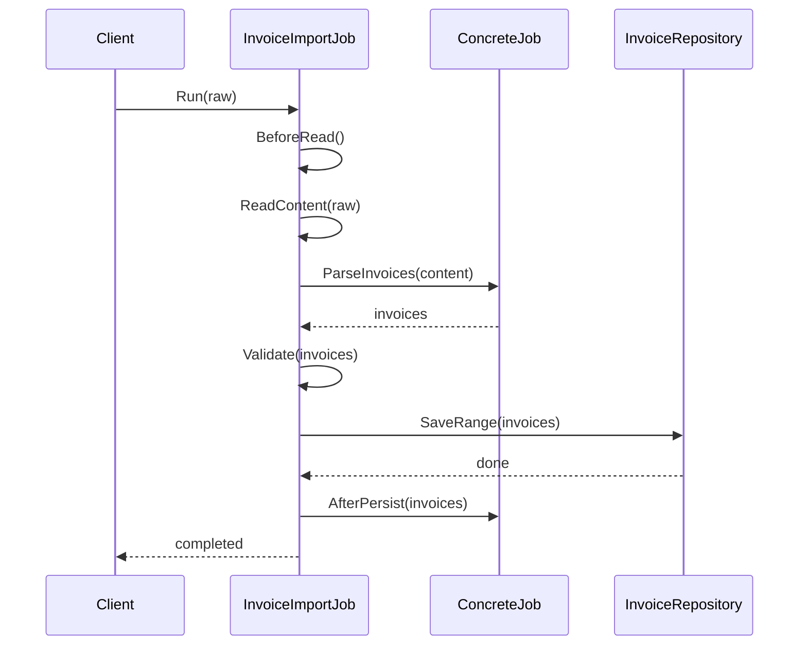

---
date: "2026-04-17"
title: "设计模式教科书｜Template Method：基类定流程，子类填细节"
description: "Template Method 把稳定的算法骨架收进基类，把变化点留给子类。它擅长流程纪律、固定顺序和统一收口，也最容易在现代代码里因为继承过深而变脆弱。"
slug: "patterns-02-template-method"
weight: 902
tags:
  - 设计模式
  - Template Method
  - 软件工程
series: "设计模式教科书"
---

> 一句话定义：Template Method 把算法的固定步骤写进基类，把会变的步骤交给子类填补。

## 历史背景

Template Method 不是凭空长出来的。早期面向对象框架刚出现时，框架作者发现一件事：系统里最难协作的不是“有多少个方法”，而是“这些方法必须按什么顺序运行”。GoF 在 1994 年把这种做法写进《Design Patterns》时，已经有不少 Smalltalk、C++ 和 GUI 框架在用类似的写法。

它背后的时代约束很清楚。那时还没有今天这么轻量的委托、lambda、函数组合，也没有成熟的依赖注入容器。想让外部扩展“某一步”，最直接的手段就是给子类一个钩子，让框架继续掌握总流程。于是，模板方法成了早期框架的主骨架：框架负责秩序，应用负责差异。

今天它仍然有价值，但语气变了。现代 C# 可以用委托、局部函数、管线式组合去替换一部分模板方法；可当你真正需要“顺序不能乱、步骤必须收口、扩展点必须受控”时，模板方法仍然比一堆自由拼装的回调更稳。

## 一、先看问题

很多团队第一次踩坑，都是踩在“流程重复”上。比如一个发票导入系统，CSV、JSON、Excel 三种来源都要走同一条主线：打开数据源、读取内容、解析、校验、写库、审计、收尾。每种格式的差异只在“怎么解析”和“是否需要额外后处理”，可团队往往先写三份完整流程，后面再慢慢补同步。

问题不在于代码短不短，而在于**纪律散了**。一次需求变更，把 CSV 的校验补上了，JSON 忘了；一次重构，把审计日志挪了位置，Excel 没跟着改；下一次再加“导入前预热缓存”，所有分支都得重新跑一遍。流程一旦复制，未来的修补就会复制 bug。

下面这段坏代码能跑，但它把“流程骨架”复制了两次。它看似简单，实则把未来的维护成本提前埋下去了。

```csharp
using System;
using System.Collections.Generic;
using System.Globalization;
using System.Linq;
using System.Text.Json;

public sealed class NaiveInvoiceImporter
{
    private readonly List<string> _auditTrail = new();

    public void ImportCsv(string raw)
    {
        Console.WriteLine("打开 CSV 数据源");
        var invoices = new List<Invoice>();

        foreach (var line in raw.Split('\n', StringSplitOptions.RemoveEmptyEntries | StringSplitOptions.TrimEntries))
        {
            var parts = line.Split(',', StringSplitOptions.TrimEntries);
            invoices.Add(new Invoice(parts[0], decimal.Parse(parts[1], CultureInfo.InvariantCulture)));
        }

        foreach (var invoice in invoices)
        {
            if (string.IsNullOrWhiteSpace(invoice.Number) || invoice.Amount <= 0)
            {
                throw new InvalidOperationException("CSV 数据校验失败");
            }
        }

        _auditTrail.Add($"CSV 导入 {invoices.Count} 条");
        Console.WriteLine("关闭 CSV 数据源");
    }

    public void ImportJson(string raw)
    {
        Console.WriteLine("打开 JSON 数据源");
        var invoices = JsonSerializer.Deserialize<List<Invoice>>(raw) ?? new List<Invoice>();

        foreach (var invoice in invoices)
        {
            if (string.IsNullOrWhiteSpace(invoice.Number) || invoice.Amount <= 0)
            {
                throw new InvalidOperationException("JSON 数据校验失败");
            }
        }

        _auditTrail.Add($"JSON 导入 {invoices.Count} 条");
        Console.WriteLine("关闭 JSON 数据源");
    }
}

public sealed record Invoice(string Number, decimal Amount);
```

这段代码的问题不是“用了循环”，而是把三件不同的事缠在一起了：顺序、差异点、约束。顺序本来应该由框架或基类控制，差异点只应该暴露在少数步骤上，约束则应该在一个地方统一收口。现在它们混成一团，任何变更都得回到调用端手工修。

如果你再往前走一步，会更糟。很多项目会在子类里重写一个半成品流程，再调用 `base`，结果继承层层叠加，谁也说不清到底哪一层决定了最终顺序。这就是 Template Method 试图避免的坑，也是它最容易失手的地方。

## 二、模式的解法

Template Method 的解法很直接：让基类持有主流程，让子类只实现差异步骤。主流程不开放给外界自由拼装，扩展点只出现在少数几个受控位置。这样一来，业务可以变，纪律不变。

下面这份代码是完整可运行的。`InvoiceImportJob.Run` 负责固定顺序，CSV 和 JSON 子类只管自己的解析和少量补充逻辑。你会看到，子类被允许改变的是“局部行为”，不是“流程骨架”本身。

```csharp
using System;
using System.Collections.Generic;
using System.Globalization;
using System.Linq;
using System.Text.Json;

public sealed record Invoice(string Number, decimal Amount);

public sealed class InvoiceRepository
{
    private readonly List<Invoice> _storage = new();

    public void SaveRange(IEnumerable<Invoice> invoices) => _storage.AddRange(invoices);

    public IReadOnlyList<Invoice> GetAll() => _storage;
}

public abstract class InvoiceImportJob
{
    private readonly InvoiceRepository _repository;

    protected InvoiceImportJob(InvoiceRepository repository)
    {
        _repository = repository ?? throw new ArgumentNullException(nameof(repository));
    }

    public void Run(string raw)
    {
        ArgumentNullException.ThrowIfNull(raw);
        Console.WriteLine($"[{JobName}] 打开数据源");

        try
        {
            BeforeRead();
            string content = ReadContent(raw);
            IReadOnlyList<Invoice> invoices = ParseInvoices(content);
            Validate(invoices);
            Persist(invoices);
            AfterPersist(invoices);
            WriteAuditLog(invoices.Count);
        }
        finally
        {
            Console.WriteLine($"[{JobName}] 关闭数据源");
        }
    }

    protected abstract string JobName { get; }

    protected virtual void BeforeRead()
    {
        Console.WriteLine($"[{JobName}] 预热缓存");
    }

    protected virtual string ReadContent(string raw) => raw;

    protected abstract IReadOnlyList<Invoice> ParseInvoices(string content);

    protected virtual void Validate(IReadOnlyList<Invoice> invoices)
    {
        foreach (var invoice in invoices)
        {
            if (string.IsNullOrWhiteSpace(invoice.Number))
            {
                throw new InvalidOperationException("发票编号不能为空");
            }

            if (invoice.Amount <= 0)
            {
                throw new InvalidOperationException("发票金额必须大于 0");
            }
        }
    }

    private void Persist(IReadOnlyList<Invoice> invoices)
    {
        _repository.SaveRange(invoices);
        Console.WriteLine($"[{JobName}] 已写入 {invoices.Count} 条记录");
    }

    protected virtual void AfterPersist(IReadOnlyList<Invoice> invoices)
    {
        // 默认钩子：大多数导入流程不需要额外动作。
    }

    private void WriteAuditLog(int count)
    {
        Console.WriteLine($"[{JobName}] 审计日志：本次导入 {count} 条记录");
    }
}

public sealed class CsvInvoiceImportJob : InvoiceImportJob
{
    public CsvInvoiceImportJob(InvoiceRepository repository) : base(repository) { }

    protected override string JobName => "CSV 导入";

    protected override IReadOnlyList<Invoice> ParseInvoices(string content)
    {
        var result = new List<Invoice>();

        foreach (var line in content.Split('\n', StringSplitOptions.RemoveEmptyEntries | StringSplitOptions.TrimEntries))
        {
            var parts = line.Split(',', StringSplitOptions.TrimEntries);
            if (parts.Length != 2)
            {
                throw new FormatException($"CSV 行格式错误：{line}");
            }

            result.Add(new Invoice(parts[0], decimal.Parse(parts[1], CultureInfo.InvariantCulture)));
        }

        return result;
    }
}

public sealed class JsonInvoiceImportJob : InvoiceImportJob
{
    public JsonInvoiceImportJob(InvoiceRepository repository) : base(repository) { }

    protected override string JobName => "JSON 导入";

    protected override IReadOnlyList<Invoice> ParseInvoices(string content)
    {
        return JsonSerializer.Deserialize<List<Invoice>>(content, new JsonSerializerOptions
        {
            PropertyNameCaseInsensitive = true
        }) ?? new List<Invoice>();
    }

    protected override void AfterPersist(IReadOnlyList<Invoice> invoices)
    {
        decimal totalAmount = invoices.Sum(x => x.Amount);
        Console.WriteLine($"[JSON 导入] 汇总金额 {totalAmount.ToString(CultureInfo.InvariantCulture)}");
    }
}

public static class Program
{
    public static void Main()
    {
        var repository = new InvoiceRepository();

        InvoiceImportJob csvJob = new CsvInvoiceImportJob(repository);
        csvJob.Run("INV-001,120.5\nINV-002,88.8");

        Console.WriteLine();

        InvoiceImportJob jsonJob = new JsonInvoiceImportJob(repository);
        jsonJob.Run("""
        [
          { "Number": "INV-003", "Amount": 199.9 },
          { "Number": "INV-004", "Amount": 300.0 }
        ]
        """);

        Console.WriteLine();
        Console.WriteLine($"仓库总记录数：{repository.GetAll().Count}");
    }
}
```

这段代码体现了 Template Method 的三个关键点。

第一，**流程骨架只写一次**。  
`Run` 统一规定了读取、解析、校验、持久化、审计、关闭的顺序。以后你要在导入前后加鉴权、加指标、加异常埋点，只改基类即可。

第二，**可变点被明确标出来**。  
`ParseInvoices` 是强制子类实现的差异点；`BeforeRead` 和 `AfterPersist` 是可选钩子。这样一来，扩展者知道自己“能改什么、不能改什么”。

第三，**约束被内建进了结构**。  
子类不需要记住“导入后一定要写审计日志”，因为这个要求已经被模板方法封装了。好的模板方法不是帮你少写几行代码，而是帮你把流程纪律写进类型结构里。

## 三、结构图



图里最重要的不是继承，而是那条隐藏的规则：`Run` 代表不可变顺序，抽象步骤代表可变点。继承只是承载这种规则的手段。

## 四、时序图



从运行时看，调用入口始终在基类，子类只是被基类回调。这也是它和很多“子类自己决定怎么干”的继承写法最本质的区别。

## 五、变体与兄弟模式

Template Method 常见的变体主要有三种。

第一种是**钩子方法**。  
不是所有步骤都必须让子类重写。有些步骤只是“可以插一脚”，例如上例里的 `AfterPersist`。默认实现保持空行为，真正需要扩展时再覆盖。钩子方法比纯抽象方法更温和，因为它允许框架为大多数场景提供默认行为。

第二种是**部分模板**。  
有些基类不会把整条业务流程全部写死，而是只固定最关键的半段流程。例如只固定“校验 + 提交事务 + 审计”，其他外围步骤仍留给外层服务组合。这种写法比“大而全的基类”更容易演进。

第三种是**模板里嵌套其他模式**。  
很多成熟框架里，模板方法不会单独出现，而是内部再调用 Strategy、Factory Method 或者 Command。换句话说，Template Method 负责守住顺序，其他模式负责填充局部策略。

它最容易和两个兄弟模式混淆。

- 和 Hook Method 的关系：Hook 不是另一个独立模式，更像 Template Method 内部常见的扩展点设计。
- 和 Inheritance-based Framework 的关系：很多框架都“让你继承一个基类”，但只有当基类明确掌控主流程、子类只补局部步骤时，它才叫 Template Method。

## 六、对比其他模式

| 对比项 | Template Method | Strategy | Factory Method |
|---|---|---|---|
| 关注点 | 固定流程顺序，开放局部步骤 | 替换整段算法 | 决定创建哪种对象 |
| 复用方式 | 通过继承复用骨架 | 通过组合替换行为 | 通过创建点延迟决定产品 |
| 变化发生位置 | 基类内部定义步骤 | 外部注入不同策略 | 子类或工厂决定实例 |
| 适合的问题 | 先后顺序稳定，步骤细节变化 | 算法整体可互换 | 创建逻辑复杂或需要解耦 |
| 常见风险 | 基类膨胀、继承层次过深 | 策略数量爆炸 | 工厂层级过多 |

最值得展开说的是 Template Method 和 Strategy。

两者都在解决“变化”，但变化的粒度不同。  
如果你要保护的是“流程骨架”，例如“先校验再持久化再审计”永远不能乱，那么 Template Method 更合适。  
如果你要保护的是“同一阶段可以换不同算法”，例如“运费算法今天按重量、明天按地区”，那么 Strategy 更灵活。

一个很实用的判断问题是：**这套顺序能不能让调用方自由拼装？**  
如果不能，说明顺序本身就是规则，应该由 Template Method 掌控。  
如果能，说明顺序不是核心约束，往往更接近 Strategy 或普通组合。

## 七、批判性讨论

模板方法最受批评的点，就是它太依赖继承。继承一旦多了，基类和子类就会互相绑死：基类不能随便改，子类也不能随便动。尤其是当基类后来新增一个虚步骤，旧子类可能根本没准备好，这就是经典的“脆弱基类问题”。

另一个风险是“看似统一，实则硬编码”。如果基类把太多细节写死，扩展点又不够清晰，子类为了适配现实差异只能到处钻 `protected` 字段和内部状态。最后你会得到一个谁都不敢改的祖宗类，模板方法变成模板牢笼。

现代语言让这件事轻了不少。C# 的委托、局部函数、记录类型和模式匹配，都能替代一部分“为了扩展而继承”的场景。很多今天还在写的模板方法，其实可以改成“固定流程 + 注入几个函数”，代码更短，也更容易测试。可一旦你真的需要强顺序、强约束、强收口，模板方法仍然比散落的回调更可控。

所以对它的批判不是“过时了”，而是“别滥用”。它适合流程纪律强的地方，不适合把所有可变性都塞进继承树。

## 八、跨学科视角

模板方法和编译器特别像。编译器通常按固定阶段走：词法分析、语法分析、语义检查、优化、代码生成。每个阶段都有严格顺序，但不同语言、不同平台、不同后端的细节又会不同。骨架不能乱，局部实现可以换，这正是模板方法的思维。

它和数据库迁移、ETL 任务也很像。导入前准备、数据读取、转换、落库、审计，这些阶段的先后顺序通常是硬规则。你可以换源、换目标、换校验，但很少有人愿意让“先审计再读取”这种顺序随便浮动。顺序稳定，局部变化，模板方法就自然出现了。

从函数式视角看，它像“把大流程写成一个高阶控制函数，再把局部步骤作为参数传进去”。但真正要抓住的不是顺序，而是流程主权：谁能启动流程、谁能改步骤顺序、谁只能在钩子里补差异，都由基类掌控。OO 时代常用继承表达这种控制权，现代语言更喜欢用函数值、委托或中间件管线表达。思想没变，控制权的归属没变，表达法变了。

## 九、真实案例

Template Method 不是抽象教条，真实框架里天天在用。

- [dotnet/runtime - `System.IO.Stream.cs`](https://github.com/dotnet/runtime/blob/main/src/libraries/System.Private.CoreLib/src/System/IO/Stream.cs)：`CopyTo` / `CopyToAsync` 在基类里固定了读取、写入、回收缓冲区的顺序，具体流类型只需要提供 `Read` / `ReadAsync` / `Write` 等原语。源码里还明确解释了缓冲区大小与 LOH 阈值的取舍。
- [dotnet/aspnetcore - `ComponentBase.cs`](https://github.com/dotnet/aspnetcore/blob/main/src/Components/Components/src/ComponentBase.cs)：Blazor 组件把 `SetParametersAsync`、`OnInitialized`、`OnParametersSet`、`BuildRenderTree` 组织成稳定生命周期，派生组件只改局部钩子。官方文档也把这些生命周期方法当作组件渲染约定的一部分。

这两处都说明同一件事：只要框架想掌握主流程，模板方法就会自然出现。它不是过时技巧，而是“框架拥有节奏”的直接表达。

## 十、常见坑

第一个坑是把基类写成上帝类。一个模板方法类一旦塞进十几个步骤，子类就会被迫覆盖半个流程，最后失去模板方法最初的约束意义。修正方法很简单：先问自己，哪些步骤真的必须固定，哪些只是碰巧放在一起。

第二个坑是让子类突破不变量。基类已经保证了“先校验再持久化”，子类却能改内部状态、回头重写结果，等于把模板方法的保护墙拆掉。修正思路是减少 `protected` 状态，把真正的共享数据收紧到私有字段里。

第三个坑是把可替换算法硬塞进模板。比如运费规则、折扣规则、排序规则本质上是“算法可换”，却硬套成继承模板，最后每加一条规则都要新建一个子类。修正方法是先问：顺序是规则，还是算法才是规则？

第四个坑是重写构造器里的虚调用。很多脆弱基类问题，都是从“构造函数里调用虚方法”开始的。对象还没完全成型，就已经把控制权交给子类，出错概率会非常高。模板方法要放在稳定的生命周期入口里，而不是半初始化阶段。

## 十一、性能考量

模板方法本身几乎不贵，贵的是你为了它付出的结构成本。一次虚调用、几次钩子回调，通常远小于 IO、网络和序列化的成本。真正该关注的是：这条骨架是不是让调用链更清楚，而不是更绕。

`Stream.CopyTo` 是个很好的例子。源码里明确提到，默认缓冲区大小曾按 4096 的倍数、并尽量低于 85KB 的 LOH 阈值来选；后来又借助 `ArrayPool` 重用缓冲区，减少频繁分配。这个数据说明一件事：模板方法的性能重点往往不在“虚调用”，而在“骨架里能不能把临时对象收紧”。

如果你把模板方法放进极高频路径，比如每个像素、每个实体、每个小对象都要走一次，它的继承分派就开始有意义了。这个时候，更轻的做法通常是委托、静态函数、结构体策略，甚至直接把控制流程扁平化。

## 十二、何时用 / 何时不用

适合用：

- 流程顺序稳定，但局部步骤会因来源、平台、产品线而变。
- 团队需要把校验、事务、审计、埋点这类纪律性动作统一收口。
- 扩展者应该“只能改这些点”，而不是随便改整段流程。

不适合用：

- 差异主要体现在算法整体，而不是步骤里的某个小点。
- 流程还在快速变化，今天五步、明天八步，骨架并不稳定。
- 你只是想消除少量重复代码，没有明确的顺序约束。

一句话判断：**顺序本身是规则，就用 Template Method；算法本身是可替换件，就优先想 Strategy。**

## 十三、相关模式

- [Strategy](./patterns-03-strategy.md)：Template Method 固定顺序，Strategy 替换整段算法。
- [Builder](./patterns-04-builder.md)：Builder 关注“分步构造对象”，Template Method 关注“分步执行流程”。
- [Factory Method 与 Abstract Factory](./patterns-09-factory.md)：模板方法里常把“某一步造什么对象”委托给工厂方法。

## 十四、在实际工程里怎么用

这个模式在工程里非常常见，只是很多团队没把它叫出来。

- 构建系统：准备环境、生成计划、执行、收尾，这类步骤顺序通常很稳，差异只落在少数阶段。
- 后端任务：批处理、报表、ETL、定时任务，常常都需要统一审计和异常清理。
- UI 与引擎框架：生命周期方法、渲染回调、资源导入流程，经常都是框架掌握节奏，业务填空白。

应用线占位链接：

- [BuildConfig 为什么是 Template Method](../../engine-toolchain/build-system/buildconfig-template-method.md)
- [Strategy vs Template Method：我们为什么没拆成策略接口](../../engine-toolchain/build-system/strategy-vs-template-method.md)

## 小结

- 它把“先做什么、后做什么”写成结构约束，而不是口头约定。
- 它把变化收进少数几个钩子里，扩展者知道自己能改哪儿。
- 它最适合流程纪律强、顺序不能乱、横切动作很多的工程场景。

一句话总括：Template Method 不是为了继承而继承，而是为了把流程纪律写进代码里。

