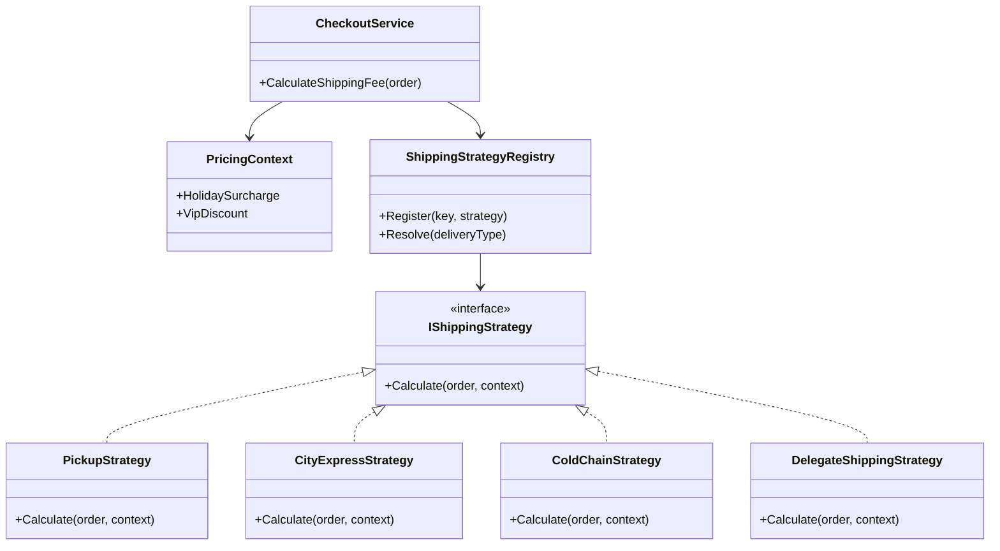
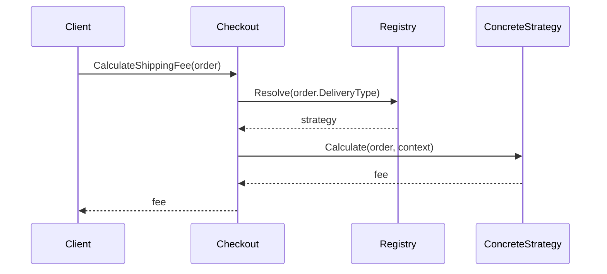

---
date: "2026-04-17"
title: "设计模式教科书｜Strategy：算法即对象，运行时替换"
description: "Strategy 用来处理同一类任务存在多种可替换算法的情况。它把变化从条件分支里拆出来封装成对象，让系统可以在运行时切换规则，而不把调用方变成越来越长的 if-else 总控台。"
slug: "patterns-03-strategy"
weight: 903
tags:
  - 设计模式
  - Strategy
  - 软件工程
series: "设计模式教科书"
---

> 一句话定义：Strategy 把一组可互换的算法封装成独立对象，让调用方在运行时选择或切换它们。

## 历史背景

Strategy 的历史，比“把算法写成类”这件事本身更早。早期 Smalltalk、C++ 和 Java 时代，程序员已经在用“可插拔比较器”“可替换排序器”“回调函数”解决同一类问题。GoF 只是把这种思路收拢成一个清晰的名字：把变化中的算法从调用方手里拿出去，交给独立对象。

它出现得很自然，因为那个年代的语言还不够轻。没有今天这么顺手的 lambda、局部函数和函数值时，算法要想被替换，最稳妥的方式就是对象化。对象有身份、可注入、可测试，也能承载少量状态，于是 Strategy 就成了“把规则拆成可插拔部件”的标准做法。

现代 C# 让它轻了不少。很多过去必须写成一堆策略类的地方，现在一个 `Func<T, TResult>` 就够了；但当策略不止一行逻辑，还要带状态、注册、日志、权限或组合时，Strategy 依然是最干净的边界表达。

## 一、先看问题

电商结算里最容易失控的一类代码，就是“规则分支越长越像配置中心，越改越像事故中心”。以运费计算为例，看起来只是一个价格函数，真实情况却不断膨胀：同城配送按距离，冷链按重量，到店自提免运费，节假日加收高峰费，VIP 用户再扣一笔。

如果不用模式，很多项目会把所有规则堆进一个大方法里。最开始只有三个 `if`，后来就会长成一堵墙，而且任何新渠道都必须改这堵墙。问题不只是难看，而是每次改动都在碰同一个高风险区域。

```csharp
using System;

public sealed class Order
{
    public string DeliveryType { get; set; } = "";
    public decimal WeightKg { get; set; }
    public decimal DistanceKm { get; set; }
    public bool IsVip { get; set; }
    public bool IsHoliday { get; set; }
}

public sealed class NaiveShippingCalculator
{
    public decimal Calculate(Order order)
    {
        decimal fee;

        if (order.DeliveryType == "Pickup")
        {
            fee = 0m;
        }
        else if (order.DeliveryType == "CityExpress")
        {
            fee = 8m + order.DistanceKm * 1.8m;
        }
        else if (order.DeliveryType == "ColdChain")
        {
            fee = 18m + order.WeightKg * 4m;
        }
        else
        {
            throw new NotSupportedException("未知配送方式");
        }

        if (order.IsHoliday)
        {
            fee += 6m;
        }

        if (order.IsVip && order.DeliveryType != "ColdChain")
        {
            fee -= 3m;
        }

        return Math.Max(fee, 0m);
    }
}
```

这段代码的毛病不在于它用了 `if`，而在于它把多种变化硬塞进一个决策点：配送方式在变化，节假日规则在变化，会员规则也在变化。于是结算服务越来越像一个“知道所有规则”的总控台。

一旦你把不同算法放进同一个大方法，调用方就会对所有算法细节负责，系统耦合点也会不断上升。Strategy 的切入点就是：先承认这些规则会分化，再把它们拆成独立可替换的算法单元。

## 二、模式的解法

Strategy 的思路是：**调用方不负责实现算法，只负责挑选算法。** 结算服务只知道“我要算运费”，至于具体怎么算，是策略对象的职责。下面是一份完整可运行的实现。

```csharp
using System;
using System.Collections.Generic;

public sealed class Order
{
    public string DeliveryType { get; init; } = "";
    public decimal WeightKg { get; init; }
    public decimal DistanceKm { get; init; }
    public bool IsVip { get; init; }
    public bool IsHoliday { get; init; }
}

public sealed class PricingContext
{
    public decimal HolidaySurcharge { get; init; } = 6m;
    public decimal VipDiscount { get; init; } = 3m;
}

public interface IShippingStrategy
{
    string Name { get; }
    decimal Calculate(Order order, PricingContext context);
}

public sealed class PickupStrategy : IShippingStrategy
{
    public string Name => "到店自提";

    public decimal Calculate(Order order, PricingContext context)
    {
        decimal fee = 0m;

        if (order.IsHoliday)
        {
            fee += context.HolidaySurcharge;
        }

        if (order.IsVip)
        {
            fee -= context.VipDiscount;
        }

        return Math.Max(fee, 0m);
    }
}

public sealed class CityExpressStrategy : IShippingStrategy
{
    public string Name => "同城急送";

    public decimal Calculate(Order order, PricingContext context)
    {
        decimal fee = 8m + order.DistanceKm * 1.8m;

        if (order.IsHoliday)
        {
            fee += context.HolidaySurcharge;
        }

        if (order.IsVip)
        {
            fee -= context.VipDiscount;
        }

        return Math.Max(fee, 0m);
    }
}

public sealed class ColdChainStrategy : IShippingStrategy
{
    public string Name => "冷链配送";

    public decimal Calculate(Order order, PricingContext context)
    {
        decimal fee = 18m + order.WeightKg * 4m;

        if (order.IsHoliday)
        {
            fee += context.HolidaySurcharge;
        }

        return fee;
    }
}

public sealed class DelegateShippingStrategy : IShippingStrategy
{
    private readonly Func<Order, PricingContext, decimal> _calculator;

    public DelegateShippingStrategy(string name, Func<Order, PricingContext, decimal> calculator)
    {
        if (string.IsNullOrWhiteSpace(name))
        {
            throw new ArgumentException("Strategy name cannot be empty.", nameof(name));
        }

        Name = name;
        _calculator = calculator ?? throw new ArgumentNullException(nameof(calculator));
    }

    public string Name { get; }

    public decimal Calculate(Order order, PricingContext context) => _calculator(order, context);
}

public sealed class ShippingStrategyRegistry
{
    private readonly Dictionary<string, IShippingStrategy> _strategies = new(StringComparer.OrdinalIgnoreCase);

    public ShippingStrategyRegistry Register(string key, IShippingStrategy strategy)
    {
        _strategies[key] = strategy ?? throw new ArgumentNullException(nameof(strategy));
        return this;
    }

    public IShippingStrategy Resolve(string deliveryType)
    {
        if (_strategies.TryGetValue(deliveryType, out var strategy))
        {
            return strategy;
        }

        throw new NotSupportedException($"未注册配送策略：{deliveryType}");
    }
}

public sealed class CheckoutService
{
    private readonly ShippingStrategyRegistry _registry;
    private readonly PricingContext _context;

    public CheckoutService(ShippingStrategyRegistry registry, PricingContext context)
    {
        _registry = registry;
        _context = context;
    }

    public decimal CalculateShippingFee(Order order)
    {
        IShippingStrategy strategy = _registry.Resolve(order.DeliveryType);
        Console.WriteLine($"使用策略：{strategy.Name}");
        return strategy.Calculate(order, _context);
    }
}

public static class Program
{
    public static void Main()
    {
        var registry = new ShippingStrategyRegistry()
            .Register("Pickup", new PickupStrategy())
            .Register("CityExpress", new CityExpressStrategy())
            .Register("ColdChain", new ColdChainStrategy())
            .Register(
                "CustomNight",
                new DelegateShippingStrategy("夜间专送", (order, context) =>
                {
                    decimal fee = 12m + order.DistanceKm * 2.1m;
                    if (order.IsVip)
                    {
                        fee -= context.VipDiscount;
                    }

                    return Math.Max(fee, 0m);
                }));

        var checkout = new CheckoutService(registry, new PricingContext());

        var cityOrder = new Order
        {
            DeliveryType = "CityExpress",
            DistanceKm = 12,
            IsVip = true,
            IsHoliday = false
        };

        var coldOrder = new Order
        {
            DeliveryType = "ColdChain",
            WeightKg = 4.5m,
            IsHoliday = true
        };

        Console.WriteLine($"同城订单运费：{checkout.CalculateShippingFee(cityOrder)}");
        Console.WriteLine($"冷链订单运费：{checkout.CalculateShippingFee(coldOrder)}");
    }
}
```

这里最重要的变化不是“把 if 拆开了”，而是职责重新分配了。`CheckoutService` 只负责发起计算，不再知道每种渠道怎么算。每种策略只关心自己的规则，修改某一条规则不会波及别的策略。

这使得系统获得了两种弹性。第一种是**运行时弹性**：策略可以按订单类型、用户等级、配置中心开关、A/B 实验结果动态切换。第二种是**组织弹性**：当一个团队负责同城配送，一个团队负责冷链配送时，两个策略可以分别迭代，而不必抢改同一个大方法。

Strategy 的另一个核心价值是，它把“算法”变成可以替换的对象。对象化之后，测试、注入、缓存、注册、灰度都变简单了。你不再拿一个巨型方法做所有判断，而是拿一个很小的稳定接口做调度。

## 三、结构图



这张图里最关键的关系是“调用方依赖抽象策略，而不是依赖某个具体算法”。只要这条依赖关系守住，算法就能独立演进。

## 四、时序图



注意这里的运行时流程：客户端并不直接接触具体算法。它只看到“结算服务 + 策略抽象”。这就是 Strategy 能替换算法而不污染调用端的原因。

## 五、变体与兄弟模式

Strategy 的常见变体主要有三类。

第一类是**无状态策略**。  
像上面的运费算法，大多不持有上下文，只根据入参计算结果。这类策略最容易复用，也最适合做成单例或注册表常驻对象。

第二类是**带配置的策略**。  
例如折扣算法依赖后台下发的费率、会员规则、实验开关。此时策略本身可以持有配置，也可以在执行时从上下文读取配置。它比硬编码常量更可运营。

第三类是**组合策略**。  
比如先算基础运费，再叠加节假日附加费，再应用会员折扣。此时你可以把“单一策略”进一步组合成“策略链”或“装饰策略”，让小规则拼成大规则。

它最容易和三个兄弟模式混淆。

- 和 Template Method：两者都在处理变化，但 Template Method 固定顺序，Strategy 替换算法。
- 和 State：State 也常用“持有一个对象来委派行为”，但 State 关注对象状态迁移，Strategy 关注算法可替换。
- 和 Command：Command 封装的是“请求”或“动作”，Strategy 封装的是“算法”。

## 六、对比其他模式

| 对比项 | Strategy | Template Method | Command | State |
|---|---|---|---|---|
| 封装对象 | 算法 | 流程骨架中的变化步骤 | 请求或操作 | 状态下的行为 |
| 复用手段 | 组合 | 继承 | 对象化动作 | 状态对象切换 |
| 选择时机 | 运行时最常见 | 设计时确定骨架 | 调用时创建并执行 | 状态迁移时切换 |
| 调用方知道什么 | 只知道策略接口 | 只知道模板入口 | 只知道命令接口 | 只知道状态接口 |
| 最典型场景 | 运费、排序、路由、折扣 | 导入、发布、构建流程 | 撤销、队列、重放 | UI、AI、协议状态 |

Strategy 和 Template Method 是最常被拿来对比的一对。前者替换的是“算法本身”，后者守住的是“顺序骨架”。如果你想让调用方随时切换规则，Strategy 更轻；如果你想让调用方不能乱改流程，Template Method 更稳。

Strategy 和 Command 也会被混。一个封装“怎么做”，一个封装“要做什么”。前者偏规则，后者偏动作。再往后看，State 则是在“行为跟着状态变”的场景里，把条件分支拆成状态对象。

## 七、批判性讨论

Strategy 很好，但它也很容易被滥用。最常见的问题是“每来一个分支就建一个策略类，最后策略数量爆炸”。如果很多所谓策略只差一个系数，例如“满 99 打九折”和“满 199 打八五折”，更合理的做法可能是参数化策略，而不是十几个几乎一样的类。

第二个问题是接口被写胖了。真正的 Strategy 接口通常只有一个核心方法；如果你给它塞了七八个方法，多半说明你不是在建模可替换算法，而是在把多个职责硬装进一个抽象里。

第三个问题是调用方仍然知道太多策略细节。比如外层服务还在写“先判断是不是 VIP，再决定用哪个策略，再额外补一个节假日修正”，那你只是把一部分逻辑挪走了，并没有真正把算法边界封装完整。

现代 C# 还提供了更轻的替代品。对于一两个分支、单一返回值、没有复杂状态的场景，`Func<>`、`Comparison<>`、`switch` 表达式和局部函数往往比一堆策略类更合适。Strategy 不是默认答案，它是边界已经清楚、变化已经稳定时的答案。

## 八、跨学科视角

Strategy 和函数式编程的关系最直接。`Func<Order, decimal>` 本质上就是一个高阶函数值：算法不再以“类”的形式存在，而是以“值”的形式存在。只要签名能表达清楚，策略对象就可以退化成委托，甚至退化成一个纯函数。

这也是为什么 `Comparison<T>`、`IComparer<T>`、`Predicate<T>` 这些类型特别像 Strategy。它们本质上就是把一个“可变规则”提升成参数，再让调用方在运行时挑选。OO 语言把它包成对象，函数式语言把它包成函数，思想是一致的。

从类型论视角看，Strategy 就是“同一个输入域上的不同映射”。它把“行为差异”从控制流里拔出来，转成显式的类型参数或对象依赖。你不是在猜分支走哪条路，而是在直接拿到一个能执行的规则。

## 九、真实案例

Strategy 不是教材里的幻影，它在工业代码里非常常见。

- [dotnet/runtime - `List.cs`](https://github.com/dotnet/runtime/blob/main/src/libraries/System.Private.CoreLib/src/System/Collections/Generic/List.cs) / [List<T>.Sort](https://learn.microsoft.com/en-us/dotnet/api/system.collections.generic.list-1.sort?view=net-9.0) / [IComparer<T>](https://learn.microsoft.com/en-us/dotnet/api/system.collections.generic.icomparer-1?view=net-9.0)：.NET 直接把比较器作为可注入策略。`Sort` 可以接受 `IComparer<T>` 或 `Comparison<T>`，默认比较器则交给 `Comparer<T>.Default`。
- [dotnet/aspnetcore - `SystemTextJsonOutputFormatter.cs`](https://github.com/dotnet/aspnetcore/blob/main/src/Mvc/Mvc.Core/src/Formatters/SystemTextJsonOutputFormatter.cs) / [`OutputFormatter`](https://learn.microsoft.com/en-us/dotnet/api/microsoft.aspnetcore.mvc.formatters.outputformatter?view=net-10.0) / [Web API formatting](https://learn.microsoft.com/en-us/aspnet/core/web-api/advanced/formatting?view=aspnetcore-8.0)：MVC 的输出格式化器就是一组可替换策略。框架根据请求内容协商挑选 JSON、XML 或自定义格式器，这个具体实现文件把“策略选择”落在了源码层。

这两组例子说明，Strategy 最常见的落点就是“同一入口，不同规则”。一个是集合排序，一个是 HTTP 响应格式。它们不是同一个业务，却长着同一种结构。

## 十、常见坑

第一个坑是策略类碎成一地。策略太多，调用方还要先搞清楚名字、注册时机和依赖关系，最后反而比 `if/else` 更难维护。修正方法是先分层，再决定是否真需要对象化。

第二个坑是策略接口写成“万能插口”。一个策略接口只要还承担别的职责，它就会迅速变脏。修正方法是让策略接口保持单一：只做一件事，只暴露一个稳定入口。

第三个坑是忽略状态边界。策略对象如果持有大量可变状态，就会让“可替换算法”变成“带副作用的小对象”。修正方法是把状态放在上下文里，把策略尽量做成无状态或只读。

第四个坑是把状态机误写成 Strategy。订单从“待支付”到“已支付”到“已关闭”，这类变化不是“换算法”，而是“换状态”。如果你把它写成策略切换，后面会很难表达合法迁移。

## 十一、性能考量

Strategy 的成本通常来自三处：一次间接调用、可能的对象分配、以及策略查找或注册表解析。对大多数业务系统来说，这些都不是主要瓶颈。真正值得关心的是：策略切换有没有让代码更容易局部优化和测试。

在热路径里，最省的做法通常不是“到处 new 策略对象”，而是把无状态策略做成单例或静态实例。像 `Comparison<T>`、`IComparer<T>` 这种小接口，在调用频率高时非常适合缓存。若是委托版本，静态 lambda 或非捕获局部函数也能减少分配。

`List<T>.Sort(IComparer<T>)` 的官方文档明确写了它是 `O(n log n)`，而且底层会用 introspective sort。这个数字提醒我们：策略本身的选择成本通常不重要，真正昂贵的是策略被调用的次数，以及策略内部做了什么。对排序来说，比较器被调用很多次，所以比较器要小、稳、无副作用。

## 十二、何时用 / 何时不用

适合用：

- 同一件事存在多种算法，而且这些算法会不断扩展或替换。
- 你希望把规则从长条件分支中拆出来。
- 你希望按运行时配置、用户类型、渠道类型动态切换行为。

不适合用：

- 所谓“多种算法”其实只差一两个参数。
- 调用方永远只会有一种实现，未来也几乎不变。
- 问题的核心不是算法替换，而是流程顺序约束或状态迁移。

经验上可以这样判断：**如果你想消灭的是一串不断增长的 if-else，且每个分支本质上是另一套算法，Strategy 往往就是对的。**

## 十三、相关模式

- [Template Method](./patterns-02-template-method.md)：Template Method 固定骨架，Strategy 替换骨架中的某段算法。
- [Command](./patterns-06-command.md)：Strategy 代表算法，Command 代表操作。
- [Factory Method 与 Abstract Factory](./patterns-09-factory.md)：当策略的创建逻辑复杂时，常常会配合工厂统一产生策略对象。

## 十四、在实际工程里怎么用

Strategy 在工程里出现得非常频繁，因为很多真实系统都在处理“同一任务，不同规则”。

- Unity 游戏：AI 行为切换、伤害结算、技能选目标规则、不同平台输入映射。
- 构建系统：版本号生成、渠道命名、打包参数差异、不同项目的发布策略。
- 渲染与后端：缓存淘汰策略、负载均衡策略、重试策略、序列化策略。

后续应用线占位：

- [Strategy vs Template Method：我们为什么没拆成策略接口](../../engine-toolchain/build-system/strategy-vs-template-method.md)

## 小结

- Strategy 的核心价值，是把变化中的算法从大分支里拆出来，变成可独立演进的对象。
- 它让调用方依赖抽象，而不是依赖某一种具体规则，于是运行时切换成为可能。
- 它最擅长处理的是“规则越来越多，但任务入口仍然是同一件事”的问题。

一句话总括：当你发现一个方法越来越像规则总表，而每个分支其实都是一套独立算法时，就该把算法请出那个大方法了。


