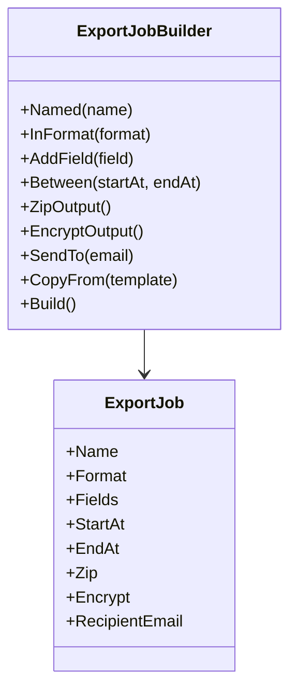
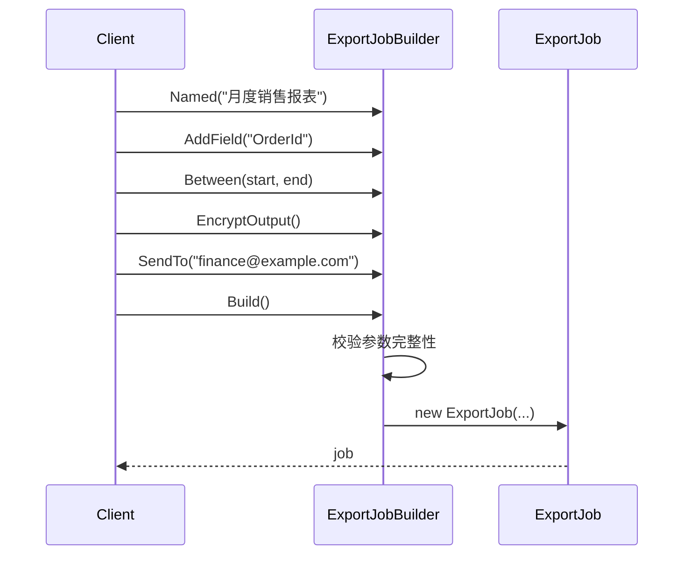

---
date: "2026-04-17"
title: "设计模式教科书｜Builder：分步构造复杂对象"
description: "Builder 适合处理创建过程复杂、可选项很多、还带约束校验的对象。它把构造步骤从最终产品里拆出来，让对象在创建前就能验证完整性，也让调用端避免掉进巨型构造函数和无效中间状态。"
slug: "patterns-04-builder"
weight: 904
tags:
  - 设计模式
  - Builder
  - 软件工程
series: "设计模式教科书"
---

> 一句话定义：Builder 把复杂对象的创建过程拆成一系列明确步骤，让调用方按步骤组装，而不是一次把所有细节塞进构造函数。

## 历史背景

Builder 诞生得很朴素。C++ 和 Java 时代，构造函数越来越长，参数越来越多，而且开始出现“有些参数必须有、有些参数可选、有些组合非法”的局面。GoF 在 1994 年把 Builder 形式化时，解决的正是这种“对象能造，但不好造”的麻烦。

它的时代背景也很典型：那时还没有今天这么成熟的对象初始值设定、记录类型、命名参数和模式匹配。要想优雅地组装一个复杂对象，最常见的选择就是先收集状态，再一次性产出产品。Builder 把这种过程显式化了。

现代 C# 让 Builder 没那么“必需”了。简单 DTO 可以用对象初始化器，稳定数据可以直接用 `record`，变体可以靠 `with` 表达式复制。但只要你面对的是“必填项多、可选项多、字段之间还有关联约束”的对象，Builder 仍然是最稳的创建边界。

## 一、先看问题

“创建一个对象”听上去很简单，直到你遇到这种对象：有必填项，也有大量可选项；某些字段之间有依赖关系；某些组合本身非法；创建前还要做默认值填充与一致性校验。报表导出、发版计划、支付请求、查询条件，几乎都是这个样子。

如果不用模式，最常见的结果要么是“巨型构造函数”，要么是“先 new 一个半成品对象，再到处 set”。前者难读，后者更危险，因为对象在构造途中可能处于非法状态。调用方一边拼参数，一边还得自己记住约束，最后谁都不轻松。

下面这段坏代码就是典型例子：

```csharp
using System;
using System.Collections.Generic;

public enum ExportFormat
{
    Csv,
    Json,
    Excel
}

public sealed class ExportJob
{
    public string Name { get; set; } = "";
    public ExportFormat Format { get; set; }
    public List<string> Fields { get; set; } = new();
    public DateTime StartAt { get; set; }
    public DateTime EndAt { get; set; }
    public bool Zip { get; set; }
    public bool Encrypt { get; set; }
    public string RecipientEmail { get; set; } = "";
}

public static class NaiveProgram
{
    public static void Main()
    {
        var job = new ExportJob();
        job.Name = "月度销售报表";
        job.Format = ExportFormat.Excel;
        job.StartAt = new DateTime(2026, 4, 1);
        job.EndAt = new DateTime(2026, 4, 30);
        job.Zip = true;
        job.Encrypt = true;
        // 忘了设置 Fields
        // 忘了设置 RecipientEmail

        Console.WriteLine($"开始导出：{job.Name}");
    }
}
```

这段代码的问题非常现实：对象在 `Main` 里被一点点拼起来，中途任何时刻都可能是不完整的。必填项和可选项没有边界，靠人记。约束关系没有集中校验，比如“加密时必须有收件人邮箱”。

于是创建逻辑散落在调用端，对象本身也失去了“天然合法”的保证。Builder 的价值就在这里：它不是为了多一层抽象，而是为了把创建过程拉回到一个可控、可验证、可复用的装配流程里。

## 二、模式的解法

Builder 的思路是：**把构造过程本身当成一等公民。** 最终产品保持稳定、尽量不可变；构造细节交给 Builder 累积、校验、组装。调用方不再直接面对无数参数，而是面对一组有语义的步骤。

下面是一份完整可运行的实现。它把复杂的导出任务交给 `ExportJobBuilder` 分步构造，并在 `Build()` 时一次性做约束检查。为了更贴近现实，我还加了一个 `CopyFrom`，它能从既有对象复制出一个新构建器，这样就能自然地讨论 Prototype。

```csharp
using System;
using System.Collections.Generic;
using System.Globalization;
using System.Linq;

public enum ExportFormat
{
    Csv,
    Json,
    Excel
}

public sealed record ExportJob(
    string Name,
    ExportFormat Format,
    IReadOnlyList<string> Fields,
    DateTime StartAt,
    DateTime EndAt,
    bool Zip,
    bool Encrypt,
    string? RecipientEmail);

public sealed class ExportJobBuilder
{
    private string? _name;
    private ExportFormat _format = ExportFormat.Csv;
    private readonly List<string> _fields = new();
    private DateTime? _startAt;
    private DateTime? _endAt;
    private bool _zip;
    private bool _encrypt;
    private string? _recipientEmail;

    public ExportJobBuilder Named(string name)
    {
        _name = name;
        return this;
    }

    public ExportJobBuilder InFormat(ExportFormat format)
    {
        _format = format;
        return this;
    }

    public ExportJobBuilder AddField(string field)
    {
        if (string.IsNullOrWhiteSpace(field))
        {
            throw new ArgumentException("字段名不能为空", nameof(field));
        }

        _fields.Add(field);
        return this;
    }

    public ExportJobBuilder Between(DateTime startAt, DateTime endAt)
    {
        _startAt = startAt;
        _endAt = endAt;
        return this;
    }

    public ExportJobBuilder ZipOutput(bool enabled = true)
    {
        _zip = enabled;
        return this;
    }

    public ExportJobBuilder EncryptOutput(bool enabled = true)
    {
        _encrypt = enabled;
        return this;
    }

    public ExportJobBuilder SendTo(string email)
    {
        _recipientEmail = email;
        return this;
    }

    public ExportJobBuilder CopyFrom(ExportJob template)
    {
        if (template is null)
        {
            throw new ArgumentNullException(nameof(template));
        }

        _name = template.Name;
        _format = template.Format;
        _fields.Clear();
        _fields.AddRange(template.Fields);
        _startAt = template.StartAt;
        _endAt = template.EndAt;
        _zip = template.Zip;
        _encrypt = template.Encrypt;
        _recipientEmail = template.RecipientEmail;
        return this;
    }

    public ExportJob Build()
    {
        if (string.IsNullOrWhiteSpace(_name))
        {
            throw new InvalidOperationException("报表名称不能为空");
        }

        if (_fields.Count == 0)
        {
            throw new InvalidOperationException("至少要选择一个导出字段");
        }

        if (_startAt is null || _endAt is null)
        {
            throw new InvalidOperationException("必须设置时间范围");
        }

        if (_startAt > _endAt)
        {
            throw new InvalidOperationException("开始时间不能晚于结束时间");
        }

        if (_encrypt && string.IsNullOrWhiteSpace(_recipientEmail))
        {
            throw new InvalidOperationException("加密导出必须指定接收邮箱");
        }

        return new ExportJob(
            _name,
            _format,
            _fields.ToArray(),
            _startAt.Value,
            _endAt.Value,
            _zip,
            _encrypt,
            _recipientEmail);
    }
}

public static class Program
{
    public static void Main()
    {
        ExportJob baseJob = new ExportJobBuilder()
            .Named("月度销售报表")
            .InFormat(ExportFormat.Excel)
            .AddField("OrderId")
            .AddField("Amount")
            .AddField("CreatedAt")
            .Between(new DateTime(2026, 4, 1), new DateTime(2026, 4, 30))
            .ZipOutput()
            .EncryptOutput()
            .SendTo("finance@example.com")
            .Build();

        ExportJob nextMonthJob = new ExportJobBuilder()
            .CopyFrom(baseJob)
            .Named("次月销售报表")
            .Between(new DateTime(2026, 5, 1), new DateTime(2026, 5, 31))
            .Build();

        Console.WriteLine($"{baseJob.Name} 已创建，字段数：{baseJob.Fields.Count}，格式：{baseJob.Format}");
        Console.WriteLine($"{nextMonthJob.Name} 已创建，字段数：{nextMonthJob.Fields.Count}，格式：{nextMonthJob.Format}");
    }
}
```

Builder 带来的收益不只是“链式调用比较好看”。真正的价值有三层。

第一，**创建逻辑被集中管理**。  
所有合法性校验都放在 `Build()` 里，而不是散落在调用端的十几个 `if` 里。这样一来，对象一旦构建完成，就可以被视为处于有效状态。

第二，**必填项、可选项和默认值被显式组织起来**。  
调用方可以按业务阅读顺序来写构造代码，而不是按构造函数参数顺序背诵一长串布尔值和可选项。

第三，**复杂构造过程和最终产品被解耦了**。  
`ExportJob` 只关心自己是什么，不关心“你当初是怎么一步步拼出来的”。对象职责更单纯，也更容易测试。

`CopyFrom` 还顺手说明了一个事实：Builder 和 Prototype 经常会相遇，但不该混成一个模式。Builder 负责把一个对象造完整，Prototype 负责拿一个现成对象当模板再复制一份。两者可以配合，但关注点不同。

## 三、结构图



Builder 和产品对象之间是典型的“先积累状态，再一次性产出”的关系。产品对象通常应该尽量稳定、不可变，Builder 则负责承受构造过程中的可变性。

## 四、时序图



Builder 的关键不是“多了一层类”，而是让构造过程有了自己的生命周期：收集参数、填默认值、做组合校验、最终产出合法对象。

## 五、变体与兄弟模式

Builder 常见有四种变体。

第一种是**流式 Builder**。  
也就是最常见的链式调用写法，适合业务代码直接阅读。

第二种是**分阶段 Builder**。  
如果对象有严格的步骤顺序，例如“必须先选数据库，再配置连接串，最后才能加缓存策略”，可以把 Builder 拆成多个阶段接口，让编译器参与约束。

第三种是**Director + Builder**。  
GoF 原版 Builder 里经常会有一个 Director，专门定义“怎么用 Builder 组装标准对象”。现代代码里这个角色经常被工厂方法、模板方法或应用服务替代，不一定单独命名。

第四种是**不可变对象 Builder**。  
这是现在最常见的工程化用法。Builder 内部可变，产品对象外部不可变。这样既保留构造灵活性，也避免半成品对象泄漏。

它最容易和两个兄弟模式混淆。

- 和 Factory：Factory 更关心“创建哪一种对象”；Builder 更关心“如何分步骤把一个复杂对象组装完整”。
- 和 Prototype：Prototype 从现有对象复制；Builder 从零开始逐步构造。

## 六、对比其他模式

| 对比项 | Builder | Factory Method / Abstract Factory | Prototype |
|---|---|---|---|
| 关注点 | 分步骤构造复杂对象 | 隐藏对象创建选择 | 从已有对象复制出新对象 |
| 适用场景 | 参数多、约束多、可选项多 | 产品类型多、创建分支复杂 | 结构稳定、复制比重建便宜 |
| 最终产物 | 一个复杂对象 | 一个对象或一组对象 | 一个和原型相似的新对象 |
| 调用方式 | 调用方逐步装配 | 调用方请求创建 | 调用方克隆模板再微调 |
| 常见收益 | 避免半成品对象和巨型构造函数 | 降低对具体类的依赖 | 复制已有配置，减少重复初始化 |

Builder 和 Factory 经常一起出现，但解决的问题并不相同。

如果你最头疼的是“到底创建 Excel 导出器还是 Json 导出器”，那是 Factory 的问题。  
如果你最头疼的是“这个导出任务要带哪些字段、时间范围怎么配、哪些组合非法”，那是 Builder 的问题。  
如果你最头疼的是“已经有一份模板，怎样生成一个只改少量字段的新对象”，那就是 Prototype 更顺手。

一个实用判断是：**你是在选择产品类型，还是在组装产品细节，还是在复制已有样板？** 前者更像 Factory，后者更像 Builder，再往前一步才是 Prototype。

## 七、批判性讨论

Builder 最常见的误用，是为简单对象硬上 Builder。对象只有两三个参数，而且没有什么组合约束时，直接构造通常更简单。Builder 不是“更高级的构造函数”，它只在复杂度足够高时才值得存在。

第二个问题是 Builder 不做真正的校验。很多所谓 Builder 只是把参数搬运到产品里，真正的约束仍散落在外部。这样 Builder 就退化成了一个语法糖包装器，没承担真正的构造职责。

第三个问题是 Builder 和业务流程混在一起。Builder 最好只负责“怎么把对象造完整”。如果它开始顺带查数据库、发通知、写审计日志，就已经越界，变成应用服务了。

现代 C# 还给了很多更轻的选择。简单对象可以直接用对象初始化器；稳定数据可以用 `record` 和位置参数；局部变化可以用 `with` 表达式复制一个变体。Builder 不是默认答案，它是当“创建过程本身已经成为认知负担”时才该被引入的答案。

## 八、跨学科视角

Builder 和数据库查询构造器特别像。你不会愿意把一长串 SQL 字符串直接散在调用端，而是会把 `Select`、`Where`、`OrderBy`、`GroupBy` 这些步骤收拢成结构化对象。Builder 本质上是在把“创建”变成一个显式的构造 AST。

从类型论视角看，Builder 还可以升级成“类型状态”写法：你先进入必填阶段，再进入可选阶段，再进入完成阶段。每一步都返回一个更窄的接口，让非法顺序在编译期就被挡住。这种做法比单一 Builder 更严，但也更重。一个极简对照片段大概是这样：

```csharp
public interface INeedHost { INeedPort Host(string host); }
public interface INeedPort { IReadyBuild Port(int port); }
public interface IReadyBuild { ExportJob Build(); }
```

它把“能不能继续往下走”交给类型系统判断，而不是等到运行时再报错。

这也是 Builder 的本质：它不是在追求写法漂亮，而是在把“对象什么时候算构造完成”这件事变成一条可验证的流程。对于复杂对象来说，这种流程比一个长构造函数更值钱。

## 九、真实案例

Builder 不是纸面概念，真实项目里非常多。

- [dotnet/runtime - `UriBuilder.cs`](https://github.com/dotnet/runtime/blob/main/src/libraries/System.Private.Uri/src/System/UriBuilder.cs)：`UriBuilder` 就是经典的分步构造器。它允许你逐项设置 scheme、host、port、path、query，最后再得到一个完整的 `Uri`。
- [Microsoft Learn - `WebApplication.CreateBuilder`](https://learn.microsoft.com/en-us/dotnet/api/microsoft.aspnetcore.builder.webapplication.createbuilder?view=aspnetcore-10.0) / [ASP.NET Core minimal API 文档](https://learn.microsoft.com/en-us/aspnet/core/fundamentals/minimal-apis/webapplication?view=aspnetcore-9.0)：`WebApplicationBuilder` 把配置、日志、服务注册、宿主默认值收集起来，最后由 `Build()` 统一生成应用。源码文档里也明确写着 `CreateBuilder` 返回 `WebApplicationBuilder`。

这两组例子说明一件事：Builder 最常见的落点不是“很炫的 fluent API”，而是“真实对象创建过程太复杂，必须先收集、再校验、再产出”。

## 十、常见坑

第一个坑是把 Builder 当成普通 setter 容器。Builder 如果只是搬参数，没有校验、没有默认值、没有步骤语义，那它就没有存在价值。修正方法是把非法组合尽量收进 `Build()`。

第二个坑是构造后还继续暴露 setter。这样即便你用了 Builder，产品对象仍然可以被改回非法状态，相当于前面做的约束都白做了。修正方法是让产品对象尽量不可变。

第三个坑是 Builder 自己变成业务对象。Builder 一旦开始查库、发消息、做审批，就已经不再是创建器，而是服务层。修正方法是让 Builder 只做组装，不做外部 I/O。

第四个坑是忽略复制语义。很多项目本来只是想“复制一个模板，再改几个字段”，结果写成了完整 Builder。修正方法是先判断是不是 Prototype 更合适。

## 十一、性能考量

Builder 的成本通常是可以接受的，主要是：构造阶段维护一些中间状态，`Build()` 时做一次集中校验，可能再产生一个 Builder 对象。对绝大多数业务对象来说，这些都不是问题。

真正要注意的是，当 Builder 被放进极高频路径，或者内部持有大量临时集合时，才需要关注对象分配和复制成本。一个 Builder 如果每次都复制大列表、拼接大字符串，那它就不再是“构造帮助器”，而是在做额外搬运。

给一个明确的量化例子：如果一个对象有 12 个字段，Builder 的一次 `Build()` 通常做 12 次一致性检查，复杂度是 `O(12)`，也就是 `O(k)`。相反，如果用 6 个布尔开关去拼构造函数重载或条件分支，合法组合会膨胀到 `2^6 = 64` 种，调用方要先理解组合空间，再谈实际创建。Builder 不一定更快，但它会把组合爆炸压缩成一条线性的构造流程。

现代 C# 也给了更轻的替代品。简单对象直接用对象初始化器；数据对象可以用 `record` 和 `with`；`WebApplicationBuilder` 这类工业级 Builder 则把收集与构建分离，避免在对象未完成前暴露半成品。Builder 的性能核心不是“快不快”，而是“值不值得把构造过程显式化”。

## 十二、何时用 / 何时不用

适合用：

- 对象参数很多，而且存在明确的必填项与可选项。
- 字段之间存在组合约束，需要在创建时统一校验。
- 你希望产品对象保持不可变或近似不可变。

不适合用：

- 对象简单到一个构造函数就足够表达。
- 没有任何构造约束，只有零散字段赋值。
- 你真正想解决的是“创建哪个类型”，而不是“如何组装这个对象”。

Builder 的典型信号是：**调用方正在费力地记忆构造顺序、参数意义和合法组合。** 一旦你看到这个信号，Builder 往往就值回票价。

## 十三、相关模式

- [Factory Method 与 Abstract Factory](./patterns-09-factory.md)：Factory 解决“造哪种”，Builder 解决“怎么造完整”。
- [Template Method](./patterns-02-template-method.md)：Template Method 组织执行步骤，Builder 组织构造步骤。
- [Prototype](./patterns-20-prototype.md)：Prototype 复制已有对象，Builder 从零组装对象。
- [Facade](./patterns-05-facade.md)：Facade 简化子系统入口，Builder 简化复杂对象创建。

## 十四、在实际工程里怎么用

Builder 在工程中非常实用，因为真实系统里“创建一个对象”往往并不简单。

- 构建系统：构建计划、发布清单、打包任务、资源裁剪参数，天然适合 Builder 统一组装。
- 应用配置：连接串、登录策略、重试参数、告警规则，常常都要先收集再校验。
- 后端与工具链：查询条件对象、批处理任务、导出任务、消息投递配置，也经常用 Builder 收口创建逻辑。

后续应用线占位：

- [BuildPlanBuilder：Builder 模式在复杂构建计划中的应用](../../engine-toolchain/build-system/buildplan-builder.md)
- [BuildCommand：用 Facade 把五个组件包装成一个命令](../../engine-toolchain/build-system/buildcommand-facade.md)

## 小结

- Builder 把复杂创建过程集中到一处，让调用方不必直接面对巨型构造函数和一堆 setter。
- 它最有价值的地方是“构建前校验”，让产品对象一旦创建出来就天然满足约束。
- 它适合复杂对象，不适合一切对象；当创建过程本身已经成为认知负担时，它就值得引入。

一句话总括：Builder 的本质不是链式调用，而是把“构造对象”这件复杂工作变成一条可控、可验证、可复用的装配流程。

