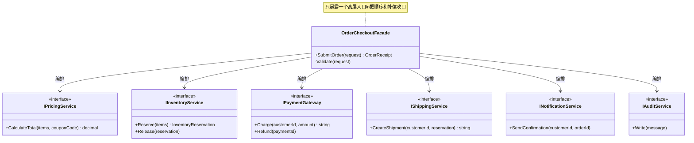
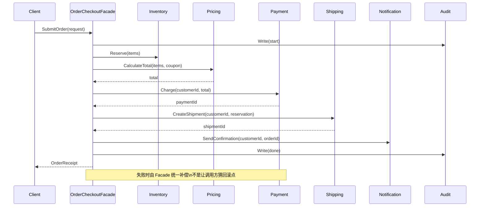

> 一句话定义：Facade 用一个高层入口把多个子系统的调用顺序、异常处理和补偿策略收拢起来。

## 历史背景

Facade 出自 GoF 1994 年的结构型模式。它的时代背景不是“有没有抽象类”，而是“大型 C++、COM、图形库和企业系统把入口做散了”。调用方如果要自己拼装十几个低层对象，既要记顺序，又要记边界，还要知道哪些对象必须一起出现，集成成本会迅速失控。

这个模式的价值一直没过时。系统越大，入口越多，编排越容易分散。现代 C#、依赖注入、`async/await` 和扩展方法让实现方式更轻，但本质没变：**把“怎么把几个步骤串起来”集中到一个地方**。Facade 解决的是入口复杂度，不是子系统本身的算法难度。
这也是为什么很多现代框架里，你不一定能在类型名里直接看到 “Facade”，却能在用法上认出它。`WebApplicationBuilder`、`HttpClient`、构建入口、SDK 初始化器，都在做同一件事：把一串有固定顺序的低层对象和步骤压成一个高层动作。对调用方来说，它像一个命令；对实现者来说，它是一个编排层。

## 一、先看问题

订单提交、报表导出、文件同步、SDK 初始化，这些场景都有同一个味道：每个子系统都不难，难的是“把它们按正确顺序连起来”。如果调用方自己编排，就会把流程代码写成一坨。

下面是一个典型坏例子。它能跑，但每个调用方都得知道库存、计价、支付、发货、通知的顺序，任何一处失败都很难统一处理。

```csharp
using System;
using System.Collections.Generic;
using System.Linq;

public sealed record OrderItem(string Sku, int Quantity, decimal UnitPrice);
public sealed record OrderRequest(string CustomerId, IReadOnlyList<OrderItem> Items, string? CouponCode);
public sealed record OrderReceipt(string OrderId, decimal TotalAmount, string PaymentId);

public sealed class PricingService
{
    public decimal CalculateTotal(IReadOnlyList<OrderItem> items, string? couponCode)
    {
        decimal subtotal = items.Sum(x => x.Quantity * x.UnitPrice);
        decimal discount = couponCode == "SAVE10" ? subtotal * 0.1m : 0m;
        return subtotal - discount;
    }
}

public sealed class InventoryService
{
    public void Reserve(IReadOnlyList<OrderItem> items) => Console.WriteLine("预留库存");
}

public sealed class PaymentGateway
{
    public string Charge(string customerId, decimal amount)
    {
        Console.WriteLine($"扣款 {amount}");
        return $"PAY-{customerId}-{DateTime.UtcNow.Ticks}";
    }
}

public sealed class ShippingService
{
    public string CreateShipment(string customerId, IReadOnlyList<OrderItem> items)
    {
        Console.WriteLine("创建发货单");
        return $"SHIP-{customerId}-{DateTime.UtcNow.Ticks}";
    }
}

public sealed class NotificationService
{
    public void SendConfirmation(string customerId, string orderId) =>
        Console.WriteLine($"通知用户 {customerId}：订单 {orderId} 已提交");
}

public sealed class AuditService
{
    public void Write(string message) => Console.WriteLine($"审计：{message}");
}

public sealed class NaiveCheckoutService
{
    private readonly PricingService _pricing = new();
    private readonly InventoryService _inventory = new();
    private readonly PaymentGateway _payment = new();
    private readonly ShippingService _shipping = new();
    private readonly NotificationService _notification = new();
    private readonly AuditService _audit = new();

    public OrderReceipt Submit(OrderRequest request)
    {
        if (request.Items.Count == 0)
            throw new InvalidOperationException("订单不能为空");

        _inventory.Reserve(request.Items);
        decimal total = _pricing.CalculateTotal(request.Items, request.CouponCode);
        string paymentId = _payment.Charge(request.CustomerId, total);
        string orderId = _shipping.CreateShipment(request.CustomerId, request.Items);
        _notification.SendConfirmation(request.CustomerId, orderId);
        _audit.Write($"订单完成，payment={paymentId}, order={orderId}");
        return new OrderReceipt(orderId, total, paymentId);
    }
}
```

问题不在“不能跑”，而在于调用方开始持有流程知识。流程知识一旦泄漏，后面就会出现两个后果。一个是重复编排：每个入口都写一遍同样的顺序。另一个是分叉失控：某个渠道加了优惠券校验，另一个渠道加了审计，第三个渠道又改了补偿，最后谁也说不清哪条链路才是标准路径。

Facade 要做的事很直接：**把稳定且高频的协作动作变成一个高层动作**。调用方只记 `SubmitOrder`，不再记 `Reserve -> Calculate -> Charge -> Ship -> Notify` 的内部顺序。
这和“只是把 API 包在类里”还不完全一样。简单封装通常只是重排命名，调用方仍然要知道每个方法该怎么搭配、谁先谁后。Facade 更进一步，它把多对象协作的节奏也固定下来。调用方不该再操心“先查配置还是先建连接”“失败时先回滚谁”，它只该说“开始这个业务动作”。

## 二、模式的解法

Facade 不是把复杂度消灭掉，而是把复杂度放到一个边界清晰的地方。调用方只面对一个语义明确的入口，门面内部再去组织多个子系统。这样做的好处是，顺序、补偿、审计和异常传播都能在一个类里看全。

下面是可运行的纯 C# 解法。它把创建、调用和补偿都收进 `OrderCheckoutFacade`，但子系统仍然保持独立。

```csharp
using System;
using System.Collections.Generic;
using System.Linq;

public sealed record OrderItem(string Sku, int Quantity, decimal UnitPrice);
public sealed record OrderRequest(string CustomerId, IReadOnlyList<OrderItem> Items, string? CouponCode);
public sealed record InventoryReservation(string ReservationId, IReadOnlyList<OrderItem> Items);
public sealed record OrderReceipt(string OrderId, decimal TotalAmount, string PaymentId, string ShipmentId);

public interface IPricingService
{
    decimal CalculateTotal(IReadOnlyList<OrderItem> items, string? couponCode);
}

public interface IInventoryService
{
    InventoryReservation Reserve(IReadOnlyList<OrderItem> items);
    void Release(InventoryReservation reservation);
}

public interface IPaymentGateway
{
    string Charge(string customerId, decimal amount);
    void Refund(string paymentId);
}

public interface IShippingService
{
    string CreateShipment(string customerId, InventoryReservation reservation);
}

public interface INotificationService
{
    void SendConfirmation(string customerId, string orderId);
}

public interface IAuditService
{
    void Write(string message);
}

public sealed class PricingService : IPricingService
{
    public decimal CalculateTotal(IReadOnlyList<OrderItem> items, string? couponCode)
    {
        decimal subtotal = items.Sum(x => x.Quantity * x.UnitPrice);
        decimal discount = couponCode == "SAVE10" ? subtotal * 0.1m : 0m;
        return Math.Round(subtotal - discount, 2);
    }
}

public sealed class InventoryService : IInventoryService
{
    public InventoryReservation Reserve(IReadOnlyList<OrderItem> items)
    {
        string reservationId = $"RES-{Guid.NewGuid():N}";
        Console.WriteLine($"库存已预留：{reservationId}");
        return new InventoryReservation(reservationId, items);
    }

    public void Release(InventoryReservation reservation)
    {
        Console.WriteLine($"库存已释放：{reservation.ReservationId}");
    }
}

public sealed class PaymentGateway : IPaymentGateway
{
    public string Charge(string customerId, decimal amount)
    {
        string paymentId = $"PAY-{customerId}-{Guid.NewGuid():N}";
        Console.WriteLine($"支付成功：{paymentId}，金额 {amount}");
        return paymentId;
    }

    public void Refund(string paymentId)
    {
        Console.WriteLine($"支付已撤销：{paymentId}");
    }
}

public sealed class ShippingService : IShippingService
{
    public string CreateShipment(string customerId, InventoryReservation reservation)
    {
        string shipmentId = $"SHIP-{customerId}-{Guid.NewGuid():N}";
        Console.WriteLine($"发货单已创建：{shipmentId}，reservation={reservation.ReservationId}");
        return shipmentId;
    }
}

public sealed class NotificationService : INotificationService
{
    public void SendConfirmation(string customerId, string orderId)
    {
        Console.WriteLine($"通知用户 {customerId}：订单 {orderId} 已提交");
    }
}

public sealed class AuditService : IAuditService
{
    public void Write(string message) => Console.WriteLine($"审计：{message}");
}

public sealed class OrderCheckoutFacade
{
    private readonly IPricingService _pricing;
    private readonly IInventoryService _inventory;
    private readonly IPaymentGateway _payment;
    private readonly IShippingService _shipping;
    private readonly INotificationService _notification;
    private readonly IAuditService _audit;

    public OrderCheckoutFacade(
        IPricingService pricing,
        IInventoryService inventory,
        IPaymentGateway payment,
        IShippingService shipping,
        INotificationService notification,
        IAuditService audit)
    {
        _pricing = pricing;
        _inventory = inventory;
        _payment = payment;
        _shipping = shipping;
        _notification = notification;
        _audit = audit;
    }

    public OrderReceipt SubmitOrder(OrderRequest request)
    {
        Validate(request);
        _audit.Write($"开始处理订单，customer={request.CustomerId}");

        InventoryReservation reservation = _inventory.Reserve(request.Items);
        string? paymentId = null;

        try
        {
            decimal total = _pricing.CalculateTotal(request.Items, request.CouponCode);
            paymentId = _payment.Charge(request.CustomerId, total);
            string shipmentId = _shipping.CreateShipment(request.CustomerId, reservation);
            string orderId = $"ORD-{DateTime.UtcNow:yyyyMMddHHmmss}";
            _notification.SendConfirmation(request.CustomerId, orderId);
            _audit.Write($"订单完成，order={orderId}");
            return new OrderReceipt(orderId, total, paymentId, shipmentId);
        }
        catch
        {
            if (paymentId is not null)
                _payment.Refund(paymentId);

            _inventory.Release(reservation);
            _audit.Write("订单失败，已执行补偿");
            throw;
        }
    }

    private static void Validate(OrderRequest request)
    {
        if (string.IsNullOrWhiteSpace(request.CustomerId))
            throw new InvalidOperationException("客户编号不能为空");

        if (request.Items.Count == 0)
            throw new InvalidOperationException("订单不能为空");

        if (request.Items.Any(x => x.Quantity <= 0 || x.UnitPrice < 0))
            throw new InvalidOperationException("订单明细非法");
    }
}

public static class Program
{
    public static void Main()
    {
        var facade = new OrderCheckoutFacade(
            new PricingService(),
            new InventoryService(),
            new PaymentGateway(),
            new ShippingService(),
            new NotificationService(),
            new AuditService());

        var request = new OrderRequest(
            "CUST-1001",
            new[]
            {
                new OrderItem("SKU-APPLE", 2, 3.5m),
                new OrderItem("SKU-BANANA", 1, 2.0m)
            },
            "SAVE10");

        OrderReceipt receipt = facade.SubmitOrder(request);
        Console.WriteLine($"结果：{receipt.OrderId} / {receipt.TotalAmount} / {receipt.PaymentId} / {receipt.ShipmentId}");
    }
}
```

这段代码把门面层的边界放得很清楚。`PricingService`、`InventoryService`、`PaymentGateway` 等对象仍然独立，但它们不再作为“调用方必须亲自拼装的零件”暴露出去。调用方只负责表达意图，门面负责落地路径。

## 三、结构图



这张图的重点不是“有多少类”，而是“谁该暴露给调用方”。Facade 暴露的是高层动作，不是每个零件的细枝末节。

## 四、时序图



时序图里最重要的一点是：调用方不再知道内部步骤。门面把“业务动作”变成一个可调用的高层入口，同时把失败时该如何回滚、补偿、留痕放在自己身上。

## 五、变体与兄弟模式

Facade 常见的变体有三种。薄门面只做入口收口，不碰业务判断；厚门面会承担少量编排和补偿；分层门面则把大系统拆成多个更小的入口，比如“支付门面”“订单门面”“审计门面”。

它最容易和两个兄弟混淆。**Mediator** 关注的是同级对象彼此怎么协作，门面则关注上层怎么少记几个对象。**Adapter** 关注的是接口翻译，门面关注的是入口收口。一个解决“说什么语言”，一个解决“入口太多”。
还要再加一层辨析：Facade 和应用服务、编排器经常长得很像，但意图不完全一样。应用服务更像领域用例的入口，强调“这件业务应该怎么完成”；编排器更像工作流调度，强调“多个步骤怎么被拉起来”；Facade 则强调“调用方面对的是不是一个足够简单的入口”。三者可以重叠，但写作时最好把主语义讲清楚，不然门面会被误写成业务服务，业务服务又会被误写成调度器。

## 六、对比其他模式

| 对比项 | Facade | Mediator | Adapter |
|---|---|---|---|
| 核心目标 | 简化复杂子系统的入口 | 管理同级对象之间的交互 | 翻译不兼容接口 |
| 面向对象 | 面向调用方 | 面向参与者 | 面向双方接口 |
| 关键产物 | 一个高层 API | 一个协作中心 | 一个适配器对象 |
| 典型风险 | 变成上帝对象 | 变成调度黑洞 | 只翻译接口却不处理语义差异 |
| 更适合 | 订单编排、SDK 封装、构建入口 | UI 组件联动、聊天室、流程协商 | 老接口接入、第三方 SDK 适配 |

最容易踩坑的是把 Facade 写成 Mediator。门面不是中央调度器，它不该接管所有对象之间的双向消息。它的职责更像一个“业务前台”，不是系统内部的“交通指挥中心”。

## 七、批判性讨论

Facade 的优点很明显，批评也很明确。它最危险的副作用是“看起来简单，实际上把复杂度藏起来了”。如果你把所有异常都吞掉，把所有步骤都包进一个方法，调用方会觉得很轻松，但排错会变难。

另一个问题是边界会腐烂。很多团队一开始只做入口收口，后来把校验、权限、缓存、统计、重试、限流都塞进门面，最后门面比子系统还大。那已经不是 Facade，而是新的泥球。

现代 C# 让 Facade 更轻，也让它更容易被替代。一个只有两三步的流程，可能用 `async` 方法、扩展方法或局部函数就够了，不必为了“有个设计模式”再造一层类型。Facade 值得保留的前提，是它真的在收口协作复杂度，而不是在复制调用流程。

## 八、跨学科视角

Facade 在分布式系统里很像 orchestration，在 UI 里很像 application service，在命令行里很像 subcommand 包装器。它们都在做同一件事：把多个低层动作编成一个高层意图。

把这个角度拉到软件架构上看，Facade 是“让意图先于步骤”。调用方先说“提交订单”“创建会话”“完成构建”，然后由门面去决定步骤。这和领域驱动设计里的应用服务很接近，也和编译器前端里的一层语义入口很像。

## 九、真实案例

- [.NET ASP.NET Core 的 `WebApplicationBuilder`](https://github.com/dotnet/aspnetcore/blob/main/src/DefaultBuilder/src/WebApplicationBuilder.cs)：它把主机、配置、DI、日志收成一个统一入口，调用方不需要手工拼 host builder。
- [.NET Runtime 的 `HttpClient`](https://github.com/dotnet/runtime/blob/main/src/libraries/System.Net.Http/src/System/Net/Http/HttpClient.cs)：它把底层 handler、连接和发送链收进一个高层 API，调用方只面对请求语义。

这两个例子都不是“源码里写着 Facade”才算数，而是**通过一个更高层的入口隐藏了多个协作细节**。这正是门面模式最稳定的落点。
`HttpClient` 特别值得多说一句。它不是单纯的“高层客户端封装”，因为它隐藏的不只是一次请求方法调用，而是一整条 handler 链、连接复用、默认头、超时、重定向、内容编码和生命周期语义。调用方看到的是一个客户端；设计上，它背后其实是一个足够稳定的 HTTP 门面。这个区别很重要，因为它解释了为什么 `HttpClient` 不是把几个函数收进一个类那么简单，而是把跨对象协作收成一个统一入口。

`WebApplicationBuilder` 的情况也类似。调用方面对的是一个看起来很轻的 builder，但它背后实际在组织 host、configuration、logging、DI 等多个子系统。它的价值不是“省掉构造代码”，而是让调用方不必知道这些子系统该怎样依赖、怎样初始化、怎样保持顺序。门面一旦成功，调用者就会忘掉实现细节，只记住入口动作。
这也是 Facade 和应用服务最容易混淆的地方。应用服务的主语是“业务用例”，它通常会明确表达下单、退款、注册、审批这类领域动作；Facade 的主语是“入口简化”，它更关心调用方是否只需要记一个稳定入口。两者可以写在同一层里，但判断标准不同：如果这个类的价值在于把领域步骤编成一个可读用例，它更像应用服务；如果它的价值在于把多个子系统的使用方式收拢成一个统一入口，它更像 Facade。

SDK 客户端封装也经常踩进这个边界。很多团队会把第三方 SDK 包一层，理由是“让调用更方便”。这没错，但那还不够成为 Facade。只有当这一层不只是改名，而是统一了初始化、生命周期、错误映射、默认参数和调用顺序，它才真正像门面。否则它只是一个薄薄的适配包装，方便是方便了，却没有替调用方消掉协作复杂度。

换句话说，Facade 不是“所有封装都算”。它有一个很现实的验收标准：调用方如果不再需要知道底层子系统的数量、顺序和补偿点，那这个门面就做对了；如果调用方只是少写了几个 `new`，那还只是包了一层类，不是门面。

## 十、常见坑

第一个坑是把 Facade 变成万能上帝对象。它一旦同时负责编排、规则、缓存、权限和重试，门面就会比子系统更难改。

第二个坑是忽略补偿边界。跨多个子系统时，哪些能回滚、哪些只能补偿、哪些根本不可逆，必须明确。否则一个 `catch` 看起来很优雅，实际上只是把一致性问题藏起来。

第三个坑是过度封装低层能力。Facade 应该给常用路径服务，不该把所有底层入口都堵死。好的门面要有逃生口，坏的门面会逼着所有调用都走同一条路。

## 十一、性能考量

Facade 本身的成本很低，通常只是多一层方法调用。真正的性能差异来自它把哪些步骤串起来。它如果把本来可以并行的 3 个远程调用强行串成 3 次等待，延迟就会从“看最慢那个”变成“把三个都加起来”。

从复杂度上看，Facade 把入口认知成本从 `O(n)` 个零散调用点压成 `O(1)` 个高层入口，但内部流程还是 `O(k)` 步。换句话说，它优化的是调用方的心智成本，不是免费压缩执行成本。
如果再往下看一层，Facade 的性能收益通常来自“减少错误调用”和“减少重复编排”，而不是 CPU 指令级优化。真正的成本往往仍然在子系统内部：网络、磁盘、数据库、序列化、消息发送。好的门面会让这些成本更显式，而不会把它们埋进一个看起来很干净的方法里。坏的门面则相反，它把成本藏深了，排查时你以为问题在入口，实际上问题在某个底层子系统。

## 十二、何时用 / 何时不用

适合用在这些场景：

- 子系统已经稳定，但调用方总要重复同一串编排步骤。
- 入口比单个子系统更复杂，且高频路径清晰。
- 你希望统一补偿、审计、日志和错误传播。

不适合用在这些场景：

- 真正复杂的是对象间协商，不是入口太多。
- 子系统还在频繁变化，门面会跟着被反复重写。
- 只剩两三个调用，直接暴露反而更清楚。

一句话判断：**如果问题是“入口太乱”，Facade 很值；如果问题是“对象之间怎么互相说话”，先看 Mediator。**

## 十三、相关模式

- [Adapter](./patterns-10-adapter.md)：翻译接口，不是收口入口。
- [Builder](./patterns-04-builder.md)：分步构造一个对象，Facade 分步组织一串子系统。
- [Strategy](./patterns-03-strategy.md)：Facade 固定流程，Strategy 变的是某一步的算法。

## 十四、在实际工程里怎么用

在工程里，Facade 最常见的落点是“把一个令人发怵的子系统包成一个能被普通工程师放心调用的入口”。比如构建系统里把 `restore / build / test / publish` 收成一个命令；比如后端里把下单、支付、发货、通知包成一个应用服务；比如 SDK 集成里把一堆初始化选项收成一个 `Initialize()`。

应用线占位可以直接沿着这些场景展开：

- [构建系统门面（应用线占位）](../../engine-toolchain/build-system/buildcommand-facade.md)
- [订单编排门面（应用线占位）](../../engine-toolchain/build-system/order-checkout-facade.md)

## 小结

- Facade 的价值不是“隐藏所有细节”，而是把稳定且高频的协作路径变成一个入口。
- 它把顺序、补偿、审计和异常收口到一处，减少调用方的流程知识泄漏。
- 它适合“入口复杂、协作稳定”的系统，不适合代替真正的对象协商结构。

一句话总括：Facade 让复杂系统仍然可以被一个清晰的高层动作调用。

再压一句：Facade 不是把复杂度藏起来，而是把复杂度放到更该待的位置上。
