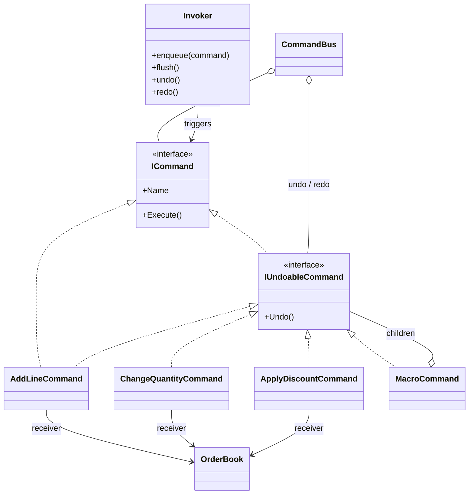
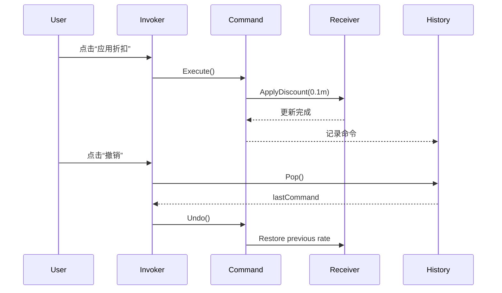

---
date: "2026-04-17"
title: "设计模式教科书｜Command：操作对象化"
description: "Command 把一次操作封装成独立对象，让调用方不必知道执行细节。命令一旦对象化，就可以进入队列、记录历史、支持撤销重做、批处理和回放，特别适合动作管理而不只是状态管理的系统。"
slug: "patterns-06-command"
weight: 906
tags:
  - 设计模式
  - Command
  - 软件工程
series: "设计模式教科书"
---

> 一句话定义：Command 把“做什么”封装成对象，让动作可以被传递、排队、记录、撤销和重放。

## 历史背景

Command 的来历很朴素，也很早。图形界面、菜单栏、工具栏、快捷键和脚本录制这些能力一旦出现，程序员就会发现：用户点下去的不是“某个按钮”，而是“一次动作”。按钮、菜单项、快捷键和自动化脚本都可能触发同一件事，如果把动作写死在控件里，系统很快就会散成一团回调。

GoF 在 1994 年把 Command 形式化时，真正要解决的是“动作管理”问题，而不只是“调用函数”问题。调用函数是瞬时的，动作对象却可以被存档、调度、串联、撤销、重放，还能和日志、权限、事务、审计接到一起。它把一次操作从语法层面的调用，抬升成领域层面的事件单元。

今天它仍然重要，但位置变了。现代语言有委托、lambda、函数值，很多轻量场景不必再造一堆命令类；可一旦动作需要被排队、延迟、补偿、审计，或者要和 CQRS、事件溯源、作业系统接轨，Command 依然是最稳的表达方式。它处理的不是“某个函数怎么写”，而是“动作如何被治理”。

## 一、先看问题

很多系统最开始都写得像一台直连机器：调用方一按按钮，服务就直接改状态。这个写法在原型里很快，在真实业务里却很脆。比如订单编辑台，客服会不断执行新增商品、改数量、撤销折扣、批量改价、重做刚才那一步。只要没有 Command，调用方就得手动记住每一次变化，还得自己处理撤销、重做和批处理。

坏代码通常长这样：能跑，但所有风险都堆在一个入口上。

```csharp
using System;
using System.Collections.Generic;
using System.Linq;

public sealed record OrderLine(string Sku, int Quantity, decimal UnitPrice);

public sealed class OrderBook
{
    private readonly List<OrderLine> _lines = new();

    public IReadOnlyList<OrderLine> Lines => _lines;
    public decimal DiscountRate { get; private set; }

    public void AddLine(string sku, int quantity, decimal unitPrice)
    {
        _lines.Add(new OrderLine(sku, quantity, unitPrice));
    }

    public void ChangeQuantity(string sku, int quantity)
    {
        for (var i = 0; i < _lines.Count; i++)
        {
            if (_lines[i].Sku == sku)
            {
                _lines[i] = _lines[i] with { Quantity = quantity };
                return;
            }
        }
    }

    public void ApplyDiscount(decimal rate)
    {
        DiscountRate = rate;
    }

    public decimal Total => _lines.Sum(x => x.Quantity * x.UnitPrice) * (1 - DiscountRate);
}

public sealed class NaiveOrderEditor
{
    private readonly OrderBook _book = new();
    private readonly Stack<List<OrderLine>> _snapshots = new();

    public void AddLine(string sku, int quantity, decimal unitPrice)
    {
        _snapshots.Push(_book.Lines.ToList());
        _book.AddLine(sku, quantity, unitPrice);
    }

    public void ChangeQuantity(string sku, int quantity)
    {
        _snapshots.Push(_book.Lines.ToList());
        _book.ChangeQuantity(sku, quantity);
    }

    public void ApplyDiscount(decimal rate)
    {
        _snapshots.Push(_book.Lines.ToList());
        _book.ApplyDiscount(rate);
    }

    public void Undo()
    {
        if (_snapshots.Count == 0) return;
        _snapshots.Pop();
        Console.WriteLine("恢复快照，但折扣、日志、重做栈都得另想办法。");
    }
}
```

这段代码的问题不在“不能用”，而在“每个入口都在顺手管理一个临时历史”。一旦动作多起来，快照、审计、重做、排队、回放就会互相打架。调用方不再只是发起操作，它还要充当历史管理员。

## 二、模式的解法

Command 的核心，是把一次动作拆成三个角色：Invoker 负责触发，Command 负责描述动作，Receiver 负责真正执行。这样一来，调用方只知道“现在有一个命令”，不必知道它会改哪个对象、改哪些字段、要不要落日志、能不能撤销。

下面这份纯 C# 代码把同一套订单编辑动作对象化了。它支持执行、撤销、重做，也支持批处理。

```csharp
using System;
using System.Collections.Generic;
using System.Linq;

public interface ICommand
{
    string Name { get; }
    void Execute();
}

public interface IUndoableCommand : ICommand
{
    void Undo();
}

public sealed record OrderLine(string Sku, int Quantity, decimal UnitPrice);

public sealed class OrderBook
{
    private readonly List<OrderLine> _lines = new();

    public IReadOnlyList<OrderLine> Lines => _lines;
    public decimal DiscountRate { get; private set; }

    public void AddLine(string sku, int quantity, decimal unitPrice)
    {
        if (string.IsNullOrWhiteSpace(sku)) throw new ArgumentException("Sku is required.", nameof(sku));
        if (quantity <= 0) throw new ArgumentOutOfRangeException(nameof(quantity));
        if (unitPrice < 0) throw new ArgumentOutOfRangeException(nameof(unitPrice));
        _lines.Add(new OrderLine(sku, quantity, unitPrice));
    }

    public void UpsertQuantity(string sku, int quantity)
    {
        if (quantity <= 0) throw new ArgumentOutOfRangeException(nameof(quantity));
        for (var i = 0; i < _lines.Count; i++)
        {
            if (_lines[i].Sku == sku)
            {
                _lines[i] = _lines[i] with { Quantity = quantity };
                return;
            }
        }
        throw new InvalidOperationException($"Line '{sku}' not found.");
    }

    public void RemoveLine(string sku)
    {
        var index = _lines.FindIndex(x => x.Sku == sku);
        if (index < 0) throw new InvalidOperationException($"Line '{sku}' not found.");
        _lines.RemoveAt(index);
    }

    public void ApplyDiscount(decimal rate)
    {
        if (rate is < 0 or > 1) throw new ArgumentOutOfRangeException(nameof(rate));
        DiscountRate = rate;
    }

    public decimal Total => _lines.Sum(x => x.Quantity * x.UnitPrice) * (1 - DiscountRate);
}

public abstract class OrderCommandBase : IUndoableCommand
{
    protected OrderCommandBase(string name, OrderBook book)
    {
        Name = name;
        Book = book ?? throw new ArgumentNullException(nameof(book));
    }

    public string Name { get; }
    protected OrderBook Book { get; }
    public abstract void Execute();
    public abstract void Undo();
}

public sealed class AddLineCommand : OrderCommandBase
{
    private readonly string _sku;
    private readonly int _quantity;
    private readonly decimal _unitPrice;
    private bool _executed;

    public AddLineCommand(OrderBook book, string sku, int quantity, decimal unitPrice)
        : base($"AddLine({sku})", book)
    {
        _sku = sku;
        _quantity = quantity;
        _unitPrice = unitPrice;
    }

    public override void Execute()
    {
        Book.AddLine(_sku, _quantity, _unitPrice);
        _executed = true;
    }

    public override void Undo()
    {
        if (_executed)
        {
            Book.RemoveLine(_sku);
        }
    }
}

public sealed class ChangeQuantityCommand : OrderCommandBase
{
    private readonly string _sku;
    private readonly int _newQuantity;
    private int _oldQuantity;

    public ChangeQuantityCommand(OrderBook book, string sku, int newQuantity)
        : base($"ChangeQuantity({sku})", book)
    {
        _sku = sku;
        _newQuantity = newQuantity;
    }

    public override void Execute()
    {
        _oldQuantity = Book.Lines.First(x => x.Sku == _sku).Quantity;
        Book.UpsertQuantity(_sku, _newQuantity);
    }

    public override void Undo() => Book.UpsertQuantity(_sku, _oldQuantity);
}

public sealed class ApplyDiscountCommand : OrderCommandBase
{
    private readonly decimal _newRate;
    private decimal _oldRate;

    public ApplyDiscountCommand(OrderBook book, decimal newRate)
        : base($"ApplyDiscount({newRate:P0})", book)
    {
        _newRate = newRate;
    }

    public override void Execute()
    {
        _oldRate = Book.DiscountRate;
        Book.ApplyDiscount(_newRate);
    }

    public override void Undo() => Book.ApplyDiscount(_oldRate);
}

public sealed class MacroCommand : IUndoableCommand
{
    private readonly IReadOnlyList<IUndoableCommand> _commands;

    public MacroCommand(string name, IReadOnlyList<IUndoableCommand> commands)
    {
        Name = name;
        _commands = commands ?? throw new ArgumentNullException(nameof(commands));
    }

    public string Name { get; }

    public void Execute()
    {
        foreach (var command in _commands)
        {
            command.Execute();
        }
    }

    public void Undo()
    {
        for (var i = _commands.Count - 1; i >= 0; i--)
        {
            _commands[i].Undo();
        }
    }
}

public sealed class CommandBus
{
    private readonly Queue<ICommand> _pending = new();
    private readonly Stack<IUndoableCommand> _undo = new();
    private readonly Stack<IUndoableCommand> _redo = new();

    public void Enqueue(ICommand command)
    {
        _pending.Enqueue(command ?? throw new ArgumentNullException(nameof(command)));
    }

    public void Flush()
    {
        while (_pending.Count > 0)
        {
            var command = _pending.Dequeue();
            command.Execute();

            if (command is IUndoableCommand undoable)
            {
                _undo.Push(undoable);
                _redo.Clear();
            }

            Console.WriteLine($"执行：{command.Name}");
        }
    }

    public void Undo()
    {
        if (_undo.Count == 0) return;
        var command = _undo.Pop();
        command.Undo();
        _redo.Push(command);
        Console.WriteLine($"撤销：{command.Name}");
    }

    public void Redo()
    {
        if (_redo.Count == 0) return;
        var command = _redo.Pop();
        command.Execute();
        _undo.Push(command);
        Console.WriteLine($"重做：{command.Name}");
    }
}

public static class Demo
{
    public static void Main()
    {
        var book = new OrderBook();
        var bus = new CommandBus();

        bus.Enqueue(new AddLineCommand(book, "SKU-001", 2, 39.9m));
        bus.Enqueue(new AddLineCommand(book, "SKU-002", 1, 88m));
        bus.Enqueue(new ChangeQuantityCommand(book, "SKU-001", 3));
        bus.Enqueue(new ApplyDiscountCommand(book, 0.1m));
        bus.Flush();

        Console.WriteLine($"总价：{book.Total}");
        bus.Undo();
        Console.WriteLine($"撤销后总价：{book.Total}");
        bus.Redo();
        Console.WriteLine($"重做后总价：{book.Total}");

        var macro = new MacroCommand("MorningBatch", new IUndoableCommand[]
        {
            new AddLineCommand(book, "SKU-003", 1, 12m),
            new ChangeQuantityCommand(book, "SKU-002", 2)
        });
        macro.Execute();
        macro.Undo();
    }
}
```

这份实现的关键点有三个。第一，动作和执行入口解耦了。第二，撤销逻辑被塞回命令内部，不再散落在调用方。第三，命令可以进入队列，所以它不仅是“调用延后”，还是“动作可治理”。

## 三、结构图



这张图想表达的不是“类很多”，而是职责很窄。Invoker 只管触发，Receiver 只管执行，Command 把动作本身独立出来。只要这条边界在，撤销、重做、批处理、延迟执行都能长出来。

## 四、时序图



Command 的时间线和普通函数调用不一样。函数调用只关心“现在做完了没有”，命令对象还关心“之后能不能重放、能不能撤销、能不能进历史”。这就是它比普通方法调用多出来的价值。

## 五、变体与兄弟模式

Command 常见变体很多。

- MacroCommand：把多个命令包成一个命令，适合批处理、事务式撤销、一次性自动化脚本。
- NullCommand：没有实际动作，但保持调用链稳定，常见于默认按钮或禁用态交互。
- DeferredCommand：先存起来，稍后再执行，和作业系统、消息队列、定时任务很像。
- UndoableCommand：命令知道如何回滚自己，是编辑器和流程工具最常见的形态。

它容易和 Strategy 混淆。两者都能把行为封装成对象，但命令关心“执行一次动作”，策略关心“选择哪种算法”。命令更像“可执行指令”，策略更像“可替换规则”。

它也和 Memento 很近。Memento 记录状态快照，Command 记录动作和接收者。前者回答“怎么回到过去”，后者回答“怎么重新做一次”。如果你的回滚逻辑只靠复原对象状态就够了，Memento 很直接；如果动作会带来外部副作用，Command 更完整。

## 六、对比其他模式

| 对比对象 | Command | Memento | Strategy |
|---|---|---|---|
| 核心问题 | 如何把动作对象化 | 如何保存可恢复状态 | 如何替换算法 |
| 关注点 | 执行、排队、撤销、重放 | 恢复、快照、保存点 | 规则、算法、可替换性 |
| 是否保存副作用 | 可以保存 | 通常不保存 | 不关心 |
| 与调用方关系 | 调用方只持有命令 | 调用方持有快照 | 调用方选择规则 |
| 典型场景 | 编辑器、任务队列、操作历史 | 撤销、检查点、草稿恢复 | 排序、路由、定价 |

Command 和 CQRS 也有天然联系。CQRS 把命令侧和查询侧拆开，命令侧负责修改状态，查询侧负责读模型。Command 是 CQRS 里最自然的输入单元，但 CQRS 不等于 Command；前者是架构风格，后者是对象化动作的模式。更准确地说，Command 解决的是“怎么表达写请求”，CQRS 解决的是“怎么把写模型和读模型分开”，两者关注的层次并不一样。

Command 还和事件溯源很近，但不是一回事。事件溯源保存的是“已经发生了什么”，Command 记录的是“希望发生什么”。前者是事实日志，后者是意图日志。很多系统会把 Command 转换成 Event，再把 Event 存档，这条链路要分清，不然很容易把意图和事实混在一起。一个命令可能失败、被拒绝、被合并，甚至在落库前就被幂等过滤掉；这些都说明 Command 的生命周期比 Event 更早，也更短。把两者混在一起，最后会出现“命令日志被当成审计事实”的错位。

## 七、批判性讨论

Command 最常见的批评是：太像仪式感，什么都要包一层对象。这个批评成立。一个只做单行赋值的按钮，硬塞成 `ICommand` 只会让系统变厚。模式不是为了“命令对象化”而对象化，而是为了让动作能够治理。

第二个批评是：撤销不是通用能力。很多团队一看到 Command 就想“我来做个万能撤销”，结果发现业务副作用根本不对称。发邮件能撤回吗？支付扣款能撤回吗？库存预占和真实扣减是同一层语义吗？不能。真正好的撤销，是领域定义清楚的补偿，而不是对任何命令都做一个假装完整的回滚。

这也是为什么“可撤销”不等于“可恢复”。恢复更像快照回滚，撤销更像反向命令；前者关心状态回到哪一刻，后者关心动作是否存在反动作。比如订单里的“增加一条商品”可以撤销成“删除这条商品”，可“发出一封通知邮件”通常只能补发说明，不能让邮件从对方收件箱里消失。Command 真正可靠的边界，是领域允许你表达补偿，而不是你想象自己能抹掉历史。

第三个批评是：命令对象很容易变成“瘦壳 + 巨型执行器”。如果所有业务逻辑都继续塞在 Receiver 里，Command 只剩传参作用，那它就只是语法糖。更糟的是，Command 还可能把历史、权限、日志、重试全塞进去，最后每个命令都像一个小型服务对象。

现代语言确实让一些旧写法过时了。很多简单操作已经不需要独立命令类，一个委托、一个局部函数、一个 `Func<T>` 就够了。可只要你要进历史、要排队、要审计、要做补偿，委托就会开始显得轻，Command 才会显得稳。

## 八、跨学科视角

Command 和函数式编程的延迟计算很接近，但不完全相同。延迟计算把“什么时候算”推迟，Command 把“什么时候执行”推迟，而且它更强调副作用治理。函数式世界里你会看到 thunk、lazy、monad；OO 世界里你会看到命令对象、队列和历史栈。两个世界都在延迟，但 command 关心的是可执行动作。

它和 CQRS、事件溯源是同一条演化链。CQRS 把写请求显式化，Command 是写请求的最小单元；事件溯源把变化记录成事件流，Command 往往是事件流的上游。很多消息驱动系统先接收 Command，再产出 Event，这样意图、执行、结果三层语义就分开了。

它也像 shell 历史。你在终端里输入一条命令，不是为了立刻完成一个函数调用，而是为了让动作可记录、可重放、可审计。命令对象把这种“命令行式思维”搬进了应用内部。

## 九、真实案例

Command 不是纸上模式，真实项目里到处都有。

- [OpenJDK - `javax.swing.Action`](https://github.com/openjdk/jdk/blob/master/src/java.desktop/share/classes/javax/swing/Action.java) / [`AbstractAction`](https://github.com/openjdk/jdk/blob/master/src/java.desktop/share/classes/javax/swing/AbstractAction.java)：Swing 用 Action 把按钮、菜单项、快捷键绑定到同一份动作逻辑。一个 Action 可以被多个 UI 入口复用，菜单和工具栏不必知道具体执行细节。
- [Qt - `QUndoCommand`](https://code.qt.io/cgit/qt/qtbase.git/tree/src/gui/util/qundostack.h) / [`QUndoStack`](https://code.qt.io/cgit/qt/qtbase.git/tree/src/gui/util/qundostack.cpp)：Qt 的撤销栈直接把可回滚操作对象化。命令对象保存执行所需的信息，栈负责历史管理，这几乎就是 GoF Command 的工业版。

这两个案例都说明同一件事：Command 的真实价值不是“把函数包起来”，而是把“动作的生命周期”交给对象管理。动作不再是调用瞬间的一次性事件，而是可以进入历史、进入栈、进入自动化流程的实体。

## 十、常见坑

第一个坑是把命令写成“只会执行，不会回滚”的半成品。这样你得到的只是延迟调用，不是 Command。只要系统真的需要撤销、重做或补偿，这种半命令迟早要返工。

第二个坑是把 Receiver 写成上帝对象。所有命令都往同一个大服务里塞，最后 Receiver 比调用方还臃肿。正确做法是让 Receiver 保持领域边界，命令只负责组装参数和记录动作。

第三个坑是让命令偷偷碰 UI。命令对象最好不要直接持有界面控件，否则你在做历史记录时，历史就会绑住界面生命周期，撤销栈还没清空，页面对象已经无法回收。

第四个坑是把命令当成事件。命令表达的是“要做什么”，事件表达的是“已经发生什么”。这两者顺序不同，语义也不同。把它们混在一起，最终会让重试、补偿和审计全部失真。

## 十一、性能考量

Command 的性能优势通常不在“单次更快”，而在“历史更省”。如果你用快照做撤销，假设一个订单有 500 行，编辑 20 次，就可能复制 10,000 行数据；如果你用命令记录增量，20 次只生成 20 个命令对象，内存和复制成本都跟动作数走，而不是跟对象规模走。

复杂度也很清楚。入栈、出栈、撤销、重做通常都是 `O(1)`；回放整个历史是 `O(m)`，其中 `m` 是命令数量。和全量快照相比，命令日志把空间从“每一步复制一份状态”压成“每一步记录一次增量”。这就是为什么编辑器、脚本录制、作业系统都偏爱 Command。

真正要注意的是命令对象的粒度。太细会导致对象数暴涨，太粗又会失去撤销精度。一个好的粒度通常是“用户感知的一次动作”或“业务可补偿的一步”。

## 十二、何时用 / 何时不用

适合用：

- 你需要撤销、重做、回放、批处理或排队。
- 你需要把动作交给调度器、消息系统或审计系统。
- 你希望调用方和执行细节解耦。

不适合用：

- 只是一次普通方法调用，没有历史治理需求。
- 动作极小，命令对象会比动作本身更重。
- 你想解决的是状态恢复，而不是动作治理，此时先看 Memento。

## 十三、相关模式

- [Memento](./patterns-12-memento.md)：保存状态快照，适合恢复而不是重放。
- [Strategy](./patterns-03-strategy.md)：封装算法，不关心动作历史。
- [Observer](./patterns-07-observer.md)：命令执行后常借助观察者广播结果。
- [Template Method](./patterns-02-template-method.md)：模板方法管流程骨架，命令管动作实体。

## 十四、在实际工程里怎么用

Command 在工程里最常见的落点有三类。

- 编辑器与工具链：撤销重做、批量改名、脚本录制、构建步骤管理。
- 后端服务：异步作业、命令总线、补偿流程、审计日志。
- 游戏和应用：输入映射、快捷键系统、宏录制、命令队列。

后续应用线占位：

- [命令模式在 Unity 输入与撤销系统中的应用](../pattern-02-command.md)

## 小结

Command 的第一价值，是把动作变成一等公民，动作可以排队、记录、撤销、重放。
Command 的第二价值，是把调用方从历史管理里解放出来，让历史成为系统能力而不是散落代码。
Command 的第三价值，是把命令、事件、快照分开，各自承担自己该承担的语义。

