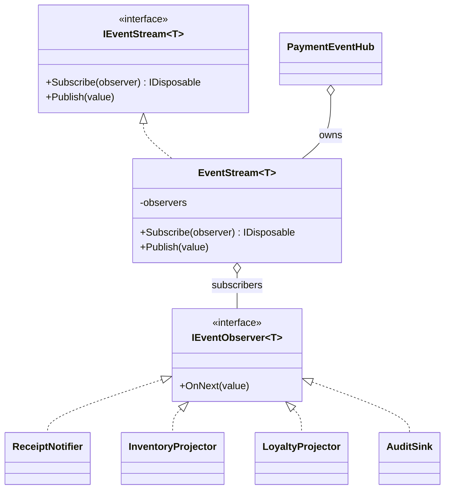
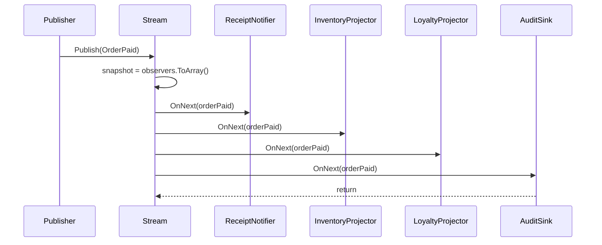

---
date: "2026-04-17"
title: "设计模式教科书｜Observer：一对多的事件通知"
description: "Observer 解决的是‘一个对象变了，很多对象都要跟着响应’的耦合问题。它把通知关系从硬编码调用改成订阅与广播，让扩展方自己决定如何接收消息，也让发布方不再知道谁在关心它。"
slug: "patterns-07-observer"
weight: 907
tags:
  - 设计模式
  - Observer
  - 软件工程
series: "设计模式教科书"
---

> 一句话定义：Observer 把“状态变化后的通知”从硬编码调用改成可订阅的广播机制。

## 历史背景

Observer 不是后来才补出来的花活，它几乎和图形界面一起长大。早期 GUI、MVC、Smalltalk 这些系统都面临同一件事：一个对象变了，界面、缓存、日志、派生视图都要跟着更新，但这些接收者的数量和组合并不固定。最早的做法很直接：发布方自己挨个调用下游。问题也很直接：调用方越来越胖，依赖越来越深，新增一个响应者就要改发布方。

GoF 在 1994 年把这类写法统一成 Observer，本质上是把“监听变化”从固定调用改成订阅关系。它不负责跨进程投递，也不负责消息存储，它只回答一件事：当主体变了，谁该被通知，怎么被通知。正因为这个边界清楚，Observer 后来才可以和事件驱动、响应式编程、UI 绑定、控制器缓存这些系统自然接上。

今天它的表达方式变了。现代语言会用委托、事件、`IObservable<T>`、Hook、信号/槽去承载它；但如果你看到一个对象需要把变化广播给多个本地协作者，而且协作者的数量会变，Observer 仍然是最朴素也最可靠的起点。

## 一、先看问题

很多系统都死在“谁来通知谁”这件事上。比如订单支付成功后，至少要做五件事：发通知、扣库存、加积分、写审计、推分析。你一开始可能会直接在支付服务里把这些方法都调一遍，代码短，逻辑也直。可这种直连写法会把发布方变成依赖中心：谁要接消息，谁就得被塞进这个服务里。

坏代码通常能跑，但它把变化入口锁死了。新增一个监听者，就得改发布方；删掉一个监听者，也得改发布方；某个下游慢了，发布方还得等它。更糟的是，发布方开始顺手承担协作、容错、顺序和重试，最后它已经不像一个业务服务，倒像一个手写消息总线。

```csharp
using System;
using System.Collections.Generic;
using System.Linq;

public sealed class DirectCheckoutService
{
    private readonly ReceiptMailer _mailer = new();
    private readonly InventoryService _inventory = new();
    private readonly LoyaltyService _loyalty = new();
    private readonly AuditService _audit = new();

    public Order PlaceOrder(string customerId, IReadOnlyList<OrderLine> lines)
    {
        var order = new Order($"ORD-{DateTime.UtcNow.Ticks}", customerId, lines);

        _inventory.Reserve(order);
        _mailer.SendReceipt(order);
        _loyalty.AddPoints(order.CustomerId, order.TotalAmount);
        _audit.Write(order);

        return order;
    }
}

public sealed record OrderLine(string Sku, int Quantity, decimal UnitPrice);

public sealed class Order
{
    public Order(string id, string customerId, IReadOnlyList<OrderLine> lines)
    {
        Id = id;
        CustomerId = customerId;
        Lines = lines;
        TotalAmount = lines.Sum(x => x.Quantity * x.UnitPrice);
    }

    public string Id { get; }
    public string CustomerId { get; }
    public IReadOnlyList<OrderLine> Lines { get; }
    public decimal TotalAmount { get; }
}

public sealed class ReceiptMailer { public void SendReceipt(Order order) => Console.WriteLine($"发送邮件：{order.Id}"); }
public sealed class InventoryService { public void Reserve(Order order) => Console.WriteLine($"预占库存：{order.Id}"); }
public sealed class LoyaltyService { public void AddPoints(string customerId, decimal amount) => Console.WriteLine($"积分 +{(int)amount}"); }
public sealed class AuditService { public void Write(Order order) => Console.WriteLine($"审计：{order.Id}"); }
```

这段代码的问题不在“能不能工作”，而在“变化耦合得太紧”。发布方知道了太多下游，顺序也被写死了。它一旦变成公共服务，后续所有响应者都会把自己的一部分生命周期绑到它身上。

## 二、模式的解法

Observer 的核心，是把“谁关心这件事”交给订阅关系，而不是交给发布方的硬编码调用。发布方只维护一个观察者列表，状态变化时按列表广播。观察者需要关心，就订阅；不关心，就退订。发布方既不需要知道观察者的类型，也不需要知道它们什么时候会出现。

下面这份纯 C# 代码做了一个本地事件流。它支持订阅、退订、广播，并且通过 `IDisposable` 把退订动作显式化，避免最常见的内存泄漏。

```csharp
using System;
using System.Collections.Generic;
using System.Linq;

public interface IEventObserver<in T>
{
    void OnNext(T value);
}

public interface IEventStream<T>
{
    IDisposable Subscribe(IEventObserver<T> observer);
    void Publish(T value);
}

public sealed class EventStream<T> : IEventStream<T>
{
    private readonly List<IEventObserver<T>> _observers = new();

    public IDisposable Subscribe(IEventObserver<T> observer)
    {
        if (observer is null) throw new ArgumentNullException(nameof(observer));
        _observers.Add(observer);
        return new Unsubscriber(_observers, observer);
    }

    public void Publish(T value)
    {
        var snapshot = _observers.ToArray();
        foreach (var observer in snapshot)
        {
            observer.OnNext(value);
        }
    }

    private sealed class Unsubscriber : IDisposable
    {
        private readonly List<IEventObserver<T>> _observers;
        private IEventObserver<T>? _observer;

        public Unsubscriber(List<IEventObserver<T>> observers, IEventObserver<T> observer)
        {
            _observers = observers;
            _observer = observer;
        }

        public void Dispose()
        {
            if (_observer is null) return;
            _observers.Remove(_observer);
            _observer = null;
        }
    }
}

public sealed record OrderPaid(string OrderId, string CustomerId, decimal Amount);

public sealed class PaymentEventHub
{
    private readonly EventStream<OrderPaid> _paid = new();

    public IDisposable SubscribeOrderPaid(IEventObserver<OrderPaid> observer) => _paid.Subscribe(observer);
    public void PublishOrderPaid(OrderPaid value) => _paid.Publish(value);
}

public sealed class ReceiptNotifier : IEventObserver<OrderPaid>
{
    public void OnNext(OrderPaid value) => Console.WriteLine($"发送邮件：{value.OrderId}");
}

public sealed class InventoryProjector : IEventObserver<OrderPaid>
{
    public void OnNext(OrderPaid value) => Console.WriteLine($"更新库存投影：{value.OrderId}");
}

public sealed class LoyaltyProjector : IEventObserver<OrderPaid>
{
    public void OnNext(OrderPaid value) => Console.WriteLine($"更新积分：{value.CustomerId} +{(int)value.Amount}");
}

public sealed class AuditSink : IEventObserver<OrderPaid>
{
    public void OnNext(OrderPaid value) => Console.WriteLine($"写审计：{value.OrderId}");
}

public static class Demo
{
    public static void Main()
    {
        var hub = new PaymentEventHub();
        using var mail = hub.SubscribeOrderPaid(new ReceiptNotifier());
        using var inventory = hub.SubscribeOrderPaid(new InventoryProjector());
        using var loyalty = hub.SubscribeOrderPaid(new LoyaltyProjector());
        using var audit = hub.SubscribeOrderPaid(new AuditSink());

        hub.PublishOrderPaid(new OrderPaid("ORD-1001", "C-01", 199m));
    }
}
```

这份代码做对了三件事。第一，发布方不再知道谁在监听。第二，订阅和退订被做成显式生命周期，减少了长生命周期 subject 把短生命周期对象挂住的风险。第三，发布时先取快照，再遍历，避免在通知过程中修改订阅列表。

## 三、结构图



这张图的重点不是“对象多”，而是“连接方式变了”。发布方和观察者之间没有直接业务依赖，唯一的连接是订阅关系。只要这个关系存在，响应者就可以独立增删。

## 四、时序图



Observer 的运行时流程很简单，但边界很重要。它默认是同步广播：一个观察者慢，整条链都会慢。这个默认值并不坏，因为它让顺序和错误更容易理解；可一旦你开始追求异步、缓冲或跨进程，就要承认自己已经在往事件队列或消息系统走了。

## 五、变体与兄弟模式

Observer 不是唯一的事件模型，只是本地广播最常见的一种。

- 事件监听器：UI 工具包里的按钮点击、文本变更、窗口关闭，通常就是 Observer 的具体化。
- 发布订阅（Pub/Sub）：中间多了 broker 或 topic，发布方和订阅方连彼此的存在都不知道。
- 事件队列（Event Queue）：事件先入队，后续再统一消费，强调时间解耦和背压。
- 响应式流（Reactive Streams）：在 Observer 基础上补了数据流、错误、完成和背压协议。

它最容易和 Pub/Sub 混淆。Observer 是“主体知道自己有哪些观察者”，Pub/Sub 是“主体只往主题发消息，消费者从主题取消息”。前者偏本地耦合管理，后者偏消息路由解耦。

它也容易和 Event Queue 混淆。Event Queue 把事件放进队列，接收方以后再拉取或批处理；Observer 则是主体主动把变化推给订阅者。前者关注时间维度，后者关注连接维度。

## 六、对比其他模式

| 对比对象 | Observer | Pub/Sub | Event Queue |
|---|---|---|---|
| 连接方式 | 主体维护订阅者列表 | 通过 broker/topic 连接 | 通过队列缓冲事件 |
| 时序 | 通常同步广播 | 可同步也可异步 | 天然异步/延迟消费 |
| 耦合重点 | 本地对象关系 | 主题和消息格式 | 队列容量和消费速度 |
| 典型场景 | UI 绑定、领域状态广播 | 分布式事件、跨服务消息 | 批处理、削峰、背压 |
| 风险 | 泄漏、重入、阻塞 | 丢消息、重复投递、顺序复杂 | 积压、延迟、堆积 |

Observer 和 Command 的关系也值得提一句。Observer 更像“发生了什么变化要通知谁”，Command 更像“希望做什么动作要执行谁”。一个偏广播，一个偏请求。

## 七、批判性讨论

Observer 的第一个老问题是内存泄漏。主体如果长期存活，观察者如果只记订阅不做退订，主体就会把观察者对象一直挂着。UI 场景最容易中招：一个页面订阅了全局状态，却在销毁时没有退订，页面对象就被全局单例一直保留。

第二个问题是时序不确定性。订阅者一多，谁先响应、谁后响应、某个订阅者抛异常后是否继续，都会成为隐含规则。发布方如果没把这些规则说清楚，今天看着像广播，明天就会变成“某个回调顺序依赖另一回调结果”的脆弱系统。

第三个问题是背压。Observer 默认是推模式，主体说发就发。如果订阅者处理慢，发布方要么被阻塞，要么开始丢事件，要么自己引入队列。到这一步你其实已经在处理 Event Queue，而不是纯 Observer。

现代语言给了更轻的表达方式，也暴露了更明确的边界。C# 事件、JavaScript 的监听器、React 的 Hook、Kubernetes 的 informer，都能做观察者，但一旦系统变大，弱引用、退订、错误隔离、异步边界就会变成必须讨论的问题。Observer 不是坏模式，它只是把这些责任显式地摆在了你面前。

## 八、跨学科视角

Observer 和 UI 框架几乎是同义词。React 的外部状态订阅、Vue 的响应式依赖追踪、WPF 的数据绑定，都在做“状态变了，视图自动响应”这件事。它们不一定长得像 GoF 原书里的类图，但本质还是本地订阅与广播。

它和分布式系统里的 informer/controller 也很像。Kubernetes 的 controller 并不是每次都去 API Server 现查现算，而是订阅资源变化、维护本地缓存、再驱动控制循环。这就是 Observer 的另一种工程化表达：先观察，再投影，再行动。

它还和 Node.js 的事件模型很接近。`EventEmitter` 让对象把事件广播给多个监听器，监听器彼此并不认识。这种模型在脚本、IO、驱动和轻量消息场景里非常高效，但一旦事件量大、监听器慢，背压和错序就会立刻变成问题。

## 九、真实案例

Observer 在工业代码里非常常见，而且不只是在 .NET。

- [React - `useSyncExternalStore`](https://github.com/facebook/react/blob/main/packages/use-sync-external-store/src/useSyncExternalStore.js) / [React Hooks 文档](https://react.dev/reference/react/useSyncExternalStore)：React 用“订阅 + 快照”这组语义连接外部 store，UI 组件不直接监听实现细节，而是订阅状态变化并读取一致快照。
- [Kubernetes client-go - `shared_informer.go`](https://github.com/kubernetes/client-go/blob/master/tools/cache/shared_informer.go) / [`resource_event_handler.go`](https://github.com/kubernetes/client-go/blob/master/tools/cache/resource_event_handler.go)：Informer 维护本地缓存，并把 Add/Update/Delete 广播给多个 `ResourceEventHandler`。这几乎是 Observer 在控制器体系里的标准答案。
- [Node.js - `lib/events.js`](https://github.com/nodejs/node/blob/main/lib/events.js)：`EventEmitter` 是最常见的本地广播实现之一。对象发事件，多个监听器接收事件，监听器不需要知道彼此。

这三组案例说明，Observer 的边界很清楚：它适合本地或近本地的变化广播，不负责持久化，不负责跨服务投递，也不负责补偿。它只是把“谁关心变化”从硬编码里拿出来。

## 十、常见坑

第一个坑是忘记退订。只要主体寿命比观察者长，这个坑就迟早出现。修正方法很简单：订阅返回 `IDisposable`，并让调用方在生命周期结束时主动释放。

第二个坑是把 Observer 当成异步队列。Observer 默认是推模式，不是缓冲池。你如果需要削峰、限流、重试、延迟消费，就不要硬把 Observer 拉去干 Event Queue 的活。

第三个坑是让观察者互相依赖顺序。有些代码写着写着就变成“先更新缓存，再发通知，再记审计”，观察者之间开始暗中依赖执行顺序。这样一来，未来只要有人换了订阅顺序，系统语义就变了。

第四个坑是把通知做得太碎。一个业务状态变化，如果被拆成十几个细粒度事件，观察者就会被事件风暴淹没。观察者不是越多越好，事件也不是越细越好。

## 十一、性能考量

Observer 的广播成本通常是线性的。假设一个主体有 1000 个订阅者，那么一次通知就会触发 1000 次回调，也就是 `O(n)`。如果每个回调都只花 0.2ms，单次广播就会接近 200ms，主线程直接就会抖。

这也是为什么高频场景里常常需要分层。轻量观察者可以留在同步广播里，重活交给队列、线程池或后台投影。不要让所有订阅者都绑在同一条同步链上，否则一个慢消费者就会把所有人拖慢。

内存问题也是真问题。一个全局主体如果持有短生命周期对象的强引用，哪怕只漏掉一个退订，也可能把整个页面对象图挂住。Observer 的泄漏不是“忘了一个接口”，而是“把生命周期关系写错了”。

## 十二、何时用 / 何时不用

适合用：

- 一个变化要驱动多个本地响应者。
- 响应者数量会变化，而且不想让发布方知道细节。
- 你需要一个简单、直接、同步的广播模型。

不适合用：

- 只有一个下游，直接调用更清楚。
- 需要跨服务、持久化或重试，应该看 Pub/Sub 或消息队列。
- 需要削峰、背压、批量消费，应该看 Event Queue。

## 十三、相关模式

- [Command](./patterns-06-command.md)：命令表达“要做什么”，观察者表达“变化后通知谁”。
- [Chain of Responsibility](./patterns-08-chain-of-responsibility.md)：请求沿链传递，和广播的扩散方向不同。
- [Strategy](./patterns-03-strategy.md)：策略替换算法，和通知机制不是一类问题。
- [Pub/Sub vs Observer](./patterns-26-pub-sub-vs-observer.md)：一个是本地订阅，一个是主题分发。
- [Event Queue](./patterns-35-event-queue.md)：把广播转成排队消费，解决背压和时间解耦。

## 十四、在实际工程里怎么用

Observer 在工程里的落点非常多。

- 前端和 UI：状态变化驱动视图刷新，按钮事件驱动命令执行。
- 后端和控制器：领域事件广播给库存、积分、审计、报表等投影。
- 基础设施：配置中心变更、缓存失效、资源同步、控制器缓存。

后续应用线占位：

- [观察者模式在 Unity 事件总线中的应用](../pattern-03-observer-event-bus.md)

## 小结

Observer 的第一价值，是把“谁关心变化”从硬编码调用改成订阅关系。
Observer 的第二价值，是让一个主体可以同时驱动多个响应者，而不把自己写成依赖中心。
Observer 的第三价值，是它和 Pub/Sub、Event Queue、Reactive Streams 的边界清楚，适合本地广播，不适合替代所有消息系统。
